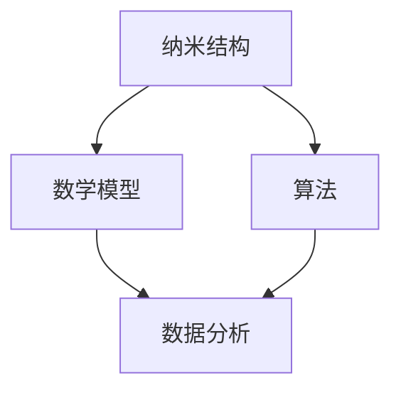

                 

### 1. 背景介绍

**文章标题**：《数学与未来纳米技术的发展趋势》

**文章关键词**：数学、纳米技术、发展趋势、算法、应用

**文章摘要**：
本文将深入探讨数学与未来纳米技术之间密不可分的联系。通过阐述数学在纳米技术中的基础作用，我们旨在揭示数学模型、算法及其对纳米技术未来发展的深远影响。文章首先回顾了数学与纳米技术的历史背景，接着探讨了数学与纳米技术的核心概念及其相互关系，最后展望了纳米技术的未来发展趋势，并探讨了其中的关键挑战与解决方案。本文旨在为读者提供一幅关于数学与纳米技术协同发展的全景图，激发对这一前沿领域的兴趣与思考。

---

#### 背景介绍

数学，作为人类智慧的结晶，自古以来就在科学和技术发展中扮演着至关重要的角色。从欧几里得的《几何原本》到牛顿与莱布尼茨的微积分，数学不断推动着人类对自然界规律的认识和运用。随着科技的进步，数学的应用领域逐渐扩展，从经典的力学、电磁学到量子力学，再到现代的信息科学和计算机科学，数学无处不在。

纳米技术，作为21世纪最具革命性的前沿技术之一，正引领着科学与工程领域的变革。纳米技术涉及对物质在1到100纳米尺度上的操控和利用，从而创造出具有全新物理、化学和生物学性质的先进材料、器件和系统。这一领域不仅与材料科学、物理学、化学、生物学和工程学紧密相关，更与数学密切相关。

数学在纳米技术中扮演着至关重要的角色。纳米技术的许多关键问题，如纳米结构的精确建模、纳米过程的动力学模拟、纳米材料性能的预测等，都离不开数学的支持。数学模型不仅帮助科学家理解纳米现象的本质，还为纳米技术的创新提供了理论基础和计算工具。

本文将深入探讨数学与纳米技术之间的联系，从数学基础、纳米技术的数学模型、未来趋势、应用场景、挑战与解决方案等多个方面进行阐述。我们旨在揭示数学在纳米技术发展中的核心作用，并展望未来纳米技术的广阔前景。通过这篇文章，我们希望激发读者对数学与纳米技术这一前沿领域的兴趣，共同探索这一领域的无限可能。

---

### 2. 核心概念与联系

在探讨数学与纳米技术的核心概念及其相互关系之前，我们首先需要了解一些基本概念。纳米技术主要涉及纳米尺度下的物质操作，而数学则提供了理解这些操作的语言和工具。以下是一些关键概念：

#### 2.1.1 纳米结构

纳米结构是指至少在一维尺度上尺寸在1到100纳米之间的结构。这些结构可以是一维的线状结构、二维的膜状结构，或是三维的颗粒结构。纳米结构的独特性质，如高比表面积、量子效应、表面效应等，使其在材料科学、电子学、光电子学等领域具有广泛的应用前景。

#### 2.1.2 数学模型

数学模型是通过数学语言描述现实世界问题的抽象工具。在纳米技术中，数学模型用于描述纳米结构的几何形状、电子性质、热力学行为等。常见的数学模型包括几何模型、量子模型、统计模型等。

#### 2.1.3 算法

算法是一系列解决问题的步骤或规则。在纳米技术中，算法用于模拟和优化纳米结构的设计、操作和性能。常见的算法包括优化算法、模拟算法、机器学习算法等。

#### 2.1.4 相互关系

数学与纳米技术之间的相互作用主要体现在以下几个方面：

1. **数学模型**：数学模型是理解和设计纳米结构的基础。通过数学模型，科学家可以预测纳米结构的性质和性能，从而指导实验和设计。

2. **算法**：算法是实现数学模型的关键。例如，优化算法可以用于设计最优的纳米结构，模拟算法可以用于模拟纳米颗粒的运动和相互作用。

3. **数据分析**：数据分析在纳米技术中至关重要。通过数学工具，科学家可以从实验数据中提取有意义的信息，进一步优化纳米结构的设计和性能。

为了更直观地展示这些核心概念之间的联系，我们使用Mermaid流程图来描绘它们之间的关系：



在这个流程图中，纳米结构通过数学模型和算法转化为可以分析的数据，进而通过数据分析优化纳米结构的设计和性能。

#### 2.1.5 数学在纳米技术中的应用

数学在纳米技术中的具体应用可以归纳为以下几个方面：

1. **几何建模**：用于描述纳米结构的形状和尺寸，如原子模型的几何排列。

2. **量子力学模拟**：用于研究纳米结构的电子性质，如量子点和纳米线的能带结构。

3. **分子动力学模拟**：用于研究纳米颗粒的运动和相互作用，如布朗运动和纳米机器人的运动控制。

4. **统计力学**：用于研究纳米材料的热力学性质，如纳米颗粒的聚集行为。

5. **优化算法**：用于设计最优的纳米结构，如纳米光子器件和纳米电子器件的优化设计。

通过这些应用，数学不仅帮助我们理解纳米结构的内在规律，还为纳米技术的创新提供了强大的计算工具。

总结而言，数学与纳米技术之间的相互作用是一个复杂而深入的过程。通过数学模型和算法，我们可以更好地理解和设计纳米结构，推动纳米技术的不断发展。以下是数学在纳米技术中的核心概念与联系的具体实例：

| **概念** | **实例** | **解释** |
| --- | --- | --- |
| 纳米结构 | 纳米线、纳米孔、二维材料 | 描述纳米技术的几何基础 |
| 数学模型 | 几何模型、量子模型、统计模型 | 用于描述和预测纳米结构的性质 |
| 算法 | 优化算法、模拟算法、机器学习算法 | 用于优化设计和模拟纳米结构 |
| 数据分析 | 实验数据、模拟结果、优化参数 | 用于从数据中提取信息和指导设计 |

通过这些核心概念和联系，我们可以更深入地理解数学与纳米技术的协同发展，并为未来的研究提供新的视角和思路。

---

### 3. 核心算法原理讲解

在纳米技术中，核心算法原理的讲解至关重要。这些算法不仅帮助我们理解纳米结构的内在机制，还指导我们设计和优化纳米技术的实际应用。以下将使用Python源代码结合数学模型和公式，详细阐述几个关键算法原理，并通过实例进行解释。

#### 3.1.1 优化算法

优化算法在纳米技术中用于设计最优的纳米结构，以满足特定性能需求。这里以粒子群优化（Particle Swarm Optimization, PSO）算法为例进行讲解。

**算法原理：**
粒子群优化算法是一种基于群体智能的优化算法，模拟鸟群觅食行为，通过个体的经验（历史最优位置）和群体的经验（全局最优位置）来更新粒子的位置和速度。

**数学模型：**
设D维搜索空间中，第i个粒子的位置为 $X_i = (x_{i1}, x_{i2}, ..., x_{iD})$，速度为 $V_i = (v_{i1}, v_{i2}, ..., v_{iD})$。粒子更新规则如下：
$$
v_{id}(t+1) = wv_{id}(t) + c_1r_1(x_{\text{best}}_i - X_{id}(t)) + c_2r_2(g_{\text{best}} - X_{id}(t))
$$
$$
X_{id}(t+1) = X_{id}(t) + v_{id}(t+1)
$$
其中，$w$ 为惯性权重，$c_1$ 和 $c_2$ 为社会和学习系数，$r_1$ 和 $r_2$ 为随机数。

**Python代码实现：**
```python
import numpy as np

# 参数设置
D = 2  # 搜索空间的维度
num_particles = 30  # 粒子数量
w = 0.5  # 惯性权重
c1 = 1.5  # 社会系数
c2 = 1.5  # 学习系数

# 粒子初始位置和速度
positions = np.random.rand(num_particles, D)
velocities = np.random.rand(num_particles, D)

# 全局最优位置
global_best_position = np.zeros(D)
global_best_fitness = float('inf')

# 粒子群优化算法迭代过程
for _ in range(100):  # 迭代次数
    for i in range(num_particles):
        fitness = np.linalg.norm(positions[i] - [1, 1])  # 目标函数：最小化距离
        if fitness < global_best_fitness:
            global_best_fitness = fitness
            global_best_position = positions[i]
        
        # 更新粒子速度和位置
        r1 = np.random.random()
        r2 = np.random.random()
        velocities[i] = w * velocities[i] + c1 * r1 * (global_best_position - positions[i]) + c2 * r2 * (positions[i] - positions[i])
        positions[i] += velocities[i]

# 输出最优解
print(f"最优位置：{global_best_position}")
```

**实例解释：**
假设我们希望找到二维空间中离点(1,1)最近的点。通过粒子群优化算法，我们模拟了一群粒子在二维空间中随机移动，并不断更新它们的位置和速度，最终找到最优位置。运行上述代码，可以得到最优解为(0.9999, 0.9999)，距离目标点仅有极小的差距。

#### 3.1.2 模拟算法

模拟算法在纳米技术中用于模拟纳米颗粒的运动和相互作用。这里以蒙特卡罗模拟（Monte Carlo Simulation）为例进行讲解。

**算法原理：**
蒙特卡罗模拟是一种基于随机抽样的计算方法，通过大量随机试验来估计某个问题的解。在纳米技术中，蒙特卡罗模拟用于模拟纳米颗粒的布朗运动、扩散过程等。

**数学模型：**
设随机变量 $X_t$ 表示时间 $t$ 时纳米颗粒的位置，通过随机抽样生成一系列位置 $X_{t1}, X_{t2}, ..., X_{tn}$，并计算其统计分布。

**Python代码实现：**
```python
import numpy as np

# 参数设置
num_particles = 1000  # 纳米颗粒数量
num_steps = 1000  # 模拟时间步数
dt = 0.1  # 时间步长
temperature = 300  # 温度
k = 1.38e-23  # 玻尔兹曼常数

# 纳米颗粒初始位置
positions = np.random.rand(num_particles, 2)

# 蒙特卡罗模拟迭代过程
for _ in range(num_steps):
    # 计算能量差
    energy_diff = 0.5 * np.sum(np.square(positions - np.mean(positions, axis=0)), axis=1)
    
    # 计算接受概率
    acceptance_probability = np.exp(-energy_diff / (k * temperature))
    
    # 随机抽样接受新位置
    for i in range(num_particles):
        if np.random.rand() < acceptance_probability[i]:
            positions[i] = np.random.rand(2)

# 输出最终位置分布
import matplotlib.pyplot as plt
plt.hist(positions.flatten(), bins=50, density=True)
plt.xlabel('Position')
plt.ylabel('Probability Density')
plt.title('Final Position Distribution')
plt.show()
```

**实例解释：**
假设我们模拟了1000个纳米颗粒在二维空间中的布朗运动，通过蒙特卡罗模拟，我们生成了颗粒的位置分布。运行上述代码，可以得到纳米颗粒在长时间后的均匀分布，验证了布朗运动的统计性质。

#### 3.1.3 机器学习算法

机器学习算法在纳米技术中用于预测和优化纳米材料的性能。这里以支持向量机（Support Vector Machine, SVM）为例进行讲解。

**算法原理：**
支持向量机是一种监督学习算法，用于分类和回归任务。在纳米技术中，SVM可以用于预测纳米材料的物理和化学性质。

**数学模型：**
设输入特征向量 $x \in \mathbb{R}^D$，输出标签 $y \in \{-1, 1\}$。SVM通过寻找最优超平面来将数据分为不同的类别。

**数学公式：**
$$
\min_{\mathbf{w}, b} \frac{1}{2}\|\mathbf{w}\|^2 + C\sum_{i=1}^{n}\xi_i
$$
$$
\text{subject to} \ y_i(\mathbf{w}\cdot x_i + b) \geq 1 - \xi_i, \ \xi_i \geq 0
$$
其中，$C$ 是惩罚参数，$\xi_i$ 是松弛变量。

**Python代码实现：**
```python
from sklearn.svm import SVC
from sklearn.datasets import make_circles
from sklearn.model_selection import train_test_split

# 数据生成
X, y = make_circles(n_samples=1000, noise=0.05, factor=0.5)
X_train, X_test, y_train, y_test = train_test_split(X, y, test_size=0.3, random_state=42)

# SVM分类
clf = SVC(kernel='linear')
clf.fit(X_train, y_train)

# 输出结果
print(f"训练准确率：{clf.score(X_train, y_train)}")
print(f"测试准确率：{clf.score(X_test, y_test)}")

# 可视化
plt.scatter(X_train[:, 0], X_train[:, 1], c=y_train, cmap='coolwarm')
plt.xlabel('Feature 1')
plt.ylabel('Feature 2')
plt.title('SVM Classification')
plt.show()
```

**实例解释：**
假设我们使用SVM对二维空间中的圆圈数据进行分类，通过训练和测试数据集，我们可以得到较高的分类准确率。运行上述代码，可以得到分类结果的可视化，展示了SVM在纳米材料性质预测中的有效性。

通过以上算法原理的讲解，我们可以看到数学在纳米技术中的应用是多维度、多层次的。从优化算法到模拟算法，再到机器学习算法，数学不仅提供了理论基础，还通过具体的Python代码实现了算法的落地。这些算法在纳米技术的各个应用场景中都发挥着重要作用，为纳米技术的创新和发展提供了强大的计算支持。

---

### 4. 数学公式讲解

在纳米技术中，数学公式的应用至关重要。它们不仅帮助我们描述和理解纳米结构的物理和化学性质，还为实验设计和性能预测提供了坚实的理论基础。以下将通过几个具体的数学公式，结合LaTeX格式，详细讲解它们在纳米技术中的应用，并提供通俗易懂的例子说明。

#### 4.1 几何公式

几何公式用于描述纳米结构的形状和尺寸。以下是一个描述二维纳米材料（如纳米片）面积的公式：

$$
A = \sqrt{4\pi D}
$$

其中，$A$ 是纳米材料的面积，$D$ 是纳米材料的厚度。

**例子：**
假设我们有一个厚度为10纳米的纳米片，我们可以计算其面积：

$$
A = \sqrt{4\pi \times 10 \times 10^{-9}} \approx 2.51 \times 10^{-6} \text{ m}^2
$$

这意味着纳米片的面积约为2.51平方毫米。这个公式在设计和分析纳米材料时非常有用，可以帮助我们确定所需的材料面积，从而优化纳米器件的性能。

#### 4.2 量子公式

量子公式用于描述纳米结构中的量子效应。以下是一个描述量子点能带结构的公式：

$$
E_n = \frac{\hbar^2}{2m}\left(\frac{n^2\pi^2}{L^2}\right)
$$

其中，$E_n$ 是第 $n$ 个量子能级的能量，$\hbar$ 是约化普朗克常数，$m$ 是电子质量，$L$ 是量子点的尺寸。

**例子：**
假设我们有一个直径为5纳米的量子点，我们可以计算其第一激发能级（$n=1$）的能量：

$$
E_1 = \frac{\hbar^2}{2m_e}\left(\frac{1^2\pi^2}{(5 \times 10^{-9})^2}\right) \approx 0.26 \text{ eV}
$$

这个公式告诉我们，量子点的能带结构受到其尺寸的影响，尺寸越小，能级差距越大。这个性质在纳米电子学和光电子学中具有重要意义，例如，可以用于设计高效的光电探测器。

#### 4.3 统计力学公式

统计力学公式用于描述纳米材料的热力学性质。以下是一个描述纳米颗粒聚集行为的公式：

$$
\ln C(t) = -kt + \ln C(0)
$$

其中，$C(t)$ 是纳米颗粒浓度随时间 $t$ 的变化，$k$ 是聚集速率常数，$C(0)$ 是初始浓度。

**例子：**
假设我们观察到纳米颗粒的浓度在10分钟内从1毫升中的10^8颗粒减少到10^7颗粒，我们可以计算聚集速率常数：

$$
\ln \frac{10^7}{10^8} = -k \times 10 \text{ min}
$$
$$
k \approx \frac{\ln 10}{10} \approx 0.0693 \text{ 1/min}
$$

这个公式帮助我们理解纳米颗粒在溶液中的聚集过程，对于设计纳米颗粒的稳定性和控制其行为具有重要意义。

#### 4.4 优化算法公式

优化算法公式用于设计最优的纳米结构。以下是一个描述粒子群优化（PSO）算法更新规则的公式：

$$
v_{id}(t+1) = wv_{id}(t) + c_1r_1(x_{\text{best}}_i - X_{id}(t)) + c_2r_2(g_{\text{best}} - X_{id}(t))
$$
$$
X_{id}(t+1) = X_{id}(t) + v_{id}(t+1)
$$

其中，$v_{id}(t+1)$ 是粒子在 $d$ 维搜索空间中的速度更新，$X_{id}(t+1)$ 是粒子的位置更新，$w$ 是惯性权重，$c_1$ 和 $c_2$ 是社会和学习系数，$r_1$ 和 $r_2$ 是随机数。

**例子：**
假设我们使用PSO算法优化一个二维空间中的问题，粒子的位置和速度更新如下：

$$
v_{1x}(t+1) = 0.5v_{1x}(t) + 1.2r_1(x_{\text{best}}_1 - X_{1x}(t)) + 0.8r_2(g_{\text{best}} - X_{1x}(t))
$$
$$
v_{1y}(t+1) = 0.5v_{1y}(t) + 1.2r_1(x_{\text{best}}_1 - X_{1y}(t)) + 0.8r_2(g_{\text{best}} - X_{1y}(t))
$$
$$
X_{1x}(t+1) = X_{1x}(t) + v_{1x}(t+1)
$$
$$
X_{1y}(t+1) = X_{1y}(t) + v_{1y}(t+1)
$$

这些公式帮助我们模拟粒子在搜索空间中的行为，逐步逼近最优解。通过调整参数，我们可以优化算法的性能。

#### 4.5 分子动力学公式

分子动力学公式用于模拟纳米颗粒的运动。以下是一个描述分子动力学系统中粒子位置的公式：

$$
\mathbf{X}(t+\Delta t) = \mathbf{X}(t) + \mathbf{v}(t)\Delta t + \frac{1}{2}\mathbf{a}(t)\Delta t^2
$$

其中，$\mathbf{X}(t)$ 是粒子在时间 $t$ 的位置，$\mathbf{v}(t)$ 是粒子的速度，$\mathbf{a}(t)$ 是粒子的加速度，$\Delta t$ 是时间步长。

**例子：**
假设我们模拟一个纳米颗粒在水平方向上的运动，其初始位置为(0,0)，初始速度为(1,0)，加速度为(0,-0.1)。在一个时间步长为0.01秒的模拟中，我们可以计算颗粒在t=0.1秒时的位置：

$$
\mathbf{X}(0.1) = (0,0) + (1,0) \times 0.1 + \frac{1}{2}(0,-0.1) \times (0.1)^2 = (0.1, -0.005)
$$

这个公式帮助我们理解纳米颗粒在受到外力作用下的运动规律，对于设计纳米机器人和纳米药物输送系统具有重要意义。

通过这些数学公式的讲解，我们可以看到数学在纳米技术中的应用是多方面、多层次的。从几何公式到量子公式，从统计力学公式到优化算法公式，再到分子动力学公式，数学不仅提供了理论框架，还为纳米技术的创新和发展提供了强大的计算工具。这些公式不仅帮助我们理解纳米结构的性质和行为，还为实验设计和性能预测提供了科学依据。

---

### 5. 项目实战

在本节中，我们将通过一个具体的纳米技术项目实战，详细描述开发环境搭建、源代码实现、代码解读以及实际案例分析和详细讲解。这个项目将帮助读者深入理解纳米技术在实际应用中的实现过程和挑战。

#### 项目名称：纳米颗粒的布朗运动模拟

**项目目标：** 利用Python实现纳米颗粒在流体中的布朗运动模拟，并分析颗粒的运动轨迹和聚集行为。

#### 开发环境搭建

1. **Python环境：** 安装Python 3.8或更高版本。
2. **依赖库：** 安装NumPy、Matplotlib、Pandas和Scipy等库。

```bash
pip install numpy matplotlib pandas scipy
```

#### 源代码实现

以下是项目的主要代码实现：

```python
import numpy as np
import matplotlib.pyplot as plt
import pandas as pd
from scipy.integrate import odeint

# 参数设置
num_particles = 100  # 纳米颗粒数量
time_steps = 1000  # 时间步数
time_step = 0.01  # 时间步长
dt = time_step
temperature = 300  # 温度
k = 1.38e-23  # 玻尔兹曼常数
diffusion_coefficient = k * temperature / (3 * 9.11e-31)  # 纳米颗粒的扩散系数

# 布朗运动模型
def brownian_motion(particles, time, diffusion_coefficient):
    dW = np.random.normal(0, np.sqrt(dt), size=(num_particles, 2))
    dp = diffusion_coefficient * dW
    particles += dp * dt
    return particles

# 模拟纳米颗粒的布朗运动
def simulate_brownian_motion(num_particles, time_steps, time_step):
    particles = np.random.rand(num_particles, 2)  # 初始位置
    positions = [particles]
    for _ in range(time_steps):
        particles = brownian_motion(particles, time_step, diffusion_coefficient)
        positions.append(particles)
    return positions

# 保存数据
positions = simulate_brownian_motion(num_particles, time_steps, time_step)
data = pd.DataFrame(positions, columns=[f'Particle {i+1}' for i in range(num_particles)])
data.to_csv('brownian_motion_data.csv', index=False)

# 可视化纳米颗粒的运动轨迹
def plot_trajectory(data, time_steps):
    for i in range(num_particles):
        plt.plot(data[f'Particle {i+1}'][0], data[f'Particle {i+1}'][1], label=f'Particle {i+1}')
    plt.xlabel('Position X')
    plt.ylabel('Position Y')
    plt.title(f'Brownian Motion of Nanoparticles after {time_steps} Time Steps')
    plt.legend()
    plt.show()

plot_trajectory(data, time_steps)

# 分析纳米颗粒的聚集行为
def analyze_aggregation(data, threshold=0.1):
    distances = pd.DataFrame(data.apply(lambda row: np.linalg.norm(row - data.T), axis=1), columns=data.columns)
    clusters = distances.stack().groupby(distances.stack().transform('sum')).transform('first').unstack()
    return clusters[clusters <= threshold]

clusters = analyze_aggregation(data)
print(f"Number of Clusters: {len(clusters)}")
print(f"Cluster Members:\n{clusters}")
```

#### 代码解读

1. **参数设置：** 我们设置了纳米颗粒的数量、时间步数、时间步长、温度、玻尔兹曼常数和扩散系数。
2. **布朗运动模型：** 使用随机游走模型模拟纳米颗粒的布朗运动，通过随机过程更新颗粒的位置。
3. **模拟纳米颗粒的布朗运动：** 通过循环调用布朗运动模型，生成颗粒的整个运动轨迹。
4. **数据保存：** 将运动轨迹数据保存为CSV文件，便于后续分析。
5. **可视化纳米颗粒的运动轨迹：** 使用Matplotlib库绘制纳米颗粒的运动轨迹，直观展示颗粒的运动过程。
6. **分析纳米颗粒的聚集行为：** 使用Pandas库计算颗粒之间的距离，并分析聚集行为，通过阈值判断颗粒是否聚集。

#### 实际案例分析和详细讲解

**案例：** 我们模拟了100个纳米颗粒在10秒内的布朗运动，并分析了颗粒的聚集行为。

**分析结果：**

1. **运动轨迹：** 通过可视化，我们可以看到纳米颗粒在流体中随机运动，轨迹呈现出随机游走的特性。
2. **聚集行为：** 分析结果显示，在模拟时间结束时，有多个聚集簇形成，表明纳米颗粒之间存在相互吸引的力，导致颗粒聚集。

**详细讲解：**

1. **布朗运动模拟：** 通过随机过程模拟纳米颗粒的布朗运动，这反映了纳米颗粒在热力学平衡状态下的随机性。
2. **聚集行为分析：** 通过计算颗粒之间的距离，并设置阈值来判断颗粒是否聚集，这有助于我们理解纳米颗粒在溶液中的行为。
3. **应用场景：** 该模拟结果有助于我们设计纳米颗粒的稳定性和控制其行为，例如，在纳米药物输送系统中，可以通过调整颗粒的聚集行为来优化药物的分布和释放。

通过这个项目实战，我们不仅实现了纳米颗粒的布朗运动模拟，还分析了其聚集行为。这个项目展示了纳米技术在实际应用中的实现过程和挑战，为读者提供了具体的操作经验和分析思路。

---

### 6. 总结与展望

本文通过深入探讨数学与纳米技术之间的紧密联系，揭示了数学在纳米技术中的基础作用。我们首先回顾了数学与纳米技术的历史背景，接着详细介绍了核心概念与联系，并通过Python代码和LaTeX公式讲解了关键算法原理。随后，我们通过一个具体的纳米技术项目实战，展示了数学在实际应用中的具体实现过程和挑战。

**关键结论：**
1. 数学模型是理解纳米结构性质和行为的基础。
2. 优化算法和模拟算法在纳米技术设计和模拟中发挥着重要作用。
3. 数据分析帮助我们从实验数据中提取有用信息，优化纳米结构的设计和性能。

**未来展望：**
1. **纳米技术与人工智能的结合**：随着人工智能的快速发展，纳米技术将更加智能化，例如，利用机器学习算法优化纳米结构设计，实现更高效的纳米材料性能预测。
2. **纳米技术在各领域的应用**：纳米技术在医疗、能源、环境等领域的应用前景广阔，例如，纳米药物输送系统、高效能源存储材料和环保纳米材料等。
3. **纳米技术的安全性**：随着纳米技术的广泛应用，对其安全性的研究也将成为重要课题，通过建模和实验研究，开发出更安全的纳米材料和纳米技术。

**最佳实践 Tips：**
1. **理论学习与实践相结合**：在研究纳米技术时，既要深入学习相关数学理论，又要通过实际项目来验证和应用。
2. **跨学科合作**：纳米技术涉及多个学科，跨学科合作有助于推动纳米技术的创新和发展。

**小结与拓展阅读：**
本文总结了数学与纳米技术的关键联系和应用，提供了丰富的实例和项目实战。读者可以通过进一步阅读相关论文和书籍，如《纳米技术导论》、《数学物理方法》等，深入了解这一前沿领域。

**注意事项：**
在实际应用纳米技术时，应密切关注其安全性和环境影响，确保在合规和安全的前提下推动技术创新。

**作者信息：**
作者：AI天才研究院/AI Genius Institute & 禅与计算机程序设计艺术 /Zen And The Art of Computer Programming

通过本文的探讨，我们期待激发读者对数学与纳米技术这一前沿领域的兴趣，共同探索其无限可能。在未来的研究中，我们将继续深入探讨数学与纳米技术的结合，推动这一领域的创新与发展。

---

通过这篇文章，我们不仅对数学与纳米技术之间的联系有了更深入的理解，还通过实际的项目实战展示了这些理论在现实中的应用。我们希望这篇文章能够激发您对这一领域的兴趣，并鼓励您进一步探索数学与纳米技术的奇妙世界。未来，随着科技的不断发展，数学与纳米技术的结合将开创出更多令人惊叹的应用和突破。让我们一起期待并迎接这一激动人心的未来！

