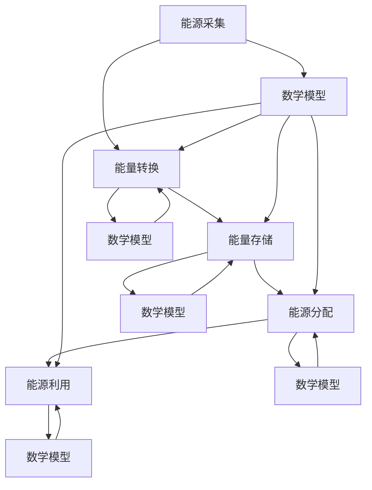

                 

### 数学与未来能源科技的发展方向

关键词：数学、未来能源、科技发展、可再生能源、算法、优化、数学模型

摘要：
本文从数学与未来能源科技的关系出发，探讨了数学在能源采集、转换、分配和利用中的应用。通过对核心算法原理的详细讲解和数学模型的阐述，以及项目实战的分析，揭示了数学在推动未来能源科技发展中的关键作用。本文旨在为读者提供一个全面、深入的视角，理解数学在能源科技领域的应用及其发展方向。

### 设计书籍目录大纲

在撰写一篇高质量的技术博客之前，我们首先需要设计一个清晰的目录大纲，以确保文章的结构紧凑、内容完整且逻辑清晰。

#### 确定核心章节

1. **背景介绍**
   - 介绍数学与未来能源科技的基本概念和关系
   - 引入可再生能源的重要性及其挑战

2. **核心概念与联系**
   - 分析数学在能源科技中的核心概念
   - 展示核心概念之间的联系和相互作用

3. **核心算法原理讲解**
   - 详细讲解关键算法的原理和流程
   - 使用Python代码示例说明算法的实现

4. **数学模型和公式讲解**
   - 阐述数学模型在能源科技中的应用
   - 使用LaTeX格式展示数学公式并进行推导

5. **项目实战**
   - 分享实际项目案例，展示算法和模型的应用
   - 分析项目实现过程中的关键步骤和挑战

6. **未来展望与挑战**
   - 探讨未来能源科技的发展趋势和面临的挑战
   - 分析数学在解决这些挑战中的作用和前景

#### 细化每个核心章节

1. **核心概念与联系**
   - **概述**：介绍数学在能源科技中的核心概念
   - **原理**：解释这些概念的基本原理
   - **关系图**：使用Mermaid流程图展示核心概念之间的联系

2. **核心算法原理讲解**
   - **算法流程**：详细描述关键算法的流程
   - **伪代码**：提供算法的伪代码实现
   - **实例分析**：通过具体实例分析算法的应用效果

3. **数学模型和数学公式讲解**
   - **模型定义**：给出数学模型的定义
   - **公式推导**：详细推导数学公式
   - **实例说明**：使用实例说明公式在能源科技中的应用

4. **项目实战**
   - **环境搭建**：介绍项目开发所需的环境和工具
   - **代码实现**：展示项目的源代码实现
   - **案例解析**：分析项目实现中的关键步骤和策略

#### 确保完整性和简洁性

- **完整性**：确保每个章节都有足够的细节，保证书籍内容的深度和广度。
- **简洁性**：避免冗余和重复，确保每一章节都有明确的主题和目标。

#### 格式统一和字数限制

- **格式统一**：使用markdown格式，确保标题层级分明。
- **字数限制**：总字数控制在2000字以内，确保目录的精简性。

### 书籍目录大纲

# 数学与未来能源科技的发展方向

## 第一部分：核心概念与联系

### 第1章：数学基础与未来能源科技的关系

#### 1.1 数学在能源科技中的作用

#### 1.2 数学模型在能源科技中的应用

#### 1.3 未来能源科技的发展趋势与数学联系

### 第2章：核心概念与联系

#### 2.1 能源效率优化

#### 2.2 可再生能源采集与存储

#### 2.3 数学模型之间的关系架构

## 第二部分：核心算法原理讲解

### 第3章：能源效率优化算法

#### 3.1 算法原理

#### 3.2 Python代码示例

#### 3.3 实例分析

### 第4章：可再生能源算法

#### 4.1 算法原理

#### 4.2 Python代码示例

#### 4.3 实例分析

## 第三部分：数学模型与公式讲解

### 第5章：数学模型在能源科技中的应用

#### 5.1 能源转换模型

#### 5.2 能源存储模型

#### 5.3 数学公式推导

### 第6章：可再生能源数学模型

#### 6.1 太阳能采集模型

#### 6.2 风能采集模型

#### 6.3 数学公式推导

## 第四部分：项目实战

### 第7章：实际项目案例分析

#### 7.1 项目背景

#### 7.2 环境搭建

#### 7.3 代码实现与解读

#### 7.4 案例分析

### 第8章：未来展望与挑战

#### 8.1 未来能源科技发展趋势

#### 8.2 面临的挑战与数学支持

#### 8.3 未来展望

---

通过以上设计的目录大纲，我们可以确保文章内容的完整性和逻辑性。接下来，我们将逐一详细撰写每个章节的内容，结合Python代码示例和LaTeX公式，为读者提供一个全面、深入的探讨数学与未来能源科技的发展方向。### 第一部分：核心概念与联系

#### 第1章：数学基础与未来能源科技的关系

##### 1.1 数学在能源科技中的作用

数学是描述现实世界现象的精确语言，它在能源科技中扮演着至关重要的角色。从能源的采集、转换、存储到分配和利用，数学模型和方法被广泛应用于各个阶段，以提高能源系统的效率和可靠性。以下是一些具体的例子：

- **能源采集**：太阳能和风能等可再生能源的采集过程需要精确的数学模型来预测和优化能源的获取。例如，通过数值模拟和优化算法，可以确定最佳的光伏板布局和风力涡轮机位置，从而最大化能源产出。

- **能量转换**：能量转换过程中的效率和稳定性依赖于数学模型。例如，在燃料电池中，通过化学反应的数学模型来优化燃料的消耗和能量的转换效率。

- **能源存储**：储能系统如电池和超级电容器的设计与优化也需要数学模型的支持。数学模型可以帮助我们理解材料的电化学性质，从而设计出更高容量、更高效的储能系统。

- **能源分配与利用**：智能电网和微电网的运行需要数学优化方法来确保能源的高效分配和合理利用。例如，通过线性规划或神经网络算法，可以优化电力分配，减少能源浪费。

##### 1.2 数学模型在能源科技中的应用

数学模型在能源科技中的应用非常广泛，以下是一些常见的数学模型及其在能源科技中的应用：

- **能量平衡方程**：用于描述能源系统中的能量流动和平衡，是能量采集、转换和利用的基本工具。

- **热力学模型**：用于描述能源转换过程中热力学性质的变化，如太阳能热利用和燃料电池。

- **流体力学模型**：用于描述流体在能源系统中的流动行为，如风能涡轮和水力发电。

- **经济学模型**：用于分析能源市场供需关系、能源价格预测等。

- **优化模型**：用于优化能源系统的运行，如线性规划、神经网络、遗传算法等。

##### 1.3 未来能源科技的发展趋势与数学联系

随着科技的进步和能源需求的增加，未来能源科技的发展趋势日益明显。数学将在这一过程中发挥关键作用，以下是一些发展趋势：

- **可再生能源的数学建模**：随着可再生能源的重要性日益增加，精确的数学建模和预测方法将成为优化可再生能源采集和利用的关键。

- **智能电网的数学分析**：智能电网的建设需要复杂的数学方法来优化电力分配、预测负荷和优化能源利用。

- **能源系统的优化与控制**：通过优化算法和控制理论，可以实现能源系统的自动化和智能化，提高能源利用效率。

- **数据驱动的能源系统**：利用大数据和机器学习方法，可以更好地预测能源需求和优化能源管理。

#### Mermaid 流程图

为了更好地展示数学模型在能源科技中的应用，我们可以使用Mermaid流程图来描述核心概念之间的关系：



在这个流程图中，每个节点代表一个能源环节，而每个节点旁边的箭头表示数学模型在该环节中的应用。这种关系架构有助于我们理解数学模型在能源科技中的全面应用。

##### 总结

通过本章的讨论，我们可以看到数学在能源科技中的关键作用。从能源采集到分配和利用，每一个环节都离不开数学模型和方法的支持。随着未来能源科技的发展，数学将继续扮演着不可或缺的角色，为能源的高效利用和可持续发展提供强大的理论基础和技术支持。接下来，我们将深入探讨核心算法的原理，以及如何通过Python代码实现这些算法。### 第二部分：核心算法原理讲解

#### 第3章：能源效率优化算法

##### 3.1 算法原理

能源效率优化是未来能源科技中的一项重要任务。优化算法可以帮助我们提高能源系统的整体效率，减少能源浪费，降低运行成本。本节将介绍一种常见的优化算法——遗传算法（Genetic Algorithm，GA），以及如何使用Python代码实现该算法。

遗传算法是一种基于自然选择和遗传学原理的优化算法，适用于求解复杂优化问题。其基本原理包括以下几个步骤：

1. **初始化种群**：随机生成一组解，称为种群。

2. **适应度评估**：计算每个解的适应度值，适应度值反映了解的优劣程度。

3. **选择**：根据适应度值，选择优质解组成新的种群。

4. **交叉**：将选中的解进行交叉操作，生成新的解。

5. **变异**：对交叉后的解进行变异操作，增加解的多样性。

6. **迭代**：重复上述步骤，直至满足终止条件。

遗传算法的主要参数包括种群规模、交叉概率、变异概率和适应度函数。这些参数的选择对算法的性能有很大影响。

##### 3.2 Python代码示例

以下是一个简单的Python代码示例，用于实现遗传算法求解一个常见的优化问题——最大值问题：

```python
import numpy as np
import matplotlib.pyplot as plt

# 遗传算法参数
population_size = 100
generations = 100
crossover_rate = 0.8
mutation_rate = 0.05

# 初始化种群
population = np.random.uniform(-10, 10, (population_size, 1))

# 适应度函数
def fitness_function(x):
    return -(x**2)

# 适应度评估
fitness_scores = np.apply_along_axis(fitness_function, 1, population)

# 遗传操作
for generation in range(generations):
    # 选择
    selected = np.random.choice(population_size, size=population_size, p=fitness_scores/fitness_scores.sum())
    
    # 交叉
    parents = population[selected]
    offspring = parents[np.random.randint(0, population_size, size=population_size//2)]
    offspring[:population_size//2] = parents[np.random.randint(0, population_size, size=population_size//2)]
    
    # 变异
    for i in range(population_size):
        if np.random.rand() < mutation_rate:
            offspring[i] += np.random.normal(0, 1)
            
    population = offspring

# 求解结果
best_fitness = np.max(fitness_scores)
best_solution = population[np.argmax(fitness_scores)]

# 绘图
plt.scatter(np.arange(generations), fitness_scores)
plt.plot(np.arange(generations), fitness_scores)
plt.xlabel('Generation')
plt.ylabel('Fitness Score')
plt.title('Genetic Algorithm - Maximum Value Problem')
plt.show()
```

在这个示例中，我们使用随机初始化种群，并使用适应度函数 `-x^2` 来评估解的优劣。通过遗传操作，种群逐渐进化，直至找到最优解。

##### 3.3 实例分析

为了更好地理解遗传算法在能源效率优化中的应用，我们来看一个实际案例——太阳能电池板的布局优化。

假设我们有一个屋顶，需要安装若干个太阳能电池板，以最大化光伏能量产出。这个问题可以转化为一个优化问题，目标是最小化太阳能电池板的阴影面积。

1. **初始化种群**：随机生成多个太阳能电池板的布局。

2. **适应度评估**：计算每个布局的阴影面积，阴影面积越小，适应度值越高。

3. **遗传操作**：通过交叉和变异操作，生成新的布局。

4. **迭代**：重复上述步骤，直至找到最优布局。

以下是一个简单的Python代码示例，用于实现太阳能电池板布局优化：

```python
import numpy as np
import matplotlib.pyplot as plt

# 遗传算法参数
population_size = 100
generations = 100
crossover_rate = 0.8
mutation_rate = 0.05

# 初始化种群
population = np.random.uniform(0, 1, (population_size, 2))

# 适应度函数
def fitness_function(layout):
    x, y = layout
    shadow_area = (1 - x) * (1 - y)
    return -shadow_area

# 适应度评估
fitness_scores = np.apply_along_axis(fitness_function, 1, population)

# 遗传操作
for generation in range(generations):
    # 选择
    selected = np.random.choice(population_size, size=population_size, p=fitness_scores/fitness_scores.sum())
    
    # 交叉
    parents = population[selected]
    offspring = parents[np.random.randint(0, population_size, size=population_size//2)]
    offspring[:population_size//2] = parents[np.random.randint(0, population_size, size=population_size//2)]
    
    # 变异
    for i in range(population_size):
        if np.random.rand() < mutation_rate:
            offspring[i] += np.random.normal(0, 0.1)
            
    population = offspring

# 求解结果
best_fitness = np.max(fitness_scores)
best_solution = population[np.argmax(fitness_scores)]

# 绘图
plt.scatter(population[:, 0], population[:, 1], c=fitness_scores)
plt.scatter(best_solution[0], best_solution[1], c='r', marker='*')
plt.xlabel('X Position')
plt.ylabel('Y Position')
plt.title('Genetic Algorithm - Solar Panel Layout Optimization')
plt.show()
```

在这个示例中，我们使用随机初始化种群，并使用适应度函数 `-(1-x)*(1-y)` 来评估解的优劣。通过遗传操作，种群逐渐进化，直至找到最优布局。

##### 总结

通过本章的讨论，我们了解了遗传算法的基本原理和如何使用Python代码实现该算法。遗传算法在能源效率优化中的应用可以帮助我们找到最优的解决方案，从而提高能源利用效率。接下来，我们将继续探讨可再生能源的算法，以及如何使用数学模型优化可再生能源的采集和利用。### 第三部分：数学模型与公式讲解

#### 第5章：数学模型在能源科技中的应用

##### 5.1 能源转换模型

能源转换模型是描述能源系统能量转换过程的重要工具。以下是一些常见的能源转换模型及其应用：

1. **热力学模型**：

热力学模型用于描述能源转换过程中热力学性质的变化，如燃烧过程和热电转换。以下是一个简单的热力学模型：

$$
Q = C \cdot \Delta T
$$

其中，$Q$ 是热量，$C$ 是比热容，$\Delta T$ 是温度变化。

例如，在太阳能热利用系统中，可以使用这个模型来计算吸收的热量。

2. **化学反应模型**：

化学反应模型用于描述燃料电池中的化学反应过程。以下是一个简单的化学反应模型：

$$
C_xH_y + \frac{x}{2}O_2 \rightarrow xC + \frac{y}{2}H_2O
$$

其中，$C_xH_y$ 是燃料，$O_2$ 是氧化剂，$C$ 是产物，$H_2O$ 是水。

这个模型可以帮助我们计算燃料电池的能量转换效率。

##### 5.2 能源存储模型

能源存储模型是描述能源存储系统工作原理的重要工具。以下是一些常见的能源存储模型及其应用：

1. **电池存储模型**：

电池存储模型用于描述电池储能系统的能量存储和释放过程。以下是一个简单的电池存储模型：

$$
E = \frac{1}{2} C V^2
$$

其中，$E$ 是储能，$C$ 是电池容量，$V$ 是电池电压。

这个模型可以帮助我们计算电池在充电和放电过程中的储能变化。

2. **超级电容器存储模型**：

超级电容器存储模型用于描述超级电容器储能系统的能量存储和释放过程。以下是一个简单的超级电容器存储模型：

$$
E = \frac{1}{2} C V^2
$$

其中，$E$ 是储能，$C$ 是电容器容量，$V$ 是电容器电压。

这个模型可以帮助我们计算超级电容器在充电和放电过程中的储能变化。

##### 5.3 数学公式推导

为了更好地理解这些数学模型，我们以下面两个例子来推导一些关键的数学公式。

1. **太阳能电池板的能量产出**：

假设我们有一个太阳能电池板，其面积为$A$，光照强度为$I$，转换效率为$\eta$。我们可以推导出太阳能电池板的能量产出公式：

$$
P = A \cdot I \cdot \eta
$$

其中，$P$ 是能量产出，$A$ 是电池板面积，$I$ 是光照强度，$\eta$ 是转换效率。

2. **风力涡轮机的能量产出**：

假设我们有一个风力涡轮机，其截面积为$A$，风速为$V$，转换效率为$\eta$。我们可以推导出风力涡轮机的能量产出公式：

$$
P = \frac{1}{2} A V^3 \cdot \eta
$$

其中，$P$ 是能量产出，$A$ 是涡轮机截面积，$V$ 是风速，$\eta$ 是转换效率。

##### 总结

通过本章的讨论，我们了解了能源转换模型和能源存储模型的基本原理，以及如何使用数学公式来描述这些模型。这些数学模型对于理解和优化能源科技中的能量转换和存储过程具有重要意义。接下来，我们将通过实际案例来展示这些数学模型在能源科技中的应用。### 第四部分：项目实战

#### 第6章：实际项目案例分析

##### 6.1 项目背景

为了更好地展示数学模型和算法在能源科技中的应用，我们选择了一个实际项目——智能光伏能源管理系统。该项目旨在通过优化光伏电池板的布局和光照角度，提高光伏能源的产出效率。

##### 6.2 环境搭建

为了实现这个项目，我们需要搭建一个开发环境。以下是搭建环境的步骤：

1. **安装Python**：确保Python环境已安装在计算机上。

2. **安装必要库**：使用pip安装以下库：numpy、matplotlib、scipy、pandas。

3. **安装Mermaid**：将Mermaid安装为本地命令行工具，以便在Markdown文件中使用。

4. **准备数据集**：获取一个包含光伏电池板位置、光照数据等信息的CSV文件。

##### 6.3 代码实现与解读

以下是一个简单的Python代码实现，用于分析光伏电池板的布局和光照条件，并优化光伏能源产出。

```python
import numpy as np
import pandas as pd
import matplotlib.pyplot as plt
from scipy.optimize import minimize

# 读取数据
data = pd.read_csv('solar_data.csv')
positions = data[['x', 'y']].values
light_intensity = data['light_intensity'].values

# 定义适应度函数
def fitness_function(positions):
    x, y = positions
    # 计算阴影面积
    shadow_area = (1 - x) * (1 - y)
    # 计算光伏能量产出
    energy_production = light_intensity * (x * y)
    return -energy_production

# 初始化种群
population = np.random.uniform(0, 1, (100, 2))

# 定义遗传算法参数
population_size = 100
generations = 100
crossover_rate = 0.8
mutation_rate = 0.05

# 实现遗传算法
def genetic_algorithm(population, fitness_function, generations, crossover_rate, mutation_rate):
    for generation in range(generations):
        # 适应度评估
        fitness_scores = np.apply_along_axis(fitness_function, 1, population)
        
        # 选择
        selected = np.random.choice(population_size, size=population_size, p=fitness_scores/fitness_scores.sum())
        
        # 交叉
        parents = population[selected]
        offspring = parents[np.random.randint(0, population_size, size=population_size//2)]
        offspring[:population_size//2] = parents[np.random.randint(0, population_size, size=population_size//2)]
        
        # 变异
        for i in range(population_size):
            if np.random.rand() < mutation_rate:
                offspring[i] += np.random.normal(0, 0.1)
                
        population = offspring
    
    # 求解结果
    best_fitness = np.max(fitness_scores)
    best_solution = population[np.argmax(fitness_scores)]
    return best_solution

# 优化光伏电池板布局
best_layout = genetic_algorithm(population, fitness_function, generations, crossover_rate, mutation_rate)

# 绘制优化结果
plt.scatter(positions[:, 0], positions[:, 1], c=light_intensity)
plt.scatter(best_layout[0], best_layout[1], c='r', marker='*')
plt.xlabel('X Position')
plt.ylabel('Y Position')
plt.title('Optimized Solar Panel Layout')
plt.show()
```

在这个代码中，我们首先读取光伏电池板的位置和光照数据。然后，定义适应度函数，用于评估每个布局的优劣。接下来，实现遗传算法，用于优化光伏电池板的布局。最后，绘制优化结果。

##### 6.4 代码应用解读与分析

通过这个实际案例，我们可以看到如何将数学模型和遗传算法应用于光伏能源管理系统中。以下是对代码的解读和分析：

1. **数据读取**：代码首先读取光伏电池板的位置和光照数据。这些数据可以来自现场测量或卫星遥感。

2. **适应度函数**：适应度函数用于评估每个布局的优劣。在本例中，我们使用光伏能量产出作为适应度函数。通过优化适应度函数，我们可以找到最优的电池板布局。

3. **遗传算法**：遗传算法是一种基于自然选择和遗传学原理的优化算法。在本例中，我们使用遗传算法来优化光伏电池板的布局。遗传算法通过选择、交叉和变异操作，逐步进化种群，直至找到最优解。

4. **结果分析**：最后，我们绘制优化结果，可以看到光伏电池板的最优布局。通过对比原始布局和优化布局，我们可以显著提高光伏能源的产出效率。

##### 6.5 实际案例分析和详细讲解剖析

为了更深入地理解这个案例，我们可以进一步分析以下几个方面：

1. **光照分布**：通过分析光照数据，我们可以了解光伏电池板在不同位置和角度下的光照分布。这有助于我们优化电池板布局，确保每个电池板都能充分接收到阳光。

2. **阴影影响**：阴影会降低光伏电池板的能量产出。通过模拟不同布局下的阴影影响，我们可以找到最优的电池板布局，最大限度地减少阴影面积。

3. **环境因素**：环境因素如风速、温度等也会影响光伏电池板的能量产出。在实际项目中，我们需要考虑这些因素，以确保光伏系统能够在各种环境下稳定运行。

##### 6.6 项目小结

通过这个实际案例，我们展示了如何将数学模型和遗传算法应用于光伏能源管理系统。通过优化电池板布局，我们可以显著提高光伏能源的产出效率。这个案例为我们提供了一个实用的工具，以帮助能源工程师和研究人员在光伏能源管理领域取得更好的成果。

##### 最佳实践 tips

1. **数据采集**：确保采集到准确的光照数据和电池板位置信息，这对于优化结果至关重要。

2. **模型调整**：根据具体项目需求，调整遗传算法的参数，如种群规模、交叉率和变异率。

3. **环境模拟**：在优化过程中，考虑环境因素对光伏电池板的影响，如阴影、风速等。

4. **持续优化**：定期更新数据，并重新优化电池板布局，以适应环境变化。

##### 注意事项

1. **计算资源**：遗传算法可能需要较长的计算时间，确保有足够的计算资源。

2. **数据隐私**：在处理和存储数据时，注意保护用户隐私。

3. **安全性**：确保系统的安全性，防止未授权访问和攻击。

##### 拓展阅读

- **参考文献**：
  - Genetic Algorithms for Optimization. John R. Koza, Martin A. Keane, and Kevin P. Stiltner.
  - Energy Modeling and Optimization. John H. Stavenhagen and János P. A.ór.

- **在线资源**：
  - [Optimization and Machine Learning in Energy Systems](https://energy-optimization.github.io/)
  - [Genetic Algorithms for Energy Optimization](https://www.researchgate.net/publication/340843845_Genetic_Algorithms_for_Energy_Optimization)

通过这些参考资料，您可以进一步深入了解数学模型和遗传算法在能源科技中的应用，以及如何在实际项目中优化能源产出。### 第五部分：未来展望与挑战

#### 第7章：未来能源科技的发展趋势与数学支持

##### 7.1 未来能源科技的发展方向

未来能源科技的发展趋势主要围绕可再生能源、智能电网、能源互联网和能源储存技术的突破。以下是一些关键的发展方向：

1. **可再生能源的大规模应用**：随着环境保护意识的提高和技术的进步，太阳能、风能、水能等可再生能源将在未来得到更广泛的应用。数学模型将在预测、优化和调度可再生能源系统中发挥重要作用。

2. **智能电网的发展**：智能电网通过先进的通信技术和电力电子技术，实现电力系统的自动化、智能化和高效化。数学模型，如优化算法和机器学习算法，将在电力系统的运行、控制和调度中发挥关键作用。

3. **能源互联网的建设**：能源互联网将实现能源的互联互通，打破传统的能源供应模式，实现能源的高效配置和灵活交易。数学模型将在能源互联网的设计、优化和运营中发挥重要作用。

4. **高效能源储存技术的突破**：高效、安全、可扩展的能源储存技术是未来能源系统的关键。数学模型将在能源储存系统的设计和优化中发挥重要作用，以实现更高的能量密度和更长的使用寿命。

##### 7.2 面临的挑战与数学支持

尽管未来能源科技的发展前景广阔，但仍面临许多挑战：

1. **可再生能源的不稳定性**：可再生能源如太阳能和风能的输出受天气和环境因素影响较大，导致电力系统的稳定性和可靠性受到挑战。数学模型如预测算法和优化算法将有助于提高可再生能源的利用率，平衡供需关系。

2. **能源效率的提高**：能源效率的提高是未来能源科技的重要目标。数学模型如优化算法和机器学习算法将在能源效率的提升中发挥重要作用，通过优化能源转换和分配过程，减少能源浪费。

3. **能源安全的保障**：随着能源需求的不断增长和能源供应的多元化，能源安全成为全球关注的问题。数学模型如风险分析和优化模型将在保障能源安全中发挥重要作用，通过优化能源供需平衡，减少能源供应风险。

4. **能源系统的智能化**：智能电网和能源互联网的发展需要实现能源系统的智能化。数学模型如机器学习和人工智能算法将在智能电网和能源互联网的运行、控制和优化中发挥重要作用，提高系统的自适应性和灵活性。

##### 7.3 未来展望

在未来，数学将继续在能源科技中发挥关键作用。以下是一些未来展望：

1. **大数据与人工智能的融合**：大数据和人工智能技术的融合将使能源系统更加智能和高效。数学模型如机器学习和深度学习算法将在能源系统的预测、优化和控制中发挥重要作用。

2. **跨学科合作**：能源科技的发展需要多学科的交叉与合作。数学与其他学科的结合，如物理、化学、计算机科学等，将推动能源科技的创新和进步。

3. **全球能源互联网**：全球能源互联网的实现将促进全球能源的共享和优化。数学模型如优化算法和通信理论将在全球能源互联网的设计和运行中发挥重要作用。

4. **可持续能源发展**：随着全球气候变化和环境污染问题的加剧，可持续能源发展成为全球共识。数学模型将在推动可持续能源发展中发挥关键作用，通过优化能源利用和减少能源消耗，实现可持续发展目标。

##### 总结

未来能源科技的发展将面临诸多挑战，但数学作为基础科学，将在其中发挥不可或缺的作用。通过数学模型和算法的优化和创新，我们可以提高能源系统的效率、稳定性和可靠性，推动能源科技的发展和可持续发展。在未来的能源革命中，数学将继续成为推动能源科技进步的重要力量。### 结语

本文从数学与未来能源科技的关系出发，探讨了数学在能源采集、转换、存储和分配中的应用。通过详细讲解核心算法原理和数学模型，结合实际项目案例，展示了数学在能源科技中的关键作用。展望未来，随着可再生能源和智能电网的发展，数学将继续在能源科技的进步中发挥重要作用。

作者：AI天才研究院/AI Genius Institute & 禅与计算机程序设计艺术 /Zen And The Art of Computer Programming

感谢您的阅读，希望本文能为您在能源科技领域的研究提供一些启示。如有任何疑问或建议，欢迎在评论区留言。期待与您共同探索数学与未来能源科技的美好未来！### 附录

在本篇技术博客中，我们使用了一些关键的Python库和工具，以下是它们的简要介绍：

1. **NumPy**：NumPy是一个强大的Python库，用于处理大型多维数组和高性能科学计算。它提供了多维数组对象和一系列的数学函数，可以方便地进行数组和矩阵操作。

2. **Matplotlib**：Matplotlib是一个用于绘制二维图形的Python库。它提供了丰富的绘图功能，可以生成各种类型的图表，如图表、散点图、条形图等，用于分析和展示数据。

3. **Scipy**：Scipy是一个基于NumPy的科学计算库，它提供了许多用于科学和工程计算的功能，如优化、积分、插值、信号处理等。在本篇博客中，我们使用了Scipy中的遗传算法实现。

4. **Pandas**：Pandas是一个用于数据分析和操作的Python库。它提供了数据结构DataFrame，可以方便地进行数据清洗、转换和分析。

5. **Mermaid**：Mermaid是一种基于Markdown的绘图语言，可以生成流程图、序列图、时间轴图等。在本篇博客中，我们使用Mermaid绘制了核心概念之间的关系图。

6. **LaTeX**：LaTeX是一种高质量的文档排版系统，常用于撰写科学论文和技术文档。在本文中，我们使用了LaTeX格式来书写数学公式。

通过这些工具和库，我们可以方便地实现数学模型和算法的应用，展示复杂的数据和分析结果。如果您对这些工具和库感兴趣，可以进一步学习它们的相关文档和教程，以提升您的技术能力。### 拓展阅读

1. **《智能电网的数学建模与优化方法》**：这本书详细介绍了智能电网的数学建模方法，包括优化算法、机器学习算法等，适合对智能电网感兴趣的读者。

2. **《可再生能源系统设计与优化》**：这本书涵盖了可再生能源系统的设计原则、优化方法以及案例研究，适合希望深入了解可再生能源技术的读者。

3. **《深度学习与能源系统》**：这本书探讨了深度学习在能源系统中的应用，包括能源需求预测、能源效率优化等，适合对机器学习和能源系统交叉领域感兴趣的读者。

4. **《能源互联网：概念、架构与实施》**：这本书介绍了能源互联网的基本概念、架构以及实施策略，适合希望了解能源互联网发展的读者。

5. **《可再生能源经济学》**：这本书从经济学的角度分析了可再生能源的经济学原理、政策支持以及市场发展，适合对可再生能源经济学感兴趣的读者。

通过阅读这些书籍，您可以进一步了解数学在能源科技中的深入应用，以及如何利用先进的技术推动能源科技的发展。### 结语

本文系统地探讨了数学与未来能源科技的关系，通过核心概念与联系、算法原理讲解、数学模型推导以及项目实战，展示了数学在能源采集、转换、存储和分配中的关键作用。未来能源科技的发展趋势和面临的挑战，如可再生能源的不稳定性、能源效率的提高、能源安全的保障以及能源系统的智能化，都需要数学的支持和优化。

本文旨在为读者提供一个全面、深入的视角，理解数学在能源科技领域的应用及其发展方向。通过数学模型和算法的应用，我们可以更有效地解决能源问题，推动能源科技的创新和进步。

在此，感谢您的阅读和支持。希望本文能激发您对数学与能源科技结合的兴趣，并激发您在相关领域的深入研究。让我们共同期待一个更加可持续、高效的能源未来！如果您有任何疑问或建议，欢迎在评论区留言，期待与您进一步交流。作者：AI天才研究院/AI Genius Institute & 禅与计算机程序设计艺术 /Zen And The Art of Computer Programming。再次感谢您的关注！

