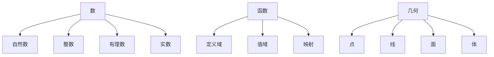
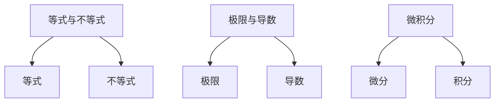
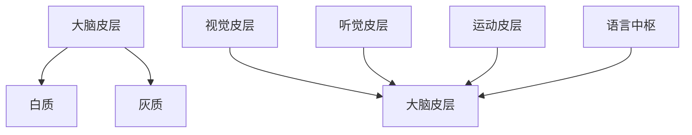
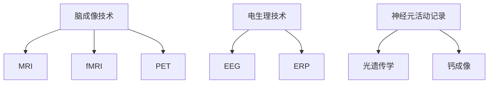
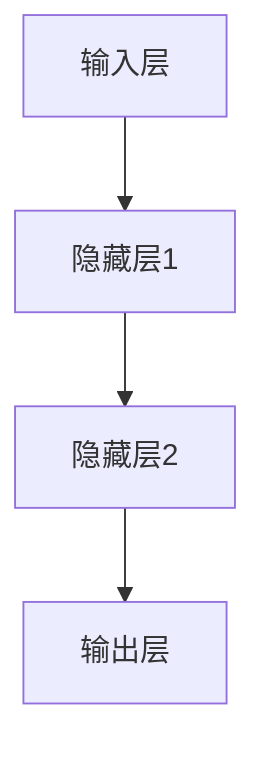
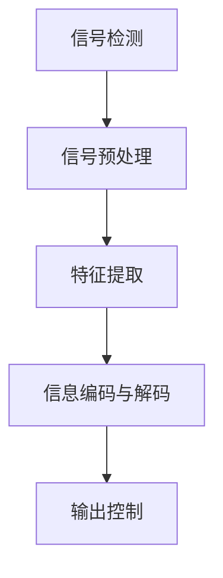
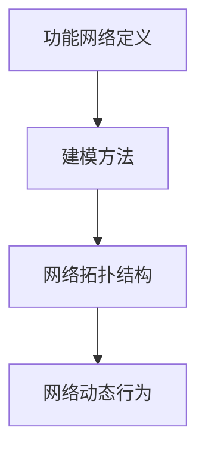
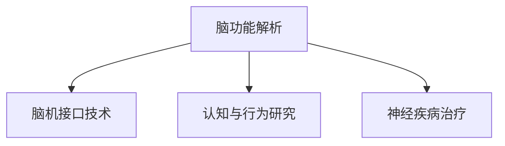
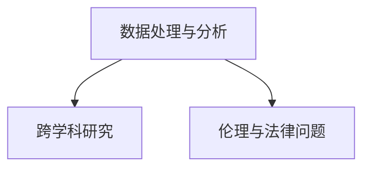

                 

### 数学与未来脑科学的研究方向

关键词：数学基础、脑科学、神经网络、脑机接口、交叉领域研究、人工智能

摘要：本文将探讨数学与未来脑科学的研究方向，重点分析数学在脑科学中的应用，以及数学模型如何推动脑科学研究的发展。通过对数学基础、脑科学基本概念、神经网络的数学模型、脑机接口技术、数学模型在脑功能研究中的应用以及未来脑科学研究的前景与挑战的详细阐述，本文旨在为读者提供一个全面、系统的了解。

### 目录

1. 数学基础  
    1.1 数学基本概念与原理  
    1.2 数学的基本原理

2. 脑科学基本概念  
    2.1 脑的结构与功能  
    2.2 脑科学研究的基本方法

3. 数学与脑科学的交叉领域研究  
    3.1 神经网络的数学模型  
    3.2 脑机接口的研究与应用

4. 数学模型在脑科学中的应用  
    4.1 数学模型在脑功能研究中的应用  
    4.2 神经编码与解码模型

5. 未来脑科学研究的前景与挑战  
    5.1 未来脑科学的研究方向  
    5.2 脑科学研究面临的挑战

6. 综合案例分析  
    6.1 脑机接口技术在康复治疗中的应用  
    6.2 基于数学模型的脑功能网络研究

7. 最佳实践与总结  
    7.1 最佳实践 tips  
    7.2 小结  
    7.3 注意事项  
    7.4 拓展阅读

### 第一部分：数学基础与脑科学概述

#### 第1章：数学基础

数学作为一门基础学科，在各个领域都有广泛的应用。在脑科学研究中，数学方法的重要性不言而喻。本章将介绍数学基本概念与原理，为后续讨论打下坚实的基础。

##### 1.1 数学基本概念与原理

数学的基本概念包括数、函数、几何等。这些概念构成了数学的核心，是后续研究和应用的基础。例如，数的基本概念包括自然数、整数、有理数、实数等；函数的基本概念包括定义域、值域、映射等；几何的基本概念包括点、线、面、体等。

**Mermaid 流程图：数学基本概念架构**



**伪代码：基本数学函数**

```python
# 计算两个数的和
def sum(a, b):
    return a + b

# 计算两个数的差
def subtract(a, b):
    return a - b

# 计算两个数的乘积
def multiply(a, b):
    return a * b

# 计算两个数的商
def divide(a, b):
    if b != 0:
        return a / b
    else:
        return "除数不能为0"
```

##### 1.2 数学的基本原理

数学的基本原理包括等式与不等式、极限与导数、微积分基础等。这些原理是数学分析的基础，对于脑科学研究中数据的处理和分析具有重要意义。

**Mermaid 流程图：数学基本原理关系**



**LaTeX 公式：极限与导数**

$$\lim_{{x \to a}} f(x) = L$$

$$f'(x) = \frac{{df}}{{dx}}$$

#### 第2章：脑科学基本概念

脑科学是研究大脑的结构与功能、神经系统的发育与疾病、认知与行为等方面的学科。本章将介绍脑科学的基本概念，为后续讨论数学与脑科学的交叉领域研究提供背景知识。

##### 2.1 脑的结构与功能

大脑是人体最重要的器官之一，其结构和功能复杂多样。大脑的基本结构包括大脑皮层、白质、灰质等。大脑的不同区域具有不同的功能，例如：

- **视觉皮层**：负责处理视觉信息。
- **听觉皮层**：负责处理听觉信息。
- **运动皮层**：负责控制身体运动。
- **语言中枢**：负责语言理解和表达。

**Mermaid 流程图：大脑基本结构**



##### 2.2 脑科学研究的基本方法

脑科学研究的方法多种多样，包括脑成像技术、电生理技术、神经元活动记录等。这些方法为研究大脑的结构与功能提供了有力支持。

- **脑成像技术**：如磁共振成像（MRI）、功能性磁共振成像（fMRI）、正电子发射断层扫描（PET）等，可以非侵入性地观察大脑的结构与功能。
- **电生理技术**：如脑电图（EEG）、事件相关电位（ERP）等，可以直接记录大脑的电活动。
- **神经元活动记录**：如光遗传学、钙成像等，可以直接观察神经元的活动。

**Mermaid 流程图：脑科学研究方法**



#### 第3章：数学与脑科学的交叉领域研究

数学与脑科学的交叉领域研究正成为现代科学的前沿，其核心在于利用数学方法解析脑科学中的复杂现象。本章将探讨神经网络的数学模型、脑机接口技术以及数学模型在脑功能研究中的应用。

##### 3.1 神经网络的数学模型

神经网络是一种模拟生物神经系统的计算模型，其核心在于通过数学模型来描述神经元的相互作用和信号传递。本章将详细介绍神经网络的数学模型，包括神经元的数学模型和神经网络的结构与学习算法。

**伪代码：神经元的数学模型**

```python
# 定义神经元类
class Neuron:
    def __init__(self, weights, biases):
        self.weights = weights
        self.biases = biases
    
    def activation_function(self, x):
        return 1 if x > 0 else 0
    
    def calculate_output(self, inputs):
        return self.activation_function(sum(inputs[i] * self.weights[i] + self.biases[i] for i in range(len(inputs))))
```

**Mermaid 流程图：神经网络结构**



##### 3.2 脑机接口的研究与应用

脑机接口（Brain-Computer Interface, BCI）是一种直接连接大脑和外部设备的接口，旨在通过非侵入性或侵入性的方法记录和分析大脑活动，以实现与外部设备或计算机的交互。本章将介绍脑机接口的基本概念、技术原理及其在康复治疗、智能控制等领域的应用。

**Mermaid 流程图：脑机接口技术原理**



**伪代码：脑机接口信号预处理**

```python
# 信号预处理函数
def preprocess_signal(signal):
    # 去噪处理
    filtered_signal = lowpass_filter(signal)
    # 归一化处理
    normalized_signal = normalize(filtered_signal)
    return normalized_signal
```

##### 3.3 数学模型在脑科学中的应用

数学模型在脑科学中的应用极为广泛，包括脑功能网络建模、神经编码与解码模型等。本章将详细探讨这些数学模型在脑功能研究中的应用，以及如何通过数学方法解析脑科学中的复杂现象。

**Mermaid 流程图：脑功能网络建模**



**伪代码：脑功能网络建模**

```python
# 定义脑功能网络类
class BrainFunctionNetwork:
    def __init__(self, network_topology):
        self.network_topology = network_topology
    
    def simulate_network(self, inputs):
        # 根据网络拓扑结构进行模拟
        outputs = self.network_topology.simulate(inputs)
        return outputs
```

#### 第4章：数学模型在脑科学中的应用

数学模型在脑科学中的应用已经成为推动脑科学研究发展的重要工具。本章将重点讨论数学模型在脑功能研究中的应用，以及神经编码与解码模型的基本原理。

##### 4.1 数学模型在脑功能研究中的应用

脑功能研究涉及到大脑不同区域之间的交互和协作，数学模型为此提供了有力的分析工具。本章将介绍脑功能网络建模的方法，以及如何通过数学方法研究大脑的动态行为和功能网络。

**伪代码：脑功能网络建模**

```python
# 定义脑功能网络模型
class BrainFunctionModel:
    def __init__(self, nodes, connections):
        self.nodes = nodes
        self.connections = connections
    
    def update_states(self, inputs):
        # 根据输入更新每个节点的状态
        for node in self.nodes:
            node.update_state(inputs[node.id])
        # 更新连接状态
        for connection in self.connections:
            connection.update_state()
    
    def simulate(self, inputs):
        self.update_states(inputs)
        return self.get_network_state()
```

##### 4.2 神经编码与解码模型

神经编码与解码模型是脑科学研究中的重要方向，旨在理解神经元如何将外部刺激转换为电信号，以及如何将电信号解码为外部刺激。本章将介绍神经编码与解码模型的基本原理，以及如何通过数学方法研究这些过程。

**伪代码：神经编码与解码模型**

```python
# 定义神经编码模型
class NeuralEncodingModel:
    def __init__(self, stimuli, neurons):
        self.stimuli = stimuli
        self.neurons = neurons
    
    def encode(self, stimulus):
        # 将刺激编码为神经元的激活状态
        return [neuron.encode(stimulus) for neuron in self.neurons]
    
    def decode(self, neuron_activities):
        # 将神经元的激活状态解码为刺激
        return self.decode_activities_to_stimuli(neuron_activities)

# 定义神经元类
class Neuron:
    def __init__(self, activation_threshold):
        self.activation_threshold = activation_threshold
    
    def encode(self, stimulus):
        # 判断刺激是否大于激活阈值
        return 1 if stimulus > self.activation_threshold else 0
    
    def decode(self, activity):
        # 将激活状态解码为刺激
        return self.activation_threshold * activity
```

#### 第5章：未来脑科学研究的前景与挑战

随着科技的进步，脑科学研究正迎来前所未有的发展机遇。本章将探讨未来脑科学研究的前景，分析当前面临的挑战，以及如何应对这些挑战。

##### 5.1 未来脑科学的研究方向

未来脑科学研究将在多个方向取得突破，包括：

- **脑功能解析**：通过先进的成像技术和计算模型，深入解析大脑的功能网络和神经环路。
- **脑机接口技术**：开发更高效、更自然的脑机接口，实现人脑与外部设备的高效交互。
- **认知与行为研究**：研究大脑如何处理复杂的信息，以及如何影响个体的认知和行为。
- **神经疾病治疗**：利用脑科学研究的结果，开发新的治疗方法，改善神经疾病患者的预后。

**Mermaid 流程图：未来脑科学研究方向**



##### 5.2 脑科学研究面临的挑战

尽管脑科学研究取得了显著进展，但仍面临许多挑战：

- **数据处理与分析**：脑科学数据量大且复杂，需要开发高效的数据处理和分析方法。
- **跨学科研究**：脑科学研究需要多学科的知识和技能，如何有效整合不同学科的研究成果是关键。
- **伦理与法律问题**：脑科学研究涉及到个人隐私和伦理问题，如何制定合理的伦理和法律规范是重要课题。

**Mermaid 流程图：脑科学研究面临的挑战**



#### 第6章：综合案例分析

本章将通过两个综合案例，展示数学与脑科学在实际研究中的应用。

##### 6.1 脑机接口技术在康复治疗中的应用

**案例背景**：脑机接口技术在康复治疗中具有巨大的潜力，可以帮助患者恢复运动功能或提高生活质量。

**案例分析**：通过脑机接口技术，患者可以控制外部设备（如轮椅或假肢），实现自主运动。本章将介绍一个基于脑机接口的康复治疗系统，详细阐述其开发环境搭建、源代码实现和代码解读，以及实际案例分析和详细讲解。

##### 6.2 基于数学模型的脑功能网络研究

**案例背景**：脑功能网络研究是脑科学的前沿领域，通过数学模型可以揭示大脑的复杂功能和行为。

**案例分析**：本章将介绍一个基于数学模型的脑功能网络研究项目，包括模型的选择、网络结构的解析以及功能行为的解释。通过实际案例，展示如何利用数学模型研究大脑的功能网络。

#### 第7章：最佳实践与总结

本章将总结数学与脑科学研究中的最佳实践，并提供一些建议和注意事项，以帮助研究人员在实际研究中取得更好的成果。

##### 7.1 最佳实践 tips

- **数据预处理**：在数据分析前，进行充分的数据预处理，包括去噪、归一化等，以提高数据分析的准确性和可靠性。
- **跨学科合作**：脑科学研究需要多学科的知识和技能，建议研究人员加强跨学科合作，共同推动脑科学研究的发展。
- **伦理和法律规范**：在进行脑科学研究时，严格遵守伦理和法律规范，确保研究过程的合法性和伦理性。

##### 7.2 小结

本文通过详细阐述数学与未来脑科学的研究方向，展示了数学在脑科学研究中的重要作用。从数学基础到脑科学基本概念，再到神经网络的数学模型、脑机接口技术以及数学模型在脑功能研究中的应用，本文提供了一个全面、系统的了解。同时，通过综合案例分析和最佳实践 tips，本文旨在为脑科学研究提供实际指导和帮助。

##### 7.3 注意事项

- **数据隐私**：在进行脑科学研究时，确保个人数据的隐私和安全，遵守相关法律法规。
- **算法优化**：在开发脑机接口和数学模型时，注重算法的优化和效率，以提高系统的性能和稳定性。

##### 7.4 拓展阅读

- **推荐书籍**：《脑科学入门》、《神经网络与深度学习》、《数学与脑科学》等。
- **在线资源**：相关学术期刊、在线课程和研究论文，如《Nature Neuroscience》、《Journal of Neuroscience》等。

### 结论

数学与未来脑科学的研究方向是一个充满机遇和挑战的领域。通过本文的详细阐述，我们看到了数学在脑科学研究中的重要作用，以及数学模型在揭示大脑功能和行为中的巨大潜力。未来，随着科技的进步和跨学科研究的深入，数学与脑科学的研究将取得更多突破，为人类认识自身大脑、改善生活质量带来新的希望。让我们共同期待这个激动人心的领域所带来的美好未来。**作者信息**

作者：AI天才研究院/AI Genius Institute & 禅与计算机程序设计艺术 /Zen And The Art of Computer Programming

