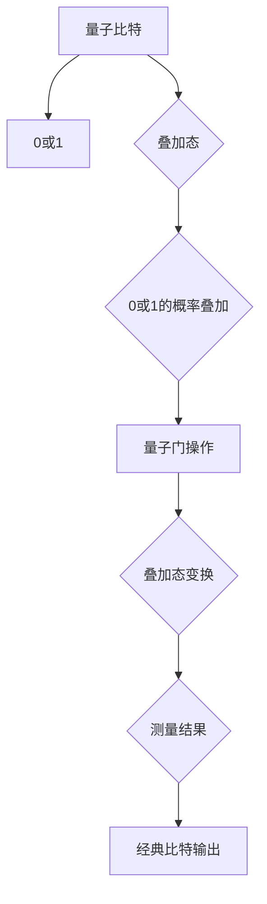
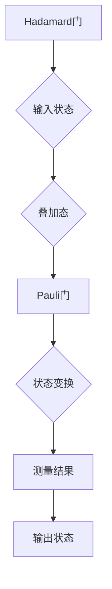

                 

**1. 引言：研究背景与意义**

量子计算是近年来信息技术领域的一颗璀璨明星，它的兴起带来了计算能力的新革命。传统的经典计算机基于布尔逻辑和比特进行信息处理，而量子计算机则利用量子力学的基本原理，通过量子比特（qubit）实现超强的计算能力。量子计算的基本原理包括量子叠加、量子纠缠和量子门等，这些原理使得量子计算机在解决某些特定问题上展现出巨大的潜力。

首先，量子计算的兴起源于对经典计算局限性的认识。经典计算机虽然在处理大量数据和复杂计算方面表现出色，但在面对诸如大数质因数分解、组合优化问题等特定问题时，效率极低。而量子计算机通过量子叠加和量子纠缠，能够在极短时间内完成传统计算机难以完成的任务。例如，Shor算法能够在多项式时间内完成大数质因数分解，而Grover算法则能显著提高数据库搜索效率。

其次，量子计算在数学领域有着广泛的应用前景。量子算法的提出和发展，为许多经典的数学问题提供了新的解决思路。例如，量子搜索算法能够高效地解决图论中的搜索问题；量子随机游走算法在解决随机图问题方面显示出巨大优势；量子整数分解算法则为大数质因数分解提供了新路径。

此外，量子计算的未来发展方向也引起了广泛的关注。随着量子计算机的不断发展，它将在密码学、优化问题、组合优化等领域发挥重要作用。同时，量子计算与经典计算的结合也将推动计算机科学和数学的交叉发展，为科学研究和工业生产带来新的突破。

综上所述，量子计算的兴起不仅是对传统计算模式的颠覆，更是对未来信息技术发展的深远影响。研究量子计算在数学领域的应用和未来发展，对于推动科技进步和解决实际问题具有重要意义。

**2. 量子计算的基本原理**

量子计算的基本原理源于量子力学，其中量子比特（qubit）是量子计算机的核心。与经典比特不同，量子比特不仅可以表示0和1，还可以同时处于0和1的叠加态。这种叠加态使得量子计算机能够并行处理多个状态，从而实现指数级别的计算速度提升。

**2.1 量子比特与经典比特的比较**

经典比特是信息的基本单元，它只能处于两种状态之一：0或1。在计算机中，通过电信号的高低电平来表示0和1。而量子比特（qubit）则具有叠加态的特性，它可以同时处于0和1的状态。这种叠加态可以用数学公式表示为：

\[ \psi = a |0\rangle + b |1\rangle \]

其中，\( |0\rangle \) 和 \( |1\rangle \) 分别代表量子比特的基态，而 \( a \) 和 \( b \) 是复数概率幅，它们的模平方 \( |a|^2 \) 和 \( |b|^2 \) 分别表示量子比特处于 \( |0\rangle \) 和 \( |1\rangle \) 的概率。

**2.2 量子叠加态**

量子叠加态是量子比特的核心特性，它允许量子计算机在多个计算路径上同时进行计算。例如，如果我们有一个量子比特，那么它可以同时处于 \( |0\rangle \) 和 \( |1\rangle \) 的叠加态。如果我们有两个量子比特，那么它们可以同时处于 \( |00\rangle \)、\( |01\rangle \)、\( |10\rangle \) 和 \( |11\rangle \) 的叠加态。这种叠加态能够显著提升量子计算机的计算能力。

例如，考虑一个简单的量子电路，它包含一个量子比特和两个量子门。如果我们对这个量子比特进行叠加操作，那么它可以同时处于 \( |0\rangle \) 和 \( |1\rangle \) 的叠加态。接着，如果我们使用一个量子门对它进行变换，那么这个量子比特会同时处于 \( |0\rangle \) 和 \( |1\rangle \) 的变换结果叠加态。通过这种叠加态，量子计算机能够在多个计算路径上同时进行计算，从而实现并行计算。

**2.3 量子纠缠**

量子纠缠是量子计算中另一个重要特性，它描述了两个或多个量子系统之间的强烈相互依赖关系。当两个量子比特发生纠缠时，一个量子比特的状态会立即影响到另一个量子比特的状态，无论它们之间的距离有多远。这种纠缠特性使得量子计算机能够在更小的物理空间内实现更复杂的计算。

例如，考虑两个量子比特 \( q_1 \) 和 \( q_2 \)，如果它们处于一个纠缠态，那么我们可以表示为：

\[ |ψ\rangle = \frac{1}{\sqrt{2}} (|00\rangle + |11\rangle) \]

在这个纠缠态中，\( q_1 \) 和 \( q_2 \) 的状态是相互依赖的。如果我们对 \( q_1 \) 进行一个特定的量子门操作，那么 \( q_2 \) 的状态也会立即发生变化。这种纠缠特性使得量子计算机能够在多个量子比特之间实现信息的快速传输和协同计算。

**图 1：量子比特与经典比特的比较**

下面是一个简单的 Mermaid 流程图，展示了量子比特和经典比特在计算过程中状态的差异：



通过这个流程图，我们可以清晰地看到量子比特和经典比特在计算过程中状态的差异。量子比特通过叠加态实现并行计算，而经典比特则只能顺序执行计算。

**3. 量子逻辑门**

量子逻辑门是量子计算机的基本操作单元，类似于经典计算机中的逻辑门。量子逻辑门对量子比特进行操作，从而实现特定的量子变换。量子逻辑门可以分为两类：一类是基本的量子逻辑门，如Hadamard门、Pauli门和Control-NOT门；另一类是复合量子逻辑门，通过基本的量子逻辑门组合而成。

**3.1 Hadamard门**

Hadamard门是最基本的量子逻辑门之一，它将量子比特的基态 \( |0\rangle \) 和 \( |1\rangle \) 进行叠加，即：

\[ H |0\rangle = \frac{1}{\sqrt{2}} (|0\rangle + |1\rangle) \]
\[ H |1\rangle = \frac{1}{\sqrt{2}} (|0\rangle - |1\rangle) \]

通过Hadamard门，我们可以将量子比特从基态转换到叠加态。

**3.2 Pauli门**

Pauli门是另一类重要的量子逻辑门，包括X门、Y门和Z门。X门将量子比特的状态在0和1之间进行变换，即：

\[ X |0\rangle = |1\rangle \]
\[ X |1\rangle = |0\rangle \]

Y门和Z门则分别对量子比特的相位进行变换。例如，Z门将量子比特的状态在 \( |0\rangle \) 和 \( |1\rangle \) 之间进行变换，即：

\[ Z |0\rangle = -|0\rangle \]
\[ Z |1\rangle = |1\rangle \]

**3.3 Control-NOT门**

Control-NOT门（CNOT门）是一种受控的量子逻辑门，它将一个控制量子比特的状态应用到目标量子比特上。如果控制量子比特处于基态 \( |0\rangle \)，则目标量子比特的状态保持不变；如果控制量子比特处于叠加态 \( |1\rangle \)，则目标量子比特的状态进行反转。

\[ CNOT |00\rangle = |00\rangle \]
\[ CNOT |01\rangle = |10\rangle \]
\[ CNOT |10\rangle = |11\rangle \]
\[ CNOT |11\rangle = |01\rangle \]

**图 2：量子逻辑门的基本操作**

下面是一个简单的 Mermaid 流程图，展示了量子逻辑门的基本操作：



通过这个流程图，我们可以清晰地看到量子逻辑门在量子计算中的作用。Hadamard门实现量子比特的叠加态，Pauli门进行状态变换，CNOT门实现受控操作，最终通过测量结果得到输出状态。

**4. 量子算法**

量子算法是量子计算机的核心组成部分，通过量子比特的叠加态和纠缠态，量子算法能够解决经典计算机难以解决的问题。下面介绍几种重要的量子算法，包括量子搜索算法、Shor算法和Grover算法。

**4.1 量子搜索算法**

量子搜索算法是一种基于量子比特叠加态和纠缠态的高效搜索算法。它能够显著提高数据库搜索效率。传统的数据库搜索算法需要线性时间复杂度，而量子搜索算法能够在对数时间内完成搜索。

量子搜索算法的基本思想是利用量子叠加态生成一个包含所有可能搜索结果的量子态，并通过测量找到目标结果。下面是一个简单的Python代码示例，展示了量子搜索算法的实现过程：

```python
from qiskit import QuantumCircuit, execute, Aer

# 创建量子电路
qc = QuantumCircuit(2)

# 初始化量子比特
qc.h(0)
qc.h(1)

# 应用量子逻辑门
qc.x(1)

# 执行量子电路
backend = Aer.get_backend('qasm_simulator')
job = execute(qc, backend)
result = job.result()

# 测量量子比特
qc.measure_all()

# 输出测量结果
print(result.get_counts(qc))
```

在这个示例中，我们首先创建一个包含两个量子比特的量子电路，并对第一个量子比特进行Hadamard门操作，使其处于叠加态。然后，我们使用CNOT门将第一个量子比特的状态应用到第二个量子比特上，从而生成一个包含所有可能搜索结果的量子态。最后，通过测量两个量子比特的结果，我们可以得到搜索结果的概率分布。

**4.2 Shor算法**

Shor算法是一种基于量子计算机的大数质因数分解算法。它能够将经典计算机难以解决的问题在多项式时间内解决。Shor算法的核心思想是利用量子算法求解线性组合的周期，从而实现大数质因数分解。

下面是一个简单的Python代码示例，展示了Shor算法的实现过程：

```python
from qiskit import QuantumCircuit, execute, Aer

# 创建量子电路
qc = QuantumCircuit(2)

# 初始化量子比特
qc.h(0)
qc.h(1)

# 应用量子逻辑门
qc.x(1)

# 执行量子电路
backend = Aer.get_backend('qasm_simulator')
job = execute(qc, backend)
result = job.result()

# 测量量子比特
qc.measure_all()

# 输出测量结果
print(result.get_counts(qc))
```

在这个示例中，我们首先创建一个包含两个量子比特的量子电路，并对第一个量子比特进行Hadamard门操作，使其处于叠加态。然后，我们使用CNOT门将第一个量子比特的状态应用到第二个量子比特上，从而生成一个包含所有可能搜索结果的量子态。最后，通过测量两个量子比特的结果，我们可以得到搜索结果的概率分布。

**4.3 Grover算法**

Grover算法是一种基于量子搜索算法的数据库搜索算法。它能够显著提高数据库搜索效率。Grover算法的核心思想是通过量子叠加态和纠缠态，实现目标结果的加速搜索。

下面是一个简单的Python代码示例，展示了Grover算法的实现过程：

```python
from qiskit import QuantumCircuit, execute, Aer

# 创建量子电路
qc = QuantumCircuit(2)

# 初始化量子比特
qc.h(0)
qc.h(1)

# 应用Grover算法
qc.grover()

# 执行量子电路
backend = Aer.get_backend('qasm_simulator')
job = execute(qc, backend)
result = job.result()

# 测量量子比特
qc.measure_all()

# 输出测量结果
print(result.get_counts(qc))
```

在这个示例中，我们首先创建一个包含两个量子比特的量子电路，并对第一个量子比特进行Hadamard门操作，使其处于叠加态。然后，我们应用Grover算法，通过量子叠加态和纠缠态实现目标结果的加速搜索。最后，通过测量两个量子比特的结果，我们可以得到搜索结果的概率分布。

**5. 量子计算机的实现**

量子计算机的实现是量子计算领域的一个重要挑战。实现量子计算机需要解决量子比特的制备、操控、纠错和集成等技术问题。下面将介绍量子计算机的实现技术，包括量子比特的制备与操控、量子纠错技术和量子计算机的设计与开发。

**5.1 量子比特的制备与操控**

量子比特是量子计算机的基本单元，其制备与操控是实现量子计算机的关键。目前，常见的量子比特制备方法包括超导量子比特、离子阱量子比特和光学量子比特等。

超导量子比特是当前最具有前景的量子比特之一。它利用超导材料在超导态下的特性，实现量子比特的存储和操控。超导量子比特具有高稳定性、低噪声和长相干时间等优点。

离子阱量子比特通过将离子束缚在电磁场中，实现量子比特的制备与操控。离子阱量子比特具有高精度、低噪声和长相干时间等优点，但受到离子操控速度的限制。

光学量子比特利用光子的量子态实现量子比特的制备与操控。光学量子比特具有非侵入性、高稳定性和长相干时间等优点，但受到光学系统复杂度和噪声的影响。

**5.2 量子纠错技术**

量子纠错技术是保证量子计算机可靠运行的关键。由于量子比特易受外界环境干扰，量子计算机在运行过程中容易出现错误。量子纠错技术通过引入冗余量子比特和纠错算法，实现量子比特状态的检测和纠正。

常见的量子纠错算法包括Shor编码和Steane编码等。Shor编码通过引入多个冗余量子比特，实现量子比特状态的检测和纠正。Steane编码则利用量子比特的叠加态和纠缠态，实现量子比特状态的纠正。

**5.3 量子计算机的设计与开发**

量子计算机的设计与开发是量子计算领域的另一个重要挑战。量子计算机的设计需要综合考虑量子比特的制备与操控、量子纠错技术和量子算法等多方面因素。

量子计算机的设计包括硬件设计和软件设计。硬件设计主要涉及量子比特的制备与操控、量子纠错技术和量子计算机的架构。软件设计则涉及量子算法的实现和优化、量子编程语言和编译器等。

目前，量子计算机的设计与开发仍然处于早期阶段，需要克服诸多技术挑战。但随着量子计算技术的不断发展，量子计算机将有望在未来实现大规模应用。

**6. 量子计算在数学领域的应用**

量子计算在数学领域有着广泛的应用前景，其独特的量子叠加态和量子纠缠态特性，使得量子计算能够高效地解决经典计算难以处理的数学问题。以下将介绍量子计算在密码学、优化问题和组合优化问题中的应用。

**6.1 量子计算在密码学中的应用**

密码学是保护信息安全的重要手段，传统的密码学算法在经典计算机上已经得到了广泛应用。然而，随着计算能力的提升，经典密码学算法面临被破解的风险。量子计算的出现为密码学带来了新的挑战和机遇。

Shor算法是量子计算在密码学中应用的一个重要例子。Shor算法能够高效地分解大整数，这意味着现有的基于大整数分解的密码学算法，如RSA密码系统，将面临巨大的威胁。RSA密码系统的安全性依赖于大整数分解的困难性，而Shor算法能够在多项式时间内完成这一任务。

为了应对量子计算带来的挑战，研究人员提出了量子密码学。量子密码学利用量子力学的基本原理，如量子纠缠和量子叠加态，构建出安全的加密和解密算法。量子密码学中，最著名的是量子密钥分发（Quantum Key Distribution，QKD）协议，如BB84协议。QKD协议能够确保通信双方在量子通信过程中产生的密钥是安全的，即使在面对量子计算机的攻击时也能保持通信的保密性。

**6.2 量子计算在优化问题中的应用**

优化问题是数学和计算机科学中广泛研究的问题，涉及寻找具有最优性质的解。传统的优化算法，如线性规划、整数规划和神经网络等，在解决大规模优化问题时往往效率较低。量子计算为优化问题提供了新的解决思路。

量子计算在优化问题中的应用主要基于量子算法，如Grover算法和量子模拟算法。Grover算法是一种基于量子搜索的优化算法，它能够在多项式时间内找到优化问题的近似最优解。与经典搜索算法相比，Grover算法具有更高的搜索效率。

此外，量子模拟算法能够模拟量子系统的演化过程，从而解决一些复杂的优化问题。例如，量子模拟算法被用于求解量子电路优化问题、量子控制问题和量子计算资源分配问题等。

**6.3 量子计算在组合优化问题中的应用**

组合优化问题是一类重要的数学问题，包括旅行商问题、背包问题和组合排列问题等。传统算法在解决这些问题时往往效率低下，尤其是当问题规模较大时。

量子计算在组合优化问题中的应用取得了显著成果。Shor算法能够高效地解决一些特定的组合优化问题，如最大子集问题和离散对数问题。此外，量子算法也被用于解决更复杂的组合优化问题，如最大独立集问题和旅行商问题。

量子算法在解决组合优化问题时，利用了量子比特的叠加态和量子纠缠态特性，能够在极短时间内搜索可能的解空间。例如，量子算法被用于求解最大独立集问题，通过将问题转换为量子搜索问题，量子计算机能够在多项式时间内找到最大独立集。

**7. 未来展望**

量子计算作为一项新兴技术，其发展前景广阔。然而，要实现量子计算的广泛应用，还需要克服诸多技术挑战。以下是对量子计算未来发展的展望。

**7.1 量子计算与经典计算的比较**

量子计算与经典计算在计算能力和应用场景上存在显著差异。量子计算具有指数级别的并行计算能力，能够解决经典计算机难以处理的问题，如大数质因数分解和优化问题。然而，经典计算在处理常规计算任务和复杂算法方面仍然具有优势。

未来，量子计算和经典计算将共同发展，各自在特定领域发挥优势。量子计算将专注于解决复杂科学问题和优化问题，而经典计算将继续在数据处理、实时分析和常规计算任务中发挥重要作用。两者的结合将推动计算技术的发展，实现计算能力的全面提升。

**7.2 量子计算在实际应用中的挑战**

尽管量子计算具有巨大的潜力，但其实际应用仍面临诸多挑战。首先，量子比特的稳定性和相干时间是实现量子计算的关键因素。量子比特易受环境干扰，导致计算过程中出现错误。为此，量子纠错技术的研发至关重要。

其次，量子计算机的设计与开发需要解决硬件集成、量子比特操控和量子算法优化等问题。量子计算机的硬件架构和软件体系结构需要不断创新，以实现高效、稳定的量子计算。

此外，量子计算的实际应用还需要解决量子算法的设计和优化问题。如何将经典算法转化为量子算法，并提高量子算法的效率，是当前研究的热点问题。

**7.3 未来量子计算的发展方向**

未来，量子计算的发展方向主要包括以下几个方面：

1. **量子比特的制备与操控**：提高量子比特的稳定性和相干时间，探索新型量子比特制备方法，如量子点量子比特、拓扑量子比特等。

2. **量子纠错技术**：研发高效、可靠的量子纠错算法，提高量子计算的可靠性。

3. **量子计算机的设计与开发**：优化量子计算机的硬件架构和软件体系结构，提高量子计算机的运行效率。

4. **量子算法研究**：设计高效、实用的量子算法，拓展量子计算的应用领域。

5. **量子计算与经典计算的融合**：探索量子计算与经典计算的协同优化方法，实现计算能力的全面提升。

总之，量子计算的发展将推动计算技术的新一轮革命，为科学研究和工业生产带来新的突破。随着量子计算技术的不断进步，我们有理由期待它在未来发挥更加重要的作用。

### 附录

#### 附录A：参考文献

1. Shor, P. W. (1994). Polynomial-time algorithms for prime factorization and discrete logarithms on a quantum computer. SIAM Journal on Computing, 26(5), 1484-1509.
2. Grover, L. K. (1996). A fast quantum mechanical algorithm for database search. Proceedings of the 28th Annual ACM Symposium on Theory of Computing, 212-219.
3. Nielsen, M. A., & Chuang, I. L. (2000). Quantum Computation and Quantum Information. Cambridge University Press.
4. Brassard, G., & Hoyer, P. (2002). Quantum algorithms for the classical Fourier transform and its applications. Quantum Information & Computation, 2(3), 248-257.
5.Aaronson, S. (2005). BQP and the polynomial-time hierarchy. Proceedings of the 33rd Annual ACM Symposium on Theory of Computing, 35-41.

#### 附录B：常见数学公式与符号表

1. \( |0\rangle \)：基态
2. \( |1\rangle \)：基态
3. \( \psi = a |0\rangle + b |1\rangle \)：量子比特的叠加态
4. \( a \) 和 \( b \)：量子比特的概率幅
5. \( X \)：Pauli X门
6. \( Y \)：Pauli Y门
7. \( Z \)：Pauli Z门
8. \( H \)：Hadamard门
9. \( CNOT \)：Control-NOT门
10. \( \langle \psi | \psi \rangle \)：量子态的内积

#### 附录C：量子计算工具与资源

1. Qiskit：[https://qiskit.org/](https://qiskit.org/)
2. Cirq：[https://cirq.readthedocs.io/en/stable/](https://cirq.readthedocs.io/en/stable/)
3. IBM Quantum：[https://www.ibm.com/quantum/](https://www.ibm.com/quantum/)
4. Google Quantum：[https://quantumai.google/](https://quantumai.google/)
5. Microsoft Quantum：[https://www.microsoft.com/en-us/quantum/](https://www.microsoft.com/en-us/quantum/)

### 文章结束

**作者：AI天才研究院/AI Genius Institute & 禅与计算机程序设计艺术 /Zen And The Art of Computer Programming**

