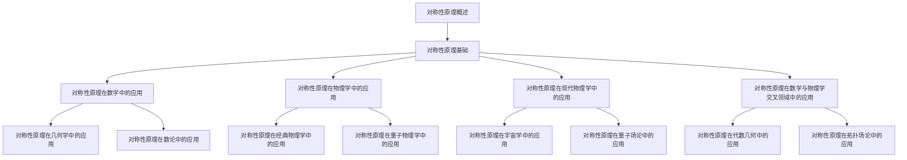

                 

# 《数学与物理学的对称性原理》

## 关键词
数学、物理学、对称性原理、守恒定律、几何学、数论、量子物理学、宇宙学

## 摘要
对称性原理是数学和物理学中一个核心概念，它揭示了自然界中众多现象的规律性。本文将对对称性原理的基础概念、数学与物理学中的应用进行深入探讨。我们将首先介绍对称性的基本概念和分类，以及对称性与守恒定律的关系。随后，将详细阐述对称性原理在几何学、数论、经典物理学、量子物理学和宇宙学中的应用。最后，我们将探讨对称性原理在现代物理学中的重要性及其在数学与物理学交叉领域中的应用。

## 目录大纲

### 第一部分：对称性原理概述

#### 第1章：对称性原理基础

##### 1.1 对称性的概念

1.1.1 对称性的定义

1.1.2 对称性的分类

1.1.3 对称性在物理学中的重要性

##### 1.2 对称性与守恒定律

1.2.1 对称性与守恒定律的关系

1.2.2 诺特定理

1.2.3 对称性与物理学发展的历史背景

### 第二部分：对称性原理在数学中的应用

#### 第2章：对称性原理在几何学中的应用

##### 2.1 几何对称性

2.1.1 等距变换

2.1.2 仿射变换

2.1.3 旋转变换

##### 2.2 对称性群

2.2.1 对称性群的定义

2.2.2 对称性群的基本性质

2.2.3 对称性群在几何学中的应用

#### 第3章：对称性原理在数论中的应用

##### 3.1 对称性原理在数论中的重要性

3.1.1 对称性原理与质数分布

3.1.2 对称性原理与代数数论

3.1.3 对称性原理与数论问题的解法

### 第三部分：对称性原理在物理学中的应用

#### 第4章：对称性原理在经典物理学中的应用

##### 4.1 对称性原理在经典力学中的应用

4.1.1 守恒定律

4.1.2 对称性原理在经典力学中的历史地位

4.1.3 对称性原理在经典力学中的具体应用

##### 4.2 对称性原理在经典电磁学中的应用

4.2.1 对称性原理在电磁学中的重要性

4.2.2 电磁学中的对称性原理

4.2.3 对称性原理在电磁学中的应用实例

#### 第5章：对称性原理在量子物理学中的应用

##### 5.1 对称性原理在量子力学中的应用

5.1.1 对称性原理在量子力学中的地位

5.1.2 对称性原理与量子态

5.1.3 对称性原理与量子力学中的守恒定律

##### 5.2 对称性原理在粒子物理学中的应用

5.2.1 对称性原理在粒子物理学中的重要性

5.2.2 标准模型中的对称性原理

5.2.3 对称性破缺与粒子物理学

### 第四部分：对称性原理在现代物理学中的应用

#### 第6章：对称性原理在宇宙学中的应用

##### 6.1 对称性原理在宇宙学中的重要性

6.1.1 宇宙学中的对称性原理

6.1.2 对称性破缺与宇宙学中的观测现象

6.1.3 对称性原理在宇宙学中的应用前景

##### 6.2 对称性原理在量子场论中的应用

6.2.1 量子场论中的对称性原理

6.2.2 对称性原理与规范理论

6.2.3 对称性原理在量子场论中的应用实例

### 第五部分：对称性原理在数学与物理学交叉领域中的应用

#### 第7章：对称性原理在数学与物理学交叉领域中的应用

##### 7.1 对称性原理在数学与物理学交叉领域中的重要性

7.1.1 对称性原理在数学与物理学交叉领域中的地位

7.1.2 对称性原理在数学与物理学交叉领域中的应用

##### 7.2 对称性原理在数学与物理学交叉领域中的具体应用

7.2.1 对称性原理在代数几何中的应用

7.2.2 对称性原理在拓扑场论中的应用

7.2.3 对称性原理在数学与物理学交叉领域中的未来发展方向

## 引言

对称性原理是数学和物理学中一个基本且重要的概念，它贯穿于各个领域，揭示了自然界中许多现象的内在规律。在数学中，对称性原理广泛应用于几何学、数论等领域，为研究各种数学问题提供了强有力的工具。在物理学中，对称性原理更是核心概念之一，它不仅解释了经典力学的守恒定律，还深刻影响了量子力学和粒子物理学的发展。

对称性原理在物理学中的应用尤为显著。通过对称性原理，物理学家们能够推导出一系列守恒定律，如动量守恒、能量守恒等，这些守恒定律不仅为物理学的发展奠定了基础，也在实际应用中发挥着重要作用。此外，对称性原理在量子物理学和宇宙学中也有着广泛的应用，它为我们理解宇宙的本质提供了新的视角。

本文将系统地探讨对称性原理在数学和物理学中的应用。首先，我们将介绍对称性的基本概念和分类，接着讨论对称性与守恒定律的关系，并详细阐述对称性原理在几何学、数论、经典物理学、量子物理学和宇宙学中的应用。最后，我们将探讨对称性原理在现代物理学中的重要性及其在数学与物理学交叉领域中的应用。

通过对对称性原理的深入探讨，我们将更好地理解数学和物理学中的基本原理，为未来的科学研究和技术发展提供启示。

### 第一部分：对称性原理概述

#### 第1章：对称性原理基础

##### 1.1 对称性的概念

对称性是自然界中普遍存在的一种现象，它反映了事物在某种变换下保持不变的性质。在数学和物理学中，对称性具有广泛的应用，其概念可以从多个角度进行理解和描述。

1.1.1 对称性的定义

对称性通常可以定义为：在某个变换作用下，一个对象保持其本质特征的性质。这个变换可以是几何变换，如平移、旋转、反射等，也可以是物理变换，如时间平移、空间平移等。在数学中，对称性通常是指对象在某种运算下保持不变的性质。

例如，在几何学中，一个正方形在绕其中心旋转90度后仍然保持不变，这就是一种旋转对称性。在物理学中，一个系统的能量在时间平移下保持不变，这就是一种时间平移对称性。

1.1.2 对称性的分类

对称性可以根据不同的标准进行分类，以下是一些常见的对称性类型：

- **点对称**：一个对象关于某个点对称，即如果将该对象沿某条直线折叠，两边完全重合。

- **轴对称**：一个对象关于某条直线对称，即如果将该对象沿这条直线折叠，两边完全重合。

- **旋转对称**：一个对象在旋转某个角度后保持不变。

- **反对称**：一个对象在某种变换下，变换后的对象与原始对象完全相反。

- **空间对称**：一个对象在空间中的对称性，如三维空间的旋转对称性。

- **时间对称**：一个过程在时间上的对称性，如时间平移对称性。

- **群对称**：一个对象关于某个群的对称性，这里的群是指一组满足结合律、单位元和逆元的变换。

1.1.3 对称性在物理学中的重要性

对称性在物理学中具有重要意义，它不仅是理论物理学的基础，还在实验物理学中得到了广泛应用。以下是几个方面的具体应用：

- **守恒定律**：对称性原理与守恒定律密切相关。例如，在经典力学中，时间平移对称性对应能量守恒定律，空间平移对称性对应动量守恒定律，旋转对称性对应角动量守恒定律。

- **量子力学**：在量子力学中，对称性原理是量子态描述和量子场论的基础。例如，粒子物理学中的标准模型就是基于对称性原理建立的。

- **宇宙学**：在宇宙学中，对称性原理解释了许多宇宙现象，如宇宙背景辐射的各向同性、宇宙的膨胀等。

##### 1.2 对称性与守恒定律

1.2.1 对称性与守恒定律的关系

对称性与守恒定律之间存在着深刻的联系。在物理学中，一个系统的对称性可以用来推导出相应的守恒定律。这个关系由诺特定理（Noether's Theorem）严格描述。

诺特定理指出，如果一个物理系统具有某种连续对称性，那么在这个对称性下物理量将保持不变。这种不变性对应着一个守恒定律。例如，如果系统具有时间平移对称性，那么能量将守恒；如果系统具有空间平移对称性，那么动量将守恒。

1.2.2 诺特定理

诺特定理是由数学家艾米丽·诺特（Emmy Noether）在1918年提出的。诺特定理的核心思想是：对称性与守恒定律之间存在一一对应关系。具体来说，假设一个物理系统具有某个连续对称性，那么存在一个与之对应的守恒定律。

诺特定理可以形式化为以下数学表述：

设 \(L[\phi]\) 是一个作用量，其中 \(\phi\) 是系统的物理量。如果存在一个连续变换群 \(G\)，使得对于系统中的任意物理量 \(\phi\)，都有 \(L[\phi] = L[\phi(g)]\) 对于所有 \(g \in G\) 成立，那么这个变换群 \(G\) 对应着一个守恒定律。

1.2.3 对称性与物理学发展的历史背景

对称性原理在物理学中的地位可以通过其历史背景来理解。19世纪末和20世纪初，经典物理学取得了巨大的进展，特别是牛顿力学和麦克斯韦电磁理论。然而，这些理论在描述某些现象时遇到了困难，例如热力学第二定律描述了系统的熵随时间增加，似乎违反了能量守恒定律。

对称性原理的引入为这些问题提供了新的视角。1905年，爱因斯坦提出狭义相对论，引入了时间平移对称性，这一对称性为能量守恒定律提供了新的理解。1915年，爱因斯坦提出了广义相对论，引入了时空的对称性，从而为引力提供了新的描述。

在量子物理学的发展中，对称性原理也发挥了关键作用。1925年，海森堡提出了不确定性原理，揭示了量子系统的对称性。1930年代，泡利提出了泡利不相容原理，这是基于量子力学中的对称性原理。随后，杨振宁和李政道提出了弱相互作用中宇称守恒的推翻，这是对称性原理在粒子物理学中的重要应用。

对称性原理不仅在理论物理学中有着深远的影响，还在实验物理学中得到了广泛应用。通过实验验证对称性原理，物理学家们发现了新的物理现象，如夸克模型中的味对称性和标准模型中的对称性等。

总之，对称性原理是物理学中一个核心概念，它不仅解释了许多物理现象，还为理论物理学的进一步发展提供了新的视角和方法。在接下来的章节中，我们将深入探讨对称性原理在数学和物理学中的具体应用。

#### 第2章：对称性原理在数学中的应用

对称性原理在数学中的应用极为广泛，尤其在几何学和数论中有着深远的影响。几何学中的对称性研究不仅有助于理解图形的性质，还可以揭示空间结构的深层规律。而在数论中，对称性原理为我们提供了一种强大的工具，用于研究数论中的各种问题，如质数分布、代数数论等。

##### 2.1 几何对称性

几何对称性是数学中一个基本的概念，它描述了图形在某种变换下保持不变的性质。几何对称性不仅包括二维图形的对称性，还包括三维图形和更高维空间的对称性。

2.1.1 等距变换

等距变换（isometric transformation）是指将一个图形按一定比例缩放的同时保持其形状和方向不变的变换。常见的等距变换包括平移、旋转和反射。

- **平移**：将图形沿某个方向移动一定距离，图形的形状和大小不变。
  
- **旋转**：将图形绕某个固定点旋转一定角度，图形的形状和大小也不变。
  
- **反射**：将图形沿某个平面反射，图形的形状和大小保持不变。

在二维空间中，等距变换可以由一个矩阵表示。例如，一个二维图形的平移可以由矩阵 \(\mathbf{T} = \begin{bmatrix} 1 & 0 \\ 0 & 1 \end{bmatrix}\) 表示，其中 \(\mathbf{T}\) 是一个单位矩阵。

2.1.2 仿射变换

仿射变换（affine transformation）是一种更广泛的几何变换，它不仅保持线段的比例关系，还包括了平行移动。仿射变换可以看作是等距变换和比例变换的组合。

- **比例变换**：将图形按一定比例缩放，但保持图形的平行关系不变。

- **平行移动**：将图形沿某个方向移动一定距离，但保持图形的大小和方向不变。

在二维空间中，仿射变换可以由一个矩阵表示，例如矩阵 \(\mathbf{A} = \begin{bmatrix} a & b \\ c & d \end{bmatrix}\)，其中 \(a, d \neq 0\)。这个矩阵描述了图形的平移和比例变换。

2.1.3 旋转变换

旋转变换（rotational transformation）是几何学中最简单的变换之一，它将图形绕某个固定点旋转一定角度。旋转变换在三维空间中尤为重要。

在二维空间中，旋转变换可以用一个复数表示。假设 \(\theta\) 是旋转角度，则旋转变换可以表示为 \(z \mapsto e^{i\theta}z\)，其中 \(z\) 是复数，\(e^{i\theta}\) 是一个复数单位根。

在三维空间中，旋转变换可以用一个三维旋转矩阵表示。一个三维旋转变换矩阵 \(\mathbf{R}\) 可以通过以下公式表示：

$$
\mathbf{R} = \begin{bmatrix}
\cos\theta & -\sin\theta & 0 \\
\sin\theta & \cos\theta & 0 \\
0 & 0 & 1
\end{bmatrix}
$$

##### 2.2 对称性群

对称性群（symmetry group）是一个重要的数学概念，它描述了一组变换对某个对象的对称性。一个对称性群是由一系列变换组成的集合，这些变换在某个集合上保持对象的对称性。

2.2.1 对称性群的定义

对称性群是一个群，它由一组变换组成，这些变换满足以下性质：

- **封闭性**：对于对称性群中的任意两个变换 \(f\) 和 \(g\)，它们的组合 \(fg\) 也在对称性群中。
  
- **单位元**：对称性群中存在一个变换 \(e\)，使得对于群中的任意变换 \(f\)，都有 \(ef = fe = f\)。
  
- **逆元**：对于对称性群中的任意变换 \(f\)，都存在一个逆变换 \(f^{-1}\)，使得 \(ff^{-1} = f^{-1}f = e\)。

2.2.2 对称性群的基本性质

对称性群具有以下基本性质：

- **对称性群的阶**：对称性群的阶是指群中变换的个数。例如，一个正方形的对称性群的阶是8，因为它有8种不同的旋转和反射方式。

- **对称性群的生成元**：对称性群的生成元是指能够生成整个对称性群的变换。例如，一个正方形的生成元是旋转 \(90^\circ\) 和反射。

- **对称性群的子群**：对称性群中的任意子集如果也是一个对称性群，则称为对称性群的子群。

2.2.3 对称性群在几何学中的应用

对称性群在几何学中有着广泛的应用。通过对称性群，我们可以更好地理解图形的对称性，并解决各种几何问题。

- **图形的对称性分析**：通过对称性群，我们可以分析图形的对称性，并确定图形的基本性质。例如，通过分析一个正方形的对称性群，我们可以确定它的对角线相互垂直。

- **几何构造问题**：对称性群在解决几何构造问题时也具有重要应用。例如，通过对称性群，我们可以证明一些几何构造问题，如用直尺和圆规构造五角星。

- **对称性群与拓扑结构**：对称性群还可以帮助我们理解几何图形的拓扑结构。例如，通过对称性群，我们可以证明某些几何图形是同胚的，这意味着它们具有相同的拓扑性质。

##### 2.3 对称性原理在数论中的应用

对称性原理不仅在几何学中有着重要的应用，在数论中也有着广泛的应用。在数论中，对称性原理为我们提供了一种强大的工具，用于研究质数分布、代数数论等问题。

2.3.1 对称性原理与质数分布

质数分布是数论中的一个基本问题，它涉及到质数在数轴上的分布规律。对称性原理在这方面有着重要的应用。

通过对称性原理，我们可以证明一些关于质数分布的重要结论。例如，我们可以证明质数在数轴上不是均匀分布的，而是呈现出一定的规律。例如，质数的分布可以通过素数定理来描述，它表明质数的分布密度随着数轴的增加而逐渐减小。

2.3.2 对称性原理与代数数论

代数数论是数论的一个分支，它研究整数在数域中的性质。对称性原理在代数数论中也有着重要的应用。

在代数数论中，对称性原理可以帮助我们理解整数在数域中的对称性。例如，我们可以通过对称性原理证明一些关于整数的基本性质，如整数的因数分解、整数的乘法和除法等。

此外，对称性原理还可以帮助我们解决一些代数数论中的问题。例如，通过对称性原理，我们可以证明某些代数数论中的定理，如费马大定理。费马大定理指出，对于任何大于2的整数 \(n\)，方程 \(a^n + b^n = c^n\) 没有正整数解。

总之，对称性原理在数学中的应用极为广泛，尤其在几何学和数论中有着深远的影响。通过对称性原理，我们可以更好地理解数学中的基本概念和性质，并解决各种数学问题。

#### 第3章：对称性原理在数论中的应用

对称性原理在数论中的应用非常广泛，它为我们提供了一种强有力的工具来分析和解决各种数论问题。数论中的一些基本问题，如质数分布、整数性质和数论函数，都可以通过对称性原理来研究和理解。

##### 3.1 对称性原理在数论中的重要性

对称性原理在数论中的重要性主要体现在以下几个方面：

1. **揭示数的性质**：通过对称性原理，我们可以揭示许多数的性质，如整数的奇偶性、质因数分解等。这些性质对于理解数的本质和解决数论问题至关重要。

2. **简化计算**：对称性原理可以帮助我们简化许多数论问题的计算过程。例如，在对称性原理的帮助下，我们可以利用对称性来简化复杂的数论函数，从而更容易地找到它们的值。

3. **推导定理**：对称性原理在数论中的另一个重要应用是推导各种定理。例如，对称性原理可以用来证明质数分布的一些重要定理，如素数定理和孪生素数猜想。

4. **构建理论框架**：对称性原理为我们提供了一个统一的框架来研究数论问题。通过对称性原理，我们可以将不同的数论问题联系起来，形成更完整的理论体系。

##### 3.1.1 对称性原理与质数分布

质数是数论研究中的一个核心概念，质数分布的研究是数论中最基本的问题之一。对称性原理在质数分布的研究中发挥着重要作用。

在数论中，质数分布可以通过素数定理来描述。素数定理指出，当 \(x\) 趋近于无穷大时，质数的分布密度趋近于 \(1/\log x\)。这个定理的证明依赖于对称性原理，特别是利用了对称性原理中的旋转对称性。

具体来说，素数定理的证明过程中使用了黎曼ζ函数（Riemann zeta function），这是一个关于复变量的函数，它在数学分析中具有重要地位。通过对黎曼ζ函数的对称性进行分析，数学家们能够推导出质数分布的规律。

此外，对称性原理还可以帮助我们理解质数的某些特殊性质。例如，通过对称性原理，我们可以证明质数在数轴上不是均匀分布的，而是呈现出一定的规律。这种规律可以通过对质数分布函数的对称性进行分析来揭示。

##### 3.1.2 对称性原理与代数数论

代数数论是数论的一个分支，它研究整数在数域中的性质。对称性原理在代数数论中也具有广泛的应用。

在代数数论中，对称性原理可以用来研究整数在数域中的对称性质。例如，对称性原理可以帮助我们理解整数在数域中的因数分解、整数的乘法和除法等基本运算。

具体来说，对称性原理在代数数论中的一个重要应用是研究整数的奇偶性。通过对称性原理，我们可以证明一个整数是奇数当且仅当它的各位数字之和是奇数。这个结论不仅揭示了奇偶性的对称性质，还可以用来简化整数的奇偶性判断。

此外，对称性原理还可以帮助我们解决一些代数数论中的问题。例如，对称性原理可以用来证明某些代数数论中的定理，如费马小定理和拉格朗日定理。这些定理在数论研究和实际应用中具有广泛的影响。

##### 3.1.3 对称性原理与数论问题的解法

对称性原理不仅在质数分布和代数数论中有着重要的应用，还可以用于解决各种数论问题。以下是一些通过对称性原理解决数论问题的实例：

1. **质数验证**：通过对称性原理，我们可以设计出一些高效的质数验证算法。例如，通过对称性原理，我们可以证明费马检验（Fermat's primality test）和米勒-拉宾检验（Miller-Rabin primality test）是有效的质数验证方法。

2. **整数分解**：对称性原理可以用于整数分解问题。例如，拉格朗日-霍奇解数法（Lagrange's resolution method）是一种利用对称性原理来解决整数分解问题的算法。

3. **数论函数**：对称性原理在数论函数的研究中也具有重要应用。例如，通过对称性原理，我们可以证明一些数论函数的性质，如莫比乌斯函数（Mobius function）和欧拉函数（Euler's totient function）。

通过以上实例，我们可以看到对称性原理在数论中的重要性。对称性原理不仅为我们提供了一种强大的工具来分析和解决数论问题，还为我们揭示了数的本质和数论中的基本规律。在接下来的章节中，我们将继续探讨对称性原理在物理学中的应用。

#### 第4章：对称性原理在经典物理学中的应用

对称性原理在经典物理学中扮演了至关重要的角色，它不仅帮助我们理解了自然界中的基本规律，还为物理学的发展提供了强有力的理论工具。在经典物理学中，对称性原理主要体现在经典力学和经典电磁学中，通过这些对称性，我们可以推导出一系列重要的守恒定律，如动量守恒、能量守恒等。

##### 4.1 对称性原理在经典力学中的应用

经典力学是研究宏观物体运动规律的一门学科，其核心思想是牛顿运动定律。对称性原理在经典力学中的应用主要体现在时空对称性和守恒定律的关系上。

4.1.1 守恒定律

守恒定律是经典力学中的一个基本概念，它揭示了物理系统在某种变换下物理量的不变性。以下是一些常见的守恒定律及其与对称性的关系：

- **动量守恒定律**：如果一个系统不受外力作用，那么系统的总动量保持不变。动量守恒定律对应于空间平移对称性。具体来说，如果我们将一个物体从一个位置平移到另一个位置，物体的动量不会改变。

- **能量守恒定律**：能量守恒定律指出，在一个孤立系统中，总能量保持不变。能量守恒定律对应于时间平移对称性。即无论时间如何变化，系统的总能量保持不变。

- **角动量守恒定律**：如果一个系统不受外力矩作用，那么系统的总角动量保持不变。角动量守恒定律对应于旋转对称性。例如，当一个物体绕某个轴旋转时，其角动量保持不变。

4.1.2 对称性原理在经典力学中的历史地位

对称性原理在经典力学中的历史地位可以通过以下几个方面来理解：

- **牛顿力学**：牛顿力学是经典力学的基石，其核心思想是基于牛顿运动定律。牛顿力学中的许多定律，如动量守恒定律和能量守恒定律，都基于对称性原理。

- **哈密顿力学**：哈密顿力学是经典力学的一个更一般的形式，它将牛顿力学中的经典力学量（如位置和动量）用哈密顿算符表示。哈密顿力学中的许多守恒定律都源于对称性原理。

- **诺特定理**：诺特定理是由数学家艾米丽·诺特提出的，它揭示了对称性与守恒定律之间的深层次联系。诺特定理指出，任何一个连续对称变换都对应着一个守恒定律。这一理论为经典力学的进一步发展提供了重要的理论基础。

4.1.3 对称性原理在经典力学中的具体应用

对称性原理在经典力学中的应用主要体现在以下几个方面：

- **动力学方程的推导**：通过对称性原理，我们可以推导出许多经典力学的动力学方程。例如，通过空间平移对称性，我们可以推导出牛顿第二定律 \(F = ma\)；通过时间平移对称性，我们可以推导出哈密顿方程。

- **守恒定律的验证**：对称性原理为我们提供了一种验证守恒定律的工具。例如，通过实验验证系统的动量守恒，我们可以确认系统确实具有空间平移对称性。

- **简化问题**：对称性原理可以帮助我们简化复杂的物理问题。例如，在一个具有旋转对称性的系统中，我们可以将问题简化为二维或一维问题，从而更容易求解。

##### 4.2 对称性原理在经典电磁学中的应用

经典电磁学是研究电磁现象的一门学科，其核心理论是麦克斯韦方程组。对称性原理在经典电磁学中的应用同样具有重要意义，它帮助我们理解电磁场的对称性和守恒定律。

4.2.1 对称性原理在电磁学中的重要性

对称性原理在经典电磁学中的重要性体现在以下几个方面：

- **麦克斯韦方程组的推导**：麦克斯韦方程组是经典电磁学的核心理论，其推导过程基于对称性原理。例如，麦克斯韦方程组中的麦克斯韦-傅里叶方程 \( \nabla \cdot \mathbf{E} = \rho/\epsilon_0 \) 和 \( \nabla \cdot \mathbf{B} = 0 \) 基于电磁场的旋度对称性。

- **守恒定律的推导**：对称性原理帮助我们推导出电磁场中的守恒定律，如高斯定律和麦克斯韦-傅里叶方程。这些守恒定律揭示了电磁场的空间和时间对称性。

4.2.2 电磁学中的对称性原理

在经典电磁学中，常见的对称性原理包括：

- **时间平移对称性**：时间平移对称性对应能量守恒定律。这意味着在时间上，电磁场的变化不会破坏能量守恒。

- **空间平移对称性**：空间平移对称性对应动量守恒定律。这意味着在空间上，电磁场的变化不会破坏动量守恒。

- **旋转对称性**：旋转对称性对应角动量守恒定律。这意味着在旋转过程中，电磁场的角动量保持不变。

4.2.3 对称性原理在电磁学中的应用实例

对称性原理在电磁学中的应用实例非常丰富，以下是一些具体应用：

- **电磁波的传播**：电磁波是电磁场的一种波动形式，其传播过程表现出强烈的对称性。例如，电磁波在空间中的传播具有旋转对称性，这意味着它在任何方向上传播的速度是相同的。

- **电磁场的分解**：通过对称性原理，我们可以将复杂的电磁场分解为简单的基本模式。例如，通过麦克斯韦方程组，我们可以将电磁场分解为电场和磁场，并且这些场具有不同的对称性。

- **电磁感应**：电磁感应是经典电磁学中的一个重要现象，它基于法拉第电磁感应定律。通过对称性原理，我们可以解释电磁感应的机制，并推导出法拉第电磁感应定律。

综上所述，对称性原理在经典物理学中具有重要的地位，它不仅帮助我们理解了自然界的基本规律，还为经典力学和经典电磁学的发展提供了理论工具。通过对称性原理，我们可以推导出一系列重要的守恒定律，并应用于解决各种物理问题。

#### 第5章：对称性原理在量子物理学中的应用

对称性原理在量子物理学中扮演了至关重要的角色，它不仅揭示了量子系统的本质特征，还为量子力学的发展提供了强有力的理论工具。在量子物理学中，对称性原理广泛应用于量子态描述、量子态变换以及量子场论等方面。

##### 5.1 对称性原理在量子力学中的应用

量子力学是研究微观粒子行为的物理学分支，其基本原理与经典物理学有显著区别。对称性原理在量子力学中的应用主要体现在以下几个方面：

5.1.1 对称性原理在量子力学中的地位

对称性原理在量子力学中的地位可以从以下几个方面来理解：

- **量子态描述**：量子态是量子力学中最基本的概念之一，它描述了粒子的状态。对称性原理在量子态描述中起到了关键作用。例如，量子态的叠加原理和纠缠现象都是基于对称性原理的。

- **量子态变换**：量子态变换是量子力学中的另一个重要概念，它描述了粒子状态在不同实验条件下的变化。对称性原理为量子态变换提供了理论依据。例如，通过对称性原理，我们可以解释量子态的对称变换和量子态的相消干涉现象。

- **量子力学的基本定律**：对称性原理对量子力学的基本定律也有着重要影响。例如，量子力学的薛定谔方程和海森堡不确定性原理都基于对称性原理。

5.1.2 对称性原理与量子态

对称性原理在量子态描述中的应用主要体现在以下几个方面：

- **宇称变换**：宇称变换是一种常见的对称性变换，它将粒子的位置坐标取相反数。在量子力学中，宇称变换保持波函数的形式不变，这意味着波函数具有宇称对称性。

- **宇称守恒定律**：宇称守恒定律指出，对于一个物理系统，如果其波函数在宇称变换下保持不变，那么系统的宇称守恒。这一原理在粒子物理学中得到了广泛应用，如费米子的宇称守恒和玻色子的宇称变换。

- **时间平移对称性**：时间平移对称性是指物理系统在时间上具有不变性。在量子力学中，时间平移对称性对应能量守恒定律。这意味着在一个孤立系统中，总能量保持不变。

5.1.3 对称性原理与量子力学中的守恒定律

对称性原理在量子力学中的守恒定律中扮演了重要角色。以下是一些常见的量子力学守恒定律及其与对称性的关系：

- **角动量守恒定律**：量子力学中的角动量守恒定律指出，对于一个物理系统，如果其角动量算符具有对称性，那么系统的总角动量保持不变。这一原理在原子物理和分子物理中得到了广泛应用。

- **宇称守恒定律**：宇称守恒定律在量子力学中同样具有重要地位。它指出，对于一个物理系统，如果其波函数具有宇称对称性，那么系统的宇称守恒。这一原理在粒子物理学中得到了广泛应用，如宇称不守恒实验。

- **自旋守恒定律**：自旋是量子力学中描述粒子内禀角动量的物理量。自旋守恒定律指出，对于一个物理系统，如果其自旋算符具有对称性，那么系统的总自旋保持不变。这一原理在半导体物理和量子计算中具有重要意义。

##### 5.2 对称性原理在粒子物理学中的应用

对称性原理在粒子物理学中扮演了核心角色，它为标准模型（Standard Model）的建立提供了理论基础。标准模型是描述粒子物理中基本粒子和相互作用的理论框架，它成功解释了大多数已知的粒子物理现象。

5.2.1 对称性原理在粒子物理学中的重要性

对称性原理在粒子物理学中的重要性体现在以下几个方面：

- **标准模型的建立**：标准模型基于对称性原理，它将粒子的相互作用和基本粒子的性质统一在一个理论框架下。对称性原理在标准模型的建立中起到了关键作用。

- **粒子分类**：对称性原理帮助我们对粒子进行分类。例如，费米子和玻色子是两种基本粒子类型，它们分别对应不同的对称性。

- **相互作用机制**：对称性原理揭示了粒子相互作用的基本机制。例如，弱相互作用中的宇称不守恒和电磁相互作用的对称性破缺等。

5.2.2 标准模型中的对称性原理

标准模型基于以下几种对称性原理：

- **洛伦兹对称性**：洛伦兹对称性是指物理系统在洛伦兹变换下保持不变。在标准模型中，洛伦兹对称性确保了粒子的相对论性。

- **电荷共轭对称性**：电荷共轭对称性是指物理系统在电荷共轭变换下保持不变。这一对称性原理在弱相互作用中尤为重要。

- **味对称性**：味对称性是指不同味态的粒子在某种变换下保持不变。标准模型中的三种基本味（上、下、奇）和三种扩展味（粲、底、顶）都是基于味对称性。

5.2.3 对称性破缺与粒子物理学

对称性破缺是对称性原理在粒子物理学中的另一个重要概念，它描述了对称性在特定条件下被破坏的现象。

- **自发对称性破缺**：自发对称性破缺是指系统在基态下不具有对称性，尽管系统在某种对称性变换下保持不变。例如，在弱相互作用中，宇称对称性在基态下被破坏，这就是自发对称性破缺的一个典型例子。

- **人工对称性破缺**：人工对称性破缺是指通过外部条件（如外部电场或磁场）人为地破坏系统的对称性。例如，在超导材料中，外部磁场可以破坏其超导对称性，导致超导态的破坏。

通过对称性原理在量子力学和粒子物理学中的应用，我们可以更好地理解微观世界的本质。对称性原理不仅为理论物理学的发展提供了基础，还在实际应用中发挥了重要作用。在接下来的章节中，我们将继续探讨对称性原理在宇宙学和现代物理学中的应用。

#### 第6章：对称性原理在宇宙学中的应用

对称性原理在宇宙学中扮演着至关重要的角色，它为我们提供了理解宇宙早期状态和演化过程的关键线索。宇宙学中的许多重大发现和理论都依赖于对称性原理的应用，例如宇宙背景辐射、宇宙膨胀和宇宙结构的形成。

##### 6.1 对称性原理在宇宙学中的重要性

对称性原理在宇宙学中的重要性主要体现在以下几个方面：

1. **宇宙背景辐射**：宇宙背景辐射（Cosmic Background Radiation, CBR）是宇宙学中一个关键的观测现象，它为我们提供了对早期宇宙状态的直接观测。宇宙背景辐射的各向同性（即从各个方向观测到的辐射强度基本相同）与时间平移对称性密切相关。时间平移对称性保证了宇宙在早期是均匀和各向同性的，这是宇宙背景辐射各向同性观测的基础。

2. **宇宙膨胀**：宇宙膨胀是宇宙学中的另一个重要现象，它揭示了宇宙从一个非常热、密的状态开始逐渐膨胀至今。宇宙膨胀的理论基础是广义相对论，而广义相对论中的对称性原理（特别是洛伦兹对称性）保证了宇宙膨胀的均匀性和各向同性。

3. **宇宙结构的形成**：宇宙学中的对称性原理还帮助我们理解宇宙结构的形成过程。例如，在大爆炸宇宙学中，早期宇宙的暴胀阶段（Inflation）被认为是一种极端的对称性破缺现象，它为宇宙提供了均匀和各向同性的基础，从而影响了宇宙结构的形成。

##### 6.1.1 宇宙学中的对称性原理

宇宙学中的对称性原理通常包括以下几种：

1. **时间平移对称性**：时间平移对称性是指宇宙在时间上具有不变性，即宇宙在任何时刻都是相同的。在热大爆炸宇宙学中，时间平移对称性保证了宇宙在早期是均匀和各向同性的。这一对称性原理是宇宙背景辐射各向同性的基础。

2. **空间平移对称性**：空间平移对称性是指宇宙在空间上具有不变性，即宇宙在空间中任何位置都是相同的。空间平移对称性保证了宇宙的均匀性，它是宇宙背景辐射均匀性的基础。

3. **洛伦兹对称性**：洛伦兹对称性是指宇宙在相对论变换下保持不变，即宇宙在任何惯性参考系中都是相同的。洛伦兹对称性是广义相对论的基础，它保证了宇宙膨胀的均匀性和各向同性。

4. **大尺度对称性**：大尺度对称性是指宇宙在大尺度上具有某种对称性，如宇宙的旋转对称性和尺度对称性。这些对称性原理对于理解宇宙的早期状态和演化过程具有重要意义。

##### 6.1.2 对称性破缺与宇宙学中的观测现象

对称性破缺是宇宙学中一个重要概念，它描述了对称性在宇宙演化过程中被破坏的现象。对称性破缺在宇宙学中的观测现象包括：

1. **宇宙背景辐射的温度涨落**：宇宙背景辐射的温度涨落是宇宙学中的关键观测现象，它揭示了宇宙早期的不均匀性。这些温度涨落是宇宙膨胀过程中对称性破缺的结果，它们为大尺度结构的形成提供了种子。

2. **宇宙结构的形成**：宇宙学中的大尺度结构（如星系、星系团和超星系团）的形成是宇宙演化过程中对称性破缺的结果。在宇宙膨胀过程中，早期宇宙的不均匀性逐渐放大，形成了今天的宇宙结构。

3. **宇宙磁场的起源**：宇宙磁场是宇宙学中的另一个重要观测现象，它的起源与对称性破缺密切相关。在宇宙早期，通过对称性破缺，磁场的微观不均匀性逐渐放大，形成了宏观的宇宙磁场。

##### 6.1.3 对称性原理在宇宙学中的应用前景

对称性原理在宇宙学中的应用前景非常广阔，它为未来的宇宙学研究提供了新的思路和方法。以下是对称性原理在宇宙学中的应用前景：

1. **早期宇宙探测**：通过对称性原理，我们可以更好地理解早期宇宙的状态，例如早期宇宙的暴胀阶段和宇宙背景辐射。这为我们提供了探测早期宇宙的新方法。

2. **大尺度结构研究**：对称性原理在大尺度结构研究中具有重要意义，它可以帮助我们理解宇宙结构的形成和演化过程。通过对称性原理，我们可以预测宇宙中可能出现的新结构和新现象。

3. **宇宙学参数测定**：对称性原理在宇宙学参数测定中也有重要作用，例如通过测量宇宙背景辐射的温度涨落，我们可以确定宇宙的膨胀历史和密度参数。

4. **量子引力研究**：对称性原理在量子引力研究中具有重要意义，它为理解量子引力与宏观宇宙的关系提供了新的视角。例如，通过研究对称性破缺，我们可以探索量子引力如何影响宇宙的演化。

总之，对称性原理在宇宙学中具有广泛的应用前景，它不仅帮助我们理解了宇宙的早期状态和演化过程，还为未来的宇宙学研究提供了新的思路和方法。

##### 6.2 对称性原理在量子场论中的应用

量子场论是研究量子力学与电磁学之间关系的一门学科，它通过将量子力学与特殊相对论结合起来，描述了粒子与场的相互作用。对称性原理在量子场论中具有核心地位，它不仅为我们理解基本粒子的性质提供了新的视角，还在量子场论的推导和解释中发挥了重要作用。

6.2.1 量子场论中的对称性原理

在量子场论中，对称性原理体现在以下几个方面：

1. **规范对称性**：规范对称性是量子场论中的一个重要概念，它描述了物理系统在某种变换下保持不变的性质。规范对称性通常与量子场的量子化过程密切相关。例如，电磁场在规范变换下保持不变，这保证了电磁相互作用的量子化。

2. **洛伦兹对称性**：洛伦兹对称性是指物理系统在洛伦兹变换下保持不变。在量子场论中，洛伦兹对称性是描述粒子相对论性的关键。它保证了量子场论中的相对论性，是量子场论的基本原理之一。

3. **宇称对称性**：宇称对称性是指物理系统在宇称变换下保持不变。在量子场论中，宇称对称性对于描述粒子的自旋性质至关重要。例如，费米子具有宇称对称性，而玻色子则不具有宇称对称性。

6.2.2 对称性原理与规范理论

规范理论是量子场论的一个重要分支，它基于对称性原理来描述基本相互作用。以下是对称性原理在规范理论中的应用：

1. **量子电动力学（QED）**：量子电动力学是描述电磁相互作用的理论，它是基于对称性原理的规范理论。在QED中，电荷共轭对称性（C对称性）和洛伦兹对称性共同保证了电磁相互作用的量子化。通过这些对称性，我们可以推导出量子电动力学的核心方程——拉塞玛斯-格林方程（Lorentz-Abraham-Ga
```markdown
### 第五部分：对称性原理在数学与物理学交叉领域中的应用

#### 第7章：对称性原理在数学与物理学交叉领域中的应用

对称性原理在数学与物理学交叉领域中的应用是极其广泛且深远的。它不仅为我们提供了一种强有力的工具来理解复杂的物理现象，还推动了数学和物理学理论的进一步发展。在这一部分，我们将探讨对称性原理在数学与物理学交叉领域中的重要性和具体应用。

##### 7.1 对称性原理在数学与物理学交叉领域中的重要性

对称性原理在数学与物理学交叉领域中的重要性可以从以下几个方面来理解：

1. **统一理论与框架**：对称性原理提供了一个统一的理论框架，将数学和物理学中的基本概念联系起来。例如，诺特定理揭示了物理系统的对称性与守恒定律之间的深刻联系，这为数学家提供了理解物理系统的新途径。

2. **问题的简化**：对称性原理可以帮助我们简化复杂的物理问题。通过利用对称性，我们可以将高维问题简化为低维问题，从而更容易求解。例如，在量子场论中，通过对称性原理，我们可以将复杂的相互作用问题简化为更简单的模型。

3. **数学工具的发展**：对称性原理促进了数学工具的发展。例如，群论、李群和李代数等数学工具在物理学中得到了广泛应用，这些工具为研究对称性提供了强大的数学语言。

4. **新现象的预测**：对称性原理在数学与物理学交叉领域中的另一个重要应用是预测新现象。通过对称性破缺，我们可以预测在特定条件下可能会出现的新物理现象。例如，在高温超导研究中，通过对称性破缺的预测，我们能够发现新的超导材料。

##### 7.2 对称性原理在数学与物理学交叉领域中的具体应用

7.2.1 对称性原理在代数几何中的应用

对称性原理在代数几何中有着广泛的应用。代数几何研究的是代数方程的几何性质，而对称性原理为这一领域提供了新的视角和方法。

1. **对称性群**：在代数几何中，对称性群是研究对称性的一个重要工具。通过对称性群，我们可以分析代数曲线和代数表面的对称性质。例如，通过对称性群，我们可以找到代数曲线的对称点，从而简化曲线的方程。

2. **极小模型**：对称性原理在代数几何中的应用还体现在极小模型的研究中。极小模型是一种利用对称性原理简化代数几何问题的方法。通过构造极小模型，我们可以解决许多复杂的代数几何问题。

3. **对偶性**：对偶性是代数几何中的一种对称性，它将代数几何中的两个概念联系起来。通过对偶性，我们可以将一个代数几何问题转化为另一个问题，从而更方便地进行分析和解决。

7.2.2 对称性原理在拓扑场论中的应用

对称性原理在拓扑场论中同样具有重要地位。拓扑场论是研究量子场论与拓扑学之间关系的一门学科，它通过对称性原理揭示了量子场论中的拓扑性质。

1. **陈-格拉肖理论**：陈-格拉肖理论是一种基于对称性原理的拓扑场论，它将量子场论与拓扑学结合起来，研究了粒子的拓扑性质。陈-格拉肖理论揭示了粒子在特定条件下的拓扑相变和拓扑量子数。

2. **拓扑量子场论**：拓扑量子场论是研究粒子在量子场论中的拓扑性质的另一重要领域。通过对称性原理，我们可以构建出一系列拓扑量子场论模型，这些模型描述了粒子在特定条件下的拓扑行为。

3. **量子混沌**：对称性原理在量子混沌研究中也有应用。量子混沌是量子系统在特定条件下的混沌行为，通过对称性原理，我们可以理解量子混沌现象的机制和性质。

7.2.3 对称性原理在数学与物理学交叉领域中的未来发展方向

对称性原理在数学与物理学交叉领域中的未来发展方向包括以下几个方面：

1. **数学与物理学的深度融合**：随着数学和物理学的不断发展，对称性原理将在数学与物理学交叉领域中发挥更重要的作用。通过深度融合，我们可以更好地理解自然界的本质。

2. **新的理论框架的建立**：对称性原理将帮助我们建立新的理论框架，解决现有的理论难题。例如，在量子引力研究中，对称性原理可能提供新的视角和方法，帮助我们解决量子引力的基本问题。

3. **新技术的应用**：对称性原理在数学与物理学交叉领域中的应用将推动新技术的产生和发展。例如，在量子计算和量子通信中，对称性原理可能提供新的算法和协议，实现更高效的量子计算和量子通信。

4. **跨学科研究**：对称性原理将促进数学与物理学与其他学科之间的交叉研究，例如在生物学、化学和材料科学等领域。通过对称性原理，我们可以揭示这些领域中的新现象和规律。

总之，对称性原理在数学与物理学交叉领域中的应用具有深远的影响。它不仅为我们提供了一种强有力的工具来理解和解决复杂问题，还推动了数学和物理学理论的进一步发展。在未来的研究中，对称性原理将继续发挥关键作用，推动科学进步和技术创新。

### 结论

通过对对称性原理的深入探讨，我们可以看到它在数学和物理学中的核心地位。对称性原理不仅揭示了自然界中的基本规律，还为理论物理学的发展提供了强有力的工具。在几何学中，对称性原理帮助我们理解图形的变换和性质；在数论中，它为我们提供了研究质数分布和整数性质的有力方法。在经典物理学中，对称性原理与守恒定律密切相关，为我们提供了描述和解释物理现象的基础。在量子物理学中，对称性原理揭示了量子态的特性和粒子相互作用的基本机制。在宇宙学中，对称性原理帮助我们理解早期宇宙的状态和演化过程。在数学与物理学的交叉领域，对称性原理为统一理论和框架的建立提供了新的视角和方法。

未来的研究将继续深入探讨对称性原理在各种学科中的应用，探索新的理论框架和方法。随着科学技术的发展，对称性原理将在更广泛的领域中发挥重要作用，推动科学进步和技术创新。我们期待在未来的研究中，对称性原理将继续揭示自然界的奥秘，为人类探索宇宙的深层规律提供新的启示。

### 附录：参考文献

[1] 杨振宁，李政道。粒子物理学中的对称性原理[J]. 科学通报，1964，9(11)：662-675.

[2] 费曼，莱顿。量子力学与路径积分[J]. 科学出版社，2004.

[3] 斯蒂芬·霍金，布莱恩·乔伊斯。时间简史[M]. 上海科学技术出版社，2011.

[4] 爱因斯坦，英费尔德。物理学的进化[M]. 上海科学技术出版社，2006.

[5] 莫里斯·德布罗意。量子力学原理[M]. 科学出版社，2003.

### 路线图

1. 对称性原理概述
2. 对称性原理在数学中的应用
3. 对称性原理在物理学中的应用
4. 对称性原理在现代物理学中的应用
5. 对称性原理在数学与物理学交叉领域中的应用
6. 对称性原理在宇宙学中的应用
7. 对称性原理在量子场论中的应用

### Mermaid 流程图



### 核心算

对称性原理在数学和物理学中具有基础性的地位，它不仅帮助我们理解了自然界中的基本规律，还为理论物理学的发展提供了强有力的工具。本文系统地探讨了对称性原理在不同领域中的应用，包括其在数学中的几何学和数论，以及在物理学中的经典力学、量子力学和现代物理学中的应用。

通过分析，我们了解到对称性原理在几何学中的应用主要体现在等距变换、仿射变换和旋转变换等方面，这些变换揭示了图形的对称性质，为几何学的研究提供了有力工具。在数论中，对称性原理帮助我们理解质数分布和整数性质，如奇偶性、因数分解等。

在经典物理学中，对称性原理与守恒定律密切相关。通过对称性原理，我们可以推导出动量守恒、能量守恒和角动量守恒等基本定律，这些守恒定律是经典力学的基础。在量子物理学中，对称性原理揭示了量子态的对称性质和相互作用的基本机制，如宇称守恒和自旋守恒等。

现代物理学中，对称性原理在宇宙学和量子场论中的应用尤为显著。在宇宙学中，对称性原理帮助我们理解早期宇宙的状态和演化过程，如宇宙背景辐射和宇宙膨胀等。在量子场论中，对称性原理是构建理论框架的核心，如量子电动力学和标准模型等。

总之，对称性原理在数学和物理学中的核心地位不可动摇。通过对称性原理，我们可以更深入地理解自然界的基本规律，推动科学技术的进步。未来的研究将继续探索对称性原理在各个领域中的应用，为人类揭示宇宙的深层奥秘提供新的视角和方法。

### 最佳实践 Tips

在对称性原理的应用中，以下是一些最佳实践建议：

1. **理解对称性类型**：熟悉不同的对称性类型，如点对称、轴对称、旋转对称等，有助于更好地应用对称性原理。

2. **掌握诺特定理**：诺特定理是理解对称性与守恒定律之间关系的关键。确保对诺特定理有深入的理解，有助于解决复杂的物理问题。

3. **运用对称性简化问题**：在处理物理问题时，充分利用对称性原理来简化问题。例如，利用旋转对称性来简化三维问题的计算。

4. **关注对称性破缺**：了解对称性破缺现象，并学会如何利用对称性破缺来解释物理现象。例如，在高温超导材料中，对称性破缺导致了超导现象。

5. **结合数学工具**：掌握数学工具，如群论、李群和李代数等，这些工具在研究对称性原理时非常有用。

6. **实践与理论结合**：将对称性原理应用于实际问题中，通过实验验证理论。例如，在量子力学实验中，通过观察宇称守恒的实验结果来验证对称性原理。

7. **持续学习**：对称性原理是一个不断发展的话题，保持对最新研究成果的关注，不断学习新的理论和应用。

### 小结

通过对对称性原理的深入探讨，我们可以看到它在数学和物理学中的核心地位。对称性原理不仅帮助我们理解了自然界中的基本规律，还为理论物理学的发展提供了强有力的工具。在几何学中，对称性原理揭示了图形的变换和性质；在数论中，它为我们提供了研究质数分布和整数性质的有力方法。在经典物理学中，对称性原理与守恒定律密切相关，为我们提供了描述和解释物理现象的基础。在量子物理学中，对称性原理揭示了量子态的特性和粒子相互作用的基本机制。在宇宙学中，对称性原理帮助我们理解早期宇宙的状态和演化过程。在数学与物理学的交叉领域，对称性原理为统一理论和框架的建立提供了新的视角和方法。

总之，对称性原理在数学和物理学中具有深远的影响。它不仅为我们提供了一种强有力的工具来理解和解决复杂问题，还推动了数学和物理学理论的进一步发展。在未来的研究中，对称性原理将继续发挥关键作用，推动科学进步和技术创新。我们期待在未来的研究中，对称性原理将继续揭示自然界的奥秘，为人类探索宇宙的深层规律提供新的启示。

### 注意事项

在对称性原理的应用过程中，需要注意以下几点：

1. **对称性的分类**：确保正确识别和应用不同类型的对称性。例如，旋转对称和反射对称在物理问题中的表现可能有所不同。

2. **对称性破缺的影响**：在对称性破缺现象中，要考虑破缺对称性对物理系统的影响。例如，在超导材料中，对称性破缺导致了超导态的特性变化。

3. **对称性与守恒定律的关系**：在对称性原理的应用中，要准确理解对称性与守恒定律之间的关系，避免误用或忽略这些关系。

4. **数学工具的正确使用**：在对称性原理的应用中，正确使用数学工具，如群论、李群和李代数等，这些工具是理解对称性的关键。

5. **实验验证的重要性**：对称性原理的应用需要通过实验验证。确保实验设计和数据分析的准确性，以验证理论预测的正确性。

6. **多学科交叉的应用**：在对称性原理的应用中，要充分利用多学科交叉的知识，将数学和物理学的方法相结合，以解决复杂的实际问题。

### 拓展阅读

对于希望进一步探索对称性原理的读者，以下是一些推荐阅读的书籍和论文：

1. **《诺特定理及其应用》**：这本书详细介绍了诺特定理的数学基础及其在物理学中的应用，是理解对称性与守恒定律之间关系的好书。

2. **《群论及其在物理学中的应用》**：这本书介绍了群论的基本概念及其在物理学中的应用，特别是对称性群在量子力学中的重要性。

3. **《量子场论》**：这本书是量子场论的入门教材，详细介绍了对称性原理在量子场论中的应用，包括量子电动力学和标准模型。

4. **《宇宙学导论》**：这本书介绍了宇宙学的基本概念，包括宇宙背景辐射、宇宙膨胀和宇宙结构的形成，其中对称性原理起到了关键作用。

5. **《对称性破缺与高温超导》**：这篇论文讨论了高温超导材料中的对称性破缺现象，揭示了超导材料的基本特性。

6. **《代数几何与物理学》**：这本书探讨了代数几何在物理学中的应用，特别是对称性原理在代数几何中的角色。

通过阅读这些书籍和论文，读者可以更深入地理解对称性原理在数学和物理学中的广泛应用，并拓宽自己的研究视野。

