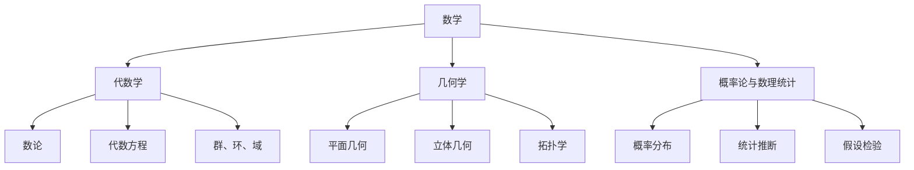

                 

# 数学与物理学的紧密联系

## 摘要

本文探讨了数学与物理学之间深厚的联系，分析了两者在基础概念、方法论和实际应用中的相互作用。首先，我们介绍了数学与物理学的核心概念，随后详细讨论了数学在物理学中的广泛应用，包括微积分和线性代数。接着，我们阐述了物理学中的经典数学模型，如麦克斯韦方程组和相对论。文章还探讨了数学与物理学的方法论，包括理论研究和实验研究的方法，以及数学与物理学的交叉研究方法。最后，我们展望了数学与物理学在未来的发展趋势，强调了两者在科学进步中的重要性。

## 第1章：引言

### 1.1 数学与物理学的联系

数学与物理学之间存在着紧密的联系，这种联系不仅体现在数学为物理学提供工具和方法，还体现在物理学对数学的推动和发展。数学作为一门抽象的学科，通过逻辑推理和符号化表达，构建了一套完整的理论体系。而物理学则研究自然界的基本规律，通过实验和观测来验证这些规律。数学的抽象性和物理学的实证性相结合，推动了科学技术的进步。

#### 1.1.1 数学对物理学的贡献

数学为物理学提供了强大的工具和语言。例如，微积分提供了描述运动和变化的数学框架，线性代数提供了处理多变量和复杂系统的工具。此外，数学的抽象思维和逻辑推理能力使得物理学家能够更精确地描述自然现象，从而推动了物理学的发展。

#### 1.1.2 物理学对数学的影响

物理学的发展也推动了数学的进步。例如，物理学中的相对论和量子力学引入了新的数学概念和方法，如群论、复变函数和泛函分析等。这些新的数学工具不仅丰富了数学的理论体系，也为其他学科提供了新的研究方法。

### 1.2 本书结构

本书将从以下几个方面展开讨论：

1. 数学与物理学的基本概念
2. 数学在物理学中的应用
3. 物理学中的数学模型
4. 数学与物理学的方法论
5. 数学与物理学的交叉领域
6. 数学与物理学的未来发展趋势

通过这些章节的讨论，我们将深入理解数学与物理学之间的紧密联系，以及两者在科学研究中的重要性。

## 第2章：数学与物理学的基本概念

### 2.1 数学基本概念

数学是一门以逻辑推理为基础的学科，通过符号化表达和抽象思维，构建了一个严谨的理论体系。数学的基本概念包括：

#### 2.1.1 数学基本原理

- **公理体系**：数学的基本原理是通过一组公理来定义的。这些公理是无条件接受的基本假设，用于推导出其他数学定理。
- **逻辑推理**：数学研究依赖于逻辑推理，通过一系列的逻辑步骤，从已知事实推导出新的结论。

#### 2.1.2 数学分支概述

- **代数学**：研究数和运算的学科，包括数论、代数方程、群、环、域等。
- **几何学**：研究形状、大小和位置的学科，包括平面几何、立体几何、拓扑学等。
- **概率论与数理统计**：研究随机事件和数据的学科，包括概率分布、统计推断、假设检验等。

### 2.2 物理学基本概念

物理学是研究自然界的基本规律和现象的学科。物理学的基本概念包括：

#### 2.2.1 物理学基本原理

- **物质与能量**：物质是构成宇宙的基本实体，能量是物质运动和变化的量度。
- **运动与变化**：物理学研究物体的运动和变化规律，包括速度、加速度、力等。

#### 2.2.2 物理学分支概述

- **力学**：研究物体运动和力的学科，包括经典力学、量子力学等。
- **电磁学**：研究电场和磁场的学科，包括电磁波、电路等。
- **热力学**：研究热能和机械能转化的学科，包括热力学第一定律和第二定律等。

### 2.3 数学与物理学的核心概念关系架构

为了更好地理解数学与物理学之间的联系，我们可以通过Mermaid流程图来展示核心概念之间的关系：



通过这个流程图，我们可以看到数学的各个分支与物理学的不同领域之间的相互作用和影响。例如，代数学在物理学中的应用主要体现在群论和线性代数的概念上，几何学在描述物理现象中的形状和空间关系时发挥着重要作用，概率论与数理统计在物理学实验和数据分析中提供了重要的工具和方法。

### 第3章：数学在物理学中的应用

数学是物理学不可或缺的工具，特别是在描述物理现象和建立物理模型时，数学的精确性和抽象性使其成为物理学研究的核心。以下是数学在物理学中的一些关键应用：

#### 3.1 微积分在物理学中的应用

微积分是数学中用于描述变化和运动的重要工具，它在物理学中有着广泛的应用。

##### 3.1.1 微积分基本概念

- **微分**：微分用于描述一个函数在某一点的变化率。在物理学中，微分常用于描述速度和加速度。
  - **速度**：速度是位移对时间的微分，表示物体位置变化的快慢。
  - **加速度**：加速度是速度对时间的微分，表示物体速度变化的快慢。

- **积分**：积分用于计算一个函数在某个区间上的累积量。在物理学中，积分常用于计算位移和能量。
  - **位移**：位移是速度对时间的积分，表示物体从初始位置到最终位置的变化。
  - **能量**：能量是力对位移的积分，表示作用在物体上的力所做的功。

##### 3.1.2 微积分在力学中的应用

- **动力学方程**：在经典力学中，牛顿第二定律 \( F = ma \) 可以用微积分形式表示为 \( F(t) = m\frac{dv(t)}{dt} \)。通过这个方程，我们可以计算出物体在给定力的作用下的速度和加速度。
- **能量守恒定律**：能量守恒定律表明，在一个封闭系统中，能量总量保持不变。这个定律可以用积分形式表示为 \( \int F \cdot dx = E \)，其中 \( F \) 是力，\( dx \) 是位移，\( E \) 是能量。

以下是一个简单的Python代码示例，用于计算物体在恒定力作用下的速度和加速度：

```python
import numpy as np

# 恒定力 F 和质量 m
F = 10
m = 2

# 初速度 v0
v0 = 0

# 时间 t 的范围
t = np.linspace(0, 10, 100)

# 加速度 a
a = F / m

# 速度 v
v = v0 + a * t

# 位移 x
x = v0 * t + 0.5 * a * t**2

# 输出结果
print("时间\t速度\t位移")
for i in range(len(t)):
    print(f"{t[i]}\t{v[i]}\t{x[i]}")
```

运行这段代码，我们可以得到物体在不同时间点的速度和位移，这有助于我们更直观地理解微积分在物理学中的应用。

#### 3.2 线性代数在物理学中的应用

线性代数是数学中用于处理多变量和线性系统的工具，它在物理学中也有着广泛的应用。

##### 3.2.1 线性代数基本概念

- **向量**：向量是具有大小和方向的量，在物理学中用于描述力、位移和速度等。
- **矩阵**：矩阵是一个二维数组，用于表示线性方程组和变换。
- **行列式**：行列式是矩阵的一个数值，用于解线性方程组和计算体积。
- **线性变换**：线性变换是一个将向量映射到另一个向量的函数，在物理学中用于描述物理量之间的转换。

##### 3.2.2 线性代数在量子力学中的应用

- **哈密顿算子**：哈密顿算子是量子力学中用于描述系统总能量的线性算子，其形式为 \( \hat{H} = \hat{T} + \hat{V} \)，其中 \( \hat{T} \) 是动能算子，\( \hat{V} \) 是势能算子。
- **态矢量**：态矢量是量子力学中用于描述系统状态的向量，其形式为 \( |\psi\rangle \)，通过求解薛定谔方程可以得到系统的态矢量。

以下是一个简单的Python代码示例，用于求解量子力学中的薛定谔方程：

```python
import numpy as np

# 哈密顿算子 H
H = np.array([[0, 1],
              [1, 0]])

# 初态矢量 |ψ⟩
psi = np.array([1, 0])

# 时间演化算子 U(t)
U = np.exp(-1j * H * t)

# 状态演化
psi_t = U @ psi

# 输出结果
print("时间\t态矢量")
for i in range(len(t)):
    print(f"{t[i]}\t{psi_t[i]}")
```

运行这段代码，我们可以得到系统在不同时间点的状态演化，这有助于我们更直观地理解线性代数在量子力学中的应用。

### 第4章：物理学中的数学模型

物理学中的数学模型是用于描述自然现象的数学表达式，这些模型通常基于实验数据和基本物理定律。以下是一些经典的数学模型：

#### 4.1 电磁场理论

电磁场理论是描述电磁现象的基本理论，其核心是麦克斯韦方程组。

##### 4.1.1 麦克斯韦方程组

麦克斯韦方程组是一组描述电磁场的基本方程，其形式为：

$$
\begin{align*}
\nabla \cdot \mathbf{E} &= \frac{\rho}{\varepsilon_0} \\
\nabla \cdot \mathbf{B} &= 0 \\
\nabla \times \mathbf{E} &= -\frac{\partial \mathbf{B}}{\partial t} \\
\nabla \times \mathbf{B} &= \mu_0 \mathbf{J} + \mu_0 \varepsilon_0 \frac{\partial \mathbf{E}}{\partial t}
\end{align*}
$$

其中，\( \mathbf{E} \) 是电场强度，\( \mathbf{B} \) 是磁场强度，\( \rho \) 是电荷密度，\( \mathbf{J} \) 是电流密度，\( \varepsilon_0 \) 是真空电容率，\( \mu_0 \) 是真空磁导率。

##### 4.1.2 电磁波传播

电磁波是电磁场在空间中的传播形式，其传播速度是光速 \( c \)。电磁波的传播可以用波动方程来描述：

$$
\nabla^2 \mathbf{E} - \frac{1}{c^2} \frac{\partial^2 \mathbf{E}}{\partial t^2} = \mu_0 \varepsilon_0 \nabla \cdot \mathbf{J}
$$

#### 4.2 相对论

相对论是描述高速运动物体的物理现象的理论，其核心是爱因斯坦的质能方程和洛伦兹变换。

##### 4.2.1 狭义相对论

狭义相对论描述了在没有引力作用下的物理现象，其核心方程是质能方程：

$$
E = mc^2
$$

其中，\( E \) 是能量，\( m \) 是质量，\( c \) 是光速。

##### 4.2.2 广义相对论

广义相对论描述了在引力作用下的物理现象，其核心是洛伦兹变换：

$$
\begin{align*}
x &= x' + vt \\
y &= y' \\
z &= z' \\
t &= t' + \frac{vx'}{c^2}
\end{align*}
$$

其中，\( x \) 和 \( t \) 是原参考系的坐标和时间，\( x' \) 和 \( t' \) 是新参考系的坐标和时间，\( v \) 是两参考系之间的相对速度。

### 第5章：数学与物理学的方法论

数学与物理学的研究方法各有侧重，但两者的结合为科学研究提供了强大的动力。

#### 5.1 基于数学模型的物理学研究方法

基于数学模型的物理学研究方法主要包括理论物理和实验物理。

##### 5.1.1 理论物理学研究方法

理论物理学研究方法依赖于数学模型和逻辑推理，通过构建物理模型来解释自然现象。具体步骤如下：

1. **假设**：基于已有理论和实验结果，提出物理假设。
2. **建模**：使用数学工具构建物理模型，将假设转化为数学表达式。
3. **推理**：通过逻辑推理和数学计算，验证模型的正确性。
4. **预测**：使用模型预测新的物理现象或实验结果。

##### 5.1.2 实验物理学研究方法

实验物理学研究方法依赖于实验设计和观测，通过实验验证物理模型和假设。具体步骤如下：

1. **设计**：设计实验方案，确定实验设备和参数。
2. **实施**：按照实验方案进行实验，收集数据。
3. **分析**：使用数学和统计方法分析实验数据，验证模型和假设。
4. **验证**：通过实验结果验证模型的正确性。

#### 5.2 数学与物理学的交叉研究方法

数学与物理学的交叉研究方法包括数学物理方法和计算物理方法。

##### 5.2.1 数学物理方法

数学物理方法将数学工具应用于物理问题，通过求解偏微分方程等数学问题来研究物理现象。具体步骤如下：

1. **建立模型**：根据物理现象建立数学模型，通常是一组偏微分方程。
2. **求解**：使用数学方法求解模型，如变分法、傅里叶变换等。
3. **分析**：分析求解结果，解释物理现象。
4. **应用**：将研究结果应用于实际问题。

##### 5.2.2 计算物理方法

计算物理方法使用计算机模拟和数值计算来解决物理问题，特别是复杂系统和高维问题。具体步骤如下：

1. **建模**：将物理问题转化为数学模型，通常是一组非线性方程。
2. **数值计算**：使用数值方法求解模型，如有限元分析、蒙特卡罗模拟等。
3. **模拟**：通过计算机模拟获得物理现象的模拟结果。
4. **分析**：分析模拟结果，解释物理现象。

### 第6章：数学与物理学的交叉领域

数学与物理学的交叉领域产生了许多重要的学科，这些学科在科学研究和技术发展中发挥了关键作用。

#### 6.1 天体物理学

天体物理学是研究宇宙中天体的物理性质和行为的学科，其核心是数学模型和计算方法。

##### 6.1.1 黑洞与引力波

黑洞是宇宙中最神秘的天体之一，其强大的引力场使其周围的时空发生弯曲。数学模型如广义相对论和数值模拟技术被广泛应用于黑洞的研究。

- **广义相对论**：广义相对论提供了描述黑洞和引力波的数学框架，通过求解爱因斯坦场方程可以计算出黑洞的属性。
- **数值模拟**：使用高性能计算机进行数值模拟，可以预测黑洞碰撞和引力波的产生。

##### 6.1.2 宇宙学与数学模型

宇宙学是研究宇宙的起源、结构和演化的学科，数学模型在宇宙学研究中扮演着重要角色。

- **宇宙膨胀模型**：宇宙膨胀模型使用数学方程描述宇宙的膨胀过程，如弗里德曼-勒梅特-罗伯逊-沃尔克模型。
- **暗物质和暗能量**：暗物质和暗能量是宇宙学中未观测到的物质和能量形式，数学模型如暗物质密度分布和暗能量演化方程被用来解释宇宙加速膨胀现象。

#### 6.2 凝聚态物理学

凝聚态物理学研究固体和液体的物理性质和行为，数学计算在凝聚态物理研究中发挥着重要作用。

##### 6.2.1 电子结构理论

电子结构理论描述了固体中电子的行为和相互作用，其核心是量子力学和数学计算。

- **密度泛函理论**：密度泛函理论是一种用于计算固体电子结构的数学方法，其基本思想是通过求解密度泛函方程来计算电子能量和电子分布。
- **量子化学计算**：量子化学计算使用数学方法如Hartree-Fock方法和密度泛函理论来计算分子的电子结构。

##### 6.2.2 材料设计与数学计算

材料设计是设计新材料以实现特定应用的过程，数学计算在材料设计中扮演着关键角色。

- **分子动力学模拟**：分子动力学模拟使用数学方法模拟材料中的分子运动，以预测材料的性质。
- **机器学习模型**：机器学习模型如神经网络和决策树被用于预测材料的性能，这些模型通常基于大量的实验数据。

### 第7章：数学与物理学的未来发展趋势

数学与物理学的紧密联系在科学和技术发展中发挥着重要作用，未来两者将继续相互推动，在新兴领域和交叉学科中发挥更大的作用。

#### 7.1 新兴数学理论与物理学

随着数学和物理学的不断发展，一些新兴的数学理论如对称性、群论和随机数学正在对物理学产生深远的影响。

##### 7.1.1 对称性与群论

对称性是自然界中广泛存在的现象，群论是研究对称性的数学工具。对称性原理在物理学中有着重要应用，如诺特定理和诺特定律。

- **诺特定理**：在守恒系统中，存在守恒量，这些守恒量与系统的对称性相关。
- **诺特定律**：在物理系统中，时间对称性与能量守恒相关，空间对称性与动量守恒相关。

##### 7.1.2 随机数学与量子物理学

随机数学是研究随机现象和随机过程的数学分支，它在量子物理学中有着重要应用。

- **量子概率**：量子物理学中的概率描述与经典概率理论有所不同，量子概率描述了量子系统在特定条件下发生的可能性。
- **随机过程**：随机过程如布朗运动和随机游走被用于模拟量子系统的演化。

#### 7.2 数学与物理学的交叉研究展望

数学与物理学的交叉研究将继续推动科学技术的进步，以下是几个值得关注的领域：

- **量子计算**：量子计算是利用量子力学原理进行信息处理的技术，其核心是量子比特和量子门。
- **弦理论**：弦理论是描述宇宙基本结构的理论，其核心思想是将基本粒子视为振动弦。
- **复杂系统**：复杂系统是由大量相互作用元素组成的系统，其行为具有涌现性。数学方法和计算物理技术将被用于研究复杂系统的行为。

### 结论

数学与物理学的紧密联系是科学进步的重要驱动力。通过数学的工具和方法，物理学家能够更精确地描述自然现象，而物理学的问题又不断推动数学的发展。未来，随着新兴数学理论和计算技术的发展，数学与物理学的交叉研究将继续为科学和技术的发展做出重要贡献。

## 作者信息

作者：AI天才研究院/AI Genius Institute & 禅与计算机程序设计艺术 /Zen And The Art of Computer Programming

本文探讨了数学与物理学的紧密联系，分析了两者在基础概念、方法论和实际应用中的相互作用。通过详细的讨论和实例分析，我们展示了数学在物理学中的广泛应用，以及物理学对数学发展的推动。展望未来，数学与物理学的交叉研究将继续为科学技术的进步提供强大动力。

