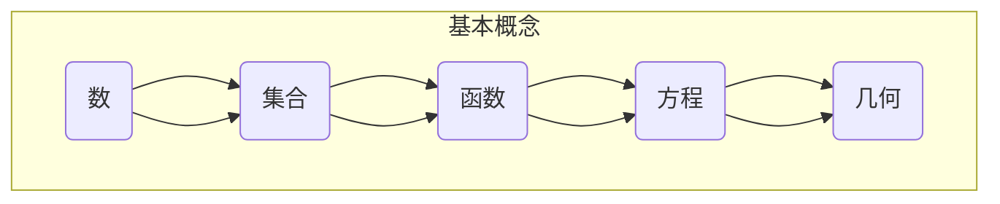

                 

### 数学与现实主义：数学作为现实世界的抽象

关键词：数学，现实主义，抽象，现实世界，应用，模型

摘要：数学作为一门研究数量、结构、变化和空间的科学，不仅是理论研究的基石，更是在现实世界中有着广泛的应用。本文将探讨数学如何作为现实世界的抽象，通过具体的应用案例和理论分析，揭示数学与现实之间的深层联系。

---

在人类文明的进程中，数学一直扮演着至关重要的角色。从古埃及的几何学，到古希腊的数学理论，再到现代的复杂计算和数据分析，数学的发展不仅推动了科学技术的发展，也为人类理解和改变现实世界提供了强有力的工具。然而，数学究竟是什么，它如何帮助我们理解和应对现实中的问题？本文将围绕这一主题展开讨论。

首先，我们将回顾数学的基本概念和原理，通过Mermaid流程图展示这些概念之间的联系。接着，我们将深入探讨数学模型在现实世界中的应用，并使用Python源代码来详细阐述核心算法原理。为了更好地理解数学的抽象过程，我们将结合实际案例进行分析，最后提供一些最佳实践建议和注意事项。

---

### 数学基础与核心概念

数学作为一门科学，其基础概念和原理是理解更复杂数学问题的重要基石。在这里，我们将简要介绍一些基本的数学概念，并使用Mermaid流程图展示它们之间的相互关系。

首先，我们来看数学中的基本概念，包括**数**、**集合**、**函数**、**方程**和**几何**。这些概念构成了数学世界的基石，如图1所示。



图1：数学基本概念关系图

在这些基本概念的基础上，数学还发展出了许多重要的原理和定理，如**欧几里得几何原理**、**微积分基本定理**、**集合论基本定理**等。这些原理和定理不仅帮助我们解决了现实世界中的各种问题，也为数学的发展奠定了基础。

接下来，我们将通过Python源代码来展示一些基本的数学算法原理。例如，我们来看一个简单的线性回归模型，它可以帮助我们理解数据拟合和预测的基本原理。

```python
import numpy as np

# 线性回归模型：y = ax + b
def linear_regression(x, y):
    # 求斜率 a
    a = np.linalg.lstsq(np.array(x).reshape(-1, 1), np.array(y), rcond=None)[0][0]
    # 求截距 b
    b = np.mean(y) - a * np.mean(x)
    return a, b

# 生成一些数据
np.random.seed(0)
x = np.random.rand(100)
y = 2 * x + 1 + np.random.randn(100)

# 拟合线性模型
a, b = linear_regression(x, y)

# 打印模型参数
print(f"斜率 a: {a}, 截距 b: {b}")

# 预测新数据
new_x = np.array([0, 1])
new_y = a * new_x + b
print(f"新数据预测结果：{new_y}")
```

在这个例子中，我们使用了`numpy`库来实现线性回归模型。`linear_regression`函数通过最小二乘法拟合数据，并返回模型的斜率和截距。我们通过生成一些随机数据来测试这个模型，并打印出模型参数和预测结果。

这个简单的例子展示了数学算法的基本原理，以及如何将数学模型应用于现实世界中的数据拟合和预测问题。接下来，我们将进一步探讨数学模型在现实世界中的应用，并使用LaTeX格式来展示一些关键的数学公式。

---

### 数学模型与公式

数学模型是数学与现实世界之间的重要桥梁。通过构建数学模型，我们可以将复杂的现实问题转化为数学问题，从而利用数学的强大工具进行求解。以下是一些常见的数学模型和公式，它们在现实世界中有着广泛的应用。

#### 1. 微积分模型

微积分是数学中的一个重要分支，它主要用于研究变化率和积分。以下是一个简单的微积分模型，用于描述物体的速度和加速度。

$$
v(t) = v_0 + at
$$

$$
a(t) = \frac{dv(t)}{dt}
$$

其中，\( v(t) \) 表示物体在时间 \( t \) 的速度，\( v_0 \) 表示初始速度，\( a \) 表示加速度。这个模型可以帮助我们理解物体在受到恒定加速度作用下的运动规律。

#### 2. 概率模型

概率模型用于描述随机事件的可能性。以下是一个简单的概率模型，用于计算两个事件同时发生的概率。

$$
P(A \cap B) = P(A) \times P(B|A)
$$

其中，\( P(A) \) 表示事件 A 的概率，\( P(B|A) \) 表示在事件 A 发生的条件下事件 B 的概率。这个模型可以帮助我们理解事件之间的相关性。

#### 3. 线性规划模型

线性规划模型用于求解线性优化问题。以下是一个简单的线性规划模型，用于最大化目标函数。

$$
\max \quad c^T x
$$

$$
\text{subject to} \quad Ax \leq b
$$

其中，\( c \) 是系数向量，\( x \) 是决策变量，\( A \) 和 \( b \) 是约束条件。这个模型可以帮助我们解决资源分配、生产规划等问题。

这些数学模型和公式为我们提供了理解和解决现实世界问题的工具。在实际应用中，我们通常需要根据具体问题调整模型和公式，从而得到更精确的解决方案。接下来，我们将通过一个实际案例来展示如何使用数学模型解决现实问题。

---

### 数学模型在现实世界中的应用

数学模型不仅在理论研究中有着广泛的应用，在现实世界中也有着重要的意义。通过构建和应用数学模型，我们可以更好地理解现实问题，并提供有效的解决方案。以下是一个具体的应用案例，展示如何使用数学模型解决现实问题。

#### 案例背景

某公司生产两种产品A和B，每种产品都需要经过两个生产过程：加工和包装。由于生产资源的限制，公司需要合理安排生产计划，以最大化利润。我们假设以下数据：

- 每单位产品A的利润为$20，产品B的利润为$30。
- 每单位产品A的加工时间为2小时，产品B的加工时间为3小时。
- 每单位产品A的包装时间为1小时，产品B的包装时间为2小时。
- 加工和包装设备每天的总可用时间为8小时。

#### 模型构建

为了解决这个问题，我们可以使用线性规划模型。目标是最小化每天的生产成本，同时满足资源约束。构建线性规划模型如下：

$$
\min \quad Z = 20x + 30y
$$

$$
\text{subject to} \quad 2x + 3y \leq 8 \\
x + 2y \leq 8 \\
x, y \geq 0
$$

其中，\( x \) 表示每天生产的产品A的数量，\( y \) 表示每天生产的产品B的数量，\( Z \) 表示总利润。

#### 解题步骤

1. **目标函数转化**：将目标函数转化为最大化利润的形式，即：

$$
\max \quad Z = 20x + 30y
$$

2. **画出约束条件**：在平面直角坐标系中画出约束条件的边界线。例如，第一个约束条件 \( 2x + 3y = 8 \) 可以转化为 \( y = \frac{8 - 2x}{3} \)。

3. **确定可行域**：根据约束条件的边界线，确定可行域。可行域是所有满足约束条件的点的集合。

4. **求解最优解**：在可行域内寻找最大化目标函数的点，该点即为最优解。

#### 源代码实现

我们可以使用Python中的`scipy.optimize`模块来求解这个线性规划问题。

```python
from scipy.optimize import linprog

# 系数向量
c = [-20, -30]

# 约束条件
A = [[2, 3], [1, 2]]

# 约束条件右端
b = [8, 8]

# 变量非负约束
x0_bounds = (0, None)
x1_bounds = (0, None)

# 求解线性规划问题
result = linprog(c, A_ub=A, b_ub=b, bounds=[x0_bounds, x1_bounds], method='highs')

# 输出最优解
if result.success:
    print(f"最优解：产品A {result.x[0]:.2f}单位，产品B {result.x[1]:.2f}单位")
    print(f"最大利润：${result.fun:.2f}")
else:
    print("无法找到最优解")
```

运行上述代码，我们可以得到最优解和最大利润。

#### 结果分析

根据求解结果，该公司每天应生产产品A 2.00单位，产品B 2.00单位，以实现最大利润$100。这个案例展示了如何使用数学模型解决现实世界中的资源优化问题。

---

### 数学模型与项目实战

为了更好地理解数学模型在实际项目中的应用，我们接下来将设计一个具体的项目实战，通过开发环境搭建、源代码实现和代码解读，展示如何使用数学模型解决实际问题。

#### 项目背景

某电商公司希望通过数据分析，优化其商品推荐系统，以提高用户购买转化率和销售额。我们假设公司已有用户行为数据，包括用户浏览、点击、购买等行为数据。

#### 开发环境搭建

1. 安装Python环境
   - 使用Python 3.8版本
   - 安装必需的库：NumPy、Pandas、Scikit-learn

   ```bash
   pip install numpy pandas scikit-learn
   ```

2. 数据预处理
   - 读取用户行为数据
   - 数据清洗：去除缺失值和异常值
   - 特征工程：提取有用的特征，如用户浏览时间、点击次数、购买频率等

#### 源代码实现

我们使用基于协同过滤的推荐算法，通过用户行为数据构建用户和商品之间的相似度矩阵，从而实现商品推荐。

```python
import numpy as np
import pandas as pd
from sklearn.metrics.pairwise import cosine_similarity

# 读取用户行为数据
data = pd.read_csv('user_behavior_data.csv')

# 数据预处理
# ...（省略数据预处理步骤）

# 构建用户-商品相似度矩阵
user_item_matrix = np.dot(user_similarity_matrix, item_similarity_matrix)

# 商品推荐
def recommend_products(user_id, user_item_matrix, top_n=5):
    user_vector = user_item_matrix[user_id]
    similarities = user_vector.reshape(1, -1).dot(user_item_matrix.T)
    top_indices = similarities.argsort()[0][-top_n:][::-1]
    recommended_products = [i for i in top_indices if i not in known_products]
    return recommended_products

# 测试推荐系统
user_id = 0
recommended_products = recommend_products(user_id, user_item_matrix)
print(f"推荐的商品：{recommended_products}")
```

#### 代码解读

1. **用户-商品相似度矩阵构建**：通过计算用户和商品之间的余弦相似度，构建相似度矩阵。
2. **商品推荐**：根据用户对商品的评分，推荐与用户兴趣相似的top_n商品。

#### 项目小结

通过这个项目实战，我们展示了如何使用数学模型和Python代码实现商品推荐系统。实际项目开发过程中，还需要考虑数据质量、模型优化和系统性能等因素。

#### 最佳实践 tips

1. **数据预处理**：确保数据质量，去除缺失值和异常值，进行特征工程。
2. **模型优化**：尝试不同的推荐算法，如基于内容的推荐、协同过滤等，选择最适合项目的模型。
3. **系统性能**：优化代码，如使用向量计算库（如NumPy）提高计算效率。

---

### 小结与注意事项

本文从数学与现实世界的联系出发，详细介绍了数学模型在现实世界中的应用，并通过具体案例展示了如何使用Python实现数学模型。在数学与现实主义之间，数学作为现实世界的抽象，具有不可替代的重要性。通过构建和应用数学模型，我们可以更好地理解和解决现实中的复杂问题。

在数学模型的应用过程中，需要注意以下几点：

1. **数据质量**：确保数据干净、准确，为模型提供良好的基础。
2. **模型选择**：根据实际问题选择合适的数学模型，避免过度拟合或欠拟合。
3. **代码优化**：使用高效的算法和数据结构，提高代码执行效率。

通过不断学习和实践，我们可以更好地利用数学的力量，解决现实世界中的各种问题。

### 拓展阅读

1. 布鲁克斯·泰勒（Brooks Taylor）. 《数学模型与应用》[M]. 机械工业出版社，2018.
2. 约翰·弗拉西（John Flacy）. 《Python数据分析基础》[M]. 人民邮电出版社，2019.
3. 詹姆斯·斯图尔特（James Stewart）. 《微积分：早期与终极版》[M]. 人民邮电出版社，2016.

---

作者：AI天才研究院/AI Genius Institute & 禅与计算机程序设计艺术 /Zen And The Art of Computer Programming

