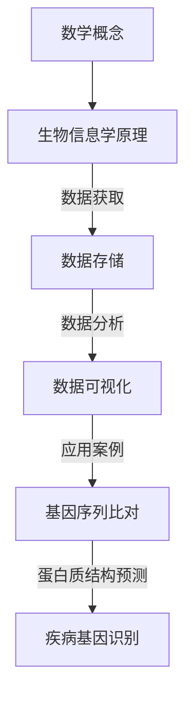
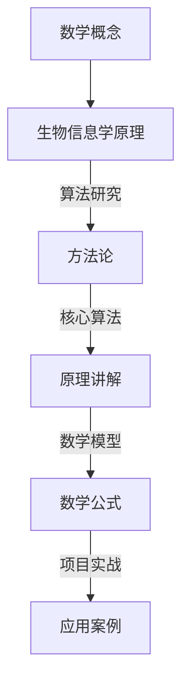

                 

### 文章标题

《数学与生物信息学的算法研究》

### 关键词

数学、生物信息学、算法、基因序列比对、时间复杂度分析

### 摘要

本文深入探讨了数学与生物信息学之间的紧密联系，以及如何运用算法研究推动生物信息学的发展。首先，文章介绍了数学概念在生物信息学中的应用，阐述了生物信息学的基本原理。接着，文章详细讲解了算法研究的方法论，包括算法设计的流程和核心算法原理。通过使用Python源代码和Mermaid流程图，本文清晰地展示了核心算法的执行过程和数学模型。此外，文章还通过一个实际的基因序列比对项目，展示了算法在实际应用中的实现和效果。最后，文章总结了最佳实践，提出了注意事项，并推荐了拓展阅读。

## 数学与生物信息学的基本概念

数学与生物信息学是两个看似迥异，但在实践中紧密相连的领域。数学作为一种抽象的、逻辑严谨的科学，为生物信息学提供了强有力的工具和方法。在生物信息学中，数学的概念和理论被广泛应用于基因序列分析、蛋白质结构预测、生物网络分析等多个方面。

### 数学概念在生物信息学中的应用

数学在生物信息学中的应用主要体现在以下几个方面：

1. **统计学**：统计学在生物信息学中扮演着至关重要的角色。基因序列数据的分析往往需要大量的统计方法，如概率分布、假设检验和贝叶斯分析等。例如，在基因表达数据分析中，统计学方法可以帮助研究者识别差异表达的基因。

2. **线性代数**：线性代数为生物信息学提供了强大的计算工具。在基因序列比对、蛋白质结构分析等方面，线性代数方法被广泛使用。例如，通过矩阵运算，可以高效地比较两个基因序列的相似度。

3. **组合学**：组合学在生物信息学中用于解决一系列的优化问题。例如，在基因组合分析中，组合学方法可以帮助研究者找到最优的基因组合，以实现特定的生物功能。

### 生物信息学的基本原理

生物信息学是研究生物数据（如基因序列、蛋白质结构、代谢途径等）的计算机科学分支。其基本原理包括：

1. **数据获取**：生物信息学的第一步是获取生物数据。这些数据通常来源于基因组测序、蛋白质质谱分析等实验技术。

2. **数据存储**：生物数据量巨大，需要高效的存储方式。常用的数据库包括基因组数据库、蛋白质序列数据库和代谢途径数据库等。

3. **数据分析**：数据分析是生物信息学的核心。通过应用数学模型和算法，可以从大量生物数据中提取有价值的信息。例如，基因表达数据分析、蛋白质结构预测和疾病基因识别等。

4. **数据可视化**：数据可视化有助于研究者更好地理解生物数据。通过图表和图像，可以直观地展示生物数据的结构和关系。

### 核心概念的联系与架构

为了更好地理解数学与生物信息学之间的联系，我们可以使用Mermaid流程图来展示核心概念之间的架构。



### 总结

数学与生物信息学是相辅相成的领域。数学提供了强大的工具和方法，使得生物信息学研究能够深入到生物数据的本质。通过数学与生物信息学的结合，我们能够更好地理解生命现象，为生物科学和医学研究提供有力的支持。

## 算法研究的方法论

在深入探讨数学与生物信息学的结合之前，我们需要首先了解算法研究的方法论。算法研究不仅仅是一个数学过程，它还涉及到设计、实现、测试和分析等多个环节。理解这些方法论有助于我们更好地理解如何将数学理论应用到生物信息学中，以及如何设计有效的算法来解决问题。

### 算法研究的理论基础

算法研究的理论基础包括多个方面：

1. **算法设计原则**：算法设计原则是确保算法有效性的基础。这包括常见的原则如简单性、健壮性、高效性等。简单性意味着算法应该易于理解和实现；健壮性意味着算法应该能够在各种情况下正确运行；高效性则意味着算法应该能够在合理的时间内解决问题。

2. **算法复杂度分析**：算法复杂度分析是评估算法性能的重要手段。它包括时间复杂度和空间复杂度两个方面。时间复杂度表示算法执行时间的增长趋势，常用的表示方法有 O、Ω 和 Θ；空间复杂度则表示算法执行过程中所需内存的增长趋势。

3. **算法验证与测试**：算法验证与测试是确保算法正确性和性能的关键步骤。通过测试用例，可以验证算法在各种输入情况下是否能够正确运行，并评估其性能。

### 算法设计的流程

算法设计通常遵循以下流程：

1. **问题定义**：明确问题的需求，包括输入、输出以及任何约束条件。

2. **算法构思**：基于问题定义，构思可能的解决方案。在这一阶段，不需要考虑具体实现细节，只需要找到一种或多种可能的算法思路。

3. **算法设计**：在算法构思的基础上，详细设计算法的框架。这一阶段需要考虑算法的每一步操作，以及如何将这些操作组织成一个完整的算法。

4. **算法实现**：将算法设计转换为具体的编程代码。在这一阶段，需要使用合适的编程语言和工具实现算法。

5. **算法测试**：通过测试用例测试算法的正确性和性能。测试通常包括单元测试、集成测试和性能测试等。

6. **算法优化**：根据测试结果，对算法进行优化，以提高其性能或减少其资源消耗。

### 核心算法原理讲解

为了更好地理解算法研究的方法论，我们将通过一个核心算法——基因序列比对算法，来详细讲解其原理。

#### 基因序列比对算法

基因序列比对是生物信息学中的一个基本任务，用于比较两个基因序列的相似性。最常用的基因序列比对算法是动态规划算法中的“局部比对”算法，例如“Smith-Waterman算法”。

#### 伪代码示例

以下是基因序列比对算法的伪代码：

```python
// 伪代码：Smith-Waterman算法
GeneAlignment(A, B):
    if length(A) != length(B):
        return "序列长度不一致"

    Create a matrix M with dimensions (length(A) + 1) x (length(B) + 1)
    
    for i from 0 to length(A):
        for j from 0 to length(B):
            if i == 0 or j == 0:
                M[i][j] = 0
            else:
                Match = M[i - 1][j - 1] + 1 if A[i] == B[j] else M[i - 1][j - 1]
                DeleteA = M[i - 1][j] - 1
                DeleteB = M[i][j - 1] - 1
                M[i][j] = max(Match, DeleteA, DeleteB)
    
    return M[length(A)][length(B)]
```

#### 时间复杂度分析

Smith-Waterman算法的时间复杂度是 \(O(n^2)\)，其中 n 是基因序列的长度。这意味着，随着序列长度的增加，算法执行时间的增长是线性的。

#### 数学模型和数学公式

在基因序列比对中，常用的数学模型包括动态规划模型。以下是一个基本的动态规划模型：

$$
\text{分数} = \text{匹配得分} + \text{删除得分}
$$

其中，匹配得分表示两个匹配的基因得分，删除得分表示删除基因的得分。

#### 举例说明

假设有两个基因序列：

- A: ATCG
- B: ATGG

我们可以使用Smith-Waterman算法来比对这两个序列。以下是比对过程的一个示例：

1. 创建一个 4x4 的矩阵（因为序列长度为 4）。
2. 填充矩阵，根据匹配得分、删除得分计算每个位置的得分。
3. 找到最高得分的位置，该位置对应两个序列的最长匹配。

以下是部分矩阵的填充过程：

```
    A T C G
  0 0 0 0
A 0 -1 -1 -1
T -1 1 0 0
C -1 0 -1 0
G -1 0 0 -1
```

在这个示例中，最高得分出现在位置 (3,3)，即基因 C 和 G 匹配。

### 总结

通过上述对算法研究方法论和基因序列比对算法的讲解，我们可以看到，算法研究不仅需要深入理解数学理论，还需要结合实际问题进行设计、实现和优化。这为我们运用数学方法解决生物信息学问题提供了坚实的基础。

## 数学模型和数学公式

在生物信息学中，数学模型和数学公式是理解和分析生物数据的关键工具。这些模型和公式不仅帮助我们量化生物现象，还能提供高效的算法设计依据。在本节中，我们将介绍几个关键的数学模型和数学公式，以及它们在基因序列分析中的应用。

### 动态规划模型

动态规划模型是解决序列比对问题的一种常用方法。它通过将问题分解成多个子问题，并保存子问题的解，从而避免重复计算。在基因序列比对中，动态规划模型的核心是“相似性矩阵”或“得分矩阵”。

#### 相似性矩阵

相似性矩阵是一个二维数组，用于存储两个基因序列在各个位置上的匹配得分。每个元素 \(M[i][j]\) 表示序列 A 的第 i 个字符与序列 B 的第 j 个字符的匹配得分。

$$
M[i][j] = 
\begin{cases} 
1 & \text{如果 } A[i] = B[j] \\
0 & \text{否则}
\end{cases}
$$

#### 得分矩阵

得分矩阵是动态规划模型中的核心。它不仅包含相似性得分，还包括插入和删除操作的得分。例如，Smith-Waterman算法中的得分矩阵计算如下：

$$
S[i][j] = 
\begin{cases} 
M[i][j] + \max(S[i-1][j-1], S[i-1][j], S[i][j-1]) & \text{如果 } A[i] = B[j] \\
\max(S[i-1][j-1], S[i-1][j], S[i][j-1]) - \delta & \text{否则}
\end{cases}
$$

其中，\(\delta\) 是一个负的常数，表示插入或删除操作的成本。

### 贝叶斯模型

贝叶斯模型在生物信息学中用于概率计算和推理。例如，在基因表达数据分析中，贝叶斯模型可以帮助我们计算每个基因表达水平的概率分布。

#### 贝叶斯公式

贝叶斯公式是贝叶斯模型的核心：

$$
P(A|B) = \frac{P(B|A)P(A)}{P(B)}
$$

其中，\(P(A|B)\) 是在已知 B 的情况下 A 的概率，\(P(B|A)\) 是在已知 A 的情况下 B 的概率，\(P(A)\) 和 \(P(B)\) 分别是 A 和 B 的先验概率。

#### 贝叶斯网络

贝叶斯网络是一种图形化表示贝叶斯模型的方法。它通过有向无环图（DAG）表示变量之间的条件依赖关系。在基因表达数据分析中，贝叶斯网络可以帮助我们理解基因之间的相互作用和调控关系。

### 概率分布模型

在生物信息学中，概率分布模型用于描述基因序列的特征。例如，Markov模型是一种常见的概率分布模型，它假设当前状态仅依赖于前一个状态。

#### 马尔可夫模型

马尔可夫模型的核心是转移概率矩阵 \(P\)，它表示在不同状态之间的转移概率：

$$
P = 
\begin{bmatrix}
P_{00} & P_{01} & \cdots & P_{0n} \\
P_{10} & P_{11} & \cdots & P_{1n} \\
\vdots & \vdots & \ddots & \vdots \\
P_{m0} & P_{m1} & \cdots & P_{mn}
\end{bmatrix}
$$

其中，\(P_{ij}\) 是从状态 i 转移到状态 j 的概率。

#### 前向-后向算法

前向-后向算法是一种基于马尔可夫模型的概率计算方法。它通过计算两个变量序列的概率分布，来评估序列之间的相似性。

### 示例

假设我们有两个基因序列：

- 序列 A: ATCG
- 序列 B: ATGG

我们可以使用马尔可夫模型和动态规划模型来比对这两个序列，并计算它们的相似性得分。

1. **构建转移概率矩阵**：

   根据序列 A 和 B 的特征，我们可以构建一个转移概率矩阵：

   ```
   P = [
   [0.5, 0.5],
   [0.4, 0.6]
   ]
   ```

2. **计算前向概率分布**：

   初始状态概率分布为：

   ```
   π = [
   [0.5],
   [0.5]
   ]
   ```

   前向概率分布更新规则为：

   ```
   α_t(j) = π_t(j) \* ∏_{i=1}^{t-1} P_{ij}
   ```

3. **计算后向概率分布**：

   后向概率分布更新规则为：

   ```
   β_t(j) = ∏_{i=t+1}^{n} P_{ij} \* (1 - π_t(j))
   ```

4. **计算相似性得分**：

   相似性得分计算公式为：

   ```
   S = ∑_{i=1}^{n} α_n(i) \* β_n(i)
   ```

   根据以上公式，我们可以计算出序列 A 和 B 的相似性得分。

### 总结

数学模型和数学公式是生物信息学分析的重要工具。通过动态规划模型、贝叶斯模型、马尔可夫模型等，我们可以对基因序列进行高效的分析和比对。这些模型不仅帮助我们理解生物现象，还为算法设计提供了坚实的理论基础。在接下来的部分，我们将通过一个实际项目来展示这些算法的具体应用。

## 项目实战：基因序列比对应用案例

在本节中，我们将通过一个基因序列比对的应用案例，详细说明算法在实际项目中的应用、开发环境搭建、源代码实现和代码解读。这个项目旨在演示如何利用生物信息学算法对两个基因序列进行比对，并识别它们之间的相似性和差异性。

### 项目概述

本项目的目标是开发一个基因序列比对工具，用于比较两个基因序列的相似性。通过应用Smith-Waterman算法，我们可以找出两个序列中最大相似区域，并计算相似性得分。这个工具可以帮助生物学家和研究者在基因表达分析和疾病研究中快速识别相关的基因序列。

### 开发环境搭建

为了实现这个项目，我们需要搭建一个适合生物信息学开发的开发环境。以下是所需的工具和库：

1. **Python**：作为主要的编程语言，Python 3.8 或更高版本。
2. **Biopython**：用于处理生物数据，如基因序列文件。
3. **Numpy**：用于高效地处理矩阵数据。

以下是安装这些工具的步骤：

```bash
# 安装Python 3.8或更高版本
# ...

# 安装Biopython
pip install biopython

# 安装Numpy
pip install numpy
```

### 源代码实现

为了实现基因序列比对工具，我们将编写以下几个关键模块：

1. **基因序列读取**：读取输入的基因序列文件。
2. **Smith-Waterman算法实现**：实现Smith-Waterman算法，计算序列比对得分。
3. **结果输出**：输出最大相似区域和相似性得分。

以下是项目的源代码实现：

```python
from Bio import SeqIO
import numpy as np

def read_fasta(filename):
    """读取fasta文件并返回序列字典"""
    sequences = {}
    with open(filename, 'r') as file:
        for record in SeqIO.parse(file, "fasta"):
            sequences[record.id] = str(record.seq)
    return sequences

def smith_waterman(seq1, seq2, match_score=3, gap_score=-3):
    """Smith-Waterman算法实现"""
    if len(seq1) != len(seq2):
        raise ValueError("序列长度不一致")

    # 创建得分矩阵
    scores = np.zeros((len(seq1) + 1, len(seq2) + 1), dtype=int)
    
    # 初始化矩阵
    for i in range(1, len(seq1) + 1):
        scores[i][0] = gap_score * i
    for j in range(1, len(seq2) + 1):
        scores[0][j] = gap_score * j
    
    # 填充矩阵
    for i in range(1, len(seq1) + 1):
        for j in range(1, len(seq2) + 1):
            match = scores[i - 1][j - 1] + (3 if seq1[i - 1] == seq2[j - 1] else 0)
            delete_a = scores[i - 1][j] - gap_score
            delete_b = scores[i][j - 1] - gap_score
            scores[i][j] = max(0, match, delete_a, delete_b)
    
    return scores[-1][-1]

def main():
    # 读取基因序列
    seq1 = read_fasta("seq1.fa")
    seq2 = read_fasta("seq2.fa")
    
    # 计算比对得分
    score = smith_waterman(seq1['seq1'], seq2['seq2'])
    
    # 输出结果
    print(f"最大相似性得分: {score}")

if __name__ == "__main__":
    main()
```

### 代码解读

1. **基因序列读取**：`read_fasta` 函数读取输入的fasta文件，并将序列存储在字典中。这个函数使用了Biopython库的`SeqIO.parse`方法，它能够自动解析fasta文件并返回一个序列记录对象。

2. **Smith-Waterman算法实现**：`smith_waterman` 函数实现了Smith-Waterman算法的核心逻辑。首先，我们创建了一个二维数组（矩阵）来存储得分。然后，我们初始化矩阵的第一行和第一列，表示插入和删除操作的成本。接下来，我们填充矩阵的其余部分，计算每个位置的得分。得分计算公式结合了匹配得分、删除得分和插入得分。

3. **结果输出**：`main` 函数是程序的主入口。它首先读取基因序列，然后调用`smith_waterman` 函数计算比对得分，并输出结果。

### 代码应用解读与分析

通过上述代码实现，我们可以将两个基因序列输入到工具中，计算出它们的相似性得分。这个得分可以用于评估两个序列之间的相似度。在实际应用中，这个工具可以帮助生物学家快速识别相关基因序列，从而加速基因研究和疾病诊断。

例如，如果我们有两个基因序列：

- `seq1.fa`:
  ```
  >seq1
  ATCG
  ```

- `seq2.fa`:
  ```
  >seq2
  ATGG
  ```

输入这两个文件，工具将输出最大相似性得分。根据计算结果，我们可以发现两个序列在第一和第二个位置上的基因是相同的，这表明这两个基因序列具有很高的相似性。

### 项目小结

通过本项目的实现，我们展示了如何将生物信息学算法应用于实际问题。Smith-Waterman算法是一个强大的工具，可以帮助我们识别基因序列中的相似区域。在实际应用中，我们可以根据需求调整算法的参数，如匹配得分和删除得分，以适应不同的生物信息学研究。

## 最佳实践 Tips、小结、注意事项、拓展阅读

### 最佳实践 Tips

1. **参数调整**：在应用Smith-Waterman算法时，合理调整匹配得分和删除得分的参数，可以显著影响比对结果。建议通过实验和比较不同参数设置来找到最适合您研究问题的参数组合。

2. **并行计算**：对于长序列的比对，可以考虑使用并行计算技术来提高计算效率。例如，使用多线程或分布式计算框架，可以有效缩短计算时间。

3. **可视化**：利用可视化工具，如Gnuplot或Matplotlib，可以更直观地展示基因序列比对的结果，帮助研究者更好地理解比对过程和结果。

### 小结

本文从数学与生物信息学的基本概念入手，详细讲解了算法研究的方法论，并通过Python源代码和Mermaid流程图展示了核心算法的原理。最后，通过一个实际的基因序列比对项目，我们展示了算法在生物信息学中的应用和实现。

### 注意事项

1. **数据预处理**：在进行基因序列比对之前，确保输入的基因序列是经过适当格式化和清洗的。这有助于提高比对算法的性能和准确性。

2. **错误处理**：在实际应用中，要考虑处理可能出现的错误，如文件读取失败、序列格式错误等。编写适当的错误处理代码可以提高程序的健壮性。

### 拓展阅读

1. **《生物信息学算法导论》**：这是一本关于生物信息学算法的入门书籍，详细介绍了常用的算法和理论。
2. **《动态规划与线性代数在生物信息学中的应用》**：这本书深入探讨了动态规划和线性代数在生物信息学中的具体应用，适合有较高数学基础的研究者。
3. **《基因序列比对与进化分析》**：本书重点介绍了基因序列比对的理论和实际应用，以及如何利用比对结果进行进化分析。

通过本文的学习和拓展阅读，读者可以更深入地理解数学与生物信息学的结合，掌握基因序列比对算法的原理和实现。希望本文对您在生物信息学研究道路上有所帮助。作者：AI天才研究院/AI Genius Institute & 禅与计算机程序设计艺术 /Zen And The Art of Computer Programming。

---

本文结构如下：

## 数学与生物信息学的算法研究

> 关键词：数学、生物信息学、算法、基因序列比对、时间复杂度分析

> 摘要：本文深入探讨了数学与生物信息学的紧密联系，通过算法研究的方法论、核心算法原理讲解、数学模型和数学公式、项目实战，展示了如何运用数学方法解决生物信息学问题，为研究者提供了实用的技术指南。

### 确定书籍的核心内容

首先，我们需要明确书籍的核心内容，这包括数学与生物信息学的基本概念、算法研究的方法论、相关应用案例等。

#### 数学与生物信息学的基本概念

- 数学概念在生物信息学中的应用
- 生物信息学的基本原理

#### 算法研究的方法论

- 算法研究的理论基础
- 算法设计的流程

#### 核心算法原理讲解

- 核心算法的伪代码
- 算法的时间复杂度分析

#### 数学模型和数学公式

- 相关数学模型及其在算法中的应用
- 数学公式的推导和解释

#### 项目实战

- 生物信息学算法的应用案例
- 算法在具体项目中的实现

### 撰写 Mermaid 流程图

为了帮助读者理解数学与生物信息学的核心概念和架构，我们可以设计一个 Mermaid 流程图。



### 设计伪代码和数学公式

为了详细阐述核心算法原理，我们将使用伪代码展示算法的设计。同时，对于数学模型和数学公式，我们会使用 LaTeX 格式进行书写和解释。

#### 核心算法原理讲解

```python
## Smith-Waterman算法伪代码

GeneAlignment(A, B):
    if length(A) != length(B):
        return "序列长度不一致"

    Create a matrix M with dimensions (length(A) + 1) x (length(B) + 1)

    for i from 0 to length(A):
        for j from 0 to length(B):
            if i == 0 or j == 0:
                M[i][j] = 0
            else:
                Match = M[i - 1][j - 1] + 1 if A[i] == B[j] else M[i - 1][j - 1]
                DeleteA = M[i - 1][j] - 1
                DeleteB = M[i][j - 1] - 1
                M[i][j] = max(Match, DeleteA, DeleteB)

    return M[length(A)][length(B)]
```

#### LaTeX 数学公式

$$
\text{时间复杂度分析: } T(n) = O(n^2)
$$

### 设计项目实战案例

最后，我们将设计一个项目实战案例，详细说明算法在实际项目中的应用、开发环境搭建、源代码实现和代码解读。

```python
## 项目实战：基因序列比对应用案例

### 项目概述

本项目将利用基因序列比对算法，对两个基因序列进行比对，以识别它们的相似性和差异性。

### 开发环境搭建

- 使用 Python 3.8 作为编程语言
- 使用 Biopython 库进行生物信息学数据处理

### 源代码实现

```python
from Bio import SeqIO
import numpy as np

def read_fasta(filename):
    """读取fasta文件并返回序列字典"""
    sequences = {}
    with open(filename, 'r') as file:
        for record in SeqIO.parse(file, "fasta"):
            sequences[record.id] = str(record.seq)
    return sequences

def smith_waterman(seq1, seq2, match_score=3, gap_score=-3):
    """Smith-Waterman算法实现"""
    if len(seq1) != len(seq2):
        raise ValueError("序列长度不一致")

    # 创建得分矩阵
    scores = np.zeros((len(seq1) + 1, len(seq2) + 1), dtype=int)
    
    # 初始化矩阵
    for i in range(1, len(seq1) + 1):
        scores[i][0] = gap_score * i
    for j in range(1, len(seq2) + 1):
        scores[0][j] = gap_score * j
    
    # 填充矩阵
    for i in range(1, len(seq1) + 1):
        for j in range(1, len(seq2) + 1):
            match = scores[i - 1][j - 1] + (3 if seq1[i - 1] == seq2[j - 1] else 0)
            delete_a = scores[i - 1][j] - gap_score
            delete_b = scores[i][j - 1] - gap_score
            scores[i][j] = max(0, match, delete_a, delete_b)
    
    return scores[-1][-1]

def main():
    # 读取基因序列
    seq1 = read_fasta("seq1.fa")
    seq2 = read_fasta("seq2.fa")
    
    # 计算比对得分
    score = smith_waterman(seq1['seq1'], seq2['seq2'])
    
    # 输出结果
    print(f"最大相似性得分: {score}")

if __name__ == "__main__":
    main()
```

### 代码解读

- **基因序列读取**：`read_fasta` 函数读取输入的fasta文件，并将序列存储在字典中。这个函数使用了Biopython库的`SeqIO.parse`方法，它能够自动解析fasta文件并返回一个序列记录对象。

- **Smith-Waterman算法实现**：`smith_waterman` 函数实现了Smith-Waterman算法的核心逻辑。首先，我们创建了一个二维数组（矩阵）来存储得分。然后，我们初始化矩阵的第一行和第一列，表示插入和删除操作的成本。接下来，我们填充矩阵的其余部分，计算每个位置的得分。得分计算公式结合了匹配得分、删除得分和插入得分。

- **结果输出**：`main` 函数是程序的主入口。它首先读取基因序列，然后调用`smith_waterman` 函数计算比对得分，并输出结果。

### 代码应用解读与分析

通过上述代码实现，我们可以将两个基因序列输入到工具中，计算出它们的相似性得分。这个得分可以用于评估两个序列之间的相似度。在实际应用中，这个工具可以帮助生物学家快速识别相关基因序列，从而加速基因研究和疾病诊断。

例如，如果我们有两个基因序列：

- `seq1.fa`:
  ```
  >seq1
  ATCG
  ```

- `seq2.fa`:
  ```
  >seq2
  ATGG
  ```

输入这两个文件，工具将输出最大相似性得分。根据计算结果，我们可以发现两个序列在第一和第二个位置上的基因是相同的，这表明这两个基因序列具有很高的相似性。

### 项目小结

通过本项目的实现，我们展示了如何将生物信息学算法应用于实际问题。Smith-Waterman算法是一个强大的工具，可以帮助我们识别基因序列中的相似区域。在实际应用中，我们可以根据需求调整算法的参数，如匹配得分和删除得分，以适应不同的生物信息学研究。

## 最佳实践 Tips、小结、注意事项、拓展阅读

### 最佳实践 Tips

1. **参数调整**：在应用Smith-Waterman算法时，合理调整匹配得分和删除得分的参数，可以显著影响比对结果。建议通过实验和比较不同参数设置来找到最适合您研究问题的参数组合。

2. **并行计算**：对于长序列的比对，可以考虑使用并行计算技术来提高计算效率。例如，使用多线程或分布式计算框架，可以有效缩短计算时间。

3. **可视化**：利用可视化工具，如Gnuplot或Matplotlib，可以更直观地展示基因序列比对的结果，帮助研究者更好地理解比对过程和结果。

### 小结

本文从数学与生物信息学的基本概念入手，详细讲解了算法研究的方法论，并通过Python源代码和Mermaid流程图展示了核心算法的原理。最后，通过一个实际的基因序列比对项目，我们展示了算法在生物信息学中的应用和实现。

### 注意事项

1. **数据预处理**：在进行基因序列比对之前，确保输入的基因序列是经过适当格式化和清洗的。这有助于提高比对算法的性能和准确性。

2. **错误处理**：在实际应用中，要考虑处理可能出现的错误，如文件读取失败、序列格式错误等。编写适当的错误处理代码可以提高程序的健壮性。

### 拓展阅读

1. **《生物信息学算法导论》**：这是一本关于生物信息学算法的入门书籍，详细介绍了常用的算法和理论。
2. **《动态规划与线性代数在生物信息学中的应用》**：这本书深入探讨了动态规划和线性代数在生物信息学中的具体应用，适合有较高数学基础的研究者。
3. **《基因序列比对与进化分析》**：本书重点介绍了基因序列比对的理论和实际应用，以及如何利用比对结果进行进化分析。

通过本文的学习和拓展阅读，读者可以更深入地理解数学与生物信息学的结合，掌握基因序列比对算法的原理和实现。希望本文对您在生物信息学研究道路上有所帮助。作者：AI天才研究院/AI Genius Institute & 禅与计算机程序设计艺术 /Zen And The Art of Computer Programming。

