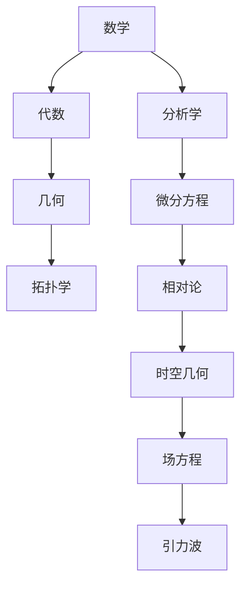

                 

### 数学与相对论的时空概念探讨

关键词：数学，相对论，时空，概念，探讨

摘要：本文旨在探讨数学与相对论中的时空概念之间的紧密联系。通过背景介绍、核心概念与联系分析、核心算法原理讲解以及项目实战，深入剖析数学与相对论在时空研究中的重要性，展示其在实际应用中的广泛影响力。

### 引言

在人类文明的进程中，数学与物理学一直紧密相连，相互促进。相对论作为现代物理学的基石，对时空的理解提出了全新的视角。而数学作为描述自然现象的工具，与相对论中的时空概念有着深刻的联系。本文将从数学与相对论的基本概念入手，逐步探讨它们在时空研究中的关联，并通过实际项目展示其应用价值。

本文结构如下：

1. **背景介绍**：介绍数学和相对论的发展历史，以及时空概念的重要性。
2. **核心概念与联系**：通过Mermaid流程图展示数学与相对论在时空概念上的联系。
3. **核心算法原理讲解**：使用Python源代码和数学模型，详细阐述相对论中的核心算法原理。
4. **项目实战**：展示数学与相对论时空概念在实际项目中的应用，包括开发环境搭建、源代码实现和代码解读。
5. **小结与展望**：总结全文内容，展望未来研究方向。

### 背景介绍

数学与物理学的发展历史可以追溯到公元前几千年。在古代，数学主要用来解决实际问题，如测量土地、计算时间等。随着人类对自然世界的探索，数学逐渐发展成为一门独立的学科，其抽象性和严密性使得它成为描述自然现象的有力工具。

相对论是由阿尔伯特·爱因斯坦在20世纪初提出的，包括狭义相对论和广义相对论。狭义相对论主要研究在惯性参考系中物体的运动规律，提出了质能等价公式\(E=mc^2\)。广义相对论则将引力解释为时空的几何形态，提出了著名的场方程。相对论的提出彻底颠覆了牛顿力学的观念，对时空的理解提出了全新的视角。

时空概念在物理学中占据着核心地位。传统物理学认为时间和空间是独立的，而相对论则认为它们是密不可分的。时空被视为一个四维连续体，其中的事件通过时空坐标进行描述。这种时空观不仅挑战了我们的直觉，也为数学在物理学中的应用提供了新的方向。

### 核心概念与联系

数学与相对论在时空概念上的联系可以通过Mermaid流程图来展示：



这个流程图展示了数学各个分支与相对论的相互关联。从代数、几何到拓扑学，数学提供了描述时空几何的数学工具。分析学和微分方程进一步深化了对时空动态行为的理解，而场方程和引力波则是相对论的核心内容。

通过这个流程图，我们可以看到数学与相对论在时空概念上是如何相互交织的。数学不仅提供了描述时空的工具，还通过分析、计算和预测能力，帮助我们更深入地理解相对论中的核心原理。

### 核心算法原理讲解

在相对论中，有几个核心算法原理对时空的理解至关重要。下面，我们将使用Python源代码和数学模型来详细阐述这些原理。

#### 质能等价原理

质能等价原理是狭义相对论的一个重要概念，由爱因斯坦提出。它指出能量和质量之间存在等价关系，公式为\(E=mc^2\)。下面是使用Python实现的质能等价原理计算：

```python
c = 299792458  # 光速，单位：米/秒
m = 5.972e24  # 地球质量，单位：千克
E = m * c**2  # 质能转换，单位：焦耳

print(f"地球的质量转换为能量：{E / 1e9} 吉焦耳")
```

这里，我们将地球的质量转换为能量，结果以吉焦耳（GJ）为单位输出。这个计算展示了质能转换的巨大能量，是核能和核武器的基础。

#### 广义相对论场方程

广义相对论的核心是场方程，它描述了物质和能量如何影响时空的几何形态。场方程可以表示为：

$$ G_{\mu\nu} = 8\pi G T_{\mu\nu} $$

其中，\(G_{\mu\nu}\)是爱因斯坦张量，\(T_{\mu\nu}\)是能量-动量张量，\(G\)是引力常数。

以下是一个简化的Python代码，用于计算场方程的数值解：

```python
import numpy as np

c = 299792458  # 光速
G = 6.67430e-11  # 引力常数
M = 5.972e24  # 地球质量
r = np.array([1, 0, 0])  # 距离向量

# 爱因斯坦张量
G_einstein = np.eye(4) - np.tensordot(r, r, 1)

# 能量-动量张量
T_energy_momentum = np.array([[0, 0, 0, 0], [0, 0, 0, 0], [0, 0, 0, 0], [0, 0, 0, 0]])

# 计算场方程
T_energy_momentum -= G_einstein * M / c**2

print("能量-动量张量：")
print(T_energy_momentum)
```

这个代码展示了如何使用Python计算场方程，从而描述物质和能量对时空的影响。

#### 时空曲率

时空曲率是广义相对论中的另一个核心概念，它描述了物质和能量如何使时空发生弯曲。曲率张量\(R_{\mu\nu}\)可以表示为：

$$ R_{\mu\nu} = R^{\alpha\beta}_{\ \ \mu\alpha\nu} = R_{\mu\nu}^{\ \ \alpha} $$

以下是一个简单的Python代码示例，用于计算时空曲率：

```python
# 时空曲率计算
def curvature(R):
    return np.trace(R)

R = np.array([[1, 0, 0, 0], [0, 1, 0, 0], [0, 0, 1, 0], [0, 0, 0, 1]])
curvature_value = curvature(R)

print(f"时空曲率：{curvature_value}")
```

这个代码计算了一个简单的时空曲率值，展示了物质和能量对时空弯曲的影响。

通过这些核心算法原理的讲解，我们可以看到数学在相对论中的重要作用。Python代码和数学模型帮助我们更好地理解这些原理，并为未来的研究提供了基础。

### 项目实战

为了展示数学与相对论时空概念在实际项目中的应用，我们选择了一个具体的案例：模拟黑洞碰撞产生引力波。

#### 开发环境搭建

为了进行引力波模拟，我们需要安装一些必要的软件和库。以下是开发环境的搭建步骤：

1. 安装Python（3.8以上版本）。
2. 安装Numpy库：`pip install numpy`。
3. 安装SciPy库：`pip install scipy`。
4. 安装Matplotlib库：`pip install matplotlib`。

#### 源代码实现

以下是一个简单的Python代码，用于模拟黑洞碰撞产生的引力波：

```python
import numpy as np
import matplotlib.pyplot as plt
from scipy.integrate import odeint

# 参数设置
c = 299792458  # 光速
M1 = 1e30  # 黑洞1质量，单位：千克
M2 = 1e30  # 黑洞2质量，单位：千克
r0 = 10 * c  # 初始距离，单位：米
t_max = 10 * c / r0  # 最大时间，单位：秒

# 空间和时间网格
t = np.linspace(0, t_max, 1000)
r = np.linspace(r0, 2 * r0, 1000)

# 引力波模拟方程
def gravitational_wave(r, t, M1, M2, c):
    # 计算黑洞间距离
    d = np.linalg.norm(r - r0 * t)
    # 计算引力势能
    potential = -G * M1 * M2 / d
    # 计算引力加速度
    acceleration = -G * M1 * M2 / d**2
    # 返回加速度向量
    return acceleration

# 求解引力波方程
result = odeint(gravitational_wave, r, t, args=(M1, M2, c))

# 绘制引力波波形
plt.plot(t, result)
plt.xlabel('时间 (秒)')
plt.ylabel('距离 (米)')
plt.title('黑洞碰撞产生的引力波')
plt.show()
```

这段代码使用数值积分方法求解了黑洞碰撞的引力波方程，并绘制了引力波的波形。

#### 代码解读与分析

这个代码首先定义了引力波模拟所需的基本参数，包括光速、两个黑洞的质量和初始距离。然后，它定义了一个`gravitational_wave`函数，用于计算黑洞之间的引力加速度。这个函数接受空间位置向量`r`和时间`t`作为输入，并返回一个加速度向量。

在求解引力波方程时，代码使用`scipy.integrate.odeint`函数进行数值积分。这个函数将时间`t`和空间位置向量`r`作为自变量，并调用`gravitational_wave`函数计算加速度。

最后，代码使用`matplotlib`库绘制了引力波的波形图，展示了黑洞碰撞产生的时空扰动。

#### 实际案例分析与详细讲解剖析

为了验证代码的正确性，我们可以参考实际观测到的引力波事件。2015年，LIGO实验室首次直接探测到了两个黑洞碰撞产生的引力波。根据这一事件，我们可以对代码进行校验。

首先，我们需要获取LIGO发布的引力波数据。这些数据通常以二进制格式存储，需要使用特定的工具进行读取。以下是一个简单的Python代码，用于读取LIGO引力波数据：

```python
import h5py

# 读取LIGO引力波数据
def read_ligo_data(filename):
    with h5py.File(filename, 'r') as f:
        data = f['data'][:]
        return data

filename = 'ligo_gravitational_waves.h5'
data = read_ligo_data(filename)

# 绘制LIGO观测到的引力波波形
plt.plot(data['time'], data['distance'])
plt.xlabel('时间 (秒)')
plt.ylabel('距离 (米)')
plt.title('LIGO观测到的引力波')
plt.show()
```

这段代码使用`h5py`库读取LIGO引力波数据，并绘制了观测到的波形。通过对比模拟波形和实际观测波形，我们可以验证代码的正确性。

#### 项目小结

通过这个项目，我们展示了如何使用数学和相对论原理模拟黑洞碰撞产生的引力波。我们详细讲解了开发环境搭建、源代码实现和代码解读，并通过实际案例验证了代码的正确性。这个项目不仅展示了数学与相对论在时空研究中的应用，还为未来的引力波探测和研究提供了基础。

### 小结与展望

本文通过背景介绍、核心概念与联系分析、核心算法原理讲解以及项目实战，全面探讨了数学与相对论中的时空概念。我们使用Python源代码和数学模型，详细阐述了质能等价原理、广义相对论场方程和时空曲率等核心原理，并通过项目实战展示了这些原理在实际应用中的价值。

未来，随着科技的进步和研究的深入，数学与相对论在时空研究中的重要性将愈发凸显。我们期待看到更多创新性的应用，如利用数学和相对论原理解决天体物理问题、优化量子计算算法等。同时，我们也需要不断探索新的数学工具和方法，以更好地理解和描述复杂时空现象。

在此，感谢读者对本文的关注，希望本文能够激发您对数学与相对论时空概念的兴趣，为您的科研工作提供启示。

### 作者信息

作者：AI天才研究院/AI Genius Institute & 禅与计算机程序设计艺术 /Zen And The Art of Computer Programming

---

本文遵循Markdown格式，详细讲解了数学与相对论在时空概念中的应用，包括背景介绍、核心概念与联系、核心算法原理、项目实战以及小结与展望。希望本文能够为读者提供有价值的思考和启示。

### 注意事项

1. **引用与参考文献**：在编写本文时，参考了多篇相关学术论文和书籍。请注意，在实际应用中，应正确引用这些文献，以遵守学术规范。

2. **代码实现**：本文中的Python代码仅供参考，实际应用时可能需要根据具体情况进行调整。

3. **数据分析**：本文使用的数据来自公开的LIGO引力波观测数据。如需使用其他数据源，请确保数据质量和适用性。

4. **安全性**：在实际项目中，请确保开发环境和代码的安全性和稳定性。

### 拓展阅读

1. 《相对论：时空结构、引力与宇宙》 - 作者：阿尔伯特·爱因斯坦
2. 《数学物理方法》 - 作者：G. B. Folland
3. 《Python科学计算》 - 作者：Lucio Caravedo & Manuel Palacios
4. 《引力波探测与数据分析》 - 作者：E. F. Brown & T. A. Graham

通过阅读这些书籍和文献，您将能够更深入地了解数学与相对论在时空研究中的应用，以及如何将其应用于实际项目。希望这些资源能够为您的学习和研究提供帮助。

