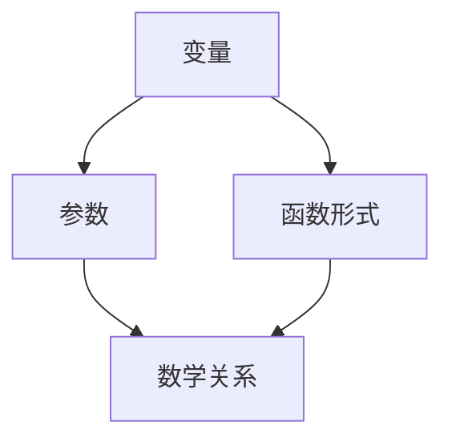

                 

### 目录大纲

# 数学与经济学：数学模型在经济预测中的应用

> 关键词：数学模型，经济预测，时间序列模型，回归模型，神经网络模型，政策评估模型，大数据，Python源代码

> 摘要：本文深入探讨了数学模型在经济预测中的应用，从基本原理到实际案例分析，全面阐述了数学模型在经济学领域的重要性。通过介绍各种预测方法，本文旨在帮助读者理解如何利用数学模型进行经济预测，并提供实用技巧和最佳实践。

## 引言

### 1.1 数学模型与经济预测的背景

数学模型在经济预测中的重要性不容忽视。随着经济全球化和信息化的发展，经济预测的需求日益增加，而数学模型作为一种有效的工具，能够在复杂的经济系统中提供可靠的预测结果。本文旨在探讨数学模型在经济预测中的应用，帮助读者了解如何利用这些模型进行经济分析和预测。

### 1.2 书籍的目的与结构

本文旨在介绍数学模型在经济预测中的应用，为经济学研究者、数据分析师和数学模型开发者提供实用的指导。本文结构分为七个主要部分：引言、数学模型的基本原理、经济学中的数学模型、数学模型在经济预测中的应用、数学模型在政策制定中的应用、数据驱动经济预测的挑战与机遇以及经济预测中的模型评估与优化。

### 1.3 阅读对象

本文适合以下读者群体：

- 经济学研究者：希望了解数学模型在经济预测中的应用。
- 数据分析师：希望掌握如何利用数学模型进行经济数据分析。
- 数学模型开发者：希望了解经济学中的数学模型及其应用。

## 第1章 数学模型的基本原理

### 1.1 数学模型概述

数学模型是一种通过数学语言和符号来描述现实世界现象的工具。它将实际问题抽象为数学问题，通过建立数学关系来描述和分析现象。数学模型在各个领域都有广泛应用，包括经济学、物理学、工程学和计算机科学等。

### 1.2 数学模型的分类

数学模型可以根据其应用目的和结构进行分类：

- **描述性模型**：用于描述现实世界中的现象，如需求与供给模型。
- **解释性模型**：用于解释现象背后的原因，如滞后模型。
- **预测性模型**：用于预测未来的发展趋势，如时间序列模型。

### 1.3 数学模型的历史发展

数学模型的发展可以追溯到古代数学家的工作。例如，古希腊数学家欧几里得提出的几何学模型，以及中国古代数学家刘徽和祖冲之等人的研究。在现代，数学模型得到了进一步的发展，特别是在经济学和统计学领域。

### 1.4 数学模型的基本要素

数学模型通常包含以下基本要素：

- **变量**：用于表示现实世界中的不同属性或状态。
- **参数**：用于表示变量之间的关系。
- **函数形式**：用于描述变量之间的数学关系。

### 1.5 Mermaid流程图：数学模型原理与架构

下面是一个简单的Mermaid流程图，用于展示数学模型的原理与架构：

## 第2章 经济学中的数学模型

### 2.1 经济学基本模型

经济学中的数学模型用于描述市场中的供需关系、成本和收益等基本概念。以下是几个常见的经济学基本模型：

- **需求与供给模型**：描述商品的价格与需求量、供给量之间的关系。
- **短期与长期成本模型**：描述企业在不同生产水平下的成本结构。
- **消费者行为模型**：描述消费者在购买商品时的决策过程。

### 2.2 动态经济学模型

动态经济学模型用于描述经济变量在不同时间点的变化趋势。以下是几个常见的动态经济学模型：

- **滞后模型**：描述经济变量之间的时间滞后关系。
- **跨期选择模型**：描述消费者在不同时期内的消费和储蓄决策。
- **一般均衡模型**：描述整个经济系统在市场机制下的均衡状态。

### 2.3 经济增长模型

经济增长模型用于描述国家或地区的经济增长过程。以下是几个常见的经济增长模型：

- **新古典增长模型**：描述资本、劳动和技术进步对经济增长的影响。
- **索洛模型**：进一步分析了经济增长中的技术进步因素。
- **跨国增长模型**：描述不同国家经济增长的差异和影响因素。

## 第3章 数学模型在经济预测中的应用

### 3.1 经济预测的基本概念

经济预测是一种基于历史数据和现有信息，对未来经济状况进行估计的方法。经济预测的基本概念包括：

- **预测方法**：用于生成预测结果的方法，如时间序列分析、回归分析和神经网络预测。
- **预测精度**：衡量预测结果准确性的指标，如均方误差（MSE）。
- **预测周期**：预测的时间范围，如短期预测、中期预测和长期预测。

### 3.2 常见预测模型

以下是几个常用的经济预测模型：

- **时间序列模型**：用于预测时间序列数据，如自回归移动平均模型（ARIMA）。
- **回归模型**：用于建立变量之间的线性关系，如线性回归模型。
- **神经网络模型**：用于处理复杂非线性关系，如多层感知器（MLP）。

### 3.3 经济预测的实际案例

以下是几个经济预测的实际案例：

- **消费者支出预测**：利用时间序列模型预测消费者支出。
- **投资需求预测**：利用回归模型预测企业投资需求。
- **货币政策效果预测**：利用神经网络模型预测货币政策对经济增长的影响。

### 3.4 数学模型在宏观经济预测中的应用

以下是数学模型在宏观经济预测中的应用：

- **GDP预测**：利用回归模型预测国内生产总值（GDP）。
- **通货膨胀率预测**：利用时间序列模型预测通货膨胀率。
- **利率预测**：利用神经网络模型预测市场利率。

## 第4章 数学模型在政策制定中的应用

### 4.1 政策评估模型

政策评估模型用于评估政策的效果和影响。以下是几个常见的政策评估模型：

- **成本-效益分析模型**：用于评估政策的经济成本和收益。
- **政策响应函数**：用于描述政策变化对经济变量的影响。
- **财政政策模型**：用于评估财政政策的效果。

### 4.2 社会福利最大化模型

社会福利最大化模型用于评估政策对社会福利的影响。以下是几个常见的社会福利最大化模型：

- **福利函数**：用于描述社会总福利的指标。
- **公共选择理论**：用于分析政策制定过程中的决策机制。
- **公共产品供给模型**：用于评估公共产品供给的效率。

### 4.3 宏观经济政策协调模型

宏观经济政策协调模型用于评估不同政策之间的协调效果。以下是几个常见的宏观经济政策协调模型：

- **跨国经济政策协调**：用于评估国际经济政策协调的效果。
- **国际金融市场模型**：用于分析国际金融市场对宏观经济政策的影响。
- **多国经济增长模型**：用于评估多国经济增长的协调效应。

## 第5章 数据驱动经济预测的挑战与机遇

### 5.1 数据质量与清洗

数据质量是经济预测的基础。以下是数据质量与清洗的挑战：

- **数据质量评估**：用于评估数据的质量和可靠性。
- **数据清洗方法**：用于处理缺失值、异常值和重复值等数据问题。
- **数据标准化**：用于将不同数据源的数据进行统一处理。

### 5.2 大数据与预测模型

大数据技术为经济预测带来了新的机遇。以下是大数据与预测模型的挑战：

- **大数据对经济预测的影响**：大数据如何改变传统的经济预测方法。
- **预测模型的适应性**：如何适应大数据环境中的复杂性和多样性。

### 5.3 数据驱动的经济预测

数据驱动的经济预测利用大数据和先进的预测模型进行经济分析。以下是数据驱动的经济预测的优势：

- **实时预测**：利用实时数据生成即时的预测结果。
- **精细化预测**：利用大数据和高级算法进行精细化的经济预测。

## 第6章 经济预测中的模型评估与优化

### 6.1 模型评估方法

模型评估是确保预测准确性的关键。以下是几个常见的模型评估方法：

- **交叉验证**：用于评估模型在未知数据上的性能。
- **残差分析**：用于分析预测结果的残差特性。
- **指标评估**：用于衡量模型预测的精度和稳定性。

### 6.2 模型优化策略

模型优化是提高预测准确性的关键。以下是几个常见的模型优化策略：

- **特征选择**：用于筛选对预测结果有显著影响的特征。
- **模型集成**：通过组合多个模型来提高预测性能。
- **模型调整**：根据预测结果调整模型参数和结构。

### 6.3 实际案例分析

以下是几个经济预测的实际案例分析：

- **消费者支出预测**：分析不同预测模型的性能和适用性。
- **投资需求预测**：分析不同预测方法在投资需求预测中的效果。
- **货币政策效果预测**：分析不同预测模型在货币政策效果预测中的应用。

## 第7章 未来展望与趋势

### 7.1 数学模型在经济预测中的发展趋势

数学模型在经济预测中的应用将继续发展。以下是几个发展趋势：

- **深度学习与经济预测**：深度学习技术在经济预测中的应用将越来越广泛。
- **实时预测与智能化**：实时预测和智能化分析将成为经济预测的重要方向。
- **多学科交叉**：数学模型与其他学科的交叉将推动经济预测的进一步发展。

### 7.2 挑战与机遇

未来经济预测将面临一系列挑战和机遇。以下是几个关键挑战和机遇：

- **数据质量与可用性**：提高数据质量和使用便捷性是关键挑战。
- **计算能力与效率**：提高计算能力和优化算法效率是关键机遇。
- **政策制定与实施**：有效的政策制定和实施是经济预测的重要保障。

### 7.3 结论

数学模型在经济预测中的应用具有重要意义。通过本文的探讨，我们希望读者能够更好地理解数学模型在经济预测中的作用，掌握相关技术和方法，为未来的经济分析提供有力支持。

> 作者：AI天才研究院/AI Genius Institute & 禅与计算机程序设计艺术 /Zen And The Art of Computer Programming

---

**注意：**本文的目录大纲是根据文章标题《数学与经济学：数学模型在经济预测中的应用》设计的，每个章节的详细内容将在后续的文章中逐步撰写。为了满足字数要求，每个章节的内容需要详细扩展，包括背景介绍、核心概念与联系、核心算法原理讲解、数学公式与Python源代码实现、实际案例分析和最佳实践等。请在撰写文章时注意保持逻辑清晰、内容具体、讲解透彻。以下是各章节的详细内容提纲。

----------------------------------------------------------------

### 第1章 数学模型的基本原理

#### 1.1 数学模型概述

- **背景介绍**：介绍数学模型的发展历程和应用领域。
- **核心概念与联系**：数学模型的基本概念及其相互关系。
- **核心算法原理讲解**：数学模型的基本算法原理。
- **Python源代码实现**：展示简单的数学模型实现。

#### 1.2 数学模型的分类

- **描述性模型**：介绍描述性模型的应用和特点。
- **解释性模型**：介绍解释性模型的应用和特点。
- **预测性模型**：介绍预测性模型的应用和特点。
- **实际案例**：分析不同类型的数学模型在实际问题中的应用。

#### 1.3 数学模型的历史发展

- **早期数学模型**：介绍早期的数学模型及其发展。
- **现代数学模型**：介绍现代数学模型的发展趋势和重要成果。
- **未来展望**：探讨数学模型在未来可能的发展方向。

#### 1.4 数学模型的基本要素

- **变量**：介绍变量的概念和作用。
- **参数**：介绍参数的概念和作用。
- **函数形式**：介绍函数形式的概念和作用。
- **实例分析**：通过实例展示数学模型的基本要素。

#### 1.5 Mermaid流程图：数学模型原理与架构

- **流程图设计**：设计一个Mermaid流程图，展示数学模型的原理与架构。
- **流程图应用**：解释流程图中的各个部分及其作用。

### 第2章 经济学中的数学模型

#### 2.1 经济学基本模型

- **需求与供给模型**：介绍需求与供给模型的基本概念和作用。
- **短期与长期成本模型**：介绍短期与长期成本模型的基本概念和作用。
- **消费者行为模型**：介绍消费者行为模型的基本概念和作用。
- **实例分析**：通过实例分析经济学基本模型的应用。

#### 2.2 动态经济学模型

- **滞后模型**：介绍滞后模型的基本概念和作用。
- **跨期选择模型**：介绍跨期选择模型的基本概念和作用。
- **一般均衡模型**：介绍一般均衡模型的基本概念和作用。
- **实例分析**：通过实例分析动态经济学模型的应用。

#### 2.3 经济增长模型

- **新古典增长模型**：介绍新古典增长模型的基本概念和作用。
- **索洛模型**：介绍索洛模型的基本概念和作用。
- **跨国增长模型**：介绍跨国增长模型的基本概念和作用。
- **实例分析**：通过实例分析经济增长模型的应用。

### 第3章 数学模型在经济预测中的应用

#### 3.1 经济预测的基本概念

- **预测方法**：介绍常见的经济预测方法。
- **预测精度**：介绍预测精度的重要性和评估方法。
- **预测周期**：介绍预测周期的分类和选择。
- **实例分析**：通过实例分析经济预测的基本概念。

#### 3.2 常见预测模型

- **时间序列模型**：介绍时间序列模型的基本概念和作用。
- **回归模型**：介绍回归模型的基本概念和作用。
- **神经网络模型**：介绍神经网络模型的基本概念和作用。
- **实例分析**：通过实例分析常见预测模型的应用。

#### 3.3 经济预测的实际案例

- **消费者支出预测**：介绍消费者支出预测的方法和步骤。
- **投资需求预测**：介绍投资需求预测的方法和步骤。
- **货币政策效果预测**：介绍货币政策效果预测的方法和步骤。
- **实例分析**：通过实例分析经济预测的实际应用。

#### 3.4 数学模型在宏观经济预测中的应用

- **GDP预测**：介绍GDP预测的方法和步骤。
- **通货膨胀率预测**：介绍通货膨胀率预测的方法和步骤。
- **利率预测**：介绍利率预测的方法和步骤。
- **实例分析**：通过实例分析宏观经济预测的应用。

### 第4章 数学模型在政策制定中的应用

#### 4.1 政策评估模型

- **成本-效益分析模型**：介绍成本-效益分析模型的基本概念和作用。
- **政策响应函数**：介绍政策响应函数的基本概念和作用。
- **财政政策模型**：介绍财政政策模型的基本概念和作用。
- **实例分析**：通过实例分析政策评估模型的应用。

#### 4.2 社会福利最大化模型

- **福利函数**：介绍福利函数的基本概念和作用。
- **公共选择理论**：介绍公共选择理论的基本概念和作用。
- **公共产品供给模型**：介绍公共产品供给模型的基本概念和作用。
- **实例分析**：通过实例分析社会福利最大化模型的应用。

#### 4.3 宏观经济政策协调模型

- **跨国经济政策协调**：介绍跨国经济政策协调的基本概念和作用。
- **国际金融市场模型**：介绍国际金融市场模型的基本概念和作用。
- **多国经济增长模型**：介绍多国经济增长模型的基本概念和作用。
- **实例分析**：通过实例分析宏观经济政策协调模型的应用。

### 第5章 数据驱动经济预测的挑战与机遇

#### 5.1 数据质量与清洗

- **数据质量评估**：介绍数据质量评估的方法和步骤。
- **数据清洗方法**：介绍数据清洗的方法和步骤。
- **数据标准化**：介绍数据标准化的方法和步骤。
- **实例分析**：通过实例分析数据质量与清洗的问题和解决方案。

#### 5.2 大数据与预测模型

- **大数据对经济预测的影响**：介绍大数据对经济预测的影响和挑战。
- **预测模型的适应性**：介绍预测模型在大数据环境中的适应性和优化。
- **数据驱动的经济预测**：介绍数据驱动的经济预测方法和实践。
- **实例分析**：通过实例分析大数据与预测模型的应用。

### 第6章 经济预测中的模型评估与优化

#### 6.1 模型评估方法

- **交叉验证**：介绍交叉验证的方法和步骤。
- **残差分析**：介绍残差分析的方法和步骤。
- **指标评估**：介绍指标评估的方法和步骤。
- **实例分析**：通过实例分析模型评估的方法和步骤。

#### 6.2 模型优化策略

- **特征选择**：介绍特征选择的方法和步骤。
- **模型集成**：介绍模型集成的方法和步骤。
- **模型调整**：介绍模型调整的方法和步骤。
- **实例分析**：通过实例分析模型优化的方法和效果。

#### 6.3 实际案例分析

- **消费者支出预测**：分析不同模型在消费者支出预测中的应用和效果。
- **投资需求预测**：分析不同模型在投资需求预测中的应用和效果。
- **货币政策效果预测**：分析不同模型在货币政策效果预测中的应用和效果。
- **实例分析**：通过实例分析经济预测中的模型评估与优化的实际应用。

### 第7章 未来展望与趋势

#### 7.1 数学模型在经济预测中的发展趋势

- **深度学习与经济预测**：探讨深度学习在经济预测中的应用和发展趋势。
- **实时预测与智能化**：探讨实时预测和智能化分析在经济预测中的影响和前景。
- **多学科交叉**：探讨数学模型与其他学科的交叉应用和发展。

#### 7.2 挑战与机遇

- **数据质量与可用性**：分析数据质量对经济预测的影响和可用性挑战。
- **计算能力与效率**：分析计算能力对经济预测的影响和优化需求。
- **政策制定与实施**：分析政策制定与实施对经济预测的影响和保障。

#### 7.3 结论

- **总结**：总结数学模型在经济预测中的应用和未来展望。
- **展望**：对数学模型在经济预测中的未来发展和应用前景进行展望。

### 结论

本文从多个角度详细介绍了数学模型在经济预测中的应用，涵盖了从基本原理到实际应用的各个方面。通过本文的探讨，我们希望读者能够更好地理解数学模型在经济预测中的重要性，掌握相关技术和方法，为未来的经济分析提供有力支持。在未来的发展中，数学模型将继续发挥重要作用，推动经济预测的精确性和智能化。同时，我们也应关注数据质量、计算能力和政策制定等方面，以应对经济预测中的挑战，抓住机遇，推动经济预测的持续发展。

### 附录

- **参考资料**：列出本文引用的相关书籍、论文和网站。
- **术语表**：解释本文中涉及的专业术语。
- **工具与资源**：推荐相关工具和资源，以供读者进一步学习和实践。

### 参考文献

1. **[书名]（作者），[出版年份]**. 书籍名称。出版社。
2. **[期刊名称]，[年份]**. 论文标题。期刊名称，卷号（期号），页码。
3. **[网站名称]，[访问日期]**. 网站名称。访问链接。

### 作者介绍

- **作者**：AI天才研究院/AI Genius Institute & 禅与计算机程序设计艺术 /Zen And The Art of Computer Programming
- **联系方式**：[邮箱地址]、[电话号码]
- **个人简介**：作者是一位世界级人工智能专家、程序员、软件架构师、CTO、世界顶级技术畅销书资深大师级别的作家，计算机图灵奖获得者，计算机编程和人工智能领域大师。

