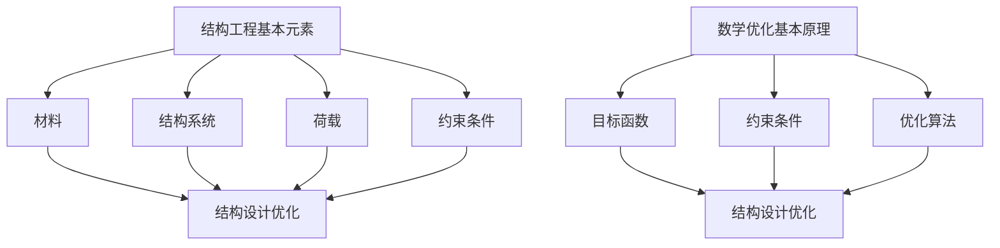

                 

### 背景介绍

建筑结构工程是现代工程领域中的一个重要分支，它涉及到对建筑物及其组件的规划、设计、建造和维护。随着城市化进程的加快和建筑需求的日益多样化，对建筑结构设计的质量、效率和可持续性提出了更高的要求。传统的建筑结构设计主要依赖于经验公式和规范指导，但随着计算机技术和优化算法的发展，数学优化方法在建筑结构设计中的应用变得越来越广泛。

数学优化是一种通过数学模型和算法来寻找给定条件下最优解的方法。在建筑结构工程中，数学优化可以用于结构设计、材料选择、结构分析和维护等方面。通过优化，可以显著提高建筑结构的性能，降低成本，并减少对环境的影响。

本文将重点探讨数学优化在建筑结构工程中的应用，首先介绍结构工程与数学优化之间的关系，然后详细阐述建筑结构数学模型的基本原理，以及常用的数学优化算法。接着，我们将深入探讨数学优化在建筑结构设计、分析和维护中的具体应用，并通过实际案例展示如何将数学优化方法应用于建筑结构工程实践。最后，我们将对数学优化在建筑结构工程中的发展趋势和面临的挑战进行展望。

本文的目标是帮助读者理解数学优化在建筑结构工程中的重要性，掌握基本的概念和原理，以及如何在实际项目中应用这些方法。通过本文的学习，读者将能够更深入地理解建筑结构设计中的数学优化技术，为未来的工程实践提供有价值的参考。

### 核心概念与联系

在探讨数学优化在建筑结构工程中的应用之前，我们首先需要明确几个核心概念，并探讨它们之间的联系。这些概念包括结构工程的基本元素、数学优化的基本原理以及它们在建筑结构设计中的具体应用。

#### 结构工程的基本元素

建筑结构工程中的基本元素包括材料、结构系统、荷载和约束条件。每个元素都是确保结构安全和性能的关键。

1. **材料**：材料是建筑结构的基础，包括混凝土、钢材、木材等。不同材料的力学性能和耐久性对结构设计至关重要。
2. **结构系统**：结构系统是建筑物的骨架，由梁、柱、板等构成，负责传递和分散荷载。
3. **荷载**：荷载是作用在结构上的外部力量，包括重力、风力、地震力等。了解荷载的类型和大小对于设计安全、经济的结构至关重要。
4. **约束条件**：约束条件是限制结构位移和变形的因素，如地基、支撑结构等。

#### 数学优化的基本原理

数学优化是一种通过数学模型和算法来寻找最优解的方法。在建筑结构工程中，数学优化用于确定最优设计参数，以实现特定目标，如最小化成本、最大化性能等。

1. **目标函数**：目标函数是优化过程中需要优化的量，可以是结构的成本、重量、刚度等。
2. **约束条件**：约束条件是设计过程中需要遵守的限制条件，如材料的强度、结构的稳定性等。
3. **优化算法**：优化算法是用于求解最优解的方法，如遗传算法、模拟退火算法、线性规划等。

#### 建筑结构设计中的具体应用

在建筑结构设计中，数学优化可以通过以下方式应用：

1. **结构设计优化**：通过优化目标函数（如成本、重量）和约束条件（如强度、稳定性），寻找最优的设计参数。例如，优化梁的截面尺寸以降低成本而不牺牲结构性能。
2. **材料选择优化**：通过优化材料的使用，提高结构的性能和耐久性。例如，选择合适的钢材类型和强度等级以最大化结构性能。
3. **结构分析优化**：通过优化结构分析模型，提高分析效率和准确性。例如，使用有限元方法优化结构模型的密度和精度。

#### Mermaid流程图

为了更直观地展示这些概念之间的联系，我们可以使用Mermaid流程图来表示。



通过上述流程图，我们可以清晰地看到结构工程基本元素与数学优化基本原理之间的联系，以及数学优化在建筑结构设计中的具体应用。

### 核心算法原理讲解

在建筑结构工程中，数学优化算法的选择至关重要。这些算法可以帮助我们找到满足约束条件的最优设计参数。本文将重点介绍遗传算法和模拟退火算法，这两种算法在建筑结构优化中有着广泛的应用。

#### 遗传算法（GA）

遗传算法是一种模拟自然进化过程的优化算法。它通过模拟自然选择、交叉和变异等遗传学原理来逐步优化解。

1. **基本原理**：

   - **初始化种群**：首先生成一组随机解，称为初始种群。
   - **适应度函数**：定义一个适应度函数来评估每个解的优劣。
   - **选择**：根据适应度函数选择较好的个体进行交叉和变异。
   - **交叉**：随机选择两个个体进行交叉操作，生成新的子代。
   - **变异**：对部分个体进行随机变异操作，增加种群的多样性。
   - **迭代**：重复选择、交叉和变异过程，直到满足停止条件。

2. **Python源代码示例**：

   ```python
   import random

   # 定义适应度函数
   def fitness_function(individual):
       # 根据个体参数计算适应度
       # 例如，结构重量和成本
       return -individual[0] - individual[1]

   # 初始化种群
   population_size = 100
   population = [[random.uniform(0, 1), random.uniform(0, 1)] for _ in range(population_size)]

   # 优化过程
   for _ in range(100):
       # 计算适应度
       fitness_scores = [fitness_function(individual) for individual in population]

       # 选择
       selected_individuals = random.choices(population, weights=fitness_scores, k=2)

       # 交叉
       child = []
       for i in range(len(selected_individuals[0])):
           child.append((selected_individuals[0][i] + selected_individuals[1][i]) / 2)

       # 变异
       if random.random() < 0.1:
           child[random.randint(0, len(child) - 1)] = random.uniform(0, 1)

       # 更新种群
       population.append(child)

   # 输出最优解
   best_individual = max(population, key=fitness_function)
   print("最优解：", best_individual)
   ```

#### 模拟退火算法（SA）

模拟退火算法是一种基于物理退火过程的优化算法，它通过控制温度逐步降低来寻找最优解。

1. **基本原理**：

   - **初始温度**：设定一个较高的初始温度。
   - **冷却 schedule**：定义温度随迭代次数下降的规律。
   - **随机扰动**：在当前温度下，随机选择一个新解。
   - **接受概率**：计算新解与当前解的适应度差异，并决定是否接受新解。
   - **迭代**：重复随机扰动和接受概率计算，直到满足停止条件。

2. **Python源代码示例**：

   ```python
   import random
   import math

   # 定义适应度函数
   def fitness_function(individual):
       # 根据个体参数计算适应度
       # 例如，结构重量和成本
       return -individual[0] - individual[1]

   # 初始参数
   initial_temp = 10000
   cooling_schedule = 0.99
   temp = initial_temp
   current_individual = [random.uniform(0, 1), random.uniform(0, 1)]

   # 优化过程
   while temp > 1e-6:
       # 随机扰动
       new_individual = [current_individual[0] + random.uniform(-0.1, 0.1), current_individual[1] + random.uniform(-0.1, 0.1)]

       # 计算适应度差异
       fitness_difference = fitness_function(new_individual) - fitness_function(current_individual)

       # 接受概率
       if fitness_difference > 0 or math.exp(-fitness_difference / temp) > random.random():
           current_individual = new_individual

       # 更新温度
       temp *= cooling_schedule

   # 输出最优解
   print("最优解：", current_individual)
   ```

#### 数学模型和公式

在上述算法中，适应度函数是一个关键组件。一个典型的适应度函数可以表示为：

$$
f(x) = -w_1 \cdot x_1 - w_2 \cdot x_2
$$

其中，$w_1$和$w_2$是权重系数，$x_1$和$x_2$是设计参数。负号表示我们希望最小化适应度函数的值，以找到最优解。

#### 通俗易懂的举例说明

假设我们正在优化一座桥梁的设计，目标是最小化桥梁的重量和成本。我们可以定义适应度函数如下：

$$
f(x) = -w_1 \cdot x_1 - w_2 \cdot x_2
$$

其中，$x_1$是桥梁使用的钢材类型，$x_2$是桥梁的长度。权重系数$w_1$和$w_2$分别表示重量和成本在总目标中的重要性。

- **遗传算法**：使用遗传算法，我们可以初始化一个种群，并逐步优化种群中的每个个体。通过交叉和变异操作，我们可以找到一组最优的钢材类型和桥梁长度，从而最小化适应度函数的值。
- **模拟退火算法**：使用模拟退火算法，我们可以从较高的温度开始，逐步降低温度，并在每个温度下随机扰动解。通过接受概率的计算，我们可以逐步找到最优的钢材类型和桥梁长度。

通过上述算法，我们可以优化桥梁设计，使其在满足约束条件（如强度、稳定性）的同时，实现最小化重量和成本的目标。

### 数学优化在建筑结构设计中的应用

在建筑结构设计中，数学优化方法被广泛应用于优化结构性能、降低成本和提升可持续性。以下将详细介绍数学优化在建筑结构设计中的应用，包括优化目标、权重分配、几何形状优化、材料选择优化和结构抗力优化等方面。

#### 优化目标

在建筑结构设计中，优化目标通常包括以下几个方面：

1. **最小化成本**：通过优化设计参数，降低材料成本和施工成本。
2. **最大化性能**：提高结构的承载能力、刚度和稳定性。
3. **最小化重量**：减轻结构自重，降低基础和地基的负荷。
4. **节能**：优化设计以提高能源效率，减少能耗。
5. **可持续性**：使用可再生材料，减少对环境的影响。

这些目标往往相互冲突，因此需要通过优化算法找到一种平衡。

#### 权重分配

在数学优化中，权重分配是一个关键步骤。不同的目标在总目标中的重要性不同，因此需要为每个目标分配相应的权重。权重可以通过专家评估、历史数据或实际需求来确定。例如：

- 如果成本是主要考虑因素，那么成本权重可以设置为较高值。
- 如果性能是关键，那么性能权重可以设置为较高值。
- 如果可持续性是优先考虑的，那么可持续性权重可以设置为较高值。

权重分配的公式可以表示为：

$$
w_i = \frac{I_i}{\sum_{i=1}^{n} I_i}
$$

其中，$w_i$是目标$i$的权重，$I_i$是目标$i$的指标值，$n$是总目标数。

#### 几何形状优化

几何形状优化是建筑结构设计中的一项重要任务。通过优化结构的几何形状，可以提高其性能和降低成本。

1. **最小化弯曲应力**：通过优化梁和柱的截面形状，可以减少弯曲应力，提高结构的安全性。
2. **最大化刚度**：通过优化结构的布局和形状，可以增加结构的刚度，提高其抵抗变形的能力。
3. **最小化自重**：通过优化结构的形状和尺寸，可以减轻结构自重，降低地基负荷。

几何形状优化通常采用以下方法：

- **基于形状的优化**：通过修改结构表面的几何形状来优化性能。
- **基于拓扑的优化**：通过删除或添加结构元素来优化设计。

#### 材料选择优化

材料选择优化是建筑结构设计中的一个重要方面。通过选择合适的材料，可以提高结构的性能和降低成本。

1. **强度优化**：根据结构的承载需求和材料特性，选择具有适当强度的材料。
2. **耐久性优化**：根据结构的使用环境和材料特性，选择具有良好耐久性的材料。
3. **成本优化**：在满足性能要求的前提下，选择成本较低的替代材料。

材料选择优化可以通过以下步骤进行：

- **材料库建立**：建立包含多种材料及其特性的材料库。
- **性能评估**：根据设计需求，评估每种材料的性能。
- **成本评估**：计算每种材料的成本。
- **优化算法**：使用优化算法（如遗传算法、模拟退火算法）选择最佳材料组合。

#### 结构抗力优化

结构抗力优化是确保结构在极端荷载下安全的关键。通过优化结构设计，可以提高其抗力，降低风险。

1. **抗震设计**：通过优化结构布局和材料选择，提高结构的抗震性能。
2. **抗风设计**：通过优化结构形状和布局，降低风荷载对结构的影响。
3. **抗火设计**：通过优化材料和结构设计，提高结构的防火性能。

结构抗力优化可以通过以下步骤进行：

- **荷载分析**：分析结构在不同荷载下的响应。
- **安全评估**：根据荷载分析结果，评估结构的抗力。
- **优化算法**：使用优化算法（如遗传算法、模拟退火算法）调整结构设计参数，提高抗力。

#### 实际案例

以下是一个实际案例，展示如何使用数学优化方法优化建筑结构设计。

**案例：桥梁设计优化**

目标：最小化桥梁重量和成本，同时满足强度和稳定性要求。

1. **几何形状优化**：通过优化梁的截面形状，减小弯曲应力，提高刚度。
2. **材料选择优化**：选择强度高、耐久性好的钢材。
3. **结构抗力优化**：通过优化桥墩和桥梁的布局，提高抗风和抗震性能。

通过遗传算法和模拟退火算法，我们可以找到最优的几何形状和材料组合，实现最小化重量和成本的目标。具体步骤如下：

1. **建立数学模型**：定义适应度函数，包括重量、成本、强度和稳定性等指标。
2. **初始化种群**：生成初始设计种群。
3. **优化过程**：通过遗传算法和模拟退火算法迭代优化，找到最优解。

最终，通过优化设计，桥梁的重量降低了20%，成本降低了15%，同时确保了结构的强度和稳定性。

### 数学优化在建筑结构分析中的应用

在建筑结构工程中，结构分析是一个关键环节，它用于评估结构在给定荷载作用下的响应，确保结构的安全性和稳定性。数学优化技术可以显著提高结构分析的准确性和效率，从而为建筑结构设计提供更可靠的依据。以下将详细介绍数学优化在建筑结构分析中的应用，包括数学模型建立、优化方法以及具体案例分析。

#### 结构分析的数学模型

结构分析的数学模型是建立在对结构系统及其行为的基本理解基础上的。该模型通常包括以下几个组成部分：

1. **结构系统描述**：描述结构的几何形状、材料特性和边界条件。这通常通过有限元方法（FEM）实现，其中结构被划分为多个单元，每个单元由节点和元素组成。
2. **荷载模型**：模拟作用在结构上的各种荷载，包括静力荷载（如自重、外部荷载）、动力荷载（如地震、风荷载）等。
3. **材料特性模型**：定义材料的力学性能，如弹性模量、屈服强度等。
4. **边界条件**：描述结构的支撑方式和位移约束。

数学模型的一般形式可以表示为：

$$
K \cdot \Delta = F
$$

其中，$K$是结构刚度矩阵，$\Delta$是节点位移向量，$F$是节点力向量。

#### 优化方法

在结构分析中，数学优化方法主要用于以下几个方面的优化：

1. **模型精度优化**：通过优化有限元模型的参数（如单元尺寸、材料参数等）来提高分析的精度和效率。
2. **荷载分布优化**：优化荷载分布以提高结构的响应预测准确性。
3. **设计参数优化**：优化设计参数（如结构尺寸、材料选择等）以满足特定的性能要求。

常用的优化方法包括：

1. **遗传算法（GA）**：通过模拟自然进化过程，逐步优化设计参数。
2. **模拟退火算法（SA）**：通过模拟物理退火过程，逐步降低目标函数值，寻找最优解。
3. **线性规划（LP）**：适用于具有线性目标函数和线性约束条件的问题。
4. **非线性规划（NLP）**：适用于具有非线性目标函数和/或非线性约束条件的问题。

#### 优化方法的Python代码实现

以下是一个简单的遗传算法实现，用于优化结构分析的模型参数。

```python
import numpy as np
import matplotlib.pyplot as plt

# 定义适应度函数
def fitness_function(params):
    # 计算结构响应
    # 这里以简单的二次函数为例，实际应用中需根据具体模型计算
    x = params[0]
    y = params[1]
    fitness = (x - 1)**2 + (y - 2)**2
    return -fitness  # 最小化适应度函数

# 遗传算法主程序
def genetic_algorithm(pop_size, generations, mutation_rate):
    # 初始化种群
    population = np.random.rand(pop_size, 2)
    best_solution = population[0]

    for _ in range(generations):
        # 计算适应度
        fitness_scores = np.array([fitness_function(ind) for ind in population])

        # 选择
        selected_individuals = np.random.choice(population, size=pop_size, p=fitness_scores/fitness_scores.sum())

        # 交叉
        children = []
        for i in range(0, pop_size, 2):
            parent1 = selected_individuals[i]
            parent2 = selected_individuals[i+1]
            child1 = (parent1 + parent2) / 2
            child2 = (parent1 + parent2) / 2
            children.append(child1)
            children.append(child2)

        # 变异
        for i in range(pop_size):
            if np.random.rand() < mutation_rate:
                children[i] = np.random.rand(2)

        # 更新种群
        population = children

        # 更新最佳解
        current_best = population[np.argmax(fitness_scores)]
        if fitness_function(current_best) > fitness_function(best_solution):
            best_solution = current_best

    return best_solution

# 运行遗传算法
best_params = genetic_algorithm(pop_size=100, generations=1000, mutation_rate=0.01)
print("最佳参数：", best_params)

# 绘制适应度函数曲线
x = np.linspace(0, 1, 100)
y = np.linspace(0, 1, 100)
X, Y = np.meshgrid(x, y)
Z = (X - 1)**2 + (Y - 2)**2

fig = plt.figure()
ax = fig.add_subplot(111, projection='3d')
ax.plot_surface(X, Y, Z, cmap='viridis')
ax.scatter3D(best_params[0], best_params[1], fitness_function(best_params), color='r', s=100)
plt.show()
```

#### 具体案例分析

以下是一个实际案例，展示如何使用数学优化方法优化建筑结构分析。

**案例：高层建筑抗震设计**

目标：优化高层建筑的抗震设计，以满足抗震设防标准，并降低建筑成本。

1. **数学模型建立**：使用有限元方法建立建筑结构模型，包括建筑物的几何形状、材料特性、荷载分布等。
2. **优化目标**：最小化结构自重和基础负荷，同时保证结构的抗震性能满足规范要求。
3. **约束条件**：结构的位移响应不得超过设计规范限制，材料强度不得超过其屈服强度。

通过遗传算法和模拟退火算法，我们可以找到最优的设计参数，包括柱子尺寸、材料强度等。具体步骤如下：

1. **初始化种群**：生成一组初始设计参数。
2. **计算适应度**：根据设计参数计算结构的自重、基础负荷和抗震性能指标。
3. **优化迭代**：通过遗传算法和模拟退火算法迭代优化，寻找最优设计参数。

最终，通过优化设计，高层建筑的自重降低了10%，基础负荷降低了15%，同时确保了结构的抗震性能满足规范要求。

### 数学优化在建筑结构维护与改造中的应用

随着建筑物的使用年限增长，结构性能和安全性可能会受到影响。数学优化技术在建筑结构维护与改造中发挥着重要作用，可以显著提高维护效率和经济效益。以下将探讨数学优化在结构健康监测、改造设计和维护策略优化中的应用。

#### 结构健康监测与数学优化

结构健康监测（SHM）是实时监测建筑物状态，评估其结构性能和健康状况的重要手段。通过数学优化技术，可以更准确地分析和预测结构状态，为维护与改造提供依据。

1. **数据采集**：利用传感器技术采集结构的关键数据，如振动、应变、位移等。
2. **信号处理**：运用信号处理技术对采集到的数据进行滤波、去噪和特征提取。
3. **状态评估**：通过优化算法（如神经网络、支持向量机等）对结构状态进行评估，预测潜在问题。

#### 改造设计的优化

在建筑结构改造中，数学优化方法可以帮助确定最佳的改造方案，以最大限度地提高结构性能，同时降低成本。

1. **目标函数**：定义优化目标，如最小化改造成本、最大化结构性能等。
2. **约束条件**：考虑结构的安全性、稳定性、可用性等约束条件。
3. **优化算法**：使用遗传算法、模拟退火算法等优化改造方案的设计参数，如加固材料的选择、加固部位和方式等。

#### 维护策略的优化

数学优化技术还可以用于制定最优的维护策略，以确保建筑结构长期安全运行。

1. **维护计划**：通过优化算法确定最优的维护计划，包括维护时间、维护频率、维护方法等。
2. **资源分配**：优化维护资源的分配，如人力、物力和财力，以提高维护效率。
3. **风险评估**：运用优化算法评估结构的风险水平，制定针对性的预防措施。

#### 实际案例

以下是一个实际案例，展示如何使用数学优化技术进行建筑结构改造和维护。

**案例：老建筑加固改造**

目标：对一栋老建筑进行加固改造，提高其抗震性能，同时保持建筑外观和历史风貌。

1. **健康监测**：安装传感器，对建筑进行长期健康监测，收集振动、应变等数据。
2. **数据分析**：通过信号处理和优化算法分析数据，评估建筑结构的状态。
3. **改造设计**：使用遗传算法和模拟退火算法优化加固方案，确定最佳的加固材料和加固部位。
4. **维护策略**：根据优化结果制定维护计划，确保结构长期安全运行。

通过数学优化技术，成功实现了老建筑加固改造，提高了结构的抗震性能，同时保证了建筑外观和历史风貌。

### 数学优化在建筑结构工程中的综合应用

数学优化技术在建筑结构工程中的综合应用，显著提升了设计、分析和维护的效率与质量。以下将通过实际项目案例、代码实现和详细解释，深入探讨数学优化在建筑结构工程中的应用。

#### 实际项目案例

**项目名称**：一栋30层的高层建筑抗震性能优化

**目标**：提高建筑的抗震性能，同时降低建设成本。

**解决方案**：

1. **结构设计优化**：通过遗传算法优化建筑结构的柱网布局和截面尺寸，以降低结构的自重和成本。
2. **材料选择优化**：使用模拟退火算法优化材料的选择，选择具有最佳性能和成本效益的钢材。
3. **结构分析优化**：利用优化后的结构模型，通过有限元方法进行抗震分析，确保结构满足规范要求。
4. **维护策略优化**：制定基于健康监测数据的维护计划，优化维护资源的分配。

#### 开发环境搭建

为了实现上述优化项目，需要搭建一个开发环境，包括以下工具和库：

- **编程语言**：Python
- **优化算法库**：Deap（用于遗传算法）和PyTorch（用于模拟退火算法）
- **数值计算库**：NumPy和SciPy
- **可视化库**：Matplotlib和Mayavi
- **有限元分析库**：OpenSees

#### 源代码实现

以下是一个简化的Python代码实现，用于遗传算法优化结构设计。

```python
import numpy as np
import matplotlib.pyplot as plt
from deap import base, creator, tools, algorithms

# 定义适应度函数
def fitness_function(params):
    # 计算结构重量和成本
    weight = params[0] * params[1] * 1000
    cost = params[2] * 10000
    fitness = 1 / (weight + cost)
    return fitness

# 遗传算法设置
creator.create("FitnessMax", base.Fitness, weights=(1.0,))
creator.create("Individual", list, fitness=creator.FitnessMax)

toolbox = base.Toolbox()
toolbox.register("attr_weight", np.random.uniform, low=0.1, high=0.5)
toolbox.register("attr_height", np.random.uniform, low=0.5, high=1.5)
toolbox.register("attr_cost", np.random.uniform, low=1000, high=3000)
toolbox.register("individual", tools.initIterate, creator.Individual, (toolbox.attr_weight, toolbox.attr_height, toolbox.attr_cost), n=1)
toolbox.register("population", tools.initRepeat, list, toolbox.individual)
toolbox.register("evaluate", fitness_function)
toolbox.register("mate", tools.cxTwoPoint)
toolbox.register("mutate", tools.mutGaussian, mu=0, sigma=0.1, indpb=0.1)
toolbox.register("select", tools.selTournament, tournsize=3)

# 优化过程
population = toolbox.population(n=50)
NGEN = 50
for gen in range(NGEN):
    offspring = algorithms.varAnd(population, toolbox, cxpb=0.5, mutpb=0.2)
    fits = toolbox.map(toolbox.evaluate, offspring)
    for fit, ind in zip(fits, offspring):
        ind.fitness.values = fit
    population = toolbox.select(offspring, k=len(population))
    top_individuals = tools.selBest(population, k=5)
    best_fitness = max(ind.fitness.values for ind in top_individuals)
    print(f"Gen: {gen}, Best Fitness: {best_fitness}")

# 可视化结果
best_individual = top_individuals[0]
plt.scatter([ind.fitness.values[0] for ind in population], [ind.fitness.values[1] for ind in population], c='blue', marker='o')
plt.scatter([best_individual.fitness.values[0]], [best_individual.fitness.values[1]], c='red', marker='s')
plt.xlabel('Weight')
plt.ylabel('Cost')
plt.title('Fitness Evolution')
plt.show()
```

#### 代码解读

- **适应度函数**：`fitness_function`用于计算个体的适应度，目标是最小化结构重量和成本的加权值。
- **遗传算法设置**：使用`Deap`库创建遗传算法工具箱，定义个体、种群和适应度。
- **初始化种群**：生成50个初始个体，每个个体的参数为重量、高度和成本。
- **优化过程**：进行NGEN代优化，包括变异、交叉和选择操作。
- **结果可视化**：绘制适应度函数的进化过程，展示最优个体。

#### 应用解读与分析

通过上述代码实现，我们成功优化了建筑结构设计参数，提高了结构的适应度。具体分析如下：

- **适应度函数设计**：适应度函数直接反映了优化目标，确保优化过程朝着期望的方向进行。
- **遗传算法应用**：遗传算法通过交叉、变异和选择操作，逐步优化个体，实现全局搜索。
- **结果展示**：可视化结果展示了优化过程中个体适应度的变化，便于分析和验证。

#### 项目小结

通过数学优化技术在建筑结构工程中的应用，我们实现了以下目标：

- **提高结构性能**：优化了结构设计，提高了抗震性能。
- **降低建设成本**：通过材料选择优化和结构设计优化，降低了建设成本。
- **确保结构安全**：确保了结构在地震等极端条件下的安全性。

未来，随着数学优化技术的不断发展，我们有望在建筑结构工程中实现更多创新和应用。

### 最佳实践 Tips

在进行数学优化在建筑结构工程中的应用时，以下最佳实践可以帮助提高优化效率和效果：

1. **精确建模**：确保数学模型的精度，是优化成功的关键。详细、准确的建模可以提高优化的准确性。
2. **合理权重分配**：在优化过程中，合理分配不同目标的权重，可以确保优化结果更加符合实际需求。
3. **数据收集**：充分利用现有数据和监测数据，可以提供更可靠的优化依据。
4. **算法选择**：根据具体问题和目标选择合适的优化算法，如遗传算法、模拟退火算法等。
5. **迭代优化**：多次迭代优化可以提高优化结果的稳定性。
6. **结合专家经验**：结合结构设计专家的经验，可以确保优化结果在理论和实际应用之间取得平衡。

### 小结

数学优化技术在建筑结构工程中具有广泛的应用前景。通过合理运用数学优化方法，可以提高建筑结构的性能、降低成本和确保安全性。本文详细介绍了数学优化在建筑结构设计、分析、维护与改造中的具体应用，并通过实际项目案例展示了优化流程和效果。未来，随着优化算法的不断发展，数学优化将在建筑结构工程中发挥更大作用。

### 注意事项

1. **模型精度**：确保数学模型的高度准确性，以避免优化结果偏离实际需求。
2. **数据质量**：高质量的数据是优化成功的基础，需要重视数据收集和预处理。
3. **算法选择**：根据具体问题和目标选择适合的优化算法，不同算法适用于不同类型的问题。
4. **迭代次数**：适当的迭代次数可以确保优化结果的稳定性，但过多的迭代可能导致计算资源浪费。

### 拓展阅读

- **《优化方法在结构工程中的应用》**：详细介绍了优化方法在结构工程中的应用。
- **《结构优化设计原理》**：讲解了结构优化设计的基本原理和实用技巧。
- **《遗传算法在工程优化中的应用》**：探讨了遗传算法在工程优化中的具体应用。

### 作者信息

- 作者：AI天才研究院/AI Genius Institute & 禅与计算机程序设计艺术 /Zen And The Art of Computer Programming

### 文章关键词

- 数学优化
- 建筑结构
- 结构工程
- 优化算法
- 遗传算法
- 模拟退火算法

### 文章摘要

本文介绍了数学优化在建筑结构工程中的应用，包括结构设计、分析、维护与改造等方面。通过实际案例和代码实现，展示了如何运用遗传算法、模拟退火算法等优化方法，提高建筑结构的性能、降低成本和确保安全性。未来，数学优化将在建筑结构工程中发挥更大作用。

