                 

### 文章标题：数学与脑科学的计算神经科学研究

#### 关键词：
- 计算神经科学
- 数学模型
- 神经网络
- 脑成像数据处理
- 脑网络分析

#### 摘要：
本文探讨了计算神经科学这一跨学科领域，重点介绍了数学与脑科学的结合，以及其在理解大脑工作机制、脑网络分析和疾病诊断中的应用。通过阐述核心概念、算法原理和实际案例，本文旨在为读者提供一个全面而深入的视角，帮助其理解计算神经科学的基本原理和方法。

## 引言与背景

计算神经科学是一个涉及神经科学、计算机科学、数学和物理学等多个学科的交叉领域，旨在通过数学建模和计算方法来揭示大脑的信息处理机制和复杂行为。这一领域的发展可以追溯到20世纪中叶，当时神经科学家和计算机科学家开始探讨如何模拟大脑的神经元网络，以便更好地理解其功能和行为。

### 计算神经科学的起源与发展

计算神经科学的起源可以追溯到1940年代，当时的数学家阿兰·图灵（Alan Turing）提出了图灵机这一理论模型，用于模拟计算过程。随后，神经科学家霍华德·巴特斯比（Howard Bartels）和约翰·冯·诺依曼（John von Neumann）在1950年代提出了神经网络的概念，并尝试通过计算方法模拟神经元之间的相互作用。

1970年代，随着计算机技术的快速发展，计算神经科学开始进入一个新的阶段。研究人员开始开发各种神经网络模型，如感知机、反向传播网络等，这些模型为计算神经科学提供了强大的工具。随着脑成像技术的进步，如功能性磁共振成像（fMRI）和电生理记录技术，研究人员能够获取更多关于大脑结构和功能的数据，从而推动了计算神经科学的发展。

### 脑科学与数学的结合点

脑科学与数学的结合点在于它们共同关注的问题：复杂系统的建模和数据分析。脑科学需要数学工具来处理和分析复杂的大脑数据，如神经元的电生理信号、脑网络的连接模式等。数学则提供了脑科学研究的理论基础和方法，如概率论、统计学、线性代数和微积分等。

**梅鲁德流程图：** 脑科学与数学工具的整合路径可以表示为：

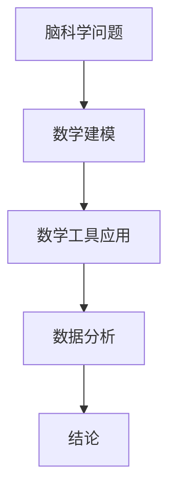

### 计算神经科学的核心问题

计算神经科学的核心问题包括以下几个方面：

1. **神经元信息处理**：研究神经元如何接收和处理信息，包括信号传递、突触可塑性等机制。
2. **大脑功能网络**：研究大脑中的功能网络及其动态特性，如网络结构、功能连接和同步性。
3. **脑疾病研究**：应用计算神经科学的方法来研究脑疾病，如抑郁症、阿尔茨海默病等，以便开发新的诊断和治疗策略。

## 数学在脑科学中的应用

数学在脑科学中的应用非常广泛，包括数学模型、数学工具和数学理论。下面我们将分别介绍这些方面的具体应用。

### 数学模型在脑功能研究中的应用

数学模型在脑功能研究中起到了至关重要的作用。通过数学建模，研究人员可以模拟神经元和神经网络的动态行为，从而更好地理解大脑的工作原理。

#### 神经网络模型

神经网络模型是计算神经科学中最常用的数学模型之一。这些模型基于神经元之间的交互和激活规则，可以模拟大脑的信息处理过程。

**核心概念与联系：** 神经网络模型包括输入层、隐藏层和输出层。每个神经元都可以接收来自其他神经元的输入，并通过激活函数产生输出。这种交互和激活规则可以表示为以下数学公式：

\[ \text{输出} = f(\sum_{i} w_i \cdot x_i) \]

其中，\( f \) 是激活函数，\( w_i \) 是权重，\( x_i \) 是输入。

**梅鲁德流程图：** 神经网络模型的构建和应用流程可以表示为：

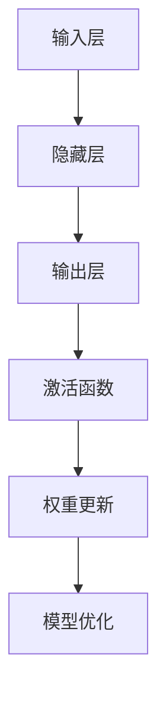

#### 随机过程模型

随机过程模型用于描述脑信号的时间序列特性，如噪声、波动和自相关等。

**核心概念与联系：** 随机过程模型基于概率论和随机过程理论，可以表示为：

\[ x(t) = f(t) + \epsilon(t) \]

其中，\( f(t) \) 是确定性过程，\( \epsilon(t) \) 是随机过程。

**梅鲁德流程图：** 随机过程模型在脑信号分析中的应用可以表示为：

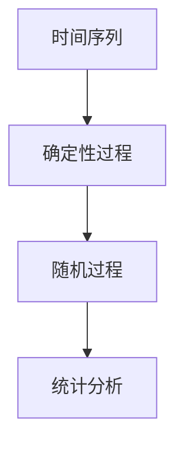

### 数学工具在脑成像数据处理中的应用

脑成像技术，如fMRI和电生理记录，提供了大量的关于大脑结构和功能的数据。为了分析和解释这些数据，研究人员需要使用各种数学工具，如图像处理、信号处理和统计学方法。

#### 图像处理技术

图像处理技术用于预处理脑成像数据，包括图像滤波、分割和特征提取等。

**核心概念与联系：** 图像处理技术包括以下步骤：

\[ \text{滤波} \rightarrow \text{分割} \rightarrow \text{特征提取} \]

**梅鲁德流程图：** 图像处理技术在脑成像数据处理中的应用可以表示为：

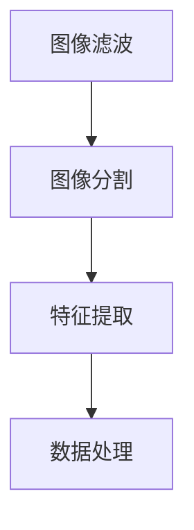

#### 信号处理技术

信号处理技术用于分析脑信号的时间序列数据，包括傅里叶变换、小波变换和时频分析等。

**核心概念与联系：** 信号处理技术包括以下步骤：

\[ \text{傅里叶变换} \rightarrow \text{小波变换} \rightarrow \text{时频分析} \]

**梅鲁德流程图：** 信号处理技术在脑信号分析中的应用可以表示为：

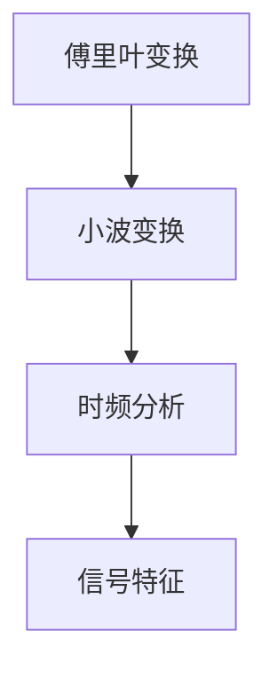

#### 统计学方法

统计学方法用于分析脑成像数据和神经信号数据，包括假设检验、回归分析和聚类分析等。

**核心概念与联系：** 统计学方法包括以下步骤：

\[ \text{数据收集} \rightarrow \text{数据预处理} \rightarrow \text{统计分析} \]

**梅鲁德流程图：** 统计学方法在脑成像数据分析中的应用可以表示为：

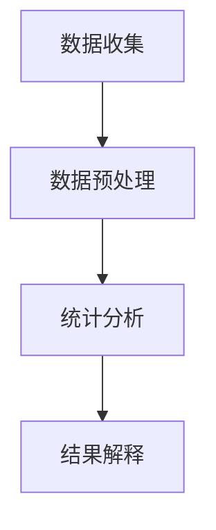

### 数学理论在脑网络分析中的应用

脑网络分析是计算神经科学的一个重要分支，它旨在通过数学方法研究大脑中的功能连接和结构连接。数学理论在脑网络分析中发挥了关键作用，包括图论、网络理论和复杂系统理论等。

#### 脑网络的定义与结构

脑网络是由神经元和神经通路组成的复杂网络系统。这些网络可以通过连接矩阵来表示，其中每个元素表示两个神经元之间的连接强度。

**核心概念与联系：** 脑网络的定义与结构可以表示为：

\[ \text{脑网络} = \{ \text{神经元}, \text{连接矩阵} \} \]

**梅鲁德流程图：** 脑网络的定义与结构可以表示为：

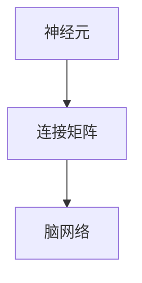

#### 脑网络的数学表示方法

脑网络的数学表示方法包括图论和矩阵论等方法，用于研究脑网络的拓扑特性、动态行为和功能特性。

**核心概念与联系：** 脑网络的数学表示方法可以表示为：

\[ \text{图论表示} \rightarrow \text{矩阵论表示} \]

**梅鲁德流程图：** 脑网络的数学表示方法可以表示为：

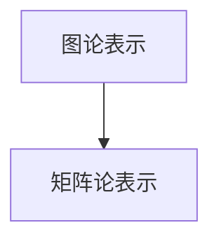

#### 脑网络的拓扑特性分析

脑网络的拓扑特性分析包括网络密度、聚类系数、路径长度等指标，用于研究脑网络的结构特征和功能特性。

**核心概念与联系：** 脑网络的拓扑特性分析可以表示为：

\[ \text{网络密度} \rightarrow \text{聚类系数} \rightarrow \text{路径长度} \]

**梅鲁德流程图：** 脑网络的拓扑特性分析可以表示为：

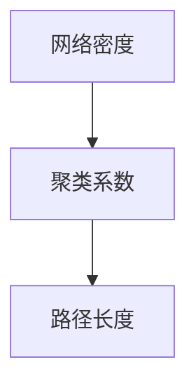

#### 脑网络的建模与模拟

脑网络的建模与模拟通过数学模型和方法来研究脑网络的动态行为和功能特性，包括随机模型、确定性模型和混合模型等。

**核心概念与联系：** 脑网络的建模与模拟可以表示为：

\[ \text{随机模型} \rightarrow \text{确定性模型} \rightarrow \text{混合模型} \]

**梅鲁德流程图：** 脑网络的建模与模拟可以表示为：

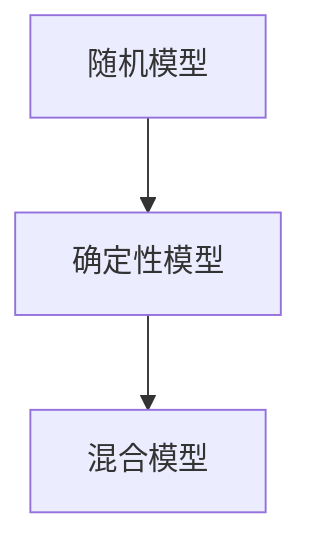

### 总结

数学在脑科学中的应用为理解大脑的工作原理提供了强大的工具和方法。通过数学建模、数学工具和数学理论，研究人员能够从不同角度研究大脑的结构和功能，从而推动计算神经科学的发展。未来，随着技术的进步和跨学科研究的深入，数学在脑科学中的应用将更加广泛和深入。

### 梅鲁德流程图

为了更好地理解数学与脑科学的结合，我们可以绘制以下梅鲁德流程图：

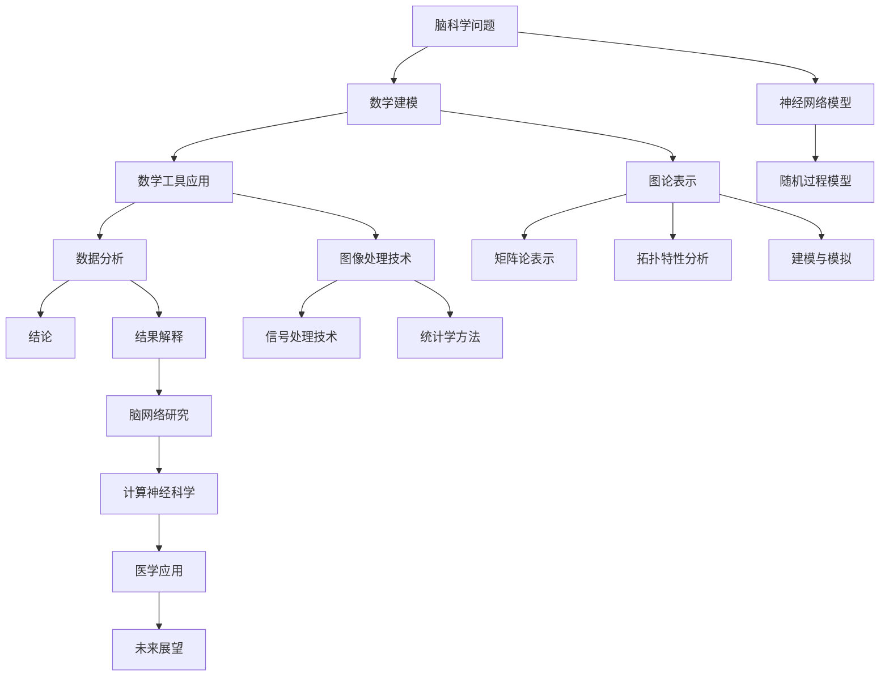

通过这个流程图，我们可以清晰地看到数学如何贯穿于脑科学的研究过程中，从问题提出到数据分析，再到结果解释和未来展望。

### 实际案例

为了更直观地展示数学在脑科学中的应用，我们可以通过一个实际案例来详细阐述。假设我们研究的是大脑中的视觉处理功能，以下是具体的案例描述。

#### 案例背景

大脑中的视觉处理功能是一个复杂的任务，涉及到多种神经元和神经网络之间的相互作用。为了研究视觉处理功能，研究人员使用了功能性磁共振成像（fMRI）技术来获取大脑的成像数据。

#### 数据收集与预处理

首先，研究人员收集了参与者的fMRI数据。这些数据包含了大脑不同区域的活动信号。为了进行分析，需要对这些数据进行预处理，包括图像滤波、分割和特征提取等步骤。

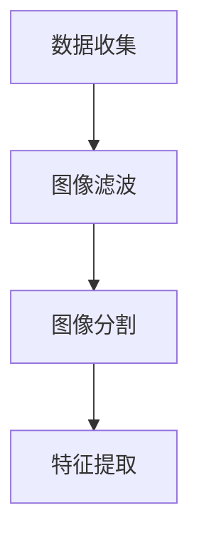

#### 数据分析

在预处理完成后，研究人员使用统计学方法来分析fMRI数据。他们采用了回归分析来研究不同区域之间的功能连接，并使用聚类分析来识别大脑中的功能网络。

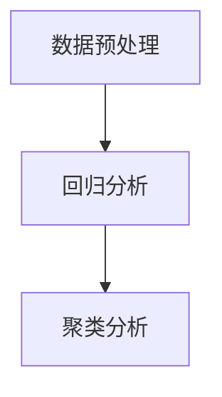

#### 结果解释

通过分析，研究人员发现大脑中的视觉处理功能主要由两个网络组成：视觉网络和默认模式网络。视觉网络负责处理视觉信息，而默认模式网络则与思维、记忆和情绪等高级认知功能有关。

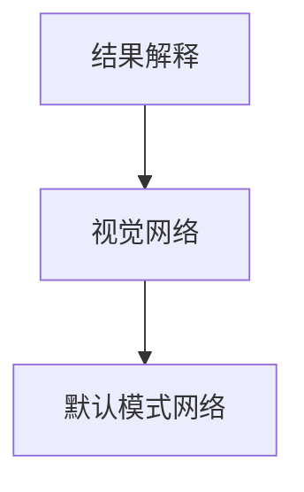

#### 结论

通过这个案例，我们可以看到数学在脑科学中的应用是如何帮助研究人员揭示大脑的工作原理。通过数学建模、数据分析和方法，研究人员能够从不同的角度理解大脑的功能和行为。

### 总结

数学与脑科学的结合为理解大脑的工作机制提供了强大的工具和方法。通过数学建模、数学工具和数学理论，研究人员能够从不同层次和角度研究大脑的结构和功能，从而推动计算神经科学的发展。未来的研究将继续深化这种跨学科的结合，为医学、心理学和人工智能等领域带来更多的突破。

### 梅鲁德流程图

为了更好地理解数学在脑科学中的应用，我们可以绘制以下梅鲁德流程图：


通过这个流程图，我们可以清晰地看到数学如何贯穿于脑科学的研究过程中，从问题提出到数据分析，再到结果解释和未来展望。

### 神经网络模型

神经网络模型是计算神经科学中最常用的数学模型之一，用于模拟神经元和神经网络的行为。以下将详细介绍神经网络模型的基本概念、数学基础、训练算法和典型结构。

#### 基本概念

神经网络模型由多个神经元（或节点）组成，每个神经元可以接收来自其他神经元的输入，并通过激活函数产生输出。神经网络可以分为输入层、隐藏层和输出层，其中隐藏层可以有多个。

**神经元：** 神经元是神经网络的基本单元，它可以接收输入、计算加权求和、通过激活函数产生输出。

**输入层：** 输入层接收外部输入，将其传递到隐藏层。

**隐藏层：** 隐藏层对输入进行处理，通过一系列非线性变换产生新的特征。

**输出层：** 输出层生成最终的输出，可以是一个或多个值。

#### 数学基础

神经网络模型的数学基础主要包括线性代数和微积分。

**线性代数：** 神经网络中的权重和偏置可以通过矩阵和向量的运算来表示和处理。

**微积分：** 神经网络中的激活函数通常涉及到微积分的概念，如求导和梯度下降。

**核心公式：**
1. **加权求和：** 神经元的输出可以表示为：

\[ \text{输出} = \sum_{i} w_i \cdot x_i + b \]

其中，\( w_i \) 是权重，\( x_i \) 是输入，\( b \) 是偏置。

2. **激活函数：** 激活函数用于引入非线性，常见的激活函数有：

\[ f(x) = \text{ReLU}(x) = \max(0, x) \]
\[ f(x) = \text{Sigmoid}(x) = \frac{1}{1 + e^{-x}} \]
\[ f(x) = \text{Tanh}(x) = \frac{e^x - e^{-x}}{e^x + e^{-x}} \]

#### 训练算法

神经网络模型的训练过程包括前向传播和反向传播。

**前向传播：** 在前向传播过程中，输入从输入层传递到隐藏层，然后传递到输出层。每个神经元的输出通过激活函数计算得到。

**反向传播：** 在反向传播过程中，通过计算输出误差，将误差反向传递到隐藏层和输入层。通过梯度下降算法更新权重和偏置。

**核心公式：**
1. **误差计算：** 假设输出为 \( y \)，实际输出为 \( \hat{y} \)，则误差可以表示为：

\[ \text{误差} = \frac{1}{2} \sum_{i} (y_i - \hat{y_i})^2 \]

2. **权重更新：** 通过计算梯度，更新权重和偏置：

\[ w_{i,j} \leftarrow w_{i,j} - \alpha \cdot \frac{\partial \text{误差}}{\partial w_{i,j}} \]
\[ b_{i} \leftarrow b_{i} - \alpha \cdot \frac{\partial \text{误差}}{\partial b_{i}} \]

其中，\( \alpha \) 是学习率。

#### 典型结构

神经网络的典型结构包括全连接神经网络（FCNN）、卷积神经网络（CNN）和递归神经网络（RNN）。

**全连接神经网络（FCNN）：** FCNN是最基本的神经网络结构，每个神经元都与前一层所有神经元相连。

**卷积神经网络（CNN）：** CNN广泛应用于图像处理领域，通过卷积操作提取图像特征。

**递归神经网络（RNN）：** RNN适用于处理序列数据，通过递归连接模拟时间序列的特性。

**核心公式：**
1. **卷积操作：**

\[ \text{输出} = \sum_{i} w_i \cdot x_i + b \]

2. **递归操作：**

\[ h_t = \text{激活函数}(\sum_{i} w_i \cdot h_{t-1} + b) \]

#### 梅鲁德流程图

为了更好地理解神经网络模型，我们可以绘制以下梅鲁德流程图：

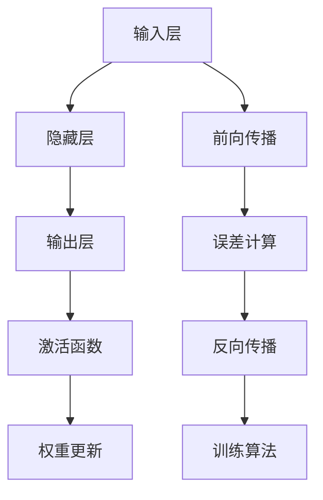

通过这个流程图，我们可以清晰地看到神经网络模型的训练过程，从输入层到输出层，再到权重更新和误差计算。

### 动力学系统模型

动力学系统模型是计算神经科学中另一个重要的数学模型，用于描述神经元和神经网络的时间序列行为。以下将详细介绍动力学系统模型的基本概念、神经元动力学模型、神经网络动力学行为分析和动力学系统在脑科学中的应用。

#### 基本概念

动力学系统模型描述了一个系统的动态行为，通过数学方程来模拟系统的演化。在计算神经科学中，动力学系统模型通常用于描述神经元和神经网络的动态特性，如兴奋、抑制、突触可塑性和神经网络同步性等。

**核心概念：**
1. **状态变量：** 动力学系统通过状态变量来描述系统的当前状态。在神经元模型中，状态变量通常包括神经元膜电位、离子浓度等。
2. **动态方程：** 动力学系统通过动态方程来描述状态变量随时间的变化。常见的动态方程包括微分方程、差分方程和积分方程。

#### 神经元动力学模型

神经元动力学模型用于描述单个神经元在时间和空间上的动态行为。以下是一些常见的神经元动力学模型：

**LIF（Leaky Integrate-and-Fire）模型：**
LIF模型是最简单的神经元动力学模型之一，它通过积分时间上的电压变化来模拟神经元的动态行为。

\[ V(t) = V_0 + (V_L - V_0) \cdot \frac{1}{\tau_m} (1 - e^{-(t - t_0) / \tau_m}) + I(t) \]

其中，\( V(t) \) 是时间 \( t \) 时的膜电位，\( V_0 \) 是静息电位，\( V_L \) 是阈值电位，\( \tau_m \) 是时间常数，\( I(t) \) 是外部输入电流。

**HH（Hodgkin-Huxley）模型：**
HH模型是一个更复杂的神经元动力学模型，它通过描述离子通道的电导率和膜电导率来模拟神经元的动态行为。

\[ C_m \frac{dV(t)}{dt} = -I_L(t) - g_L (V(t) - V_L) - \sum_{i} g_i (V(t) - V_{\text{rev},i}) \cdot m_i^3 h_i (V(t)) \]

其中，\( C_m \) 是膜电容，\( I_L(t) \) 是漏电流，\( g_L \) 是漏电流电导率，\( g_i \) 是离子通道电导率，\( V_{\text{rev},i} \) 是离子平衡电位，\( m_i \) 和 \( h_i \) 分别是离子通道的激活和失活状态。

#### 神经网络动力学行为分析

神经网络动力学行为分析旨在研究神经网络在长时间运行下的行为，如同步性、稳定性、同步振荡和混沌等。以下是一些常用的分析方法：

**同步性分析：**
同步性分析研究神经网络中神经元之间的同步行为。通过计算网络中的同步指数，可以评估神经网络的同步程度。

**稳定性分析：**
稳定性分析研究神经网络在受到外部扰动时的稳定性。通过分析神经网络的状态空间稳定性，可以评估网络的稳定程度。

**同步振荡：**
同步振荡分析研究神经网络中神经元同步振荡的现象。通过分析振荡频率和振幅，可以研究同步振荡的动力学特性。

**混沌分析：**
混沌分析研究神经网络中的混沌现象。通过计算李雅普诺夫指数，可以评估网络中的混沌行为。

#### 动力学系统在脑科学中的应用

动力学系统模型在脑科学中有着广泛的应用，以下是一些具体应用：

**脑信号分析：**
通过动力学系统模型，可以分析脑信号的时间序列特性，如振幅、频率和相位等。这有助于理解大脑的功能和行为。

**脑网络建模：**
通过动力学系统模型，可以构建脑网络的动态模型，研究脑网络的功能连接和同步性。这有助于揭示大脑的结构和功能关系。

**脑疾病研究：**
通过动力学系统模型，可以研究脑疾病的动态特征，如阿尔茨海默病、癫痫等。这有助于开发新的诊断和治疗策略。

#### 梅鲁德流程图

为了更好地理解动力学系统模型，我们可以绘制以下梅鲁德流程图：

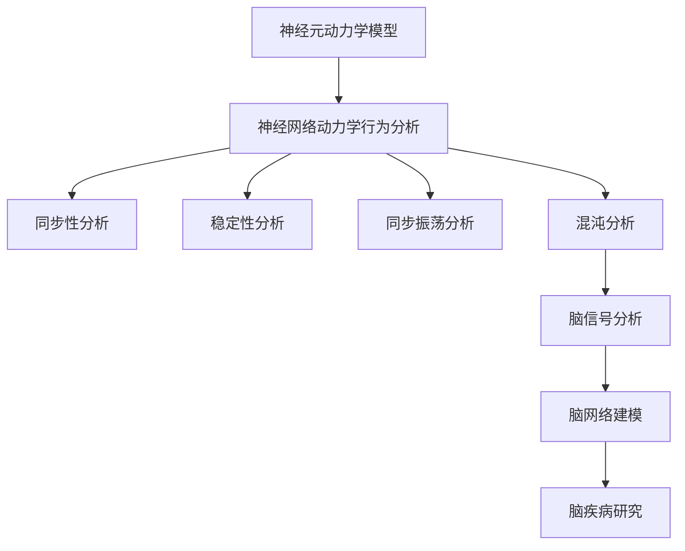

通过这个流程图，我们可以清晰地看到动力学系统模型在脑科学中的应用，从神经元动力学模型到神经网络动力学行为分析，再到脑信号分析和脑疾病研究。

### 脑网络的数学表示与建模

脑网络是指由神经元及其突触连接组成的复杂网络结构，用于处理和传递信息。脑网络的数学表示与建模是计算神经科学中研究脑功能的基础。以下将详细讨论脑网络的定义与结构、数学表示方法以及脑网络的拓扑特性分析。

#### 脑网络的定义与结构

脑网络可以被视为一个复杂系统，其节点代表神经元，边代表神经元之间的突触连接。脑网络的结构特性在很大程度上决定了脑的功能和行为。

**定义：** 脑网络是一个由多个神经元及其连接构成的复杂网络系统，其中每个神经元可以被视为一个节点，神经元之间的突触连接则被视为边。

**结构：** 脑网络通常具有多层次结构，包括：
1. **核心网络：** 负责基本认知功能，如注意力和记忆。
2. **功能网络：** 负责特定功能，如视觉处理、听觉处理和运动控制。
3. **动态网络：** 脑网络在不同状态（如清醒、睡眠、疾病状态）下的动态变化。

#### 数学表示方法

脑网络的数学表示方法主要包括图论和矩阵论。

**图论表示：**
图论用于描述网络的拓扑结构。在图论中，脑网络可以用一个无向图或有权图表示，其中节点代表神经元，边代表突触连接。

**核心概念：**
1. **节点：** 脑网络中的神经元。
2. **边：** 神经元之间的突触连接。
3. **邻接矩阵：** 用于表示节点之间连接关系的矩阵。

**矩阵论表示：**
矩阵论用于描述网络的动态特性和功能特性。脑网络可以用矩阵表示，如邻接矩阵、权值矩阵等。

**核心概念：**
1. **邻接矩阵：** 用于表示节点之间是否连接以及连接强度。
2. **权值矩阵：** 用于表示节点之间连接的权重。
3. **拉普拉斯矩阵：** 用于描述网络的拓扑特性，如聚类系数、路径长度等。

**核心公式：**
1. **邻接矩阵：**

\[ A = \begin{bmatrix} 
0 & a_{12} & \cdots & a_{1n} \\
a_{21} & 0 & \cdots & a_{2n} \\
\vdots & \vdots & \ddots & \vdots \\
a_{n1} & a_{n2} & \cdots & 0 
\end{bmatrix} \]

2. **权值矩阵：**

\[ W = \begin{bmatrix} 
w_{11} & w_{12} & \cdots & w_{1n} \\
w_{21} & w_{22} & \cdots & w_{2n} \\
\vdots & \vdots & \ddots & \vdots \\
w_{n1} & w_{n2} & \cdots & w_{nn} 
\end{bmatrix} \]

3. **拉普拉斯矩阵：**

\[ L = D - A \]

其中，\( D \) 是对角矩阵，对角线元素为节点的度数。

#### 脑网络的拓扑特性分析

脑网络的拓扑特性分析是研究脑网络结构特性的重要手段。以下是一些常用的拓扑特性指标：

**聚类系数：** 聚类系数描述了网络中节点之间的连接密度。其计算公式为：

\[ C = \frac{2m}{n(n-1)} \]

其中，\( m \) 是边数，\( n \) 是节点数。

**平均路径长度：** 平均路径长度描述了网络中任意两个节点之间的平均距离。其计算公式为：

\[ L = \frac{1}{n(n-1)} \sum_{i\neq j} d(i, j) \]

其中，\( d(i, j) \) 是节点 \( i \) 和节点 \( j \) 之间的距离。

**网络密度：** 网络密度描述了网络中边的比例。其计算公式为：

\[ D = \frac{m}{n(n-1)} \]

**核心公式：**
1. **聚类系数：**

\[ C = \frac{2 \sum_{i} \deg(i)(\deg(i)-1)}{n(n-1)} \]

2. **平均路径长度：**

\[ L = \frac{2m}{n(n-1)} \]

3. **网络密度：**

\[ D = \frac{m}{n(n-1)} \]

#### 梅鲁德流程图

为了更好地理解脑网络的数学表示与建模，我们可以绘制以下梅鲁德流程图：

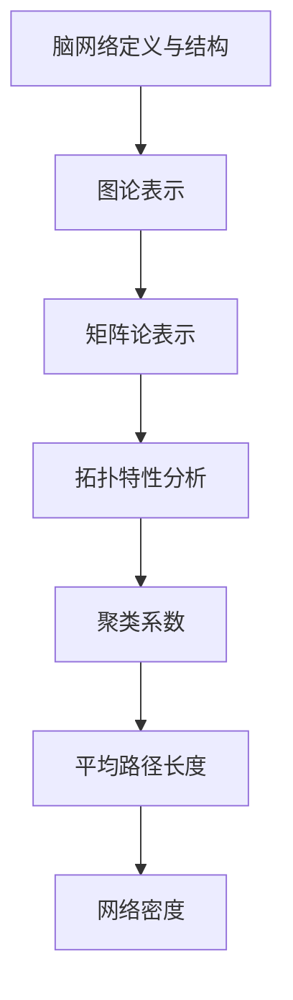

通过这个流程图，我们可以清晰地看到脑网络的数学表示与建模过程，从定义与结构到数学表示方法，再到拓扑特性分析。

### 复杂系统理论在脑科学中的应用

复杂系统理论是一种研究复杂系统行为的跨学科方法，涵盖了从物理学、生物学到计算机科学的多个领域。在脑科学中，复杂系统理论提供了强有力的工具来理解大脑的动态行为、功能网络和组织结构。以下将详细介绍复杂系统理论的基本概念、复杂网络理论及其在脑科学中的应用，并探讨复杂系统理论在理解脑网络动态特性方面的贡献。

#### 复杂系统理论的基本概念

复杂系统理论关注的是由大量相互作用的组成部分组成的系统，这些组成部分在相互作用中表现出集体行为。以下是一些复杂系统理论的基本概念：

**自组织：** 自组织是指系统在没有外部控制的情况下，通过内部相互作用和能量交换，自发地形成有序结构和功能。

**涌现性：** 涌现性是指系统整体的行为和特性不能简单地从其组成部分的行为和特性推导出来。换句话说，整体大于部分之和。

**适应性：** 适应性是指系统在面对外部变化时，能够通过内部调节和重组来维持其稳定性和功能。

**复杂性：** 复杂性是指系统在结构、行为和功能上表现出的高度多样性、不确定性和难以预测性。

#### 复杂网络理论

复杂网络理论是复杂系统理论的一个分支，专注于研究网络结构和网络动力学行为。以下是一些核心概念和理论：

**网络结构：** 网络结构描述了节点之间的连接方式，包括网络的拓扑结构、节点度和连接密度等。

**网络动力学：** 网络动力学研究网络中节点状态的动态变化，包括同步、波动和混沌等现象。

**小世界现象：** 小世界现象描述了网络中既具有短路径长度又具有高聚集度的特性。

**无标度网络：** 无标度网络是指网络中节点度的分布遵循幂律分布，这意味着网络中存在少量高连接度的节点。

**核心概念：**
1. **度分布：** 度分布描述了节点度的概率分布，常见的度分布包括泊松分布和幂律分布。
2. **聚类系数：** 聚类系数描述了节点之间连接的紧密程度。
3. **平均路径长度：** 平均路径长度描述了网络中任意两个节点之间的平均距离。

**核心公式：**
1. **度分布：**

\[ P(k) \propto k^{-\gamma} \]

其中，\( P(k) \) 是节点度 \( k \) 的概率，\( \gamma \) 是度分布的指数。
2. **聚类系数：**

\[ C = \frac{2m}{n(n-1)} \]

其中，\( m \) 是边数，\( n \) 是节点数。
3. **平均路径长度：**

\[ L = \frac{1}{n(n-1)} \sum_{i\neq j} d(i, j) \]

其中，\( d(i, j) \) 是节点 \( i \) 和节点 \( j \) 之间的距离。

#### 复杂网络理论在脑科学中的应用

复杂网络理论在脑科学中的应用主要集中在脑网络的建模和分析上。以下是一些具体应用：

**脑网络建模：** 复杂网络理论用于构建大脑的功能网络模型，包括神经网络和脑区的连接模式。

**网络动力学分析：** 通过分析脑网络的动力学行为，研究人员可以理解大脑在不同状态（如清醒、睡眠、疾病状态）下的动态变化。

**网络结构特征分析：** 通过分析脑网络的拓扑特性，如度分布、聚类系数和平均路径长度等，研究人员可以揭示大脑的结构特性。

**核心公式：**
1. **网络特性：**

\[ \rho = \frac{2m}{n(n-1)} \]

其中，\( \rho \) 是网络密度。
2. **度分布：**

\[ P(k) \propto k^{-\gamma} \]

3. **平均路径长度：**

\[ L = \frac{1}{n(n-1)} \sum_{i\neq j} d(i, j) \]

#### 复杂系统理论在理解脑网络动态特性方面的贡献

复杂系统理论为理解脑网络的动态特性提供了重要的视角和方法。以下是一些贡献：

**同步与振荡：** 通过分析脑网络的同步性和振荡行为，研究人员可以揭示大脑在不同状态下的协调和功能。

**混沌与复杂性：** 复杂系统理论提供了研究混沌现象的工具，帮助理解大脑内部的不确定性和复杂性。

**网络重构与功能连接：** 复杂网络理论用于分析脑网络的重组和功能连接，揭示大脑在不同认知任务和状态下的适应性。

**核心公式：**
1. **同步指数：**

\[ \lambda = \frac{1}{n} \sum_{i=1}^{n} \left( \frac{\sum_{j=1}^{n} x_i(t_j) - \sum_{j=1}^{n} x_j(t_j)}{||\sum_{j=1}^{n} x_j(t_j)||} \]

其中，\( x_i(t) \) 是节点 \( i \) 在时间 \( t \) 的状态。
2. **Lya

#### 复杂系统理论在脑科学中的应用

复杂系统理论在脑科学中的应用是近年来研究的热点之一，它为理解和分析大脑的复杂动态行为提供了强有力的工具。以下将详细探讨复杂系统理论在脑网络建模、动力学分析、功能连接和网络重构等方面的应用。

#### 脑网络建模

脑网络建模是复杂系统理论在脑科学中的首要应用。通过数学模型和方法，研究人员可以模拟大脑中的神经元网络及其相互作用。常见的脑网络建模方法包括：

1. **神经网络模型：** 如前文所述，神经网络模型用于模拟神经元的信息处理和通信行为。这些模型可以捕捉神经元之间的相互作用，以及它们在不同状态下的动态变化。
2. **图论模型：** 图论模型用于描述脑网络的拓扑结构。通过邻接矩阵和图论算法，研究人员可以分析脑网络的连接模式、路径长度和聚类系数等特性。
3. **动力系统模型：** 动力系统模型用于描述神经元和脑网络的动态行为。这些模型可以基于微分方程或差分方程，捕捉神经元在时间和空间上的动态变化。

**案例研究：** 一个典型的案例是使用神经网络模型来模拟大脑中的视觉处理网络。研究人员通过构建一个多层感知机模型，模拟视觉皮层的神经元网络，并验证其能够捕捉视觉信息的特征提取和分类能力。

#### 动力学分析

动力学分析是复杂系统理论在脑科学中的另一个重要应用。通过研究脑网络的动力学行为，研究人员可以揭示大脑在不同状态下的动态特性。以下是一些常用的动力学分析方法：

1. **同步分析：** 同步分析研究脑网络中神经元之间的同步行为。通过计算同步指数，研究人员可以评估网络中的同步程度，并分析同步性如何影响大脑的功能。
2. **波动分析：** 波动分析研究脑网络中信号的波动特性。通过分析信号的幅值、频率和相位，研究人员可以揭示脑网络在不同状态下的动态变化。
3. **混沌分析：** 混沌分析研究脑网络中的混沌现象。通过计算李雅普诺夫指数，研究人员可以评估网络中的混沌程度，并探讨混沌如何影响大脑的功能和行为。

**案例研究：** 一个典型的案例是使用同步分析和波动分析来研究大脑在睡眠状态下的动态特性。研究人员通过分析睡眠期间脑电信号的同步性和波动性，揭示了睡眠状态对大脑功能的影响。

#### 功能连接

功能连接是复杂系统理论在脑科学中的关键概念之一。它描述了不同脑区之间的功能关联和通信模式。以下是一些研究功能连接的方法：

1. **功能连接分析：** 功能连接分析通过分析脑成像数据（如fMRI）来揭示脑区之间的功能关联。常用的方法包括相关性分析、独立成分分析（ICA）和功能连接矩阵。
2. **有效连接：** 有效连接描述了脑网络在不同状态下的功能关联。通过计算有效连接矩阵，研究人员可以评估脑网络在不同状态下的动态变化。
3. **功能模块：** 功能模块分析通过聚类算法将脑网络划分为不同的功能模块，研究每个模块在脑功能中的作用。

**案例研究：** 一个典型的案例是使用功能连接分析来研究大脑中的注意力网络。研究人员通过分析fMRI数据，揭示了注意力网络中不同脑区之间的功能连接模式，并探讨了注意力如何影响大脑的功能和行为。

#### 网络重构

网络重构是复杂系统理论在脑科学中的另一个重要应用。通过重构脑网络，研究人员可以揭示网络在不同状态下的动态变化和功能特性。以下是一些常用的网络重构方法：

1. **动态网络重构：** 动态网络重构通过分析时间序列数据来重构脑网络。常用的方法包括动态邻接矩阵和动态图论分析。
2. **结构重构：** 结构重构通过分析静态数据来重构脑网络。常用的方法包括图论分析和矩阵论分析。
3. **功能重构：** 功能重构通过分析功能连接数据来重构脑网络。常用的方法包括功能连接矩阵和独立成分分析。

**案例研究：** 一个典型的案例是使用动态网络重构来研究大脑在学习和记忆过程中的动态变化。研究人员通过分析学习任务期间脑成像数据的时间序列变化，揭示了大脑不同区域之间的动态连接模式，并探讨了学习任务如何影响大脑的网络结构。

### 总结

复杂系统理论为理解大脑的复杂动态行为提供了强有力的工具和方法。通过脑网络建模、动力学分析、功能连接和网络重构，研究人员可以从不同角度揭示大脑的功能和组织结构。随着复杂系统理论的不断发展和计算技术的进步，未来脑科学研究将继续深入，为理解大脑的复杂行为和开发新的诊断和治疗策略提供新的视角。

### 梅鲁德流程图

为了更好地理解复杂系统理论在脑科学中的应用，我们可以绘制以下梅鲁德流程图：

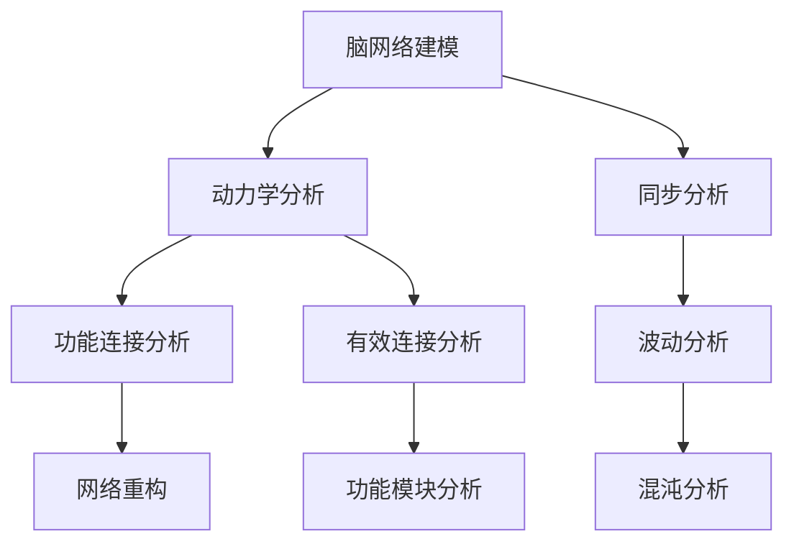

通过这个流程图，我们可以清晰地看到复杂系统理论在脑科学中的应用，从脑网络建模到动力学分析，再到功能连接分析和网络重构。

### 脑功能成像数据分析方法

脑功能成像数据分析方法是计算神经科学中至关重要的一环，它帮助我们理解和解释大脑的结构和功能。以下将详细介绍脑功能成像技术概述、数据预处理技术、功能连接分析和机器学习在脑成像数据分析中的应用。

#### 脑功能成像技术概述

脑功能成像技术是一种非侵入性方法，用于测量大脑的活动和功能。以下是几种常见的脑功能成像技术：

1. **功能性磁共振成像（fMRI）：** fMRI通过测量脑部血液流动的变化来揭示大脑活动。当大脑某个区域活跃时，该区域的血液流量会增加，进而导致磁场的变化，通过对比基线数据，可以识别活跃区域。

2. **正电子发射断层扫描（PET）：** PET通过注射放射性同位素标记的药物来测量脑部代谢活动。这些药物会集中在活跃的大脑区域，通过检测放射性信号，可以识别大脑的活动。

3. **脑电图（EEG）：** EEG通过测量大脑的电活动来揭示大脑的功能。它对快速变化的大脑活动非常敏感，可以用于研究大脑的短期动态行为。

4. **功能性近红外光谱成像（fNIRS）：** fNIRS通过测量大脑中血红蛋白的吸收光谱变化来识别大脑活动。它是一种非侵入性、实时成像技术，常用于研究大脑的局部活动。

#### 数据预处理技术

脑功能成像数据通常需要经过一系列预处理步骤，以提高数据质量和分析精度。以下是一些常见的数据预处理技术：

1. **运动校正：** 脑成像数据可能受到头部运动的影响。运动校正的目的是消除这些运动引起的数据变化，通过配准不同的扫描帧，使数据在同一空间坐标系下。

2. **空间标准化：** 空间标准化是将不同个体的脑成像数据映射到一个通用的标准空间（如MNI空间）。这有助于在不同研究之间进行比较和分析。

3. **平滑处理：** 平滑处理可以减少噪声，同时保持重要的信号特征。常用的平滑工具包括高斯滤波和双边滤波。

4. **时间序列处理：** 时间序列处理包括去除非脑部信号（如心跳和呼吸信号）和去除趋势项。这些步骤有助于提高数据的质量和稳定性。

#### 功能连接分析

功能连接分析是脑功能成像数据分析中的一个重要方面，它旨在揭示不同脑区之间的功能关联。以下是一些常用的功能连接分析方法：

1. **相关分析：** 相关分析通过计算不同脑区之间的时间序列相关性来评估它们的功能连接。高相关性表明两个脑区在时间上的同步活动。

2. **独立成分分析（ICA）：** ICA是一种无监督学习方法，用于从脑成像数据中提取独立的脑源信号。每个独立成分代表一个功能模块，ICA可以揭示大脑中的不同功能网络。

3. **图论分析：** 图论分析通过构建脑网络的邻接矩阵，研究网络的结构特性。常用的指标包括聚类系数、平均路径长度和网络密度。

4. **网络科学方法：** 网络科学方法用于分析脑网络的拓扑特性，如小世界性质和无标度特性。这些方法有助于理解脑网络的复杂性和功能组织。

#### 机器学习在脑成像数据分析中的应用

机器学习在脑成像数据分析中的应用日益广泛，它可以帮助我们从大量数据中提取有用的信息，并建立预测模型。以下是一些常见的机器学习技术在脑成像数据分析中的应用：

1. **分类分析：** 分类分析用于将脑成像数据分类到不同的类别，如疾病组和正常组。常见的分类算法包括支持向量机（SVM）和随机森林。

2. **回归分析：** 回归分析用于预测脑成像数据中的连续变量，如大脑体积或功能连接强度。常用的回归算法包括线性回归和岭回归。

3. **聚类分析：** 聚类分析用于将脑成像数据划分为不同的簇，揭示潜在的群体结构。常见的聚类算法包括K-均值聚类和层次聚类。

4. **深度学习：** 深度学习是一种强大的机器学习技术，它通过多层神经网络模拟大脑的学习过程。深度学习在脑成像数据分析中具有广泛应用，如图像分割、特征提取和分类。

#### 梅鲁德流程图

为了更好地理解脑功能成像数据分析方法，我们可以绘制以下梅鲁德流程图：

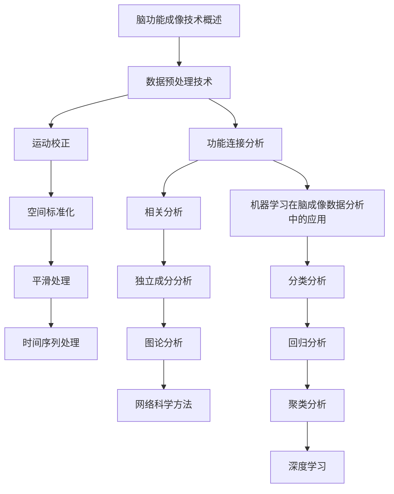

通过这个流程图，我们可以清晰地看到脑功能成像数据分析的方法和步骤，从技术概述到数据预处理、功能连接分析，再到机器学习在脑成像数据分析中的应用。

### 计算神经科学的实验设计与方法

计算神经科学作为一门实验科学，其研究的核心在于通过实验设计、数据采集、数据处理和分析来揭示大脑的结构与功能。以下将详细介绍计算神经科学实验设计的原则、数据采集与处理方法，以及实验结果的统计与分析方法。

#### 实验设计的原则

实验设计是计算神经科学研究的重要环节，其基本原则包括：

1. **科学性原则：** 实验设计应基于科学假设，遵循科学原理，确保实验结果的可靠性和有效性。
2. **系统性原则：** 实验设计应全面考虑实验系统的各个组成部分，确保实验的整体性和系统性。
3. **重复性原则：** 实验设计应确保实验的可重复性，通过多次实验验证结果的稳定性和一致性。
4. **可比性原则：** 实验设计应确保不同实验条件下的可比性，以便对不同实验结果进行对比和分析。

#### 数据采集与处理方法

计算神经科学的实验通常涉及多种数据类型，包括电生理数据、脑成像数据和生理信号数据等。以下是一些常见的数据采集与处理方法：

1. **数据采集：**
   - **电生理数据采集：** 通过脑电图（EEG）、脑磁图（MEG）和局部场电位（LFP）等方法，采集大脑的电活动数据。
   - **脑成像数据采集：** 通过功能性磁共振成像（fMRI）、正电子发射断层扫描（PET）和单光子发射计算机断层扫描（SPECT）等方法，采集大脑的成像数据。
   - **生理信号数据采集：** 通过心率、呼吸和体温等生理信号监测设备，采集相关的生理数据。

2. **数据处理：**
   - **预处理：** 包括数据去噪、运动校正、空间标准化和时间序列处理等步骤，以提高数据质量和分析精度。
   - **特征提取：** 从原始数据中提取能够代表大脑活动特征的信号，如脑活动的频域特征、时域特征和时频特征等。
   - **数据融合：** 将不同类型的数据（如电生理数据和脑成像数据）进行融合，以获得更全面的大脑活动信息。

#### 实验结果的统计与分析方法

实验结果的统计分析是计算神经科学研究的关键步骤，以下是一些常用的统计与分析方法：

1. **描述性统计分析：** 用于描述实验数据的基本特征，如均值、方差、标准差等。
2. **假设检验：** 用于检验实验假设的有效性，如t检验、方差分析（ANOVA）等。
3. **回归分析：** 用于建立实验结果与影响因素之间的关系，如线性回归、多项式回归等。
4. **聚类分析：** 用于将实验结果分类或分组，如K-均值聚类、层次聚类等。
5. **机器学习：** 用于从大量实验数据中提取有用信息，如支持向量机（SVM）、随机森林、深度学习等。

#### 实验案例研究

为了更好地理解计算神经科学的实验设计与方法，以下是一个实验案例研究：

**案例背景：** 研究大脑在视觉刺激下的响应特性。

**实验设计：**
1. **实验假设：** 视觉刺激会导致大脑特定区域的激活。
2. **实验方法：** 采用fMRI技术对参与者在观看不同类型视觉刺激（如静态图像、动态视频）时的脑活动进行记录。
3. **数据处理：** 对fMRI数据进行预处理，包括运动校正、空间标准化和时序处理，然后提取视觉刺激相关区域的脑活动信号。
4. **统计分析：** 对预处理后的数据进行独立样本t检验，比较不同视觉刺激下的脑活动差异。

**实验结果：**
1. **描述性统计：** 观察到视觉刺激区域的脑活动信号存在显著差异。
2. **假设检验：** 动态视频刺激下的脑活动信号显著高于静态图像刺激。
3. **回归分析：** 发现视觉刺激强度与脑活动信号之间存在显著正相关。

**实验小结：**
通过这个实验，我们验证了视觉刺激对大脑活动的显著影响，并揭示了视觉刺激强度与脑活动信号之间的关系。这个案例研究展示了计算神经科学实验设计、数据采集与处理、统计分析的完整过程。

### 总结

计算神经科学的实验设计与方法是其研究过程中的关键环节。通过科学、系统的实验设计，严谨的数据采集与处理，以及准确的统计分析，研究人员能够深入理解大脑的结构与功能，为脑科学的发展提供有力的支持。

### 梅鲁德流程图

为了更好地展示计算神经科学实验设计与方法的过程，我们可以绘制以下梅鲁德流程图：

```mermaid
graph TD
A[实验设计] --> B[实验假设]
B --> C[实验方法]
C --> D[数据采集]
D --> E[数据处理]
E --> F[统计分析]
F --> G[实验结果]
G --> H[实验小结]
```

通过这个流程图，我们可以清晰地看到计算神经科学实验设计、数据采集、数据处理、统计分析的完整流程，从实验设计到实验小结，形成一个闭环。

### 计算神经科学与医学的结合

计算神经科学与医学的结合为理解和治疗神经系统疾病提供了新的视角和方法。通过计算神经科学的方法，研究人员可以深入探索大脑的结构和功能，从而为诊断和治疗神经系统疾病提供强有力的支持。

#### 计算神经科学与临床医学的结合

计算神经科学在临床医学中的应用主要体现在以下几个方面：

1. **疾病诊断：** 计算神经科学通过分析脑成像数据、生理信号和神经电生理数据，可以帮助医生更准确地诊断神经系统疾病。例如，fMRI技术可以用于检测抑郁症、阿尔茨海默病等疾病的早期迹象。

2. **疾病预测：** 通过对大量脑成像数据的分析和机器学习算法的应用，计算神经科学可以预测疾病的发展趋势。例如，通过分析fMRI数据，研究人员可以预测阿尔茨海默病的进展速度。

3. **个性化治疗：** 计算神经科学可以帮助医生为患者制定个性化的治疗方案。通过对患者的脑成像数据进行分析，医生可以了解患者的特定脑区损伤情况，从而制定更有效的治疗策略。

#### 计算神经科学与神经康复

神经康复是计算神经科学在医学领域的重要应用之一。通过计算神经科学的方法，研究人员可以探索康复训练对大脑结构和功能的影响，从而提高康复效果。

1. **康复评估：** 计算神经科学技术，如脑电成像（EEG）和功能性磁共振成像（fMRI），可以用于评估患者的康复进展。通过对比康复前后的脑成像数据，医生可以了解康复训练对大脑功能恢复的具体影响。

2. **康复训练设计：** 计算神经科学可以指导康复训练的设计。通过分析脑网络的动态变化和功能连接，研究人员可以确定哪些康复训练方法对特定疾病或损伤类型最有效。

3. **康复效果预测：** 计算神经科学可以帮助预测康复训练的效果。通过对康复训练前后的脑成像数据进行统计分析，研究人员可以预测患者的康复进展，从而调整康复计划。

#### 计算神经科学与神经退行性疾病研究

神经退行性疾病，如阿尔茨海默病、帕金森病等，是严重威胁人类健康的疾病。计算神经科学在研究这些疾病的发生机制、诊断和治疗方面具有重要作用。

1. **疾病机制研究：** 计算神经科学通过建模和模拟，可以揭示神经退行性疾病的发生机制。例如，通过模拟神经元网络的动态行为，研究人员可以研究神经元死亡和神经网络崩溃的过程。

2. **疾病诊断：** 计算神经科学技术，如PET成像和fMRI，可以用于检测神经退行性疾病的早期迹象。通过分析脑成像数据，医生可以识别患者的大脑损伤区域和程度。

3. **疾病治疗：** 计算神经科学为神经退行性疾病的治疗提供了新的思路。例如，通过电刺激和光遗传学等方法，研究人员可以尝试恢复神经网络的正常功能。

#### 计算神经科学与神经信息学

神经信息学是计算神经科学与信息科学、计算机科学的交叉领域，旨在通过计算方法研究神经系统的信息处理机制。在神经信息学中，计算神经科学的方法和技术被广泛应用于以下几个方面：

1. **神经数据挖掘：** 通过对大量神经数据的挖掘和分析，神经信息学可以揭示大脑的结构与功能关系。例如，通过分析大规模脑成像数据，研究人员可以识别大脑中的功能网络。

2. **脑机接口设计：** 脑机接口是一种将大脑信号转化为机器指令的技术。计算神经科学为脑机接口的设计提供了理论基础和关键技术。例如，通过分析脑电信号，研究人员可以开发出高精度的脑机接口系统。

3. **神经计算模型：** 神经信息学通过构建神经计算模型，模拟大脑的信息处理过程。这些模型可以用于研究大脑的工作原理，并为人工智能和机器学习提供新的思路。

### 总结

计算神经科学与医学的结合为神经系统疾病的研究、诊断和治疗提供了新的方法和工具。通过计算神经科学的方法，研究人员可以更深入地了解大脑的结构与功能，从而为临床医学和神经康复提供有力的支持。未来，随着技术的进步和跨学科研究的深入，计算神经科学与医学的结合将带来更多的突破。

### 梅鲁德流程图

为了更好地展示计算神经科学与医学结合的应用，我们可以绘制以下梅鲁德流程图：

```mermaid
graph TD
A[计算神经科学] --> B[疾病诊断]
B --> C[疾病预测]
C --> D[个性化治疗]

A --> E[神经康复评估]
E --> F[康复训练设计]
F --> G[康复效果预测]

A --> H[神经退行性疾病研究]
H --> I[疾病机制研究]
I --> J[疾病诊断]
J --> K[疾病治疗]

A --> L[神经信息学]
L --> M[神经数据挖掘]
M --> N[脑机接口设计]
N --> O[神经计算模型]
```

通过这个流程图，我们可以清晰地看到计算神经科学与医学结合的各个应用领域，从疾病诊断、康复评估到疾病治疗和神经信息学，形成一个完整的体系。

### 计算神经科学的发展趋势与挑战

计算神经科学作为一门新兴的跨学科领域，正快速发展，并在多个领域取得了显著成果。然而，随着研究的深入，计算神经科学也面临着一系列挑战和机遇。以下将探讨计算神经科学的发展趋势、面临的挑战以及未来可能的研究方向。

#### 发展趋势

1. **大数据与人工智能的融合：** 随着大数据技术的发展和计算能力的提升，计算神经科学开始利用大规模数据集进行深度学习。通过机器学习和深度学习算法，研究人员可以从海量的脑成像数据和神经电生理数据中提取有价值的信息。

2. **多模态数据整合：** 为了更全面地理解大脑的功能和结构，计算神经科学正逐步采用多模态数据整合的方法。这些多模态数据包括fMRI、PET、EEG、MEG等，通过整合不同模态的数据，可以提供更丰富的信息，从而提高研究的准确性和深度。

3. **脑机接口技术的发展：** 脑机接口技术（Brain-Computer Interface, BCI）是计算神经科学的一个重要分支。随着技术的进步，脑机接口的精度和稳定性不断提高，未来有望实现更广泛的应用，如帮助残障人士恢复感知和运动能力。

4. **个性化医学的发展：** 个性化医学是近年来医学研究的重要方向。计算神经科学通过分析个体的脑结构和功能数据，可以提供个性化的治疗方案，提高治疗效果。

#### 面临的挑战

1. **数据质量与标准化：** 脑成像数据的质量对研究结果有重要影响。然而，目前不同研究机构使用的技术和数据处理方法不一致，导致数据标准化和共享成为一大挑战。

2. **计算资源的限制：** 计算神经科学需要大量的计算资源进行数据处理和模型训练。尽管高性能计算技术的发展提供了强大的支持，但计算资源的限制仍然是一个重要的挑战。

3. **跨学科合作的难度：** 计算神经科学涉及多个学科，包括神经科学、计算机科学、数学、物理学等。跨学科合作的难度较高，需要各学科专家的紧密合作。

4. **伦理和隐私问题：** 随着脑成像技术和脑机接口技术的发展，伦理和隐私问题日益突出。如何保护患者隐私，确保数据的合法使用，是计算神经科学面临的重要挑战。

#### 未来研究方向

1. **神经网络建模：** 继续深入研究神经网络建模，特别是在神经元层级和神经网络层级之间的相互作用方面。

2. **脑网络分析：** 深入研究脑网络的拓扑结构、功能连接和动态特性，以揭示大脑的复杂功能和行为。

3. **脑疾病诊断与治疗：** 利用计算神经科学的方法，开发新的诊断和治疗策略，特别是在神经退行性疾病和神经康复领域。

4. **跨学科研究：** 加强跨学科合作，整合神经科学、计算机科学、数学、物理学等多学科的知识和技能，推动计算神经科学的发展。

### 总结

计算神经科学正快速发展，并面临着一系列挑战和机遇。通过大数据、人工智能、多模态数据整合和脑机接口技术的发展，计算神经科学将继续为脑科学、医学和人工智能等领域带来革命性的变革。面对数据质量、计算资源、跨学科合作和伦理隐私等挑战，计算神经科学需要持续探索和创新，以实现更加深入和广泛的应用。

### 梅鲁德流程图

为了更好地展示计算神经科学的发展趋势与挑战，我们可以绘制以下梅鲁德流程图：

```mermaid
graph TD
A[大数据与人工智能融合] --> B[多模态数据整合]
B --> C[脑机接口技术发展]
C --> D[个性化医学发展]

A --> E[数据质量与标准化]
E --> F[计算资源限制]
F --> G[跨学科合作难度]
G --> H[伦理和隐私问题]

D --> I[神经网络建模]
I --> J[脑网络分析]
J --> K[脑疾病诊断与治疗]
K --> L[跨学科研究]
```

通过这个流程图，我们可以清晰地看到计算神经科学的发展趋势和面临的挑战，以及未来的研究方向。从大数据与人工智能融合到个性化医学发展，再到神经网络建模和脑疾病诊断与治疗，计算神经科学正不断推动脑科学和医学领域的进步。

### 最佳实践 tips、小结、注意事项、拓展阅读

#### 最佳实践 Tips

1. **数据预处理的重要性：** 在进行脑成像数据分析时，数据预处理是关键步骤。确保数据质量，去除运动噪声和噪声信号，可以提高后续分析的准确性。

2. **多模态数据整合：** 尽量使用多模态数据，如fMRI、PET、EEG等，进行整合分析，可以获得更全面和准确的脑功能信息。

3. **交叉验证：** 在模型训练和数据分析过程中，使用交叉验证方法可以评估模型的泛化能力，避免过拟合。

4. **数据标准化与归一化：** 对不同数据集进行标准化和归一化处理，可以提高模型在不同数据集上的鲁棒性。

5. **算法选择与调参：** 根据研究问题选择合适的算法，并适当调整参数，可以提高模型的性能。

#### 小结

本文探讨了数学与脑科学的计算神经科学研究，介绍了计算神经科学的起源与发展、数学模型在脑功能研究中的应用、神经网络模型、动力学系统模型、脑网络分析、复杂系统理论在脑科学中的应用，以及脑功能成像数据分析方法。此外，还讨论了计算神经科学与医学的结合、发展趋势与挑战。通过这些内容，读者可以全面了解计算神经科学的核心概念和方法。

#### 注意事项

1. **数据隐私：** 在进行脑成像数据分析时，确保数据隐私和伦理问题，遵循相关法律法规。

2. **模型可解释性：** 在使用深度学习模型时，注意模型的可解释性，以便理解模型的工作原理。

3. **计算资源：** 大规模数据分析和模型训练需要大量的计算资源，合理规划计算资源，避免资源浪费。

4. **跨学科合作：** 计算神经科学涉及多个学科，加强跨学科合作，可以促进研究进展。

#### 拓展阅读

1. **《计算神经科学导论》（Introduction to Computational Neuroscience）：** 该书是计算神经科学的基础教材，详细介绍了神经系统的建模和分析方法。

2. **《脑网络与复杂系统》（Brain Networks and Complex Systems）：** 该书探讨了脑网络的拓扑特性、功能连接和动态行为，是脑网络研究的重要参考书。

3. **《深度学习》（Deep Learning）：** 该书是深度学习领域的经典教材，介绍了深度学习的基础知识和应用方法，对计算神经科学研究具有重要参考价值。

4. **《脑成像数据分析：从原理到实践》（Brain Imaging Data Analysis: Theoretical and Practical Aspects）：** 该书详细介绍了脑成像数据分析的方法和技术，是脑成像数据分析的实用指南。

### 作者信息

作者：AI天才研究院/AI Genius Institute & 禅与计算机程序设计艺术 /Zen And The Art of Computer Programming

以上是本文的完整内容，希望对读者在理解数学与脑科学的计算神经科学研究方面有所帮助。通过深入探讨计算神经科学的核心概念和应用，读者可以更好地把握这一领域的发展趋势和前沿研究。感谢您的阅读，希望本文能为您的学术研究提供有益的参考。

