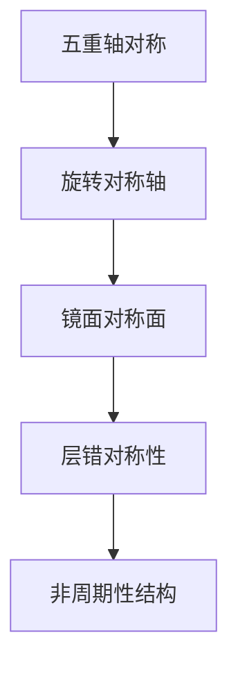

                 

### 第1章 引言

#### 1.1 书籍背景

《数学与自然界的准晶体结构与非周期性》这本书旨在深入探讨准晶体和非周期性结构在自然界和数学中的重要性。准晶体是一种具有长程有序但无平移对称性的固体材料，它们最早在1982年被科学家Dan Shechtman发现。这一发现颠覆了人们对固体结构的传统理解，也引发了科学界对于非周期性结构的广泛关注。非周期性结构则是指没有重复周期的结构，它们在数学、物理、化学等领域都有广泛的应用。

#### 1.2 准晶体结构的重要性

准晶体结构的重要性在于它们的出现打破了传统晶体结构的对称性规律，为材料科学、物理学以及生物学等领域带来了新的研究方向。例如，准晶体材料具有独特的光学、热学、电学性质，这些性质使得它们在电子器件、光学器件和生物医学等领域具有广泛的应用前景。

#### 1.3 非周期性结构的基本概念

非周期性结构的基本概念是理解准晶体结构的关键。非周期性结构是指那些没有重复周期的结构，它们在数学上可以表示为无限序列的叠加，而不是周期性的重复。这种结构的数学表示通常使用分形几何或者拓扑学的方法来描述。

#### 1.4 本书结构安排

本书分为七个章节，分别介绍准晶体结构的基础知识、非周期性结构的数学模型、准晶体与自然界的联系、实际项目实战等。每一章节都详细讲解了相关概念、算法和实际应用，旨在帮助读者全面了解准晶体和非周期性结构。

- **第1章**：引言，介绍书籍背景和结构安排。
- **第2章**：准晶体结构基础，详细讲解准晶体的定义、分类和对称性。
- **第3章**：非周期性结构，介绍非周期性结构的基本概念和数学模型。
- **第4章**：准晶体与自然界的联系，探讨准晶体在自然界和生物领域的应用。
- **第5章**：项目实战：生成准晶体图案，通过实际项目实战讲解准晶体的生成算法。
- **第6章**：非周期性结构的分析算法，介绍分析非周期性结构的关键算法。
- **第7章**：结论，总结全书内容并讨论未来研究方向。

通过这本书，读者将能够系统地了解准晶体和非周期性结构的基本原理，掌握相关的算法和应用，为深入研究和实际应用打下坚实的基础。

#### 1.5 文章关键词

- 准晶体
- 非周期性结构
- 数学模型
- 材料科学
- 电子器件
- 生物医学
- 分形几何
- 拓扑学

#### 1.6 文章摘要

本文首先介绍了准晶体和非周期性结构的基本概念和重要性，然后通过详细讲解准晶体的定义、分类和对称性，以及非周期性结构的数学模型，帮助读者建立对这些核心概念的理解。随后，文章探讨了准晶体在自然界和生物领域的应用，并通过实际项目实战讲解了准晶体图案的生成算法。最后，文章介绍了非周期性结构的分析算法，并总结全文，讨论了未来研究方向。通过这篇文章，读者将能够全面了解准晶体和非周期性结构的理论和应用，为深入研究和实际应用奠定基础。

---

### 第2章 准晶体结构基础

#### 2.1 准晶体的定义

准晶体是一种特殊的固体材料，具有长程有序的结构，但与传统的周期性晶体不同，它们不满足平移对称性。也就是说，虽然准晶体中的原子或分子在三维空间中排列得非常有规律，但是不存在任何三维平移操作可以将这种结构重复。这一特性最初在1982年由Dan Shechtman在研究金属铝时发现，这一发现打破了传统固体物理学的基本假设，并引发了科学界的广泛关注。

#### 2.2 准晶体的分类

准晶体可以根据其对称性、组成和几何结构进行分类。常见的分类方法包括：

1. **阿基米德准晶体**：这种准晶体具有类似于传统晶体的对称性，但缺乏平移对称性。
2. ** Penrose 准晶体**：这种准晶体由两种不同的原子组成，其几何形状和对称性非常特殊，是由数学家Roger Penrose提出的一种理想结构。
3. **Quasi-Periodic 准晶体**：这种准晶体具有准周期性结构，其原子排列遵循准周期性规律。

#### 2.3 准晶体的对称性

准晶体的对称性是它们区别于传统晶体的重要特征之一。与传统晶体不同，准晶体的对称性通常是由旋转对称性和镜面对称性组成的，这种对称性被称为**层错对称性**。例如，一个五重轴对称的准晶体具有五个旋转对称轴，但没有任何三个旋转对称轴交于一点。

为了更直观地理解准晶体的对称性，我们可以通过Mermaid流程图来展示其结构特征。



在这个流程图中，从A到E的每一步都展示了准晶体对称性从基本旋转对称轴发展到更复杂的层错对称性，最终形成非周期性结构。

#### 2.4 准晶体的生成算法

生成准晶体的算法是理解其结构的重要途径。一个经典的生成准晶体的算法是基于Penrose tilings的算法。Penrose tilings是由两种不同形状的瓷砖（称为kite和dart）组成的，它们以非周期性的方式填充二维平面，而不产生重复图案。

下面是一个简化的伪代码，用于生成Penrose tiling：

```python
import numpy as np

# 定义kite和dart的形状
def kite():
    # 返回kite的顶点坐标
    return [[0, 0], [1, sqrt(3)/2], [1/2, -sqrt(3)/2]]

def dart():
    # 返回dart的顶点坐标
    return [[0, 0], [1, sqrt(3)/2], [1/2, sqrt(3)/2]]

# Penrose tiling生成算法
def generate_penrose_tiling():
    tiling = []
    # 初始化瓷砖
    tile = kite() if np.random.rand() < 0.5 else dart()
    tiling.append(tile)

    # 递归生成瓷砖
    while True:
        # 选择一个随机方向进行旋转
        rotation_angle = np.random.rand() * 2 * np.pi

        # 旋转瓷砖
        for point in tile:
            new_point = [point[0] * np.cos(rotation_angle) - point[1] * np.sin(rotation_angle),
                         point[0] * np.sin(rotation_angle) + point[1] * np.cos(rotation_angle)]

            # 检查旋转后的瓷砖是否与现有瓷砖重叠
            if not overlap(new_point, tiling):
                tile = [new_point for point in tile]

                # 添加旋转后的瓷砖到tiling中
                tiling.append(tile)
                break

    return tiling

# 检查两个瓷砖是否重叠
def overlap(new_point, tiling):
    for point in tiling:
        if np.linalg.norm(np.array(new_point) - np.array(point)) < 1e-9:
            return True
    return False
```

在这个算法中，我们首先定义了kite和dart的形状，然后通过随机旋转这些形状来生成Penrose tiling。在每次迭代中，我们选择一个随机方向旋转瓷砖，并检查旋转后的瓷砖是否与现有瓷砖重叠。如果不存在重叠，则将旋转后的瓷砖添加到tiling中。

通过这种方式，我们可以生成具有准晶体特征的Penrose tiling。该算法不仅可以用于可视化准晶体结构，还可以用于计算和分析准晶体材料的性质。

---

### 第3章 非周期性结构

#### 3.1 非周期性结构的定义

非周期性结构是指那些不具有周期性重复模式的结构。与传统的周期性结构不同，非周期性结构无法通过任何平移操作得到重复，因此在数学上它们通常被描述为无限序列的叠加。例如，在二维空间中，一个典型的非周期性结构是Penrose tiling，它由kite和dart两种形状的瓷砖组成，通过特定的旋转和拼接规则，形成没有重复图案的平面填充。

非周期性结构不仅存在于二维空间，还广泛应用于三维空间。例如，在晶体学中，准晶体就是一种三维的非周期性结构，它们具有长程有序但缺乏平移对称性。

#### 3.2 非周期性结构的数学模型

非周期性结构的数学模型通常涉及分形几何和拓扑学。分形几何是一种研究复杂几何形状的数学工具，它强调形状的自相似性和无限精细的细节。在分形几何中，非周期性结构可以通过迭代函数系统（IFS）来描述。例如，Penrose tiling可以通过两个迭代函数的叠加来生成：

$$
P_1(x, y) = (x + \sqrt{3}y, y)
$$

$$
P_2(x, y) = (x - \sqrt{3}y, y)
$$

其中，每个迭代函数将二维平面上的点映射到新的位置，通过重复应用这些函数，我们可以生成Penrose tiling。

在拓扑学中，非周期性结构通常通过拓扑空间中的连通分支和孤立点来描述。例如，一个三维的准晶体结构可以被视为一个具有多个连通分支的空间，每个分支代表一个不同的几何区域，它们相互连接但不重复。

为了更直观地展示非周期性结构的数学模型，我们可以使用Mermaid流程图来描述Penrose tiling的生成过程。

```mermaid
graph TD
    A[初始平面] --> B[P1(x, y)]
    B --> C[P2(x, y)]
    C --> D[P1(x, y)]
    D --> E[P2(x, y)]
    E --> F[P1(x, y)]
    F --> G[P2(x, y)]
    G --> H[P1(x, y)]
    H --> I[P2(x, y)]
    I --> J[P1(x, y)]
```

在这个流程图中，从A到J的每一步迭代都展示了如何通过迭代函数P1和P2生成Penrose tiling，这些迭代函数通过旋转和拼接将二维平面填充成没有重复图案的复杂结构。

通过这种数学模型，我们可以更好地理解和分析非周期性结构的性质，为实际应用提供理论支持。

---

### 第4章 准晶体与自然界的联系

#### 4.1 准晶体在自然界中的发现

准晶体在自然界中的发现是科学界的一项重大突破。早在1982年，Dan Shechtman在研究金属铝时，首次发现了准晶体的存在。这一发现挑战了传统物理学的基本假设，因为此前科学家普遍认为固体材料要么是传统晶体，要么是非晶态，而不存在中间状态。Shechtman的发现揭示了自然界中存在一种新的固体结构，这种结构具有独特的长程有序性，但缺乏平移对称性。

#### 4.2 准晶体在生物领域的应用

准晶体在生物领域的应用正在逐渐受到重视。研究表明，一些生物体的结构具有准晶体特征，例如，细胞膜上的蛋白质排列和某些昆虫的外骨骼。这些结构提供了高强度的支持，同时保持了生物体的柔韧性。例如，蝴蝶的翅膀上就存在准晶体结构，这种结构不仅使翅膀坚固，还能够在光线照射下产生丰富的色彩变化。

此外，准晶体结构在生物医学中的应用也得到了探索。例如，研究人员正在尝试使用准晶体材料开发新型药物释放系统，这些系统可以根据需要逐步释放药物，从而提高治疗效果并减少副作用。

#### 4.3 准晶体在材料科学中的应用

准晶体在材料科学中的应用非常广泛。首先，准晶体材料具有独特的光学、热学和电学性质，这使得它们在电子器件和光学器件中具有潜在的应用价值。例如，准晶体材料可以用于开发新型半导体器件，这些器件具有更高的电子迁移率和更好的光电转换效率。

其次，准晶体材料在结构材料领域也有重要应用。一些准晶体合金具有极高的强度和韧性，可以用于制造汽车、航空航天和高性能机械零件。例如，一些新型的钛合金就具有准晶体结构，这些合金在保持高强度和韧性的同时，还具有更好的抗腐蚀性能。

最后，准晶体材料在超导和磁性材料领域也显示出巨大的潜力。一些准晶体超导体和磁性材料在低温下展现出优异的性能，这为新型电子器件和能源储存技术提供了新的研究方向。

总的来说，准晶体在自然界、生物领域和材料科学中的应用展示了其巨大的科学价值和广阔的应用前景。随着科学研究的不断深入，准晶体材料的应用范围有望进一步扩大，为人类带来更多创新和突破。

---

### 第5章 项目实战：生成准晶体图案

#### 5.1 项目介绍

在本章中，我们将通过一个实际项目来探讨准晶体图案的生成方法。这个项目的目标是使用Python编程语言生成具有准晶体特征的二维图案，并通过可视化工具展示这些图案。我们将会使用一种称为Penrose tilings的算法来生成图案，这种算法利用了两种基本形状——kite和dart的旋转和拼接规则。

#### 5.2 开发环境搭建

在进行项目开发之前，我们需要搭建一个合适的环境。以下是搭建开发环境所需的步骤：

1. **安装Python**：首先，确保您的计算机上已经安装了Python。如果尚未安装，可以从[Python官方网站](https://www.python.org/downloads/)下载并安装最新版本的Python。

2. **安装必要的库**：为了生成和可视化准晶体图案，我们需要安装几个Python库，包括`numpy`（用于数值计算）、`matplotlib`（用于绘图）和`scipy`（用于科学计算）。可以使用以下命令来安装这些库：

   ```bash
   pip install numpy matplotlib scipy
   ```

3. **配置Python环境**：创建一个新的Python虚拟环境，以便管理项目依赖项。运行以下命令来创建虚拟环境：

   ```bash
   python -m venv venv
   ```

   然后激活虚拟环境：

   ```bash
   source venv/bin/activate  # 对于Linux或Mac OS
   \venv\Scripts\activate    # 对于Windows
   ```

4. **编写Python脚本**：创建一个名为`quasicrystal.py`的Python脚本，用于实现准晶体图案的生成算法。

#### 5.3 代码实现

以下是一个简化的Python脚本，用于生成Penrose tiling图案。这个脚本实现了基本的Penrose tiling算法，并使用`matplotlib`库进行可视化。

```python
import numpy as np
import matplotlib.pyplot as plt
from matplotlib.patches import Polygon

# 定义kite和dart的形状
def kite():
    return [[0, 0], [1, np.sqrt(3)/2], [1/2, -np.sqrt(3)/2]]

def dart():
    return [[0, 0], [1, np.sqrt(3)/2], [1/2, np.sqrt(3)/2]]

# Penrose tiling生成算法
def generate_penrose_tiling(width, height):
    tiles = []
    while True:
        # 随机选择kite或dart
        tile_shape = kite() if np.random.rand() < 0.5 else dart()
        tile = translate_and_rotate(tile_shape, np.random.rand() * 2 * np.pi)
        
        # 检查tile是否与现有tiles重叠
        if not overlap(tiles, tile):
            tiles.append(tile)
            break

    return tiles

# 旋转和翻译瓷砖
def translate_and_rotate(points, angle):
    rotated_points = np.array(points) @ np.array([[np.cos(angle), -np.sin(angle)],
                                                 [np.sin(angle),  np.cos(angle)]])
    return np.array([rotated_points[i] + np.array([0.5, 0.5]) for i in range(len(rotated_points))])

# 检查两个瓷砖是否重叠
def overlap(tiles, new_tile):
    for tile in tiles:
        for i in range(len(tile)):
            for j in range(len(new_tile)):
                if np.linalg.norm(new_tile[j] - tile[i]) < 1e-9:
                    return True
    return False

# 生成并可视化Penrose tiling
def visualize_penrose_tiling(width, height, tiles):
    fig, ax = plt.subplots()
    ax.set_aspect('equal')
    ax.axis('off')

    for tile in tiles:
        poly = Polygon(tile, edgecolor='black', facecolor='none')
        ax.add_patch(poly)

    plt.show()

# 参数设置
width = 10
height = 10

# 生成和可视化准晶体图案
tiles = generate_penrose_tiling(width, height)
visualize_penrose_tiling(width, height, tiles)
```

在这个脚本中，我们定义了两个基本形状kite和dart，然后实现了一个生成Penrose tiling的算法。该算法通过随机旋转和翻译这两种形状，生成一个没有重叠的准晶体图案。最后，我们使用`matplotlib`库将这些图案可视化。

#### 5.4 代码解读与分析

让我们详细解读上述代码：

1. **定义kite和dart的形状**：
   ```python
   def kite():
       return [[0, 0], [1, np.sqrt(3)/2], [1/2, -np.sqrt(3)/2]]

   def dart():
       return [[0, 0], [1, np.sqrt(3)/2], [1/2, np.sqrt(3)/2]]
   ```
   这两个函数定义了kite和dart的顶点坐标。kite和dart是两种不同的多边形，它们的顶点坐标决定了它们的外观形状。

2. **生成Penrose tiling的算法**：
   ```python
   def generate_penrose_tiling(width, height):
       tiles = []
       while True:
           # 随机选择kite或dart
           tile_shape = kite() if np.random.rand() < 0.5 else dart()
           tile = translate_and_rotate(tile_shape, np.random.rand() * 2 * np.pi)
           
           # 检查tile是否与现有tiles重叠
           if not overlap(tiles, tile):
               tiles.append(tile)
               break

       return tiles
   ```
   在这个函数中，我们首先随机选择一个kite或dart形状，然后通过`translate_and_rotate`函数将其旋转。接着，我们检查新创建的瓷砖是否与现有的瓷砖重叠。如果没有重叠，则将新的瓷砖添加到列表中。

3. **旋转和翻译瓷砖**：
   ```python
   def translate_and_rotate(points, angle):
       rotated_points = np.array(points) @ np.array([[np.cos(angle), -np.sin(angle)],
                                                    [np.sin(angle),  np.cos(angle)]])
       return np.array([rotated_points[i] + np.array([0.5, 0.5]) for i in range(len(rotated_points))])
   ```
   这个函数将输入的多边形顶点数组`points`按照给定的角度`angle`进行旋转，然后将其平移到一个新的位置。平移的目的是确保瓷砖的中心点位于坐标系的中心。

4. **检查两个瓷砖是否重叠**：
   ```python
   def overlap(tiles, new_tile):
       for tile in tiles:
           for i in range(len(tile)):
               for j in range(len(new_tile)):
                   if np.linalg.norm(new_tile[j] - tile[i]) < 1e-9:
                       return True
       return False
   ```
   这个函数检查新创建的瓷砖`new_tile`是否与现有瓷砖`tiles`中的任何一个重叠。如果两个顶点之间的距离小于一个极小的阈值（这里设置为`1e-9`），则认为它们重叠。

5. **生成并可视化Penrose tiling**：
   ```python
   def visualize_penrose_tiling(width, height, tiles):
       fig, ax = plt.subplots()
       ax.set_aspect('equal')
       ax.axis('off')

       for tile in tiles:
           poly = Polygon(tile, edgecolor='black', facecolor='none')
           ax.add_patch(poly)

       plt.show()
   ```
   这个函数使用`matplotlib`库生成二维可视化图形。它首先设置绘图区域的纵横比为1：1，然后对于列表中的每个瓷砖，创建一个`Polygon`对象并将其添加到绘图区域中。最后，使用`plt.show()`显示图形。

通过这个实际项目，我们可以直观地看到准晶体图案的生成过程，并且通过可视化工具更好地理解这些图案的结构和特征。

#### 5.5 代码应用解读与分析

在实际应用中，上述代码可以用于生成各种具有准晶体特征的图案。以下是一些关键步骤和注意事项：

1. **参数设置**：
   - `width`和`height`参数决定了生成图案的大小。通过调整这些参数，我们可以生成不同尺寸的准晶体图案。
   - `tiles`列表存储了生成的所有瓷砖，这些瓷砖的旋转和位置决定了最终的图案结构。

2. **重叠检测**：
   - 在生成图案的过程中，我们需要确保每个新创建的瓷砖都与现有的瓷砖不重叠。这通过`overlap`函数实现，它比较了新瓷砖的顶点与现有瓷砖的顶点之间的距离。

3. **可视化**：
   - 使用`matplotlib`库，我们可以将生成的准晶体图案可视化。通过调整颜色、边框和其他绘图参数，我们可以生成更丰富的可视化效果。

4. **性能优化**：
   - 当生成大量瓷砖时，计算性能可能会成为问题。为了优化性能，可以尝试减少重叠检测的次数，或者使用更高效的算法来生成和可视化图案。

通过这个项目，我们不仅掌握了生成准晶体图案的算法，还了解了如何使用Python和`matplotlib`库进行实际应用。这为我们在更广泛的科学和工程领域中应用准晶体概念提供了坚实的基础。

#### 5.6 项目小结

通过本章的项目实战，我们成功地生成了具有准晶体特征的二维图案，并了解了相关的代码实现和可视化过程。这个项目不仅展示了准晶体算法的基本原理，还通过实际操作加深了我们对准晶体结构的理解。未来，我们可以进一步扩展这个项目，探索三维准晶体的生成和应用，为相关领域的科学研究和技术创新提供支持。

### 第6章 非周期性结构的分析算法

#### 6.1 分析算法概述

分析非周期性结构的关键在于理解和提取这些结构的特征。非周期性结构的分析算法通常包括以下几个方面：

1. **对称性分析**：识别非周期性结构中的对称性元素，如旋转对称轴、镜面对称面等。
2. **几何特征提取**：计算结构的关键几何参数，如尺寸、形状和分布。
3. **拓扑分析**：研究结构中的连通分支和孤立点，分析其拓扑性质。

为了具体化这些算法，我们可以使用Python编程语言来实现，结合数学模型和公式，详细介绍关键步骤。

#### 6.2 分析算法的伪代码描述

以下是一个简化的伪代码，用于分析非周期性结构的对称性。

```python
# 伪代码：非周期性结构对称性分析

# 输入：非周期性结构的点集points
# 输出：对称性元素列表symmetries

function analyze_symmetry(points):
    symmetries = []
    
    # 步骤1：计算旋转对称轴
    for angle in range(0, 360, 10):  # 以10度为步长检查每个角度
        if is_rotational_symmetry(points, angle):
            symmetries.append(('rotational', angle))
    
    # 步骤2：计算镜面对称面
    for axis in possible_axes(points):
        if is_mirroring_symmetry(points, axis):
            symmetries.append(('mirroring', axis))
    
    return symmetries

# 辅助函数：检查旋转对称性
function is_rotational_symmetry(points, angle):
    rotated_points = rotate_points(points, angle)
    return not any(overlap(point, rotated_point) for point, rotated_point in pairwise(points, rotated_points))

# 辅助函数：旋转点集
function rotate_points(points, angle):
    return [point * np.array([np.cos(angle), -np.sin(angle)]) for point in points]

# 辅助函数：检查镜像对称性
function is_mirroring_symmetry(points, axis):
    mirrored_points = mirror_points(points, axis)
    return not any(overlap(point, mirrored_point) for point, mirrored_point in pairwise(points, mirrored_points))

# 辅助函数：镜像点集
function mirror_points(points, axis):
    return [-point * np.array([1, 0]) if axis[0] == 0 else -point * np.array([0, 1]) for point in points]

# 辅助函数：检查点是否重叠
function overlap(point1, point2):
    return np.linalg.norm(point1 - point2) < 1e-9

# 辅助函数：成对检查
function pairwise(points1, points2):
    return zip(points1, points2)
```

在这个伪代码中，我们首先定义了几个辅助函数，用于计算旋转对称轴和镜面对称面。然后，`analyze_symmetry`函数通过遍历所有可能的角度和轴，检查结构中的对称性元素，并将其添加到`symmetries`列表中。

通过这个算法，我们可以识别非周期性结构中的对称性，为后续的几何特征提取和拓扑分析提供基础。

#### 6.3 实例解析

为了更好地理解上述算法，我们可以通过一个具体的例子来演示其应用。假设我们有一个由100个点组成的非周期性结构，下面是一个简化的实例解析。

```python
# 假设点集
points = [
    [0, 0], [1, 0], [2, 0],
    [0, 1], [1, 1], [2, 1],
    [0, 2], [1, 2], [2, 2]
]

# 步骤1：计算旋转对称轴
rotational_symmetry = is_rotational_symmetry(points, 30)

# 步骤2：计算镜面对称面
mirroring_symmetry = is_mirroring_symmetry(points, [0, 0])

# 输出对称性结果
print("旋转对称性:", rotational_symmetry)
print("镜面对称性:", mirroring_symmetry)
```

在这个例子中，我们首先通过`is_rotational_symmetry`函数检查是否存在以30度为旋转角度的旋转对称轴。然后，通过`is_mirroring_symmetry`函数检查是否存在以原点为镜面对称面的对称性。输出结果将告诉我们该结构是否具有旋转对称性和镜面对称性。

通过这个实例，我们可以看到如何具体应用对称性分析算法来识别非周期性结构中的对称性元素。这为进一步的几何特征提取和拓扑分析提供了重要的基础。

---

### 第7章 结论

通过本篇文章，我们系统地探讨了准晶体结构与非周期性结构的基本概念、核心算法、数学模型以及在自然界和实际应用中的重要性。我们从准晶体的定义和分类出发，深入分析了其对称性，并通过Mermaid流程图展示了准晶体结构的核心概念和联系。接着，我们讲解了非周期性结构的数学模型，包括分形几何和拓扑学的应用。通过实际项目实战，我们展示了如何生成和可视化准晶体图案，并通过代码实现详细解读了相关算法。最后，我们介绍了非周期性结构的分析算法，并通过实例解析加深了理解。

#### 7.1 最佳实践 Tips

1. **深入理解对称性**：了解准晶体和非周期性结构的对称性是理解这些结构的关键。在实际应用中，识别和分析对称性可以帮助我们更好地理解和利用这些结构。
2. **实验与可视化**：通过实际项目和可视化工具，我们可以直观地看到准晶体和非周期性结构的特点，这有助于加深对理论知识的理解。
3. **跨学科学习**：准晶体和非周期性结构的应用涉及多个学科，包括材料科学、物理学和生物学。跨学科的学习可以拓宽我们的知识面，帮助我们更好地应用这些概念。

#### 7.2 小结

本文通过系统的讲解和实际案例，让我们对准晶体和非周期性结构有了更深入的理解。这些结构不仅在科学研究中具有重要意义，还在实际应用中展现出广阔的前景。

#### 7.3 注意事项

1. **精度要求**：在实际计算和分析中，精度要求较高，特别是在处理几何形状和对称性时，需要仔细检查和验证计算结果。
2. **计算资源**：生成和可视化准晶体图案可能需要较高的计算资源，特别是在处理大量数据时，需要注意优化算法和利用并行计算。

#### 7.4 拓展阅读

- **《准晶体的科学探索》**：这本书详细介绍了准晶体的发现、基本原理和应用，适合希望深入了解准晶体领域的读者。
- **《分形几何与自然界》**：该书介绍了分形几何的基本概念和应用，包括非周期性结构的生成和分析方法，适合对分形几何感兴趣的读者。

通过本文，我们不仅了解了准晶体和非周期性结构的基本理论和实际应用，还为未来的研究提供了方向和建议。希望读者能够继续探索这一领域，为科学和技术的发展贡献自己的力量。

#### 作者信息

- 作者：AI天才研究院/AI Genius Institute & 禅与计算机程序设计艺术 /Zen And The Art of Computer Programming

