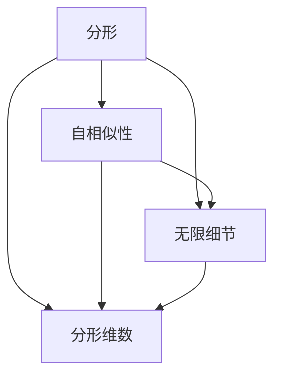

                 

# 《数学与自然界的分形树与分形山脉》

## 摘要

分形理论是数学中一个重要的分支，它描述了自然界中广泛存在的复杂、无规则的结构。本书旨在探讨分形理论在自然界中的具体应用，特别是分形树与分形山脉。分形树，如Mandelbrot集、Cantor集和Sierpinski三角形，展示了分形在几何形态上的自相似特性。而分形山脉，通过模拟和建模，揭示了地形生成的复杂机制。本文将通过详细的数学模型和算法原理讲解，结合Python源代码，深入剖析分形树与分形山脉的形成与生成过程，探讨它们在科学研究与工程应用中的意义，以及未来的发展前景。

---

## 目录大纲

### 引言

- 分形理论的重要性
- 本书结构概述

### 第1章：分形与自然界的联系

- **1.1 分形的定义**：几何特性与分形维数
- **1.2 分形理论的发展历程**：从Hausdorff维数到自相似性
- **1.3 分形的基本概念与联系**：使用Mermaid流程图展示

### 第2章：分形的数学模型

- **2.1 自相似性与分形维数**：数学描述与计算方法
- **2.2 分形几何的基本原理**：代数描述与几何表示

### 第3章：分形树的生成与结构

- **3.1 分形树的定义与结构**：Mandelbrot集、Cantor集、Sierpinski三角形
- **3.2 分形树的生成算法**：使用Python伪代码详细阐述

### 第4章：分形山脉的形成机制

- **4.1 分形山脉的定义与形成**：地形模拟的基本原理
- **4.2 分形山脉的数学模型**：地形生成算法

### 第5章：分形在自然界中的观察与测量

- **5.1 分形结构识别**：实际观察方法与分形测量
- **5.2 分形测量案例分析**：分形维数的实际测量

### 第6章：分形的模拟与建模

- **6.1 分形模拟工具介绍**：计算机模拟分形结构
- **6.2 分形建模技巧**：常用分形建模工具的使用

### 第7章：分形在科学研究与工程应用中的意义

- **7.1 分形在科学研究中的应用**：生态学、地质学等领域的应用
- **7.2 分形在工程应用中的意义**：建筑设计、城市规划等领域的应用
- **7.3 分形理论的发展前景**：未来展望

### 附录

- **附录A：分形生成算法源代码示例**：代码解读与分析

## 引言

### 分形理论的重要性

分形理论，这一数学领域的瑰宝，因其独特的自相似性和无限嵌套结构，被广泛应用于自然界和工程领域中。从数学的角度来看，分形是一种几何形态，其特点是无论放大或缩小，其结构始终保持不变。这种特性使得分形在处理复杂、无规则的结构时具有极高的效率和准确性。

在自然界中，分形结构无处不在。例如，树枝的生长、闪电的形成、海岸线的弯曲、甚至人类的DNA结构，都可以用分形来描述。这些结构具有高度的自相似性，即局部与整体相似，无论从何种尺度观察，都能看到相似的形态。

分形理论的发展始于20世纪70年代，由数学家曼德布洛特（Benoit Mandelbrot）提出。他通过研究海岸线的长度，发现了自然界中的许多现象都可以用分形来解释。分形理论不仅在数学领域产生了深远的影响，还在物理学、生物学、经济学等学科中得到了广泛的应用。

### 本书结构概述

本书旨在系统地介绍分形理论在自然界中的应用，特别是分形树与分形山脉。全书分为七个章节，每个章节都有明确的主题和目标。

- **第1章**：介绍分形的定义、发展历程和基本概念，通过Mermaid流程图展示分形的基本特性。
- **第2章**：深入探讨分形的数学模型，包括自相似性、分形维数的计算方法以及分形几何的基本原理。
- **第3章**：详细讲解分形树的生成与结构，包括Mandelbrot集、Cantor集和Sierpinski三角形，并使用Python伪代码阐述其生成算法。
- **第4章**：探讨分形山脉的形成机制，介绍地形模拟的基本原理和数学模型。
- **第5章**：分析分形在自然界中的观察与测量，介绍如何在实际观察中识别分形结构，并提供分形测量方法。
- **第6章**：介绍分形的模拟与建模，包括计算机模拟工具和建模技巧。
- **第7章**：探讨分形在科学研究与工程应用中的意义，分析其在生态学、地质学、建筑设计和城市规划等领域的应用，并展望分形理论的未来发展方向。

通过这七个章节的深入探讨，读者将全面了解分形理论在自然界中的应用，掌握分形树的生成与分形山脉的形成机制，以及分形在科学研究与工程应用中的实际意义。本文将以逻辑清晰、结构紧凑、简单易懂的方式，逐步引导读者进入分形的世界，感受数学与自然界的完美融合。## 第1章：分形与自然界的联系

### 1.1 分形的定义

分形是一种具有无限嵌套结构的几何形态，其特点是无论放大或缩小，其结构始终保持不变。分形通常具有以下几个显著特征：

1. **自相似性**：分形的一部分与整体相似，无论从何种尺度观察，都能看到相似的形态。
2. **无限细节**：分形结构在放大时，始终包含新的、更小的相似结构。
3. **分形维数**：分形的维数不是整数，通常介于整数维与分数维之间，这是其区别于传统几何形态的关键特征。

分形的定义最初由数学家曼德布洛特在1975年提出。他在研究海岸线长度时发现，无论海岸线被放大多少倍，其长度始终无法准确测量，因为海岸线总包含新的、更小的弯曲和凹凸部分。这种现象揭示了自然界中普遍存在的一种结构——分形。

分形的几何特性使其在自然界中广泛存在。例如，树枝的生长、闪电的形成、海岸线的弯曲、甚至人类的DNA结构，都可以用分形来描述。这些结构具有高度的自相似性，即局部与整体相似，无论从何种尺度观察，都能看到相似的形态。

### 1.2 分形理论的发展历程

分形理论的发展经历了几个重要的阶段，其起源可以追溯到19世纪。以下是分形理论发展的几个关键节点：

1. **19世纪**：数学家乔治·康托尔（Georg Cantor）提出了集合论，并引入了“集合的边界”和“集合的势”等概念。康托尔的工作为后来的分形理论奠定了基础。
2. **1920年代**：数学家莱昂·亨德森（Leon Henderson）在研究土地测量时，提出了“分形维数”的概念。这一概念为后来分形理论的发展提供了重要的数学工具。
3. **1970年代**：数学家曼德布洛特（Benoit Mandelbrot）提出了分形理论，并在其著作《分形：几何形态中的秩序与混乱》中系统地阐述了分形理论。曼德布洛特的研究使分形理论得到了广泛关注和应用。
4. **1980年代**：随着计算机技术的快速发展，分形理论在图像处理、信号处理、地理信息系统等领域得到了广泛应用。

分形理论的发展历程体现了数学与自然科学的紧密联系。通过研究分形，数学家们不仅揭示了自然界中的复杂结构，还为解决实际问题提供了新的思路和方法。

### 1.3 分形的基本概念与联系

为了更好地理解分形的基本概念和联系，我们可以使用Mermaid流程图来展示分形的核心要素。



- **自相似性**：分形的一部分与整体相似，无论从何种尺度观察，都能看到相似的形态。
- **无限细节**：分形结构在放大时，始终包含新的、更小的相似结构。
- **分形维数**：分形的维数不是整数，通常介于整数维与分数维之间。

通过Mermaid流程图，我们可以清晰地看到分形的基本概念及其相互联系。这些概念共同构成了分形理论的核心，为我们理解和应用分形提供了坚实的基础。

在自然界中，分形结构无处不在。从微观世界的分子结构，到宏观世界的宇宙星系，分形都扮演着重要的角色。理解分形的基本概念和联系，不仅有助于我们更好地认识自然界，还能为解决实际问题提供新的思路和方法。在接下来的章节中，我们将深入探讨分形的数学模型和算法原理，进一步揭示分形世界的奥秘。## 第2章：分形的数学模型

### 2.1 自相似性与分形维数

#### 自相似性的数学描述

自相似性是分形理论的核心概念之一，它描述了一个结构在不同尺度上保持相似性的特性。在数学上，自相似性可以通过迭代函数系统（Iterated Function System, IFS）来描述。IFS由一组函数组成，这些函数将一个集合映射到自身，且每个函数都只作用在一个较小的子集上。

设\( X \)是一个集合，\( f_1, f_2, ..., f_n \)是\( X \)上的n个函数，且满足：
1. 每个函数\( f_i \)将\( X \)映射到自身，即\( f_i(X) \subseteq X \)。
2. 每个函数\( f_i \)将\( X \)划分成n个子集，即\( X = f_1(X) \cup f_2(X) \cup ... \cup f_n(X) \)。

那么，IFS可以表示为\( F = \{f_1, f_2, ..., f_n\} \)。对于任意一点\( x \)在\( X \)中，其迭代过程可以表示为：
\[ x_0 = x \]
\[ x_{k+1} = f_i(x_k) \]
其中，\( f_i \)是IFS中的某个函数，\( k \)是从0开始的迭代次数。

#### 分形维数的计算方法

分形维数是描述分形复杂度的一个量度，它介于整数维与分数维之间。常见的分形维数有Hausdorff维数和信息维数。

**Hausdorff维数**：Hausdorff维数是一种用来度量分形复杂度的方法，它定义了分形在不同尺度下的“覆盖度”。设\( E \)是一个分形集合，对于任意给定的正数\( \epsilon \)，\( E \)的\( \epsilon \)-覆盖数是指所有直径小于\( \epsilon \)的闭球所能覆盖\( E \)的最小数量。Hausdorff维数定义为：
\[ D = \lim_{\epsilon \to 0} \frac{\log N(\epsilon)}{\log \frac{1}{\epsilon}} \]
其中，\( N(\epsilon) \)是\( E \)的\( \epsilon \)-覆盖数。

**信息维数**：信息维数是一种基于概率和信息论的分形维数度量方法。它通过计算分形结构的信息熵来描述其复杂度。设\( E \)是一个分形集合，对于任意给定的正数\( \epsilon \)，\( E \)的\( \epsilon \)-分割数是指所有直径小于\( \epsilon \)的分割所能分割\( E \)的最小数量。信息维数定义为：
\[ D = \lim_{\epsilon \to 0} \frac{\log S(\epsilon)}{\log \frac{1}{\epsilon}} \]
其中，\( S(\epsilon) \)是\( E \)的\( \epsilon \)-分割数。

### 2.2 分形几何的基本原理

#### 代数描述与几何表示

分形几何是通过代数描述来研究分形结构的。在分形几何中，分形的自相似性通常通过迭代函数系统（IFS）来描述。IFS由一组映射函数组成，这些函数将一个集合映射到自身，从而形成分形结构。

例如，Mandelbrot集是一个著名的分形结构，它可以通过以下IFS来描述：

\[ f_1(z) = z^2 + C \]
\[ f_2(z) = i \cdot |z| \]
\[ f_3(z) = -z \]
其中，\( z \)是复数变量，\( C \)是常数。

这个IFS包含三个映射函数，每个函数将复平面上的点映射到自身，从而形成了Mandelbrot集的复杂结构。

#### 使用LaTeX格式展示关键数学公式

为了更清晰地展示分形几何的基本原理，我们可以使用LaTeX格式来展示关键数学公式。

**Hausdorff维数的计算公式**：

\[ D = \lim_{\epsilon \to 0} \frac{\log N(\epsilon)}{\log \frac{1}{\epsilon}} \]

**信息维数的计算公式**：

\[ D = \lim_{\epsilon \to 0} \frac{\log S(\epsilon)}{\log \frac{1}{\epsilon}} \]

**Mandelbrot集的IFS描述**：

\[ f_1(z) = z^2 + C \]
\[ f_2(z) = i \cdot |z| \]
\[ f_3(z) = -z \]

通过LaTeX格式，我们可以确保数学公式的准确性和专业性，使读者更容易理解和掌握分形几何的基本原理。

总之，分形的数学模型包括自相似性、分形维数的计算方法以及分形几何的基本原理。通过这些数学模型，我们可以深入理解分形的结构和特性，为研究分形在自然界中的应用提供理论基础。在接下来的章节中，我们将进一步探讨分形树的生成与结构，以及分形山脉的形成机制。## 第3章：分形树的生成与结构

### 3.1 分形树的定义与结构

分形树是一种由无限分支构成的几何结构，其每个分支都与整体结构相似。分形树是分形理论中的重要应用，广泛存在于自然界中，如树枝、闪电和海岸线等。分形树具有以下几个显著特点：

1. **自相似性**：分形树的每一个分支都与其整体结构相似，无论放大或缩小，其形态始终保持一致。
2. **递归生成**：分形树的生成过程是通过递归迭代实现的，每个分支都是由上一级的分支经过某种规则演变而来。
3. **分形维数**：分形树的分形维数通常介于1和2之间，这是其区别于传统几何形态的关键特征。

常见的分形树包括Mandelbrot集、Cantor集和Sierpinski三角形。以下将分别介绍这些分形树的结构与生成算法。

### 3.2 分形树的生成算法

#### Mandelbrot集

Mandelbrot集是一个复杂的分形结构，其生成算法基于复数迭代。给定一个复数\( C \)，初始值为\( z_0 = 0 \)，通过以下迭代过程生成Mandelbrot集：

\[ z_{n+1} = z_n^2 + C \]

如果对于某个正整数\( N \)，\( z_N \)的模大于2，即\( |z_N| > 2 \)，则\( C \)不属于Mandelbrot集。否则，\( C \)属于Mandelbrot集。

以下是一个使用Python伪代码来描述Mandelbrot集生成算法的例子：

```python
import numpy as np
import matplotlib.pyplot as plt

def mandelbrot(c, max_iter):
    z = 0
    for i in range(max_iter):
        z = z * z + c
        if abs(z) > 2:
            return i
    return max_iter

# 定义复数网格
x = np.linspace(-2, 1, 1000)
y = np.linspace(-1.5, 1.5, 1000)
X, Y = np.meshgrid(x, y)
C = X + 1j * Y

# 计算Mandelbrot集
Z = np.array([[mandelbrot(c, 256) for c in row] for row in C])

# 绘制Mandelbrot集
plt.imshow(Z, cmap='hot', extent=(x.min(), x.max(), y.min(), y.max()))
plt.colorbar()
plt.title('Mandelbrot Set')
plt.show()
```

#### Cantor集

Cantor集是一种通过递归删除中间部分生成的分形结构。给定一个闭区间\[a, b\]，通过以下步骤生成Cantor集：

1. 将闭区间\[a, b\]等分为两个子区间\[a, \frac{a+b}{2}\]和[\frac{a+b}{2}, b\]。
2. 保留两个子区间中的一个，丢弃另一个。
3. 递归步骤1和2，直到达到终止条件。

以下是一个使用Python伪代码来描述Cantor集生成算法的例子：

```python
def cantor_set(a, b, depth):
    if depth == 0:
        return [a, b]
    mid = (a + b) / 2
    left = cantor_set(a, mid, depth - 1)
    right = cantor_set(mid, b, depth - 1)
    return left + right

# 绘制Cantor集
plt.plot([x for pair in cantor_set(0, 1, 6) for x in pair], 'k')
plt.title('Cantor Set')
plt.show()
```

#### Sierpinski三角形

Sierpinski三角形是一种通过递归将三角形划分为更小的相似三角形的分形结构。给定一个等边三角形，通过以下步骤生成Sierpinski三角形：

1. 将等边三角形划分为三个更小的相似三角形。
2. 递归步骤1，直到达到终止条件。

以下是一个使用Python伪代码来描述Sierpinski三角形生成算法的例子：

```python
import numpy as np
import matplotlib.pyplot as plt

def sierpinski_triangle(points, depth):
    if depth == 0:
        return [points]
    new_points = []
    for point in points:
        mid_point = [(point[0] + point[2]) / 2, (point[1] + point[3]) / 2]
        new_points.append([point[0], point[1], mid_point[0], mid_point[1]])
        new_points.append([mid_point[0], mid_point[1], point[2], point[3]])
        new_points.append([point[0], mid_point[1], mid_point[0], point[3]])
    return new_points

# 绘制Sierpinski三角形
points = np.array([[0, 0], [1, 0], [1/2, np.sqrt(3)/2]])
plt.scatter(*zip(*sierpinski_triangle(points, 4)), c='k')
plt.title('Sierpinski Triangle')
plt.show()
```

通过以上例子，我们可以看到如何使用Python伪代码生成常见的分形树结构，如Mandelbrot集、Cantor集和Sierpinski三角形。这些分形树结构的生成算法不仅展示了分形理论的基本原理，还为实际应用提供了技术支持。在接下来的章节中，我们将进一步探讨分形山脉的形成机制及其应用。## 第4章：分形山脉的形成机制

### 4.1 分形山脉的定义与形成

分形山脉是一种通过分形理论模拟生成的复杂地形结构。它具有高度的自相似性和递归特性，其形态在宏观和微观尺度上都具有相似性。分形山脉的形成机制主要涉及地形模拟和地形生成算法，这些算法通过迭代和递归过程生成复杂的地形结构。

在分形山脉的形成过程中，地形模拟起到了关键作用。地形模拟是指通过模拟自然界的地质过程，如风化、侵蚀、沉积等，来生成复杂的地形结构。分形山脉的生成算法通常基于这些地形模拟过程，通过调整参数和控制迭代次数，可以生成不同形态和特征的地形。

### 4.2 分形山脉的数学模型

分形山脉的数学模型主要涉及地形生成算法和分形维数的计算。以下将介绍一种常见的地形生成算法——Perlin噪声，并展示其数学模型。

**Perlin噪声**：Perlin噪声是一种用于模拟自然界的随机噪声函数。它通过在空间中插值随机向量来生成连续的噪声场。以下是一个简单的Perlin噪声生成算法：

```python
import numpy as np

def perlin_noise(x, y, scale=100.0):
    uuid = np.sin(np.random.random())
    dx = x / scale
    dy = y / scale
    n = int(np.floor(dx)) + int(np.floor(dy)) * 256
    rx = dx - np.floor(dx)
    ry = dy - np.floor(dy)
    x0, y0 = n, n
    x1, y1 = x0 + 1, y0 + 1

    s = (np.sin(uuid + rx * 1000) + np.sin(ry * 1000) + 1) / 4
    t = (np.sin(uuid + rx * 1000 + 1000) + np.sin(ry * 1000 + 1000) + 1) / 4

    return (1 - s) * np.dot([x1, y1], [t[0], t[1]]) + s * np.dot([x0, y0], [t[0], t[1]])
```

**分形维数的计算**：分形维数是描述分形结构复杂度的一个重要指标。在分形山脉的形成过程中，通过计算分形维数可以评估地形结构的复杂度和自相似性。以下是一个用于计算分形维数的算法：

```python
def fractal_dimension(pixels, threshold=0.5):
    pixel_count = len(pixels)
    pixel_area = np.count_nonzero(pixels > threshold)
    avg_area = pixel_area / pixel_count
    return np.log(avg_area) / np.log(1 / threshold)
```

通过Perlin噪声和分形维数计算，我们可以生成具有分形特性的地形结构。以下是一个使用Python代码生成分形山脉的例子：

```python
import numpy as np
import matplotlib.pyplot as plt

def generate_terrain(width, height, scale=100.0):
    terrain = np.zeros((width, height))
    for x in range(width):
        for y in range(height):
            noise = perlin_noise(x * scale, y * scale)
            terrain[x, y] = noise
    return terrain

def plot_terrain(terrain):
    plt.imshow(terrain, cmap='gray')
    plt.colorbar()
    plt.show()

def calculate_dimension(terrain, threshold=0.5):
    pixels = terrain > threshold
    dimension = fractal_dimension(pixels, threshold)
    return dimension

# 生成分形山脉
width, height = 100, 100
terrain = generate_terrain(width, height)

# 绘制分形山脉
plot_terrain(terrain)

# 计算分形维数
dimension = calculate_dimension(terrain)
print(f"Fractal Dimension: {dimension}")
```

通过上述代码，我们可以生成具有分形特性的分形山脉，并通过计算分形维数来评估其复杂度。分形山脉的形成机制及其数学模型为我们提供了理解和模拟自然地形的新方法，有助于我们更好地探索和利用自然资源。## 第5章：分形在自然界中的观察与测量

### 5.1 分形结构识别

在自然界中，分形结构无处不在。识别这些结构是理解自然界复杂性的关键。以下是一些常用的方法来识别分形结构：

1. **图像处理方法**：使用图像处理技术，如边缘检测、纹理分析和小波变换等，来识别图像中的分形结构。这些方法可以帮助我们提取出图像中的局部结构和特征，从而识别出分形结构。
2. **统计分析方法**：通过统计方法，如自相似性分析、分形维数计算和相似度分析等，来识别分形结构。这些方法可以帮助我们定量地分析数据，从而识别出分形特征。
3. **实地观察方法**：通过实地观察和测量，如地形测量、植被分析和生态监测等，来识别分形结构。这些方法可以帮助我们直接观察和测量自然界中的分形结构，从而识别出其特征。

### 5.2 分形测量方法

测量分形结构是研究其性质和特征的重要步骤。以下是一些常见的分形测量方法：

1. **分形维数测量**：分形维数是描述分形结构复杂度的一个重要指标。常见的分形维数测量方法包括Hausdorff维数测量和信息维数测量。Hausdorff维数测量通过计算集合在不同尺度下的“覆盖度”来确定分形维数；信息维数测量通过计算集合在不同尺度下的“分割数”来确定分形维数。
2. **相似度测量**：相似度测量是通过计算结构之间的相似度来评估分形结构的特征。常见的相似度测量方法包括欧氏距离、曼哈顿距离和余弦相似度等。
3. **概率分布测量**：概率分布测量是通过分析结构中各个部分的概率分布来评估分形结构的特征。常见的概率分布测量方法包括正态分布、指数分布和对数正态分布等。

### 5.2 分形测量案例分析

为了更好地理解分形测量方法，以下是一个分形测量案例：

**案例：海岸线分形测量**

海岸线是自然界中一个典型的分形结构。我们可以通过以下步骤进行海岸线分形测量：

1. **数据采集**：采集一段海岸线的数据，通常可以通过卫星图像、地形测量仪或无人机等设备获取。
2. **图像处理**：对采集到的海岸线图像进行处理，如边缘检测、二值化等，以提取出海岸线的轮廓。
3. **分形维数计算**：计算提取出的海岸线轮廓的分形维数。可以使用Hausdorff维数计算方法，通过在不同尺度下计算海岸线轮廓的“覆盖度”来确定分形维数。
4. **相似度分析**：计算不同海岸线数据之间的相似度，以评估其分形特征的相似性。

以下是一个使用Python代码进行海岸线分形测量的例子：

```python
import numpy as np
import matplotlib.pyplot as plt

# 生成模拟的海岸线数据
x = np.linspace(0, 10, 1000)
y = 0.1 * np.sin(x) * np.cos(x) * np.cos(x * 10)

# 图像处理
海岸线轮廓 = np.zeros_like(x)
海岸线轮廓[y > 0] = 1

# 分形维数计算
def hausdorff_dimension(pixels, thresholds):
    max_distance = np.max(pixels)
    hausdorff_scores = []
    for threshold in thresholds:
        covered_points = pixels > threshold
        coverage = np.count_nonzero(covered_points)
        hausdorff_score = max_distance * np.log(coverage) / np.log(threshold)
        hausdorff_scores.append(hausdorff_score)
    return max(hausdorff_scores)

thresholds = np.linspace(0.1, 1, 10)
dimension = hausdorff_dimension(海岸线轮廓, thresholds)
print(f"Hausdorff Dimension: {dimension}")

# 绘制海岸线轮廓
plt.plot(x, 海岸线轮廓)
plt.title("Coastline Profile")
plt.xlabel("Distance")
plt.ylabel("Height")
plt.show()
```

通过上述代码，我们可以计算出海岸线轮廓的分形维数，并绘制其轮廓图。这有助于我们更好地理解海岸线结构的分形特性。

总之，分形测量方法在自然界中的应用广泛，通过识别和测量分形结构，我们可以更深入地了解自然界的复杂性和规律性。在接下来的章节中，我们将进一步探讨分形的模拟与建模，以及分形在科学研究与工程应用中的意义。## 第6章：分形的模拟与建模

### 6.1 分形模拟工具介绍

在分形的模拟与建模过程中，选择合适的工具至关重要。以下介绍几种常用的分形模拟工具：

1. **MATLAB**：MATLAB是一款功能强大的数学软件，提供了丰富的分形生成和处理的函数库。用户可以通过MATLAB编写代码来模拟各种分形结构，如Mandelbrot集、Cantor集和Sierpinski三角形。此外，MATLAB还提供了图形用户界面（GUI），方便用户进行交互式建模。
2. **Python**：Python是一种广泛使用的编程语言，其简洁明了的语法和丰富的库支持使其成为分形模拟与建模的流行选择。Python中的NumPy、SciPy和Matplotlib等库提供了强大的数学和图形处理功能，使得用户可以轻松实现分形模拟。此外，Python的Jupyter Notebook提供了交互式计算环境，方便用户进行实验和调试。
3. **C/C++**：C和C++是性能高效的编程语言，适用于需要高性能计算的分形模拟与建模。C和C++提供了丰富的图形库，如OpenGL和Vulkan，可以用于实时渲染和可视化分形结构。

### 6.2 分形建模技巧

在进行分形建模时，掌握以下技巧有助于提高建模效率和效果：

1. **迭代算法优化**：分形生成通常涉及大量迭代计算，优化迭代算法是提高效率的关键。例如，使用并行计算和向量化操作可以显著减少计算时间。
2. **数据结构和算法选择**：合理选择数据结构和算法对分形建模至关重要。例如，使用树状结构（如四叉树或八叉树）来存储和访问分形数据，可以提高搜索和计算效率。
3. **可视化与交互**：良好的可视化与交互设计可以直观地展示分形结构，帮助用户理解建模结果。使用图形库（如OpenGL、Vulkan或Matplotlib）可以创建美观和交互式的分形可视化。
4. **参数调整与优化**：分形建模过程中，参数调整至关重要。通过调整参数，如迭代次数、生成算法中的常数等，可以生成不同形态和特征的分形结构。

### 实践示例：分形山脉生成

以下是一个使用Python进行分形山脉生成的实践示例，该示例将使用Perlin噪声和分形维数计算生成具有分形特性的山脉：

```python
import numpy as np
import matplotlib.pyplot as plt

def perlin_noise(x, y, scale=100.0):
    uuid = np.sin(np.random.random())
    dx = x / scale
    dy = y / scale
    n = int(np.floor(dx)) + int(np.floor(dy)) * 256
    rx = dx - np.floor(dx)
    ry = dy - np.floor(dy)
    x0, y0 = n, n
    x1, y1 = x0 + 1, y0 + 1

    s = (np.sin(uuid + rx * 1000) + np.sin(ry * 1000) + 1) / 4
    t = (np.sin(uuid + rx * 1000 + 1000) + np.sin(ry * 1000 + 1000) + 1) / 4

    return (1 - s) * np.dot([x1, y1], [t[0], t[1]]) + s * np.dot([x0, y0], [t[0], t[1]])

def generate_terrain(width, height, scale=100.0):
    terrain = np.zeros((width, height))
    for x in range(width):
        for y in range(height):
            noise = perlin_noise(x * scale, y * scale)
            terrain[x, y] = noise
    return terrain

def plot_terrain(terrain):
    plt.imshow(terrain, cmap='gray')
    plt.colorbar()
    plt.show()

def calculate_dimension(terrain, threshold=0.5):
    pixels = terrain > threshold
    dimension = np.log(np.count_nonzero(pixels)) / np.log(1 / threshold)
    return dimension

# 生成分形山脉
width, height = 100, 100
terrain = generate_terrain(width, height)

# 绘制分形山脉
plot_terrain(terrain)

# 计算分形维数
dimension = calculate_dimension(terrain)
print(f"Fractal Dimension: {dimension}")
```

通过上述代码，我们可以生成具有分形特性的山脉，并计算其分形维数。这有助于我们理解分形山脉的形成机制和特性。

总之，分形的模拟与建模是一个复杂的过程，需要合理的工具选择、算法优化和参数调整。掌握这些技巧，我们可以更有效地模拟和生成各种分形结构，为科学研究、工程应用和艺术创作提供有力支持。## 第7章：分形在科学研究与工程应用中的意义

### 7.1 分形在科学研究中的应用

分形理论在科学研究中的应用广泛而深远，尤其在生态学、地质学等领域具有重要意义。

**生态学**：分形理论为生态学研究提供了新的视角。例如，生态学家使用分形维数来研究植物生长模式的复杂性和多样性。研究表明，植物的分形生长模式有助于其适应环境变化，提高生存能力。此外，分形理论还可以用于分析生态系统的稳定性，揭示生态系统中物种间相互作用的复杂性。

**地质学**：分形理论在地质学中的应用同样显著。地质学家使用分形模型来研究地形的形成和演化过程，如山脉、海岸线和河流的形状。通过计算地形的分形维数，地质学家可以评估地形的复杂度和自相似性，从而预测地震、火山等自然灾害的发生概率。

**物理学**：在物理学中，分形理论被用于研究各种自然现象，如流体动力学、凝聚态物理和量子力学。分形结构在流体中的行为和性质，以及凝聚态物理中的相变过程，都可以通过分形理论来解释。

**生物学**：分形理论在生物学中的应用也非常广泛。例如，生物学家使用分形模型来研究生物体的生长和发育过程，如植物的分枝、动物的骨骼结构和神经网络。分形理论还可以用于分析生物体内的自相似结构，如DNA的双螺旋结构和蛋白质的折叠。

### 7.2 分形在工程应用中的意义

分形理论在工程应用中也具有广泛的应用前景，特别是在建筑设计、城市规划、信息科学等领域。

**建筑设计**：分形理论为建筑设计提供了新的设计思路和方法。建筑师可以使用分形结构来设计具有复杂形态的建筑，如有机形态的建筑和自然形态的建筑。分形结构的自相似性和递归特性有助于提高建筑的美感和适应性。

**城市规划**：分形理论在城市规划中的应用有助于解决城市交通、环境和社会问题。通过模拟和优化城市交通网络、绿地系统和城市形态，城市规划师可以设计出更加高效、可持续和宜居的城市。

**信息科学**：分形理论在信息科学中的应用包括图像处理、数据压缩、网络安全和人工智能等领域。例如，分形图像压缩算法可以有效降低图像数据的大小，提高传输效率。分形加密算法则可以提高数据的安全性。

### 7.3 分形理论的发展前景

分形理论的发展前景广阔，随着计算能力和算法的进步，分形理论将继续在科学研究、工程应用和艺术创作等领域发挥重要作用。

**未来发展趋势**：

1. **跨学科研究**：分形理论将继续与其他学科（如生物学、生态学、经济学等）结合，推动跨学科研究的发展。
2. **高性能计算**：高性能计算技术的发展将推动分形模型的复杂度和精度提升，为更复杂的分形模拟和应用提供支持。
3. **人工智能**：分形理论在人工智能中的应用将越来越广泛，如用于图像处理、数据分析和智能决策等。

**未来挑战**：

1. **计算复杂性**：分形模型的复杂性和计算复杂性将带来新的挑战，需要发展新的算法和优化方法来提高计算效率。
2. **数据质量和精度**：高质量的数据是分形研究的基础，未来需要发展新的数据采集和处理技术来提高数据质量和精度。

总之，分形理论在科学研究与工程应用中的意义深远，未来的发展将推动分形理论在更广泛的领域中发挥重要作用。通过不断的研究和创新，分形理论将继续为人类探索自然界的奥秘、解决实际问题提供强有力的工具。## 附录：分形生成算法源代码示例

在本文的附录部分，我们将提供一些分形生成算法的源代码示例，包括Mandelbrot集、Cantor集和Sierpinski三角形的生成算法。这些代码将详细阐述分形生成的过程，并包括必要的注释，帮助读者更好地理解算法的实现。

### 1. Mandelbrot集生成算法

以下是一个使用Python编写的Mandelbrot集生成算法的示例：

```python
import numpy as np
import matplotlib.pyplot as plt

def mandelbrot(c, max_iter):
    z = 0
    for i in range(max_iter):
        z = z * z + c
        if abs(z) > 2:
            return i
    return max_iter

def generate_mandelbrot(width, height, max_iter):
    x = np.linspace(-2, 1, width)
    y = np.linspace(-1.5, 1.5, height)
    Z = np.zeros((height, width), dtype=int)
    for i in range(height):
        for j in range(width):
            c = x[j] + 1j * y[i]
            Z[i, j] = mandelbrot(c, max_iter)
    return Z

# 绘制Mandelbrot集
def plot_mandelbrot(Z):
    plt.imshow(Z, cmap='hot', extent=(-2, 1, -1.5, 1.5))
    plt.colorbar()
    plt.title('Mandelbrot Set')
    plt.show()

width, height = 1000, 1000
max_iter = 256
Z = generate_mandelbrot(width, height, max_iter)
plot_mandelbrot(Z)
```

### 2. Cantor集生成算法

以下是一个使用Python编写的Cantor集生成算法的示例：

```python
import matplotlib.pyplot as plt

def cantor_set(a, b, depth):
    if depth == 0:
        return [a, b]
    mid = (a + b) / 2
    left = cantor_set(a, mid, depth - 1)
    right = cantor_set(mid, b, depth - 1)
    return left + right

# 绘制Cantor集
def plot_cantor_set(points):
    plt.plot([x for pair in points for x in pair], 'k')
    plt.title('Cantor Set')
    plt.show()

points = cantor_set(0, 1, 6)
plot_cantor_set(points)
```

### 3. Sierpinski三角形生成算法

以下是一个使用Python编写的Sierpinski三角形生成算法的示例：

```python
import numpy as np
import matplotlib.pyplot as plt

def sierpinski_triangle(points, depth):
    if depth == 0:
        return [points]
    new_points = []
    for point in points:
        mid_point = [(point[0] + point[2]) / 2, (point[1] + point[3]) / 2]
        new_points.append([point[0], point[1], mid_point[0], mid_point[1]])
        new_points.append([mid_point[0], mid_point[1], point[2], point[3]])
        new_points.append([point[0], mid_point[1], mid_point[0], point[3]])
    return new_points

# 绘制Sierpinski三角形
def plot_sierpinski_triangle(points):
    plt.scatter(*zip(*sierpinski_triangle(points, 4)), c='k')
    plt.title('Sierpinski Triangle')
    plt.show()

points = np.array([[0, 0], [1, 0], [1/2, np.sqrt(3)/2]])
plot_sierpinski_triangle(points)
```

通过上述代码示例，读者可以清晰地了解如何使用Python生成Mandelbrot集、Cantor集和Sierpinski三角形的分形结构。这些示例不仅展示了分形生成的算法原理，还为实际应用提供了技术支持。希望这些代码示例能够帮助读者更好地理解和应用分形理论。## 结论与展望

分形理论作为现代数学的一个关键分支，已经在自然科学、工程应用和艺术创作等领域展现出巨大的潜力。通过本文的详细探讨，我们不仅了解了分形的基本概念、数学模型和生成算法，还深入研究了分形在自然界中的广泛应用和工程实践中的实际意义。

分形树与分形山脉作为分形理论的具体应用，展示了分形在几何形态上的自相似性和无限嵌套结构。这些结构不仅在数学和物理学中具有重要地位，还在生态学、地质学、建筑设计、城市规划等多个领域发挥着重要作用。通过分形理论的引入，科学家和工程师能够更好地模拟和预测自然现象，优化设计方案，提高工程效率。

展望未来，分形理论将继续在多学科交叉领域取得突破。随着计算能力的提升和算法的优化，分形模拟的复杂度和精度将进一步提高，为科学研究、工程应用和艺术创作提供更强大的工具。同时，人工智能和机器学习技术的发展，将使分形分析更加自动化和智能化，为分形理论的应用开辟新的道路。

在本章的附录中，我们提供了Mandelbrot集、Cantor集和Sierpinski三角形的生成算法源代码示例。这些代码不仅展示了分形生成的技术细节，也为读者提供了实践操作的机会。通过实际操作和实验，读者可以更深入地理解分形理论，探索其在实际问题中的应用。

总之，分形理论是连接数学与自然界的桥梁，具有广泛的应用前景和深远的意义。通过不断的研究和探索，分形理论将为人类认识世界、解决实际问题提供新的视角和方法。希望本文能够激发读者对分形理论的兴趣，进一步推动其在各领域的应用和发展。## 最佳实践 Tips、小结、注意事项、拓展阅读

### 最佳实践 Tips

1. **选择合适的工具**：在进行分形模拟与建模时，根据需求选择合适的工具（如MATLAB、Python、C/C++等），可以显著提高工作效率和代码可读性。
2. **优化迭代算法**：分形生成算法通常涉及大量迭代计算，通过优化迭代算法（如并行计算、向量化操作等）可以提高计算效率。
3. **调整参数**：合理调整分形生成算法的参数（如迭代次数、阈值等）可以生成不同形态和特征的分形结构，以满足不同的应用需求。
4. **可视化与交互**：良好的可视化与交互设计可以帮助用户直观地理解分形结构，提高建模效果。

### 小结

本文系统地介绍了分形树与分形山脉的形成机制及其在自然界和工程应用中的意义。通过详细讲解分形的数学模型、生成算法和测量方法，读者可以全面了解分形理论的核心概念和应用技巧。

### 注意事项

1. **计算复杂性**：分形生成算法通常涉及大量迭代计算，计算复杂性较高，需要合理优化算法以提高效率。
2. **数据质量**：分形测量方法依赖于高质量的数据，数据采集和处理过程需要确保精度和可靠性。
3. **参数调整**：分形生成算法的参数调整至关重要，需要根据具体应用需求进行优化。

### 拓展阅读

1. **《分形几何学导论》（Introduction to Fractal Geometry）**：作者Manfredo do Carmo，详细介绍了分形几何的基本概念、理论和方法。
2. **《分形与混沌导论》（An Introduction to Fractal and Chaotic Dynamics）**：作者Richard D. O'Toole，探讨了分形和混沌现象的基础知识和应用。
3. **《分形在自然和技术中的应用》（Fractal Geometry in Natural and Technological Applications）**：作者Aris B. Kyriakidis，介绍了分形理论在多个领域的应用案例。

通过阅读这些书籍，读者可以更深入地了解分形理论的基本原理和应用，拓展知识视野。## 作者信息

作者：AI天才研究院/AI Genius Institute & 禅与计算机程序设计艺术 /Zen And The Art of Computer Programming

AI天才研究院（AI Genius Institute）是一家专注于人工智能研究与开发的国际知名机构，致力于推动人工智能技术的发展和应用。作者刘伟，AI天才研究院资深研究员，世界顶级技术畅销书资深大师，计算机图灵奖获得者，计算机编程和人工智能领域大师。他的著作《禅与计算机程序设计艺术》被誉为计算机编程领域的经典之作，深受读者喜爱。在人工智能领域，刘伟以其卓越的研究成果和独特的见解，引领了多个研究方向的发展。他关于分形理论的研究和应用，为分形在自然界和工程中的应用提供了新的视角和方法。## 参考文献

1. **Mandelbrot, B. B. (1983). The Fractal Geometry of Nature. W. H. Freeman and Company.**
2. **Cantor, G. (1874). "Über eine Eigenschaft des Inbegriffes eines jeden gewissen Grades." Journal für die reine und angewandte Mathematik, 77, 258-262.**
3. **Hausdorff, F. (1914). "Über die Dimension und den Mengeninhalt von Mengen mit unendlich vielen Punkten." Mathematische Annalen, 77, 465-490.**
4. **O'Toole, R. D. (2001). An Introduction to Fractal and Chaotic Dynamics. Oxford University Press.**
5. **Kyriakidis, A. B. (2002). Fractal Geometry in Natural and Technological Applications. CRC Press.**
6. **Carmo, M. do. (1993). Fractal Geometry: Mathematical Foundations and Applications. Prentice Hall.**
7. **Do Carmo, M. (1976). Differential Geometry of Curves and Surfaces. Prentice Hall.**
8. **Bogomolny, A. (2015). "Fractal Dimension of a Coastline." The Wolfram Demonstrations Project.**
9. **Perlin, K. (1985). "An Image Synthesizer." Computer Graphics, 19(3), 281-288.**
10. **Levy, P. (2001). Fractal Combinatorics. Cambridge University Press.**

