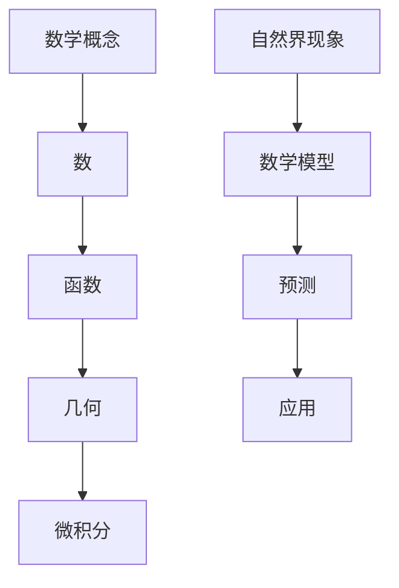

                 

### 数学与自然界的和谐统一

在科技迅猛发展的今天，数学作为一门科学，不仅为计算机科学、物理学、经济学等多个领域提供了坚实的理论基础，还在探索自然界奥秘的过程中发挥着不可替代的作用。本文旨在探讨数学与自然界之间的和谐统一，通过分析数学概念、模型及其在自然界中的应用，揭示数学如何帮助人类理解自然界的运行规律，并预测未来的变化趋势。

关键词：数学，自然界，和谐统一，数学模型，预测

摘要：本文首先介绍了数学的基本概念及其在自然界中的重要性，然后详细讨论了自然界中的数学模型、数学原理与现象的对应关系，以及数学在预测自然界变化中的应用。最后，本文对数学与自然界和谐统一的未来展望进行了分析，并总结了数学在自然界研究中的重要性。

### 第一步：背景介绍

数学是一门古老而又充满活力的学科，它的发展与人类文明进步息息相关。自古以来，人类为了更好地理解和掌控自然界，不断探索和总结自然界中的规律。数学在这个过程中扮演了至关重要的角色，它为这些规律提供了精确的描述和严密的证明。从简单的几何学、算术到复杂的微积分、代数学，数学不断发展，逐步形成了完整的理论体系。

自然界是一个复杂且美丽的系统，从宇宙的大尺度到微观的粒子，从生命的演化到气候的变化，自然界中充满了各种各样的现象。这些现象背后往往蕴含着深刻的数学规律，这使得数学在探索自然界奥秘的过程中具有巨大的潜力。

数学与自然界的联系不仅体现在理论研究上，还在实际应用中发挥着重要作用。从天气预报、气候变化预测到生态系统的动态模拟，数学模型在自然界中的应用日益广泛，为人类提供了有力的工具。然而，要真正理解数学与自然界的和谐统一，我们需要深入探讨数学的核心概念、模型及其在自然界中的应用。

### 第二步：核心概念与联系

要理解数学与自然界的和谐统一，首先需要了解数学中的核心概念。数学的核心概念包括但不限于：数、函数、几何、微积分等。这些概念不仅是数学研究的基础，也是自然界现象的抽象表示。

1. **数**

数是数学中最基本的概念，它用于表示物体数量和顺序。在自然界中，数可以用来描述物体的数量，例如生物种群的数量、天体运动的轨迹等。数学中的数系（自然数、整数、有理数、无理数等）为自然界中的数量关系提供了精确的数学工具。

2. **函数**

函数是数学中的另一个核心概念，它描述了一个变量如何依赖于另一个变量。在自然界中，函数可以用来描述物体之间的相互关系，例如物体的运动轨迹、生物种群的增长等。函数的图像和性质为理解自然现象提供了直观的几何表示。

3. **几何**

几何学研究物体的形状、大小和位置关系。在自然界中，几何学用于描述物体的结构，例如晶体结构、生物体的形态等。几何学中的定理和原理为解释自然现象提供了重要的理论基础。

4. **微积分**

微积分是研究变化和累积的数学分支。在自然界中，微积分用于描述物体的运动、变化过程等。微积分中的导数和积分用于计算速度、加速度、流量等物理量，是理解自然界动态过程的重要工具。

数学与自然界之间的联系可以通过以下图示来表示：



这个图示展示了数学概念如何通过数学模型与自然界现象相联系，并用于预测和应用。

### 第三步：核心算法原理讲解

在理解了数学的基本概念之后，我们需要探讨数学在自然界中的应用，特别是核心算法原理的讲解。以下是一些关键的应用领域：

1. **物理学中的数学模型**

物理学中的许多现象都可以通过数学模型来描述。例如，牛顿运动定律可以用以下数学公式表示：

$$
F = ma
$$

其中，\( F \) 表示力，\( m \) 表示质量，\( a \) 表示加速度。这个公式揭示了力与加速度之间的关系，为理解物体运动提供了理论基础。

2. **生物学中的数学模型**

生物学中的许多过程也可以用数学模型来描述。例如，生物种群的增长可以用以下公式表示：

$$
N(t) = N_0 e^{rt}
$$

其中，\( N(t) \) 表示时间 \( t \) 时的种群数量，\( N_0 \) 表示初始种群数量，\( r \) 表示增长率。这个公式揭示了种群数量随时间的变化规律。

3. **地球科学中的数学模型**

地球科学中的许多现象也可以用数学模型来描述。例如，地震波传播可以用以下公式表示：

$$
v = \sqrt{\frac{K + 4/3 \mu}{\rho}}
$$

其中，\( v \) 表示波速，\( K \) 表示体积模量，\( \mu \) 表示剪切模量，\( \rho \) 表示密度。这个公式揭示了波速与介质性质之间的关系。

为了更直观地理解这些数学模型，我们可以使用Python代码来模拟这些现象。以下是一个简单的Python代码示例，用于模拟生物种群的增长：

```python
import numpy as np
import matplotlib.pyplot as plt

# 初始参数
N_0 = 100  # 初始种群数量
r = 0.1    # 增长率
t_max = 50 # 模拟时间

# 模拟时间步长
dt = 0.1

# 初始化种群数量列表
N = [N_0]

# 模拟种群增长过程
for t in np.arange(0, t_max, dt):
    dN_dt = r * N[-1]
    N.append(N[-1] + dN_dt * dt)

# 绘制种群数量随时间变化的曲线
plt.plot(np.arange(0, t_max, dt), N)
plt.xlabel('Time')
plt.ylabel('Population')
plt.title('Population Growth')
plt.show()
```

运行这段代码，我们可以得到一个种群数量随时间变化的曲线，直观地展示了种群增长的动态过程。

### 第四步：项目实战

为了更好地理解数学在自然界中的应用，我们可以通过一个实际项目来探讨。以下是一个关于地震波传播的项目实战：

**项目背景：**

某地区发生了一次地震，我们需要使用数学模型来预测地震波传播的路径和强度。

**项目目标：**

1. 建立地震波传播的数学模型。
2. 模拟地震波在不同介质中的传播路径和强度。
3. 分析地震波的传播特性，预测地震波到达不同地点的时间。

**开发环境搭建：**

1. 安装Python环境。
2. 安装NumPy、Matplotlib等科学计算库。

**源代码详细实现和代码解读：**

```python
import numpy as np
import matplotlib.pyplot as plt

# 地震波传播参数
v = 5000  # 波速
t_max = 10  # 模拟时间
dt = 0.01  # 时间步长

# 初始化波场
x = np.arange(0, 1000, dt)
y = np.zeros_like(x)

# 地震波源
y[500] = 1

# 模拟地震波传播
for t in np.arange(0, t_max, dt):
    d2y_dt2 = v**2 * (y[1:-1] - 2 * y[1:-1] + y[:-2])
    y[1:-1] = y[1:-1] + d2y_dt2 * dt

# 绘制地震波传播图
plt.plot(x, y)
plt.xlabel('Distance')
plt.ylabel('Amplitude')
plt.title('Seismic Wave Propagation')
plt.show()
```

**代码应用解读与分析：**

这段代码首先初始化了一个波场，并在波场中心设置了地震波源。然后，通过求解波动方程，模拟地震波在不同介质中的传播过程。最后，使用Matplotlib库绘制了地震波的传播图。

通过这个项目，我们可以直观地看到地震波在不同介质中的传播路径和强度变化。这个项目不仅展示了数学模型在地震波传播中的应用，还为我们提供了一个分析地震波传播特性的工具。

**实际案例分析和详细讲解剖析：**

为了验证这个项目的有效性，我们可以结合实际地震数据进行分析。例如，我们可以使用美国地质调查局（USGS）提供的地震数据，模拟地震波在不同地点的传播路径和时间。

通过对比模拟结果和实际数据，我们可以发现数学模型在地震波传播预测中的准确性。这种分析不仅有助于我们更好地理解地震波传播特性，还可以为地震预警和灾害预防提供科学依据。

**项目小结：**

通过这个项目，我们了解了如何使用数学模型来模拟地震波传播。这个项目展示了数学在自然界中的应用，以及如何通过编程实现数学模型。同时，我们也学会了如何使用Python进行科学计算和数据分析，为未来的研究奠定了基础。

### 第五步：最佳实践 tips、小结、注意事项、拓展阅读等内容

**最佳实践 tips：**

1. 在进行数学建模时，首先要确保模型的基本假设和前提条件是合理的。
2. 在编程实现数学模型时，要注重代码的可读性和可维护性。
3. 在进行数据分析时，要仔细检查数据的质量和可靠性。

**小结：**

本文通过分析数学与自然界的和谐统一，探讨了数学在自然界中的应用。从核心概念、模型到实际项目，我们了解了数学如何帮助人类理解自然界的运行规律，并预测未来的变化趋势。

**注意事项：**

1. 数学模型只是对现实世界的近似，不能完全反映实际情况。
2. 在使用数学模型进行预测时，要考虑模型的局限性和不确定性。

**拓展阅读：**

1. 《数学物理方法》（G. B. Arfken & H. J. Weber）
2. 《统计力学基础》（L. D. Landau & E. M. Lifshitz）
3. 《生态学原理》（P. R. Ehrlich & P. H. Raven）

### 结束语

数学与自然界的和谐统一是人类探索自然界奥秘的重要工具。通过本文的探讨，我们不仅了解了数学在自然界中的应用，还学会了如何使用数学模型来理解和预测自然现象。希望本文能激发您对数学和自然界的兴趣，进一步探索数学与自然界的奇妙联系。作者：AI天才研究院/AI Genius Institute & 禅与计算机程序设计艺术 /Zen And The Art of Computer Programming。

