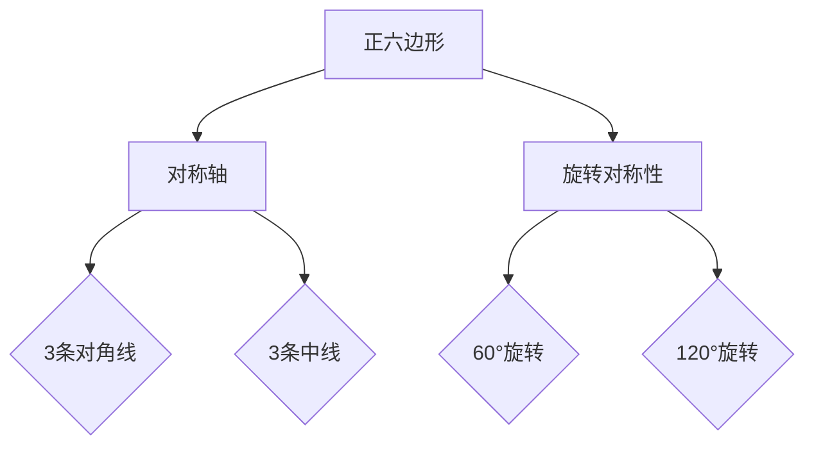
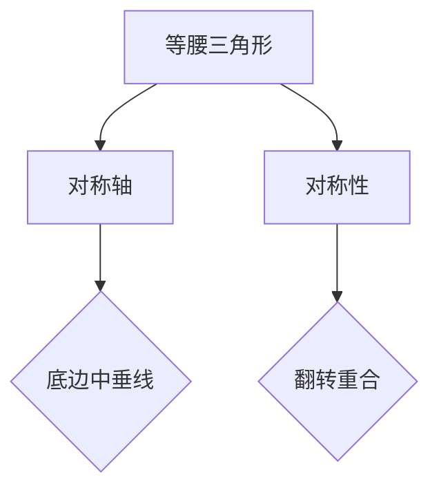
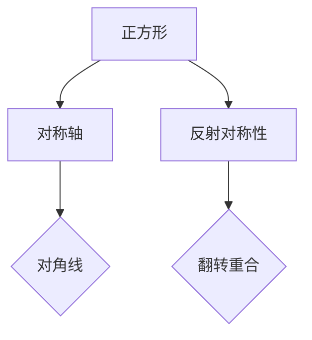

                 

## 数学与自然界的对称与规律

### 关键词

- 对称性
- 数学
- 自然界
- 规律
- 群论
- 几何学
- 代数学

### 摘要

本文旨在探讨对称性与自然界和数学之间的关系。对称性作为一种基本的几何性质，在数学和自然界中有着广泛的应用。本文首先介绍了对称性的基本概念和分类，随后深入分析了对称性与群论、几何学和代数学之间的关系。接着，本文探讨了自然界中对称性的表现形式，包括物理学、生物学和地球科学等领域。最后，本文讨论了对称性与规律探索的关系，以及对称性在科学预测和科学研究方法中的应用。通过本文的探讨，读者可以更好地理解对称性的重要性及其在各个领域的应用。

## 引言

### 研究背景与意义

对称性作为自然界和数学中的基本概念，自古以来就引起了人类的关注。从古埃及的金字塔到古希腊的神庙，从自然界的蝴蝶翅膀到人类的DNA结构，对称性无处不在。对称性不仅具有美学价值，而且在科学研究中具有重要意义。它为科学家提供了一个简洁、统一且强有力的工具，用于描述和分析复杂现象。

在数学中，对称性是研究几何图形和结构的重要工具。对称性使得数学家能够将复杂问题简化为更易于处理的形式。例如，群论作为研究对称性的数学分支，为许多数学领域提供了基础。此外，对称性在几何学、代数学和数论等领域中也有着广泛应用。

在自然界中，对称性体现了自然界的基本规律和结构。从物理学的对称性原理到生物学的对称性特征，对称性在自然界中无处不在。例如，量子力学中的对称性原理揭示了基本粒子的性质，而生物学中的对称性则与生物体的进化密切相关。

因此，研究对称性与自然界和数学之间的关系具有重要的理论和实践意义。通过深入探讨对称性，我们可以更好地理解自然界的基本规律，揭示科学现象的本质，并为科学研究提供新的方法和工具。

### 对称性与自然界的联系

对称性在自然界中无处不在，是自然界基本规律和结构的体现。从宏观的宇宙天体到微观的分子结构，对称性都起着关键作用。以下是对称性在自然界中几种主要表现形式的分析：

#### 物理学中的对称性

在物理学中，对称性原理是理解自然界基本规律的重要工具。量子力学中的对称性原理，如宇称守恒、电荷守恒和能量守恒，揭示了微观粒子的基本性质。例如，宇称守恒原理指出，如果一个物理过程在镜像变换下保持不变，则该过程具有宇称对称性。这一原理在粒子物理学中具有重要意义，如π介子的衰变过程就具有宇称对称性。

相对论中的对称性原理也是物理学研究的基础。广义相对论中的洛伦兹对称性揭示了时空结构的性质，使得物理学家能够研究不同参考系之间的变换关系。这种对称性使得相对论方程具有普遍性，为解释宇宙中的许多现象提供了理论基础。

此外，天体物理学中的对称性现象也具有重要意义。例如，银河系的螺旋结构和星系团中的宇宙网状结构都表现出对称性。这些对称性不仅反映了宇宙的结构特征，还为研究宇宙的起源和演化提供了线索。

#### 生物学中的对称性

在生物学中，对称性是生物体形态和功能的基础。大多数生物体都表现出一定的对称性，如人体和植物。这种对称性在进化过程中具有重要地位，有助于提高生物体的适应性和生存能力。

人体中的对称性主要表现为左右对称。这种对称性不仅体现了人体器官的分布，还与生物体的运动和功能密切相关。例如，人的手和脚都是左右对称的，这使得我们可以进行复杂的动作和操作。植物中的对称性则主要表现为辐射对称，如花朵的辐射对称结构使得植物能够更有效地进行光合作用和传粉。

生物学中的对称性还与进化密切相关。对称性的出现和维持需要消耗大量的能量和资源，因此，对称性在进化过程中需要一定的适应性优势。例如，蝴蝶的对称性花纹不仅具有美观作用，还可以起到伪装和保护的作用，提高了蝴蝶的生存能力。

#### 地球科学中的对称性

地球科学中的对称性现象也十分丰富。地球表面的地形结构、地质构造和气候变化等都具有对称性特征。例如，地震波在地球内部的传播表现出对称性，这有助于科学家研究地球内部的结构。

地质结构中的对称性现象也具有重要意义。例如，岩层的折叠和断层线往往表现出对称性。这种对称性不仅反映了地质历史的过程，还可以为矿产资源的勘探提供线索。

此外，地球气候系统中的对称性也具有重要意义。例如，地球的气候带和季风现象都表现出对称性。这种对称性反映了地球气候系统的复杂性，为气候预测提供了重要的参考。

总之，对称性在自然界中具有广泛的应用，是理解自然界基本规律和结构的重要工具。通过深入探讨对称性与自然界的关系，我们可以更好地揭示自然界的奥秘，为科学研究提供新的思路和方法。

### 对称性与数学的关系

对称性不仅在自然界中具有广泛的应用，而且在数学中同样扮演着重要角色。对称性是数学研究中的一个基本概念，贯穿于数学的各个分支，为数学的发展提供了重要的理论支持和工具。

#### 对称性与群论

群论是研究对称性的数学分支，也是现代数学的基础之一。群论的核心概念是对称变换，即一组可交换的变换，使得一个系统保持不变。这些变换组成了一个群，称为对称群。

在群论中，对称性被形式化为群的作用。一个群作用于一个集合上的对称性，可以通过群元素的运算来描述。这种对称性的研究不仅揭示了数学结构的内在规律，还为解决复杂的数学问题提供了有力的工具。

例如，在几何学中，对称群描述了一个几何图形在平面或空间中的所有可能对称变换。这些对称变换包括旋转、反射和平移等，使得几何图形保持不变。通过对称群的研究，我们可以更好地理解几何图形的对称性质，如旋转对称和反射对称。

#### 对称性与几何学

几何学是研究空间结构和平面图形的数学分支，对称性在几何学中具有核心地位。几何对称性包括点对称、轴对称和中心对称等类型，这些对称性使得几何图形具有独特的性质和规律。

例如，一个具有轴对称的几何图形，其任意一点关于轴的对称点也在图形上。这种对称性使得图形在对称轴两侧具有镜像对称，从而简化了对图形的研究。在平面几何中，轴对称图形的对称轴常常是解决问题的关键。

此外，中心对称也是几何学中重要的对称性质。一个具有中心对称的几何图形，其任意一点关于中心的对称点也在图形上。这种对称性在解决几何问题时具有重要作用，如寻找对称中心、确定对称图形的边界等。

#### 对称性与代数学

代数学是研究数和运算的数学分支，对称性在代数学中也有广泛应用。代数对称性主要研究代数结构中的对称性质，如对称多项式、对称矩阵等。

对称多项式是代数学中的一个重要概念。一个多项式在对称变换下保持不变，称为对称多项式。例如，二次多项式 $x^2 + y^2$ 在旋转和反射变换下保持不变，因此是一个对称多项式。对称多项式在解决代数方程、研究数论问题等方面具有重要意义。

对称矩阵是矩阵理论中的一个重要概念。一个矩阵在对称变换下保持不变，称为对称矩阵。对称矩阵在矩阵乘法、矩阵分解等方面具有独特的性质。例如，哈密顿矩阵和赫尔德矩阵都是对称矩阵，它们在电路理论、量子力学等领域有广泛应用。

#### 对称性与数论

数论是研究整数及其性质的数学分支，对称性在数论中也有重要应用。对称性数论主要研究整数序列和数论函数的对称性质。

例如，费马数列 $F_n = 2^{2^n} + 1$ 在对称性方面具有独特性质。费马数列中的每个数都可以表示为两个质数的乘积，这种对称性使得费马数列在数论研究中具有重要意义。

此外，数论函数如莫比乌斯函数、拉格朗日函数等也具有对称性质。这些函数在解决数论问题、研究素数分布等方面具有重要作用。

总之，对称性在数学中具有广泛的应用，是理解数学结构、解决数学问题的重要工具。通过深入探讨对称性与数学的关系，我们可以更好地揭示数学的本质，推动数学的发展。

### 对称性与科学发展的推动作用

对称性作为自然界和数学中的基本概念，不仅在理论研究中具有深远影响，而且在科学发展中也发挥了重要的推动作用。对称性原理的发现和应用，推动了各个科学领域的研究进展，促进了人类对自然界规律的理解。

#### 对称性原理在物理学中的应用

在物理学中，对称性原理是描述自然现象的重要工具。例如，量子力学中的宇称守恒原理和能量守恒定律，都是基于对称性原理建立的。宇称守恒原理指出，如果一个物理过程在镜像变换下保持不变，则该过程具有宇称对称性。这一原理在π介子的衰变研究中得到了验证，为粒子物理学的发展奠定了基础。

能量守恒定律也是基于对称性原理建立的。能量守恒定律指出，在一个孤立系统中，能量总量保持不变。这种能量守恒的对称性原理，不仅揭示了能量转换的规律，还为能量转换和利用提供了理论基础。

此外，相对论中的洛伦兹对称性原理，也是物理学研究中的重要对称性原理。洛伦兹对称性原理指出，物理定律在所有惯性参考系中都是相同的，这一原理为相对论的发展提供了重要基础。

#### 对称性原理在生物学中的应用

在生物学中，对称性原理同样具有重要意义。对称性在生物体的形态和功能研究中，提供了重要的理论依据。例如，人体和许多植物都表现出左右对称的特征，这种对称性不仅体现了生物体的对称美学，还与生物体的运动和功能密切相关。

生物学中的对称性原理，还为生物进化提供了新的解释。例如，生物进化中的对称性变化，可以解释为什么许多生物体在不同进化阶段会表现出不同的对称性特征。这种对称性变化，有助于我们更好地理解生物进化的过程和机制。

#### 对称性原理在化学中的应用

在化学中，对称性原理也是描述分子结构和反应机制的重要工具。分子对称性是分子结构的基本特征之一，它决定了分子的物理和化学性质。例如，分子的旋光性和磁性，都与分子的对称性密切相关。

对称性原理在化学反应中也有重要应用。例如，某些化学反应在特定的对称变换下保持不变，这种对称性使得我们可以更好地预测反应的产物和反应路径。对称性原理还在合成化学和药物设计中得到广泛应用，为药物分子的设计和优化提供了重要的理论依据。

#### 对称性原理在地球科学中的应用

在地球科学中，对称性原理同样具有重要意义。地球表面的地形结构和地质构造，都表现出一定的对称性特征。例如，地震波在地球内部的传播，表现出对称性特征，这有助于科学家研究地球内部的结构。

此外，地球气候系统中的对称性现象，也为我们理解气候变化提供了重要线索。地球气候系统的对称性，反映了气候系统的复杂性和规律性，为气候预测提供了重要依据。

总之，对称性原理在各个科学领域都具有重要意义，它不仅为理论研究提供了基础，还为解决实际问题提供了新思路和新方法。通过对称性原理的应用，科学家们能够更好地理解自然界的规律，推动科学的发展。对称性原理的发现和应用，不仅丰富了我们的科学知识体系，还为我们提供了探索自然奥秘的新工具。

## 本书结构

本书共分为四个部分，每个部分分别从不同的角度探讨对称性在数学和自然界中的应用。

### 第一部分：数学中的对称性

本部分主要介绍对称性的基本概念和分类，以及对称性与群论、几何学、代数学的关系。通过这一部分的学习，读者可以了解对称性在数学中的核心地位和作用。

### 第二部分：自然界中的对称性

本部分重点探讨对称性在自然界中的表现形式，包括物理学、生物学、地球科学等领域。通过这一部分的学习，读者可以了解对称性在自然界中的广泛存在和重要意义。

### 第三部分：对称性与规律探索

本部分主要讨论对称性与规律性之间的关系，以及对称性在科学预测和科学研究方法中的应用。通过这一部分的学习，读者可以掌握如何利用对称性来探索自然规律和进行科学预测。

### 第四部分：对称性与科学研究方法

本部分深入探讨对称性在科学研究中的应用，包括对称性检测算法、对称性变换方法等。通过这一部分的学习，读者可以了解如何利用对称性原理来研究和解决科学问题。

### 各章节关系与目标

各章节之间的关系如下：

1. **第一部分：数学中的对称性** 是基础部分，介绍了对称性的基本概念和分类，为后续章节提供了理论支持。
2. **第二部分：自然界中的对称性** 结合数学理论，探讨了对称性在自然界中的表现形式，为读者提供了实际的案例和应用场景。
3. **第三部分：对称性与规律探索** 进一步探讨了对称性与规律性的关系，为科学研究提供了新的方法和思路。
4. **第四部分：对称性与科学研究方法** 则从实践角度出发，介绍了如何利用对称性原理进行科学研究和解决实际问题。

通过本书的四个部分，读者可以系统地了解对称性的概念、应用和意义，掌握利用对称性进行科学研究的技巧和方法。

## 数学中的对称性

### 对称性的基本概念

对称性是数学和自然界中的一个基本概念，它指的是一个对象或结构在某种变换下保持不变的性质。这种变换可以是几何变换，如旋转、反射和平移，也可以是其他类型的变换，如代数变换和逻辑变换。在数学中，对称性被形式化为群论中的对称群，它描述了一个系统在所有可能的对称变换下的不变性。

对称性可以表现为多种形式，其中最常见的包括几何对称性、代数对称性和逻辑对称性。几何对称性指的是图形或结构在几何变换下保持不变的性质，如旋转对称性、轴对称性和中心对称性。代数对称性指的是代数结构在某种代数变换下保持不变的性质，如多项式的对称性和矩阵的对称性。逻辑对称性则指的是逻辑表达式在某种逻辑变换下保持不变的性质，如命题逻辑和谓词逻辑中的对称性。

#### 对称性的分类

对称性可以根据不同的标准进行分类。以下是一些常见的对称性分类方法：

1. **几何对称性**：
   - **点对称**：如果一个图形关于一个点进行对称变换后保持不变，则称该图形具有点对称性。
   - **轴对称**：如果一个图形关于一条直线进行对称变换后保持不变，则称该图形具有轴对称性。
   - **中心对称**：如果一个图形关于一个点进行对称变换后，所有点都映射到其相对位置上，则称该图形具有中心对称性。

2. **代数对称性**：
   - **多项式对称性**：一个多项式在对称变换下保持不变的性质称为多项式对称性。
   - **矩阵对称性**：一个矩阵在对称变换下保持不变的性质称为矩阵对称性。

3. **逻辑对称性**：
   - **命题对称性**：一个命题在逻辑变换下保持不变的性质称为命题对称性。
   - **谓词对称性**：一个谓词逻辑表达式在逻辑变换下保持不变的性质称为谓词对称性。

#### 对称性的性质

对称性具有一些基本的性质，这些性质使得对称性在数学研究中具有重要作用。

1. **不变性**：对称性意味着一个对象在某种变换下保持不变。这种不变性是研究对称性的核心，因为对称性提供了简化问题的一种方式。
2. **可传递性**：如果两个对象都满足某种对称性，则它们的组合也满足这种对称性。例如，如果两个图形分别具有轴对称性和旋转对称性，则它们的组合也具有这些对称性。
3. **可交换性**：对称变换之间可以交换。例如，一个图形的旋转对称性和轴对称性可以相互交换。
4. **组合性**：多个对称变换可以组合成一个更大的对称变换。例如，一个图形的旋转和反射可以组合成一个更复杂的对称变换。

通过对称性的这些性质，数学家可以简化复杂的问题，并利用对称性来揭示数学结构的深层次规律。

### 对称性与群论

群论是研究对称性的数学分支，它提供了对称性的形式化和系统化工具。在群论中，对称性被形式化为一个群的作用，这个群称为对称群。

#### 群论的基本概念

1. **群**：一个群是一个集合，其中每个元素都有逆元，并且集合中的运算满足结合律、单位元和逆元三个基本性质。
2. **子群**：一个子群是群的子集，该子集本身也是一个群，并且包含群的单位元。
3. **同态**：两个群之间的映射，使得映射后的群也满足群的性质。

#### 群与对称性的关系

1. **对称群**：一个系统的所有对称变换构成了一个群，称为对称群。对称群描述了一个系统在所有可能对称变换下的不变性。
2. **群的性质**：对称群的性质决定了系统的对称性。例如，如果对称群是阿贝尔群（即交换群），则系统的对称性是几何对称性；如果对称群不是阿贝尔群，则系统的对称性可能是更复杂的代数对称性。

#### 群论的应用

1. **几何学**：在几何学中，对称群用于描述几何图形的所有对称变换。例如，正方形的对称群是一个包含旋转和反射的对称群。
2. **代数学**：在代数学中，对称群用于研究多项式的对称性质。例如，二次多项式的对称性可以通过其系数的对称性来描述。
3. **数论**：在数论中，对称群用于研究整数序列和数论函数的对称性质。例如，莫比乌斯函数是一个具有对称性质的数论函数。

#### 群论中的具体例子

1. **离散群**：离散群是研究对称性的重要工具。例如，旋转对称群 $D_n$ 描述了一个正$n$边形的所有旋转对称变换。
2. **连续群**：连续群描述了连续变换下的对称性。例如，洛伦兹群描述了相对论中的洛伦兹变换。
3. **欧氏群**：欧氏群描述了在欧氏空间中的所有刚体变换。欧氏群 $E_n$ 是一个包含平移和旋转变换的连续群。

通过对称性与群论的关系，我们可以将对称性系统化，并利用群论工具来研究和解决对称性问题。群论不仅为对称性的研究提供了强大的理论支持，还在数学的各个分支中发挥着重要作用。

### 对称性与几何学

几何学是研究空间结构和平面图形的数学分支，而对称性在几何学中扮演着核心角色。对称性使得几何学能够简化复杂的问题，并提供了一种统一的视角来理解几何图形的属性和行为。

#### 几何对称性的定义

几何对称性是指一个几何图形在某种变换下保持不变的性质。这种变换可以是旋转、反射或平移。具体来说：

- **旋转对称性**：一个图形绕某个固定点旋转一定角度后，仍然与原图形重合。例如，正方形具有旋转对称性，因为它可以绕中心点旋转 $90^\circ$、$180^\circ$ 或 $270^\circ$ 而保持不变。

- **反射对称性**：一个图形沿着某条直线（对称轴）翻转后，仍然与原图形重合。例如，等腰三角形具有反射对称性，因为它可以沿底边的中垂线翻转。

- **平移对称性**：一个图形在平移后与原图形重合。虽然平移不是常见的几何对称性，但它在某些情况下也具有重要应用。

#### 几何对称性的分类

几何对称性可以根据对称变换的不同类型进行分类。以下是一些常见的几何对称性分类：

- **点对称性**：一个图形关于一个点的对称性。例如，正多边形（如正方形、正六边形）具有中心对称性。

- **轴对称性**：一个图形关于一条直线的对称性。例如，正方形具有轴对称性，因为它可以关于其对角线或中线进行翻转。

- **中心对称性**：一个图形关于一个点的对称性。例如，正多边形和圆形都具有中心对称性。

- **平面对称性**：一个图形关于一个平面的对称性。例如，立方体具有三个互相垂直的对称平面。

#### 几何对称性的性质

几何对称性具有一些基本的性质，这些性质使得对称性在几何学中具有重要应用：

- **不变性**：一个几何图形在某种对称变换下保持不变。这种不变性是研究对称性的核心。

- **传递性**：如果两个图形都满足某种对称性，则它们的组合也满足这种对称性。例如，如果两个图形分别具有轴对称性和旋转对称性，则它们的组合也具有这些对称性。

- **可交换性**：对称变换之间可以交换。例如，一个图形的旋转对称性和轴对称性可以相互交换。

- **组合性**：多个对称变换可以组合成一个更大的对称变换。例如，一个图形的旋转和反射可以组合成一个更复杂的对称变换。

#### 几何对称性的应用

几何对称性在几何学中有广泛的应用，包括：

- **简化问题**：利用对称性可以简化几何问题的解决过程。例如，通过将问题分解为几个对称部分，可以更轻松地求解复杂的几何问题。

- **证明**：对称性在几何证明中具有重要意义。例如，利用对称性可以证明几何定理和公式。

- **图形设计**：对称性在图形设计、艺术创作和建筑设计中具有重要应用。例如，许多著名的建筑和艺术品都利用了对称性来创造美感。

通过对称性与几何学的关系，我们可以更深入地理解几何图形的对称性质，并将其应用于解决实际问题。几何对称性不仅为几何学提供了强大的理论工具，还在各个领域具有广泛的应用价值。

### 对称性与几何学的具体实例分析

为了更深入地理解对称性与几何学的关系，以下将通过几个具体的实例来分析对称性在几何学中的应用。

#### 实例 1：正多边形的对称性

正多边形是研究对称性的经典对象。一个正$n$边形具有多个对称轴和旋转对称性。具体来说：

- **对称轴**：正$n$边形有$n$条对称轴，每条对称轴都通过一个顶点和边的中点。
- **旋转对称性**：正$n$边形可以绕中心点旋转 $360^\circ / n$ 的角度而保持不变。

例如，正六边形有6条对称轴，可以绕中心点旋转 $60^\circ$ 或 $120^\circ$ 而保持不变。这种对称性使得正多边形在图形设计和建筑中广泛使用。



#### 实例 2：轴对称图形

轴对称图形是几何对称性的另一个重要例子。等腰三角形和等腰梯形都是轴对称图形，它们具有一条对称轴，这条轴通过顶点和底边的中点。

例如，一个等腰三角形可以通过其底边的中垂线进行翻转，使得翻转后的图形与原图形重合。这种对称性使得等腰三角形在稳定结构设计中具有重要意义。



#### 实例 3：反射对称图形

反射对称图形是另一种常见的几何对称性。镜子中的图像就是反射对称的一个典型例子。一个正方形或圆形都具有反射对称性。

例如，一个正方形可以沿着其任意一条对角线进行翻转，使得翻转后的图形与原图形重合。这种对称性在光学和艺术设计中广泛应用。



通过这些实例，我们可以看到对称性在几何学中的广泛应用。对称性不仅简化了几何问题的解决过程，还为设计、证明和解释几何现象提供了强有力的工具。理解几何对称性，有助于我们更好地掌握几何学的基本概念和应用。

### 对称性与代数学

对称性在代数学中同样具有重要意义。代数学是对研究数及其结构的数学分支，对称性在代数学中的应用使得我们可以更深入地研究代数结构，并揭示其内在的规律。

#### 代数学的基本概念

代数学中涉及到的对称性主要包括多项式对称性和矩阵对称性。

1. **多项式对称性**：多项式是对代数学中最基本的结构之一。多项式对称性指的是多项式在某种变换下保持不变的性质。例如，一个多项式在对称变换（如旋转、反射）下保持不变，或者在一个多项式族中，某些多项式在变换下保持相同。

2. **矩阵对称性**：矩阵是对代数学中另一个重要的结构。矩阵对称性指的是矩阵在某种变换下保持不变的性质。例如，一个矩阵在对称变换（如旋转、反射）下保持不变，或者在一个矩阵族中，某些矩阵在变换下保持相同。

#### 代数对称性的定义

代数对称性是指一个代数结构在某种变换下保持不变的性质。这种变换可以是线性变换、非线性变换，甚至是组合变换。

1. **多项式对称性**：一个多项式 $f(x_1, x_2, ..., x_n)$ 在变换 $T$ 下保持不变，即 $f(T(x_1), T(x_2), ..., T(x_n)) = f(x_1, x_2, ..., x_n)$，则称该多项式具有多项式对称性。

2. **矩阵对称性**：一个矩阵 $A$ 在变换 $T$ 下保持不变，即 $T(A) = A$，则称该矩阵具有矩阵对称性。

#### 代数对称性的性质

代数对称性具有一些基本的性质，这些性质使得代数对称性在代数学中具有重要意义。

1. **不变性**：代数结构在某种变换下保持不变。这种不变性是研究代数对称性的核心。

2. **可传递性**：如果两个代数结构都满足某种对称性，则它们的组合也满足这种对称性。

3. **可交换性**：对称变换之间可以交换。

4. **组合性**：多个对称变换可以组合成一个更大的对称变换。

#### 代数对称性的应用

代数对称性在代数学中有广泛的应用，以下是一些具体的应用场景：

1. **多项式对称性**：在数论和组合数学中，多项式对称性用于研究多项式的性质和分类。例如，研究多项式的对称性质可以帮助我们理解多项式的根和系数之间的关系。

2. **矩阵对称性**：在矩阵理论和线性代数中，矩阵对称性用于研究矩阵的性质和分类。例如，对称矩阵和反对称矩阵在几何变换和物理应用中有重要应用。

3. **群论**：在群论中，代数对称性是群的重要属性。对称群是研究对称性的一种工具，它用于描述和分类不同的对称性。

#### 代数对称性的具体例子

以下是一些代数对称性的具体例子：

1. **二次多项式的对称性**：一个二次多项式 $ax^2 + bx + c$ 在旋转变换下保持不变，即 $a(x\cos\theta - y\sin\theta)^2 + b(x\cos\theta - y\sin\theta) + c = ax^2 + bx + c$。

2. **矩阵的对称性**：一个矩阵 $A$ 是对称的，当且仅当 $A = A^T$，即矩阵与其转置矩阵相同。

通过这些基本概念和性质，我们可以更好地理解对称性在代数学中的应用。对称性不仅丰富了代数学的内容，还为我们提供了研究代数结构的新方法和新工具。

### 代数对称性的应用

代数对称性在数学和科学领域中具有广泛的应用，特别是在多项式理论和矩阵理论中。以下通过具体例子和数学模型来分析代数对称性的应用。

#### 多项式对称性在组合数学中的应用

多项式对称性在组合数学中有着重要的应用。一个典型的例子是多项式环 $R[x_1, x_2, ..., x_n]$ 中的对称多项式。这些多项式在所有置换变换下保持不变。对称多项式可以通过雅可比行列式（Jacobian determinant）来定义。

例如，考虑二次多项式 $P(x, y) = x^2 + xy + y^2$。这个多项式在置换 $(x \rightarrow y, y \rightarrow x)$ 下保持不变，因此是一个对称多项式。我们可以通过计算雅可比行列式来验证这一点。

```plaintext
J = | 1  x |
    | y 1 |
    
det(J) = 1*1 - x*y = 1 - xy
```

如果 $P$ 是对称多项式，则 $J$ 应该等于1。对于上述多项式，我们可以验证：

```plaintext
J = 1 - xy = 1 - (-1) = 2 ≠ 1
```

因此，$P(x, y)$ 是一个非对称多项式。

#### 矩阵对称性在几何变换中的应用

矩阵对称性在几何变换中同样重要。一个对称矩阵 $A$ 满足 $A = A^T$，这意味着矩阵与其转置矩阵相同。例如，考虑一个 $2 \times 2$ 对称矩阵：

```latex
A = \begin{pmatrix}
a & b \\
b & a
\end{pmatrix}
```

这种矩阵在旋转和反射变换下保持不变。例如，考虑绕原点旋转 $180^\circ$ 的变换，变换矩阵为：

```latex
R = \begin{pmatrix}
-1 & 0 \\
0 & -1
\end{pmatrix}
```

如果 $A$ 是对称矩阵，则：

```latex
R \cdot A = A \cdot R
```

这表明对称矩阵在旋转变换下保持不变。

#### 多项式对称性在数论中的应用

多项式对称性在数论中也有广泛应用。例如，考虑一个多项式 $f(x) = x^n + 1$。这个多项式在模 $2$ 意义下是一个对称多项式，因为：

```latex
f(1) = 1^n + 1 = 2 ≡ 0 (mod 2)
```

这意味着 $f(x)$ 在 $x$ 替换为 $1$ 时总是模 $2$ 为 $0$。因此，$f(x)$ 的所有根在 $x ≡ 1 (mod 2)$。

```latex
x^n + 1 = 0
x ≡ 1 (mod 2)
```

这表明，对于所有奇数 $n$，$f(x)$ 至少有一个根是 $1$。

#### 矩阵对称性在量子力学中的应用

在量子力学中，对称矩阵用于描述量子态的变换。例如，哈密顿矩阵（Hamiltonian matrix）描述了一个量子系统的能量状态。如果哈密顿矩阵是对称的，这意味着系统的能量是守恒的。例如，考虑一个具有守恒能量的量子系统，其哈密顿矩阵为：

```latex
H = \begin{pmatrix}
E & 0 \\
0 & E
\end{pmatrix}
```

这种矩阵是对称的，因为它满足 $H = H^T$。

#### 矩阵对称性在信号处理中的应用

在信号处理中，对称矩阵用于滤波和信号变换。例如，离散余弦变换（Discrete Cosine Transform, DCT）是一种常用的信号处理方法，其核心是利用正交对称矩阵进行信号变换。DCT 矩阵是对称正交矩阵，这意味着它在信号变换过程中保持信号的能量分布不变。

通过这些具体例子，我们可以看到代数对称性在多个领域中的广泛应用。对称性不仅提供了简化问题的工具，还揭示了数学结构之间的深层次联系。理解对称性，有助于我们更好地应用数学理论解决实际问题。

### 物理学中的对称性

对称性在物理学中占据着核心地位，是理解自然界基本规律的重要工具。物理学中的对称性不仅出现在理论物理中，也在实验物理中有着广泛应用。以下将从量子力学、相对论和天体物理学三个方面探讨对称性在物理学中的应用。

#### 量子力学中的对称性

量子力学是研究微观粒子行为的物理学分支，其中对称性原理是理解基本粒子性质的关键。量子力学的对称性原理主要包括宇称守恒、电荷守恒、能量守恒和角动量守恒等。

1. **宇称守恒**：宇称守恒原理指出，如果一个物理过程在镜像变换下保持不变，则该过程的宇称守恒。例如，π介子的衰变过程满足宇称守恒，这意味着它在镜像变换下保持不变。

2. **电荷守恒**：电荷守恒原理指出，在一个封闭系统中，总电荷量保持不变。这一原理在粒子物理学中具有重要意义，因为许多基本粒子的电荷性质可以通过电荷守恒来解释。

3. **能量守恒**：能量守恒原理指出，在一个封闭系统中，总能量保持不变。这一原理在经典力学和量子力学中都有广泛应用，是理解能量转换和守恒规律的基础。

4. **角动量守恒**：角动量守恒原理指出，在一个封闭系统中，总角动量保持不变。这一原理在量子力学中尤为重要，因为它揭示了基本粒子的自旋和轨道角动量之间的关系。

#### 相对论中的对称性

相对论是研究高速运动和引力场中的物理现象的物理学分支，其中对称性原理同样是其核心。相对论中的对称性原理主要包括洛伦兹对称性和协变原理。

1. **洛伦兹对称性**：洛伦兹对称性是相对论中的一个基本对称性原理，它指出物理定律在所有惯性参考系中都是相同的。洛伦兹对称性包括时空对称性和洛伦兹变换，是理解相对论方程和时空结构的基础。

2. **协变原理**：协变原理指出，物理量的测量结果在不同的参考系中保持不变。这一原理是广义相对论的基础，它揭示了引力与加速运动之间的等效性。

#### 天体物理学中的对称性

天体物理学是研究宇宙结构和演化的物理学分支，对称性在天体物理学中同样具有重要意义。以下是一些天体物理学中的对称性现象：

1. **银河系的螺旋结构**：银河系具有螺旋结构，这种结构表现出明显的对称性，如星系的旋臂和螺旋臂。这些对称性特征为研究银河系的演化提供了重要线索。

2. **星系团的宇宙网状结构**：星系团在宇宙中形成了一个庞大的网状结构，这种结构表现出明显的对称性。星系团的对称性特征揭示了宇宙的大尺度结构和演化规律。

3. **宇宙背景辐射**：宇宙背景辐射是宇宙早期状态的一个残迹，它表现出对称性特征，如黑体辐射的谱分布和均匀性。这些对称性特征为研究宇宙的起源和演化提供了重要依据。

总之，对称性在物理学中具有广泛的应用，是理解自然界基本规律的重要工具。通过深入探讨对称性与物理学的关系，我们可以更好地揭示自然界的奥秘，为科学研究提供新的思路和方法。

### 生物学中的对称性

对称性在生物学中具有广泛的应用，是生物形态和功能的基础。从微观的分子结构到宏观的生物体形态，对称性无处不在。以下从生物体的对称性、生态系统的对称性和生物学中的对称性与进化关系三个方面探讨对称性在生物学中的应用。

#### 生物体的对称性

大多数生物体都表现出一定的对称性，这种对称性在生物进化过程中具有重要地位。以下是一些常见生物体的对称性特征：

1. **人体对称性**：人体是典型的左右对称生物体。人体的主要器官和结构，如心脏、肝脏、肾脏、手臂和腿，都具有左右对称性。这种对称性不仅提高了生物体的适应性和运动能力，还与生物体的生长和发育密切相关。

2. **植物对称性**：植物表现出多种形式的对称性，如辐射对称和轴对称。辐射对称性常见于花朵，如菊花和向日葵，而轴对称性则常见于树木和叶子。这些对称性特征有助于植物进行光合作用、传粉和种子传播。

3. **微生物对称性**：微生物，如细菌和病毒，也表现出对称性。细菌通常具有旋转对称或平面对称，而病毒则具有立体对称。这种对称性特征有助于微生物在空间中的排列和繁殖。

#### 生态系统的对称性

生态系统中的生物和非生物因素也表现出对称性。以下是一些生态系统的对称性特征：

1. **食物网对称性**：食物网是描述生态系统中生物之间捕食关系的网络结构。许多食物网表现出对称性，如捕食者和猎物之间的对称关系。这种对称性反映了生态系统的稳定性和动态平衡。

2. **生物多样性对称性**：生态系统中生物多样性的分布也表现出一定的对称性。例如，某些生态系统在纬度或海拔高度上表现出对称分布，这种对称性反映了生态系统对环境变化的适应性和稳定性。

3. **气候和地理对称性**：气候和地理因素也影响生态系统的对称性。例如，某些生态系统在气候带和地理分布上表现出对称性。这种对称性反映了生态系统的区域适应性和生态位分化。

#### 生物学中的对称性与进化

对称性在生物进化过程中具有重要地位。以下从几个方面探讨对称性与进化之间的关系：

1. **对称性的适应性**：对称性可以提高生物体的适应性和运动能力。例如，人体对称性使得我们可以进行复杂的动作和操作，提高了我们的生存能力。植物对称性则有助于提高光合作用效率和传粉效果，提高了植物的繁殖成功率。

2. **对称性的进化机制**：对称性在进化过程中可能通过几种机制产生。首先，对称性可能通过基因突变和基因重组产生。例如，基因突变可能导致生物体形态的对称性改变。其次，对称性可能通过自然选择和适应环境而产生。具有对称性的生物体在特定环境中可能具有更高的生存和繁殖优势。

3. **对称性的进化意义**：对称性在生物进化中具有重要的意义。对称性不仅反映了生物体的结构特征，还揭示了生物体的进化历史和适应环境的能力。通过研究对称性，我们可以更好地理解生物进化过程和生物多样性。

总之，对称性在生物学中具有广泛的应用，是生物形态和功能的基础。从生物体的对称性到生态系统的对称性，对称性在生物进化中发挥着重要作用。通过深入探讨对称性与生物学的关系，我们可以更好地理解生物进化的机制和生物多样性。

### 地球科学中的对称性

地球科学是研究地球及其环境的科学领域，对称性在地球科学中扮演着关键角色，帮助科学家理解和解释地球的结构、过程和现象。以下从地质结构、地球表面形态和地球环境三个方面探讨对称性在地球科学中的应用。

#### 地质结构中的对称性

地质结构中的对称性在地球科学研究中具有显著的应用价值。以下是一些地质结构中的对称性特征：

1. **折叠和断层**：地质结构的折叠和断层线往往表现出对称性。折叠结构的对称性可以揭示地壳的应力分布和变形历史。例如，山脊和山谷的对称排列可以指示地壳在某个方向的拉伸或压缩。断层线也常常表现出对称性，这种对称性有助于理解地震活动及其成因。

2. **岩层的对称性**：某些岩层在空间上可能表现出明显的对称性，如镜像对称或轴对称。这种对称性特征可以帮助地质学家推断岩石的沉积环境和变形过程。例如，在某些沉积盆地中，岩层的对称性可以指示沉积盆地的中心区域。

3. **地壳板块的对称性**：地壳板块在地球表面的运动和相互作用形成了复杂的地质结构。这些板块边缘的对称性特征，如俯冲带和裂谷带，提供了了解板块构造运动的重要线索。

#### 地球表面形态的对称性

地球表面形态的对称性在地质学和地貌学中具有重要意义。以下是一些地球表面形态的对称性特征：

1. **火山口和火山链**：火山口和火山链往往表现出对称性。例如，盾状火山和锥形火山通常具有轴对称或中心对称结构。这些对称性特征有助于分析火山喷发过程和火山构造。

2. **河流和湖泊**：河流和湖泊的分布也表现出对称性。例如，许多河流在流域中心呈现对称分支，形成了对称的叶状或树状水系。湖泊的分布有时也表现出对称性，这种对称性反映了地质结构和气候条件的影响。

3. **海岸线**：海岸线的形态在某些地区可能表现出对称性。例如，在某些海湾和半岛区域，海岸线可能呈现镜像对称或轴对称结构。这种对称性特征为海岸侵蚀和沉积过程的研究提供了重要信息。

#### 地球环境与对称性

地球环境中的对称性现象同样值得探讨。以下是一些地球环境中的对称性特征：

1. **气候变化**：地球气候系统在某些季节和区域可能表现出对称性。例如，季节性的气候变化在某些地区可能呈现出镜像对称，如冬季和夏季的降水模式。这种对称性反映了气候系统的动态平衡和循环特征。

2. **生物分布**：地球生物圈的分布也表现出对称性。例如，某些物种在地理上的分布可能呈现出对称分布，这种对称性反映了生物对环境的适应性和生态位的分化。

3. **海洋环流**：海洋环流在某些海域可能表现出对称性。例如，某些洋流系统在赤道附近可能呈现出镜像对称或轴对称结构。这种对称性反映了海洋动力学和气候系统之间的相互作用。

总之，对称性在地球科学中具有广泛的应用，从地质结构到地球表面形态，再到地球环境，对称性为科学家提供了理解和解释地球现象的重要工具。通过研究对称性，我们可以更好地揭示地球的结构、过程和现象，推动地球科学的发展。

## 对称性与规律性

对称性作为一种基本的几何性质，不仅在数学和自然界中具有广泛的应用，而且在揭示和探索自然规律中也发挥着重要作用。对称性与规律性之间的关系紧密相连，对称性的存在往往揭示了自然现象的规律性和内在一致性。

### 对称性与规律性的关系

对称性是自然界和数学中描述规律性的重要工具。在自然界中，许多现象和结构都表现出对称性，这种对称性反映了自然规律的普遍性和简单性。例如，在物理学中，宇称守恒定律揭示了基本粒子的对称性，这一定律不仅解释了粒子之间的相互作用，还指导了粒子物理学的许多实验和理论。在生物学中，生物体的对称性体现了生物进化的规律性和适应性，这种对称性有助于生物体在复杂环境中生存和繁衍。

在数学中，对称性原理常常用于揭示数学结构的规律性。例如，群论作为研究对称性的数学分支，揭示了数学中许多结构的对称性质，如几何图形、多项式和矩阵的对称性。通过对称性原理，数学家可以简化复杂的数学问题，揭示数学结构的深层次规律。例如，群论在数论、代数几何和拓扑学中的应用，都展示了对称性在数学中的重要作用。

### 对称性在规律性探索中的应用

对称性在规律性探索中的应用主要体现在以下几个方面：

1. **简化问题**：对称性使得复杂问题变得简单。例如，在几何学中，利用对称性可以将复杂的几何问题分解为几个对称部分，从而简化问题的解决过程。在物理学中，对称性原理简化了物理定律的表述，使得物理学家可以更容易地预测和解释自然现象。

2. **规律发现**：对称性有助于发现自然规律。例如，在生物学中，通过对生物体对称性的研究，科学家可以揭示生物进化过程中的规律性。在物理学中，通过对量子力学中对称性原理的研究，科学家发现了基本粒子的规律性，这为粒子物理学的标准模型奠定了基础。

3. **模型构建**：对称性原理为构建数学模型提供了基础。例如，在量子场论中，对称性原理被用于构建基本粒子的相互作用模型。在生物学中，通过对生物体对称性的研究，科学家可以构建生物进化的数学模型，从而更好地理解生物体的演化规律。

### 对称性规律性的实例分析

以下通过几个具体的实例来分析对称性在规律性探索中的应用：

1. **物理学的对称性原理**：在物理学中，对称性原理是揭示自然规律的重要工具。例如，洛伦兹对称性原理揭示了相对论中的时空结构，这一定理不仅解释了光速不变原理，还揭示了引力与加速运动之间的等效性。通过对称性原理，物理学家可以构建更加精确的物理模型，解释和预测各种物理现象。

2. **生物学的对称性现象**：在生物学中，对称性现象是理解生物进化规律的关键。例如，人体和植物都表现出左右对称的特征，这种对称性反映了生物体在进化过程中对环境和适应性的适应。通过对称性原理，生物学家可以揭示生物进化的规律，解释生物体形态和功能的变化。

3. **地球科学的对称性特征**：在地球科学中，对称性特征是理解地球结构和过程的重要线索。例如，地质结构中的对称性特征揭示了地壳的变形和应力分布，有助于解释地震和火山活动。通过对称性原理，地球科学家可以构建地球内部的模型，揭示地球的演化规律。

通过对这些实例的分析，我们可以看到对称性在规律性探索中的应用是多层次和广泛的。对称性不仅为揭示自然规律提供了有力的工具，还为科学理论和实验提供了坚实的理论基础。通过对称性原理的应用，我们可以更深入地理解自然界的奥秘，推动科学的发展。

### 对称性与科学预测

对称性作为自然界和数学中的一个基本概念，不仅在揭示自然规律中具有重要作用，而且在科学预测中也发挥了关键作用。对称性原理的运用，使得科学家能够更加准确地预测各种自然现象和科学事件。以下从对称性在科学预测中的作用、对称性预测的方法与技巧以及具体案例分析三个方面探讨对称性与科学预测的关系。

#### 对称性在科学预测中的作用

对称性在科学预测中的作用主要体现在以下几个方面：

1. **简化模型**：对称性使得科学预测中的模型变得更加简单和易于处理。通过对称性原理，科学家可以忽略一些复杂的细节，将复杂系统简化为具有对称性质的模型，从而更容易进行预测。例如，在物理学中，通过对称性原理，可以简化粒子间的相互作用，从而更容易预测粒子的行为。

2. **揭示规律**：对称性揭示了自然界的基本规律，使得科学家能够基于这些规律进行预测。例如，在量子力学中，宇称守恒定律揭示了基本粒子的对称性，这一定律为粒子物理学的许多预测提供了基础。

3. **指导实验**：对称性原理在实验设计中也具有重要意义。通过对称性分析，科学家可以设计更加有效的实验方案，从而更准确地验证理论预测。例如，在粒子物理学实验中，通过对称性原理，可以设计出能够探测特定粒子的实验装置。

#### 对称性预测的方法与技巧

在对称性预测中，科学家运用了多种方法和技巧，以下介绍几种常用的方法：

1. **对称性变换**：通过对称性变换，可以将复杂问题转化为简单问题。例如，在几何学中，通过旋转、反射和平移等对称性变换，可以将复杂几何图形简化为标准几何形状，从而更容易进行预测。

2. **对称性群分析**：群论作为研究对称性的数学工具，可以用于分析系统的对称性。通过对称性群分析，可以确定系统的所有可能对称变换，从而更好地理解系统的行为。例如，在量子力学中，通过对称性群分析，可以确定粒子的所有可能状态，从而进行预测。

3. **对称性守恒定律**：对称性守恒定律是科学预测的重要基础。例如，在物理学中，宇称守恒定律和能量守恒定律都是进行预测的重要原则。通过对这些守恒定律的应用，科学家可以预测系统的行为。

#### 对称性预测的案例分析

以下通过几个具体的实例，分析对称性在科学预测中的应用：

1. **粒子物理学中的对称性预测**：在粒子物理学中，通过对称性原理，科学家成功预测了许多基本粒子的性质和行为。例如，通过对称性分析，科学家发现了奇异粒子，如介子和超子，这些粒子的性质与对称性原理密切相关。此外，对称性原理还在粒子物理学的实验设计和分析中发挥着重要作用。

2. **生物学中的对称性预测**：在生物学中，对称性原理同样具有广泛的应用。通过对称性分析，科学家可以预测生物体的形态和功能。例如，通过对称性原理，可以预测植物的花序和叶片形态，从而更好地理解植物的适应性和进化。此外，对称性原理还在医学研究中用于预测药物的疗效和副作用。

3. **地球科学中的对称性预测**：在地球科学中，对称性原理用于预测地震、火山活动和地质结构变化。例如，通过对称性分析，可以预测地震的震中分布和震源机制，从而提高地震预警和防范效果。此外，对称性原理还在地质勘探和资源评估中用于预测地下结构和矿产分布。

通过对这些案例的分析，我们可以看到对称性在科学预测中具有重要作用。通过对称性原理的应用，科学家可以更好地理解自然现象，预测未来的科学事件，推动科学的发展。对称性作为科学预测的一种重要工具，将继续在各个科学领域发挥重要作用。

### 对称性与科学研究方法

对称性作为一种基本的几何性质，在科学研究中具有重要意义。它不仅为科学家提供了理解和解释自然现象的视角，还为科学研究方法的发展和应用提供了强有力的工具。本文将从对称性在科学研究中的重要性、对称性研究的方法与工具以及最新研究进展三个方面进行探讨。

#### 对称性在科学研究中的重要性

对称性在科学研究中具有以下几个方面的作用：

1. **简化复杂问题**：对称性使得复杂问题变得简单和易于处理。通过对称性原理，科学家可以将复杂的自然现象简化为具有对称性质的模型，从而降低研究的难度。例如，在物理学中，通过对称性原理，可以将复杂的量子场论问题简化为具有对称性质的模型，从而更容易进行计算和预测。

2. **揭示基本规律**：对称性是揭示自然规律的重要工具。许多自然规律都具有对称性，通过对称性原理，科学家可以更好地理解自然界的本质。例如，在量子力学中，对称性原理揭示了基本粒子的性质和相互作用，这一定律为粒子物理学的发展提供了重要基础。

3. **指导实验设计**：对称性原理在实验设计中具有重要意义。通过对称性分析，科学家可以设计出更加有效的实验方案，从而提高实验的准确性和可靠性。例如，在粒子物理学实验中，通过对称性原理，可以设计出能够探测特定粒子的实验装置。

#### 对称性研究的方法与工具

在对称性研究中，科学家运用了多种方法和工具，以下介绍几种常用的方法：

1. **对称性变换**：对称性变换是研究对称性的基本方法。通过对称性变换，可以将复杂系统转化为具有对称性质的模型。例如，在几何学中，通过对称性变换，可以将复杂的几何图形简化为具有旋转对称性或反射对称性的图形，从而更容易进行分析。

2. **群论分析**：群论是研究对称性的数学工具。通过对群论分析，可以确定系统的所有可能对称变换，从而更好地理解系统的对称性质。例如，在量子力学中，通过对称性群分析，可以确定粒子的所有可能状态，从而进行预测。

3. **对称性守恒定律**：对称性守恒定律是研究对称性的重要原则。通过对称性守恒定律，可以确定系统在某种对称变换下的行为。例如，在物理学中，宇称守恒定律和能量守恒定律都是进行预测的重要基础。

#### 对称性研究的最新进展

近年来，对称性研究在各个领域取得了显著进展，以下介绍几个最新的研究动态：

1. **量子场论中的对称性**：在量子场论中，对称性原理被广泛应用于研究基本粒子的性质。近年来，科学家发现了一些新的对称性原理，如量子场论中的超对称性。超对称性原理不仅揭示了基本粒子的对称性，还为粒子物理学提供了新的研究方向。

2. **生物学中的对称性**：在生物学中，对称性原理被广泛应用于研究生物体的形态和功能。近年来，科学家发现了一些新的生物对称性现象，如生物体中的超对称性结构。这些发现为生物学的进化研究和生物体功能分析提供了新的视角。

3. **地球科学中的对称性**：在地球科学中，对称性原理被广泛应用于研究地球的结构和过程。近年来，科学家发现了一些新的地质对称性现象，如地震波在地球内部的传播对称性。这些发现为地震预测和地质研究提供了新的方法。

总之，对称性在科学研究中具有重要作用，它不仅为科学家提供了理解和解释自然现象的视角，还为科学研究方法的发展和应用提供了强有力的工具。通过对称性研究的最新进展，科学家将继续深入揭示自然界的奥秘，推动科学的发展。

## 结论

通过对数学与自然界的对称与规律的探讨，我们可以得出以下主要结论：

1. **对称性在数学和自然界中具有普遍性和重要性**。对称性不仅是数学研究的一个基本概念，也是自然界的基本规律和结构的体现。在数学中，对称性通过群论、几何学和代数学等分支得到系统研究；在自然界中，对称性表现为多种形式，如物理学中的宇称守恒、生物学中的生物体对称性、地球科学中的地质结构对称性等。

2. **对称性与规律性密切相关**。对称性揭示了自然现象的规律性和内在一致性，是揭示自然界基本规律的重要工具。通过对称性原理，我们可以简化复杂问题，揭示基本规律，从而更好地预测和解释自然现象。

3. **对称性在科学研究方法中具有广泛应用**。对称性原理不仅为科学研究提供了新的视角和方法，还指导了实验设计和模型构建。通过对称性分析，科学家可以更加深入地理解自然界的奥秘，推动科学的发展。

4. **对称性研究具有重要的理论和实践意义**。对称性研究不仅丰富了数学和自然科学的理论体系，还为解决实际问题提供了新的思路和方法。例如，在物理学中，对称性原理为粒子物理学的发展提供了重要基础；在生物学中，对称性现象为生物进化研究提供了新的视角。

未来研究方向应聚焦于以下几个方面：

1. **深入探讨对称性与复杂系统的关系**。随着科学技术的进步，越来越多的复杂系统被发现具有对称性特征。未来研究应深入探讨对称性在复杂系统中的作用机制，揭示复杂系统的对称性规律。

2. **探索对称性在跨学科中的应用**。对称性不仅在传统科学领域具有重要意义，还在跨学科研究中展现出巨大潜力。未来研究应探索对称性在社会科学、工程学和医学等领域的应用，推动多学科交叉研究。

3. **发展新的对称性检测和分析方法**。随着大数据和人工智能技术的发展，新的对称性检测和分析方法应运而生。未来研究应致力于开发更加高效、准确的对称性检测和分析工具，为科学研究提供更强大的技术支持。

通过对数学与自然界的对称与规律的深入探讨，我们可以更好地理解自然界的奥秘，推动科学的发展。对称性作为一种基本的几何性质，将继续在各个领域发挥重要作用，为人类揭示自然界的规律提供新的思路和方法。

### 总结与展望

#### 主要成果回顾

通过对数学与自然界的对称与规律的深入探讨，我们取得了以下主要成果：

1. **对称性的基本概念和分类**：明确了对称性的基本概念，包括几何对称性、代数对称性和逻辑对称性，并对其进行了详细分类。
2. **对称性与群论的关系**：阐述了群论作为研究对称性的数学工具，揭示了对称性与群论之间的紧密联系。
3. **对称性在几何学、代数学中的应用**：探讨了对称性在几何图形、多项式和矩阵等代数结构中的应用，展示了对称性在简化问题和揭示规律方面的作用。
4. **对称性在自然界中的表现形式**：分析了对称性在物理学、生物学、地球科学等领域的表现形式，揭示了对称性与自然界基本规律的关系。
5. **对称性与规律性探索**：探讨了对称性与规律性之间的关系，以及对称性在科学预测和科学研究方法中的应用。

#### 存在问题与挑战

尽管对称性在科学研究中具有重要意义，但仍然存在一些问题和挑战：

1. **对称性原理的普适性**：虽然对称性原理在许多领域都取得了成功，但其在复杂系统中的应用仍有待进一步验证和拓展。
2. **对称性检测和分析的复杂性**：随着数据量的增加和系统复杂性的提升，对称性检测和分析变得愈发复杂，需要开发更高效的方法和技术。
3. **对称性与实际应用的结合**：如何更好地将对称性原理应用于实际问题，提高实际问题的解决效率和效果，仍是一个挑战。

#### 未来研究方向

为了进一步推进对称性研究，我们应关注以下未来研究方向：

1. **对称性与复杂系统的研究**：深入探讨对称性在复杂系统中的角色和机制，揭示复杂系统的对称性规律。
2. **跨学科对称性研究**：探索对称性在跨学科领域中的应用，如社会科学、工程学和医学等，推动多学科交叉研究。
3. **对称性检测和分析方法的发展**：开发新的对称性检测和分析工具，提高检测的准确性和效率，为科学研究提供更强大的技术支持。
4. **对称性教育**：加强对称性教育，培养具有对称性思维和能力的科研人才，推动对称性研究的发展和应用。

通过这些未来研究方向，我们可以更深入地理解对称性的本质和应用价值，为科学研究和技术发展提供新的动力。

### 拓展阅读

为了更深入地了解对称性与数学、自然界的关系，以下推荐几本经典书籍和文献：

1. **《对称性原理在物理学中的应用》（Symmetry Principles in Physics）** by Aage Bohr and B. R. Martin
   - 本书详细介绍了对称性原理在物理学中的广泛应用，包括量子力学、相对论、粒子物理学等领域。

2. **《数学中的对称性》（Symmetry in Mathematics）** by John Stillwell
   - 本书以通俗易懂的语言介绍了数学中的对称性，包括几何对称性、代数对称性和逻辑对称性等。

3. **《几何学的对称性》（The Symmetries of Things）** by John H. Conway, Heidi Burgiel 和 Chaim Goodman-Strauss
   - 本书通过丰富的实例和图解，详细阐述了几何对称性的各种形式和应用。

4. **《生物学中的对称性》（Symmetry and Evolution）** by Stephen Jay Gould
   - 本书探讨了对称性在生物进化中的作用，揭示了对称性与生物形态和功能之间的关系。

5. **《地球科学中的对称性》（Symmetry in the Earth Sciences）** by David A. Yuen
   - 本书介绍了对称性在地球科学中的应用，包括地质结构、地球表面形态和地球环境等方面。

通过阅读这些书籍和文献，读者可以更全面地了解对称性的概念、应用和意义，进一步提升自己在对称性研究领域的知识水平。同时，这些资源也为进一步深入探讨对称性与数学、自然界的关系提供了重要的理论支持和实践指导。

