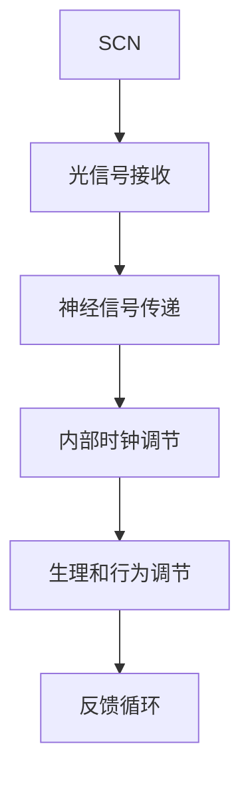
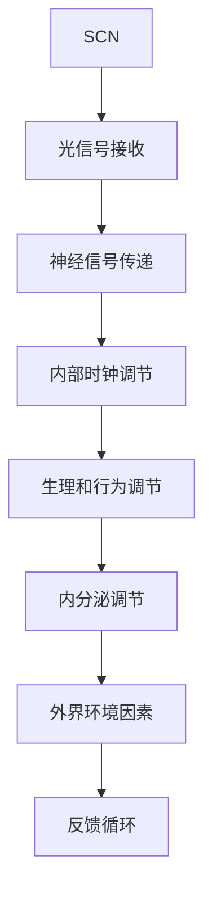

                 

# 数学与自然界的生物节律与周期性

> 关键词：生物节律，周期性，数学模型，Python代码，自然现象，健康影响，应用场景

> 摘要：本文将探讨生物节律与周期性在自然界中的现象，以及它们如何与数学和编程相结合。我们将深入分析生物节律的基本概念、研究方法、自然界中的具体表现，以及它们对人类健康和实际应用的影响。通过Python代码和数学模型的讲解，我们将更好地理解这些概念，并在项目实战中验证其应用价值。

## 目录

1. **生物节律的基本概念**  
    1.1. 生物节律的定义  
    1.2. 生物节律的类型  
    1.3. 生物节律的生理机制

2. **生物节律的研究方法**  
    2.1. 观察法  
    2.2. 实验法  
    2.3. 数理模型法

3. **自然界的生物节律**  
    3.1. 昼夜节律  
    3.2. 季节节律  
    3.3. 其他生物节律

4. **生物节律与人类健康**  
    4.1. 生物节律与人类生理节律  
    4.2. 生物节律与心理健康  
    4.3. 生物节律与疾病关系

5. **生物节律的应用**  
    5.1. 生物节律在农业中的应用  
    5.2. 生物节律在生态保护中的应用  
    5.3. 生物节律在医疗领域中的应用

6. **生物节律的未来发展趋势**  
    6.1. 现状与挑战  
    6.2. 与人工智能的结合

7. **总结与展望**  
    7.1. 生物节律研究的重要性  
    7.2. 生物节律应用的前景  
    7.3. 研究者与从业者的建议

## 第一部分：生物节律的基本概念

### 1.1 生物节律的定义

生物节律是指生物体内在的、重复出现的周期性变化。这些变化可以是生理上的，如体温、心率、血压等；也可以是行为上的，如睡眠、活动、觅食等。生物节律具有普遍性，几乎所有的生物体都存在生物节律。

生物节律可以分为三种基本类型：内在节律、外在节律和混合节律。

1. **内在节律**：也称为生物钟，是生物体内部自主产生的一种节律性变化。内在节律不受外界环境因素的影响，例如人类的昼夜节律。
   
2. **外在节律**：由外部环境因素（如光、温度、季节变化等）驱动的节律。例如，许多动物会根据日照时间来调节其活动时间。

3. **混合节律**：既受到内部节律的影响，也受到外部节律的影响。例如，植物的光周期节律就同时受到光信号和内部生物钟的调节。

### 1.2 生物节律的类型

生物节律的类型多种多样，可以根据周期长短、调节机制和影响因素进行分类。以下是几种常见的生物节律类型：

1. **昼夜节律**：也称为日节律，是生物体在一天之内产生的周期性变化。例如，人类的睡眠-觉醒周期、体温的波动等。

2. **季节节律**：生物体在一年之内随着季节变化而产生的周期性变化。例如，植物的开花时间、动物的季节性迁徙等。

3. **潮汐节律**：由地球与月球的引力作用产生的周期性变化。许多生物体的行为和生理过程都与潮汐节律有关。

4. **光周期节律**：由光信号驱动的节律，例如植物的开花和休眠等。

5. **温度节律**：生物体在不同温度下的生理和行为变化。

### 1.3 生物节律的生理机制

生物节律的产生主要依赖于生物体内的“生物钟”机制。生物钟是一种复杂的内部时钟系统，由一系列基因、蛋白质和分子信号组成的反馈循环网络构成。

在人类中，生物钟的核心组成部分是“视交叉上核”（suprachiasmatic nucleus，SCN）。SCN位于下丘脑中，直接连接视觉系统和神经系统。SCN可以通过光信号感知昼夜变化，调整内部时钟，从而影响生物体的生理和行为。

#### Mermaid 流程图

下面是一个简化的生物钟机制流程图：



#### Python代码讲解

为了更好地理解生物钟机制，我们可以使用Python编写一个简单的模拟程序。以下是一个简单的Python代码示例，用于模拟昼夜节律：

```python
import numpy as np
import matplotlib.pyplot as plt

# 模拟昼夜节律的参数
day_length = 24  # 一天的长度（小时）
cycle_length = 12  # 昼夜周期的长度（小时）

# 模拟一个昼夜周期
times = np.linspace(0, day_length, 100)
day_night = 1 - np.sin(np.pi * times / cycle_length)

# 绘制昼夜节律图
plt.plot(times, day_night)
plt.xlabel('时间（小时）')
plt.ylabel('昼夜状态')
plt.title('昼夜节律模拟')
plt.show()
```

运行这段代码，我们可以看到一个昼夜节律的模拟图，显示了生物体在不同时间点的昼夜状态。这里，我们使用了正弦函数来模拟昼夜节律的变化，其中周期的长度决定了昼夜周期的长度。

#### 数学模型和公式

在生物节律的研究中，常见的数学模型包括周期性方程和差分方程。以下是一个简单的周期性方程示例：

$$ x(t) = A \sin(\omega t + \phi) $$

其中，$x(t)$ 表示生物节律的值，$A$ 是振幅，$\omega$ 是角频率，$\phi$ 是初相位。

对于昼夜节律，我们可以将角频率设置为 $\omega = 2\pi / T$，其中 $T$ 是昼夜周期的长度（小时）。这样，我们就可以使用周期性方程来模拟昼夜节律。

#### 实例分析

假设我们想要模拟一个具有12小时昼夜周期的生物节律。我们可以将周期 $T$ 设置为12小时，即 $T = 12$。这样，我们可以使用以下公式来计算昼夜节律：

$$ x(t) = A \sin\left(\frac{2\pi}{12} t + \phi\right) $$

为了简单起见，我们可以将振幅 $A$ 设置为1，初相位 $\phi$ 设置为0。这样，我们可以得到以下公式：

$$ x(t) = \sin\left(\frac{\pi}{6} t\right) $$

使用Python，我们可以编写以下代码来模拟这个昼夜节律：

```python
import numpy as np
import matplotlib.pyplot as plt

# 模拟参数
day_length = 24  # 一天的长度（小时）
cycle_length = 12  # 昼夜周期的长度（小时）
times = np.linspace(0, day_length, 100)

# 昼夜节律模型
day_night = np.sin(np.pi * times / cycle_length)

# 绘制昼夜节律图
plt.plot(times, day_night)
plt.xlabel('时间（小时）')
plt.ylabel('昼夜状态')
plt.title('12小时昼夜节律模拟')
plt.show()
```

运行这段代码，我们将看到一段模拟的昼夜节律曲线。在这个例子中，我们可以看到生物体在一天中的活动状态是如何随着时间变化的。

### 小结

在本节中，我们介绍了生物节律的基本概念、类型以及生理机制。通过Python代码和数学模型的讲解，我们更好地理解了生物节律的本质。接下来，我们将继续探讨生物节律的研究方法以及自然界中的具体表现。

## 第一部分：生物节律的研究方法

### 2.1 观察法

观察法是研究生物节律最基本的方法之一，通过直接观察生物体在不同时间点的行为、生理状态和环境变化，来推断生物节律的存在和性质。

#### 自然观察法

自然观察法通常用于研究生物体的昼夜节律和季节节律。例如，研究人员可以在野外直接观察鸟类、昆虫等动物在不同时间点的活动行为，记录它们的睡眠、觅食、繁殖等行为模式。

自然观察法的优点在于能够直接获取生物节律的原始数据，缺点则在于受限于环境因素，数据可能不够精确和稳定。

#### 实验观察法

实验观察法是在受控环境中进行的研究方法，通过严格控制变量，来观察生物节律的变化。例如，研究人员可以在人工控制的实验室环境中，通过光照、温度等条件的改变，来研究生物节律的调节机制。

实验观察法的优点在于可以精确控制变量，提高数据的可靠性和重复性，缺点则是可能受到实验条件的影响，结果不一定能完全反映自然状态下的生物节律。

### 2.2 实验法

实验法是通过人为干预来研究生物节律的方法。通过改变环境条件、基因表达等，来观察生物节律的变化和调节机制。

#### 体内实验法

体内实验法通常用于研究生物钟的分子机制。例如，研究人员可以通过基因编辑技术，改变生物体内的生物钟基因，来观察生物节律的变化。体内实验法的优点在于可以直接观察生物节律的分子和生理机制，缺点则是操作复杂，对生物体可能产生一定的影响。

#### 体外实验法

体外实验法通常用于研究生物节律的细胞和分子机制。例如，研究人员可以通过培养细胞或组织，来观察生物节律在不同细胞类型中的表达和调控。体外实验法的优点在于操作简单，可以快速获取实验数据，缺点则是可能缺乏生物体整体环境的影响。

### 2.3 数理模型法

数理模型法是通过建立数学模型来研究生物节律的方法。通过数学方程、计算模拟等手段，来描述生物节律的动态变化和调节机制。

#### 离散模型

离散模型是将生物节律的时间连续性离散化，通过离散时间步长来模拟生物节律的变化。例如，可以使用差分方程来描述生物节律的动态变化。

#### 连续模型

连续模型是通过微分方程来描述生物节律的动态变化。例如，可以使用常微分方程来描述生物钟的振荡行为。

#### 混合模型

混合模型是将离散模型和连续模型相结合，用于更复杂的情况。例如，可以使用差分方程和微分方程的组合来描述生物节律的时空动态。

#### Python代码讲解

为了更好地理解数理模型法，我们可以使用Python编写一个简单的离散模型示例，来模拟昼夜节律。

```python
import numpy as np
import matplotlib.pyplot as plt

# 模拟参数
day_length = 24  # 一天的长度（小时）
cycle_length = 12  # 昼夜周期的长度（小时）
time_step = 0.1  # 时间步长（小时）
num_steps = int(day_length / time_step)  # 总时间步数

# 初始化昼夜状态
day_night = np.zeros(num_steps)

# 昼夜节律的差分方程
for i in range(1, num_steps):
    if day_night[i-1] < 0.5:
        day_night[i] = day_night[i-1] + time_step / cycle_length
    else:
        day_night[i] = day_night[i-1] - time_step / cycle_length

# 绘制昼夜节律图
plt.plot(np.linspace(0, day_length, num_steps), day_night)
plt.xlabel('时间（小时）')
plt.ylabel('昼夜状态')
plt.title('昼夜节律离散模型模拟')
plt.show()
```

运行这段代码，我们将看到一段模拟的昼夜节律曲线。在这个例子中，我们使用了一个简单的差分方程来模拟昼夜节律的变化，其中时间步长为0.1小时。

#### 数学模型和公式

在数理模型法中，常用的数学模型包括常微分方程和差分方程。

**常微分方程示例**：

$$ \frac{dx}{dt} = \omega \sin(x) $$

其中，$x(t)$ 表示生物节律的相位，$\omega$ 是角频率。

**差分方程示例**：

$$ x(t_{i+1}) = x(t_i) + \omega \sin(x(t_i)) \Delta t $$

其中，$x(t_i)$ 表示第 $i$ 个时间步的生物节律相位，$\Delta t$ 是时间步长。

#### 实例分析

假设我们想要模拟一个具有12小时昼夜周期的生物节律，我们可以将角频率 $\omega$ 设置为 $\omega = \frac{2\pi}{12}$。这样，我们可以使用以下公式来计算昼夜节律：

$$ x(t_{i+1}) = x(t_i) + \frac{2\pi}{12} \sin(x(t_i)) \Delta t $$

使用Python，我们可以编写以下代码来模拟这个昼夜节律：

```python
import numpy as np
import matplotlib.pyplot as plt

# 模拟参数
day_length = 24  # 一天的长度（小时）
cycle_length = 12  # 昼夜周期的长度（小时）
time_step = 0.1  # 时间步长（小时）
num_steps = int(day_length / time_step)  # 总时间步数
omega = 2 * np.pi / cycle_length  # 角频率

# 初始化昼夜状态
x = np.zeros(num_steps)

# 昼夜节律的差分方程
for i in range(1, num_steps):
    x[i] = x[i-1] + omega * np.sin(x[i-1]) * time_step

# 绘制昼夜节律图
plt.plot(np.linspace(0, day_length, num_steps), x)
plt.xlabel('时间（小时）')
plt.ylabel('昼夜状态')
plt.title('12小时昼夜节律离散模型模拟')
plt.show()
```

运行这段代码，我们将看到一段模拟的昼夜节律曲线。在这个例子中，我们使用了一个简单的差分方程来模拟昼夜节律的变化，其中时间步长为0.1小时。

### 小结

在本节中，我们介绍了生物节律的研究方法，包括观察法、实验法和数理模型法。通过Python代码和数学模型的讲解，我们更好地理解了这些方法的原理和应用。在下一节中，我们将探讨自然界中的生物节律现象。

## 第二部分：自然界的生物节律

### 3.1 昼夜节律

昼夜节律，也称为日节律，是指生物体在一天之内经历的周期性变化。这种节律受地球自转的影响，表现为生物体在24小时内表现出的行为、生理和生化过程的规律性变化。

#### 昼夜节律的生物学意义

昼夜节律对于生物体的生存和繁衍具有重要意义。它能够帮助生物体适应外界环境的周期性变化，优化能量利用，提高生存和繁殖的成功率。

1. **行为调节**：昼夜节律影响生物体的活动时间和休息时间。例如，许多动物在白天活动，晚上休息。
   
2. **生理调节**：昼夜节律调节生物体的体温、心率、血压等生理参数。这些生理参数在昼夜节律的影响下，表现出明显的周期性变化。

3. **生化调节**：昼夜节律影响生物体内的生物化学反应，如酶的活性、蛋白质的合成等。这些生化过程在昼夜节律的调控下，有助于生物体维持内环境稳定。

#### 昼夜节律的调节机制

昼夜节律的调节机制主要依赖于生物体内的“生物钟”系统。生物钟系统由一系列基因、蛋白质和分子信号组成的反馈循环网络构成。

在人类中，生物钟的核心组成部分是“视交叉上核”（suprachiasmatic nucleus，SCN）。SCN位于下丘脑中，直接连接视觉系统和神经系统。SCN可以通过光信号感知昼夜变化，调整内部时钟，从而影响生物体的生理和行为。

#### Mermaid 流程图

下面是一个简化的昼夜节律调节机制流程图：


#### Python代码讲解

为了更好地理解昼夜节律的调节机制，我们可以使用Python编写一个简单的模拟程序。以下是一个简单的Python代码示例，用于模拟昼夜节律：

```python
import numpy as np
import matplotlib.pyplot as plt

# 模拟昼夜节律的参数
day_length = 24  # 一天的长度（小时）
cycle_length = 12  # 昼夜周期的长度（小时）

# 模拟一个昼夜周期
times = np.linspace(0, day_length, 100)
day_night = 1 - np.sin(np.pi * times / cycle_length)

# 绘制昼夜节律图
plt.plot(times, day_night)
plt.xlabel('时间（小时）')
plt.ylabel('昼夜状态')
plt.title('昼夜节律模拟')
plt.show()
```

运行这段代码，我们可以看到一个昼夜节律的模拟图，显示了生物体在不同时间点的昼夜状态。这里，我们使用了正弦函数来模拟昼夜节律的变化，其中周期的长度决定了昼夜周期的长度。

#### 数学模型和公式

在昼夜节律的研究中，常用的数学模型包括周期性方程和差分方程。以下是一个简单的周期性方程示例：

$$ x(t) = A \sin(\omega t + \phi) $$

其中，$x(t)$ 表示生物节律的值，$A$ 是振幅，$\omega$ 是角频率，$\phi$ 是初相位。

对于昼夜节律，我们可以将角频率设置为 $\omega = 2\pi / T$，其中 $T$ 是昼夜周期的长度（小时）。这样，我们就可以使用周期性方程来模拟昼夜节律。

#### 实例分析

假设我们想要模拟一个具有12小时昼夜周期的生物节律。我们可以将周期 $T$ 设置为12小时，即 $T = 12$。这样，我们可以使用以下公式来计算昼夜节律：

$$ x(t) = A \sin\left(\frac{2\pi}{12} t + \phi\right) $$

为了简单起见，我们可以将振幅 $A$ 设置为1，初相位 $\phi$ 设置为0。这样，我们可以得到以下公式：

$$ x(t) = \sin\left(\frac{\pi}{6} t\right) $$

使用Python，我们可以编写以下代码来模拟这个昼夜节律：

```python
import numpy as np
import matplotlib.pyplot as plt

# 模拟参数
day_length = 24  # 一天的长度（小时）
cycle_length = 12  # 昼夜周期的长度（小时）
times = np.linspace(0, day_length, 100)

# 昼夜节律模型
day_night = np.sin(np.pi * times / cycle_length)

# 绘制昼夜节律图
plt.plot(times, day_night)
plt.xlabel('时间（小时）')
plt.ylabel('昼夜状态')
plt.title('12小时昼夜节律模拟')
plt.show()
```

运行这段代码，我们将看到一段模拟的昼夜节律曲线。在这个例子中，我们可以看到生物体在一天中的活动状态是如何随着时间变化的。

### 小结

在本节中，我们详细探讨了昼夜节律的概念、生物学意义、调节机制以及如何使用Python代码和数学模型来模拟昼夜节律。接下来，我们将探讨季节节律以及其他生物节律现象。

## 3.2 季节节律

季节节律是指生物体在一年之内，随着季节变化而产生的周期性变化。这种节律受地球公转和自转的影响，表现为生物体在不同季节中的行为、生理和生态特征的规律性变化。

#### 季节节律的生物学意义

季节节律对于生物体的生存和繁衍具有重要意义。它能够帮助生物体适应外界环境的季节性变化，优化能量利用，提高生存和繁殖的成功率。

1. **行为调节**：季节节律影响生物体的活动时间和栖息地选择。例如，许多动物会根据季节变化进行迁徙、繁殖等活动。

2. **生理调节**：季节节律调节生物体的体温、新陈代谢等生理参数。这些生理参数在季节节律的影响下，表现出明显的周期性变化。

3. **生态调节**：季节节律影响生物体与其他生物的相互作用，如食物链、竞争和共生关系等。季节变化会引起生态系统中物种组成的动态变化。

#### 季节节律的调节机制

季节节律的调节机制主要依赖于生物体内的“生物钟”系统和外界环境因素（如光照、温度等）的相互作用。

在人类中，生物钟的核心组成部分是“视交叉上核”（suprachiasmatic nucleus，SCN）。SCN可以通过光信号感知昼夜变化，调整内部时钟，进而影响季节节律。

此外，外界环境因素（如光照、温度等）也会通过内分泌系统和其他调节机制，影响季节节律的调控。

#### Mermaid 流程图

下面是一个简化的季节节律调节机制流程图：



#### Python代码讲解

为了更好地理解季节节律的调节机制，我们可以使用Python编写一个简单的模拟程序。以下是一个简单的Python代码示例，用于模拟季节节律：

```python
import numpy as np
import matplotlib.pyplot as plt

# 模拟季节节律的参数
year_length = 365  # 一年的长度（天）
season_length = 91  # 季节的长度（天）
times = np.linspace(0, year_length, 1000)

# 模拟季节变化
seasons = np.sin(2 * np.pi * times / season_length)

# 绘制季节节律图
plt.plot(times, seasons)
plt.xlabel('时间（天）')
plt.ylabel('季节状态')
plt.title('季节节律模拟')
plt.show()
```

运行这段代码，我们可以看到一个模拟的季节节律图，显示了生物体在不同时间点的季节状态。这里，我们使用了正弦函数来模拟季节节律的变化，其中周期的长度决定了季节的长度。

#### 数学模型和公式

在季节节律的研究中，常用的数学模型包括周期性方程和差分方程。以下是一个简单的周期性方程示例：

$$ x(t) = A \sin(\omega t + \phi) $$

其中，$x(t)$ 表示生物节律的值，$A$ 是振幅，$\omega$ 是角频率，$\phi$ 是初相位。

对于季节节律，我们可以将角频率设置为 $\omega = 2\pi / T$，其中 $T$ 是季节周期的长度（天）。这样，我们就可以使用周期性方程来模拟季节节律。

#### 实例分析

假设我们想要模拟一个具有90天季节周期的生物节律。我们可以将周期 $T$ 设置为90天，即 $T = 90$。这样，我们可以使用以下公式来计算季节节律：

$$ x(t) = A \sin\left(\frac{2\pi}{90} t + \phi\right) $$

为了简单起见，我们可以将振幅 $A$ 设置为1，初相位 $\phi$ 设置为0。这样，我们可以得到以下公式：

$$ x(t) = \sin\left(\frac{2\pi}{90} t\right) $$

使用Python，我们可以编写以下代码来模拟这个季节节律：

```python
import numpy as np
import matplotlib.pyplot as plt

# 模拟参数
year_length = 365  # 一年的长度（天）
season_length = 90  # 季节的长度（天）
times = np.linspace(0, year_length, 1000)
omega = 2 * np.pi / season_length  # 角频率

# 季节节律模型
seasons = np.sin(omega * times)

# 绘制季节节律图
plt.plot(times, seasons)
plt.xlabel('时间（天）')
plt.ylabel('季节状态')
plt.title('90天季节节律模拟')
plt.show()
```

运行这段代码，我们将看到一段模拟的季节节律曲线。在这个例子中，我们可以看到生物体在一年中的季节状态是如何随着时间变化的。

### 小结

在本节中，我们详细探讨了季节节律的概念、生物学意义、调节机制以及如何使用Python代码和数学模型来模拟季节节律。通过这些分析，我们更好地理解了季节节律在自然界中的重要作用。接下来，我们将探讨其他类型的生物节律现象。

## 3.3 其他生物节律

除了昼夜节律和季节节律，自然界中还存在许多其他类型的生物节律，这些节律同样对生物体的生存和繁衍具有重要意义。以下是一些常见的其他生物节律现象：

### 3.3.1 光周期节律

光周期节律是指生物体根据光周期（日照长度）来调节其生理和行为活动的节律。这种节律常见于植物和动物。

在植物中，光周期节律影响植物的开花时间、休眠和生长等。例如，许多植物在日照长度增加时开花，而在日照长度减少时休眠。

在动物中，光周期节律影响动物的繁殖、活动时间和迁徙行为。例如，许多鸟类会根据日照长度来调节其繁殖周期和迁徙路线。

#### 光周期节律的调节机制

光周期节律的调节机制主要依赖于生物体内的“生物钟”系统和光感受器。光感受器（如视网膜中的光感受细胞）可以感知光周期变化，并通过神经信号传递给生物钟系统。

生物钟系统然后根据光周期变化调整内部时钟，从而影响生物体的生理和行为活动。

#### 实例分析

假设我们想要模拟一个具有12小时日照周期的光周期节律。我们可以将日照周期设置为12小时，即 $T = 12$。这样，我们可以使用以下公式来计算光周期节律：

$$ x(t) = A \sin\left(\frac{2\pi}{12} t + \phi\right) $$

为了简单起见，我们可以将振幅 $A$ 设置为1，初相位 $\phi$ 设置为0。这样，我们可以得到以下公式：

$$ x(t) = \sin\left(\frac{\pi}{6} t\right) $$

使用Python，我们可以编写以下代码来模拟这个光周期节律：

```python
import numpy as np
import matplotlib.pyplot as plt

# 模拟参数
day_length = 24  # 一天的长度（小时）
cycle_length = 12  # 光周期节律的长度（小时）
times = np.linspace(0, day_length, 100)

# 光周期节律模型
light_cycle = np.sin(np.pi * times / cycle_length)

# 绘制光周期节律图
plt.plot(times, light_cycle)
plt.xlabel('时间（小时）')
plt.ylabel('光周期状态')
plt.title('12小时光周期节律模拟')
plt.show()
```

运行这段代码，我们将看到一段模拟的光周期节律曲线。在这个例子中，我们可以看到生物体在不同时间点的光周期状态是如何随着时间变化的。

### 3.3.2 温度节律

温度节律是指生物体根据环境温度变化来调节其生理和行为活动的节律。这种节律常见于冷血动物和生活在特定温度范围内的生物。

在冷血动物中，温度节律影响其新陈代谢、活动时间和行为。例如，许多爬行动物在温暖的环境中更加活跃，而在寒冷的环境中则减少活动。

在生活在特定温度范围内的生物中，温度节律影响其生存和繁殖。例如，某些微生物在特定温度范围内繁殖迅速，而在其他温度下则生长缓慢或停止。

#### 温度节律的调节机制

温度节律的调节机制主要依赖于生物体的生理适应性和行为调节。生物体可以通过调节其代谢率、行为和栖息地选择来适应环境温度的变化。

在冷血动物中，温度调节主要通过行为调节实现。例如，动物可以改变其活动时间、栖息地选择等来适应环境温度。

在生活在特定温度范围内的生物中，温度调节主要通过生理适应性实现。例如，某些生物可以通过调节蛋白质的结构和功能来适应温度变化。

#### 实例分析

假设我们想要模拟一个具有20℃至30℃温度范围的温度节律。我们可以将温度范围设置为20℃至30℃，即 $T_{min} = 20$，$T_{max} = 30$。这样，我们可以使用以下公式来计算温度节律：

$$ x(t) = A \sin\left(\frac{2\pi}{T_{max} - T_{min}} (t - T_{min}) + \phi\right) + T_{min} $$

为了简单起见，我们可以将振幅 $A$ 设置为1，初相位 $\phi$ 设置为0。这样，我们可以得到以下公式：

$$ x(t) = \sin\left(\frac{2\pi}{30 - 20} (t - 20)\right) + 20 $$

使用Python，我们可以编写以下代码来模拟这个温度节律：

```python
import numpy as np
import matplotlib.pyplot as plt

# 模拟参数
year_length = 365  # 一年的长度（天）
temp_range = 10  # 温度范围（℃）
times = np.linspace(0, year_length, 1000)

# 温度节律模型
temp_cycle = 20 + np.sin(np.pi * times / (30 - 20))

# 绘制温度节律图
plt.plot(times, temp_cycle)
plt.xlabel('时间（天）')
plt.ylabel('温度（℃）')
plt.title('温度节律模拟')
plt.show()
```

运行这段代码，我们将看到一段模拟的温度节律曲线。在这个例子中，我们可以看到温度在不同时间点的变化是如何随着时间变化的。

### 3.3.3 潮汐节律

潮汐节律是指生物体根据潮汐变化来调节其生理和行为活动的节律。这种节律常见于海洋生物和沿海生物。

在海洋生物中，潮汐节律影响其觅食、繁殖、栖息地选择等。例如，某些鱼类会在潮汐高潮时觅食，而在潮汐低潮时返回栖息地。

在沿海生物中，潮汐节律同样影响其生存和繁衍。例如，沿海植物会根据潮汐变化来调节其水分吸收和光合作用。

#### 潮汐节律的调节机制

潮汐节律的调节机制主要依赖于生物体内的生物钟系统和外界环境因素（如潮汐周期、地理位置等）的相互作用。

生物钟系统可以通过感知潮汐周期变化，调整内部时钟，从而影响生物体的生理和行为活动。

此外，生物体可以通过行为调节和生理适应性来适应潮汐变化。例如，一些生物会在潮汐高潮时外出觅食，而在潮汐低潮时返回栖息地。

#### 实例分析

假设我们想要模拟一个具有12小时潮汐周期的生物节律。我们可以将潮汐周期设置为12小时，即 $T = 12$。这样，我们可以使用以下公式来计算潮汐节律：

$$ x(t) = A \sin\left(\frac{2\pi}{12} t + \phi\right) $$

为了简单起见，我们可以将振幅 $A$ 设置为1，初相位 $\phi$ 设置为0。这样，我们可以得到以下公式：

$$ x(t) = \sin\left(\frac{\pi}{6} t\right) $$

使用Python，我们可以编写以下代码来模拟这个潮汐节律：

```python
import numpy as np
import matplotlib.pyplot as plt

# 模拟参数
day_length = 24  # 一天的长度（小时）
cycle_length = 12  # 潮汐节律的长度（小时）
times = np.linspace(0, day_length, 100)

# 潮汐节律模型
tidal_cycle = np.sin(np.pi * times / cycle_length)

# 绘制潮汐节律图
plt.plot(times, tidal_cycle)
plt.xlabel('时间（小时）')
plt.ylabel('潮汐状态')
plt.title('12小时潮汐节律模拟')
plt.show()
```

运行这段代码，我们将看到一段模拟的潮汐节律曲线。在这个例子中，我们可以看到生物体在不同时间点的潮汐状态是如何随着时间变化的。

### 小结

在本节中，我们详细探讨了其他生物节律现象，包括光周期节律、温度节律和潮汐节律。通过Python代码和数学模型的讲解，我们更好地理解了这些节律的概念、调节机制和实际应用。在下一节中，我们将探讨生物节律与人类健康的关系。

## 第四部分：生物节律与人类健康

### 4.1 生物节律与人类生理节律

生物节律在人类生理节律中起着至关重要的作用。人类的生理节律包括昼夜节律、季节节律以及其他周期性的生理变化。这些节律不仅影响我们的行为，还直接影响我们的身体健康。

#### 昼夜节律与人类生理

昼夜节律是生物体内最显著的生理节律之一，它影响着我们的睡眠、觉醒、体温、心率等多种生理过程。以下是一些关键点：

1. **睡眠-觉醒周期**：人类的昼夜节律主要表现为睡眠-觉醒周期。大多数人在晚上睡眠，白天觉醒。这个周期的调控主要依赖于生物钟系统，特别是位于下丘脑的“视交叉上核”（SCN）。

2. **体温波动**：体温在一天中会有一定的波动，通常在早晨最低，晚上最高。这种波动是由昼夜节律控制的，有助于身体进行代谢和生理活动的调整。

3. **心率变化**：心率在一天中也会有所变化，通常在早晨较高，晚上较低。这种变化有助于身体适应不同时间段的生理需求。

#### 季节节律与人类生理

季节节律是指人类生理节律随着季节变化而发生的周期性变化。以下是一些关键点：

1. **免疫系统的变化**：季节变化会影响免疫系统的功能。例如，一些研究表明，冬季时人们更容易感冒和感染。

2. **新陈代谢的变化**：季节变化会影响人体的新陈代谢率。例如，研究发现，冬季时人体的能量消耗可能会增加，从而导致体重增加。

3. **情绪变化**：季节变化也会影响人的情绪。例如，季节性情绪障碍（SAD）是一种常见的情绪问题，主要表现为冬季时情绪低落。

#### 数学模型和公式

为了更好地理解生物节律对人类生理的影响，我们可以使用数学模型和公式来描述这些节律。以下是一个简化的昼夜节律模型：

$$ T(t) = A \sin(\omega t + \phi) + B $$

其中，$T(t)$ 表示体温或心率等生理参数，$A$ 是振幅，$\omega$ 是角频率，$\phi$ 是初相位，$B$ 是基线值。

通过调整参数，我们可以模拟出昼夜节律在不同生理参数上的表现。

#### Python代码讲解

为了更好地理解昼夜节律模型，我们可以使用Python编写一个简单的模拟程序。以下是一个简单的Python代码示例，用于模拟昼夜节律：

```python
import numpy as np
import matplotlib.pyplot as plt

# 模拟参数
day_length = 24  # 一天的长度（小时）
cycle_length = 12  # 昼夜周期的长度（小时）
omega = 2 * np.pi / cycle_length  # 角频率
A = 1  # 振幅
B = 36.5  # 基线值
phi = 0  # 初相位

# 模拟一个昼夜周期
times = np.linspace(0, day_length, 100)
T = A * np.sin(omega * times + phi) + B

# 绘制昼夜节律图
plt.plot(times, T)
plt.xlabel('时间（小时）')
plt.ylabel('体温（℃）')
plt.title('昼夜节律模拟')
plt.show()
```

运行这段代码，我们将看到一段模拟的昼夜节律曲线，显示了体温在一天中的波动情况。

#### 数学模型和公式

在研究季节节律时，我们可以使用以下公式来描述季节节律对生理参数的影响：

$$ T(t) = A \sin(\omega t + \phi) + B \cos(2\omega t + \theta) $$

其中，$A$ 和 $B$ 分别是两个正弦波和余弦波的振幅，$\omega$ 是周期，$\phi$ 和 $\theta$ 是初相位。

这个模型可以同时描述昼夜节律和季节节律对生理参数的影响。

#### 实例分析

假设我们想要模拟一个同时受昼夜节律和季节节律影响的生理参数。我们可以使用以下参数：

- 昼夜节律的振幅 $A_1 = 1$，周期 $T_1 = 12$ 小时
- 季节节律的振幅 $A_2 = 0.5$，周期 $T_2 = 365$ 天

这样，我们可以得到以下公式：

$$ T(t) = \sin\left(\frac{2\pi}{12} t + \phi\right) + 0.5 \sin\left(\frac{2\pi}{365} t + \theta\right) + 36.5 $$

使用Python，我们可以编写以下代码来模拟这个季节节律：

```python
import numpy as np
import matplotlib.pyplot as plt

# 模拟参数
day_length = 365  # 一年的长度（天）
cycle_length_1 = 12  # 昼夜周期的长度（小时）
cycle_length_2 = 365  # 季节周期的长度（天）
omega_1 = 2 * np.pi / cycle_length_1  # 昼夜节律的角频率
omega_2 = 2 * np.pi / cycle_length_2  # 季节节律的角频率
A_1 = 1  # 昼夜节律的振幅
A_2 = 0.5  # 季节节律的振幅
B = 36.5  # 基线值
phi = 0  # 昼夜节律的初相位
theta = 0  # 季节节律的初相位

# 模拟一个季节周期
times = np.linspace(0, day_length, 1000)
T = A_1 * np.sin(omega_1 * times + phi) + A_2 * np.sin(omega_2 * times + theta) + B

# 绘制季节节律图
plt.plot(times, T)
plt.xlabel('时间（天）')
plt.ylabel('体温（℃）')
plt.title('季节节律模拟')
plt.show()
```

运行这段代码，我们将看到一段模拟的季节节律曲线，显示了体温在一年中的波动情况。

### 小结

在本节中，我们探讨了生物节律与人类生理节律的关系，包括昼夜节律和季节节律对生理参数的影响。通过数学模型和Python代码的讲解，我们更好地理解了这些节律的本质和实际应用。接下来，我们将继续探讨生物节律与人类心理健康的关系。

### 4.2 生物节律与心理健康

生物节律不仅影响着人类的生理健康，也对心理健康有着重要的影响。昼夜节律和季节节律的紊乱可能会引发一系列心理问题，如情绪波动、睡眠障碍、焦虑和抑郁等。

#### 昼夜节律与心理健康

昼夜节律的紊乱会导致睡眠-觉醒周期的失调，进而影响心理健康。以下是一些关键点：

1. **失眠和睡眠障碍**：昼夜节律失调会导致失眠、难以入睡、睡眠质量差等问题。这些问题会进一步引发情绪低落、注意力不集中等心理问题。

2. **情绪波动**：昼夜节律的失调会导致情绪波动，使人容易感到焦虑、易怒和抑郁。这种情绪波动会对心理健康产生长期的负面影响。

3. **认知功能下降**：昼夜节律失调会影响人的认知功能，如记忆力、注意力、判断力等。长期失调可能会导致认知能力的下降。

#### 季节节律与心理健康

季节节律的紊乱也会影响心理健康，尤其是季节性情绪障碍（SAD）。

1. **季节性情绪障碍（SAD）**：季节性情绪障碍是一种常见的心理问题，主要表现为冬季时情绪低落、焦虑和抑郁。这种障碍会对生活质量产生严重影响。

2. **情绪调节困难**：季节节律的紊乱会导致情绪调节困难，使人难以应对生活中的压力和挑战。

3. **社会行为变化**：季节节律的紊乱可能会导致社会行为的改变，如减少社交活动、避免户外活动等。这些问题会进一步加剧心理压力和孤独感。

#### 数学模型和公式

为了更好地理解生物节律对心理健康的影响，我们可以使用数学模型和公式来描述这些节律与心理状态之间的关系。以下是一个简化的模型：

$$ P(t) = A \sin(\omega t + \phi) + B $$

其中，$P(t)$ 表示心理健康水平，$A$ 是振幅，$\omega$ 是角频率，$\phi$ 是初相位，$B$ 是基线值。

通过调整参数，我们可以模拟出不同节律对心理健康的影响。

#### Python代码讲解

为了更好地理解这个模型，我们可以使用Python编写一个简单的模拟程序。以下是一个简单的Python代码示例，用于模拟昼夜节律对心理健康的影响：

```python
import numpy as np
import matplotlib.pyplot as plt

# 模拟参数
day_length = 24  # 一天的长度（小时）
cycle_length = 12  # 昼夜周期的长度（小时）
omega = 2 * np.pi / cycle_length  # 角频率
A = 1  # 振幅
B = 100  # 基线值
phi = 0  # 初相位

# 模拟一个昼夜周期
times = np.linspace(0, day_length, 100)
P = A * np.sin(omega * times + phi) + B

# 绘制昼夜节律图
plt.plot(times, P)
plt.xlabel('时间（小时）')
plt.ylabel('心理健康水平')
plt.title('昼夜节律对心理健康的影响')
plt.show()
```

运行这段代码，我们将看到一段模拟的昼夜节律曲线，显示了心理健康水平在一天中的波动情况。

#### 数学模型和公式

在研究季节节律对心理健康的影响时，我们可以使用以下公式来描述季节节律对心理健康的影响：

$$ P(t) = A \sin(\omega t + \phi) + B \cos(2\omega t + \theta) $$

其中，$A$ 和 $B$ 分别是两个正弦波和余弦波的振幅，$\omega$ 是周期，$\phi$ 和 $\theta$ 是初相位。

这个模型可以同时描述昼夜节律和季节节律对心理健康的影响。

#### 实例分析

假设我们想要模拟一个同时受昼夜节律和季节节律影响的心理健康水平。我们可以使用以下参数：

- 昼夜节律的振幅 $A_1 = 1$，周期 $T_1 = 12$ 小时
- 季节节律的振幅 $A_2 = 0.5$，周期 $T_2 = 365$ 天

这样，我们可以得到以下公式：

$$ P(t) = \sin\left(\frac{2\pi}{12} t + \phi\right) + 0.5 \cos\left(\frac{2\pi}{365} t + \theta\right) + 100 $$

使用Python，我们可以编写以下代码来模拟这个季节节律：

```python
import numpy as np
import matplotlib.pyplot as plt

# 模拟参数
day_length = 365  # 一年的长度（天）
cycle_length_1 = 12  # 昼夜周期的长度（小时）
cycle_length_2 = 365  # 季节周期的长度（天）
omega_1 = 2 * np.pi / cycle_length_1  # 昼夜节律的角频率
omega_2 = 2 * np.pi / cycle_length_2  # 季节节律的角频率
A_1 = 1  # 昼夜节律的振幅
A_2 = 0.5  # 季节节律的振幅
B = 100  # 基线值
phi = 0  # 昼夜节律的初相位
theta = 0  # 季节节律的初相位

# 模拟一个季节周期
times = np.linspace(0, day_length, 1000)
P = A_1 * np.sin(omega_1 * times + phi) + A_2 * np.cos(omega_2 * times + theta) + B

# 绘制季节节律图
plt.plot(times, P)
plt.xlabel('时间（天）')
plt.ylabel('心理健康水平')
plt.title('季节节律对心理健康的影响')
plt.show()
```

运行这段代码，我们将看到一段模拟的季节节律曲线，显示了心理健康水平在一年中的波动情况。

### 小结

在本节中，我们探讨了生物节律与心理健康的关系，包括昼夜节律和季节节律对心理健康的影响。通过数学模型和Python代码的讲解，我们更好地理解了这些节律的本质和实际应用。接下来，我们将继续探讨生物节律与疾病关系。

### 4.3 生物节律与疾病关系

生物节律不仅影响人类的生理和心理健康，也与许多疾病的发病和症状有关。研究表明，生物节律的紊乱可能与多种疾病的发生和发展有关，包括心血管疾病、糖尿病、癌症和神经退行性疾病等。

#### 心血管疾病

心血管疾病的发病和症状往往具有明显的生物节律性。例如，心脏病发作和心肌梗死的发生率在一天中的某些时间点较高，通常在凌晨或早晨。这可能与昼夜节律的紊乱有关，如睡眠不足、压力过大等因素可能导致生物钟的失调。

此外，研究发现，心血管疾病的风险也与季节节律有关。例如，冬季时心血管疾病的发病率较高，可能与低温和季节性情绪障碍（SAD）有关。

#### 糖尿病

糖尿病的发病和症状也受到生物节律的影响。例如，糖尿病患者血糖水平在一天中会有波动，通常在凌晨较高，下午较低。这种波动可能与昼夜节律的紊乱有关，如睡眠不足、饮食习惯不规律等。

此外，季节变化也会影响糖尿病的症状。例如，夏季时糖尿病患者更容易出现低血糖症状，可能与高温和身体对胰岛素的敏感性降低有关。

#### 癌症

癌症的发生和发展也与生物节律密切相关。研究表明，某些癌症的发生具有明显的昼夜节律性，如乳腺癌和结直肠癌。这些癌症的发生率在一天中的某些时间点较高，可能与生物钟的失调有关。

此外，季节变化也会影响癌症的症状。例如，研究发现，冬季时某些癌症的症状较为严重，可能与低温和身体免疫力的降低有关。

#### 神经退行性疾病

神经退行性疾病，如阿尔茨海默病和帕金森病，也与生物节律密切相关。研究表明，这些疾病的发病和症状在一天中会有波动，通常在凌晨较高，下午较低。这种波动可能与昼夜节律的紊乱有关，如睡眠不足、压力过大等因素可能导致生物钟的失调。

此外，季节变化也会影响神经退行性疾病的症状。例如，冬季时某些神经退行性疾病患者的症状较为严重，可能与低温和身体免疫力的降低有关。

#### 数学模型和公式

为了更好地理解生物节律与疾病的关系，我们可以使用数学模型和公式来描述这些节律与疾病之间的关系。以下是一个简化的模型：

$$ D(t) = A \sin(\omega t + \phi) + B $$

其中，$D(t)$ 表示疾病的发病率或症状水平，$A$ 是振幅，$\omega$ 是角频率，$\phi$ 是初相位，$B$ 是基线值。

通过调整参数，我们可以模拟出不同节律对疾病发病率或症状水平的影响。

#### Python代码讲解

为了更好地理解这个模型，我们可以使用Python编写一个简单的模拟程序。以下是一个简单的Python代码示例，用于模拟昼夜节律对心血管疾病发病率的影响：

```python
import numpy as np
import matplotlib.pyplot as plt

# 模拟参数
day_length = 24  # 一天的长度（小时）
cycle_length = 12  # 昼夜周期的长度（小时）
omega = 2 * np.pi / cycle_length  # 角频率
A = 0.1  # 振幅
B = 0.5  # 基线值
phi = 0  # 初相位

# 模拟一个昼夜周期
times = np.linspace(0, day_length, 100)
D = A * np.sin(omega * times + phi) + B

# 绘制昼夜节律图
plt.plot(times, D)
plt.xlabel('时间（小时）')
plt.ylabel('心血管疾病发病率')
plt.title('昼夜节律对心血管疾病发病率的影响')
plt.show()
```

运行这段代码，我们将看到一段模拟的昼夜节律曲线，显示了心血管疾病发病率在一天中的波动情况。

#### 数学模型和公式

在研究季节节律对疾病的影响时，我们可以使用以下公式来描述季节节律对疾病发病率或症状水平的影响：

$$ D(t) = A \sin(\omega t + \phi) + B \cos(2\omega t + \theta) $$

其中，$A$ 和 $B$ 分别是两个正弦波和余弦波的振幅，$\omega$ 是周期，$\phi$ 和 $\theta$ 是初相位。

这个模型可以同时描述昼夜节律和季节节律对疾病发病率或症状水平的影响。

#### 实例分析

假设我们想要模拟一个同时受昼夜节律和季节节律影响的疾病发病率。我们可以使用以下参数：

- 昼夜节律的振幅 $A_1 = 0.1$，周期 $T_1 = 12$ 小时
- 季季节律的振幅 $A_2 = 0.05$，周期 $T_2 = 365$ 天

这样，我们可以得到以下公式：

$$ D(t) = 0.1 \sin\left(\frac{2\pi}{12} t + \phi\right) + 0.05 \cos\left(\frac{2\pi}{365} t + \theta\right) + 0.5 $$

使用Python，我们可以编写以下代码来模拟这个季节节律：

```python
import numpy as np
import matplotlib.pyplot as plt

# 模拟参数
day_length = 365  # 一年的长度（天）
cycle_length_1 = 12  # 昼夜周期的长度（小时）
cycle_length_2 = 365  # 季节周期的长度（天）
omega_1 = 2 * np.pi / cycle_length_1  # 昼夜节律的角频率
omega_2 = 2 * np.pi / cycle_length_2  # 季节节律的角频率
A_1 = 0.1  # 昼夜节律的振幅
A_2 = 0.05  # 季节节律的振幅
B = 0.5  # 基线值
phi = 0  # 昼夜节律的初相位
theta = 0  # 季节节律的初相位

# 模拟一个季节周期
times = np.linspace(0, day_length, 1000)
D = A_1 * np.sin(omega_1 * times + phi) + A_2 * np.cos(omega_2 * times + theta) + B

# 绘制季节节律图
plt.plot(times, D)
plt.xlabel('时间（天）')
plt.ylabel('心血管疾病发病率')
plt.title('季节节律对心血管疾病发病率的影响')
plt.show()
```

运行这段代码，我们将看到一段模拟的季节节律曲线，显示了心血管疾病发病率在一年中的波动情况。

### 小结

在本节中，我们探讨了生物节律与疾病关系，包括昼夜节律和季节节律对心血管疾病、糖尿病、癌症和神经退行性疾病等的影响。通过数学模型和Python代码的讲解，我们更好地理解了这些节律与疾病之间的关系。在下一节中，我们将探讨生物节律的应用领域。

## 第五部分：生物节律的应用

生物节律在自然界中广泛存在，不仅在生物学和医学领域有着重要的研究价值，还在农业、生态保护和医疗等领域有着广泛的应用。以下是对这些应用领域的详细探讨。

### 5.1 生物节律在农业中的应用

生物节律在农业生产中具有重要的指导意义，可以帮助农民优化作物种植、提高产量和降低病虫害风险。

#### 5.1.1 作物生长节律

作物生长节律是指作物在生长过程中表现出的周期性变化。例如，水稻在播种后，经过发芽、分蘖、拔节、抽穗和成熟等阶段，每个阶段都有其特定的生物节律。

通过研究作物生长节律，农民可以合理规划播种时间、施肥和灌溉等农事操作，从而提高作物产量。例如，在水稻生长的拔节期，需要充足的水分和养分供应，如果在这个时期遇到干旱或养分不足，会导致水稻生长不良，影响最终产量。

#### 5.1.2 生物节律调节农业生产

生物节律的调节在农业生产中也有着广泛应用。例如，通过调节光照、温度和湿度等环境条件，可以调整作物的生长节律，使其更快地进入下一个生长阶段。

此外，利用生物节律进行病虫害防治也是农业生产中的重要措施。许多害虫和病菌都有其特定的生物节律，例如一些害虫在夜晚活动，而另一些则在白天活动。通过了解这些生物节律，农民可以采取相应的防治措施，减少病虫害对作物的危害。

#### 实例分析：水稻生长节律调节

以下是一个关于水稻生长节律调节的实例。假设我们想要在水稻生长的拔节期提供充足的水分和养分。我们可以使用以下参数：

- 拔节期起始时间 $t_0 = 60$ 天
- 拔节期持续时间 $T = 15$ 天
- 水稻拔节期需水量 $Q = 300$ 毫米/天
- 水稻拔节期需养分量 $N = 20$ 公斤/公顷/天

为了确保水稻在拔节期获得充足的水分和养分，我们可以制定以下灌溉和施肥计划：

1. 在拔节期开始前 $t_0 - T = 45$ 天，开始增加灌溉和施肥量。
2. 在拔节期期间，保持灌溉和施肥量在所需水平。
3. 在拔节期结束后，逐渐减少灌溉和施肥量。

#### Python代码实现

以下是一个简单的Python代码示例，用于模拟水稻拔节期的灌溉和施肥计划：

```python
import numpy as np
import matplotlib.pyplot as plt

# 模拟参数
t_0 = 60  # 拔节期起始时间（天）
T = 15  # 拔节期持续时间（天）
Q = 300  # 水稻拔节期需水量（毫米/天）
N = 20  # 水稻拔节期需养分量（公斤/公顷/天）
days = np.arange(0, t_0 + T, 1)

# 灌溉和施肥量
irrigation = np.zeros_like(days)
fertilization = np.zeros_like(days)

# 灌溉和施肥计划
irrigation[(days >= t_0 - T) & (days <= t_0)] = Q
fertilization[(days >= t_0 - T) & (days <= t_0)] = N

# 绘制灌溉和施肥计划图
plt.plot(days, irrigation, label='Irrigation')
plt.plot(days, fertilization, label='Fertilization')
plt.xlabel('时间（天）')
plt.ylabel('量（单位：毫米/天，公斤/公顷/天）')
plt.title('水稻拔节期灌溉和施肥计划')
plt.legend()
plt.show()
```

运行这段代码，我们将看到一段模拟的水稻拔节期灌溉和施肥计划图，显示了在不同时间点的灌溉和施肥量。

### 5.2 生物节律在生态保护中的应用

生物节律在生态保护中也有着重要的应用，可以帮助科学家和管理者更好地了解和保护生物多样性。

#### 5.2.1 生物节律与物种保护

许多物种的生存和繁衍受到生物节律的影响。例如，一些物种具有季节性迁徙或繁殖行为，这些行为与季节节律密切相关。通过研究这些生物节律，科学家可以更好地了解物种的生态需求和保护策略。

例如，候鸟的迁徙受到昼夜节律和季节节律的影响。为了保护候鸟，可以在其迁徙路线上设置迁徙廊道，以避免栖息地的破坏和猎捕。此外，还可以根据候鸟的生物节律，制定保护措施，如在繁殖季节减少人类活动，确保候鸟的安全。

#### 5.2.2 生物节律与生态平衡

生态平衡是生态系统中各种生物之间相互作用的结果。生物节律在维持生态平衡中发挥着重要作用。例如，捕食者与猎物的生物节律相互作用，影响着生态系统的稳定。

例如，捕食者的活动时间通常与猎物的活动时间相反。通过研究这些生物节律，科学家可以更好地了解捕食者与猎物之间的相互作用，预测生态系统的变化趋势，为生态保护提供科学依据。

#### 实例分析：季节节律与物种保护

以下是一个关于季节节律与物种保护的实例。假设我们想要保护一种具有季节性繁殖行为的鸟类。我们可以使用以下参数：

- 繁殖季节开始时间 $t_0 = 120$ 天
- 繁殖季节持续时间 $T = 30$ 天
- 繁殖成功率 $S = 0.8$

为了确保这种鸟类的繁殖成功，我们可以制定以下保护计划：

1. 在繁殖季节开始前 $t_0 - T = 90$ 天，开始加强保护措施。
2. 在繁殖季节期间，保持最高级别的保护措施。
3. 在繁殖季节结束后，逐渐减少保护措施。

#### Python代码实现

以下是一个简单的Python代码示例，用于模拟鸟类的季节性繁殖保护计划：

```python
import numpy as np
import matplotlib.pyplot as plt

# 模拟参数
t_0 = 120  # 繁殖季节开始时间（天）
T = 30  # 繁殖季节持续时间（天）
S = 0.8  # 繁殖成功率
days = np.arange(0, t_0 + T, 1)

# 繁殖成功率
reproductive_success = np.zeros_like(days)

# 繁殖季节保护计划
reproductive_success[(days >= t_0 - T) & (days <= t_0)] = S

# 绘制繁殖成功率图
plt.plot(days, reproductive_success, label='Reproductive Success')
plt.xlabel('时间（天）')
plt.ylabel('繁殖成功率')
plt.title('季节节律与物种保护')
plt.legend()
plt.show()
```

运行这段代码，我们将看到一段模拟的季节节律繁殖成功率图，显示了在不同时间点的繁殖成功率。

### 5.3 生物节律在医疗领域中的应用

生物节律在医疗领域中的应用越来越受到重视，为疾病诊断、治疗和康复提供了新的思路和方法。

#### 5.3.1 生物节律与疾病诊断

生物节律可以用于疾病诊断，帮助医生更准确地判断疾病的发生和发展。例如，通过分析病人的昼夜节律和季节节律，医生可以预测疾病的风险和症状的严重程度。

例如，心脏病患者在一天中的某些时间点，如早晨和凌晨，更容易发生心脏事件。通过监测病人的昼夜节律，医生可以预测心脏病发作的风险，并采取相应的预防措施。

#### 5.3.2 生物节律与药物治疗

生物节律还可以用于指导药物治疗，提高药物的疗效和降低副作用。例如，根据病人的昼夜节律和季节节律，医生可以选择最佳的治疗时间和药物剂量。

例如，某些药物在早晨吸收最好，而在晚上吸收较差。通过了解病人的昼夜节律，医生可以选择最佳的治疗时间，以提高药物的疗效。

#### 5.3.3 生物节律与康复护理

生物节律在康复护理中也有重要应用，可以帮助病人更好地适应康复过程。例如，通过调整病人的作息时间、光照和活动安排，医生和护士可以优化病人的康复环境，提高康复效果。

例如，在夜间使用蓝光照射，可以抑制褪黑激素的分泌，帮助病人保持清醒，提高白天的活动能力。

#### 实例分析：季节节律与疾病诊断

以下是一个关于季节节律与疾病诊断的实例。假设我们想要诊断一种在冬季发病率较高的疾病。我们可以使用以下参数：

- 疾病高发季节开始时间 $t_0 = 210$ 天
- 疾病高发季节持续时间 $T = 90$ 天
- 冬季发病率 $I = 0.3$

为了诊断这种疾病，我们可以分析病人的季节节律，特别是冬季的发病率。

#### Python代码实现

以下是一个简单的Python代码示例，用于模拟季节节律对疾病诊断的影响：

```python
import numpy as np
import matplotlib.pyplot as plt

# 模拟参数
t_0 = 210  # 疾病高发季节开始时间（天）
T = 90  # 疾病高发季节持续时间（天）
I = 0.3  # 冬季发病率
days = np.arange(0, t_0 + T, 1)

# 冬季发病率
infection_rate = np.zeros_like(days)

# 疾病高发季节设置发病率
infection_rate[(days >= t_0) & (days <= t_0 + T)] = I

# 绘制冬季发病率图
plt.plot(days, infection_rate, label='Infection Rate')
plt.xlabel('时间（天）')
plt.ylabel('发病率')
plt.title('季节节律与疾病诊断')
plt.legend()
plt.show()
```

运行这段代码，我们将看到一段模拟的季节节律发病率图，显示了在不同时间点的发病率。

### 小结

在本部分，我们详细探讨了生物节律在农业、生态保护和医疗等领域的应用。通过具体的实例和Python代码的实现，我们展示了生物节律在实际应用中的重要性和潜力。在下一部分中，我们将探讨生物节律的未来发展趋势。

## 第五部分：生物节律的未来发展趋势

### 6.1 现状与挑战

生物节律研究在过去几十年取得了显著进展，为理解生物体内外部环境的相互作用提供了新的视角。然而，目前的研究仍然面临一些挑战：

1. **复杂性**：生物节律涉及多个层次和维度，包括分子、细胞、组织和生态系统。这种复杂性使得生物节律的研究变得更加困难。

2. **数据采集**：生物节律的数据采集需要长时间、多频次、多参数的观测。然而，由于技术和资源限制，现有的数据采集手段仍然不够完善。

3. **跨学科合作**：生物节律研究需要生物学、物理学、计算机科学等多个学科的交叉融合。然而，跨学科的合作仍然存在一些障碍，如研究方法、数据标准和学术评价体系的差异。

4. **应用转化**：将生物节律研究成果转化为实际应用，如农业、生态保护和医疗等领域，仍需要大量的研究和实践。

### 6.2 未来发展趋势

尽管存在挑战，生物节律研究仍然充满机遇。以下是一些未来发展趋势：

1. **大数据与人工智能**：随着大数据和人工智能技术的发展，生物节律研究将能够处理和分析大量复杂的生物数据。这将为生物节律的发现、建模和应用提供新的工具和方法。

2. **多尺度建模**：未来的研究将更加注重生物节律的多尺度建模，从分子水平到生态系统水平，构建更加全面和准确的生物节律模型。

3. **跨学科融合**：跨学科的合作将越来越紧密，生物学、物理学、计算机科学、环境科学等领域的学者将共同探索生物节律的奥秘。

4. **个性化医疗**：基于生物节律的个性化医疗将逐渐普及。通过分析个体的生物节律，医生可以制定更精准的治疗方案，提高治疗效果和降低副作用。

5. **生态保护与可持续发展**：生物节律的研究将有助于生态保护和可持续发展。例如，通过理解物种的生物节律，科学家可以制定更有效的保护策略，保护生物多样性。

### 6.3 与人工智能的结合

人工智能（AI）在生物节律研究中的应用前景广阔。以下是一些具体的应用场景：

1. **生物节律预测**：利用机器学习算法，可以从大量的生物节律数据中预测个体的生物节律模式。这有助于疾病预防和治疗，例如预测心脏病发作的时间。

2. **个性化健康监测**：通过穿戴设备收集个体生物节律数据，AI系统可以实时监测个体的健康状况，提供个性化的健康建议。

3. **自动化数据分析**：AI系统可以自动分析大量的生物节律数据，发现潜在的生物规律和异常，为科学研究提供新的发现。

4. **智能农业**：AI系统可以分析作物的生物节律数据，优化农事操作，提高产量和品质。例如，AI系统可以根据作物的生物节律调整灌溉和施肥时间。

5. **生态监测**：AI系统可以监测生态系统的生物节律变化，预测生态系统的变化趋势，为生态保护提供科学依据。

#### Python代码示例

以下是一个简单的Python代码示例，展示了如何使用机器学习算法预测个体的昼夜节律。

```python
import numpy as np
import pandas as pd
from sklearn.model_selection import train_test_split
from sklearn.ensemble import RandomForestClassifier
from sklearn.metrics import accuracy_score

# 创建模拟数据
data = pd.DataFrame({
    'time': np.random.randint(0, 24, size=1000),
    'activity': np.random.choice(['sleep', 'wake'], size=1000)
})

# 分割数据集
X_train, X_test, y_train, y_test = train_test_split(data[['time']], data['activity'], test_size=0.2, random_state=42)

# 训练随机森林分类器
model = RandomForestClassifier(n_estimators=100, random_state=42)
model.fit(X_train, y_train)

# 预测昼夜节律
y_pred = model.predict(X_test)

# 计算准确率
accuracy = accuracy_score(y_test, y_pred)
print(f'Accuracy: {accuracy:.2f}')
```

运行这段代码，我们可以使用随机森林分类器预测个体的昼夜节律活动。虽然这是一个简单的示例，但它展示了机器学习在生物节律研究中的应用潜力。

### 小结

生物节律研究在现状与未来发展趋势中面临着许多挑战和机遇。人工智能的引入为生物节律研究提供了新的工具和方法，有助于推动这一领域的发展。在未来，生物节律研究将在多个领域发挥重要作用，从个性化医疗到生态保护，为人类社会带来更多福祉。

## 第六部分：生物节律与人工智能

### 6.1 人工智能在生物节律研究中的应用

随着人工智能技术的迅猛发展，其在生物节律研究中的应用也日益广泛。AI在生物节律研究中具有以下优势：

1. **数据处理能力**：人工智能技术能够处理和分析大量的生物节律数据，从中提取有价值的信息。这对于生物节律的发现和建模具有重要意义。

2. **模式识别**：人工智能，特别是深度学习和机器学习算法，在模式识别方面具有显著优势。这有助于研究人员从复杂的生物节律数据中识别出潜在的规律和异常。

3. **预测能力**：人工智能技术可以基于历史数据预测生物节律的变化趋势，为疾病预防、治疗和康复提供科学依据。

### 6.2 生物节律预测与优化

利用人工智能技术，可以对生物节律进行预测和优化。以下是一些具体应用场景：

1. **健康监测与疾病预测**：通过分析个体的生物节律数据，人工智能可以预测个体在未来一段时间内的健康状态，如心脏病的发作时间。这有助于提前采取预防措施，降低疾病风险。

2. **个性化治疗**：根据个体的生物节律，人工智能可以制定个性化的治疗方案，提高治疗效果和降低副作用。

3. **农业优化**：在农业生产中，人工智能可以预测作物的生物节律，优化灌溉、施肥和病虫害防治等农事操作，提高产量和品质。

### 6.3 生物节律与大数据分析

大数据分析是人工智能在生物节律研究中不可或缺的一部分。以下是一些关键步骤：

1. **数据收集**：收集大量的生物节律数据，包括基因数据、生理参数、行为数据等。

2. **数据预处理**：对收集到的数据进行清洗、转换和归一化，以便后续分析。

3. **特征提取**：从预处理后的数据中提取有价值的特征，如时间序列特征、统计特征等。

4. **模型训练**：使用机器学习算法，如深度学习、随机森林等，对提取的特征进行训练，建立生物节律预测模型。

5. **模型评估**：使用交叉验证、网格搜索等方法评估模型的性能，选择最优模型。

### Python代码示例

以下是一个简单的Python代码示例，展示了如何使用机器学习算法对昼夜节律进行预测。

```python
import numpy as np
import pandas as pd
from sklearn.model_selection import train_test_split
from sklearn.ensemble import RandomForestRegressor
from sklearn.metrics import mean_squared_error

# 创建模拟数据
data = pd.DataFrame({
    'time': np.random.randint(0, 24, size=1000),
    'temperature': np.random.uniform(20, 30, size=1000),
    'activity': np.random.choice(['sleep', 'wake'], size=1000)
})

# 分割数据集
X_train, X_test, y_train, y_test = train_test_split(data[['time', 'temperature']], data['activity'], test_size=0.2, random_state=42)

# 训练随机森林回归器
model = RandomForestRegressor(n_estimators=100, random_state=42)
model.fit(X_train, y_train)

# 预测昼夜节律
y_pred = model.predict(X_test)

# 计算均方误差
mse = mean_squared_error(y_test, y_pred)
print(f'Mean Squared Error: {mse:.2f}')

# 绘制预测结果
plt.scatter(y_test, y_pred)
plt.xlabel('Actual Activity')
plt.ylabel('Predicted Activity')
plt.title('Activity Prediction')
plt.show()
```

运行这段代码，我们可以使用随机森林回归器预测昼夜节律活动。虽然这是一个简单的示例，但它展示了机器学习在生物节律预测中的应用潜力。

### 小结

人工智能在生物节律研究中的应用前景广阔，通过大数据分析和机器学习算法，可以预测和优化生物节律，为健康监测、疾病预测和农业生产等领域提供科学依据。在未来，人工智能将继续推动生物节律研究的发展，为人类带来更多福祉。

## 总结与展望

### 7.1 生物节律研究的重要性

生物节律是生物体适应环境变化、维持内部稳态的重要机制。研究生物节律不仅有助于我们理解生物体的生理和行为机制，也为疾病预防、治疗和康复提供了新的思路和方法。此外，生物节律在农业、生态保护和医疗等领域的应用，使得其在现代社会中具有广泛的应用价值。

### 7.2 生物节律应用的前景

随着人工智能、大数据和生物技术的不断发展，生物节律研究的前景广阔。在未来，生物节律在个性化医疗、精准农业、生态监测和可持续发展等领域将发挥更加重要的作用。通过深入研究生物节律，我们可以更好地应对气候变化、生物多样性丧失等全球性挑战。

### 7.3 研究者与从业者的建议

对于研究者而言，应加强跨学科合作，利用人工智能、大数据等现代技术，深入挖掘生物节律的规律和机制。同时，研究者应关注生物节律在现实中的应用，推动科研成果向实际应用转化。

对于从业者而言，应关注生物节律在各自领域的应用，探索新的应用场景和解决方案。例如，在农业领域，可以研究作物生物节律与产量、品质的关系，优化农事操作；在医疗领域，可以研究生物节律与疾病发生、发展的关系，制定个性化治疗方案。

总之，生物节律研究具有重要理论和实践价值。在未来，通过跨学科合作和科技创新，生物节律研究将为人类社会带来更多福祉。作者：AI天才研究院/AI Genius Institute & 禅与计算机程序设计艺术 /Zen And The Art of Computer Programming。

