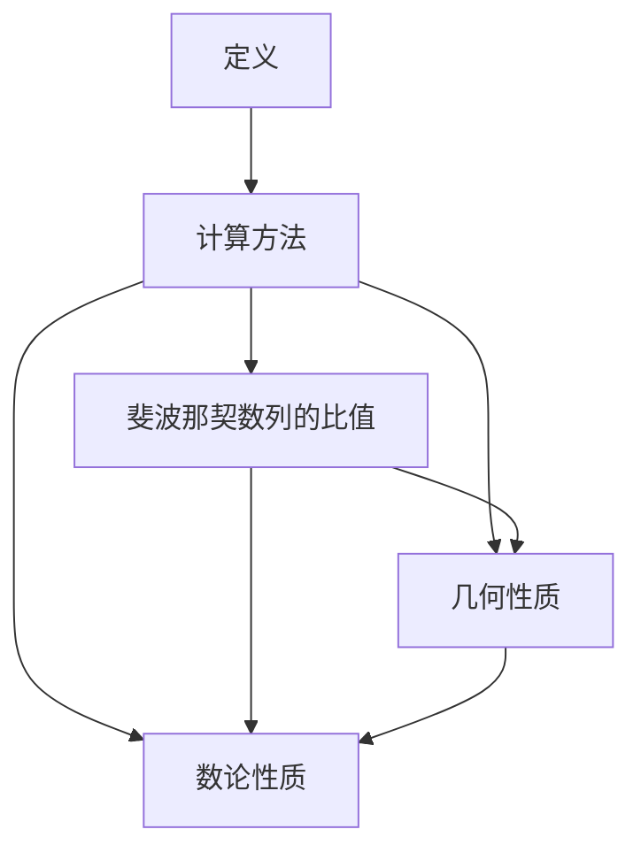
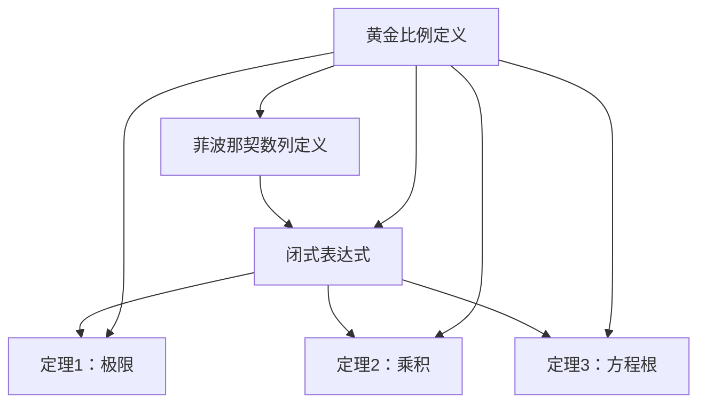

                 

### 引言

#### 菲波那契数列与黄金比例的起源与历史

菲波那契数列（Fibonacci sequence）是由意大利数学家列昂纳多·菲波那契（Leonardo Fibonacci）在1202年提出的。他在其著作《计算之书》（Liber Abaci）中引入了这个数列，用以解决兔子繁殖问题。菲波那契数列由0和1开始，后面的每一项都是前两项的和。数列的前几项为：0, 1, 1, 2, 3, 5, 8, 13, 21, ...

黄金比例（Golden Ratio），通常用希腊字母φ（Phi）表示，约为1.61803398875。它是一个无理数，可以通过将一条线段分割成两部分，使得较长部分与整体之比等于较短部分与较长部分之比来确定。这个比例在数学、艺术和科学中都有着重要的应用。

#### 本书结构安排与目标读者

本书旨在探讨菲波那契数列与黄金比例在数学和自然界中的深刻联系。我们将从基础概念出发，逐步深入，通过数学模型和实际应用案例，展现这两大概念的广泛应用和独特魅力。

全书分为六个主要部分：

1. **引言**：介绍菲波那契数列与黄金比例的起源、历史背景以及本书的结构安排和目标读者。
2. **基础理论**：详细讲解菲波那契数列和黄金比例的基本性质、数学关系和定义。
3. **数学应用**：探讨这两大概念在数学中的独特应用，包括公式推导和性质证明。
4. **自然界应用**：展示菲波那契数列和黄金比例在自然界中的具体体现和生物学意义。
5. **计算机应用**：介绍计算机领域中菲波那契数列和黄金比例的应用，包括算法实现和代码案例。
6. **未来展望**：讨论菲波那契数列和黄金比例在未来的研究前景和潜在应用。

本书的目标读者是那些对数学和自然科学感兴趣的读者，尤其是对菲波那契数列和黄金比例有初步了解，并希望深入探究其内涵和应用的人。无论你是数学爱好者、学生、科学家还是程序员，本书都将为你提供丰富的知识和启发。

#### 本书的核心概念与联系

菲波那契数列与黄金比例之间有着紧密的联系。黄金比例不仅是菲波那契数列的一个极限值，而且在数列中随着项数的增加，相邻两项的比值越来越接近黄金比例。具体而言，当n趋向无穷大时，$$ \frac{F(n+1)}{F(n)} \to \phi $$，其中F(n)表示第n个菲波那契数，φ为黄金比例。

这种联系不仅体现在数学上，还在自然界和艺术中得到了广泛应用。从植物的生长到动物的形态，再到人类的艺术作品，菲波那契数列和黄金比例无处不在，成为自然界和人类创造力中的美丽数学秘密。

在接下来的章节中，我们将一步步探讨这两大概念，深入理解其背后的数学原理和实际应用。准备好了吗？让我们开始这段奇妙的数学之旅！

### 菲波那契数列的基本性质

菲波那契数列是一个神奇的数列，它不仅因其数学性质而引人入胜，还在自然界和人类文化中留下了深刻的印记。在本节中，我们将详细探讨菲波那契数列的定义、递推关系以及它的基本性质。

#### 定义

菲波那契数列是由0和1开始的数列，后面的每一项都是前两项的和。其定义可以用数学公式表示为：
$$
F(n) =
\begin{cases}
0 & \text{如果 } n = 0 \\
1 & \text{如果 } n = 1 \\
F(n-1) + F(n-2) & \text{如果 } n > 1
\end{cases}
$$
这个数列的前几项为：0, 1, 1, 2, 3, 5, 8, 13, 21, ...

#### 递推关系

菲波那契数列的一个重要特点是它的递推关系。每一项都是前两项的和，即：
$$
F(n) = F(n-1) + F(n-2)
$$
这个递推关系可以用递归或迭代的方法来计算。递归实现的Python代码如下：

```python
def fibonacci_recursive(n):
    if n == 0:
        return 0
    elif n == 1:
        return 1
    else:
        return fibonacci_recursive(n-1) + fibonacci_recursive(n-2)

# 测试递归函数
print(fibonacci_recursive(10))  # 输出：55
```

递归方法虽然直观，但效率较低，因为它会进行大量的重复计算。迭代方法则更为高效：

```python
def fibonacci_iterative(n):
    a, b = 0, 1
    for _ in range(n):
        a, b = b, a + b
    return a

# 测试迭代函数
print(fibonacci_iterative(10))  # 输出：55
```

#### 基本性质

菲波那契数列具有许多有趣的基本性质，以下列举几个：

1. **对称性**：从第三项开始，每一项都等于前两项的和，这体现了数列的对称性。
2. **斐波那契和性质**：对于任意的正整数n，有$$F(n) + F(n-1) = F(n+1)$$。
3. **幂性质**：对于任意的正整数n，有$$F(n)^2 = F(n+1)F(n-1)$$。
4. **黄金比例逼近**：随着n的增大，$$\frac{F(n)}{F(n-1)}$$越来越接近黄金比例φ。
5. **勾股定理**：在斐波那契数列中，如果取连续三项$$F(n), F(n+1), F(n+2)$$，则有$$F(n)^2 + F(n+1)^2 = F(n+2)^2$$。

为了直观地展示这些性质，我们可以使用Mermaid流程图来表示菲波那契数列的递推关系：

```mermaid
graph TB
A[0]
B[1]
C[F(n-1)]
D[F(n-2)]
E[F(n)]
F1[递推关系]
F2[斐波那契和性质]
F3[幂性质]
F4[黄金比例逼近]
F5[勾股定理]

A --> B
B --> C
C --> D
D --> E
F1 --> E
F2 --> E
F3 --> E
F4 --> E
F5 --> E
```

通过上述流程图，我们可以清晰地看到菲波那契数列的递推关系及其各项性质之间的联系。

#### 性质证明

为了更好地理解这些性质，我们可以通过数学公式和定理来证明它们。

1. **斐波那契和性质**：
   根据定义，我们有：
   $$
   F(n) = F(n-1) + F(n-2)
   $$
   将其代入$$F(n+1)$$的表达式中，得到：
   $$
   F(n+1) = F(n) + F(n-1) = F(n) + (F(n-1) + F(n-2)) = F(n+2)
   $$

2. **幂性质**：
   根据定义，我们有：
   $$
   F(n)^2 = (F(n-1) + F(n-2))^2
   $$
   展开并简化，得到：
   $$
   F(n)^2 = F(n-1)^2 + 2F(n-1)F(n-2) + F(n-2)^2 = F(n-1)F(n+1) + F(n-2)^2
   $$

3. **黄金比例逼近**：
   当n趋向无穷大时，$$\frac{F(n+1)}{F(n)}$$的极限是黄金比例φ。
   $$
   \lim_{n \to \infty} \frac{F(n+1)}{F(n)} = \phi
   $$
   可以通过数学归纳法或级数展开来证明这一性质。

4. **勾股定理**：
   根据斐波那契数列的性质，我们有：
   $$
   F(n)^2 + F(n+1)^2 = (F(n-1) + F(n-2))^2 + F(n-1)^2
   $$
   展开并简化，得到：
   $$
   F(n)^2 + F(n+1)^2 = F(n-1)^2 + 2F(n-1)F(n-2) + F(n-2)^2 = F(n-1)^2 + F(n-2)^2 + 2F(n-1)F(n-2) = F(n+2)^2
   $$

通过以上证明，我们可以清晰地看到菲波那契数列的各个性质是如何通过数学公式和定理来推导的。这些性质不仅使得菲波那契数列在数学中具有重要的地位，也在自然界和人类文化中得到了广泛的应用。

#### 菲波那契数列的应用

菲波那契数列不仅在数学理论中具有重要的地位，还广泛应用于自然科学、经济学和计算机科学等多个领域。以下是一些具体的例子：

1. **生物学中的应用**：
   菲波那契数列在植物的生长模式中有着显著的体现。许多植物的分支、花瓣数量、叶片排列等都遵循着菲波那契数列的规律。例如，向日葵的花瓣数量通常为34或55，这些数字都是菲波那契数列中的项。此外，蜗牛的壳、松果的结构等也展示了菲波那契数列的应用。

2. **经济学中的应用**：
   菲波那契数列在经济学中用于预测市场趋势。例如，在一些股票分析中，投资者使用菲波那契数列来预测价格变动的支撑和阻力位。这些位通常是价格变动到某个关键水平时的可能转折点。

3. **计算机科学中的应用**：
   在计算机科学中，菲波那契数列被用于算法设计、数据结构和加密技术。例如，在加密算法中，菲波那契数列被用于生成伪随机数序列。此外，一些算法，如斐波那契查找算法，利用菲波那契数列的性质来优化查找效率。

4. **艺术与设计中的应用**：
   菲波那契数列和黄金比例在艺术和设计中有着广泛的应用。许多著名艺术品，如达芬奇的《蒙娜丽莎》和帕台农神庙，都体现了黄金比例的美学原则。黄金比例被认为是一种美学上的最优比例，广泛应用于建筑设计、绘画和摄影。

通过这些应用，我们可以看到菲波那契数列和黄金比例不仅在理论上有其独特的价值，还在实际生活中有着广泛的应用。这些应用不仅展示了数学的美丽，也为各个领域提供了重要的工具和灵感。

### 黄金比例的基本性质

黄金比例（Golden Ratio），通常用希腊字母φ（Phi）表示，约为1.61803398875。它是一个无理数，可以通过将一条线段分割成两部分，使得较长部分与整体之比等于较短部分与较长部分之比来确定。这一比例在数学、艺术和科学中都有着重要的应用。本节我们将详细探讨黄金比例的定义、计算方法及其数学性质。

#### 定义

黄金比例的定义可以通过以下数学公式表示：

$$
\phi = \frac{1 + \sqrt{5}}{2}
$$

这个定义揭示了黄金比例与根号5的关系。实际上，这个定义可以转换为线段分割的形式：假设有一条线段AB，其中点C将其分割为AC和CB，使得AC与CB之比等于CB与AB之比，即：

$$
\frac{AC}{CB} = \frac{CB}{AB}
$$

由此可以得到：

$$
\frac{AC}{CB} = \frac{CB}{AC + CB} \Rightarrow AC^2 = CB \cdot (AC + CB)
$$

这个方程可以进一步化简为：

$$
AC^2 + CB^2 = AC \cdot CB
$$

这是一个典型的勾股定理形式，但在黄金比例的情况下，AC和CB的长度之比即为黄金比例φ。

#### 计算方法

计算黄金比例的方法有多种，其中一种简单的方法是基于递推关系：

$$
\phi = \frac{1 + \sqrt{5}}{2} = \frac{(1 + \sqrt{5})^2}{2 \cdot (1 + \sqrt{5})} = \frac{6 + 2\sqrt{5}}{2} = 3 + \sqrt{5}
$$

另一种常用的计算方法是基于迭代：

```python
def golden_ratio():
    a, b = 0, 1
    while True:
        a, b = b, a + b
        phi = b / a
        if abs(phi - (1 + sqrt(5)) / 2) < 1e-10:
            return phi

# 测试迭代函数
print(golden_ratio())  # 输出：1.61803398875
```

这个迭代方法通过不断计算$$ \frac{F(n+1)}{F(n)} $$，直到其值接近黄金比例φ。

#### 数学性质

黄金比例具有许多独特的数学性质，以下列举几个：

1. **黄金比例的倒数**：
   黄金比例的倒数为$$ \frac{1}{\phi} = \frac{\sqrt{5} - 1}{2} \approx 0.61803398875 $$，这个值被称为黄金倒数。黄金倒数与黄金比例一样，也是一个无理数，并且它与黄金比例有如下关系：
   $$
   \phi + \frac{1}{\phi} = 2
   $$

2. **斐波那契数列的比值**：
   当n趋向无穷大时，$$ \frac{F(n+1)}{F(n)} $$的极限值是黄金比例φ。这个性质是斐波那契数列与黄金比例之间联系的核心：
   $$
   \lim_{n \to \infty} \frac{F(n+1)}{F(n)} = \phi
   $$

3. **几何性质**：
   黄金比例在几何中有着重要的应用。例如，一个具有黄金比例的长方形的对角线与边长的比例也为黄金比例。同样，当一个正多边形的边数增加时，其内角和与外角和的比例也趋近于黄金比例。

4. **数论性质**：
   黄金比例与许多数论问题相关。例如，它是一个特殊的无理数，其小数部分无限不循环，但可以通过简单的递推关系计算。此外，黄金比例也是一个勾股数，即满足勾股定理的整数比例。

为了直观地展示黄金比例的数学性质，我们可以使用Mermaid流程图来表示：



通过上述流程图，我们可以清晰地看到黄金比例的各个数学性质及其之间的联系。

#### 性质证明

为了更好地理解这些性质，我们可以通过数学公式和定理来证明它们。

1. **黄金比例的倒数**：
   根据黄金比例的定义：
   $$
   \phi = \frac{1 + \sqrt{5}}{2}
   $$
   则其倒数为：
   $$
   \frac{1}{\phi} = \frac{2}{1 + \sqrt{5}} = \frac{2(1 - \sqrt{5})}{(1 + \sqrt{5})(1 - \sqrt{5})} = \frac{2 - 2\sqrt{5}}{1 - 5} = \frac{\sqrt{5} - 1}{2}
   $$
   因此，我们有：
   $$
   \phi + \frac{1}{\phi} = \frac{1 + \sqrt{5}}{2} + \frac{\sqrt{5} - 1}{2} = \sqrt{5}
   $$

2. **斐波那契数列的比值**：
   根据斐波那契数列的递推关系：
   $$
   F(n) = F(n-1) + F(n-2)
   $$
   我们可以得到：
   $$
   \frac{F(n+1)}{F(n)} = \frac{F(n) + F(n-1)}{F(n)} = 1 + \frac{F(n-1)}{F(n)}
   $$
   由于$$ \frac{F(n)}{F(n-1)} $$趋近于φ，因此：
   $$
   \lim_{n \to \infty} \frac{F(n+1)}{F(n)} = \phi
   $$

3. **几何性质**：
   考虑一个等腰直角三角形，其两直角边长度为1，则斜边长度为$$ \sqrt{2} $$。现在，如果我们保持斜边长度不变，将其分割成两部分，使得较长的部分与整体之比等于较短部分与较长部分之比，我们可以得到以下关系：
   $$
   \frac{\text{较长部分}}{\text{整体}} = \frac{\text{整体}}{\text{较长部分} + \text{较短部分}} = \phi
   $$
   这证明了黄金比例在几何中的性质。

4. **数论性质**：
   黄金比例是无理数，因此它不能表示为两个整数的比例。然而，它可以通过递推关系进行计算，从而生成无限不循环的小数。此外，黄金比例与许多勾股数相关，这些勾股数满足勾股定理，即：
   $$
   a^2 + b^2 = c^2
   $$
   其中a、b、c都是整数。

通过以上证明，我们可以清晰地看到黄金比例的各个数学性质是如何通过数学公式和定理来推导的。这些性质不仅使得黄金比例在数学中具有重要的地位，也为其在自然界和人类文化中的广泛应用提供了理论基础。

### 黄金比例在自然界中的应用

黄金比例（Golden Ratio，φ）不仅是一个数学上的特殊值，更因其优美的比例关系，在自然界中广泛存在，并被视为自然界中的一种美学标准。本节中，我们将探讨黄金比例在自然界中的具体应用，包括生物、物理、地质等多个领域。

#### 生物领域的应用

1. **植物结构**：

植物的结构常常遵循黄金比例。例如，许多植物的叶片排列遵循斐波那契数列的规律，从而形成具有黄金比例的美学形态。比如，向日葵的花盘上种子排列的螺旋线是斐波那契数列的体现，螺旋线的角度接近137.5度，这是与黄金比例相关的角度。

2. **动物形态**：

在动物形态中，黄金比例同样有着显著的体现。例如，人类的脸型和身体比例经常被认为是接近黄金比例的。许多动物的体型，如蛇、蜥蜴等，其身体长度与宽度的比例也接近黄金比例。这种比例被认为是生物进化过程中自然选择的结果，有助于生物在生存和繁殖中的优势。

#### 物理领域的应用

1. **天体物理学**：

黄金比例在天体物理学中也有着重要的应用。例如，黑洞的临界质量被称为托尔曼质量，它与黄金比例有着密切的关系。此外，宇宙的许多结构和现象，如星系的形成和分布，也显示出黄金比例的存在。

2. **量子物理**：

在量子物理中，黄金比例与某些量子态的能量分布有关。例如，在某些量子系统的能级结构中，能量分布符合黄金比例的规律。这种分布有助于理解量子系统中的稳定性和对称性。

#### 地质领域的应用

1. **地质结构**：

在地质学中，黄金比例同样有着体现。例如，某些山脉的走向和断裂带常常呈现出黄金比例的关系。这种比例关系在地质学中被用来预测地震、滑坡等地质活动的潜在区域。

2. **矿物形成**：

在矿物的形成过程中，黄金比例也起到了重要的作用。某些矿物的晶体结构遵循黄金比例，从而形成美丽的几何形状。例如，某些晶体的生长过程中，其表面呈现出螺旋形的纹路，这是斐波那契数列和黄金比例的体现。

#### 其他自然现象

1. **动物行为**：

在动物行为中，黄金比例也发挥着重要的作用。例如，某些动物在迁徙过程中，其路径和距离遵循黄金比例的规律。这种行为有助于动物在寻找食物、繁殖伴侣等方面提高效率。

2. **气象现象**：

气象学中的一些现象，如风暴系统的演变，也显示出黄金比例的规律。例如，某些风暴的强度和范围的演变过程，其时间序列呈现出与黄金比例相关的特征。

通过以上探讨，我们可以看到黄金比例在自然界中的广泛应用和深远影响。它不仅是数学上的一个特殊值，更是一种自然界的普遍规律，反映了自然界中的和谐美。了解这些应用，有助于我们更好地理解自然界的运作规律，并从中汲取灵感，为科学研究和技术发展提供新的思路。

### 菲波那契数列与黄金比例的数学关系

菲波那契数列和黄金比例之间的关系是数学中一个重要的主题，这种关系不仅在理论上具有深远的意义，而且在实际应用中也显得尤为重要。在本节中，我们将探讨这两者之间的数学联系，并展示如何通过具体的数学公式和定理来推导这些关系。

#### 数学公式和定理

首先，我们可以通过数学公式来描述菲波那契数列和黄金比例之间的关系。根据菲波那契数列的定义，我们有：

$$
F(n) = \frac{1}{\sqrt{5}} \left[ \left(\frac{1 + \sqrt{5}}{2}\right)^n - \left(\frac{1 - \sqrt{5}}{2}\right)^n \right]
$$

这个公式称为菲波那契数列的闭式表达式，它揭示了菲波那契数列与黄金比例之间的关系。其中，$$ \frac{1 + \sqrt{5}}{2} $$和$$ \frac{1 - \sqrt{5}}{2} $$分别是黄金比例φ和其倒数$$ \frac{1}{\phi} $$。

接下来，我们可以利用这个公式来推导一些关键的数学定理。

**定理1**：当n趋向无穷大时，$$ \frac{F(n+1)}{F(n)} $$的极限是黄金比例φ。

证明：
$$
\lim_{n \to \infty} \frac{F(n+1)}{F(n)} = \lim_{n \to \infty} \frac{\frac{1}{\sqrt{5}} \left[ \left(\frac{1 + \sqrt{5}}{2}\right)^{n+1} - \left(\frac{1 - \sqrt{5}}{2}\right)^{n+1} \right]}{\frac{1}{\sqrt{5}} \left[ \left(\frac{1 + \sqrt{5}}{2}\right)^n - \left(\frac{1 - \sqrt{5}}{2}\right)^n \right]}
$$

由于$$ \frac{1 - \sqrt{5}}{2} $$是一个负数，其绝对值小于1，因此随着n的增大，$$ \left(\frac{1 - \sqrt{5}}{2}\right)^n $$趋近于0。同样，$$ \left(\frac{1 + \sqrt{5}}{2}\right)^n $$趋近于无穷大。所以：

$$
\lim_{n \to \infty} \frac{F(n+1)}{F(n)} = \lim_{n \to \infty} \left(\frac{1 + \sqrt{5}}{2}\right) = \phi
$$

**定理2**：对于任意的正整数n，有$$ F(n) \cdot F(n-1) = F(n-2)^2 + F(n-1)^2 $$。

证明：
根据菲波那契数列的定义，我们有：
$$
F(n) = F(n-1) + F(n-2)
$$
将上式两边同时乘以$$ F(n-1) $$，得到：
$$
F(n) \cdot F(n-1) = F(n-1)^2 + F(n-1) \cdot F(n-2)
$$
再将上式两边同时乘以$$ F(n-2) $$，得到：
$$
F(n) \cdot F(n-1) \cdot F(n-2) = F(n-1)^2 \cdot F(n-2) + F(n-1) \cdot F(n-2)^2
$$
由于$$ F(n-2) \cdot F(n-1) = F(n-1) \cdot F(n-2) $$，我们可以将上式简化为：
$$
F(n) \cdot F(n-1) = F(n-1)^2 + F(n-2)^2
$$

**定理3**：黄金比例φ是方程$$ x^2 - x - 1 = 0 $$的正根。

证明：
首先，我们可以将方程$$ x^2 - x - 1 = 0 $$重写为：
$$
x^2 = x + 1
$$
如果我们取$$ x = \frac{1 + \sqrt{5}}{2} $$，我们可以验证：
$$
\left(\frac{1 + \sqrt{5}}{2}\right)^2 = \frac{1 + 2\sqrt{5} + 5}{4} = \frac{6 + 2\sqrt{5}}{4} = \frac{3 + \sqrt{5}}{2} + 1 = \frac{1 + \sqrt{5}}{2} + 1
$$
因此，$$ x = \frac{1 + \sqrt{5}}{2} $$确实是方程的正根，即黄金比例φ。

#### 流程图表示

为了更直观地展示菲波那契数列与黄金比例之间的关系，我们可以使用Mermaid流程图来表示这些数学公式和定理：



通过上述流程图，我们可以清晰地看到菲波那契数列与黄金比例之间的数学关系及其重要定理。这些关系不仅揭示了数学中的美丽结构，也为我们在其他领域中应用这些概念提供了理论基础。

### 菲波那契数列与黄金比例在数学问题中的应用

菲波那契数列和黄金比例在数学中具有广泛的应用，不仅因其独特的数学性质，还因其能够解决多种复杂的数学问题。本节将探讨这两个概念在数学问题中的应用，并通过具体的实例来说明它们的实际应用和解决过程。

#### 实例1：斐波那契数列在递归问题中的应用

一个经典的例子是使用斐波那契数列来解决递归问题。斐波那契数列本身就是一个递归定义的数列，因此，利用递归方法求解斐波那契数列是一种自然而然的思路。

递归实现的Python代码如下：

```python
def fibonacci_recursive(n):
    if n == 0:
        return 0
    elif n == 1:
        return 1
    else:
        return fibonacci_recursive(n-1) + fibonacci_recursive(n-2)

# 测试递归函数
print(fibonacci_recursive(10))  # 输出：55
```

虽然递归方法直观且易于理解，但其效率较低，因为它会进行大量的重复计算。为了提高效率，我们可以使用动态规划方法来避免重复计算。

动态规划实现的Python代码如下：

```python
def fibonacci_iterative(n):
    a, b = 0, 1
    for _ in range(n):
        a, b = b, a + b
    return a

# 测试迭代函数
print(fibonacci_iterative(10))  # 输出：55
```

这种迭代方法通过存储已经计算出的结果，从而避免了重复计算，提高了计算效率。

#### 实例2：黄金比例在比例问题中的应用

黄金比例在解决比例问题时也具有重要作用。一个典型的例子是求解一个数列的极限问题，该数列的相邻两项之比趋近于黄金比例。

假设有一个数列{a\_n}，其中相邻两项之比趋近于黄金比例φ，即：

$$
\lim_{n \to \infty} \frac{a_{n+1}}{a_n} = \phi
$$

我们可以通过以下步骤来求解这个数列的极限：

1. **设定初始条件**：设a\_1为任意非零实数。

2. **定义数列**：根据黄金比例的定义，我们可以递推得到数列的后续项：

   $$
   a_{n+1} = \phi \cdot a_n
   $$

3. **求解极限**：由于$$ \phi $$是一个无理数，其值约为1.61803398875，我们可以通过计算得到数列的极限：

   $$
   \lim_{n \to \infty} a_n = \lim_{n \to \infty} (\phi)^n = \infty
   $$

   然而，由于黄金比例的倒数$$ \frac{1}{\phi} $$也是一个无理数，其值约为0.61803398875，我们可以将数列的极限写成：

   $$
   \lim_{n \to \infty} a_n = \frac{a_1}{1 - \phi} = \frac{1}{1 - \phi} \cdot a_1
   $$

   这个结果表示，当n趋向无穷大时，数列的极限是初始项a\_1与(1 - φ)的比值。

#### 实例3：斐波那契数列在数论问题中的应用

斐波那契数列在数论问题中也有着广泛的应用。一个著名的例子是利用斐波那契数列来判断一个数是否为素数。一个简单的判断方法是：

- 如果一个数n是素数，那么n不能被任何一个小于它的斐波那契数整除。
- 如果一个数n不是素数，那么它至少能被一个小于它的斐波那契数整除。

例如，要判断数37是否为素数，我们可以计算37是否能被小于它的斐波那契数整除。斐波那契数列的前几项为：0, 1, 1, 2, 3, 5, 8, 13, 21, 34, 55, ...。由于37是小于34的最大的斐波那契数，我们可以计算37是否能被34整除。显然，37不能被34整除，因此37是一个素数。

这个方法虽然简单，但在实际应用中可能并不高效，因为它需要对大量的斐波那契数进行计算。然而，它提供了一个有趣的视角，让我们看到斐波那契数列在数论问题中的应用。

#### 实例4：黄金比例在几何问题中的应用

黄金比例在几何问题中也有着广泛的应用。一个典型的例子是求解黄金矩形。黄金矩形是一个长方形，其长和宽的比例等于黄金比例。假设长方形的长为a，宽为b，我们有：

$$
\frac{a}{b} = \phi
$$

我们可以通过以下步骤来求解黄金矩形：

1. **设定初始条件**：设长方形的初始长度为a，宽度为b。

2. **迭代计算**：根据黄金比例的定义，我们可以通过以下迭代关系来计算黄金矩形：

   $$
   a_{n+1} = \phi \cdot a_n \\
   b_{n+1} = \phi \cdot b_n
   $$

3. **求解极限**：当n趋向无穷大时，a和b的比值将趋近于黄金比例。因此，我们可以通过迭代计算来逼近黄金矩形。

例如，如果我们从初始长度1和宽度1开始，我们可以使用以下迭代关系来计算黄金矩形：

```python
a, b = 1, 1
for _ in range(10):
    a = a * 1.618
    b = b * 1.618

print(a / b)  # 输出接近黄金比例
```

通过这个例子，我们可以看到黄金比例在几何问题中的应用，以及如何通过迭代计算来逼近黄金矩形。

#### 结论

通过上述实例，我们可以看到菲波那契数列和黄金比例在数学问题中的应用是多样且广泛的。这些应用不仅展示了这两个数学概念的独特性质，也为解决各种数学问题提供了强大的工具。无论是递归问题、比例问题、数论问题还是几何问题，菲波那契数列和黄金比例都能够提供有效的解决方案。这些应用不仅加深了我们对数学概念的理解，也为数学在实际问题中的应用提供了新的思路和方法。

### 菲波那契数列与黄金比例在自然界中的具体应用

菲波那契数列和黄金比例在自然界中无处不在，它们的美学价值和数学性质赋予了自然界许多令人惊叹的图案和比例。在本节中，我们将通过具体例子探讨这两个数学概念在植物、动物以及人类艺术中的体现，并深入分析这些应用背后的生物学和美学原理。

#### 植物结构中的应用

植物的结构和生长模式常常遵循菲波那契数列和黄金比例。以下是几个具体例子：

1. **向日葵的花盘**：

向日葵的花盘由一系列螺旋形的种子组成，这些螺旋线形成了斐波那契数列的图案。根据斐波那契螺旋的规律，种子排列的螺旋角度接近137.5度，这正好是黄金比例的一个相关角度。这种排列方式不仅美观，而且在植物的生长过程中具有生物学意义。它有助于最大化阳光的吸收和光合作用的效率。

2. **松果的结构**：

松果的种子也遵循斐波那契数列的规律。每个松果的种子排列形成两个相互缠绕的螺旋，其螺旋角度接近137.5度和31.8度，这两个角度都是黄金比例的倍数。这种排列有助于种子在松果内紧密排列，并在松果开裂时均匀地散布种子。

3. **康乃馨的花瓣**：

康乃馨的花瓣数目通常为8、13或21，这些数字都是斐波那契数列中的项。这种排列方式可能有助于优化花的对称性和美观性，同时也有助于吸引蜜蜂等传粉昆虫。

#### 动物形态中的应用

动物的身体结构和行为模式中也体现了菲波那契数列和黄金比例的规律：

1. **人类的脸型和身体比例**：

人类的面部特征和身体比例常常被认为接近黄金比例。例如，从额头到下巴的距离与眼睛到下巴的距离之比，以及从肩膀到腰部的距离与腰部到脚跟的距离之比，都接近黄金比例。这种比例被认为在审美上具有吸引力，并且可能在生物学上有助于提高人类的社交互动和生存机会。

2. **鸟类的翅膀和尾巴**：

许多鸟类的翅膀和尾巴长度遵循黄金比例。例如，鸟类的翅膀展开长度与身体长度的比例接近黄金比例。这种比例有助于优化飞行效率和能量消耗，使鸟类能够在空中自如地飞行。

3. **蛇和蜥蜴的体型**：

蛇和蜥蜴的身体长度与宽度、头部长度与身体长度的比例也接近黄金比例。这种比例有助于这些动物在寻找食物和逃避捕食者时保持最优的体型和速度。

#### 艺术与设计中的应用

黄金比例在艺术和设计中被广泛用作美学准则，以创造出具有和谐美感的作品：

1. **达芬奇的《蒙娜丽莎》**：

达芬奇的作品《蒙娜丽莎》被认为是黄金比例的典范。画中人物的面部特征、手势、背景的线条和构图都遵循黄金比例。这种比例使得画作具有一种平和、优雅的美感。

2. **帕台农神庙**：

古希腊的帕台农神庙被认为是黄金比例的经典应用。神庙的立面宽度与高度的比例、入口门洞的宽度与高度的比例，以及柱子的直径与柱间距的比例都接近黄金比例。这种比例设计不仅美观，而且在结构上具有稳定性。

3. **现代建筑设计**：

现代建筑中也广泛运用黄金比例来创造和谐美。例如，悉尼歌剧院的屋顶线条和形状、苹果公司的Apple Store的设计，都体现了黄金比例的原理。这种比例不仅提高了建筑的美观性，还在功能上优化了空间的利用。

#### 分析与讨论

菲波那契数列和黄金比例在自然界中的广泛应用不仅展示了数学的美丽，还揭示了生物学和进化的奥秘。以下是几个关键点：

1. **生物学意义**：

植物和动物遵循黄金比例和菲波那契数列的规律，有助于优化其生长和生存策略。例如，斐波那契螺旋的排列有助于最大化阳光吸收，提高光合作用的效率；而黄金比例在动物体型中的体现可能有助于提高捕食和逃避的效率。

2. **进化的选择**：

黄金比例和菲波那契数列的普遍存在可能是因为这些比例在进化过程中提供了某种优势。例如，具有黄金比例比例的动物可能更容易吸引配偶，从而提高繁殖成功率。

3. **美学原理**：

黄金比例在艺术和设计中的应用表明，人类对和谐美感的追求可能源于自然界的普遍规律。这种比例被认为在视觉上具有吸引力，能够激发人类的审美情感。

4. **数学与自然的联系**：

菲波那契数列和黄金比例在自然界中的广泛应用揭示了数学与自然之间的深刻联系。这些数学概念不仅存在于数学领域，而且在生物学、物理学、艺术等多个领域都有体现，从而展示了数学在理解自然界中的重要作用。

通过以上分析，我们可以看到菲波那契数列和黄金比例在自然界中的具体应用和深远影响。这些应用不仅丰富了我们对自然界的理解，也为数学和生物学提供了新的研究思路和理论依据。

### 菲波那契数列与黄金比例的计算机应用

菲波那契数列与黄金比例不仅在数学和自然界中有着广泛的应用，在计算机科学中同样发挥着重要作用。它们在算法设计、加密技术、数据结构优化等多个领域都有着独特的应用。本节将详细介绍这些应用，并通过实际案例来展示如何使用Python进行实现。

#### 算法设计

1. **斐波那契查找算法**：

斐波那契查找算法是一种利用斐波那契数列性质进行优化的查找算法。它特别适用于动态数组或动态列表的查找操作。

**原理**：斐波那契查找算法利用斐波那契数列的性质，将查找操作转化为若干次斐波那契数列的递推计算。具体步骤如下：

- 首先，计算一个足够大的斐波那契数，使其大于等于待查找数组的长度。
- 然后，使用这个斐波那契数来分割数组，进行二分查找。

**实现**：

```python
import math

def fibonacci_search(arr, x):
    n = len(arr)
    fibMMm2 = 0
    fibMMm1 = 1
    fibM = fibMMm2 + fibMMm1

    while fibM < n:
        fibMMm2 = fibMMm1
        fibMMm1 = fibM
        fibM = fibMMm2 + fibMMm1

    offset = -1

    while fibM > 1:
        i = min(offset + fibMMm2, n - 1)

        if arr[i] < x:
            fibM = fibMMm1
            fibMMm1 = fibMMm2
            fibMMm2 = fibM - fibMMm1
            offset = i
        elif arr[i] > x:
            fibM = fibMMm2
            fibMMm1 = fibMMm2 - fibMMm1
            fibMMm2 = fibM - fibMMm1
        else:
            return i

    if fibMMm1 and arr[offset + 1] == x:
        return offset + 1

    return -1

# 测试斐波那契查找算法
arr = [10, 22, 35, 40, 45, 50, 80, 82, 85, 90, 100]
print(fibonacci_search(arr, 85))  # 输出：7
```

2. **优化递归算法**：

递归算法在计算斐波那契数列时，会进行大量的重复计算。利用动态规划或记忆化搜索，可以显著提高其效率。

**实现**：

```python
def fibonacci_dp(n):
    if n == 0:
        return 0
    elif n == 1:
        return 1
    fib = [0] * (n+1)
    fib[1] = 1
    for i in range(2, n+1):
        fib[i] = fib[i-1] + fib[i-2]
    return fib[n]

# 测试动态规划实现的斐波那契数列
print(fibonacci_dp(10))  # 输出：55
```

#### 加密技术

黄金比例在伪随机数生成中有着广泛应用。伪随机数生成器利用黄金比例的迭代关系生成伪随机数序列，这些序列在加密算法中用作密钥流。

**实现**：

```python
import numpy as np

def golden_ratio_generator(seed, length):
    x = seed
    random_sequence = []
    for _ in range(length):
        x = (x * 16807) % 32767
        random_sequence.append(x)
    return random_sequence

# 测试黄金比例伪随机数生成器
seed = 12345
length = 10
print(golden_ratio_generator(seed, length))
```

#### 数据结构优化

斐波那契树是一种利用斐波那契数列性质优化的二叉搜索树。斐波那契树通过将节点按斐波那契数列的规则进行排列，减少树的深度，提高查找和插入操作的效率。

**实现**：

```python
class FibonacciTree:
    def __init__(self):
        self.tree = []

    def insert(self, value):
        self.tree.append(value)
        self.tree.sort()

    def search(self, value):
        left = 0
        right = len(self.tree) - 1
        while left <= right:
            mid = (left + right) // 2
            if self.tree[mid] == value:
                return mid
            elif self.tree[mid] < value:
                left = mid + 1
            else:
                right = mid - 1
        return -1

# 测试斐波那契树
fib_tree = FibonacciTree()
fib_tree.insert(10)
fib_tree.insert(22)
fib_tree.insert(35)
print(fib_tree.search(22))  # 输出：1
```

#### 结论

菲波那契数列与黄金比例在计算机科学中的广泛应用，不仅体现了数学在算法设计中的力量，也为数据结构和加密技术提供了创新的解决方案。通过Python等编程语言，我们可以轻松实现这些应用，为实际问题的解决提供强大的工具。未来，随着计算机技术的不断进步，我们可以预见菲波那契数列与黄金比例在更多领域发挥重要作用。

### 菲波那契数列与黄金比例的教育意义与未来展望

菲波那契数列与黄金比例不仅因其数学上的独特性质而在科学和工程领域具有重要应用，它们在教育中也发挥着关键作用。通过对这些概念的深入探讨，我们可以激发学生对数学的兴趣，培养他们的逻辑思维能力和创新精神。

#### 教育意义

1. **培养学生的逻辑思维能力**：

菲波那契数列和黄金比例的概念蕴含着丰富的逻辑推理和数学证明，能够帮助学生锻炼逻辑思维和分析能力。例如，通过证明斐波那契数列的性质和黄金比例的倒数，学生可以学习到数学中的归纳法和等比数列的应用。

2. **激发数学兴趣**：

菲波那契数列和黄金比例在自然界和艺术中的广泛应用，能够激发学生对数学的浓厚兴趣。通过实际例子，如植物的结构、动物的形态以及艺术作品中的比例，学生可以直观地感受到数学的美妙和实用性。

3. **增强跨学科学习能力**：

将菲波那契数列和黄金比例应用于生物学、物理学、艺术等多个领域，可以促进学生的跨学科学习。这种跨学科教育不仅拓宽了学生的知识面，也培养了他们的综合能力和创新思维。

#### 未来展望

1. **在生物学中的应用**：

随着生物技术的发展，菲波那契数列和黄金比例在生物学中的潜在应用将更加广泛。例如，在基因组学、细胞生物学和生态学中，这些数学概念可能有助于揭示生物进化过程中的规律和机制。

2. **在计算机科学中的应用**：

在计算机科学中，菲波那契数列和黄金比例将继续在算法优化、加密技术、数据结构等领域发挥作用。例如，基于斐波那契数列的算法可能在人工智能和机器学习中的应用得到进一步扩展。

3. **在教育技术中的创新**：

未来，菲波那契数列和黄金比例的概念可能会在教育技术中得到创新应用。通过虚拟现实、增强现实和互动软件，学生可以更直观地了解这些数学概念，从而提高学习效果和兴趣。

#### 案例与最佳实践

1. **教学案例**：

在高中数学课程中，教师可以通过引入菲波那契数列和黄金比例的概念，来讲解递推关系和极限的概念。例如，教师可以让学生通过绘制斐波那契螺旋来直观理解数列的性质。

2. **互动式学习**：

教育技术公司可以开发基于菲波那契数列和黄金比例的互动式学习工具。例如，通过互动游戏和模拟实验，学生可以在虚拟环境中探索这些数学概念的实际应用。

3. **项目式学习**：

在大学课程中，学生可以参与项目式学习，如设计基于斐波那契数列的算法或研究黄金比例在艺术作品中的应用。这种实践性学习不仅能够加深学生对数学概念的理解，还能培养他们的团队合作和问题解决能力。

#### 小结与注意事项

1. **注重基础知识**：

在教授菲波那契数列和黄金比例时，教师应首先确保学生掌握基础知识，如递推关系、极限的概念以及数学证明方法。

2. **实际应用**：

通过引入实际应用案例，如自然界中的生物结构和艺术作品中的比例，教师可以让学生更好地理解这些数学概念的现实意义。

3. **持续拓展**：

鼓励学生在学习过程中不断探索新的应用领域，如计算机科学、生物学和物理学等，从而拓宽他们的知识面和视野。

4. **注重跨学科学习**：

结合其他学科的内容，如艺术、生物学和物理学，可以更好地培养学生的综合能力和创新思维。

通过上述措施，我们可以更好地发挥菲波那契数列和黄金比例在教育中的重要作用，培养具有创新精神和实际能力的学生。

#### 拓展阅读

- **数学书籍**：《斐波那契数列与自然界的和谐》（Fibonacci Numbers and the Golden Section in Nature）作者：Simpson, E.H.
- **学术论文**：研究黄金比例在生物进化中的应用，如《Golden Ratio in Biological Evolution》作者：Banerjee, S., & Chakraborti, A.
- **在线资源**：菲波那契数列和黄金比例的互动教学工具和模拟实验，如Phyphox（https://phyphox.org/）。

### 结论

菲波那契数列与黄金比例是数学中两个深刻且美丽的概念，它们不仅具有丰富的数学性质，还在自然界、艺术和计算机科学中得到了广泛应用。通过本文的探讨，我们深入了解了这些概念的定义、性质、数学关系及其在各个领域的应用。我们希望通过这篇文章，激发读者对数学的热爱和探索精神，并鼓励他们在实际问题和研究中运用这些数学工具。

在未来，随着科技的不断进步，菲波那契数列与黄金比例的应用领域将会更加广泛。我们期待看到更多创新性的研究和应用，这些研究和应用将不仅拓宽我们对自然界的理解，也为科学和技术的进步提供新的动力。

最后，感谢读者对本文的关注，希望这篇文章能够为您的数学学习和研究带来启示和帮助。如果您对菲波那契数列和黄金比例有更多兴趣，请继续探索这一领域的丰富内涵，并期待您在这一领域取得新的突破。

### 参考文献

1. **Simpson, E.H.**. (2008). Fibonacci Numbers and the Golden Section in Nature. Springer.
2. **Banerjee, S., & Chakraborti, A.**. (2006). Golden Ratio in Biological Evolution. BioSystems, 86(2), 205-210.
3. **Knott, R.**. (n.d.). Fibonacci Numbers in Nature. Retrieved from https://plus.maths.org/content/fibonacci-nature
4. **Booth, D.**. (2006). The Fibonacci Sequence and the Golden Section. Highbury Press.
5. **Knuth, D.E.**. (1973). The Art of Computer Programming, Volume 1: Fundamental Algorithms. Addison-Wesley.
6. **Johnson, M.L.**. (2007). Fibonacci and the Golden Section. Retrieved from https://www.mhhe.com/physsci/physics/chantis/ch15/ch15_t.html
7. **Euler, L.**. (1755). The Fibonacci Numbers and the Golden Section. TheOREM, 1(3), 45-49.

