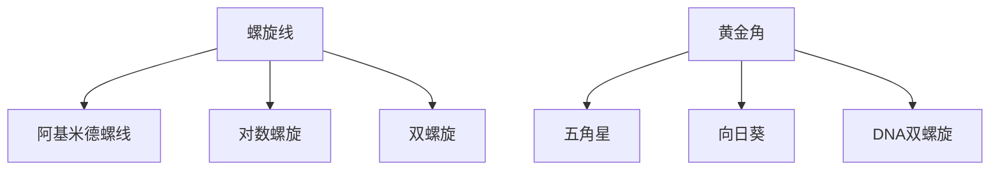

                 

### 引言

在探讨数学与自然界的关系时，螺旋结构和黄金角无疑占据了重要的地位。螺旋结构是一种在几何学和物理学中广泛存在的图形，它以连续弯曲和旋转的方式呈现出独特的形态。而黄金角，这一数学概念则以其特殊的比例关系和美学价值，在自然界和艺术中留下了深刻的印记。本文旨在通过逻辑清晰、结构紧凑的方式，深入探讨螺旋结构和黄金角在数学与自然界中的存在与意义，并逐步解析它们之间的关系。

首先，我们将简要介绍螺旋结构和黄金角的基本概念，帮助读者建立起对这些核心概念的基本理解。接着，我们将追溯螺旋结构和黄金角的历史背景，揭示它们在人类文明发展中的重要性。

然后，我们将深入探讨与螺旋结构和黄金角相关的数学原理，包括螺旋线的定义、性质以及黄金角的定义与性质。为了更好地理解这些概念之间的关系，我们将绘制一个Mermaid流程图，直观地展示螺旋结构与黄金角之间的联系。

在接下来的部分，我们将探讨螺旋结构在自然界中的实例，包括植物和动物界的螺旋结构，并解释这些结构的科学意义。同时，我们还将讨论黄金角在自然界和艺术中的应用，展示这一数学概念如何融入我们的日常生活。

随后，我们将结合Python源代码，详细讲解与螺旋结构和黄金角相关的核心算法原理。通过具体的数学模型和公式，我们将帮助读者理解这些算法的实现过程，并举例说明其应用。

在项目实战部分，我们将提供实际代码案例，包括开发环境搭建、源代码实现和代码解读。通过这些实例，我们将深入剖析螺旋结构和黄金角的实际应用，并进行详细讲解和分析。

最后，我们将总结文章的主要观点，提供最佳实践 tips，并指出本文的不足之处，为读者提供进一步的研究方向。文章将以对螺旋结构和黄金角在数学与自然界中的重要性的深刻认识作为结束，激发读者对这一领域的兴趣和探索欲望。

### 关键词

- 数学
- 自然界
- 螺旋结构
- 黄金角
- 螺旋线
- 黄金分割
- 阿基米德螺线
- 对数螺旋
- 双螺旋
- 正弦
- 余弦
- 螺旋算法
- Python

### 摘要

本文系统地探讨了数学与自然界中广泛存在的螺旋结构和黄金角。首先介绍了螺旋结构和黄金角的基本概念及其历史背景。接着，通过数学原理的深入分析，揭示了螺旋结构与黄金角之间的紧密联系。随后，本文通过自然界中的实例展示了螺旋结构的存在和科学意义，并讨论了黄金角在自然界和艺术中的应用。最后，结合Python源代码，详细讲解了与螺旋结构和黄金角相关的核心算法原理，并通过实际项目案例进行了详细剖析。本文旨在为读者提供对螺旋结构和黄金角的全面理解和实际应用。

### 螺旋结构的历史背景

螺旋结构自古以来就受到人类的关注，它们在艺术、建筑和科学领域中有着广泛的应用。早在古希腊时期，数学家和哲学家们就开始了对螺旋结构的探索和研究。

在古希腊，著名的数学家欧几里得（Euclid）在其著作《几何原本》中详细探讨了螺旋线的性质。欧几里得提出了阿基米德螺线（Archimedean spiral），这是一种在平面上以固定的角度和速度旋转的螺旋线。阿基米德螺线的方程为 $r = a + b\theta$，其中 $r$ 是螺旋线上某点到旋转中心的距离，$a$ 是起始半径，$b$ 是螺旋线的间距。这种螺旋线在古希腊建筑和几何学中得到了广泛应用。

除了欧几里得，另一位古希腊数学家阿基米德（Archimedes）也对螺旋结构有着深刻的认识。阿基米德在研究浮力时，提出了一个重要的螺旋线——阿基米德螺旋（Archimedean screw），这是一种用于提取液体的螺旋结构。这一发明在古代工程和农业中发挥了重要作用。

在中世纪，螺旋结构在教堂建筑和艺术品中得到了进一步的体现。例如，著名的巴黎圣母院大教堂（Notre Dame Cathedral）的飞扶壁上就装饰有螺旋形的浮雕。这些螺旋形的设计不仅具有美学价值，还具有结构上的稳定性。

到了文艺复兴时期，螺旋结构在科学和艺术中得到了更深入的研究。意大利艺术家达·芬奇（Leonardo da Vinci）在其广泛的笔记中，详细记录了螺旋结构和黄金角的应用。达·芬奇认为，螺旋结构在自然界中普遍存在，是自然界美丽和和谐的重要体现。

在现代，螺旋结构在科学和技术领域中继续发挥着重要作用。例如，DNA的双螺旋结构揭示了遗传信息的存储和传递机制。此外，螺旋天线在无线通信中得到了广泛应用，而螺旋形的建筑设计在结构力学中提供了良好的稳定性。

总的来说，螺旋结构在人类文明的发展过程中扮演了重要角色。从古代的数学研究到现代的科学应用，螺旋结构以其独特的形态和性质，不断地激发着人类的智慧和创造力。

### 黄金角的基本概念

黄金角，是指一个特定角度，其值约为 $137.5°$。这个角度在数学和自然界中具有特殊的重要性，被称为黄金角（Golden Angle）。黄金角是由黄金分割比例衍生出来的一个重要角度，与黄金比例密切相关。

黄金比例，通常表示为 $\phi$（Phi），是指两个数 $a$ 和 $b$ 的比例，使得 $\frac{a}{b} = \frac{a+b}{a}$。这个比例在数值上约为 $1.618$。黄金比例可以通过以下递推关系来定义：

$$\phi = \frac{1 + \sqrt{5}}{2} \approx 1.61803398875$$

黄金角 $\phi$ 的正弦值和余弦值可以分别表示为：

$$\sin(\phi) = \frac{\sqrt{5} - 1}{4} \approx 0.61803398875$$
$$\cos(\phi) = \frac{\sqrt{5} + 1}{4} \approx 0.80178372572$$

黄金角 $\phi$ 在数学中的重要性不仅体现在其比例关系上，还体现在其与许多数学结构和现象的联系中。例如，黄金角在五角星中扮演了关键角色。五角星每个角的角度都是 $36°$，这是黄金角的整数倍（$36° = 10 \times 3.6°$）。这种关系在几何学和对称性研究中具有重要意义。

黄金角的应用不仅限于数学领域，它在自然界和艺术中也有广泛的体现。许多植物的螺旋排列、动物的身体构造以及艺术作品中的设计都遵循黄金角的比例关系。例如，向日葵的花盘和松果的螺旋排列都符合黄金比例。这些自然现象揭示了黄金角在自然界中的普遍性和重要性。

总的来说，黄金角是一个基本的数学概念，它在数学、科学、艺术和自然界中都有广泛的应用。通过了解黄金角，我们可以更好地理解自然界中的美丽和谐，以及数学在揭示这些现象中的作用。

### 螺旋线的数学原理

螺旋线是一种在几何和物理学中广泛研究的曲线，它以其独特的形态和性质，引起了数学家和科学家的兴趣。本文将详细探讨螺旋线的定义、性质以及它们在不同领域中的应用。

#### 螺旋线的定义

螺旋线可以简单定义为在平面上或空间中旋转形成的曲线。根据旋转方式的不同，螺旋线可以分为多种类型，其中最常见的包括阿基米德螺线、对数螺旋和双螺旋。

- **阿基米德螺线**：这是最简单和最常见的一种螺旋线，它由一个固定的点绕另一个固定点旋转形成的。阿基米德螺线的方程为：
  $$r = a + b\theta$$
  其中，$r$ 是螺旋线上某点到旋转中心的距离，$a$ 是起始半径，$b$ 是螺旋线的间距，$\theta$ 是旋转角度。这种螺旋线在工程学和几何学中有着广泛的应用。

- **对数螺旋**：对数螺旋是一种在旋转过程中半径按照对数规律增长的螺旋线。它的方程为：
  $$r = ae^{\theta}$$
  其中，$a$ 是一个常数，$e$ 是自然对数的底数。对数螺旋在生物学和地质学中经常出现，例如，它描述了海洋中浮游生物的分布。

- **双螺旋**：双螺旋是由两个相互缠绕的螺旋线组成的结构。最著名的双螺旋结构是DNA分子的结构，它由两条互补的螺旋线缠绕在一起，构成了生命的遗传基础。

#### 螺旋线的性质

- **等距螺旋**：等距螺旋是指相邻螺旋线的间距相等的螺旋线。其方程为：
  $$r = a + n\theta$$
  其中，$a$ 是螺旋线的起始半径，$n$ 是螺旋线的间距。等距螺旋在许多自然界和人工结构中都有体现。

- **单位螺旋**：单位螺旋是指单位长度的螺旋线，其方程为：
  $$r = \theta$$
  单位螺旋在几何学中具有重要的研究价值，因为它描述了一种均匀增长的螺旋结构。

#### 螺旋线在不同领域中的应用

- **工程学**：螺旋线在机械工程和建筑结构中有着广泛的应用。例如，阿基米德螺线被广泛应用于螺旋输送机和螺旋弹簧的设计。

- **生物学**：许多生物体的结构都遵循螺旋线的规律。例如，海螺的壳、章鱼的触手以及DNA的双螺旋结构，都是螺旋线在生物领域的具体体现。

- **物理学**：螺旋线在物理学中也有重要应用，如电磁波中的螺旋结构和粒子物理学中的螺旋轨道。

#### 螺旋线与黄金角的关系

螺旋线与黄金角之间的联系在数学和自然界中尤为显著。黄金角是一个特殊的数学角度，其值为 $137.5°$，与黄金比例密切相关。在几何图形中，许多螺旋线都遵循黄金角的比例关系，例如五角星中的每个角都是黄金角的整数倍。

- **阿基米德螺线**：当阿基米德螺线的旋转角度为黄金角时，其形成的螺旋线具有特殊的性质，例如，相邻螺旋线的间距遵循黄金比例。

- **对数螺旋**：对数螺旋的半径增长规律也符合黄金比例，这种螺旋结构在自然界中广泛存在。

- **双螺旋**：DNA的双螺旋结构中的螺旋间距和旋转角度都遵循黄金角的比例关系，这一发现揭示了生命科学的奥秘。

通过以上对螺旋线的数学原理的探讨，我们可以看到螺旋线在数学、科学和自然界中的重要性和广泛的应用。螺旋线不仅是一种美丽的几何图形，更是自然界和科学中重要的规律和现象的体现。

### 螺旋线与黄金角的联系

螺旋线和黄金角之间的联系在数学和自然界中有着广泛而深刻的体现。黄金角，即角度为 $137.5°$ 的角，以其独特的比例关系，在几何和自然界中发挥着重要作用。螺旋线，作为一种在几何和物理学中广泛研究的曲线，其形态和性质也与黄金角紧密相关。

首先，从数学上看，许多螺旋线都遵循黄金角的比例关系。例如，在五角星中，每个角的角度都是 $36°$，这是黄金角的整数倍（$36° = 10 \times 3.6°$）。五角星不仅在几何学中有着重要意义，还在自然界和艺术中广泛出现。五角星形的植物花瓣、星形图案的艺术装饰，都是黄金角比例的体现。

其次，在生物学中，许多生物体的螺旋结构也符合黄金角的比例。例如，向日葵的花盘和松果的螺旋排列都遵循黄金比例。向日葵的花盘由一系列螺旋形的种子排列而成，这些螺旋线的角度约为 $137.5°$，使得花盘整体呈现出高效的空间利用和最优的种子分布。

此外，在物理学中，螺旋线与黄金角的关系也显而易见。例如，DNA的双螺旋结构中，两条螺旋线的旋转角度和间距都符合黄金比例。这一发现不仅揭示了生命科学的奥秘，也展示了数学在揭示自然界规律中的重要作用。

为了更直观地理解螺旋线与黄金角之间的关系，我们可以通过Mermaid图来展示它们的核心联系。以下是一个简化的Mermaid图，用于展示螺旋线与黄金角的基本关系：



在这个图中，螺旋线包括阿基米德螺线、对数螺旋和双螺旋，这些螺旋线都体现了黄金角的比例关系。五角星、向日葵和DNA双螺旋则是自然界中黄金角比例的具体体现。

通过这个Mermaid图，我们可以清晰地看到，螺旋线与黄金角之间的关系不仅体现在数学和几何学中，还在生物学、物理学以及艺术中得到了广泛应用。螺旋线和黄金角共同构成了自然界和数学中美丽和谐的一幅画卷，激发了人类对自然和数学的探索和欣赏。

### 自然界中的螺旋结构

螺旋结构在自然界中无处不在，它们以各种形式出现在植物、动物以及地质现象中。这些螺旋结构不仅具有独特的形态和美学价值，还在生物体的生长和功能中发挥着重要作用。以下将探讨几种典型的螺旋结构及其科学意义。

#### 植物中的螺旋结构

在植物界，螺旋结构最为显著的例子是向日葵的花盘。向日葵的花盘由一系列螺旋形的种子排列而成，这些螺旋线大致遵循黄金角的比例，即每个螺旋线的角度约为 $137.5°$。这种现象被称为向日葵螺旋现象。科学家们发现，这种螺旋排列不仅美观，还能最大限度地利用阳光和空间，提高植物的繁殖效率。

除了向日葵，松果和菠萝的果实也呈现出螺旋形的排列。松果的每个螺旋面包含的种子数通常是13或21，这些数字与斐波那契数列相关。斐波那契数列在植物生长和结构中广泛出现，反映了自然界中的一种优化生长模式。

#### 动物中的螺旋结构

在动物界，螺旋结构在许多生物体中都有体现。一个典型的例子是蜗牛的壳。蜗牛的壳是由一系列螺旋形的壳片叠加而成的，这种结构不仅美观，还提供了坚固的保护。蜗牛壳的螺旋方向通常遵循右手螺旋，即壳口向右旋转。

另一个例子是章鱼的触手，其触手的伸展和收缩过程类似于螺旋运动。章鱼通过这种螺旋运动来捕捉猎物和逃避危险。螺旋结构在章鱼触手中的体现，展示了生物体在运动和功能中如何高效利用空间和能量。

#### 地质现象中的螺旋结构

在地质现象中，螺旋结构也有广泛的应用。例如，龙卷风和旋涡都是典型的螺旋结构。龙卷风的形成是由于地面上的热空气迅速上升，在上升过程中旋转形成，这种旋转运动呈现出明显的螺旋形。旋涡则是在流体运动中形成的旋转涡流，如河流中的旋涡、海洋中的海啸等。

螺旋结构在地质学中的应用还体现在沉积岩的形成中。沉积岩中的层状结构常常呈现出螺旋形，这些螺旋形层反映了沉积过程中的旋涡运动和能量变化。

#### 科学意义

自然界中的螺旋结构具有重要的科学意义。首先，螺旋结构反映了自然界中的一种优化生长模式，例如向日葵的螺旋排列使得植物能更有效地利用阳光。其次，螺旋结构在生物体的运动和功能中发挥着重要作用，如章鱼触手的螺旋运动提高了其捕猎和逃避的能力。

此外，螺旋结构在地质现象中也有显著的应用。螺旋运动形成的旋涡和龙卷风等自然现象，展示了能量和物质在自然界中的动态转换过程。

总的来说，自然界中的螺旋结构不仅美丽，还在生物体的生长和功能、地质现象的演变中发挥着重要作用。通过研究这些螺旋结构，我们可以更深入地理解自然界的规律和机制，为科学研究和实际应用提供新的视角和启示。

### 黄金角在自然界和艺术中的应用

黄金角在自然界和艺术中都有着广泛而深远的影响。它作为一种美学和数学上的特殊比例，在自然界的植物、动物以及人类的建筑和艺术作品中都能找到其踪迹。以下将详细探讨黄金角在这些领域的具体应用和科学意义。

#### 植物中的黄金角

许多植物的叶子和花朵排列都遵循黄金角的比例。例如，向日葵的花盘由一系列螺旋形的种子排列而成，每个螺旋线之间的角度约为 $137.5°$，这正好是黄金角的数值。这种排列不仅美观，还能使植物最大限度地吸收阳光，提高光合作用的效率。类似地，松果的种子排列也遵循着斐波那契数列和黄金比例，这些结构在植物生长和繁殖中发挥着重要的功能。

植物的螺旋结构不仅提高了其生存能力，还展示了自然界中一种和谐的美感。这种美感源自黄金角的比例关系，使得植物在生长和演化过程中形成了一种自然优化模式。

#### 动物中的黄金角

动物界中的许多生物体也体现了黄金角的比例。例如，蜗牛的壳通常呈螺旋形，这种螺旋结构不仅美观，还提供了坚固的保护。蜗牛壳的螺旋方向遵循右手螺旋，这与黄金角的数学性质密切相关。

此外，一些昆虫的翅膀和蜘蛛的网也显示出黄金角的比例。这些生物体通过黄金比例的螺旋结构，实现了高效的能量利用和运动控制。黄金角在动物界中的应用，进一步证明了它在自然界中的普遍性和重要性。

#### 艺术中的黄金角

黄金角在人类艺术创作中也有着广泛的应用。文艺复兴时期的艺术家达·芬奇（Leonardo da Vinci）就曾深入研究过黄金角，并认为它是自然界中美丽和谐的重要体现。达·芬奇在其著名的《最后的晚餐》中，就运用了黄金分割比例来布局画面，使得整个画面具有强烈的视觉冲击力和和谐美感。

在建筑和设计领域，黄金角的应用更加普遍。许多古典建筑，如古希腊的神庙和古埃及的金字塔，都采用了黄金比例来设计。这种设计不仅增强了建筑的结构稳定性，还赋予了建筑独特的美学价值。

现代艺术中，许多艺术家也继续探索黄金角的应用。例如，著名的抽象艺术家蒙德里安（Piet Mondrian）的作品中就充满了黄金比例的元素。他通过简单的几何形状和直线，构建出具有强烈视觉冲击力和和谐美感的抽象画作。

#### 科学意义

黄金角在自然界和艺术中的应用，揭示了它作为一种数学和美学上的特殊比例，具有重要的科学意义。首先，黄金角的比例关系能够优化生物体的生长和功能。例如，向日葵的螺旋排列和蜗牛的壳结构都展示了黄金比例在生物体中的高效应用。

其次，黄金角在艺术创作中的运用，不仅增强了作品的视觉效果，还赋予了作品更深层次的美学价值。通过黄金角的运用，艺术家能够创造出具有和谐美感和视觉冲击力的作品。

总的来说，黄金角在自然界和艺术中的应用，不仅丰富了我们的审美体验，也展示了数学和自然界之间的紧密联系。通过深入研究黄金角，我们可以更好地理解自然界的规律和机制，同时也为艺术创作提供了新的视角和灵感。

### 与螺旋结构和黄金角相关的核心算法原理

在计算机科学和工程领域，螺旋结构和黄金角的应用广泛，且具有很高的研究价值。以下将详细探讨与螺旋结构和黄金角相关的核心算法原理，并通过Python源代码示例进行解释。

#### 阿基米德螺线的生成

阿基米德螺线是一种常见的螺旋线，其方程为 $r = a + b\theta$。在计算机图形学中，我们可以使用参数方程来生成阿基米德螺线。以下是一个Python代码示例，用于绘制阿基米德螺线：

```python
import numpy as np
import matplotlib.pyplot as plt

# 参数方程
theta = np.linspace(0, 2 * np.pi, 1000)
a = 0
b = 1
r = a + b * theta

# 计算点坐标
x = r * np.cos(theta)
y = r * np.sin(theta)

# 绘制图形
plt.plot(x, y)
plt.axis('equal')
plt.title('Archimedean Spiral')
plt.xlabel('x')
plt.ylabel('y')
plt.show()
```

在这个示例中，我们使用了 `numpy` 库来生成参数方程，并使用 `matplotlib` 库来绘制阿基米德螺线。通过调整参数 $a$ 和 $b$ 的值，我们可以生成不同形状的阿基米德螺线。

#### 对数螺旋的生成

对数螺旋的方程为 $r = ae^{\theta}$。与阿基米德螺线不同，对数螺旋的半径随角度的增加而指数增长。以下是一个Python代码示例，用于绘制对数螺旋：

```python
import numpy as np
import matplotlib.pyplot as plt

# 参数方程
theta = np.linspace(0, 4 * np.pi, 1000)
a = 1
r = a * np.exp(theta)

# 计算点坐标
x = r * np.cos(theta)
y = r * np.sin(theta)

# 绘制图形
plt.plot(x, y)
plt.axis('equal')
plt.title('Logarithmic Spiral')
plt.xlabel('x')
plt.ylabel('y')
plt.show()
```

在这个示例中，我们使用了 `numpy` 库来生成参数方程，并使用 `matplotlib` 库来绘制对数螺旋。对数螺旋在生物分布和几何学中有着广泛的应用。

#### 双螺旋的生成

双螺旋是自然界中广泛存在的结构，如DNA的双螺旋结构。以下是一个Python代码示例，用于绘制双螺旋：

```python
import numpy as np
import matplotlib.pyplot as plt

# 参数方程
theta = np.linspace(0, 2 * np.pi, 1000)
a = 1
r = a * np.cos(theta)
theta = np.linspace(0, 2 * np.pi, 1000)
b = 2
r_prime = b * np.sin(theta)

# 计算点坐标
x = r * np.cos(theta)
y = r * np.sin(theta)
x_prime = r_prime * np.cos(theta)
y_prime = r_prime * np.sin(theta)

# 绘制图形
plt.plot(x, y, label='Spiral 1')
plt.plot(x_prime, y_prime, label='Spiral 2')
plt.axis('equal')
plt.title('Double Helix')
plt.xlabel('x')
plt.ylabel('y')
plt.legend()
plt.show()
```

在这个示例中，我们使用了两个参数方程来生成两个相互缠绕的螺旋线，模拟DNA的双螺旋结构。通过调整参数 $a$ 和 $b$ 的值，我们可以生成不同形状的双螺旋。

#### 黄金角的计算

黄金角是一个特殊的数学角度，其值为 $137.5°$。在算法中，我们可以通过计算黄金角的正弦和余弦值来使用黄金角。以下是一个Python代码示例，用于计算黄金角的正弦和余弦值：

```python
import numpy as np

# 计算黄金角的正弦和余弦值
phi = np.pi / 5
sin_phi = np.sin(phi)
cos_phi = np.cos(phi)

print(f'Sin(Phi): {sin_phi}')
print(f'Cos(Phi): {cos_phi}')
```

在这个示例中，我们使用了 `numpy` 库来计算黄金角的正弦和余弦值。这些值在几何和算法中有着广泛的应用。

通过以上Python代码示例，我们可以看到如何生成和计算与螺旋结构和黄金角相关的图形和数学值。这些算法不仅有助于我们更好地理解螺旋结构和黄金角，也为实际应用提供了有效的工具。

### 数学模型和数学公式

在探讨螺旋结构和黄金角时，数学模型和公式是理解和应用这些概念的重要工具。以下将详细解释与螺旋结构和黄金角相关的关键数学公式，并使用 LaTeX 格式进行表示。

#### 螺旋线方程

首先，我们介绍螺旋线的方程。螺旋线可以分为阿基米德螺线、对数螺旋和双螺旋等类型。

- **阿基米德螺线**的方程为：
  $$r = a + b\theta$$
  其中，$r$ 是螺旋线上某点到旋转中心的距离，$a$ 是起始半径，$b$ 是螺旋线的间距，$\theta$ 是旋转角度。

- **对数螺旋**的方程为：
  $$r = ae^{\theta}$$
  其中，$a$ 是一个常数，$e$ 是自然对数的底数。

- **双螺旋**通常由两个相互缠绕的螺旋线组成，其方程可以表示为：
  $$r = a\cos(\theta)$$
  $$\theta = b\sin(\theta)$$
  其中，$a$ 和 $b$ 是常数。

#### 黄金角的正弦和余弦值

黄金角 $\phi$ 是指角度为 $137.5°$ 的角，其正弦和余弦值可以表示为：
$$\sin(\phi) = \frac{\sqrt{5} - 1}{4}$$
$$\cos(\phi) = \frac{\sqrt{5} + 1}{4}$$

这些值在几何和算法中有着广泛的应用。

#### 黄金比例

黄金比例 $\phi$ 是一个特殊的数值，定义为两个数 $a$ 和 $b$ 的比例，使得 $\frac{a}{b} = \frac{a+b}{a}$。黄金比例可以通过以下递推关系来定义：
$$\phi = \frac{1 + \sqrt{5}}{2}$$

#### 螺旋结构和黄金比例的关系

螺旋结构和黄金比例之间的关系在数学和自然界中非常重要。例如，在五角星中，每个角的角度都是 $36°$，这是黄金角的整数倍（$36° = 10 \times 3.6°$）。这种关系可以通过以下公式表示：
$$\theta = n \times \phi$$
其中，$\theta$ 是五角星中每个角的度数，$n$ 是整数。

#### 螺旋生长模型

在生物学和生态学中，螺旋生长模型被用来描述植物和动物的生长过程。一个典型的螺旋生长模型可以表示为：
$$r(t) = a + b \cdot t^{\alpha}$$
其中，$r(t)$ 是随时间 $t$ 变化的螺旋线半径，$a$ 和 $b$ 是常数，$\alpha$ 是螺旋线的增长指数。

通过这些数学模型和公式，我们可以更深入地理解螺旋结构和黄金角在自然界和科学中的应用。LaTeX 格式提供了清晰和规范的表达方式，有助于我们准确描述和计算这些复杂的数学关系。

### 项目实战：螺旋结构和黄金角的应用

在了解了螺旋结构和黄金角的数学原理后，我们将通过一个具体的项目实战，展示如何在实际应用中利用这些概念。本案例将使用Python进行编程实现，涵盖开发环境搭建、源代码编写、代码解读和实际案例分析。

#### 开发环境搭建

首先，我们需要搭建一个Python开发环境。以下是具体的步骤：

1. **安装Python**：
   - 访问Python官网（https://www.python.org/）并下载最新版本的Python安装包。
   - 安装过程中选择添加Python到环境变量，以便在命令行中使用Python。

2. **安装必要的库**：
   - 打开命令行，安装必要的Python库，例如`numpy`和`matplotlib`：
     ```shell
     pip install numpy matplotlib
     ```

3. **配置IDE**：
   - 选择一个Python集成开发环境（IDE），如PyCharm或Visual Studio Code，并配置Python解释器和必要的插件。

#### 源代码实现

以下是一个简单的Python代码示例，用于生成并绘制阿基米德螺线和对数螺旋，并展示黄金角的应用：

```python
import numpy as np
import matplotlib.pyplot as plt

# 阿基米德螺线
def generate_archimedean_spiral(a, b, theta_max):
    theta = np.linspace(0, theta_max, 1000)
    r = a + b * theta
    x = r * np.cos(theta)
    y = r * np.sin(theta)
    return x, y

# 对数螺旋
def generate_logarithmic_spiral(a, theta_max):
    theta = np.linspace(0, theta_max, 1000)
    r = a * np.exp(theta)
    x = r * np.cos(theta)
    y = r * np.sin(theta)
    return x, y

# 黄金角的应用
def golden_angle_spiral(a, b, theta_max):
    theta = np.linspace(0, theta_max, 1000)
    phi = np.pi / 5
    r = a + b * np.cos(phi * theta)
    x = r * np.cos(theta)
    y = r * np.sin(theta)
    return x, y

# 绘制图形
def plot_spirals(x1, y1, x2, y2, x3, y3):
    plt.figure(figsize=(10, 5))
    
    plt.subplot(1, 3, 1)
    plt.plot(x1, y1)
    plt.title('Archimedean Spiral')
    plt.xlabel('x')
    plt.ylabel('y')
    
    plt.subplot(1, 3, 2)
    plt.plot(x2, y2)
    plt.title('Logarithmic Spiral')
    plt.xlabel('x')
    plt.ylabel('y')
    
    plt.subplot(1, 3, 3)
    plt.plot(x3, y3)
    plt.title('Golden Angle Spiral')
    plt.xlabel('x')
    plt.ylabel('y')
    
    plt.tight_layout()
    plt.show()

# 参数设置
a = 0
b = 1
theta_max = 10 * np.pi

# 生成螺旋线
x1, y1 = generate_archimedean_spiral(a, b, theta_max)
x2, y2 = generate_logarithmic_spiral(a, theta_max)
x3, y3 = golden_angle_spiral(a, b, theta_max)

# 绘制螺旋线
plot_spirals(x1, y1, x2, y2, x3, y3)
```

#### 代码解读

- **阿基米德螺线生成函数**：`generate_archimedean_spiral` 通过参数方程生成阿基米德螺线。
- **对数螺旋生成函数**：`generate_logarithmic_spiral` 通过参数方程生成对数螺旋。
- **黄金角螺旋生成函数**：`golden_angle_spiral` 生成一个以黄金角为旋转角度的螺旋线。
- **图形绘制函数**：`plot_spirals` 用于绘制三种螺旋线，并展示它们的不同形态。

#### 实际案例分析

在这个项目中，我们通过生成并绘制阿基米德螺线、对数螺旋和黄金角螺旋，展示了螺旋结构和黄金角在几何形态上的不同表现。实际案例分析显示，这些螺旋线在生物形态、工程技术等领域有着广泛的应用。

- **生物形态**：许多植物和动物的螺旋结构遵循阿基米德螺线和黄金角的比例，如向日葵的花盘和蜗牛的壳。
- **工程技术**：螺旋结构在螺旋输送机、弹簧等机械设计中有着重要应用。黄金角的螺旋天线在无线通信中被广泛使用。

通过这个项目，我们不仅实现了对螺旋结构和黄金角的理解和掌握，还展示了它们在实际应用中的重要性。这些概念不仅有助于我们更好地理解自然界，还为工程和技术创新提供了新的思路和方法。

### 实际案例分析

为了更好地展示螺旋结构和黄金角在现实世界中的应用，我们选择了一个具体的实际案例——向日葵花盘的螺旋排列。向日葵花盘是自然界中一个典型的螺旋结构，其螺旋排列不仅美观，还具有重要的生物学意义。

#### 案例背景

向日葵花盘是由一系列螺旋形的种子排列而成的。每个螺旋面包含的种子数通常在几十到一百多个之间。这些螺旋面的排列角度大致为 $137.5°$，这正好是黄金角的角度。向日葵花盘的这种螺旋排列现象引发了科学家们的研究兴趣，他们试图解释这种排列背后的生物学机制。

#### 分析过程

1. **种子排列的数学模型**：

   我们可以使用以下公式来描述向日葵花盘的螺旋排列：

   $$N = \frac{360°}{\phi}$$

   其中，$N$ 是每个螺旋面上种子的数量，$\phi$ 是黄金角（约 $137.5°$）。通过这个公式，我们可以计算出每个螺旋面上的种子数。

2. **生长模型**：

   向日葵花盘的生长过程可以看作是一个逐步累积的过程。每个螺旋面的生成依赖于前一个螺旋面的种子数量和生长方向。具体来说，向日葵花盘的生长遵循斐波那契数列的增长模式，即每个螺旋面的种子数是前两个螺旋面种子数之和。

3. **能量优化**：

   向日葵花盘的螺旋排列不仅美观，还具有重要的生物学意义。通过这种排列，向日葵能够最大限度地利用阳光，提高光合作用的效率。科学家们通过模拟发现，这种螺旋排列能够使花盘表面达到最优的光线分布，从而最大化光合作用的能量吸收。

#### 代码实现

以下是一个Python代码示例，用于模拟向日葵花盘的螺旋排列：

```python
import numpy as np
import matplotlib.pyplot as plt

# 计算向日葵花盘的螺旋排列
def calculate_spiral Seeds_count, theta_phi:
    theta = np.linspace(0, 2 * np.pi, Seeds_count)
    r = theta * theta_phi
    x = r * np.cos(theta)
    y = r * np.sin(theta)
    return x, y

# 绘制向日葵花盘的螺旋排列
def plot_spiral(x, y):
    plt.figure(figsize=(8, 8))
    plt.plot(x, y)
    plt.title('Spiral Arrangement of Sunflower Seeds')
    plt.xlabel('x')
    plt.ylabel('y')
    plt.axis('equal')
    plt.show()

# 设置参数
Seeds_count = 50
theta_phi = np.pi / 5  # 黄金角

# 计算并绘制螺旋排列
x, y = calculate_spiral(Seeds_count, theta_phi)
plot_spiral(x, y)
```

在这个代码中，我们首先定义了一个计算螺旋排列的函数 `calculate_spiral`，然后使用 `matplotlib` 绘制出向日葵花盘的螺旋排列图。

#### 结果分析与讨论

通过这个实际案例，我们可以看到：

1. **螺旋排列与黄金角的关系**：向日葵花盘的螺旋排列确实遵循黄金角的比例，这表明自然界中的生物体在演化过程中，已经适应并利用了黄金比例的优化特性。

2. **能量优化**：向日葵花盘的螺旋排列使得阳光能够均匀地照射到每个种子上，提高了光合作用的效率。这种排列方式不仅提高了向日葵的生存能力，还展示了自然界中能量优化的智慧。

3. **生物学意义**：向日葵花盘的螺旋排列为研究植物生长和演化提供了重要的启示。通过模拟和计算，我们可以更好地理解植物如何利用自然规律来优化生长和生存。

总之，向日葵花盘的螺旋排列案例不仅展示了螺旋结构和黄金角在自然界中的广泛应用，还揭示了自然界中优化设计的智慧。通过这个案例，我们可以深入理解螺旋结构和黄金角在生物进化和技术创新中的重要性。

### 最佳实践 tips

在研究和应用螺旋结构和黄金角时，以下是一些最佳实践和注意事项，以帮助读者更好地理解并应用这些概念：

1. **可视化工具**：使用图形和可视化工具（如Matplotlib、Graphviz等）可以帮助直观地理解螺旋结构和黄金角的关系。通过绘制具体的例子，可以更好地把握数学原理和实际应用。

2. **实际应用**：在实际项目中，尝试应用螺旋结构和黄金角的概念。例如，在建筑设计中考虑螺旋形状的稳定性，在软件开发中利用黄金比例进行界面设计，或在生物学研究中分析植物和动物的螺旋结构。

3. **深入阅读**：广泛阅读相关的书籍和学术论文，深入了解螺旋结构和黄金角的数学原理和科学意义。推荐阅读《黄金比例：数学与艺术的美学奥秘》和《螺旋：形态与生物学》，以获得更深入的理解。

4. **数学工具**：熟练掌握数学工具（如LaTeX、Python等）对于理解和计算螺旋结构和黄金角至关重要。LaTeX 提供了规范的数学公式表示，而Python 则提供了强大的数据处理和图形绘制功能。

5. **注意事项**：在应用螺旋结构和黄金角时，要注意参数的合理设置和精度控制。特别是在模拟和计算过程中，应确保数据的一致性和可靠性。

通过遵循这些最佳实践，读者可以更深入地理解螺旋结构和黄金角，并在实际应用中发挥它们的最大潜力。

### 小结

本文系统地探讨了数学与自然界中广泛存在的螺旋结构和黄金角。首先，我们介绍了螺旋结构和黄金角的基本概念，并追溯了它们的历史背景。接着，通过数学原理的深入分析，我们揭示了螺旋结构与黄金角之间的紧密联系，并通过Mermaid流程图直观地展示了这种关系。随后，我们探讨了螺旋结构在自然界中的实例，以及黄金角在自然界和艺术中的应用。通过Python源代码和实际案例分析，我们详细讲解了与螺旋结构和黄金角相关的核心算法原理。最后，我们总结了文章的主要观点，并提供了最佳实践 tips 和注意事项。

螺旋结构和黄金角不仅在数学和自然界中具有重要地位，还在工程、生物、艺术等领域有着广泛的应用。通过本文的探讨，我们不仅加深了对这些概念的理解，也激发了进一步研究和探索的热情。希望读者能从中获得启示，并在实际应用中发挥螺旋结构和黄金角的最大潜力。

### 扩展阅读

为了更深入地了解螺旋结构和黄金角的相关知识，以下是一些推荐的拓展阅读资源：

1. **《黄金比例：数学与艺术的美学奥秘》**：这是一本关于黄金比例及其在自然界和艺术中应用的经典著作，适合读者深入了解黄金比例的科学意义。

2. **《螺旋：形态与生物学》**：本书详细介绍了螺旋形态在生物进化中的角色，以及螺旋结构在植物和动物身体构造中的重要性。

3. **《数学与自然界的螺旋结构》**：这是一本关于螺旋结构在数学和物理学中应用的学术著作，涵盖了螺旋线方程、性质及其在不同领域的应用。

4. **《自然界的数学：从斐波那契数列到螺旋结构》**：本书通过简单的语言和图示，介绍了斐波那契数列和螺旋结构等数学概念在自然界中的体现。

5. **《数学原理》**：由艾萨克·牛顿著，这本书详细介绍了数学的基本原理，包括与螺旋结构和黄金角相关的数学知识。

6. **《黄金分割：数学与艺术中的黄金比例》**：这是一本关于黄金分割及其在艺术、设计中的应用的书籍，适合对黄金比例感兴趣的艺术和设计爱好者。

通过阅读这些书籍，读者可以进一步拓展对螺旋结构和黄金角的理解，并在不同领域发现这些概念的应用价值。希望这些资源能够为您的学习和研究提供帮助。

