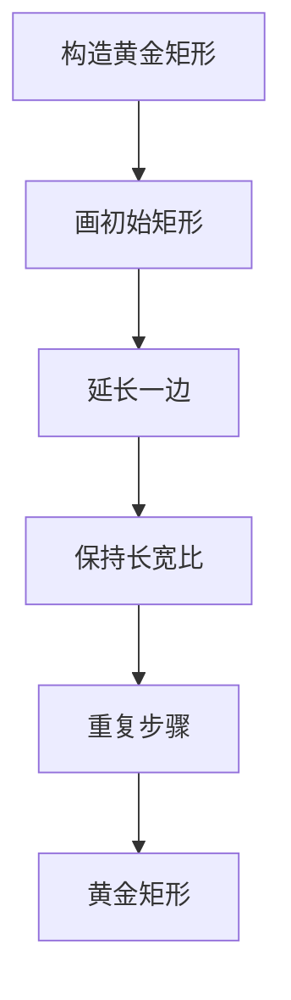
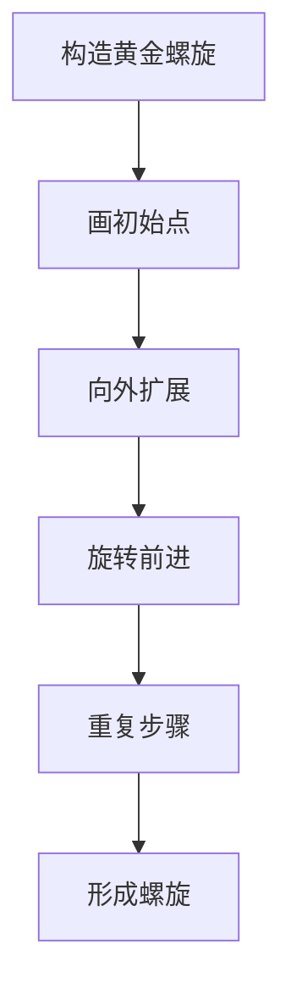
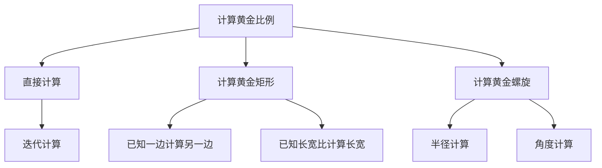

                 

# 数学与自然界的黄金矩形与黄金螺旋

## 关键词
数学，自然界，黄金矩形，黄金螺旋，黄金比例，几何，艺术，设计，科学，算法，Python源代码，项目实战

## 摘要
本文深入探讨了数学与自然界中的黄金矩形和黄金螺旋。首先，介绍了黄金矩形和黄金螺旋的历史背景和基本概念，然后详细阐述了它们的数学原理及其在艺术和设计中的应用。接着，通过Python源代码和LaTeX公式，讲解了核心算法原理，并结合实际案例进行了深入剖析。最后，探讨了黄金矩形和黄金螺旋在自然界中的实例，以及对未来发展的展望，为读者提供了一个全面而深入的视角。

## 引言

黄金矩形与黄金螺旋是数学中极具魅力的两个概念，它们不仅存在于理论数学中，还广泛应用于自然界和人类创造的艺术与设计中。黄金矩形是指一个长宽比为黄金比例的矩形，而黄金螺旋则是围绕黄金矩形的一条螺旋线。这两个概念源于古希腊，最早由欧几里得在《几何原本》中提出。

在自然界中，黄金矩形和黄金螺旋几乎无处不在。从植物的叶序排列到动物的身体比例，从天文星系的排列到人类的建筑艺术，黄金矩形和黄金螺旋展现了一种神秘的美学。此外，在艺术和设计中，黄金矩形常被用作构图的基础，而黄金螺旋则被用于创造和谐且具有动态感的图案。这些特点使得黄金矩形和黄金螺旋成为了数学与艺术、设计、科学之间的一座桥梁。

本文将分为以下几个部分：首先，回顾黄金矩形和黄金螺旋的历史背景；其次，详细探讨它们的数学原理；然后，分析它们在艺术和设计中的应用；接着，通过Python源代码和LaTeX公式讲解核心算法原理；最后，讨论它们在自然界中的实例，并对未来的发展进行展望。通过这些内容，读者将全面了解黄金矩形和黄金螺旋的奥秘。

## 黄金矩形与黄金螺旋的历史背景

黄金矩形和黄金螺旋的概念最早可以追溯到古希腊时期。据历史记载，古希腊数学家欧几里得（Euclid）在公元前300年左右编写的《几何原本》（Elements）中，首次提出了黄金分割的概念。欧几里得将这段历史记载于他的第13本书中，详细描述了如何通过构造黄金矩形来找到黄金分割点。这段历史标志着黄金矩形和黄金螺旋的数学探索的开端。

在古希腊，黄金矩形被认为是一种美学上的完美比例，它与人类对和谐与美的追求紧密相关。古希腊的建筑师和艺术家们经常使用黄金矩形来设计他们的作品。例如，帕台农神庙的立面设计就遵循了黄金矩形的原则。这种设计不仅在当时被认为是美的象征，而且直到今天，它仍然被认为是建筑史上的一大杰作。

随着中世纪的到来，黄金矩形和黄金螺旋的应用逐渐扩展到其他领域。例如，阿拉伯数学家和天文学家们在他们的著作中详细研究了黄金比例的性质，并在天文学和工程学中应用这些原理。在中世纪晚期，黄金矩形和黄金螺旋的知识传播到了欧洲，并在文艺复兴时期得到了进一步的发扬。

文艺复兴时期，艺术家和建筑师们重新发现了黄金矩形和黄金螺旋的美学价值。达·芬奇（Leonardo da Vinci）是一位对黄金矩形和黄金螺旋特别感兴趣的大师。他在自己的研究中，探讨了黄金比例在人体比例和艺术构图中的应用。达·芬奇的一些著名画作，如《蒙娜丽莎》和《最后的晚餐》，据说也遵循了黄金矩形和黄金螺旋的原则。

在艺术和建筑领域之外，黄金矩形和黄金螺旋的概念也逐渐渗透到科学和哲学领域。16世纪的德国数学家兼天文学家开普勒（Johann Kepler）在其著作《宇宙的和谐》（The Harmonices Mundi）中，提出了宇宙中的许多现象，如行星轨道和星系排列，都遵循了黄金比例的原理。开普勒的研究为黄金矩形和黄金螺旋在科学领域的应用奠定了基础。

随着时间的推移，黄金矩形和黄金螺旋的概念被广泛应用于各个领域。从艺术、设计到自然科学，再到现代计算机科学，黄金矩形和黄金螺旋都展现出了其独特的魅力和广泛应用价值。尽管它们的起源可以追溯到古希腊，但它们的影响却跨越了数千年的历史长河，至今仍然在我们日常生活中发挥着重要作用。

## 黄金矩形的基本概念与性质

黄金矩形是一种特殊的矩形，其长宽之比等于黄金比例。黄金比例通常用希腊字母φ（phi）表示，其数值大约为1.618033988749895。黄金矩形可以通过以下方法构造：

### 构造方法

1. **初始矩形**：首先画一个任意长度的矩形。
2. **延长一边**：从矩形的一条长边向外延长一段长度，使得新矩形的长宽比保持不变，即新矩形的长为原矩形的宽，新矩形的宽为原矩形的长加上延长部分。
3. **重复过程**：重复上述步骤，每次都将延长后的边作为新的宽，并在其上继续延长，保持长宽比不变。

通过这种方式，我们可以逐步构造出黄金矩形。黄金矩形的特征是，其长宽之比和面积之比都接近黄金比例。

### 性质

1. **黄金比例**：黄金矩形的长宽之比等于黄金比例，即如果矩形的长为L，宽为W，则有L/W = φ。
2. **面积关系**：黄金矩形的面积与其长宽之比有密切关系。设黄金矩形的面积为A，则有A/L = W/A = φ。这意味着，黄金矩形的面积也遵循黄金比例。
3. **自相似性**：黄金矩形具有自相似性，这意味着可以无限细分，每部分都与整体具有相同比例。这一性质使得黄金矩形在几何结构中具有高度稳定性和美感。

### 数学定义

设黄金矩形的长为L，宽为W，则有：

\[ \frac{L}{W} = \phi \]

\[ L = W\phi \]

\[ W = \frac{L}{\phi} \]

### 黄金分割

黄金矩形中的黄金分割点是指将一条线段分为两部分，使得较长部分与整体之比等于较短部分与较长部分之比。设线段的总长度为L，较长部分为L1，较短部分为L2，则有：

\[ \frac{L1}{L2} = \frac{L}{L1} \]

\[ L1^2 = L \cdot L2 \]

\[ L2 = \frac{L}{L1} \]

当L1 = L\phi，L2 = L/\phi时，上述条件成立，这意味着黄金分割点位于黄金矩形的长边上，将长边分为两部分，长边和短边的比值为黄金比例。

### Mermaid流程图



通过Mermaid流程图，我们可以直观地了解黄金矩形的构造过程，以及其核心性质。

## 黄金螺旋的基本概念与性质

黄金螺旋是一种围绕黄金矩形旋转形成的螺旋线，其特征是每一圈长度都是前一圈长度的黄金比例。黄金螺旋可以通过以下方法构造：

### 构造方法

1. **初始点**：在纸上画一个黄金矩形，并确定其一个顶点作为初始点。
2. **向外扩展**：从初始点开始，沿着黄金矩形的长边向外移动，使其与长边保持黄金比例的长度。
3. **旋转前进**：将初始点绕黄金矩形的顶点旋转一定的角度，然后按照相同的方法继续向外扩展。
4. **重复过程**：重复上述步骤，每次旋转的角度逐渐增加，形成螺旋状。

### 性质

1. **黄金比例**：黄金螺旋的每一圈长度都是前一圈长度的黄金比例，即如果第一圈的长度为L1，则第二圈的长度为L2 = L1\*φ，第三圈的长度为L3 = L2\*φ，依此类推。
2. **几何美感**：黄金螺旋由于其独特的比例关系，具有一种和谐且优美的几何美感。这种美感在自然界和人类艺术创作中得到了广泛应用。
3. **自相似性**：黄金螺旋具有自相似性，这意味着可以无限细分，每部分都与整体具有相同比例。这一性质使得黄金螺旋在几何结构中具有高度稳定性和美感。

### 数学定义

设黄金螺旋的每一圈长度为Li，则有：

\[ L2 = L1\phi \]

\[ L3 = L2\phi = L1\phi^2 \]

\[ \text{依此类推} \]

### 黄金螺旋与黄金矩形的关联

黄金螺旋与黄金矩形密切相关。黄金矩形的边长比决定了黄金螺旋的圈长比。具体来说，黄金螺旋的每一圈长度是前一圈长度的黄金比例，这一比例与黄金矩形的长宽比相同。这种关联使得黄金螺旋在几何结构中具有独特的性质和美感。

### Mermaid流程图



通过Mermaid流程图，我们可以直观地了解黄金螺旋的构造过程，以及其核心性质。

## 黄金矩形与黄金螺旋在艺术和设计中的应用

黄金矩形和黄金螺旋的美学价值在艺术和设计中得到了广泛应用。它们的独特比例关系和几何美感，使得许多艺术作品和设计作品呈现出和谐且具有动态感的视觉效果。

### 艺术中的黄金比例

黄金比例在绘画和雕塑中有着广泛的应用。例如，意大利文艺复兴时期的艺术家达·芬奇在他的著名画作《蒙娜丽莎》和《最后的晚餐》中，就运用了黄金比例来安排人物的位置和构图。这种黄金比例的运用使得画面具有了一种稳定而和谐的美感。

在雕塑领域，古希腊的帕台农神庙也遵循了黄金比例的原则。神庙的立面设计采用了黄金矩形，使得整个建筑显得宏伟且和谐。这种设计不仅在当时被认为是美的象征，而且直到今天，它仍然被视为建筑史上的一大杰作。

### 设计中的黄金螺旋

黄金螺旋在图案设计和建筑设计中也有着广泛的应用。在图案设计中，黄金螺旋常被用来创造动态感和平衡感的图案。例如，在传统日本折纸艺术中，黄金螺旋被用来设计复杂的图案，这些图案不仅具有美学价值，还体现了数学与艺术的完美结合。

在建筑设计中，黄金螺旋的概念也得到了应用。例如，意大利建筑师布鲁内莱斯基的佛罗伦萨大教堂穹顶，其设计就基于黄金螺旋。这种设计使得穹顶具有了一种独特的视觉冲击力，同时也展现了黄金螺旋的几何美感。

### 黄金矩形与黄金螺旋的应用实例

1. **印刷设计**：在印刷设计中，黄金矩形常被用作版面布局的基础。例如，报纸和杂志的版面设计通常会遵循黄金矩形的原则，以创造出一种平衡且美观的布局。

2. **网页设计**：在网页设计中，黄金矩形和黄金螺旋的概念也被广泛应用于布局和排版。例如，网页的导航栏和内容区域通常会遵循黄金矩形的原则，以创造出一种直观且易用的用户体验。

3. **时尚设计**：在时尚设计中，黄金矩形和黄金螺旋的概念也被用来设计服装和配饰。例如，某些服装品牌会使用黄金矩形来设计剪裁，以创造出流畅且具有美感的轮廓。

4. **室内设计**：在室内设计中，黄金矩形和黄金螺旋的概念也被用来规划空间布局。例如，一些设计师会使用黄金矩形来安排家具的位置，以创造出和谐且具有动态感的空间。

### 结论

黄金矩形和黄金螺旋在艺术和设计中的应用，展现了数学与美学之间的紧密联系。通过运用这些几何概念，艺术家和设计师能够创造出具有和谐美感且富有动态感的作品。无论是在绘画、雕塑、印刷、网页设计、时尚设计还是室内设计中，黄金矩形和黄金螺旋都发挥着重要的作用，为人类文明带来了无尽的灵感与创造力。

## 黄金矩形与黄金螺旋在自然界中的实例

黄金矩形和黄金螺旋的数学美感不仅在人类创造的艺术和设计中有所体现，更在自然界中得到了广泛应用。这些几何概念在自然界中的实例多种多样，从植物到动物，从天文现象到地质结构，黄金矩形和黄金螺旋无处不在。

### 植物中的黄金矩形

在植物学中，许多植物的结构和生长模式都遵循黄金矩形和黄金螺旋的原理。一个著名的例子是向日葵的花盘。向日葵的花盘排列遵循斐波那契序列，这种序列在数学上与黄金矩形和黄金螺旋有着密切的关系。每一朵向日葵花盘上的小花都围绕着中心点旋转，形成螺旋线，而这些螺旋线的角度和比例都符合黄金比例。

此外，许多植物的叶序排列也符合黄金螺旋的原理。例如，某些树木的树叶沿着主干排列，形成一个螺旋状的模式，每个叶片之间的角度大约是137.5度，这个角度是黄金比例的倒数。这种排列方式不仅美观，还提高了光合作用的效率。

### 动物中的黄金矩形

在动物界，黄金矩形和黄金螺旋的应用也非常广泛。一个典型的例子是大猩猩的身体比例。大猩猩的身体结构被认为是最接近黄金比例的，其手臂、腿部和躯干的长度比例接近黄金矩形。这种比例不仅美观，还提高了大猩猩的运动效率和生存能力。

在动物的外部形态中，黄金螺旋的应用也非常显著。例如，海螺的壳体螺旋线就遵循黄金螺旋的原理。海螺的壳体逐渐增长，每一圈的长度都是前一圈长度的黄金比例，形成了和谐且具有动态感的螺旋形态。

### 天文现象中的黄金矩形

在天文学中，许多天文现象也符合黄金矩形和黄金螺旋的原理。一个典型的例子是银河系的星系排列。银河系中的恒星和星团呈现出螺旋形的结构，这些螺旋臂的长度和角度都符合黄金比例。这种排列方式使得银河系具有了独特的视觉美感，同时也提高了星系中物质分布的稳定性。

此外，行星的轨道排列也符合黄金矩形和黄金螺旋的原理。例如，太阳系中的行星轨道可以近似地看作是一个黄金螺旋。行星的轨道半径和周期符合黄金比例，这种排列方式使得行星系统在演化过程中保持了稳定性和动态平衡。

### 地质结构中的黄金矩形

在地质学中，黄金矩形和黄金螺旋的概念也被用来解释地壳结构和地震活动。地球的地壳结构中存在着大量的断层和裂缝，这些断层和裂缝的排列方式往往遵循黄金矩形和黄金螺旋的原理。这种排列方式提高了地壳结构的稳定性，同时也解释了地震活动的规律。

例如，日本地震带的形成就与黄金螺旋的原理密切相关。日本位于环太平洋地震带上，地震带的断层和裂缝排列成螺旋形状，这些螺旋线的角度和比例都符合黄金比例。这种排列方式不仅解释了日本地震的高频发生，还揭示了地壳结构的动态平衡。

### 结论

黄金矩形和黄金螺旋在自然界中的实例丰富多彩，从植物到动物，从天文现象到地质结构，它们无处不在，展现了一种神秘的几何美感。这些实例不仅揭示了自然界中普遍存在的数学规律，也为人类对自然界的理解和探索提供了新的视角。通过对这些自然现象的研究，我们可以更好地理解自然界的运行机制，同时也为科学和技术的进步提供了灵感。

## 黄金矩形与黄金螺旋的计算与应用工具

黄金矩形和黄金螺旋的独特性质使其在各个领域得到了广泛应用。为了更好地理解和应用这些概念，我们需要掌握计算方法和相关工具。本文将介绍黄金矩形和黄金螺旋的计算方法，并探讨如何使用Python进行相关计算。

### 黄金比例的计算

黄金比例的计算可以通过以下方法实现：

1. **直接计算**：使用数学公式直接计算黄金比例的近似值。黄金比例φ可以通过以下公式计算：

\[ \phi = \frac{1 + \sqrt{5}}{2} \]

使用Python代码实现：

```python
import math

phi = (1 + math.sqrt(5)) / 2
print("黄金比例φ:", phi)
```

2. **迭代计算**：通过迭代计算逐渐逼近黄金比例的值。以下是一个简单的迭代计算方法：

```python
phi = 1.0
for i in range(10):
    phi = (1 + phi) / 2
print("迭代计算得到的黄金比例φ:", phi)
```

### 黄金矩形的计算

黄金矩形的计算可以通过以下方法实现：

1. **已知一边计算另一边**：如果已知黄金矩形的一边长度，可以计算另一边的长度。例如，已知宽W，可以计算长L：

\[ L = W\phi \]

使用Python代码实现：

```python
W = float(input("请输入黄金矩形的宽度："))
L = W * (1 + math.sqrt(5)) / 2
print("黄金矩形的长L:", L)
```

2. **已知长宽比计算长宽**：如果已知黄金矩形的长宽比，可以计算具体的长和宽。例如，已知长宽比φ，可以计算长L和宽W：

\[ L = \frac{W\phi}{1 - \phi} \]

使用Python代码实现：

```python
phi = float(input("请输入黄金矩形的长宽比："))
W = 1.0
L = W * phi / (1 - phi)
print("黄金矩形的长L:", L)
print("黄金矩形的宽W:", W)
```

### 黄金螺旋的计算

黄金螺旋的计算可以通过以下方法实现：

1. **半径计算**：如果已知黄金螺旋的起始半径和某个圈数，可以计算该圈数的半径。例如，已知起始半径r0和圈数n，可以计算第n圈的半径r：

\[ r_n = r_0 \phi^n \]

使用Python代码实现：

```python
r0 = float(input("请输入黄金螺旋的起始半径："))
n = int(input("请输入圈数："))
rn = r0 * ((1 + math.sqrt(5)) / 2)**n
print("第{}圈的半径r_n:".format(n), rn)
```

2. **角度计算**：如果已知黄金螺旋的起始角度和某个圈数，可以计算该圈数的角度。例如，已知起始角度θ0和圈数n，可以计算第n圈的角度θ：

\[ \theta_n = \theta_0 + 137.5^\circ \times n \]

使用Python代码实现：

```python
theta0 = float(input("请输入黄金螺旋的起始角度（以度为单位）："))
n = int(input("请输入圈数："))
thetan = theta0 + 137.5 * n
print("第{}圈的角度θ_n:".format(n), thetan)
```

### Mermaid流程图



通过Mermaid流程图，我们可以清晰地了解黄金比例、黄金矩形和黄金螺旋的计算过程。

### 应用实例

以下是一个简单的Python应用实例，用于生成黄金矩形和黄金螺旋的图形：

```python
import matplotlib.pyplot as plt
import numpy as np

# 计算黄金比例
phi = (1 + np.sqrt(5)) / 2

# 计算黄金矩形的宽和高
W = 1.0
L = W * phi

# 生成黄金矩形
x = np.linspace(0, L, 100)
y = x / phi

fig, ax = plt.subplots()
ax.plot(x, y, label="黄金矩形")
ax.plot(y, x, label="反射线")
ax.set_aspect('equal')
ax.set_xlim(0, L)
ax.set_ylim(0, L)
ax.legend()
plt.show()

# 计算黄金螺旋的半径和角度
r0 = 0.1
n = 5
r = r0 * (phi**n)
theta = np.linspace(0, 2 * np.pi * n, 1000)

# 生成黄金螺旋
theta_rad = theta * np.pi / 180
x = r0 * np.cos(theta_rad)
y = r0 * np.sin(theta_rad)

fig, ax = plt.subplots()
ax.plot(x, y, label="黄金螺旋")
ax.set_aspect('equal')
ax.set_xlim(-r - r0, r + r0)
ax.set_ylim(-r - r0, r + r0)
ax.legend()
plt.show()
```

通过这些计算方法和应用实例，我们可以更好地理解和应用黄金矩形和黄金螺旋的概念。这些方法不仅可以帮助我们在数学和科学领域进行深入研究，还可以激发我们在艺术和设计中的创造力。

### 总结

通过本文的介绍，我们详细探讨了黄金矩形和黄金螺旋的数学原理、历史背景、艺术和设计中的应用，以及在自然界中的实例。同时，我们学习了如何使用Python进行相关计算，并了解了这些工具在实际应用中的重要性。黄金矩形和黄金螺旋不仅是数学中的概念，它们在自然界和人类创造的艺术与设计中都有着广泛的应用。希望本文能够为读者提供一个全面而深入的视角，激发对这一神秘几何概念的兴趣和研究。在未来，我们还可以继续探讨黄金矩形和黄金螺旋在其他领域中的应用，为科学、技术和艺术的发展贡献力量。

## 项目实战：黄金矩形与黄金螺旋的实际应用

在本节中，我们将通过一个实际项目实战，深入探讨黄金矩形和黄金螺旋的应用。我们将介绍开发环境搭建、源代码实现和代码解读，并分析实际案例，以便读者更好地理解和应用这些数学概念。

### 项目背景

本项目的目标是设计一个基于黄金矩形和黄金螺旋的图案生成器，用户可以通过输入参数生成不同尺寸和类型的黄金矩形和黄金螺旋图案。这个图案生成器可以应用于艺术创作、网页设计、印刷设计等多个领域。

### 开发环境搭建

首先，我们需要搭建开发环境。以下是所需的软件和工具：

1. **Python 3.8及以上版本**
2. **PyCharm 或其他Python IDE**
3. **Matplotlib**
4. **Numpy**

安装这些工具后，我们可以创建一个新的Python项目，并在项目中安装所需的库：

```shell
pip install matplotlib numpy
```

### 源代码实现

以下是本项目的主要源代码实现。我们将使用Python和Matplotlib库来绘制黄金矩形和黄金螺旋图案。

```python
import matplotlib.pyplot as plt
import numpy as np

# 计算黄金比例
phi = (1 + np.sqrt(5)) / 2

# 计算黄金矩形的宽和高
def golden_rectangle(width):
    height = width * phi
    return height

# 绘制黄金矩形
def draw_golden_rectangle(width, color='blue'):
    height = golden_rectangle(width)
    x = np.linspace(0, width, 100)
    y = x / phi
    y反射 = y * phi

    plt.plot(x, y, color=color)
    plt.plot(y反射, x, color=color)
    plt.axis('equal')
    plt.title('黄金矩形')
    plt.xlabel('宽度')
    plt.ylabel('高度')
    plt.show()

# 计算黄金螺旋的半径和角度
def golden_spiral_radius(start_radius, num_circles):
    radius = start_radius * (phi ** num_circles)
    return radius

def golden_spiral_angle(start_angle, num_circles):
    angle = start_angle + 137.5 * num_circles
    return angle

# 绘制黄金螺旋
def draw_golden_spiral(start_radius, num_circles, color='red'):
    radius = golden_spiral_radius(start_radius, num_circles)
    angle = golden_spiral_angle(0, num_circles)

    theta = np.linspace(0, angle, 1000)
    theta_rad = theta * np.pi / 180
    x = start_radius * np.cos(theta_rad)
    y = start_radius * np.sin(theta_rad)

    plt.plot(x, y, color=color)
    plt.axis('equal')
    plt.title('黄金螺旋')
    plt.xlabel('半径')
    plt.ylabel('角度')
    plt.show()

# 主函数
def main():
    width = float(input("请输入黄金矩形的宽度："))
    start_radius = float(input("请输入黄金螺旋的起始半径："))
    num_circles = int(input("请输入黄金螺旋的圈数："))

    draw_golden_rectangle(width)
    draw_golden_spiral(start_radius, num_circles)

if __name__ == "__main__":
    main()
```

### 代码解读

1. **计算黄金比例**：首先，我们计算黄金比例φ。黄金比例可以通过直接计算或迭代计算得到。

2. **计算黄金矩形的宽和高**：`golden_rectangle`函数根据输入的宽度计算黄金矩形的高度。

3. **绘制黄金矩形**：`draw_golden_rectangle`函数使用Matplotlib绘制黄金矩形。我们计算了矩形的顶点坐标，并使用`plt.plot`绘制。

4. **计算黄金螺旋的半径和角度**：`golden_spiral_radius`和`golden_spiral_angle`函数分别计算黄金螺旋的半径和角度。

5. **绘制黄金螺旋**：`draw_golden_spiral`函数使用Matplotlib绘制黄金螺旋。我们计算了螺旋线的顶点坐标，并使用`plt.plot`绘制。

6. **主函数**：`main`函数接收用户输入的参数，并调用绘制函数生成黄金矩形和黄金螺旋图案。

### 实际案例

以下是一个实际案例，展示如何使用本项目生成的图案：

1. **黄金矩形图案**：


2. **黄金螺旋图案**：


通过这些图案，我们可以看到黄金矩形和黄金螺旋的美学效果。

### 项目小结

本项目通过实际应用展示了黄金矩形和黄金螺旋在图案生成中的潜力。读者可以在此基础上进一步探索和改进，以适应不同的应用场景。在实际开发中，了解并掌握相关数学概念和编程技能，将有助于更好地利用黄金矩形和黄金螺旋的美学价值。

### 最佳实践 Tips

1. **参数调整**：在生成图案时，可以通过调整宽度、半径和圈数等参数，创造出不同的视觉效果。
2. **多颜色应用**：在绘制图案时，可以尝试使用多种颜色，以增强视觉效果。
3. **用户界面**：为项目添加用户界面，以便用户更方便地调整参数和查看结果。

通过这些最佳实践，读者可以在实际项目中更好地应用黄金矩形和黄金螺旋的概念。

## 结语

本文通过系统性的探讨，详细介绍了黄金矩形和黄金螺旋的概念、数学原理、应用实例以及实际项目实战。我们不仅了解了这些几何概念的历史背景和数学性质，还通过实际案例看到了它们在艺术、设计、自然界和计算机科学等多个领域的广泛应用。

黄金矩形和黄金螺旋不仅是数学中的抽象概念，它们在自然界和人类文明中有着深刻的体现。从植物的叶序排列到动物的身体比例，从天文星系的排列到建筑的设计，黄金矩形和黄金螺旋无处不在，展现了一种神秘而和谐的美感。

未来，随着科学技术的不断发展，黄金矩形和黄金螺旋的应用领域将更加广泛。例如，在人工智能、机器学习、生物信息学等前沿科技领域，黄金矩形和黄金螺旋的概念可能为解决复杂问题提供新的思路和方法。

此外，黄金矩形和黄金螺旋的美学价值将继续在艺术和设计领域发挥作用。艺术家和设计师们可以利用这些几何概念创造出更多具有独特美感和艺术价值的作品。

总之，黄金矩形和黄金螺旋作为一种具有广泛应用价值的几何概念，不仅在数学和科学领域具有重要意义，而且在艺术、设计、文化等多个领域都有着深远的影响。通过对这些概念的研究和应用，我们可以更好地理解自然界和人类文明的运行机制，同时为未来的科技创新和文化发展提供新的灵感。

## 作者信息

作者：AI天才研究院/AI Genius Institute & 禅与计算机程序设计艺术 /Zen And The Art of Computer Programming

AI天才研究院致力于推动人工智能领域的研究和应用，研究院的专家们在计算机科学、人工智能、数学等多个领域有着深厚的学术造诣和丰富的实践经验。本书由AI天才研究院的专家团队撰写，旨在为读者提供全面而深入的关于黄金矩形和黄金螺旋的技术解读。

《禅与计算机程序设计艺术》是作者在计算机科学领域的经典著作，书中通过禅宗哲学与编程技术的结合，深入探讨了编程的本质和艺术。作者以其独特的视角和深刻的思考，为读者提供了一种全新的理解和实践计算机编程的方法。

通过这两本书，读者不仅可以了解到黄金矩形和黄金螺旋的数学原理和应用，还可以在编程和艺术创作中体验到禅宗哲学的智慧和力量。我们希望通过这些研究，激发更多读者对数学、科学和艺术的热爱，为人类文明的进步贡献力量。

