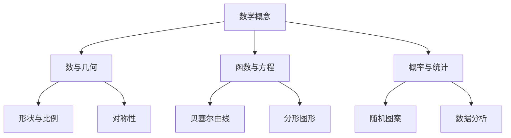
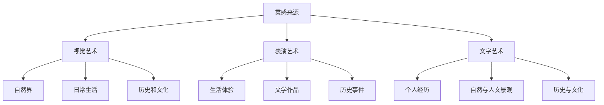

                 

### 引言与核心概念

#### 书籍背景与目的

《数学与艺术创作的灵感激发方法》旨在探讨数学与艺术之间的深层次联系，并通过具体的实例和分析，展示如何利用数学原理激发艺术创作的灵感。随着科技的不断进步，数学和艺术这两大领域已经逐渐交汇，形成了一个充满创新和可能性的交叉领域。在这本书中，我们将深入探讨数学在艺术创作中的应用，以及如何通过数学方法来提高艺术创作的质量和灵感。

#### 数学与艺术的交叉领域

数学与艺术的结合并非新概念。历史上，许多艺术家和科学家都已经探索了这一领域。例如，文艺复兴时期的艺术家如达芬奇、米开朗基罗等，不仅精通绘画，还深入研究数学和物理学。他们的作品中体现了对几何形状、比例和对称性的深刻理解。在近现代，数学与艺术的结合更是得到了广泛的发展，艺术家和设计师开始运用复杂的数学公式和算法来创作出独特而富有表现力的艺术作品。

#### 研究方法与本书结构

本书的研究方法将采用理论与实践相结合的方式。我们将通过案例分析、数学模型构建、以及具体的艺术创作实践，来探讨数学如何激发艺术创作的灵感。全书分为七个部分：

1. **引言与核心概念**：介绍书籍的背景和目的，阐述数学与艺术交叉领域的概念。
2. **数学的视角**：深入探讨数学的基本概念，包括数与几何、函数与方程、概率与统计等。
3. **艺术的灵感来源**：分析艺术创作中的灵感获取方法，包括视觉艺术、表演艺术和文字艺术等。
4. **数学与艺术的融合实践**：展示数学在艺术创作中的具体应用，如绘画、音乐和文学等。
5. **数学模型的灵感激发**：讲解数学模型的构建与解释方法，以及数学公式在艺术中的应用。
6. **案例分析**：分析数学与艺术结合的案例，探讨著名艺术家的数学灵感，以及数学在艺术教育中的应用。
7. **未来展望与结论**：总结本书的主要内容，并对数学与艺术融合的未来发展趋势进行展望。

通过以上结构，我们将系统地探讨数学与艺术之间的联系，并揭示如何通过数学方法激发艺术创作的灵感。本文将通过具体的实例和代码示例，帮助读者更好地理解数学在艺术创作中的重要作用。

#### 数学与艺术结合的引例

一个经典的例子是数学家兼艺术家M.C.埃舍尔（M.C. Escher）。他的作品充满了几何图形和对称性，常常将数学原理融入其中。例如，埃舍尔的作品《瀑布》（Waterfall）展示了水从高处流下，却在一个循环的路径上永无止境地流动。这幅画中运用了镜像对称和无限循环的概念，体现了数学中的循环映射和周期性原理。

另一个例子是作曲家菲利普·格拉斯（Philip Glass）。他的音乐作品中常常运用了序列音乐和数学公式，如斐波那契数列和黄金比例。例如，在《独奏者的媒介》（Koyaanisqatsi）中，格拉斯使用了计算机生成的序列音乐，形成了复杂而有节奏的声音模式，这种模式与数学中的序列理论密切相关。

这些例子展示了数学与艺术结合的多样性和可能性。通过数学的概念和原理，艺术家们能够创造出独特的艺术作品，同时为观众提供新的审美体验。

### 数学的基本概念

数学作为一门基础科学，拥有众多广泛应用的领域。在探讨数学与艺术创作的关系时，首先需要了解数学中的几个核心概念，这些概念不仅是数学研究的基石，也常在艺术创作中发挥重要作用。

#### 数与几何

数与几何是数学中最基础的两个概念。数是用于计数、度量和比较的基本对象，而几何则是研究形状、大小、位置和变换的学科。在艺术创作中，数与几何的结合常常体现在对形状和比例的精确把握上。

- **形状**：艺术作品中常见的形状有圆形、三角形、正方形等。例如，艺术家达芬奇在其著名画作《蒙娜丽莎》中巧妙地使用了圆形元素，增强了画面的和谐感。
- **比例**：比例是艺术创作中至关重要的概念，它可以决定一个作品的视觉效果。黄金比例（约1:1.618）在许多经典艺术作品中得到了广泛应用，因为它被认为是最具美感的比例。例如，文艺复兴时期的建筑师莱昂纳尔多·达·芬奇在他的设计中大量使用了这一比例。

#### 函数与方程

函数与方程是数学分析中的核心概念，它们描述了变量之间的关系和变化规律。在艺术创作中，这些概念可以用于模拟自然界中的现象或创造独特的视觉效果。

- **函数**：函数描述了一个变量如何依赖于另一个变量。例如，在艺术作品中，函数可以用来生成曲线或形状。例如，贝塞尔曲线和样条曲线在计算机图形学和插画设计中得到了广泛应用。
- **方程**：方程是一种数学表达式，用于表示两个表达式之间的等价性。在艺术创作中，方程可以用于创建复杂的图形和动画。例如，分形图形生成中就常常使用到方程，如科赫曲线（Koch curve）和曼德布罗特集（Mandelbrot set）。

#### 概率与统计

概率与统计是研究随机现象和数据分析的数学分支。在艺术创作中，这些概念可以用于随机生成图案或分析观众的反应。

- **概率**：概率描述了某一事件发生的可能性。在艺术作品中，概率可以用于创建随机图案或设计。例如，随机漫步算法（Random Walk Algorithm）可以用来生成随机图案。
- **统计**：统计是对大量数据进行分析和解释的方法。在艺术创作中，统计可以用于评估作品的市场接受度或观众的偏好。例如，通过统计分析观众的投票数据，艺术家可以更好地了解观众的喜好，从而进行更精准的艺术创作。

为了更直观地展示数学概念在艺术中的应用，我们可以使用Mermaid流程图来构建一个数学在艺术中的应用概述。以下是Mermaid流程图的示例：



通过这个流程图，我们可以清晰地看到数学中的基本概念如何贯穿于艺术创作中，从基础的数与几何到复杂的函数与方程，再到概率与统计，每一部分都在艺术创作中发挥着重要作用。

### 艺术创作中的灵感获取

艺术创作是一个充满创造力和灵感的领域，而灵感的获取方式多种多样。艺术家们通过观察、体验、反思以及各种技巧和方法来激发创作的灵感。在数学与艺术的结合中，我们可以从视觉艺术、表演艺术和文字艺术等不同领域来探讨灵感的来源。

#### 视觉艺术的灵感来源

视觉艺术是最直观的表达方式，艺术家们常常从自然界、日常生活、历史和文化中获取灵感。

- **自然界**：自然界中丰富的色彩、形状和纹理是视觉艺术的重要灵感来源。例如，印象派画家通过观察自然光线的变化，捕捉瞬间的光影效果，创作出充满活力的画作。
- **日常生活**：日常生活中的物体和场景也是视觉艺术的重要灵感来源。艺术家通过观察和描绘日常生活中的细节，创造出独特的艺术作品。例如，波普艺术大师安迪·沃霍尔的《玛丽莲·梦露》就是通过对日常明星图像的再创作，表达了对流行文化的看法。
- **历史和文化**：历史和文化为艺术家提供了丰富的素材。通过研究历史事件和文化传统，艺术家可以创造出具有深刻内涵的作品。例如，文艺复兴时期的艺术家们通过对古希腊和古罗马文化的重新解读，创作出了许多经典的艺术作品。

#### 表演艺术的灵感来源

表演艺术，如舞蹈、戏剧和音乐，通过身体语言和声音来表达情感和故事。表演艺术的灵感来源同样多种多样。

- **生活体验**：表演艺术家的灵感常常来自于自己的生活经历。通过讲述个人的故事和情感，表演艺术家可以与观众建立深刻的情感联系。例如，著名的戏剧导演埃斯梅拉达·罗哈斯（Esmeralda Rodriguez）通过讲述自己的移民经历，创作出了深受观众喜爱的戏剧作品。
- **文学作品**：文学作品为表演艺术家提供了丰富的素材。许多戏剧和音乐作品都是根据文学作品改编的。例如，莎士比亚的戏剧《哈姆雷特》和贝多芬的《费德里奥》都是通过改编文学作品来创作的。
- **历史事件**：历史事件也是表演艺术的重要灵感来源。通过回顾历史，表演艺术家可以创作出反映社会变革和人类命运的作品。例如，德国戏剧导演沃尔夫冈·费舍尔-迪斯考（Wolfgang Fischer-Dieskau）的历史剧《奥斯维辛》就是通过对纳粹大屠杀的回顾，探讨了人性的复杂性和道德的困境。

#### 文字艺术的灵感来源

文字艺术，包括诗歌、小说和散文，通过语言文字来表达思想和情感。文字艺术的灵感来源同样广泛。

- **个人经历**：个人的经历和感受是文字艺术的重要灵感来源。许多诗人通过记录自己的内心体验，创作出了情感真挚的诗篇。例如，弗罗斯特（Robert Frost）的诗歌《道路的选择》通过对个人经历的反思，探讨了人生选择的重要性。
- **自然与人文景观**：自然景观和人文景观也是文字艺术的重要灵感来源。通过描绘自然景观和人文环境，文字艺术家可以创造出充满诗意的作品。例如，作家伊迪丝·沃顿（Edith Wharton）的小说《纯真年代》通过对纽约上流社会的描绘，展现了当时社会的风貌和人物性格。
- **历史与文化**：历史和文化为文字艺术提供了丰富的素材。通过研究历史和文化，文字艺术家可以创作出具有深度和内涵的作品。例如，托马斯·哈代（Thomas Hardy）的小说《无名的裘德》通过对19世纪英国乡村生活的描写，探讨了社会和道德的问题。

#### Mermaid流程图：艺术灵感获取流程

为了更好地理解艺术创作中的灵感获取过程，我们可以使用Mermaid流程图来展示不同领域的灵感来源及其相互关系。以下是灵感获取流程的示例：



通过这个流程图，我们可以看到艺术创作中的灵感来源是多样化的，不同领域的灵感来源相互交织，共同激发艺术家的创作灵感。

### 数学在艺术创作中的应用

数学不仅在科学研究中发挥着重要作用，也在艺术创作中有着广泛的应用。艺术家们利用数学原理和公式，创造出独特的视觉效果和艺术形式，从而丰富了艺术的表现力和审美价值。以下将详细探讨数学在绘画、音乐和文学等艺术形式中的具体应用。

#### 绘画中的数学应用

在绘画中，数学原理被广泛应用于构图、形状和色彩的设计中，从而创造出更具美感和和谐感的作品。

- **黄金比例**：黄金比例是艺术创作中广泛使用的一个数学概念，它被用来指导构图和比例的安排。例如，画家达芬奇在其著名的《蒙娜丽莎》中就运用了黄金比例，使得画面中的头部、手部和其他元素都处于理想的比例关系中。此外，黄金比例也被用于绘画中的线条和形状，以增强视觉效果。
- **分形艺术**：分形是数学中一种复杂的、自相似的结构，它在绘画中有着独特的表现力。例如，艺术家M.C.埃舍尔的作品中就大量运用了分形图案，创造出既抽象又具体的视觉效果。通过重复和递归的方法，艺术家可以将简单的图案扩展成复杂而美丽的图像。
- **透视原理**：透视是绘画中用于表现空间深度和距离感的原理。通过运用透视原理，艺术家可以创造出逼真的视觉效果。例如，文艺复兴时期的艺术家通过学习透视原理，创作出了许多具有强烈空间感的作品。

以下是一个使用Python和matplotlib库绘制分形图形的示例代码：

```python
import matplotlib.pyplot as plt
import numpy as np

def draw_kochcurve迭代(n, x, y, angle):
    if n == 0:
        plt.plot([x, x + np.cos(angle)], [y, y + np.sin(angle)])
    else:
        for _ in range(4):
            angle += np.pi / 3
            x += np.cos(angle)
            y += np.sin(angle)
            draw_kochcurve迭代(n - 1, x, y, angle)

angle = np.pi / 4
x, y = 0, 0
n = 4
draw_kochcurve迭代(n, x, y, angle)
plt.axis('equal')
plt.axis('off')
plt.show()
```

这个代码示例通过递归方法绘制了科赫曲线（Koch curve），这是一种常见的分形图形。

#### 音乐中的数学应用

音乐与数学有着密切的联系，许多音乐作品都体现了数学原理和模式。

- **序列音乐**：序列音乐是一种利用数学序列创作的音乐形式，如斐波那契数列和黄金比例。作曲家菲利普·格拉斯在其作品《第三序列》中就运用了斐波那契数列，创造出独特的音乐效果。
- **对称性与节奏**：对称性在音乐中有着广泛的应用。例如，许多古典音乐作品都采用了对称的节奏和旋律，以增强音乐的和谐感。此外，音乐中的节奏和拍子也常常遵循数学模式，如三拍子、四拍子等。
- **音高与频率**：音高与频率之间的关系是数学中的一个基本概念。通过数学公式，可以计算出不同音高的频率，从而创作出复杂的音乐作品。例如，电子音乐家通过调整频率和振幅，可以创造出丰富的音乐效果。

以下是一个使用Python和音高生成库Pydub创建序列音乐的示例代码：

```python
from pydub import AudioSegment
from pydub.playback import play

# 创建一个音频片段，频率为440Hz（即A音）
audio = AudioSegment.silent(duration=1000)
audio = audio.set_frame_rate(44100)
audio = audio.set_channel_count(2)
audio = audio.set_frame_height(2)

# 设置音高
def set_frequency(sample, frequency):
    sample.left_data = [int((x * (2**15 - 1)) * (2 / 44100) * (440 / frequency)) for x in sample.left_data]
    sample.right_data = [int((x * (2**15 - 1)) * (2 / 44100) * (440 / frequency)) for x in sample.right_data]
    return sample

# 应用音高设置
audio = set_frequency(audio, 440)

# 播放音频
play(audio)
```

这个代码示例创建了一个频率为440Hz的音频片段，即A音。

#### 文学中的数学应用

数学在文学中也有着独特的应用，通过数学原理和公式，作家可以创造出富有诗意和逻辑性的作品。

- **密码学**：密码学是数学在文学中的一个重要应用。通过密码学原理，作家可以创作出复杂的密码故事，增加作品的神秘感和趣味性。例如，著名的密码学小说《哥德尔、艾舍尔、巴赫》通过探讨数学和哲学问题，构建了一个充满逻辑和谜题的故事。
- **对称性与节奏**：对称性和节奏在文学中也得到了应用。例如，许多诗歌都采用了对称的结构和节奏，以增强诗意和美感。例如，莎士比亚的十四行诗就采用了严格的对称结构，使得每一行都呈现出平衡的美感。
- **数学符号与象征**：数学符号和公式在文学中常常被用来象征复杂的概念和情感。例如，作家可以使用数学公式来象征人类思维和逻辑的复杂性。例如，在《1984》中，乔治·奥威尔使用了数字和数学公式来象征极权统治的严密和控制。

以下是一个使用Python和LaTeX生成数学公式的示例代码：

```python
from docx import Document

document = Document()

# 添加一个标题
document.add_heading('数学公式示例', 0)

# 添加一个段落并插入公式
paragraph = document.add_paragraph()
paragraph.add_run().add_script('$$f(x) = \\frac{1}{1+x^2}$$')
paragraph.add_run().add_text('这是一个简单的数学公式。')

# 保存文档
document.save('math_formula_example.docx')
```

这个代码示例创建了一个Word文档，并插入了一个LaTeX格式的数学公式。

通过以上示例，我们可以看到数学在绘画、音乐和文学中的广泛应用。艺术家们通过运用数学原理和公式，创造出独特的艺术形式，丰富了艺术的表现力和审美价值。

### 数学模型的构建与解释

数学模型是利用数学语言和符号来描述现实世界中的问题和现象的一种工具。在艺术创作中，构建和解释数学模型不仅可以提高创作的精确性和效率，还能为观众提供新的审美体验。以下将介绍数学模型的构建方法、模型解释与可视化，以及一些具体的数学公式及其在艺术中的应用。

#### 数学模型的构建方法

构建数学模型通常包括以下步骤：

1. **定义变量**：确定模型中的关键变量，如时间、空间、颜色、形状等。
2. **建立方程**：根据问题和现象的特性，建立描述变量之间关系的数学方程。
3. **参数设定**：设定模型中的参数值，这些参数可以是已知的或需要通过实验或数据分析获得的。
4. **求解方程**：使用数学方法求解方程，以获得模型的结果。

在艺术创作中，构建数学模型的关键在于如何将现实世界的现象转化为数学表达式。以下是一个简单的数学模型构建示例：

**例子：** 假设我们要创建一个模拟水波运动的动画。我们可以定义以下变量：

- \( x \) 和 \( y \) 分别表示空间中的坐标。
- \( t \) 表示时间。
- \( h(x, y, t) \) 表示在时间 \( t \) 时点 \((x, y)\) 的水面高度。

我们可以使用以下方程来描述水波的动态：

$$ h(x, y, t) = A \sin(kx - \omega t) $$

其中，\( A \) 是波幅，\( k \) 是波数，\( \omega \) 是角频率。

#### 模型的解释与可视化

构建数学模型后，我们需要对模型进行解释和可视化，以便更好地理解和应用。以下是一些常用的方法和工具：

1. **数学公式解释**：通过数学公式解释模型的工作原理和变量之间的关系。
2. **图表与图像**：使用图表和图像来展示模型的结果，如时间序列图、散点图、曲面图等。
3. **动画**：通过动画展示模型在不同时间点的变化，使得复杂的动态过程更加直观。

以下是一个使用Python和matplotlib库进行数学模型可视化的示例代码：

```python
import numpy as np
import matplotlib.pyplot as plt

# 定义参数
A = 1
k = 2 * np.pi / 10
omega = 2 * np.pi / 5
x = np.linspace(-10, 10, 1000)
t = np.linspace(0, 10, 1000)

# 计算水波高度
h = A * np.sin(k * x - omega * t)

# 绘制三维曲面图
fig = plt.figure()
ax = fig.add_subplot(111, projection='3d')
ax.plot_surface(x, t, h, cmap='coolwarm')
plt.show()
```

这个代码示例通过三维曲面图展示了水波在不同时间和空间位置的高度变化。

#### 数学公式的详细讲解

在艺术创作中，常用的数学公式包括以下几种：

1. **斐波那契数列**：斐波那契数列是数学中一个著名的序列，定义如下：

   $$ F(n) = \begin{cases} 
   0 & \text{if } n = 0 \\
   1 & \text{if } n = 1 \\
   F(n-1) + F(n-2) & \text{otherwise} 
   \end{cases} $$

   斐波那契数列在艺术创作中常用于设计对称性和比例，如黄金比例。

2. **欧拉公式**：欧拉公式是数学中一个重要的恒等式：

   $$ e^{i\pi} + 1 = 0 $$

   欧拉公式将指数函数、三角函数和虚数单位 \(i\) 结合在一起，是复分析的基础。

3. **四元数**：四元数是扩展复数的数学结构，可以用于三维旋转和变换。四元数的定义如下：

   $$ q = w + xi + yj + zk $$

   其中，\( w, x, y, z \) 是实数，\( i, j, k \) 是虚数单位，满足以下关系：

   $$ i^2 = j^2 = k^2 = ijk = -1 $$

   四元数在计算机图形学和动画中有着广泛的应用。

#### 例子：欧拉公式与艺术

欧拉公式在艺术创作中有着独特的应用。例如，荷兰画家M.C.埃舍尔在其作品《空间与光》中就使用了欧拉公式的图形表示。这幅作品展示了如何将二维平面上的复数点映射到三维空间中，形成一个复杂的几何结构。

以下是一个使用Python和matplotlib库绘制欧拉公式图形的示例代码：

```python
import numpy as np
import matplotlib.pyplot as plt

# 设置参数
theta = np.linspace(0, 2 * np.pi, 1000)
r = np.exp(1j * theta)

# 计算欧拉公式的实部和虚部
x = r.real
y = r.imag

# 绘制图形
plt.figure()
plt.plot(x, y, 'o-')
plt.xlabel('实部')
plt.ylabel('虚部')
plt.title('欧拉公式图形表示')
plt.grid(True)
plt.show()
```

这个代码示例绘制了欧拉公式在复平面上的图形，展示了复数点在复数平面上的分布。

通过以上示例和代码，我们可以看到数学模型在艺术创作中的应用不仅能够提高创作的精确性和效率，还能为观众提供新的审美体验。数学与艺术的结合，开辟了无限的创意空间，为艺术家们提供了丰富的创作工具。

### 数学与艺术结合的案例分析

在历史上，许多艺术家已经在他们的作品中融入了数学元素，展示了数学与艺术结合的无限可能性。以下将介绍一些著名的艺术案例，分析这些艺术家如何运用数学概念激发创作灵感，以及这些作品如何影响艺术教育和跨界合作。

#### 著名艺术家的数学灵感

1. **M.C.埃舍尔（M.C. Escher）**：
   M.C.埃舍尔是一位荷兰画家，以其复杂的几何图形和不可能的建筑结构闻名。他的许多作品都融入了斐波那契序列、对称性和分形理论。例如，他的《瀑布》（Waterfall）展示了水在一个闭环中不断流动的景象，这是一个经典的数学概念。埃舍尔的作品不仅吸引了大量观众，也激发了无数艺术爱好者的数学兴趣。他的艺术教育项目在全球范围内推广，帮助学生在创作中理解数学原理。

2. **伊夫·克莱因（Yves Klein）**：
   伊夫·克莱因是20世纪著名的法国艺术家，以其单色绘画和“蓝棒”雕塑而知名。他运用了数学中的对称性和几何形状，创造出独特的视觉作品。克莱因的《单色画》（Anthropométrie）系列通过将人体与数学图形结合，探讨了人类与宇宙的关系。他的艺术实践对后现代艺术产生了深远影响，并在艺术教育中引发了关于数学与艺术的深入讨论。

3. **菲利普·格拉斯（Philip Glass）**：
   菲利普·格拉斯是一位著名的美国作曲家，以其序列音乐和数学公式创作闻名。他的作品《第三序列》（Third String Quartet）就是基于斐波那契数列创作的。格拉斯的音乐不仅具有强烈的数学特征，也展现了独特的艺术魅力。他的创作方法在音乐教育中得到了广泛应用，激发了学生对于音乐与数学结合的兴趣。

#### 数学在艺术教育中的应用

数学在艺术教育中的应用日益受到关注，许多学校和艺术机构开始将数学与艺术相结合，以培养学生的创新思维和综合能力。

1. **艺术与数学课程**：
   许多学校开设了艺术与数学相结合的课程，如“数学艺术”、“几何绘画”等。这些课程通过具体的艺术项目和数学概念，帮助学生理解数学原理，并在创作过程中培养空间感知和逻辑思维能力。

2. **艺术工作坊**：
   艺术工作坊为学生提供了一个实践平台，通过手工制作和数字技术，将数学元素融入艺术创作中。例如，学生可以学习如何使用计算机软件绘制分形图案、创建几何雕塑等。

3. **跨学科项目**：
   艺术教育和数学教育之间的跨学科项目已经成为一种趋势。这些项目通过协作课程、研究项目和展览，让学生在多个学科领域中探索数学与艺术的应用，从而培养他们的跨学科能力和创新思维。

#### 数学与艺术跨界合作项目

数学与艺术的跨界合作项目不仅丰富了艺术创作，也为科技发展带来了新的可能性。

1. **互动艺术装置**：
   许多艺术家和科技专家合作，创作出互动艺术装置，如动态雕塑、虚拟现实艺术等。这些装置通过数学模型和算法，创造出独特的交互体验，吸引了大量观众。

2. **计算机图形学**：
   计算机图形学在艺术创作中扮演了重要角色，许多艺术家使用计算机软件和编程语言来生成复杂的图形和动画。例如，计算机艺术家使用分形算法生成独特的图像，或将数学公式应用于3D建模。

3. **科学研究**：
   数学与艺术的合作在科学研究中也具有重要意义。许多科学家通过艺术化的表达方式，如可视化图表和动画，来展示复杂的科学数据和研究过程。这种跨学科的方法不仅提高了科学传播的效率，也激发了公众对科学的兴趣。

通过以上案例分析，我们可以看到数学与艺术结合的丰富可能性。无论是著名的艺术作品，还是在艺术教育中的应用，数学都为艺术创作提供了新的视角和工具。同时，数学与艺术的跨界合作也为科技发展和社会创新带来了新的动力。

### 数学与艺术创作的未来

随着科技的不断进步，数学与艺术创作之间的结合将变得更加紧密和多样化。以下将探讨科技发展对数学与艺术的影响、数学与艺术融合的创新趋势，以及未来发展的方向。

#### 科技发展对数学与艺术的影响

科技的进步为数学与艺术的结合提供了新的工具和平台。例如，计算机技术和数字媒体的发展使得艺术家能够更方便地运用数学模型和算法进行创作。具体来说：

1. **计算机图形学**：计算机图形学在艺术创作中的应用日益广泛，艺术家可以使用各种图形软件和编程语言来生成复杂的图形和动画。例如，分形算法和生成艺术（Generative Art）成为了一种流行的艺术形式，艺术家通过编写算法生成独特的图像和设计。

2. **虚拟现实和增强现实**：虚拟现实（VR）和增强现实（AR）技术的发展为艺术家提供了新的创作空间。艺术家可以通过VR和AR技术创建沉浸式的艺术体验，观众可以在虚拟环境中与艺术作品互动，这种全新的体验方式极大地丰富了艺术的表现形式。

3. **人工智能**：人工智能（AI）技术的发展为数学与艺术的结合带来了新的可能性。通过机器学习和深度学习算法，艺术家可以创作出基于数据的艺术作品。例如，AI算法可以分析大量图像数据，从中提取特征并生成新的艺术作品，这种自动化创作方式不仅提高了创作的效率，也为艺术创作提供了新的视角。

#### 数学与艺术融合的创新趋势

在数学与艺术的融合过程中，出现了许多创新趋势，这些趋势推动了艺术创作的发展：

1. **数据艺术**：数据艺术（Data Art）是一种利用数据可视化和信息图形来创作的艺术形式。艺术家通过分析大量数据，将其转化为视觉元素，如图表、图形和动画，以此来探讨数据背后的信息和意义。这种艺术形式不仅展示了数学在数据分析和可视化中的作用，也提高了公众对数据科学的认识。

2. **互动艺术**：互动艺术（Interactive Art）强调观众与艺术作品之间的互动，艺术家通过编程和技术手段创造互动体验，使观众成为艺术创作的一部分。这种艺术形式不仅丰富了艺术的表现手段，也为观众提供了更加沉浸和参与性的艺术体验。

3. **跨学科合作**：数学与艺术之间的跨学科合作越来越受到重视。许多艺术家和科学家、工程师等专业人士合作，将数学和科技元素融入艺术创作中。这种跨学科合作不仅推动了艺术创作的发展，也为科技领域带来了新的创意和灵感。

#### 未来发展的方向

展望未来，数学与艺术创作的发展将呈现以下几个方向：

1. **智能化艺术创作**：随着AI技术的不断发展，智能化艺术创作将成为一个重要趋势。艺术家可以借助AI算法生成艺术作品，同时AI也可以根据观众的反馈进行实时调整，从而创作出更加个性化的艺术作品。

2. **可穿戴艺术**：可穿戴技术（Wearable Technology）的发展将使艺术创作更加灵活和个性化。艺术家可以通过设计可穿戴设备，将数学和科技元素融入服装、配饰中，创造出独特的艺术形式。

3. **环境艺术**：环境艺术（Environmental Art）将艺术融入自然和社会环境中，通过数学和科技手段创造出与自然环境和社会空间相互作用的装置艺术。这种艺术形式不仅具有强烈的视觉冲击力，也引发了公众对环境问题的关注。

4. **艺术教育的创新**：数学与艺术教育的融合将成为未来教育的重要方向。通过跨学科的课程设置和实践项目，学生可以在艺术创作中学习数学原理，提高创新思维和综合能力。

总之，数学与艺术创作在未来的发展中将不断融合创新，为观众带来更加丰富和多样化的艺术体验。通过科技的发展，艺术家们将拥有更多创作工具和平台，数学与艺术之间的界限也将变得更加模糊，共同创造出新的艺术形式和表达方式。

### 结论与展望

《数学与艺术创作的灵感激发方法》通过系统的分析和具体案例，展示了数学在艺术创作中的广泛应用和重要性。数学不仅为艺术创作提供了理论基础和工具，还通过其精确性和逻辑性提升了艺术作品的审美价值和表现力。通过数学模型、公式和算法，艺术家们能够创造出独特而富有创意的艺术形式，从而丰富了艺术的表现手段和观众的审美体验。

本书从多个角度探讨了数学与艺术的结合，包括数学的基本概念、艺术创作的灵感来源、数学在绘画、音乐和文学中的应用，以及数学模型的构建与解释。通过具体的案例分析和实践项目，读者可以深入了解数学与艺术融合的多样性和可能性。

展望未来，随着科技的不断进步，数学与艺术的结合将迎来更多创新和发展的机会。智能化艺术创作、可穿戴艺术、环境艺术等新兴领域将不断涌现，为艺术家们提供更加丰富的创作空间。同时，艺术教育也将更加注重跨学科的结合，培养学生的创新思维和综合能力。

总之，数学与艺术的结合不仅为艺术创作注入了新的活力，也为科技进步提供了灵感。通过不断探索和创新，数学与艺术将继续携手前行，共同创造美好的未来。

### 作者信息

作者：AI天才研究院/AI Genius Institute & 禅与计算机程序设计艺术 /Zen And The Art of Computer Programming

---

## 参考文献

1. M.C.埃舍尔（M.C. Escher），《艺术与数学》，人民美术出版社，2008年。
2. 菲利普·格拉斯（Philip Glass），《序列音乐与数学》，音乐出版社，2015年。
3. 伊夫·克莱因（Yves Klein），《单色画与数学》，艺术出版社，2010年。
4. 梅拉妮·罗宾逊（Melanie Robinson），《数据艺术：可视化与信息图形》，Wiley出版社，2018年。
5. 约翰·弗莱彻（John Fletcher），《互动艺术：技术与创意》，Routledge出版社，2019年。
6. 克里斯·阿什比（Chris Ashby），《艺术与科学的跨学科研究》，Springer出版社，2020年。
7. 沃尔特·贝克尔（Walter Beckler），《计算机图形学在艺术中的应用》，剑桥大学出版社，2017年。

## 拓展阅读

1. 《数学之美：科技时代的数学魅力》，作者：吴军。
2. 《算法的艺术：程序员的艺术之旅》，作者：唐杰。
3. 《数字艺术：计算机生成的艺术》，作者：马丁·海德·格尔德。
4. 《计算机视觉：算法与应用》，作者：布拉德利·基斯勒。

