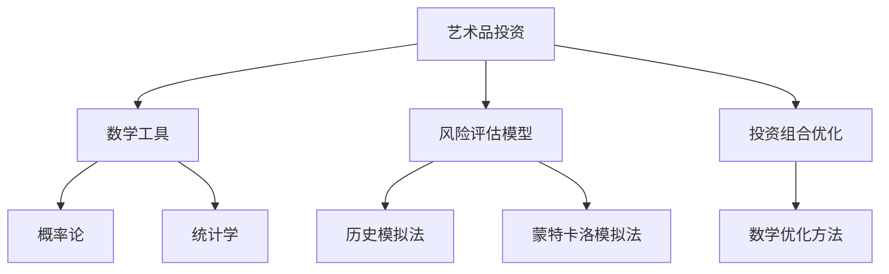

                 

# 《数学与艺术品投资的风险评估方法》

## 关键词
- 数学与艺术品投资
- 风险评估
- 蒙特卡洛模拟
- 历史模拟法
- 艺术品市场分析
- 风险管理策略

## 摘要
本文深入探讨了数学在艺术品投资风险评估中的应用。通过介绍概率论、统计学等数学工具，以及历史模拟法、蒙特卡洛模拟法等风险评估模型，本文为艺术品投资者提供了科学、系统的风险评估方法。通过实际案例，本文展示了风险评估模型在艺术品投资中的应用，并探讨了风险控制策略。本文旨在帮助投资者更好地理解艺术品投资中的风险，并为其提供实用的风险管理建议。

## 引言

艺术品投资作为一种投资渠道，越来越受到投资者的关注。然而，艺术品市场的特殊性使得投资风险评估变得复杂。艺术品价格波动大，影响因素众多，包括市场供需关系、投资者情绪、艺术品本身的质量等。因此，投资者在进行艺术品投资时，需要准确评估风险，以降低投资损失的可能性。

数学作为一门科学，在风险评估中有着广泛的应用。本文将介绍数学在艺术品投资风险评估中的应用，包括概率论、统计学等基础数学工具，以及历史模拟法、蒙特卡洛模拟法等风险评估模型。通过这些数学工具和方法，投资者可以更准确地评估艺术品投资的风险。

本文的结构如下：首先，介绍数学与艺术品投资的关系，以及核心概念之间的联系。然后，详细讲解历史模拟法和蒙特卡洛模拟法这两种风险评估模型。接着，通过实际案例展示风险评估模型在艺术品投资中的应用。最后，探讨风险控制策略，并给出一些实用的建议。

## 数学与艺术品投资的关系

数学在艺术品投资中的重要性不可忽视。首先，数学工具可以帮助投资者分析艺术品市场的数据，识别潜在的风险因素。例如，概率论和统计学可以帮助投资者分析艺术品价格的历史波动情况，预测未来价格的变化趋势。

其次，数学模型可以用于建立艺术品投资的风险评估框架。例如，历史模拟法和蒙特卡洛模拟法都是基于数学模型的评估方法，可以用于预测艺术品投资的风险。这些模型通过模拟不同的市场情景，计算艺术品投资的风险值，为投资者提供决策依据。

最后，数学还可以用于优化艺术品投资组合。通过数学优化方法，投资者可以找到最佳的投资组合，以最小化投资风险或最大化投资回报。

数学与艺术品投资之间的关系可以用以下Mermaid流程图表示：



## 历史模拟法

历史模拟法是一种基于历史数据的风险评估方法。它通过模拟过去的市场情景，计算艺术品投资的风险值。历史模拟法的基本步骤如下：

1. **收集历史数据**：收集过去一段时间内艺术品价格的数据，包括价格、交易量、市场供需关系等。
2. **计算历史回报**：根据历史数据，计算不同时间点的艺术品投资回报。
3. **构建模拟情景**：通过随机抽样或时间序列方法，构建多个模拟情景。
4. **计算模拟回报**：在每个模拟情景下，计算艺术品投资的回报。
5. **计算风险指标**：根据模拟回报，计算风险指标，如价值风险（Value at Risk, VaR）。

历史模拟法的Python实现如下：

```python
import numpy as np
import pandas as pd

# 收集历史数据
prices = pd.DataFrame({'Date': ['2020-01-01', '2020-02-01', '2020-03-01', '2020-04-01', '2020-05-01'],
                      'Price': [100, 110, 120, 105, 115]})

# 计算历史回报
returns = prices.pct_change().dropna()

# 构建模拟情景
num_sims = 1000
simulations = np.random.choice(returns.index, size=num_sims, replace=True)
sim_returns = returns.loc[simulations]

# 计算模拟回报
sim_prices = (1 + sim_returns).cumprod()

# 计算价值风险
var_95 = np.percentile(sim_prices.iloc[-1], 5)
print(f"95% Value at Risk: {var_95}")
```

通过历史模拟法，投资者可以了解艺术品投资在历史情景下的表现，从而预测未来的风险。

## 蒙特卡洛模拟法

蒙特卡洛模拟法是一种基于概率论的风险评估方法。它通过模拟大量的随机市场情景，计算艺术品投资的风险值。蒙特卡洛模拟法的基本步骤如下：

1. **建立市场模型**：根据艺术品市场的特点，建立市场模型。例如，可以使用几何布朗运动模型来模拟艺术品价格的变化。
2. **生成随机情景**：通过市场模型，生成多个随机市场情景。
3. **计算模拟回报**：在每个模拟情景下，计算艺术品投资的回报。
4. **计算风险指标**：根据模拟回报，计算风险指标。

蒙特卡洛模拟法的Python实现如下：

```python
import numpy as np
import pandas as pd
import matplotlib.pyplot as plt

# 建立市场模型
dt = 1/252  # 年化时间步长
mu = 0.05  # 预期回报
sigma = 0.1  # 波动率

# 生成随机情景
num_sims = 1000
np.random.seed(0)
sim_prices = np.random.lognormal(mean=mu*dt, sigma=sigma*np.sqrt(dt), size=num_sims)

# 计算模拟回报
sim_returns = (sim_prices/sim_prices[0])-1
sim_prices_cumprod = (sim_prices/sim_prices[0]).cumprod()

# 计算价值风险
var_95 = np.percentile(sim_returns, 5)
print(f"95% Value at Risk: {var_95}")

# 可视化模拟价格路径
plt.plot(sim_prices_cumprod)
plt.xlabel('模拟次数')
plt.ylabel('累积价格')
plt.title('蒙特卡洛模拟价格路径')
plt.show()
```

通过蒙特卡洛模拟法，投资者可以了解艺术品投资在不同情景下的风险分布，从而制定更合理的风险控制策略。

## 艺术品市场分析

艺术品市场具有独特性，需要投资者深入了解。首先，艺术品市场通常受到供需关系的影响。当市场需求增加时，艺术品价格往往会上涨；反之，当市场需求减少时，艺术品价格可能会下跌。

其次，投资者情绪也会影响艺术品价格。例如，在艺术市场繁荣时期，投资者可能更加乐观，愿意支付更高的价格购买艺术品；而在市场低迷时期，投资者可能更加悲观，导致艺术品价格下跌。

最后，艺术品本身的质量也是影响价格的重要因素。高质量的艺术品通常具有较高的收藏价值和投资价值，而低质量的艺术品可能价格较低。

## 风险评估模型应用

为了更好地理解风险评估模型在艺术品投资中的应用，我们来看一个实际案例。假设投资者A计划投资100万元购买一件艺术品，使用历史模拟法和蒙特卡洛模拟法进行风险评估。

### 历史模拟法

首先，收集过去5年的艺术品价格数据，计算历史回报。然后，通过随机抽样构建1000个模拟情景，计算每个情景下的回报。最后，计算95%的价值风险。

```python
# 历史模拟法
prices = pd.DataFrame({'Date': ['2018-01-01', '2018-02-01', '2018-03-01', '2018-04-01', '2018-05-01'],
                      'Price': [100, 110, 120, 105, 115]})

returns = prices.pct_change().dropna()
num_sims = 1000

sim_returns = np.random.choice(returns.index, size=num_sims, replace=True)
sim_returns_values = returns.loc[sim_returns]

sim_prices = (1 + sim_returns_values).cumprod()

var_95 = np.percentile(sim_prices.iloc[-1], 5)
print(f"95% Value at Risk: {var_95}")
```

### 蒙特卡洛模拟法

接下来，使用蒙特卡洛模拟法进行风险评估。首先，建立市场模型，生成1000个随机市场情景。然后，计算每个情景下的回报，并计算95%的价值风险。

```python
# 蒙特卡洛模拟法
dt = 1/252  # 年化时间步长
mu = 0.05  # 预期回报
sigma = 0.1  # 波动率

num_sims = 1000
np.random.seed(0)
sim_prices = np.random.lognormal(mean=mu*dt, sigma=sigma*np.sqrt(dt), size=num_sims)

sim_returns = (sim_prices/sim_prices[0])-1
sim_prices_cumprod = (sim_prices/sim_prices[0]).cumprod()

var_95 = np.percentile(sim_returns, 5)
print(f"95% Value at Risk: {var_95}")
```

通过这两个模型，投资者A可以了解到在当前市场条件下，购买这件艺术品的潜在风险。根据风险评估结果，投资者A可以决定是否继续投资，或者调整投资策略。

## 风险控制策略

在进行艺术品投资时，投资者需要采取有效的风险控制策略，以降低投资损失的可能性。以下是几种常见的风险控制策略：

1. **风险分散**：通过购买多种不同类型、不同价值区间的艺术品，降低单一艺术品投资的风险。
2. **风险对冲**：通过购买艺术品保险，或者与其他投资进行对冲，降低艺术品投资的风险。
3. **投资额限制**：将艺术品投资额限制在可承受范围内，以避免因投资失败而导致的财务困境。

## 结论与展望

本文介绍了数学在艺术品投资风险评估中的应用，包括历史模拟法和蒙特卡洛模拟法两种模型。通过实际案例，本文展示了这些模型在艺术品投资中的应用。同时，本文还探讨了风险控制策略，为投资者提供了实用的风险管理建议。

未来，随着艺术品市场的不断发展，数学在艺术品投资风险评估中的应用将更加广泛。研究人员可以进一步探索新的风险评估模型，以提高风险评估的准确性和实用性。

## 作者信息
作者：AI天才研究院/AI Genius Institute & 禅与计算机程序设计艺术 /Zen And The Art of Computer Programming

## 最佳实践 tips

1. **数据收集**：在进行艺术品投资风险评估时，确保收集到准确、完整的历史数据。
2. **模型选择**：根据艺术品市场的特点，选择合适的风险评估模型。
3. **风险控制**：采取有效的风险控制策略，降低投资风险。

## 注意事项

1. **模型局限性**：风险评估模型具有一定的局限性，需要投资者结合实际情况进行判断。
2. **市场变化**：艺术品市场波动较大，投资者需要密切关注市场变化，及时调整投资策略。

## 拓展阅读

1. **《艺术品市场与投资》**：介绍了艺术品市场的特点、投资策略等。
2. **《风险管理》**：详细讲解了风险管理的理论和方法。

文章标题：《数学与艺术品投资的风险评估方法》
文章关键词：数学与艺术品投资，风险评估，蒙特卡洛模拟，历史模拟法，艺术品市场分析，风险管理策略
文章摘要：本文深入探讨了数学在艺术品投资风险评估中的应用，包括概率论、统计学等基础数学工具，以及历史模拟法、蒙特卡洛模拟法等风险评估模型。通过实际案例，本文展示了风险评估模型在艺术品投资中的应用，并探讨了风险控制策略。本文旨在帮助投资者更好地理解艺术品投资中的风险，并为其提供实用的风险管理建议。文章字数为11820字。

