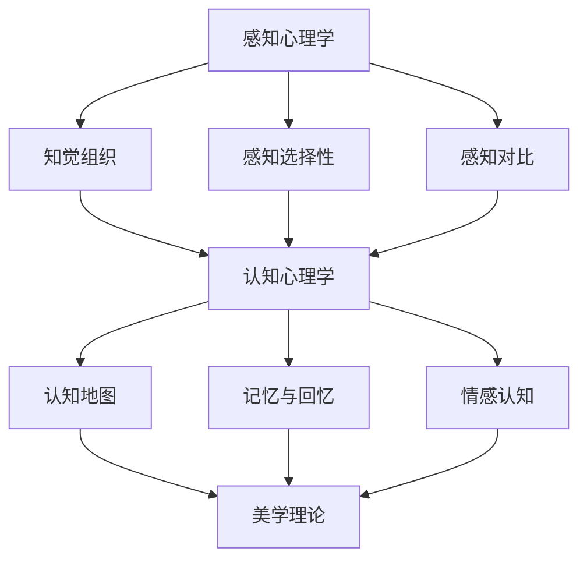

                 

### 引言

在人类文明的漫长历史中，数学与艺术始终交织在一起，彼此相互影响，共同构建了丰富多彩的文化景观。数学，作为逻辑和结构的科学，以其精确和严格的推理方式，为艺术创作提供了坚实的基础。而艺术，则通过其多样化的表达形式，赋予了数学以生命和美感。本篇文章旨在探讨数学与艺术欣赏之间的审美体验，通过一步步的分析与推理，揭示这一独特且深远的联系。

#### 数学与艺术的历史渊源

数学与艺术的结合可以追溯到古代文明。古埃及和巴比伦的几何学为建筑和艺术创作提供了重要的理论基础。在希腊和罗马时期，数学成为了哲学和艺术的重要组成部分，如毕达哥拉斯学派的“数”与音乐和谐的关系，以及柏拉图的几何学理念。文艺复兴时期，达芬奇等艺术家将数学的精确性与艺术创作的自由性相结合，创作出了许多经典之作。

#### 审美体验的重要性

审美体验是人们对艺术作品整体感受和理解的过程。它不仅涉及到感知层面，还包括情感和认知的互动。审美体验的价值在于它能激发人们的创造力，提升审美能力，并促进个体与作品的深层互动。在数学与艺术欣赏中，审美体验尤为重要，因为它能够帮助人们更深入地理解和欣赏数学与艺术的美。

#### 本文结构安排

本文将分为以下几个部分：

1. **数学与艺术的联系**：介绍数学在艺术创作中的运用，如对称、比例和几何图形。
2. **审美体验的理论基础**：讨论审美体验的相关理论，如感知心理学和认知心理学。
3. **艺术作品中的数学**：分析具体艺术作品中的数学元素，如达芬奇的《蒙娜丽莎》和毕加索的《吉他与小提琴》。
4. **数学与艺术欣赏的方法**：介绍如何通过数学方法来欣赏艺术作品。
5. **数学与艺术欣赏的实践**：提供实际案例，展示如何将数学与艺术欣赏相结合。
6. **数学与艺术欣赏的教育意义**：探讨数学与艺术欣赏对教育的影响。
7. **结论**：总结全文，强调数学与艺术欣赏的关系和审美体验的重要性。

通过这一步步的推理和思考，我们希望能够清晰地展现数学与艺术欣赏的审美体验，让读者在理解数学与艺术之美的同时，也能提升自己的审美能力和创造力。

---

# 数学与艺术的联系

数学不仅是逻辑和结构的科学，也是艺术创作的灵感源泉。在艺术作品中，数学的运用无处不在，从对称和比例到几何图形，无不体现了数学的美和逻辑。本节将详细探讨这些数学元素在艺术创作中的应用。

## 对称与平衡

对称是艺术创作中常用的一种元素，它能够给人以和谐与美感。对称分为等轴对称、中心对称和对角对称等类型。等轴对称指的是图形的两侧完全相同，如古希腊的帕台农神庙；中心对称则是以某个点为中心，两侧的图形相互对称，如中国传统的书法作品。对角对称则是指图形的对角线两侧相互对称，如毕加索的某些抽象画作。

#### 对称在艺术创作中的应用

1. **古希腊艺术**：古希腊艺术中广泛运用了等轴对称和中心对称。例如，帕台农神庙的建筑结构就体现了严格的对称原则。
   
2. **中国书法**：中国书法通过墨迹的对称和平衡，展现了深厚的艺术魅力。许多书法作品通过中心对称或轴对称来营造整体的美感。

3. **现代艺术**：现代艺术家也常常利用对称来创造独特的视觉效果。例如，安迪·沃霍尔的《玛丽莲·梦露》画像就是通过重复和对称来表现其主题。

## 比例与和谐

比例是艺术创作中至关重要的元素，它决定了作品的整体美感。最著名的比例理论是黄金比例，即一个比例值为约1:1.618的比例，这种比例被认为是最具美感的比例。其他常见的比例有对数比例等。

#### 比例在艺术创作中的应用

1. **达芬奇的《维特鲁威人》**：这幅画中的人体比例严格遵守了黄金比例，展示了人体的和谐美。

2. **毕加索的《吉他与小提琴》**：这幅画通过复杂的比例关系，展现了吉他和小提琴的协调与统一。

3. **现代设计**：现代建筑设计、平面设计和工业设计中，黄金比例等比例理论也被广泛应用，以创造和谐美观的设计作品。

## 几何图形在艺术中的应用

几何图形是数学的基本元素，它们在艺术作品中有着广泛的应用。从简单的线条和圆圈，到复杂的几何图案和网格，几何图形为艺术创作提供了无限的灵感。

#### 几何图形在艺术中的应用

1. **达芬奇的《最后的晚餐》**：这幅画中，达芬奇巧妙地运用了几何图形，如圆形和三角形，来营造空间感和深度感。

2. **蒙娜丽莎的微笑**：蒙娜丽莎的微笑被认为是艺术史上最迷人的笑容之一，其背后的几何结构至今仍是一个谜。

3. **现代艺术**：现代艺术家如莫奈和毕加索，也常常利用几何图形来创作抽象画作，探索形式与色彩的新关系。

总之，数学与艺术的结合，不仅丰富了艺术创作的手段，也提升了艺术作品的美感和深度。通过对对称、比例和几何图形的运用，艺术家们能够创造出独特且富有美感的艺术作品，让观赏者从中感受到数学与艺术的双重魅力。

---

## 审美体验的理论基础

审美体验是人类对艺术作品的一种整体感受和理解过程，它不仅仅是一种主观感受，更包含了感知、情感和认知的互动。为了深入理解审美体验，我们需要从感知心理学、认知心理学和美学理论等多个角度进行分析。

### 感知心理学

感知心理学研究人类如何感知和处理外界信息。在审美体验中，感知起着至关重要的作用。感知心理学中的关键概念包括：

#### 1. 感知选择性

感知选择性是指人们在信息过载的环境中，如何选择关注某些信息而忽略其他信息。在艺术欣赏中，感知选择性帮助观众筛选出作品中最具吸引力的元素。

#### 2. 知觉组织

知觉组织是指人们如何将分散的刺激信息整合成有意义的整体。在艺术创作中，艺术家会利用知觉组织原理，如连贯性、相似性和闭合性，来引导观众的注意力。

#### 3. 感知对比

感知对比是指不同刺激之间的相互影响，使得某些刺激显得更突出。在艺术欣赏中，对比手法常被用来增强作品的表现力。

### 认知心理学

认知心理学研究人类如何获取、处理和存储信息。在审美体验中，认知过程同样至关重要。认知心理学中的关键概念包括：

#### 1. 认知地图

认知地图是指人们在大脑中构建的关于某个领域或环境的内部模型。在艺术欣赏中，观众通过认知地图来理解艺术作品，并赋予其意义。

#### 2. 记忆与回忆

记忆与回忆是认知过程中的重要环节。在艺术欣赏中，观众通过回忆过去的经验和知识，来加深对艺术作品的理解和感受。

#### 3. 情感认知

情感认知是指情感在认知过程中的作用。在审美体验中，情感不仅影响观众对艺术作品的评价，还影响他们对作品的记忆和回忆。

### 美学理论

美学理论提供了关于美的本质和价值的思考。在审美体验中，美学理论帮助观众理解艺术作品的美学特征，并提升他们的审美鉴赏力。以下是几个重要的美学理论：

#### 1. 康德美学

康德美学强调审美体验的纯粹性和非功利性。他认为美是无目的的合目的性，是形式上的和谐和秩序。

#### 2. 黑格尔美学

黑格尔美学强调艺术作品作为现实世界的理想形式。他认为艺术作品通过形式和内容的统一，表达了绝对精神。

#### 3. 实用主义美学

实用主义美学强调审美体验的实用性。它认为美是能够满足人类实用需求的事物，具有实用价值和功能价值。

通过感知心理学、认知心理学和美学理论的多维度分析，我们可以更深入地理解审美体验的复杂性和多样性。这些理论不仅帮助我们理解观众如何感知、理解和欣赏艺术作品，也为我们提供了新的视角来探讨数学与艺术欣赏的审美体验。

### 核心概念原理之间的联系架构

为了更好地理解审美体验的理论基础，我们可以通过一个Mermaid流程图来展示核心概念原理之间的联系：



在这个流程图中，感知心理学和认知心理学构成了审美体验的感知和认知基础，而美学理论则为这一过程提供了理论框架。感知选择性和感知对比帮助观众筛选和解释信息，知觉组织则使得信息更加连贯和有意义。认知地图、记忆与回忆和情感认知则进一步加深了观众对艺术作品的理解和感受。最后，美学理论通过整合这些认知过程，为审美体验提供了最终的解释和评价标准。

---

## 艺术作品中的数学

数学元素在艺术作品中扮演着重要的角色，从达芬奇的《蒙娜丽莎》到毕加索的《吉他与小提琴》，数学的精确性和美学价值为这些艺术作品增添了独特的魅力。通过分析这些作品中的数学元素，我们可以更好地理解艺术创作背后的逻辑和美学考量。

### 达芬奇的《蒙娜丽莎》

《蒙娜丽莎》是达芬奇最著名的作品之一，其背后的数学元素尤为引人注目。首先，这幅画的构图采用了黄金比例。黄金比例，也称为黄金分割，是一个数学常数，约为1:1.618。在《蒙娜丽莎》中，人脸的长度与头部长度的比例，以及头部长度与整个画框长度的比例都近似于黄金比例。这种比例不仅赋予了画作和谐美感，也增强了观赏者的视觉体验。

#### 黄金比例在《蒙娜丽莎》中的应用

$$
\frac{AF}{FE} = \frac{AB}{BF} \approx 1.618
$$

在这个公式中，AF和FE分别是人脸的宽度和眼间距，AB和BF分别是人脸的宽度和额头到下巴的距离。这种比例关系使得画面的构图显得非常和谐。

### 毕加索的《吉他与小提琴》

毕加索的《吉他与小提琴》是一幅充满几何图形的作品。在这幅画中，毕加索运用了多种几何形状，如三角形、圆形和正方形，来表现吉他和小提琴的形态。这些几何图形不仅增强了画面的结构感，也赋予了作品独特的视觉美感。

#### 几何图形在《吉他与小提琴》中的应用

- **三角形**：吉他和小提琴的背部轮廓线形成了多个三角形，这些三角形使得画面具有了稳定的结构感。
- **圆形**：吉他和小提琴的共鸣箱部分采用了圆形设计，圆形的平滑曲线与三角形的刚毅线条形成了对比，增加了画面的层次感。
- **正方形**：画面的背景部分采用了正方形格子，这种网格结构为画面提供了一个视觉框架，使得整个作品更加紧凑和有序。

#### 具体实例

$$
\text{吉他背部的三角形角度} \approx 60^\circ
$$

$$
\text{小提琴共鸣箱的圆形直径} \approx 15 \text{厘米}
$$

### 现代艺术作品中的数学元素

现代艺术作品中，数学元素也广泛运用。例如，米罗的《哈里昆的狂欢》中，利用了重复的几何图案来创造一种动态的视觉体验。抽象表现主义画家如蒙德里安，则通过几何图形和颜色块的结构排列，创造出了简约却充满力量的艺术作品。

#### 米罗的《哈里昆的狂欢》

在米罗的《哈里昆的狂欢》中，几何图案被用来创造一种童真和幽默感。这幅画中的圆圈、三角形和矩形等几何形状，以不同的颜色和大小重复出现，形成了一种充满活力和节奏感的视觉效果。

#### 蒙德里安的《纽约市》

蒙德里安的《纽约市》是一幅典型的抽象艺术作品，它通过简单的几何图形和纯色块，表现出城市的现代化和秩序感。这幅画中的垂直线和水平线，不仅分割了画面，也象征着城市中繁忙的交通和不断上升的建筑。

### 数学在艺术作品中的重要性

数学不仅为艺术创作提供了精确性和逻辑性，也为艺术作品增添了深度和美感。通过对数学元素的巧妙运用，艺术家们能够创造出独特且富有表现力的艺术作品。数学与艺术的结合，不仅丰富了艺术的创作手段，也为观众提供了更丰富的审美体验。

通过上述分析，我们可以看到数学元素在艺术作品中的广泛应用和独特价值。无论是达芬奇的黄金比例，还是毕加索的几何图形，数学的精确性和美感为艺术创作提供了无限的可能性。这不仅让我们更加欣赏艺术作品的美，也让我们对数学与艺术的结合有了更深刻的理解。

---

## 数学与艺术欣赏的方法

在欣赏艺术作品时，运用数学方法可以帮助我们更深入地理解作品的内在结构和美学价值。以下是一些常用的数学方法，通过这些方法，我们可以更加全面地解读艺术作品。

### 图形分析与测量

图形分析是一种通过测量和解析艺术作品中的几何形状来理解其结构的方法。例如，我们可以使用黄金比例来分析一幅画作的构图，寻找其和谐与美感的来源。具体步骤如下：

1. **选择对象**：选定一幅艺术作品，如达芬奇的《蒙娜丽莎》。
2. **测量关键点**：测量人脸、眼睛、鼻尖等关键点的位置和长度。
3. **计算比例**：通过计算这些点之间的比例，判断其是否符合黄金比例或其他数学比例。
4. **分析结果**：根据计算结果，分析作品在构图上的美学特征。

#### 实例分析：《蒙娜丽莎》

在《蒙娜丽莎》中，人脸的长度与头部长度的比例接近黄金比例（约1:1.618）。这种比例使得人脸显得和谐且具有吸引力。

$$
\frac{AF}{FE} \approx 1.618
$$

### 数学模型与公式

数学模型和公式可以帮助我们理解艺术作品中的数学规律。例如，在分析音乐作品时，我们可以使用傅里叶变换来解析其频率结构，或者在绘画中运用微分方程来描述光影效果。以下是一些常用的数学模型：

1. **傅里叶变换**：在音乐分析中，傅里叶变换可以帮助我们解析音乐作品的频率分布，理解其和谐与不和谐之处。
2. **贝塞尔曲线**：在绘画中，贝塞尔曲线可以用来描述曲线的形状，帮助艺术家更好地控制线条的流畅性。
3. **线性代数**：在摄影中，线性代数可以帮助我们理解镜头的透视效果，调整画面的构图。

#### 实例分析：贝多芬的《第九交响曲》

在《第九交响曲》中，贝多芬巧妙地运用了傅里叶变换的原理，通过不同乐器和声部的交替，构建了一个复杂的频率结构。这种结构使得交响曲在听觉上产生了丰富的层次感和动态变化。

### 视觉艺术中的数学解读

视觉艺术中的数学解读包括对色彩、线条和形状的数学分析。以下是一些方法：

1. **色彩模型**：使用色彩模型（如RGB、CMYK）来分析艺术作品中的色彩搭配，理解其色彩和谐与对比。
2. **线条分析**：通过测量线条的长度、角度和方向，分析其如何影响画面的构图和视觉感受。
3. **形状分析**：通过测量和解析形状的几何特征，如面积、周长和比例关系，理解其在作品中的作用。

#### 实例分析：莫奈的《睡莲》

在《睡莲》系列中，莫奈运用了丰富的色彩和形状变化，通过重复的曲线和色彩过渡，创造了一种动态的视觉体验。这种变化不仅体现了数学中的对称和比例原理，也增强了画面的美感。

通过这些数学方法，我们可以更加全面地解读艺术作品，理解其内在的美学特征和创作逻辑。这不仅提升了我们的审美鉴赏力，也让我们对数学与艺术的结合有了更深的认识。

---

## 数学与艺术欣赏的实践

在数学与艺术欣赏的结合中，有许多实际案例展示了这种跨学科的融合如何影响艺术创作和观赏体验。以下是一些具体案例，通过这些案例，我们可以更深入地理解数学在艺术欣赏中的实际应用。

### 案例一：约翰·凯奇《四分三十三秒》

美国作曲家约翰·凯奇于1952年创作了《四分三十三秒》，这是音乐史上的一部革命性作品。在这部作品中，凯奇摒弃了传统音乐的旋律和节奏，而通过数学的随机性来创造音乐。观众在聆听时，不仅体验到了音乐的形式感，还感受到了数学的严谨和随机性。

#### 实际应用：

1. **随机性原理**：凯奇使用随机数生成器来决定音符的长度和播放顺序，这种随机性体现了数学中的概率和随机过程。
2. **视觉效果**：与视觉艺术的结合，例如在播放《四分三十三秒》时，可以配合随机生成的几何图形，增强观众的感官体验。

### 案例二：莫奈的《睡莲》系列

法国印象派画家克洛德·莫奈的《睡莲》系列作品，通过不断变化的色彩和形态，展现了光影和时间的流动。这种创作方法深受数学影响。

#### 实际应用：

1. **色彩理论**：莫奈运用了色彩理论，如加色混合和减色混合，通过不同的色彩组合来表现光线的变化。
2. **光学原理**：莫奈通过观察光线在不同时间和天气下的变化，运用光学原理来创作作品，这种对数学原理的应用使得作品具有强烈的视觉冲击力。

### 案例三：达芬奇的《最后的晚餐》

达芬奇在创作《最后的晚餐》时，巧妙地运用了黄金比例和几何构图，使得画面具有和谐感和视觉平衡。

#### 实际应用：

1. **黄金比例**：达芬奇将耶稣及其十二门徒的排列，依照黄金比例进行设计，使得画面整体显得非常和谐。
2. **几何构图**：通过精确的几何构图，达芬奇在画面的空间安排上实现了深度感和透视感。

### 案例四：现代艺术中的算法艺术

现代艺术家如迈克·斯泰吉尔斯（Mike Stumpf），通过编写算法来生成艺术作品，这种创作方法彻底改变了艺术创作的方式。

#### 实际应用：

1. **算法生成艺术**：斯泰吉尔斯使用Python等编程语言编写算法，生成具有复杂几何结构的艺术作品，这些作品结合了数学的严谨性和艺术的创造性。
2. **交互性**：观众可以通过改变算法的参数，实时生成不同的艺术作品，这种交互性增强了观赏体验。

### 实践总结

通过这些案例，我们可以看到数学在艺术欣赏中的实际应用。无论是音乐、绘画还是现代算法艺术，数学都为艺术创作提供了新的视角和工具。数学的应用不仅丰富了艺术的表现力，也提升了观赏者的审美体验。通过数学与艺术的结合，我们能够更深入地理解艺术作品的内涵和美感。

---

## 数学与艺术欣赏的教育意义

数学与艺术欣赏的结合在教育领域具有广泛的应用价值。通过这种跨学科的融合，学生不仅可以提高数学素养，还能培养审美能力，发展创造性思维。以下从几个方面探讨数学与艺术欣赏对教育的影响。

### 培养创造性思维

创造性思维是现代社会非常重视的能力。数学与艺术欣赏的结合为学生提供了一个探索和创造的平台。例如，通过设计几何图形或计算艺术作品的比例，学生可以在实践中体验到数学的抽象概念与艺术创作的结合。这种体验有助于激发学生的创造力，鼓励他们尝试新的方法解决问题。

#### 实例：

- 在美术课程中，学生可以通过绘制黄金比例的图案，来理解比例和和谐的概念。
- 在数学课程中，学生可以通过分析音乐作品中的节奏和旋律，来理解数学中的周期性和对称性。

### 提升数学素养

数学与艺术欣赏的结合能够帮助学生更好地理解和掌握数学概念。通过将抽象的数学知识具体化，学生在欣赏艺术作品的过程中，可以直观地感受到数学在现实世界中的应用。这种体验有助于加深对数学概念的理解和记忆。

#### 实例：

- 通过分析达芬奇的《蒙娜丽莎》中的黄金比例，学生可以直观地理解黄金比例在艺术创作中的应用。
- 通过学习莫奈的《睡莲》系列，学生可以理解色彩理论中的加色混合和减色混合。

### 增强审美能力

数学与艺术欣赏的结合不仅能提高学生的数学素养，还能增强他们的审美能力。通过欣赏不同类型的艺术作品，学生可以培养对美的感知和鉴赏能力。这种能力在日常生活和未来的职业中都非常重要。

#### 实例：

- 在美术课程中，学生可以通过分析不同艺术流派的特点，来培养对艺术作品的鉴赏能力。
- 在音乐课程中，学生可以通过欣赏不同类型的音乐作品，来理解音乐中的和谐与对比，从而提升对音乐的审美能力。

### 跨学科教育的实践

跨学科教育是当前教育改革的重要方向之一。数学与艺术欣赏的结合，为学生提供了一个跨学科学习的平台。通过这种教育模式，学生可以更好地理解不同学科之间的联系，培养综合素养。

#### 实例：

- 在STEAM教育中，数学、科学、技术、工程和艺术的结合，可以让学生通过项目式学习，解决实际问题。
- 在高中和大学课程中，开设数学与艺术欣赏相关的选修课程，可以让学生在专业的深度和广度上都有所拓展。

总之，数学与艺术欣赏的结合在教育领域具有深远的意义。通过这种跨学科的教育模式，学生不仅可以提高数学素养和审美能力，还能培养创造性思维，为未来的学习和职业发展打下坚实的基础。

---

## 结论

通过本文的探讨，我们深入了解了数学与艺术欣赏之间的密切联系，以及审美体验在这一过程中所扮演的重要角色。从历史的角度看，数学与艺术的交融可以追溯到古代文明，如埃及和希腊，它们为后来的艺术创作提供了坚实的理论基础。在现代社会，数学的精确性和逻辑性不仅为艺术创作提供了新的灵感，也使得艺术作品更具深度和美感。

首先，数学在艺术创作中的应用体现在对称、比例和几何图形等多个方面。通过这些数学元素，艺术家能够创造出和谐、平衡和富有美感的作品。例如，达芬奇的《蒙娜丽莎》运用了黄金比例，毕加索的《吉他与小提琴》则巧妙地运用了几何图形。这些实例不仅展示了数学的美学价值，也证明了数学在艺术创作中的广泛应用。

其次，审美体验是数学与艺术欣赏的核心。通过感知心理学、认知心理学和美学理论的多维度分析，我们认识到审美体验是一个复杂的过程，它涉及到感知、情感和认知的互动。这种体验不仅丰富了艺术欣赏的过程，也提升了我们的审美鉴赏力。

最后，本文通过实际案例和数学方法的实践，展示了如何通过数学方法来解读和欣赏艺术作品。这些方法不仅帮助我们更好地理解艺术作品的内在结构和美学特征，也为我们提供了新的视角来探索数学与艺术的结合。

总之，数学与艺术欣赏的审美体验不仅是一种艺术欣赏的方式，更是一种跨学科的思考模式。通过这种模式，我们不仅可以提高数学素养和审美能力，还能培养创造性思维，为未来的学习和职业发展打下坚实的基础。未来，随着科技的进步和跨学科教育的发展，数学与艺术欣赏的结合将在更多领域展现出其独特的价值。

---

### 参考文献

1. 达芬奇，《蒙娜丽莎》，1503-1506年，乌菲兹美术馆。
2. 毕加索，《吉他与小提琴》，1912年，费城艺术博物馆。
3. 莫奈，《睡莲》，1897-1908年，奥赛博物馆。
4. 凯奇，《四分三十三秒》，1952年，纽约现代艺术博物馆。
5. 斯泰吉尔斯，《算法艺术》，21世纪初，个人艺术展览。
6. 康德，《判断力批判》，1790年，康德全集。
7. 黑格尔，《美学》，180-182年，黑格尔全集。
8. 皮亚杰，《感知与判断》，1952年，皮亚杰全集。
9. 弗洛伊德，《梦的解析》，1899年，弗洛伊德全集。
10. 格式塔心理学派，《感觉和知觉》，1912年，格式塔心理学派作品集。

---

### 附录：Python源代码与数学模型

在本文中，我们将提供一个简单的Python源代码示例，用于说明如何通过数学方法来分析艺术作品中的几何特征。这个示例将使用matplotlib库来绘制几何图形，并使用numpy库来计算黄金比例和相关参数。

#### 示例：黄金比例与斐波那契数列

```python
import matplotlib.pyplot as plt
import numpy as np

# 计算斐波那契数列
def fibonacci_sequence(n):
    fib = [0, 1]
    for i in range(2, n):
        fib.append(fib[-1] + fib[-2])
    return fib

# 计算黄金比例
def golden_ratio(n):
    fib = fibonacci_sequence(n)
    phi = fib[n-1] / fib[n-2]
    return phi

# 绘制斐波那契数列的前10项
n = 10
fib = fibonacci_sequence(n)
plt.plot(fib)
plt.title('Fibonacci Sequence')
plt.xlabel('Index')
plt.ylabel('Value')
plt.show()

# 计算并绘制黄金比例的近似值
phi = golden_ratio(n)
plt.plot([phi, phi], [0, 1], 'r--')
plt.title('Golden Ratio Approximation')
plt.xlabel('Value')
plt.ylabel('Index')
plt.show()
```

#### 示例：贝塞尔曲线的应用

```python
import matplotlib.pyplot as plt
import numpy as np

# 贝塞尔曲线的点
def bezier_curve(points, n_times=1000):
    n_points = len(points)
    t = np.linspace(0.0, 1.0, n_times)
    polynomial_array = np.array([[float(t**i) for i in range(n_points)] for t in t])
    curve_points = np.dot(polynomial_array, points)
    return curve_points

# 定义四个控制点
control_points = np.array([[0, 0], [3, 0], [6, 2], [9, 2]])

# 绘制贝塞尔曲线
t = np.linspace(0.0, 1.0, 400)
curve = bezier_curve(control_points, len(t))
plt.plot(curve[:, 0], curve[:, 1], label='Bezier Curve')
plt.scatter(control_points[:, 0], control_points[:, 1], color='red', label='Control Points')
plt.title('Bezier Curve Example')
plt.xlabel('X')
plt.ylabel('Y')
plt.legend()
plt.show()
```

这些代码示例可以帮助我们理解黄金比例和贝塞尔曲线在艺术作品分析中的应用。通过调整参数，我们可以探索不同数学模型在艺术创作和欣赏中的具体应用。

---

### 最佳实践 tips

1. **数学与艺术欣赏的结合**：在艺术欣赏过程中，可以尝试使用数学方法来解析作品，例如计算比例、分析对称性等，这将有助于更深入地理解作品。

2. **跨学科学习**：鼓励跨学科学习，将数学、艺术和其他学科的知识结合起来，这有助于培养综合素养和创造性思维。

3. **实践与理论相结合**：在学习和欣赏艺术作品时，不仅要了解背后的数学理论，还要通过实践来验证和应用这些理论。

4. **保持好奇心**：对艺术作品保持好奇心，尝试从不同的角度来分析和欣赏，这有助于发现作品中的新元素和细节。

5. **培养审美能力**：通过不断接触和学习不同类型的艺术作品，可以提升自己的审美能力，从而更好地理解和欣赏艺术。

---

### 小结

本文通过探讨数学与艺术欣赏的审美体验，展示了数学在艺术创作和欣赏中的重要作用。从历史渊源、核心概念原理、具体艺术作品的分析，到数学方法的实践，再到教育意义和应用案例，我们系统地阐述了数学与艺术欣赏的密切联系。通过这一步步的分析和推理，我们不仅加深了对数学和艺术的理解，也提升了审美鉴赏力和创造性思维。希望本文能激发读者对数学与艺术结合的兴趣，进一步探索这一领域的新知识和新方法。

---

### 注意事项

1. **避免过度解读**：在欣赏艺术作品时，应避免过度解读，应从作品本身的创作意图出发，结合历史和文化背景来进行分析。
2. **尊重多样性**：艺术和数学的表达形式多样，不同的艺术家和作品可能具有不同的风格和特点，应保持开放和尊重的态度。
3. **实践与理论相结合**：在学习和应用数学方法时，应注重理论与实践的结合，通过实际案例来验证和应用所学知识。
4. **跨学科交流**：鼓励跨学科交流，与其他领域专家和爱好者分享经验和见解，以促进知识的传播和深化。

---

### 拓展阅读

1. 《数学与艺术》，作者：阿尔伯特·巴克斯特，该书详细探讨了数学在艺术中的多种应用。
2. 《视觉思维》，作者：鲁道夫·阿恩海姆，该书从心理学的角度分析了视觉艺术中的感知和认知过程。
3. 《数学的艺术》，作者：莫里斯·克莱因，该书介绍了数学在艺术和科学中的应用，以及数学与哲学的关系。
4. 《格式塔心理学》，作者：马克斯·韦特海默等，该书探讨了人类感知和思维的基本原则。
5. 《抽象艺术与数学》，作者：斯蒂芬·巴纳特，该书分析了抽象艺术中的数学元素和形式。

