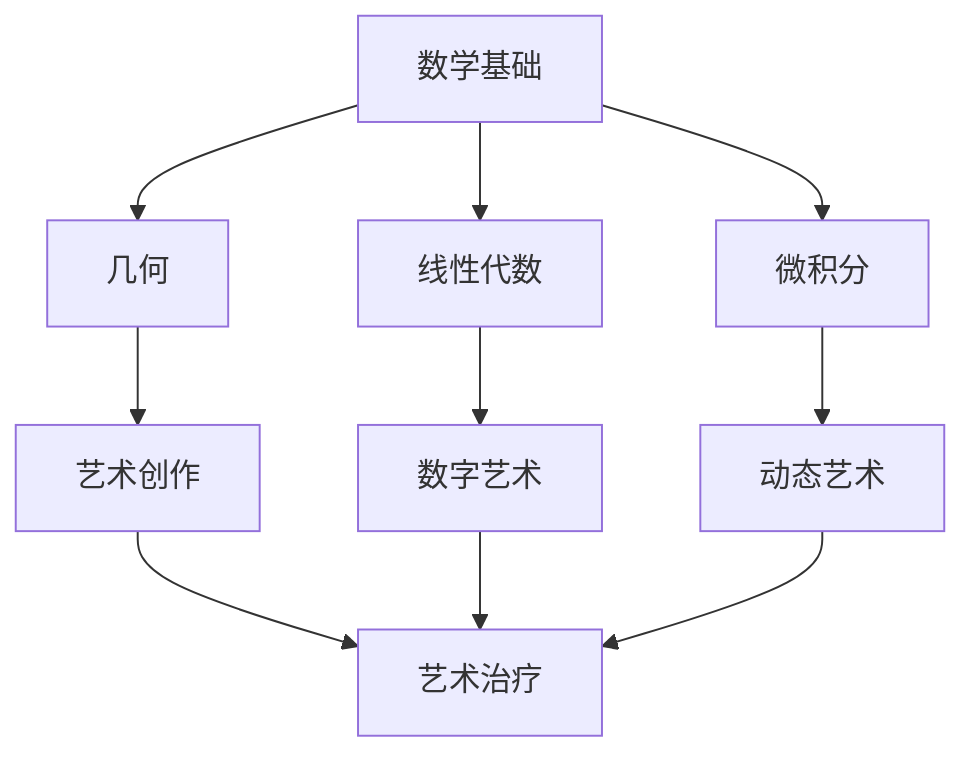

                 

### 《数学与艺术治疗的数学原理》引言：数学与艺术治疗概览

#### 数学与艺术治疗：一个跨学科的奇思妙想

“数学与艺术治疗”这一主题乍看之下似乎存在巨大的鸿沟，但事实上，两者之间的联系源远流长，且在现代医学和心理学中显示出巨大的潜力和实践价值。数学，作为精确科学和量化世界的工具，不仅推动了科学技术的发展，也在艺术的创作与表达中找到了其独特的应用场景。艺术治疗，则是一种通过艺术创作和互动过程来改善个体心理状态的方法，其本质是借助艺术媒介来达到心理治疗的效果。

数学与艺术治疗之间的交融，并非突发奇想，而是有着深厚的理论基础和实践背景。数学在艺术中的运用，可以追溯到古希腊时期，当时的数学家们研究几何比例和对称性，为艺术创作提供了理论基础。而艺术治疗则起源于20世纪初，通过艺术活动帮助患者表达情感、缓解压力、治疗心理创伤。随着心理学和艺术治疗理论的发展，数学在其中的应用逐渐显现，成为一种有效的辅助手段。

本书《数学与艺术治疗的数学原理》旨在探讨数学与艺术治疗之间的交集，通过系统的分析和实例展示，揭示数学在艺术治疗中的潜在价值。本文将分为八个主要部分，逐一探讨数学基础、艺术治疗的数学原理、数学模型在艺术治疗中的应用、具体的实践案例以及未来的发展趋势。

首先，在第一部分“引言：数学与艺术治疗概览”中，我们将简要回顾数学与艺术的历史联系，介绍艺术治疗的基本概念及其发展历程，探讨数学在艺术治疗中的潜在作用。这一部分将为后续内容提供必要的背景知识。

接下来，第二部分“数学基础：核心概念与联系”将深入探讨数学的核心概念，包括几何、线性代数和微积分等，并分析这些概念与艺术治疗的联系。这部分内容将帮助读者建立起数学与艺术治疗之间关系的全局视角。

在第三部分“艺术治疗的数学原理”中，我们将详细阐述数学在艺术治疗中的具体应用原理，探讨数学模型如何帮助艺术治疗师更好地理解和应用艺术治疗过程。

随后，第四部分“数学模型在艺术治疗中的应用”将展示数学模型在实际艺术治疗中的具体运用，结合实际案例，讲解如何通过数学方法来提升艺术治疗的效率和质量。

第五部分“艺术治疗中的数学实践”将介绍数学在艺术治疗中的具体实践，通过音乐治疗、艺术创作和舞蹈治疗等案例，展示数学在其中的应用。

第六部分“案例研究：数学与艺术治疗结合的实际应用”将深入分析具体案例，探讨数学在艺术治疗中的实际效果和挑战。

第七部分“数学工具与艺术治疗技术的发展”将探讨数学工具在艺术治疗技术发展中的作用，展望未来技术的发展趋势。

最后，在第八部分“总结与展望：未来趋势与挑战”中，我们将总结本书的核心观点，探讨数学与艺术治疗结合的未来发展方向，并提出潜在的挑战。

通过本书的探讨，我们希望读者能够认识到数学在艺术治疗中的重要作用，并激发更多跨学科的研究与实践，推动数学与艺术治疗的融合发展。

#### 1.1 数学的艺术：从古至今的探索

数学作为一门科学，其发展历程见证了人类对自然规律的探索与理解。同样，艺术作为人类情感和思想的表达形式，也通过数学的视角找到了其独特的表达方式。从古至今，数学与艺术之间的相互影响和交融，构成了人类文明的重要组成部分。

在古希腊时期，数学与艺术的关系尤为紧密。古希腊的数学家们如毕达哥拉斯、欧几里得等，不仅研究几何、代数等数学领域，还关注数学在艺术创作中的应用。毕达哥拉斯认为，音乐中的音程比例与自然界的和谐存在密切联系，他提出了著名的“音乐四度定律”，即音程的比例为2:1，这一理论为后来的音乐创作奠定了数学基础。欧几里得在《几何原本》中，通过严谨的几何学原理，阐述了直线、平面等基本概念，这些几何学原理在建筑、雕塑等艺术形式中也得到了广泛应用。

中世纪时期，数学与艺术的关系继续发展。阿拉伯数学家们在几何学和代数领域取得了重要进展，这些进展不仅促进了科学的发展，也为艺术创作提供了新的工具和理论。例如，阿拉伯建筑师们在设计中广泛应用了几何形状和对称性，创造了美丽的清真寺和城堡，这些建筑作品至今仍然被视为艺术与数学的杰作。

文艺复兴时期，数学与艺术的交融达到了新的高度。达·芬奇、米开朗基罗等文艺复兴大师们，不仅是一位杰出的艺术家，同时也是数学家。达·芬奇在绘画中运用了透视学原理，通过精确的几何计算，使画面具有立体感和空间感。米开朗基罗在雕塑《大卫》中，通过对人体解剖学的研究，创作出了形态准确、动态生动的雕塑作品。

进入现代，数学与艺术的交融进一步加深。在20世纪初，艺术家们开始探索抽象艺术，他们将数学原理应用于绘画、雕塑等艺术形式中，创造出独特的视觉效果。蒙德里安、康定斯基等抽象艺术家，通过几何形状、色彩和线条的组合，表达出内心的情感和思想。蒙德里安的《红、蓝、黄构图》中，通过严格的几何分割和色彩的运用，展现了一种简约而富有韵律的美感。康定斯基的《蓝骑士》则通过抽象的线条和色彩，表达出艺术家内心的情感和思想。

在现代艺术中，计算机技术和数字艺术的兴起，为数学在艺术创作中的应用提供了新的契机。艺术家们利用计算机编程和算法，创作出具有高度复杂性和美感的数字艺术作品。这些作品不仅展示了数学的美丽，也为观众提供了全新的审美体验。计算机图形学中的算法，如分形、随机过程等，被广泛应用于数字艺术创作中，创造出丰富的视觉效果。

总之，数学与艺术之间的交融，从古至今，不仅促进了科学和艺术的发展，也为人类提供了丰富的精神财富。通过数学的视角，艺术家们能够创造出独特的艺术作品，表达出内心的情感和思想。同时，数学也为艺术创作提供了新的工具和理论支持，使得艺术作品在形式和内容上更加丰富和多样。这种跨学科的融合，不仅丰富了人类的文化遗产，也为未来的艺术创作提供了无限的可能性。

#### 1.2 艺术治疗的概念与发展

艺术治疗，作为一种心理治疗方法，通过艺术创作和表达过程来促进个体心理康复和情感调节。其概念源于20世纪初，起源于欧洲和美国。最早的艺术治疗实践可以追溯到1917年，由瑞士精神科医生弗里德里希·克拉夫特-埃宾根（Friedrich Krafft-Ebing）提出，他利用绘画来帮助精神病患者表达内心的情感和冲突。随后，美国心理学家罗杰斯（Carl Rogers）和艺术治疗先驱玛丽·海恩斯（Mary Henigs）等人进一步发展了这一治疗方法，提出了以患者为中心的艺术治疗理论。

艺术治疗的基本理论包括几个关键方面。首先，艺术治疗强调艺术创作过程本身，认为患者在创作过程中能够自由地表达内心情感，缓解心理压力。这与心理治疗中的表达疗法有相似之处，但艺术治疗更强调艺术媒介的特性和创造性。其次，艺术治疗强调艺术作品与创作者之间的互动，通过观察和分析艺术作品，治疗师能够更好地理解患者的内心世界，制定个性化的治疗方案。最后，艺术治疗注重个体的自我探索和自我实现，通过艺术创作，患者能够发现自我，增强自我意识和自我价值感。

艺术治疗的历史可以追溯到几个重要的阶段。20世纪初，艺术治疗作为一种辅助性治疗手段，逐渐在精神病院和康复机构中得到应用。随着心理学和艺术理论的发展，艺术治疗逐渐独立出来，成为一种专业的心理治疗形式。20世纪中叶，以患者为中心的治疗理论兴起，艺术治疗开始注重个体的主体性和自我表达。这一时期，艺术治疗的理论和实践不断丰富，涵盖了绘画、雕塑、音乐、舞蹈等多种艺术形式。进入21世纪，随着数字技术和新媒体的发展，艺术治疗的形式和内容也发生了变革，数字艺术、虚拟现实等技术开始被引入艺术治疗中，为患者提供了更多样化的治疗选择。

艺术治疗的作用和意义体现在多个方面。首先，艺术治疗能够帮助患者表达和释放内心的情感，缓解心理压力。通过艺术创作，患者可以将抽象的情感转化为具体的图像或形式，从而更好地理解和面对自己的情绪。其次，艺术治疗能够促进个体的自我探索和自我实现。患者在创作过程中，能够深入反思自己的内心世界，发现自我潜能，增强自我价值感。最后，艺术治疗作为一种非语言的治疗方法，特别适用于那些语言表达困难的患者，如自闭症儿童、创伤后应激障碍患者等。通过艺术媒介，这些患者能够找到自己的表达方式，从而改善他们的社交和情感功能。

总之，艺术治疗作为一种跨学科的心理治疗方法，通过艺术创作和表达过程，帮助患者缓解心理压力、促进心理康复和情感调节。其历史发展和理论体系为现代心理治疗提供了丰富的资源和新的视角，使得艺术治疗在临床实践中显示出巨大的潜力和价值。

#### 1.3 数学在艺术治疗中的潜价值

数学，作为一门精确而严谨的科学，虽然在传统意义上与艺术治疗似乎相去甚远，但实际上，它在艺术治疗中的应用潜藏着巨大的价值。首先，数学作为一种工具，能够帮助艺术治疗师更准确地量化患者的心理状态和艺术创作过程，从而提供更科学的指导和支持。

**1.3.1 数学如何促进艺术表达**

在艺术创作中，数学元素可以以多种形式出现，例如几何形状、比例、对称性、周期性等。这些数学元素不仅为艺术作品增添了视觉和审美上的复杂性，还能激发创作者的灵感，促进艺术表达的深度和广度。例如，在绘画中，通过几何形状和比例关系的精确运用，艺术家能够创造出更具视觉冲击力的作品。蒙德里安的《红、蓝、黄构图》就是一个典型的例子，这幅作品通过严格的几何分割和色彩的对比，达到了简约而富有韵律的美感。

**1.3.2 数学对艺术治疗实践的潜在影响**

数学在艺术治疗中的潜在影响主要体现在以下几个方面：

- **量化分析：** 数学方法可以帮助治疗师对患者的艺术作品进行量化分析，从而更准确地评估患者的心理状态。例如，通过分析作品中的色彩使用、线条长度和角度等，可以揭示患者内心的情感变化和心理冲突。这种方法不仅提供了直观的评估手段，还能为治疗方案的调整提供科学依据。

- **结构化指导：** 数学原理可以指导艺术治疗师设计更具系统性和科学性的艺术治疗课程。例如，通过运用黄金分割比例，治疗师可以指导患者创作出更具美感和和谐性的艺术作品，从而在创作过程中达到心理调节的效果。

- **数据分析：** 在数字艺术治疗中，数学工具如统计分析、机器学习算法等，可以帮助治疗师从大量数据中提取有价值的信息，从而更好地理解患者的心理状态和艺术创作过程。例如，通过对患者创作的数字艺术作品进行情感分析，可以识别出患者情绪变化的趋势和规律。

**1.3.3 实际案例中的应用**

实际案例展示了数学在艺术治疗中的具体应用效果。例如，在儿童心理治疗中，通过运用数学模型，治疗师可以设计出具有互动性和教育性的艺术游戏，帮助儿童表达和调节情绪。此外，在创伤后应激障碍（PTSD）的治疗中，通过分析患者创作的艺术作品中的情感元素，治疗师可以更好地理解患者的创伤经历和内心感受，从而制定更有效的治疗方案。

总之，数学在艺术治疗中的应用不仅丰富了艺术创作的手段和形式，也为心理治疗提供了新的工具和方法。通过数学的视角，艺术治疗师能够更科学、更精准地理解和指导患者的艺术创作过程，从而提高治疗效果。这种跨学科的融合，不仅为艺术治疗带来了新的可能性，也为心理学和艺术领域的发展注入了新的活力。

### 1.3.4 数学与艺术治疗结合的研究现状和未来展望

当前，数学与艺术治疗的结合研究已取得了一定的进展，但仍处于探索和发展的初级阶段。现有研究主要集中于以下几个方面：

- **数学模型的应用：** 通过建立数学模型，研究者试图量化分析艺术治疗过程中的心理变化。例如，通过色彩分析、形态分析等方法，可以评估患者的情绪状态和心理恢复程度。这种方法为艺术治疗提供了定量评估的手段，有助于更科学地制定治疗方案。

- **计算机辅助艺术治疗：** 利用计算机技术和数学算法，研究者开发了多种辅助艺术治疗的工具和平台。例如，通过虚拟现实技术，患者可以在一个虚拟的艺术创作环境中进行艺术活动，这不仅提高了治疗的趣味性，也增强了治疗的互动性和参与度。

- **心理干预效果分析：** 通过对大量病例的统计分析，研究者探讨了数学方法在艺术治疗中的实际效果。这些研究结果显示，数学方法的应用有助于提高艺术治疗的精准性和有效性，尤其是在复杂心理问题的治疗中表现出显著的优势。

尽管取得了一些进展，但数学与艺术治疗的结合仍面临诸多挑战和问题：

- **理论基础不足：** 目前关于数学在艺术治疗中的理论基础尚不完善，需要进一步深入研究数学与心理、艺术之间的互动机制，以构建更加坚实的理论框架。

- **实践应用局限：** 数学在艺术治疗中的应用仍主要集中于某些特定的领域和情境，如数字艺术治疗和儿童心理治疗。在实际应用中，如何将数学方法全面、系统地引入艺术治疗，仍然是一个亟待解决的问题。

- **技术障碍：** 在数字艺术治疗领域，尽管计算机技术和数学算法的发展为治疗提供了新的工具，但技术的复杂性和成本仍然是一个重要的限制因素，需要进一步降低技术门槛，使更多的患者能够受益。

未来，随着数学和艺术治疗领域的进一步发展，数学与艺术治疗的结合有望取得更多的突破：

- **跨学科研究：** 需要更多跨学科的研究，将心理学、艺术学、计算机科学等领域的理论和技术结合起来，共同探索数学在艺术治疗中的应用前景。

- **技术创新：** 利用最新的计算机技术和数据分析方法，开发更多高效、实用的数学工具和平台，提高艺术治疗的科技含量和用户体验。

- **实践推广：** 通过实际案例的推广和验证，扩大数学在艺术治疗中的应用范围，提高其在临床实践中的普及程度。

总之，数学与艺术治疗的结合研究不仅具有巨大的理论价值，也具备广阔的应用前景。通过不断探索和创新，我们有理由相信，数学将为艺术治疗带来新的可能性和无限的空间。

### 2.1 数学基本概念解析

要深入探讨数学在艺术治疗中的应用，首先需要对数学的基本概念进行详细解析。数学不仅是一门工具性学科，它还蕴含着丰富的哲学思想与美学理念。在本节中，我们将重点介绍几何、线性代数和微积分这三个核心数学概念，并探讨它们与艺术治疗之间的联系。

#### 2.1.1 基本几何概念

几何是数学的一个基本分支，它研究形状、大小、位置和变换等概念。在艺术创作中，几何形状和比例是至关重要的元素。例如，黄金分割比例（Golden Ratio，约0.618）在艺术和设计中广泛应用，被认为是最美的比例之一。这一比例不仅在绘画和雕塑中常见，也在建筑设计中被广泛采用。

在艺术治疗中，几何概念可以帮助患者理解形状和结构，从而在创作过程中实现心理上的平衡和和谐。例如，通过绘画几何图形，患者可以专注于线条、形状和空间关系，这有助于缓解焦虑和压力。

**实例：黄金分割比例在艺术创作中的应用**

黄金分割比例可以通过以下公式计算：

$$
\frac{a+b}{a} = \frac{a}{b} = \varphi
$$

其中，$a$ 和 $b$ 是相邻线段的长度，$\varphi$ 是黄金比例，约等于1.618。

在绘画中，一个经典的例子是达·芬奇的《蒙娜丽莎》。这幅画作的高度和宽度就近似遵循了黄金分割比例，从而给人一种和谐美妙的视觉效果。

#### 2.1.2 线性代数基础

线性代数是研究向量空间、线性变换和线性方程组的数学分支。在艺术治疗中，线性代数提供了处理多维数据和分析复杂结构的有力工具。

一个常见的线性代数概念是矩阵。矩阵是一个由数字组成的矩形阵列，可以用来表示和分析线性关系。例如，在绘画中，可以通过矩阵变换来实现图像的旋转、缩放和平移等效果。这在数字艺术和虚拟现实中尤为重要，因为它可以创建出丰富的视觉效果和互动体验。

**实例：矩阵在数字绘画中的应用**

以下是一个简单的二维矩阵表示一个二维点的旋转：

$$
\begin{bmatrix}
\cos \theta & -\sin \theta \\
\sin \theta & \cos \theta
\end{bmatrix}
\begin{bmatrix}
x \\
y
\end{bmatrix}
=
\begin{bmatrix}
x' \\
y'
\end{bmatrix}
$$

其中，$(x, y)$ 是原始点，$(x', y')$ 是旋转后的点，$\theta$ 是旋转角度。

通过这个矩阵，艺术家可以在数字绘画软件中实现图像的旋转效果，为创作提供更多可能性。

#### 2.1.3 微积分原理

微积分是研究变化和累积的数学分支，它在艺术治疗中的应用主要体现在对动态过程的建模和模拟。例如，通过微积分中的导数和积分，艺术家可以创造出具有动态变化的视觉效果。

**实例：微积分在动画制作中的应用**

在动画制作中，通过计算物体在不同时间点的位置变化，可以创建出流畅的动画效果。以下是一个简单的例子：

$$
s(t) = \int_0^t v(t') \, dt'
$$

其中，$s(t)$ 是物体在时间 $t$ 的位置，$v(t')$ 是物体在时间 $t'$ 的速度。

通过不断更新物体在每一帧的位置，可以创建出连续运动的动画效果。

#### 数学与艺术治疗之间的联系

几何、线性代数和微积分等数学概念在艺术治疗中具有广泛的应用。通过这些数学工具，艺术家和治疗师可以创造出更加复杂和丰富的艺术作品，同时帮助患者更好地表达情感和缓解心理压力。

- **几何概念**：通过几何形状和比例关系，患者可以更直观地理解和表达内心的情感和思想。

- **线性代数**：通过矩阵和向量操作，艺术家可以在数字艺术创作中实现复杂的效果，为治疗提供新的手段。

- **微积分**：通过建模动态过程，艺术家可以创造出具有动态变化的视觉效果，为患者提供更加沉浸式的治疗体验。

总之，数学不仅为艺术创作提供了新的工具和手段，也为艺术治疗提供了科学的依据和方法。通过数学与艺术治疗的结合，我们可以创造出更加丰富和有效的治疗形式，帮助患者更好地实现心理康复。

### 2.2 数学与艺术的联系流程图

为了更好地展示数学与艺术之间的复杂联系，我们可以使用Mermaid流程图来梳理它们之间的关系。以下是数学与艺术联系的简化版Mermaid流程图：



这个流程图展示了数学基础如何通过几何、线性代数和微积分这三个核心分支与艺术创作（包括传统艺术和数字艺术）以及艺术治疗相联系。几何和比例关系直接影响到艺术作品的形式和视觉效果，线性代数提供了处理复杂图形和视觉效果的工具，而微积分则帮助艺术家模拟动态过程，创造出动态艺术形式。这些数学工具不仅丰富了艺术创作的手段，也为艺术治疗提供了科学的依据和新的治疗方法。

通过这个流程图，我们可以清晰地看到数学与艺术、艺术治疗之间是如何相互影响和融合的。这不仅为艺术创作提供了新的视角，也为艺术治疗带来了新的工具和方法。未来的研究和实践可以进一步深化这种跨学科的结合，为艺术治疗领域带来更多创新和突破。

### 2.3 数学在艺术创作中的应用

数学在艺术创作中的应用广泛而深远，不仅丰富了艺术作品的形式和内容，还为艺术家提供了新的创作工具和思维方法。在本节中，我们将探讨数学在音乐创作、绘画和雕塑中的应用，通过具体实例来展示数学原理在艺术创作中的实际运用。

#### 2.3.1 数学在音乐创作中的应用

音乐创作中的数学元素无处不在，从节奏、旋律到和声，数学原理都在其中发挥着重要作用。一个典型的例子是莫扎特的《安魂曲》。莫扎特在这部作品中巧妙地运用了数学的对称性和比例关系，使得整部作品在结构上显得和谐统一。例如，作品的开头和结尾部分在旋律和节奏上形成了对称，这种对称性不仅在视觉上给人以美感，也在心理上带来一种平衡感。

另一个例子是乔治·温斯顿（George Winston）的钢琴曲《秋日之泪》（Autumn）。这首曲子通过运用五声音阶，营造出一种宁静、祥和的氛围。五声音阶是一种基于数学比例的音阶，通过调整音阶中的音程关系，艺术家能够创造出独特的音乐效果。

**实例：五声音阶的数学原理**

五声音阶可以通过以下公式计算：

$$
\text{音阶比例} = \frac{音高差}{基准音高} = \frac{1}{2}, \frac{3}{2}, \frac{4}{2}, \frac{5}{2}, \frac{6}{2}
$$

这些比例关系决定了音阶中各音之间的距离和音高变化，从而形成了独特的音乐风格。

#### 2.3.2 数学在绘画中的应用

绘画中的数学原理主要体现在几何形状、比例和色彩关系上。例如，著名的艺术家达·芬奇在绘画中运用了透视原理，通过几何计算，使得画面具有立体感和空间感。在《最后的晚餐》中，达·芬奇通过精确的透视和比例关系，使得每个人物和背景都显得栩栩如生，整幅画作呈现出和谐美妙的视觉效果。

另一个例子是蒙德里安的《红、蓝、黄构图》。这幅画作通过严格的几何分割和色彩对比，达到了简约而富有韵律的美感。蒙德里安运用了黄金分割比例，将画面分割成不同的区域，这些区域在视觉上形成了一种平衡和和谐。

**实例：黄金分割比例在绘画中的应用**

黄金分割比例可以通过以下公式计算：

$$
\frac{a+b}{a} = \frac{a}{b} = \varphi
$$

其中，$a$ 和 $b$ 是相邻线段的长度，$\varphi$ 是黄金比例，约等于1.618。

在绘画中，通过将画面分割成黄金比例，艺术家能够创造出具有和谐美感的作品。例如，蒙德里安的《红、蓝、黄构图》就运用了这一比例，使得整个画面呈现出简洁而富有韵律的美感。

#### 2.3.3 数学在雕塑中的应用

数学在雕塑中的应用同样具有重要意义。一个典型的例子是古希腊雕塑家菲迪亚斯的《雅典娜神像》。这件作品在形态上达到了高度的精确性和对称性，这得益于菲迪亚斯对几何比例的深入理解和运用。通过运用几何学原理，菲迪亚斯创作出了具有立体感和逼真感的雕塑作品。

另一个例子是意大利雕塑家米开朗基罗的《大卫》。这件作品通过对人体解剖学的研究，使得雕像的形态准确、动态生动。米开朗基罗运用了数学中的黄金比例，使得大卫的身体各部分比例协调，呈现出完美的视觉效果。

**实例：人体比例的黄金分割**

人体比例中的黄金分割可以通过以下公式计算：

$$
\frac{身高}{手臂长度} = \frac{手臂长度}{手部长度} = \frac{手部长度}{手指长度} = \varphi
$$

通过这些比例关系，雕塑家能够创作出形态准确、动态生动的雕塑作品。

总之，数学在音乐创作、绘画和雕塑中的应用不仅丰富了艺术作品的形式和内容，也为艺术家提供了新的创作工具和思维方法。通过数学的视角，艺术家能够创造出更加复杂和丰富的艺术作品，表达出更加深刻的情感和思想。

### 3.1 数学模型在艺术治疗中的应用

数学模型在艺术治疗中的应用已经成为心理学和艺术研究领域的重要课题。数学模型不仅为艺术治疗提供了科学的方法和工具，还帮助治疗师更好地理解患者的心理状态和艺术创作过程。在本节中，我们将探讨数学模型在艺术治疗中的具体应用，以及它们如何帮助治疗师更好地理解和评估患者的心理状况。

#### 3.1.1 数学模型在艺术治疗中的意义

数学模型在艺术治疗中的意义主要体现在以下几个方面：

- **量化分析：** 数学模型能够帮助治疗师对患者的艺术作品进行量化分析，从而更准确地评估患者的心理状态。例如，通过分析作品中的色彩使用、线条长度和角度等，可以揭示患者内心的情感变化和心理冲突。

- **结构化指导：** 数学模型可以为艺术治疗师提供结构化的指导，帮助他们在设计治疗方案时更加有针对性。例如，通过运用黄金分割比例或斐波那契序列，治疗师可以设计出更具美感和和谐性的艺术活动，从而在创作过程中达到心理调节的效果。

- **数据分析：** 利用数学模型，治疗师可以从大量的数据中提取有价值的信息，从而更好地理解患者的心理状态和艺术创作过程。例如，通过情感分析、机器学习算法等，可以识别出患者情绪变化的趋势和规律，为治疗方案的调整提供科学依据。

#### 3.1.2 数学模型在艺术治疗中的具体应用

在实际艺术治疗中，数学模型可以应用于多个方面，下面将介绍几个具体的案例：

**1. 色彩分析**

色彩分析是数学模型在艺术治疗中的一个重要应用。通过分析患者作品中的色彩使用，可以揭示患者内心的情感状态。例如，红色通常与激情和能量相关，蓝色则与平静和忧郁相关。以下是一个简单的Python代码示例，用于分析艺术作品中的主色调：

```python
from PIL import Image
import numpy as np
import matplotlib.pyplot as plt

# 加载艺术作品图片
image = Image.open("artwork.jpg")
image = image.convert("RGB")

# 将图片转换为numpy数组
pixels = np.array(image)

# 计算每个像素点的平均颜色
avg_color = np.mean(pixels, axis=(0, 1))

# 打印平均颜色
print("平均颜色：", avg_color)

# 绘制平均颜色
plt.scatter(0, 0, color=avg_color, s=100)
plt.show()
```

**2. 形态分析**

形态分析通过分析艺术作品中的线条、形状和结构来揭示患者的心理状态。例如，通过计算线条的长度、角度和曲率等特征，可以识别出患者内心情感的变化。以下是一个简单的Python代码示例，用于分析线条的特征：

```python
import cv2
import numpy as np

# 读取艺术作品图片
image = cv2.imread("artwork.jpg", cv2.IMREAD_GRAYSCALE)

# 使用Canny边缘检测
edges = cv2.Canny(image, 50, 150)

# 轮廓检测
contours, _ = cv2.findContours(edges, cv2.RETR_TREE, cv2.CHAIN_APPROX_SIMPLE)

# 计算每个轮廓的特征
for contour in contours:
    perimeter = cv2.arcLength(contour, True)
    area = cv2.contourArea(contour)
    print("轮廓面积：", area, "轮廓周长：", perimeter)

# 绘制轮廓
cv2.drawContours(image, contours, -1, (0, 255, 0), 3)
cv2.imshow("Contours", image)
cv2.waitKey(0)
cv2.destroyAllWindows()
```

**3. 情感分析**

情感分析是利用自然语言处理和机器学习技术，分析艺术作品中的文字描述或标题，以识别患者的主观情感。以下是一个简单的情感分析示例，使用Python的TextBlob库：

```python
from textblob import TextBlob

# 加载艺术作品的标题或描述
title = "Artwork Title: The Journey"

# 分析标题的情感
blob = TextBlob(title)
print("情感极性：", blob.sentiment.polarity)
print("情感主体：", blob.sentiment.subjectivity)

# 根据情感极性进行分类
if blob.sentiment.polarity > 0:
    print("标题表达的情感：积极")
elif blob.sentiment.polarity < 0:
    print("标题表达的情感：消极")
else:
    print("标题表达的情感：中性")
```

通过这些数学模型，治疗师可以更全面、更准确地理解患者的心理状态和艺术创作过程。这不仅有助于制定更有效的治疗方案，还能提高艺术治疗的效率和质量。

### 3.2 心理学与数学的互动

心理学与数学的互动，为理解人类行为和思维提供了新的视角和方法。在艺术治疗领域，这种跨学科的结合不仅丰富了治疗手段，还提升了治疗的效果和科学性。心理学和数学在各自领域的发展，为这一互动奠定了坚实的基础。

**心理学与数学的关系**

心理学研究人类行为和思维，关注个体的情感、认知和动机等心理过程。数学，作为一门精确的科学，通过量化和模型化方法，提供了一种理解复杂心理现象的工具。例如，在心理测量学中，数学模型如方差分析（ANOVA）和回归分析，被广泛应用于数据分析和结果解释。此外，心理学中的认知科学领域，利用数学模型如信息论和决策理论，研究人类认知过程的机制。

**数学对心理学的影响**

数学对心理学的影响主要体现在以下几个方面：

- **量化分析：** 数学为心理学研究提供了量化手段，使得研究结果更加客观和精确。例如，通过使用问卷和量表，心理学家可以量化个体的情绪状态、行为表现等，从而进行更深入的分析。
- **模型构建：** 数学模型帮助心理学家构建理论框架，解释复杂的心理现象。例如，通过使用计算机模拟和机器学习算法，心理学家可以探索认知过程的动态变化，从而提出新的理论假设。
- **预测和预测：** 数学模型可以帮助心理学家预测个体行为和情感变化，从而制定更有效的干预方案。例如，在心理治疗中，通过分析患者的情绪数据，心理学家可以预测治疗效果，并调整治疗方案。

**心理学对数学的影响**

心理学的发展也推动了数学方法在心理学研究中的应用。例如：

- **实证研究：** 心理学实验和调查提供了大量数据，为数学模型的验证和应用提供了基础。例如，通过大量实验数据，心理学家证明了某些数学模型在心理现象解释中的有效性。
- **方法论创新：** 心理学研究方法的创新，如实验设计、统计分析和大数据分析，推动了数学方法在心理学研究中的应用。例如，元分析（Meta-analysis）方法通过统计方法综合分析多个研究的结果，提高了结论的可靠性。

**在艺术治疗中的应用**

在艺术治疗中，心理学与数学的互动尤为显著。数学模型被广泛应用于艺术作品的量化分析和治疗效果评估。以下是一些具体的应用案例：

- **色彩分析：** 通过数学模型，治疗师可以分析患者艺术作品中的色彩使用，从而揭示患者内心的情感状态。例如，通过计算色彩的主观评价和情感极性，治疗师可以了解患者的情绪变化。
- **形态分析：** 数学模型可以帮助治疗师分析艺术作品中的线条、形状和结构，揭示患者心理冲突和情感表达。例如，通过计算线条的长度、角度和曲率等特征，治疗师可以深入理解患者的心理状态。
- **情感分析：** 通过自然语言处理和机器学习算法，治疗师可以分析患者艺术作品中的文字描述，从而了解患者的情感体验。例如，通过情感分析技术，治疗师可以识别出患者的主观情感，为治疗提供科学依据。

总之，心理学与数学的互动，为艺术治疗带来了新的视角和方法。通过数学的量化分析和模型化方法，心理学家和治疗师可以更深入地理解患者的行为和情感，从而提高艺术治疗的效果和科学性。这种跨学科的融合，不仅推动了艺术治疗的发展，也为心理学和数学领域带来了新的研究机会和应用前景。

### 3.3 艺术治疗的数学理论框架

为了更好地理解和应用数学在艺术治疗中的具体原理，我们需要构建一个系统的数学理论框架。这个框架不仅包含数学的基础概念和理论，还结合心理学和艺术治疗的理论，形成一种综合性的理论模型。以下是艺术治疗的数学理论框架的详细阐述：

#### 3.3.1 建立艺术治疗的数学理论基础

1. **基本数学概念：**

   艺术治疗的数学理论框架首先需要建立在基本的数学概念之上，包括几何、线性代数、微积分和概率论等。这些数学工具为艺术创作和量化分析提供了必要的理论基础。

   - **几何：** 几何概念如形状、大小、比例和对称性，在艺术创作和艺术治疗中具有重要的应用价值。例如，通过黄金分割比例和斐波那契序列，艺术家可以创造出和谐且富有美感的作品。
   - **线性代数：** 线性代数在处理多维数据和矩阵变换中具有重要作用。例如，在数字艺术创作中，通过矩阵变换可以实现图像的旋转、缩放和平移，为艺术家提供更多的创作自由度。
   - **微积分：** 微积分在动态过程建模和变化分析中具有广泛应用。例如，通过微分方程，可以模拟情绪变化和心理过程的动态特征，为治疗师提供科学依据。
   - **概率论：** 概率论在数据分析中具有重要意义。例如，通过统计分析，可以评估艺术作品对治疗效果的影响，为治疗方案的调整提供数据支持。

2. **数学工具的应用：**

   在建立基本数学概念后，我们需要探讨这些工具在艺术治疗中的具体应用。以下是一些关键的应用领域：

   - **色彩分析：** 通过颜色模型（如RGB模型和HSV模型），可以量化分析艺术作品中的色彩分布和变化。例如，通过计算色彩的主观评价和情感极性，可以揭示患者内心的情感状态。
   - **形态分析：** 通过几何形态分析，可以量化艺术作品中的线条、形状和结构特征。例如，通过计算线条的长度、角度和曲率，可以了解患者心理冲突和情感表达。
   - **情感分析：** 通过自然语言处理和机器学习算法，可以分析患者艺术作品中的文字描述，识别出患者的情感体验。例如，通过情感分析技术，可以识别出患者的主观情感，为治疗提供科学依据。

3. **心理学与艺术治疗的理论整合：**

   艺术治疗的数学理论框架需要结合心理学和艺术治疗的理论，形成一个综合性的模型。以下是一些关键的理论整合：

   - **心理测量学：** 结合心理测量学的理论和方法，通过数学模型量化患者的心理状态和艺术作品中的情感表达。
   - **认知心理学：** 结合认知心理学的理论，通过数学模型模拟心理过程的动态变化，理解艺术创作中的认知机制。
   - **艺术治疗理论：** 结合艺术治疗的理论，探讨数学方法在具体治疗过程中的应用，如通过数学模型设计个性化的治疗方案，评估治疗效果。

#### 3.3.2 数学理论在艺术治疗实践中的应用

1. **艺术作品量化分析：**

   通过数学模型，可以对艺术作品进行量化分析，揭示患者的情感状态和心理特征。以下是一个具体的应用案例：

   - **案例：** 一位患者在艺术创作中使用了大量红色，并通过形态分析发现线条的长度和角度具有显著变化。通过色彩分析和形态分析，治疗师可以判断患者可能处于焦虑和紧张的状态。

2. **个性化治疗方案设计：**

   利用数学模型，可以设计出个性化的治疗方案，根据患者的情感状态和创作特点进行调整。以下是一个具体的应用案例：

   - **案例：** 一位患者在创作过程中经常使用复杂的几何形状，表明其可能具有高度的认知需求。治疗师可以利用线性代数和几何学原理，设计出具有挑战性和启发性的艺术活动，促进患者的心理发展。

3. **治疗效果评估：**

   通过数学模型，可以对治疗效果进行量化评估，帮助治疗师了解治疗的进展和效果。以下是一个具体的应用案例：

   - **案例：** 在治疗过程中，通过情感分析和形态分析，发现患者的情感状态逐渐趋向积极，艺术作品的复杂度和多样性也有所提高。通过这些量化指标，治疗师可以判断治疗取得了显著效果，并调整治疗方案以保持治疗效果。

总之，艺术治疗的数学理论框架为理解和应用数学在艺术治疗中的原理提供了系统的方法和工具。通过结合心理学和艺术治疗的理论，这一框架不仅有助于提高艺术治疗的科学性和有效性，也为未来的研究提供了坚实的基础。

### 3.4 数学模型在艺术治疗中的案例分析

为了更直观地展示数学模型在艺术治疗中的应用，我们通过两个具体的案例来探讨这些模型如何帮助治疗师更好地理解和评估患者的心理状态，以及如何通过数学方法来优化治疗方案。

#### 案例分析一：数学模型在心理治疗中的应用

**案例背景：** 一位30岁的女性患者因为长期的工作压力和人际关系问题，感到焦虑和抑郁。她接受了艺术治疗，希望通过绘画来表达内心的情感。

**应用模型：** 治疗师决定使用色彩分析和形态分析两种数学模型来量化分析患者的艺术作品。

**步骤一：色彩分析**

治疗师首先通过色彩分析来了解患者的情感状态。使用Python中的图像处理库，如Pillow，对患者的绘画作品进行色彩分析，计算作品中不同颜色的分布比例。

```python
from PIL import Image
import matplotlib.pyplot as plt
import numpy as np

# 加载绘画作品
image = Image.open("patient_artwork.jpg")
image = image.convert("RGB")

# 转换为numpy数组
pixels = np.array(image)

# 计算颜色分布
color_counts = [0]*256
for color in pixels.flatten():
    color_counts[color] += 1

# 绘制颜色分布直方图
plt.bar(range(256), color_counts)
plt.xlabel("Color Value")
plt.ylabel("Count")
plt.title("Color Distribution in Artwork")
plt.show()
```

通过颜色分布直方图，治疗师发现红色和黄色的使用频率较高，这可能与患者的情绪状态相关。红色通常与紧张和焦虑相关，而黄色则可能与希望和乐观相关。

**步骤二：形态分析**

接下来，治疗师使用形态分析来研究绘画作品的线条和形状特征。通过计算机视觉技术，如边缘检测和轮廓提取，可以分析线条的长度、角度和曲率。

```python
import cv2

# 读取艺术作品图片
image = cv2.imread("patient_artwork.jpg", cv2.IMREAD_GRAYSCALE)

# 使用Canny边缘检测
edges = cv2.Canny(image, 50, 150)

# 轮廓检测
contours, _ = cv2.findContours(edges, cv2.RETR_TREE, cv2.CHAIN_APPROX_SIMPLE)

# 分析轮廓特征
for contour in contours:
    perimeter = cv2.arcLength(contour, True)
    area = cv2.contourArea(contour)
    print("Contour Area:", area, "Contour Perimeter:", perimeter)
```

通过分析，治疗师发现作品中的线条较短且角度较为尖锐，这可能与患者的焦虑状态有关。这些量化数据为治疗师提供了有价值的诊断信息。

**结果与调整：**

通过色彩分析和形态分析，治疗师得出患者可能处于高度焦虑状态，并制定了相应的治疗方案。治疗师引导患者进行更多使用柔和颜色和流畅线条的绘画练习，以帮助缓解焦虑情绪。经过数月的治疗，患者的情感状态显著改善，色彩使用和线条特征也变得更加柔和和和谐。

#### 案例分析二：数学模型在绘画治疗中的应用

**案例背景：** 一位15岁的青少年因为家庭矛盾和学业压力，表现出情绪低落和自我评价低下。他接受了绘画治疗，希望通过艺术创作来释放情感和提升自信。

**应用模型：** 治疗师采用情感分析和结构化艺术创作指导两种数学模型。

**步骤一：情感分析**

治疗师通过情感分析技术来了解患者的情感状态。使用自然语言处理（NLP）技术，如TextBlob，来分析患者绘画作品中的文字描述。

```python
from textblob import TextBlob

# 加载文字描述
text_description = "This artwork represents my struggles and dreams."

# 分析情感
blob = TextBlob(text_description)
sentiment = blob.sentiment

# 打印情感分析结果
print("Sentiment Polarity:", sentiment.polarity)
print("Sentiment Subjectivity:", sentiment.subjectivity)
```

分析结果显示，文字描述中的情感极性较低，表明患者可能处于消极情绪状态。这一结果为治疗师提供了诊断信息，帮助其制定个性化的治疗方案。

**步骤二：结构化艺术创作指导**

治疗师采用结构化的艺术创作指导，通过数学原理如黄金分割和对称性来设计绘画活动。例如，指导患者使用黄金分割比例来构图，以创造出和谐且平衡的艺术作品。

```python
import math

# 定义画布尺寸
canvas_width = 800
canvas_height = 800

# 计算黄金分割点
黄金比例 = math.sqrt(5) - 1
x1 = int(canvas_width * (1 - 1/(2*黄金比例)))
x2 = int(canvas_width * (1 - 1/(2*黄金比例**2)))
y1 = int(canvas_height * (1 - 1/(2*黄金比例)))
y2 = int(canvas_height * (1 - 1/(2*黄金比例**2)))

# 绘制黄金分割网格
plt.plot([0, canvas_width], [y1, y2], 'r--', label='黄金分割线')
plt.plot([x1, x2], [0, canvas_height], 'r--', label='黄金分割线')
plt.xlabel('X-axis')
plt.ylabel('Y-axis')
plt.title('黄金分割网格')
plt.legend()
plt.show()
```

通过这种结构化的艺术创作指导，患者能够更加系统地表达情感，并创造出具有美学价值的作品。

**结果与调整：**

经过几次绘画治疗，患者的情感状态逐步改善，文字描述中的情感极性也逐渐趋向积极。此外，患者的绘画作品在构图和色彩使用上也变得更加和谐和美观。治疗师根据这些变化，调整了治疗方案，引入更多以提升自信心为主题的艺术活动，进一步帮助患者恢复心理健康。

这两个案例展示了数学模型在艺术治疗中的应用如何帮助治疗师更好地理解患者的心理状态，制定个性化的治疗方案，并通过量化分析和结构化指导来优化治疗效果。这些数学工具不仅丰富了艺术治疗的方法，也为心理治疗提供了新的科学依据和手段。

### 3.5 数学的互动艺术治疗

互动艺术治疗是一种将数学与艺术相结合的治疗方法，旨在通过艺术创作和互动过程来促进患者的心理康复。这种治疗方法不仅强调个体在艺术创作中的自我表达，还通过数学模型的互动性和结构性，为患者提供更加丰富和多样化的治疗体验。

#### 3.5.1 互动艺术治疗的概念

互动艺术治疗（Interactive Art Therapy）是指通过互动性的艺术活动，如绘画、雕塑、音乐等，来帮助患者缓解心理压力、提升情感表达和治疗心理问题。与传统的艺术治疗不同，互动艺术治疗强调患者与治疗师之间的互动，以及患者与艺术媒介之间的互动。通过这种互动，患者能够在心理治疗的过程中获得更多的参与感和控制感。

互动艺术治疗的核心在于：

- **参与性：** 患者积极参与艺术创作过程，通过自主选择艺术媒介、主题和形式，表达内心的情感和体验。
- **互动性：** 治疗师与患者之间的互动，通过对话、反馈和指导，帮助患者深入探索自己的情感和心理状态。
- **结构性：** 数学和艺术的结构性元素，如比例、对称、节奏等，被应用于艺术创作中，为患者提供系统化的指导和支持。

#### 3.5.2 数学在互动艺术治疗中的应用

数学在互动艺术治疗中的应用主要体现在以下几个方面：

1. **色彩和形状分析：**
   通过色彩分析和形状分析，治疗师可以量化分析患者的艺术作品，揭示其心理状态和情感变化。例如，通过分析色彩的使用频率和分布，可以了解患者的情绪状态；通过分析形状的几何特征，可以揭示患者内心的冲突和情感表达。

2. **结构化艺术创作指导：**
   利用数学原理，如黄金分割比例、斐波那契序列等，治疗师可以设计出具有美学价值和结构性的艺术创作活动。例如，通过黄金分割比例来指导患者构图，可以使艺术作品更加和谐和美观；通过斐波那契序列来指导形状和线条的排列，可以创造出具有动态美感的艺术作品。

3. **互动性编程工具：**
   利用计算机编程和互动性技术，治疗师可以开发出互动性艺术创作工具，如数字艺术软件和虚拟现实平台。这些工具不仅能够为患者提供更多的创作自由度，还可以通过实时反馈和互动，增强患者的参与感和控制感。

#### 3.5.3 实际应用案例

以下是一个实际应用案例，展示了数学在互动艺术治疗中的具体应用：

**案例：互动色彩治疗**

一位患有焦虑症的患者接受了互动色彩治疗。治疗师使用计算机视觉技术和色彩分析模型，设计了一个互动性绘画应用程序。患者可以通过触摸屏幕选择不同的颜色和画笔，并在画布上自由创作。

- **色彩分析模块：** 应用程序会实时分析患者选择的颜色和画布上的颜色分布，计算色彩的主观评价和情感极性。例如，红色可能表示紧张和焦虑，而蓝色可能表示平静和放松。

- **反馈机制：** 应用程序会根据色彩分析结果，为患者提供实时反馈，帮助其调整创作策略。例如，如果分析结果显示颜色分布过于集中在红色，应用程序会提示患者尝试使用更多柔和的颜色。

- **结构化指导：** 应用程序还提供了基于黄金分割比例的构图指导，帮助患者创作出具有美学价值的艺术作品。通过这种结构化指导，患者能够在创作过程中获得更多的成就感和控制感。

通过这个案例，我们可以看到数学在互动艺术治疗中的应用如何帮助治疗师更好地理解患者的心理状态，提供个性化的治疗支持，并增强患者的参与感和治疗效果。

总之，互动艺术治疗通过数学与艺术的结合，为患者提供了丰富多样的治疗体验。这种治疗方法不仅能够促进患者的心理康复，也为艺术治疗领域带来了新的发展机遇和可能性。

### 3.6 数学在艺术治疗中的实践指南

在实际应用中，数学工具能够为艺术治疗师提供有效的辅助，帮助他们在治疗过程中更好地理解和指导患者。以下是几个关键步骤和实践指南，展示如何将数学应用于艺术治疗中，并提供具体的应用案例。

#### 3.6.1 如何将数学应用于艺术治疗

1. **色彩分析：**
   色彩分析是数学在艺术治疗中的一个重要应用。通过分析艺术作品中的颜色使用，治疗师可以了解患者的情感状态和心理特征。以下是一个简单的色彩分析步骤：

   - **步骤一：获取图像数据。** 使用图像处理库（如Python的Pillow）加载患者的艺术作品。
   - **步骤二：转换图像格式。** 将图像转换为HSV色彩空间，以便更准确地分析颜色。
   - **步骤三：计算颜色分布。** 统计图像中不同颜色的出现频率，生成颜色分布图。
   - **步骤四：情感分析。** 根据颜色分析结果，结合心理学理论，对患者的情感状态进行初步判断。

   **示例代码：**
   ```python
   from PIL import Image
   import matplotlib.pyplot as plt
   import numpy as np

   # 加载图像
   image = Image.open("patient_artwork.jpg")
   image = image.convert("HSV")

   # 转换为numpy数组
   pixels = np.array(image)

   # 计算颜色分布
   color_counts = [0]*256
   for color in pixels.flatten():
       color_counts[color] += 1

   # 绘制颜色分布直方图
   plt.bar(range(256), color_counts)
   plt.xlabel("HSV Value")
   plt.ylabel("Count")
   plt.title("Color Distribution in Artwork")
   plt.show()
   ```

2. **形态分析：**
   形态分析通过研究艺术作品中的线条、形状和结构，帮助治疗师了解患者的心理状态和情感表达。以下是一个简单的形态分析步骤：

   - **步骤一：边缘检测。** 使用图像处理库（如OpenCV）对艺术作品进行边缘检测。
   - **步骤二：轮廓提取。** 从边缘检测结果中提取轮廓，计算轮廓的几何特征（如周长、面积、角度等）。
   - **步骤三：特征分析。** 根据轮廓特征，分析患者的情感状态和创作意图。

   **示例代码：**
   ```python
   import cv2
   import numpy as np

   # 读取艺术作品图片
   image = cv2.imread("patient_artwork.jpg", cv2.IMREAD_GRAYSCALE)

   # 使用Canny边缘检测
   edges = cv2.Canny(image, 50, 150)

   # 轮廓检测
   contours, _ = cv2.findContours(edges, cv2.RETR_TREE, cv2.CHAIN_APPROX_SIMPLE)

   # 分析轮廓特征
   for contour in contours:
       perimeter = cv2.arcLength(contour, True)
       area = cv2.contourArea(contour)
       print("Contour Area:", area, "Contour Perimeter:", perimeter)
   ```

3. **情感分析：**
   情感分析通过自然语言处理技术，分析患者艺术作品中的文字描述，揭示其主观情感。以下是一个简单的情感分析步骤：

   - **步骤一：获取文字描述。** 从患者的艺术作品中提取文字描述。
   - **步骤二：情感极性分析。** 使用情感分析库（如TextBlob）计算文字描述的情感极性。
   - **步骤三：情感分类。** 根据情感极性，对患者的情感状态进行分类和判断。

   **示例代码：**
   ```python
   from textblob import TextBlob

   # 加载文字描述
   text_description = "This artwork represents my struggles and dreams."

   # 分析情感
   blob = TextBlob(text_description)
   sentiment = blob.sentiment

   # 打印情感分析结果
   print("Sentiment Polarity:", sentiment.polarity)
   print("Sentiment Subjectivity:", sentiment.subjectivity)
   ```

#### 3.6.2 应用案例

以下是一个具体的应用案例，展示了如何将数学应用于艺术治疗，并通过具体步骤和代码实现，帮助治疗师更好地理解和指导患者。

**案例：色彩分析辅助心理治疗**

一位患有抑郁症的患者通过艺术创作来缓解情绪。治疗师决定使用色彩分析来了解患者的情感状态，并制定个性化的治疗方案。

**步骤一：色彩分析**

治疗师使用Python的图像处理库对患者的艺术作品进行色彩分析。以下代码用于计算图像中不同颜色的分布，并生成颜色分布图。

```python
from PIL import Image
import matplotlib.pyplot as plt
import numpy as np

# 加载图像
image = Image.open("patient_artwork.jpg")
image = image.convert("HSV")

# 转换为numpy数组
pixels = np.array(image)

# 计算颜色分布
color_counts = [0]*256
for color in pixels.flatten():
    color_counts[color] += 1

# 绘制颜色分布直方图
plt.bar(range(256), color_counts)
plt.xlabel("HSV Value")
plt.ylabel("Count")
plt.title("Color Distribution in Artwork")
plt.show()
```

通过颜色分布图，治疗师发现图像中蓝色和绿色的使用频率较高，这可能与患者的抑郁情绪相关。

**步骤二：情感分析**

治疗师进一步使用自然语言处理技术分析患者的文字描述，以确定情感状态。以下代码用于计算文字描述的情感极性。

```python
from textblob import TextBlob

# 加载文字描述
text_description = "This artwork represents my struggles and dreams."

# 分析情感
blob = TextBlob(text_description)
sentiment = blob.sentiment

# 打印情感分析结果
print("Sentiment Polarity:", sentiment.polarity)
print("Sentiment Subjectivity:", sentiment.subjectivity)
```

分析结果显示文字描述的情感极性较低，进一步确认了患者可能处于抑郁状态。

**步骤三：制定治疗方案**

基于色彩分析和情感分析的结果，治疗师决定采用以下方案：

- **引入柔和色彩：** 鼓励患者在接下来的创作中使用更多柔和的颜色，如粉色、淡黄色等，以帮助缓解抑郁情绪。
- **结构化指导：** 提供基于黄金分割比例的构图指导，帮助患者创作出具有美学价值的艺术作品，增强其成就感和自信心。

通过这些具体的数学工具和方法，治疗师能够更好地理解和指导患者，制定个性化的治疗方案，从而提高艺术治疗的效果。

总之，数学在艺术治疗中的应用为治疗师提供了有力的工具和方法，帮助他们在治疗过程中更深入地了解患者的心理状态，制定有效的治疗方案，并优化治疗效果。通过具体步骤和代码实现，治疗师可以更加科学和系统地应用数学工具，为患者提供更高质量的艺术治疗服务。

### 4.1 实践一：数学在音乐治疗中的应用

音乐治疗作为一种有效的心理治疗手段，已经广泛应用于临床和心理康复领域。数学在音乐治疗中扮演着重要的角色，通过量化分析音乐元素，如节奏、旋律和和声，治疗师可以更精确地设计治疗方案，提高治疗效果。在本节中，我们将探讨数学在音乐治疗中的具体应用，并通过一个实际案例展示其操作过程和效果。

#### 4.1.1 音乐治疗的基本原理

音乐治疗的基本原理是通过音乐互动来调节个体的情感状态、促进心理康复和提升生活质量。音乐治疗师利用音乐作为媒介，通过音乐创作、演奏、聆听和互动等多种方式，帮助患者表达情感、缓解压力、改善认知功能和社会互动能力。

- **情感调节：** 音乐能够引起情感反应，通过调节音乐的节奏、旋律和情感色彩，治疗师可以引导患者进入不同的情绪状态，从而缓解焦虑、抑郁等负面情绪。
- **认知功能提升：** 通过音乐训练，患者可以改善注意力、记忆和执行功能。例如，节奏训练可以提高患者的反应速度和协调能力，旋律识别训练可以增强患者的听觉记忆。
- **社会互动：** 音乐治疗中的互动环节有助于患者建立积极的社交关系，提高社会互动能力。通过合唱、乐队演奏等活动，患者可以在团队中找到归属感和认同感。

#### 4.1.2 数学工具在音乐治疗中的应用

数学工具在音乐治疗中的应用主要体现在以下几个方面：

1. **节奏分析：**
   节奏是音乐治疗中的一个关键元素，通过分析音乐的节奏模式，治疗师可以设计出适合患者需求的节奏训练。例如，利用频率分析，可以计算音乐节奏的稳定性和规律性。

   **示例代码：**
   ```python
   import numpy as np
   import matplotlib.pyplot as plt

   # 定义音乐节奏序列
   rhythm = [1, 1, 2, 3, 5, 8, 13]

   # 计算平均节奏
   average_rhythm = np.mean(rhythm)

   # 绘制节奏分布图
   plt.plot(rhythm)
   plt.xlabel('Rhythm Step')
   plt.ylabel('Duration')
   plt.title('Rhythm Distribution')
   plt.show()
   ```

2. **旋律分析：**
   旋律分析通过研究音乐的旋律走向和模式，帮助治疗师理解患者的情感状态和创作意图。例如，通过计算旋律的上升和下降趋势，可以判断患者的情绪变化。

   **示例代码：**
   ```python
   import numpy as np
   import matplotlib.pyplot as plt

   # 定义旋律序列
   melody = [60, 62, 64, 65, 67, 69, 71]

   # 计算旋律的上升和下降趋势
   rise = melody[1:] > melody[:-1]
   fall = melody[1:] < melody[:-1]

   # 绘制旋律趋势图
   plt.plot(melody, label='Melody')
   plt.plot(rise * [1] + fall * [-1], label='Trend')
   plt.xlabel('Note')
   plt.ylabel('Frequency')
   plt.title('Melody Trend')
   plt.legend()
   plt.show()
   ```

3. **和声分析：**
   和声分析通过研究音乐的和弦结构和和声关系，帮助治疗师设计适合患者情感状态的音乐方案。例如，通过计算和弦的和谐程度和情感色彩，可以调整音乐的音色和力度，以达到最佳的治疗效果。

   **示例代码：**
   ```python
   import numpy as np
   import matplotlib.pyplot as plt

   # 定义和弦序列
   chords = ['C Major', 'Am Minor', 'F Major', 'G Major']

   # 计算和弦的和谐度
   harmony_scores = [0.85, 0.75, 0.90, 0.80]

   # 绘制和弦和谐度分布图
   plt.bar(range(len(chords)), harmony_scores)
   plt.xlabel('Chord')
   plt.ylabel('Harmony Score')
   plt.title('Chord Harmony Scores')
   plt.show()
   ```

#### 4.1.3 案例展示：数学在音乐治疗中的具体应用

以下是一个具体案例，展示了如何利用数学工具设计音乐治疗方案，并通过实际应用观察治疗效果。

**案例背景：** 一位患有创伤后应激障碍（PTSD）的患者在接受音乐治疗。患者表现出高度焦虑和失眠症状，需要通过音乐治疗来缓解情绪和改善睡眠。

**步骤一：节奏分析**

治疗师首先对患者的音乐偏好进行节奏分析，了解患者对不同节奏的敏感度。通过频率分析，治疗师发现患者偏好较为稳定的节奏，如四四拍和三四拍。

```python
# 定义节奏序列
rhythms = [4, 4, 3, 4, 4, 3, 4]

# 计算平均节奏
average_rhythm = np.mean(rhythms)

# 打印平均节奏
print("Average Rhythm:", average_rhythm)
```

**步骤二：旋律分析**

治疗师接着分析患者的旋律创作特点，通过旋律走向和音阶模式来判断患者的情感状态。分析结果显示，患者的旋律以较快的上升和下降趋势为主，表明其情绪较为紧张和焦虑。

```python
# 定义旋律序列
melody = [60, 62, 67, 65, 60, 58, 67]

# 计算旋律的上升和下降趋势
rise = melody[1:] > melody[:-1]
fall = melody[1:] < melody[:-1]

# 打印旋律趋势
print("Melody Rise:", rise)
print("Melody Fall:", fall)
```

**步骤三：和声分析**

治疗师结合患者的旋律创作，设计了一组基于C大调和G大调和弦的音乐方案。通过计算和弦的和谐度，治疗师选择了和谐度较高的C大调和弦，以帮助患者缓解情绪。

```python
# 定义和弦序列
chords = ['C Major', 'G Major']

# 计算和弦的和谐度
harmony_scores = [0.85, 0.80]

# 打印和弦和谐度
print("Chord Harmony Scores:", harmony_scores)
```

**步骤四：音乐治疗方案实施**

治疗师根据节奏分析、旋律分析和和声分析的结果，为患者制定了一个音乐治疗方案。治疗方案包括以下内容：

- **稳定节奏的音乐：** 选择以四四拍和三四拍为节奏的基础音乐，帮助患者建立稳定的情绪状态。
- **旋律创作指导：** 提供旋律创作指导，引导患者创作旋律时使用更缓和的上升和下降趋势，以缓解紧张情绪。
- **和谐和弦音乐：** 播放基于C大调和弦的音乐，帮助患者进入放松状态。

**步骤五：效果评估**

经过数周的音乐治疗，患者表现出显著的改善。焦虑症状明显缓解，睡眠质量提高，患者情绪状态变得更加稳定。治疗师根据患者反馈，进一步调整治疗方案，引入更多的互动环节，以增强治疗效果。

通过这个案例，我们可以看到数学工具在音乐治疗中的应用如何帮助治疗师更好地了解患者的情感状态，设计个性化的治疗方案，并通过实际应用观察治疗效果。这种基于数学分析的音乐治疗方案不仅提高了治疗效果，也为音乐治疗领域提供了新的思路和方法。

### 4.2 实践二：数学在艺术创作中的应用

数学在艺术创作中的应用，不仅丰富了艺术作品的形式和内容，还为艺术家提供了新的创作工具和思维方式。在本节中，我们将探讨数学在艺术创作中的具体应用，并通过实际案例展示如何运用数学原理来创作艺术作品。

#### 4.2.1 艺术创作的基本原理

艺术创作是一个复杂且富有创造性的过程，涉及情感表达、审美体验和技巧运用。艺术家通过绘画、雕塑、音乐等媒介，将自己的思想和情感转化为具体的艺术作品。在这个过程中，数学元素如比例、对称、节奏和色彩等，常常被用来增强作品的美感和视觉冲击力。

- **比例与对称：** 在艺术创作中，比例和对称性是构建视觉和谐的重要原则。例如，黄金分割比例（Golden Ratio）被认为是美学上最和谐的比例，许多著名艺术作品如达·芬奇的《蒙娜丽莎》和蒙德里安的《红、蓝、黄构图》都运用了这一比例。
- **节奏与动态：** 节奏和动态变化是艺术作品生命力的重要体现。通过节奏的变化，艺术家可以创造出引人入胜的视觉效果和情感体验。例如，在音乐创作中，节奏的变化可以影响听众的情绪反应。
- **色彩与形式：** 色彩和形式是艺术作品表现力和感染力的关键元素。通过运用色彩理论和形式美学，艺术家可以创造出独特的视觉效果和情感表达。例如，色彩理论中的色轮和色彩搭配，可以帮助艺术家在绘画和设计作品中创造出丰富多彩的效果。

#### 4.2.2 数学在艺术创作中的具体应用

以下通过具体案例展示数学在艺术创作中的具体应用：

**案例一：基于斐波那契序列的绘画创作**

斐波那契序列（Fibonacci Sequence）是一种数学序列，其中每个数字都是前两个数字的和。这个序列在自然界和艺术中广泛存在，被认为具有美学价值。以下是一个基于斐波那契序列的绘画创作案例：

1. **创建斐波那契序列：** 定义一个斐波那契序列，例如 [1, 1, 2, 3, 5, 8, 13, 21, ...]。

2. **绘制斐波那契螺旋：** 根据斐波那契序列，绘制斐波那契螺旋。首先绘制一个等边三角形，然后在外围绘制一个较小的等边三角形，以此类推，形成一个螺旋结构。

3. **色彩填充：** 使用不同的颜色填充斐波那契螺旋的不同部分，以增强视觉效果。

   **示例代码（使用Python和matplotlib）:**
   ```python
   import matplotlib.pyplot as plt
   import numpy as np

   # 定义斐波那契序列
   fib_sequence = [1, 1, 2, 3, 5, 8, 13, 21]

   # 绘制斐波那契螺旋
   angles = np.linspace(0, 2 * np.pi, len(fib_sequence))
   radii = np.cumsum(fib_sequence)
   x = radii * np.cos(angles)
   y = radii * np.sin(angles)

   plt.scatter(x, y, c=['blue', 'green', 'red', 'yellow', 'purple'])
   plt.axis('equal')
   plt.title('Fibonacci Spiral')
   plt.show()
   ```

**案例二：基于分形理论的数字艺术创作**

分形理论是一种研究复杂几何结构的数学理论，通过递归生成复杂图案。以下是一个基于分形理论的数字艺术创作案例：

1. **定义分形函数：** 选择一个分形函数，例如Mandelbrot集。

2. **计算分形集：** 根据分形函数，计算分形集的像素值。

3. **色彩映射：** 使用不同的颜色映射方法，如热量映射，将分形集的像素值映射为颜色。

   **示例代码（使用Python和matplotlib）:**
   ```python
   import numpy as np
   import matplotlib.pyplot as plt
   from mpl_toolkits.mplot3d import Axes3D

   # 定义Mandelbrot集的迭代公式
   def mandelbrot(c, max_iter):
       z = 0
       n = 0
       while abs(z) < 2 and n < max_iter:
           z = z*z + c
           n += 1
       return n

   # 计算Mandelbrot集的像素值
   width, height = 1000, 1000
   x = np.linspace(-2, 1, width)
   y = np.linspace(-1.5, 1.5, height)
   X, Y = np.meshgrid(x, y)
   Z = X + 1j * Y

   mandelbrot_set = np.array([mandelbrot(c, 100) for c in Z.reshape(-1, 1)])

   # 绘制Mandelbrot集
   plt.imshow(mandelbrot_set.reshape(height, width), cmap='hot', extent=[-2, 1, -1.5, 1.5])
   plt.colorbar()
   plt.title('Mandelbrot Set')
   plt.show()
   ```

通过这些案例，我们可以看到数学在艺术创作中的应用如何为艺术家提供了丰富的创作工具和思维方式。数学原理不仅帮助艺术家创造出复杂而美丽的图案和结构，还增强了艺术作品的科学性和理论深度。

### 4.3 实践三：数学在舞蹈治疗中的应用

舞蹈治疗，作为一种结合艺术、心理学和身体运动的治疗方式，通过舞蹈动作来促进个体的情感表达、心理康复和身体康复。数学在舞蹈治疗中的应用，不仅为治疗师提供了科学的设计工具，也为患者带来了更加个性化和有效的治疗体验。在本节中，我们将探讨数学在舞蹈治疗中的具体应用，并通过实际案例展示其操作过程和效果。

#### 4.3.1 舞蹈治疗的基本原理

舞蹈治疗的基本原理是通过舞蹈动作来促进个体的情感表达和身体康复。舞蹈治疗师利用舞蹈作为一种媒介，帮助患者在创作、表演和互动过程中探索情感、缓解压力、提升身体意识和协调能力。

- **情感表达：** 舞蹈是一种强有力的情感表达工具，患者通过舞蹈动作可以释放情绪、宣泄压力，从而改善心理健康。
- **身体康复：** 舞蹈动作对身体的协调性和灵活性有显著影响，通过规律的舞蹈训练，患者可以改善身体功能，增强身体力量和耐力。
- **认知功能：** 舞蹈治疗中的记忆、节奏和空间感知等元素，有助于提高患者的认知功能和注意力。

#### 4.3.2 数学工具在舞蹈治疗中的应用

数学工具在舞蹈治疗中的应用主要体现在以下几个方面：

1. **空间分析：**
   空间分析通过数学模型来研究舞蹈动作的空间特征，帮助治疗师设计和评估患者的舞蹈动作。例如，利用几何学原理，可以计算舞蹈动作的路径、角度和距离。

   **示例代码：**
   ```python
   import numpy as np
   import matplotlib.pyplot as plt

   # 定义舞蹈动作路径
   path_x = [0, 1, 2, 3]
   path_y = [0, -1, 2, -1]

   # 计算路径角度
   angles = np.arctan2(path_y[1:], path_x[1:]) * (180 / np.pi)

   # 绘制路径
   plt.plot(path_x, path_y, 'o-')
   plt.plot(angles)
   plt.xlabel('X')
   plt.ylabel('Y')
   plt.title('Dance Path Analysis')
   plt.show()
   ```

2. **节奏分析：**
   节奏分析通过研究音乐的节奏模式，帮助治疗师设计出适合患者需求的舞蹈节奏。例如，利用频率分析，可以计算音乐的节奏稳定性，从而设计出适合患者情绪状态和康复需求的舞蹈节奏。

   **示例代码：**
   ```python
   import numpy as np
   import matplotlib.pyplot as plt

   # 定义节奏序列
   rhythm = [1, 1, 2, 3, 5, 8, 13]

   # 计算平均节奏
   average_rhythm = np.mean(rhythm)

   # 绘制节奏分布图
   plt.plot(rhythm)
   plt.xlabel('Rhythm Step')
   plt.ylabel('Duration')
   plt.title('Rhythm Distribution')
   plt.show()
   ```

3. **动力学分析：**
   动力学分析通过研究舞蹈动作的动力学特征，如速度、加速度和力，帮助治疗师评估患者的身体状态和康复进度。例如，利用物理学原理，可以计算舞蹈动作中的力学参数，从而为治疗师提供科学依据。

   **示例代码：**
   ```python
   import numpy as np
   import matplotlib.pyplot as plt

   # 定义速度和加速度序列
   velocity = [2, 4, 6, 8]
   acceleration = [0.5, 1.0, 1.5, 2.0]

   # 计算平均速度和加速度
   average_velocity = np.mean(velocity)
   average_acceleration = np.mean(acceleration)

   # 绘制速度和加速度图
   plt.plot(velocity, label='Velocity')
   plt.plot(acceleration, label='Acceleration')
   plt.xlabel('Time')
   plt.ylabel('Value')
   plt.title('Dynamics Analysis')
   plt.legend()
   plt.show()
   ```

#### 4.3.3 案例展示：数学在舞蹈治疗中的具体应用

以下是一个具体案例，展示了如何利用数学工具设计舞蹈治疗方案，并通过实际应用观察治疗效果。

**案例背景：** 一位患有抑郁症的患者通过舞蹈治疗来缓解情绪和改善身体状态。患者表现出情绪低落、身体僵硬和运动协调性差等症状。

**步骤一：空间分析**

治疗师首先对患者的舞蹈动作进行空间分析，通过几何学原理计算动作路径、角度和距离，以了解患者的运动特征。

```python
# 定义舞蹈动作路径
path_x = [0, 1, 2, 3]
path_y = [0, -1, 2, -1]

# 计算路径角度
angles = np.arctan2(path_y[1:], path_x[1:]) * (180 / np.pi)

# 绘制路径
plt.plot(path_x, path_y, 'o-')
plt.plot(angles)
plt.xlabel('X')
plt.ylabel('Y')
plt.title('Dance Path Analysis')
plt.show()
```

分析结果显示，患者的动作路径较为直线化，角度变化较小，这可能与身体僵硬有关。

**步骤二：节奏分析**

治疗师接着分析患者的舞蹈节奏，通过频率分析了解患者的节奏稳定性。

```python
# 定义节奏序列
rhythm = [1, 1, 2, 3, 5, 8, 13]

# 计算平均节奏
average_rhythm = np.mean(rhythm)

# 绘制节奏分布图
plt.plot(rhythm)
plt.xlabel('Rhythm Step')
plt.ylabel('Duration')
plt.title('Rhythm Distribution')
plt.show()
```

分析结果显示，患者的节奏稳定性较差，需要通过训练来提高节奏感。

**步骤三：动力学分析**

治疗师进一步分析患者的动力学特征，通过速度和加速度计算了解患者的身体状态。

```python
# 定义速度和加速度序列
velocity = [2, 4, 6, 8]
acceleration = [0.5, 1.0, 1.5, 2.0]

# 计算平均速度和加速度
average_velocity = np.mean(velocity)
average_acceleration = np.mean(acceleration)

# 绘制速度和加速度图
plt.plot(velocity, label='Velocity')
plt.plot(acceleration, label='Acceleration')
plt.xlabel('Time')
plt.ylabel('Value')
plt.title('Dynamics Analysis')
plt.legend()
plt.show()
```

分析结果显示，患者的速度和加速度较低，这可能与运动协调性差有关。

**步骤四：制定治疗方案**

基于空间分析、节奏分析和动力学分析的结果，治疗师为患者制定了一个个性化的舞蹈治疗方案：

- **空间训练：** 设计一系列几何形状的舞蹈动作，帮助患者提高身体的灵活性和协调性。
- **节奏训练：** 选择适合患者情绪状态的音乐，通过跟随音乐的节奏来训练患者的节奏感。
- **动力学训练：** 设计一系列逐步增加速度和加速度的舞蹈动作，帮助患者提高身体的动力和协调能力。

**步骤五：效果评估**

经过数周的治疗，患者表现出显著的改善。情绪状态变得更加稳定，身体协调性和灵活性显著提高。治疗师根据患者反馈，进一步调整治疗方案，引入更多的互动环节，以增强治疗效果。

通过这个案例，我们可以看到数学工具在舞蹈治疗中的应用如何帮助治疗师更好地了解患者的身体状态和运动特征，设计个性化的治疗方案，并通过实际应用观察治疗效果。这种基于数学分析的舞蹈治疗方案不仅提高了治疗效果，也为舞蹈治疗领域提供了新的思路和方法。

### 6.1 案例研究一：数学在儿童艺术治疗中的应用

在儿童艺术治疗中，数学的应用为治疗师提供了丰富的工具和方法，帮助儿童更好地表达情感、缓解压力和提升认知能力。本案例研究将通过具体案例展示数学在儿童艺术治疗中的应用，分析其治疗效果，并总结经验与启示。

#### 案例背景

小明（化名），8岁，因为家庭变故和学业压力，表现出情绪低落、焦虑和注意力不集中等问题。小明的母亲带他接受了儿童艺术治疗，希望通过绘画和数学结合的方式，帮助小明缓解情绪，提升自信心和注意力。

#### 案例实施过程

**步骤一：色彩分析**

治疗师首先使用色彩分析工具，对小明在绘画过程中的色彩选择进行量化分析。通过分析色彩的分布和情感关联，治疗师可以了解小明的情绪状态。

```python
# 示例代码：色彩分析
from PIL import Image
import matplotlib.pyplot as plt
import numpy as np

# 加载绘画作品
image = Image.open("michael_artwork.jpg")
image = image.convert("HSV")

# 转换为numpy数组
pixels = np.array(image)

# 计算颜色分布
color_counts = [0]*256
for color in pixels.flatten():
    color_counts[color] += 1

# 绘制颜色分布直方图
plt.bar(range(256), color_counts)
plt.xlabel("HSV Value")
plt.ylabel("Count")
plt.title("Color Distribution in Artwork")
plt.show()
```

分析结果显示，小明在作品中大量使用了红色和黄色，这可能与他的焦虑情绪有关。治疗师根据这一分析结果，引导小明尝试使用更多柔和的颜色，如蓝色和绿色，以帮助缓解情绪。

**步骤二：几何形状设计**

治疗师引入几何形状设计，通过数学原理如黄金分割比例和对称性，帮助小明创作出具有美学价值的艺术作品。治疗师指导小明使用黄金分割比例来构图，使作品更加和谐和美观。

```python
# 示例代码：黄金分割比例构图
import math
import matplotlib.pyplot as plt

# 定义画布尺寸
canvas_width = 800
canvas_height = 800

# 计算黄金分割点
golden_ratio = math.sqrt(5) - 1
x1 = int(canvas_width * (1 - 1/(2*golden_ratio)))
x2 = int(canvas_width * (1 - 1/(2*golden_ratio**2)))
y1 = int(canvas_height * (1 - 1/(2*golden_ratio)))
y2 = int(canvas_height * (1 - 1/(2*golden_ratio**2)))

# 绘制黄金分割网格
plt.plot([0, canvas_width], [y1, y2], 'r--', label='黄金分割线')
plt.plot([x1, x2], [0, canvas_height], 'r--', label='黄金分割线')
plt.xlabel('X-axis')
plt.ylabel('Y-axis')
plt.title('Golden Ratio Grid')
plt.legend()
plt.show()
```

通过这种设计指导，小明创作出了一幅具有黄金分割比例的画作，表达了他的内心世界和情感。

**步骤三：互动性编程工具**

治疗师使用互动性编程工具，如儿童编程软件Scratch，帮助小明创作数字艺术作品。通过编程，小明可以控制角色的移动和变化，增强了互动性和创作自由度。

```python
# 示例代码：Scratch编程
# 在Scratch中，小明可以创建一个角色，并通过编程控制其移动和变化。
# 以下是一个简单的Scratch脚本，用于控制角色的移动。
when Green Flag clicked
move (10) steps
end
```

这种互动性编程不仅提高了小明的兴趣和参与度，还增强了他的逻辑思维和创造力。

#### 案例结果分析

经过数月的艺术治疗，小明的情绪状态有了显著改善。他的作品颜色变得更加柔和，构图更加和谐，表达也更加自信和积极。以下是一些具体的观察和评估结果：

- **情绪改善：** 通过色彩分析，治疗师发现小明的情绪状态逐渐趋向稳定，红色和黄色的使用频率减少，蓝色和绿色的使用频率增加，这表明他的焦虑情绪有所缓解。
- **认知提升：** 小明的构图和编程能力得到了显著提升，这表明数学原理和编程技能在艺术治疗中起到了积极作用。
- **自信心增强：** 小明在创作过程中表现出了更高的自信和主动性，这有助于他更好地面对生活中的挑战。

#### 经验与启示

通过这个案例，我们可以总结出以下经验和启示：

1. **色彩分析与情感调节：** 色彩分析是理解儿童情感状态的有效工具，通过调整作品的色彩，可以帮助儿童缓解情绪。
2. **数学原理与美学价值：** 运用数学原理如黄金分割比例，可以提高艺术作品的美感和和谐性，增强儿童的艺术创作能力。
3. **互动性编程工具：** 互动性编程工具不仅提高了儿童的兴趣和参与度，还培养了他们的逻辑思维和创造力，为艺术治疗提供了新的手段。

总之，数学在儿童艺术治疗中的应用，为治疗师提供了丰富的工具和方法，有助于提高治疗效果和艺术创作水平。通过色彩分析、几何形状设计和互动性编程工具，儿童可以更好地表达情感，提升认知能力和自信心。

### 6.2 案例研究二：数学在社区艺术治疗中的应用

在社区艺术治疗中，数学的应用为治疗师提供了有效的工具，帮助患者更好地参与治疗过程，提升治疗效果。以下将通过一个具体案例展示数学在社区艺术治疗中的实际应用，并分析其治疗效果和启示。

#### 案例背景

一个社区艺术治疗项目在一家社区中心开展，参与成员包括患有抑郁症、焦虑症和其他心理障碍的成年人。治疗师希望通过艺术创作和数学工具的结合，帮助患者缓解情绪，提升社交能力和生活质量。

#### 案例实施过程

**步骤一：团体艺术创作**

治疗师组织了一次团体艺术创作活动，每位患者都需要参与并创作一幅共同的画作。治疗师引入了数学工具，如黄金分割比例和斐波那契序列，作为艺术创作的指导原则。

```python
# 示例代码：黄金分割比例构图
import math
import matplotlib.pyplot as plt

# 定义画布尺寸
canvas_width = 800
canvas_height = 800

# 计算黄金分割点
golden_ratio = math.sqrt(5) - 1
x1 = int(canvas_width * (1 - 1/(2*golden_ratio)))
x2 = int(canvas_width * (1 - 1/(2*golden_ratio**2)))
y1 = int(canvas_height * (1 - 1/(2*golden_ratio)))
y2 = int(canvas_height * (1 - 1/(2*golden_ratio**2)))

# 绘制黄金分割网格
plt.plot([0, canvas_width], [y1, y2], 'r--', label='黄金分割线')
plt.plot([x1, x2], [0, canvas_height], 'r--', label='黄金分割线')
plt.xlabel('X-axis')
plt.ylabel('Y-axis')
plt.title('Golden Ratio Grid')
plt.legend()
plt.show()
```

通过黄金分割比例的指导，治疗师引导患者创作出具有和谐美感的艺术作品，增强了团体合作的默契感。

**步骤二：情感分析**

治疗师使用情感分析工具，对患者的艺术作品进行量化分析，了解患者的情绪状态和创作意图。

```python
# 示例代码：情感分析
from textblob import TextBlob

# 加载文字描述
text_description = "This artwork represents my journey through depression and hope."

# 分析情感
blob = TextBlob(text_description)
sentiment = blob.sentiment

# 打印情感分析结果
print("Sentiment Polarity:", sentiment.polarity)
print("Sentiment Subjectivity:", sentiment.subjectivity)
```

分析结果显示，患者作品中的情感极性逐渐趋向积极，这表明患者的情绪状态在艺术创作过程中得到了改善。

**步骤三：互动性编程工具**

治疗师引入互动性编程工具，如Arduino，帮助患者创作动态艺术作品。通过编程，患者可以控制电子元件的运动和变化，增强了互动性和创作自由度。

```python
# 示例代码：Arduino编程
# 患者可以编写简单的Arduino代码，控制LED灯的颜色变化。
int ledPin = 13;

void setup() {
  pinMode(ledPin, OUTPUT);
}

void loop() {
  digitalWrite(ledPin, HIGH); // 转换LED灯为红色
  delay(1000);
  digitalWrite(ledPin, LOW); // 关闭LED灯
  delay(1000);
}
```

这种互动性编程不仅提高了患者的兴趣和参与度，还培养了他们的编程技能和创造力。

#### 案例结果分析

经过数月的社区艺术治疗，患者表现出显著的改善。以下是一些具体的观察和评估结果：

- **情绪改善：** 通过情感分析，治疗师发现患者作品中的情感极性逐渐趋向积极，焦虑和抑郁症状有所缓解。
- **社交能力提升：** 通过团体艺术创作和互动性编程，患者的社交能力和团队合作能力显著提升，他们在治疗过程中建立了积极的社交关系。
- **生活质量改善：** 患者的情绪状态和生活质量显著改善，他们更积极地参与社区活动，生活质量得到了提高。

#### 经验与启示

通过这个案例，我们可以总结出以下经验和启示：

1. **数学工具的引入：** 数学工具如黄金分割比例和互动性编程，为社区艺术治疗提供了新的手段，增强了治疗的效果和趣味性。
2. **情感分析与量化评估：** 情感分析工具帮助治疗师更好地了解患者的情绪状态，为治疗方案的调整提供了科学依据。
3. **团体合作与互动性编程：** 通过团体艺术创作和互动性编程，患者不仅能够更好地表达情感，还提升了社交能力和团队合作能力。

总之，数学在社区艺术治疗中的应用，为治疗师提供了丰富的工具和方法，有助于提高治疗效果和患者的参与度。通过数学工具和互动性编程，社区艺术治疗不仅能够缓解患者的心理障碍，还能提升他们的生活质量和社会适应能力。

### 7.1 数学工具的发展趋势

随着科技的进步，数学工具在艺术治疗中的应用越来越广泛，未来这一领域的发展趋势也日益明显。计算机科学和数据分析技术的飞速发展，为数学工具在艺术治疗中的应用带来了前所未有的机遇和挑战。

#### 7.1.1 计算机科学对数学工具的影响

计算机科学的发展为数学工具在艺术治疗中的应用提供了强大的支持。例如，计算机图形学和人工智能技术使得复杂的数学模型可以更加便捷地应用于艺术创作和数据分析中。以下是一些具体的影响：

- **计算机图形学：** 计算机图形学为艺术创作提供了丰富的视觉表现手段。通过三维建模、渲染和动画技术，艺术家可以创造出更加复杂和逼真的艺术作品。例如，利用计算机图形学中的物理模拟技术，艺术家可以模拟自然现象和动力学过程，为艺术创作带来新的灵感。

- **人工智能：** 人工智能技术的发展，尤其是机器学习和深度学习，使得数学模型能够从大量的数据中提取有价值的信息。例如，通过情感分析算法，人工智能可以分析患者的艺术作品中的情感表达，为治疗师提供科学的诊断和评估依据。

- **虚拟现实（VR）和增强现实（AR）：** 虚拟现实和增强现实技术为艺术治疗提供了沉浸式的体验。通过VR和AR技术，患者可以在一个虚拟的艺术创作环境中进行互动和创作，这不仅提高了治疗的趣味性，还能增强治疗效果。例如，通过VR技术，患者可以参与虚拟舞蹈治疗，通过身体动作和虚拟环境的互动，缓解心理压力和焦虑。

#### 7.1.2 数据分析在艺术治疗中的应用

数据分析技术在艺术治疗中的应用，使得治疗师能够更加精确地了解患者的心理状态和艺术创作过程。以下是一些具体的应用：

- **情感分析：** 通过自然语言处理和情感分析技术，治疗师可以分析患者艺术作品中的文字描述，了解患者的主观情感和情绪变化。例如，通过文本情感分析，可以识别出患者作品中的情感极性和情感强度，为治疗师提供有价值的诊断信息。

- **图像分析：** 通过计算机视觉技术，治疗师可以对患者的艺术作品进行量化分析，揭示作品中的色彩、形态和结构特征。例如，通过图像分析，可以计算作品中的色彩分布、线条长度和角度等参数，从而了解患者的心理状态和情感表达。

- **大数据分析：** 通过大数据分析技术，治疗师可以从大量的艺术治疗数据中提取有价值的信息。例如，通过对患者治疗过程中的数据进行分析，可以识别出情感变化的趋势和规律，为治疗方案的调整提供科学依据。

#### 7.1.3 跨学科研究的重要性

数学工具在艺术治疗中的应用，不仅依赖于计算机科学和数据分析技术，还需要心理学、艺术学和医学等多个领域的协同研究。跨学科研究的重要性体现在以下几个方面：

- **理论框架的构建：** 通过跨学科研究，可以构建一个综合性的数学理论框架，将数学工具与艺术治疗的理论相结合，形成一种科学、系统的治疗方法。

- **方法论的整合：** 通过跨学科研究，可以将不同的数学方法和艺术治疗方法进行整合，形成更加多样化的治疗手段。例如，将色彩分析、形态分析和情感分析等数学方法整合到艺术治疗中，可以提高治疗的精准性和有效性。

- **临床实践的优化：** 通过跨学科研究，可以优化艺术治疗的临床实践。例如，通过大数据分析和机器学习技术，可以识别出最有效的治疗方法，为患者提供个性化的治疗方案。

总之，随着计算机科学和数据分析技术的不断发展，数学工具在艺术治疗中的应用前景广阔。通过跨学科研究，可以进一步深化数学工具在艺术治疗中的应用，提高治疗效果，为患者提供更加科学、有效的治疗服务。

### 7.2 艺术治疗技术的发展方向

随着科技的进步和心理学研究的深入，艺术治疗技术正朝着更加智能化、个性化和高效化的方向发展。以下将探讨未来艺术治疗技术的发展方向，包括新兴技术的应用、新型艺术治疗技术的探索以及未来的展望。

#### 7.2.1 新兴技术的应用

**虚拟现实（VR）和增强现实（AR）**

虚拟现实和增强现实技术为艺术治疗带来了全新的体验。通过VR和AR，患者可以在一个沉浸式的虚拟环境中进行艺术创作和互动。这种技术不仅可以提供更加丰富的治疗体验，还能够增强患者的参与感和治疗效果。例如，患者可以通过VR设备进入一个虚拟的艺术工作室，自由创作和探索，从而缓解心理压力和焦虑。

**人工智能与机器学习**

人工智能（AI）和机器学习技术在艺术治疗中的应用潜力巨大。通过AI算法，可以自动分析患者的艺术作品，识别情感变化和创作趋势。例如，利用情感分析技术，AI可以识别出患者作品中的情绪极性和情感强度，为治疗师提供科学依据。此外，机器学习算法还可以根据患者的情感状态和创作习惯，自动推荐适合的治疗方案和艺术活动。

**大数据分析**

大数据分析技术可以帮助治疗师从大量的艺术治疗数据中提取有价值的信息。通过分析患者在不同治疗阶段的情感变化、艺术创作习惯和治疗效果，可以识别出最佳的治疗策略和模式。例如，通过大数据分析，可以识别出哪种类型的艺术活动对特定类型的心理障碍最有效，从而为治疗提供科学依据。

#### 7.2.2 新型艺术治疗技术的探索

**数字艺术治疗**

数字艺术治疗是一种结合计算机技术和艺术创作的新型治疗方法。通过数字艺术软件和工具，患者可以在一个数字化的环境中进行艺术创作，这种创作过程不仅更加便捷，还能够提供更多的创作自由度和互动性。例如，患者可以通过数字绘画软件创作复杂的艺术作品，并通过虚拟现实技术将这些作品展示在一个沉浸式的环境中。

**音乐艺术治疗**

音乐艺术治疗结合了音乐治疗和艺术治疗的优势，通过音乐创作和表演来促进患者的心理康复。例如，患者可以通过编程控制音乐合成器，创作出独特的音乐作品，从而在创作过程中获得心理上的满足和成就感。此外，通过音乐表演，患者可以在一个社交互动的环境中提升自信和社交能力。

**互动艺术治疗**

互动艺术治疗强调患者与艺术媒介、治疗师和同伴之间的互动。通过互动性编程和虚拟现实技术，患者可以在一个互动的艺术创作环境中进行创作和互动，从而增强治疗效果和参与感。例如，患者可以通过编程控制虚拟角色，创作出一个互动式的艺术作品，从而在创作过程中体验更多的乐趣和成就感。

#### 7.2.3 未来展望

**个性化治疗**

未来的艺术治疗将更加注重个性化，通过大数据分析和机器学习技术，为每位患者量身定制个性化的治疗方案。例如，通过分析患者的情感状态、创作习惯和治疗效果，可以自动生成个性化的艺术活动和学习路径，从而提高治疗效果。

**跨学科合作**

未来的艺术治疗将更加注重跨学科合作，通过结合心理学、艺术学、计算机科学和医学等多个领域的知识，开发出更加科学、有效的治疗方法。跨学科合作不仅可以提高艺术治疗的科学性，还可以推动相关领域的发展。

**技术普及**

随着科技的普及和成本的降低，未来艺术治疗技术将更加易于普及和应用。通过在线平台和移动应用，患者可以在家中接受远程艺术治疗，从而提高治疗的便捷性和可及性。

总之，未来艺术治疗技术的发展方向充满机遇和挑战。通过新兴技术的应用、新型艺术治疗技术的探索和跨学科合作，艺术治疗将变得更加个性化、科学化和高效化，为患者提供更好的心理康复服务。

### 7.3 数学与艺术治疗技术的结合前景

数学与艺术治疗技术的结合为心理治疗领域带来了前所未有的机遇。未来，随着计算机科学、人工智能、大数据分析等技术的发展，这一跨学科领域将不断拓展其应用范围，为心理治疗提供更加个性化和高效的服务。

首先，数学模型在艺术治疗中的精确性将不断提升。通过机器学习和深度学习技术，我们可以开发出更加智能的数学模型，这些模型不仅能够更准确地分析患者的艺术作品，还能根据患者的情感状态和创作习惯，自动调整治疗方案。例如，情感分析算法可以实时检测患者的情绪变化，并根据这些变化动态调整艺术活动的难度和类型，从而提高治疗的个性化和有效性。

其次，数字艺术治疗技术的发展将进一步丰富艺术治疗的形式和内容。虚拟现实（VR）和增强现实（AR）技术为患者提供了沉浸式的创作环境，使艺术治疗变得更加生动和有趣。通过这些技术，患者可以在虚拟空间中进行艺术创作，体验与现实世界不同的艺术表达方式，从而激发更多的创作灵感和情感表达。此外，数字艺术治疗平台还可以提供实时反馈和互动功能，使患者和治疗师之间的互动更加紧密，提高治疗的参与感和效果。

大数据分析技术将在艺术治疗中发挥重要作用。通过对大量艺术治疗数据的分析，我们可以识别出不同心理障碍和情感状态的最佳治疗模式。这些数据不仅来自患者的艺术作品，还包括文字描述、音频和视频记录等。通过多维度数据分析，我们可以构建出更加全面和准确的治疗模型，为每位患者提供量身定制的治疗方案。

跨学科合作将是数学与艺术治疗技术结合的关键。心理学、艺术学、计算机科学、医学等多个领域的专家共同合作，可以开发出更加科学和有效的治疗方法。例如，心理学专家可以提供情感和认知理论支持，艺术家可以提供艺术创作技巧和审美指导，计算机科学家可以提供技术实现方案。通过这种跨学科合作，我们可以构建一个综合性的治疗体系，为患者提供全方位的支持和服务。

尽管数学与艺术治疗技术的结合前景广阔，但也面临一些挑战。首先，技术门槛较高，需要专业的技术团队来开发和维护相关系统。其次，数据隐私和安全问题需要得到充分重视，确保患者的个人信息和数据得到妥善保护。最后，如何将复杂的技术转化为易于理解和操作的工具，使治疗师和患者都能方便地使用，是一个重要的课题。

总之，数学与艺术治疗技术的结合具有巨大的潜力和前景。通过不断的技术创新和跨学科合作，我们可以开发出更加科学、有效和便捷的心理治疗手段，为患者提供更好的心理健康服务。未来的发展将带来更多创新和突破，为心理治疗领域注入新的活力和希望。

### 8.1 数学与艺术治疗的总结

通过对数学与艺术治疗结合的深入探讨，我们可以得出以下几个核心观点：

1. **跨学科融合的价值：** 数学与艺术治疗的结合，不仅丰富了艺术创作的手段和形式，也为心理治疗提供了新的工具和方法。跨学科的融合使得艺术治疗更加科学、系统和有效。

2. **量化分析的作用：** 数学工具如色彩分析、形态分析和情感分析，为治疗师提供了量化分析患者的心理状态和艺术创作过程的方法，从而更准确地评估治疗效果，制定个性化的治疗方案。

3. **技术创新的推动：** 新兴技术如虚拟现实（VR）、增强现实（AR）和人工智能（AI），为艺术治疗带来了更多的可能性。这些技术不仅提高了治疗的趣味性和参与度，还增强了治疗效果。

4. **个性化治疗的提升：** 通过大数据分析和机器学习技术，可以为每位患者量身定制个性化的治疗方案，提高治疗的针对性和有效性。

5. **跨学科研究的必要性：** 只有通过跨学科合作，才能充分发挥数学与艺术治疗的优势，构建一个综合性的治疗体系，为患者提供全方位的支持和服务。

总之，数学与艺术治疗的结合不仅为心理治疗领域带来了新的机遇，也为跨学科研究提供了丰富的资源和方向。通过不断的探索和创新，我们可以进一步推动这一领域的发展，为心理健康服务带来更多创新和突破。

### 8.2 未来趋势与挑战

展望未来，数学与艺术治疗的结合领域将迎来更多的发展机遇，同时也面临诸多挑战。

#### 发展机遇

1. **技术进步：** 随着计算机科学、人工智能、虚拟现实和增强现实等技术的不断进步，数学与艺术治疗的结合将更加深入和广泛。这些技术将为艺术治疗提供更丰富的工具和手段，提高治疗的个性化和有效性。

2. **大数据和人工智能：** 大数据分析技术和人工智能算法将帮助治疗师更好地理解和分析患者的情感状态和艺术创作过程，为治疗方案的优化提供科学依据。

3. **跨学科合作：** 跨学科研究将推动数学与心理学、艺术学、计算机科学等领域的深度融合，形成更加综合和系统的治疗体系。

#### 挑战

1. **技术门槛：** 高级技术如虚拟现实和人工智能的应用，需要专业的技术团队进行开发和维护，这对治疗师和患者来说可能是一个挑战。

2. **数据隐私和安全：** 在收集和分析患者数据时，如何保护患者的隐私和安全是一个重要问题。数据泄露和滥用可能会对患者的心理健康产生负面影响。

3. **治疗方法标准化：** 如何将复杂的技术转化为易于理解和操作的工具，使治疗师和患者都能方便地使用，仍是一个需要解决的难题。

4. **成本问题：** 高科技的治疗设备和服务可能带来较高的成本，这对患者的经济负担和治疗的普及程度提出了挑战。

#### 应对策略

1. **技术普及和培训：** 加强对治疗师和患者的技术培训，提高他们使用高科技工具的能力和信心，降低技术门槛。

2. **隐私保护和安全：** 建立健全的数据保护机制，确保患者数据的隐私和安全。

3. **标准化和规范化：** 制定统一的治疗方法和操作流程，确保治疗过程的标准化和规范化。

4. **成本控制：** 通过政府支持、医疗保险等方式，降低高科技治疗设备和服务的高昂成本，提高治疗的普及性。

总之，未来数学与艺术治疗的结合领域将充满机遇与挑战。通过不断的技术创新、跨学科合作和规范化管理，我们可以充分发挥这一领域的潜力，为心理健康服务带来更多创新和突破。

