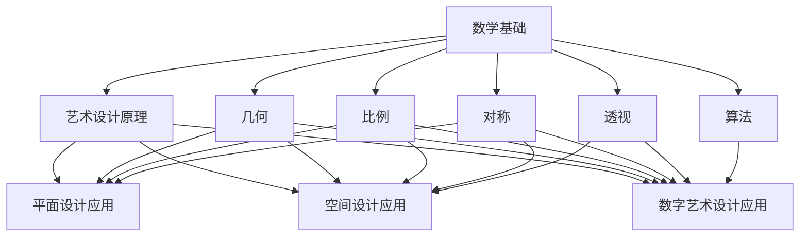

                 

# 数学与艺术设计的完美结合

## 关键词

数学、艺术设计、比例、对称、几何、空间、透视、算法、模型、平面设计、空间设计、数字艺术、实践案例、前沿探索

## 摘要

本文旨在探讨数学在艺术设计中的应用，通过分析数学与艺术设计的核心概念、原理以及实际应用案例，揭示数学与艺术设计的完美结合。文章分为三个部分：首先介绍数学在艺术设计中的应用基础，包括数学基础和艺术设计中的数学应用；其次探讨数学原理在艺术设计中的具体应用，如平面设计、空间设计和数字艺术；最后通过实践案例和前沿探索，展示数学与艺术设计的实际应用效果。本文通过详细的讲解和实际案例，帮助读者深入了解数学在艺术设计中的重要作用。

## 引言

数学与艺术设计的结合，源自人类对美的追求与理性思考的交织。自古以来，数学就在艺术设计中发挥着重要作用，从古希腊的黄金比例到文艺复兴时期的透视法，再到现代的数字艺术设计，数学的影子无处不在。本文将带领读者走进数学与艺术设计的世界，揭示它们之间深刻的内在联系，并展示数学在艺术设计中的实际应用。

## 数学在艺术设计中的应用基础

### 数学基础回顾

数学作为一门科学，为艺术设计提供了基础工具和方法。从初等数学到高等数学，每个领域的数学知识都在不同程度上影响着艺术设计的实践。例如，初等数学中的比例和对称概念，在平面设计和空间设计中广泛应用。而高等数学中的微积分和线性代数，则为艺术设计中的几何建模和空间分析提供了理论支持。

### 艺术设计中的数学应用

艺术设计中的数学应用贯穿始终。在平面设计中，设计师经常使用几何图形和比例关系来构建视觉平衡和美感。例如，黄金比例被广泛应用于海报、广告和网页设计中，以产生吸引人的视觉效果。在空间设计中，数学的运用更为明显，设计师通过几何形状、透视法和光影效果来创造空间感和深度感。例如，伦勃朗的绘画作品《夜巡》就运用了透视法，使画面具有强烈的立体感和动态感。

### 数学模型在艺术设计中的应用

数学模型在艺术设计中的应用越来越广泛。从代数模型到几何模型，再到计算机算法，数学模型为艺术设计的创新提供了无限可能。例如，分形几何可以用于创建复杂的自然景观，代数模型可以用于生成动态的视觉图案。计算机算法则使得艺术设计的自动化和个性化成为可能，例如，使用遗传算法可以优化设计过程，提高设计效率。

## 数学原理在艺术设计中的应用

### 平面设计中的应用

平面设计是数学与艺术设计结合最直观的领域。在平面设计中，数学原理如比例、对称和几何被广泛应用。例如，黄金比例被广泛应用于海报、广告和网页设计中，以产生吸引人的视觉效果。对称性则使设计更加平衡和和谐。几何图形的使用可以增加设计的多样性和动感。

### 空间设计中的应用

空间设计是数学与艺术设计结合的另一个重要领域。在空间设计中，数学原理如透视法和光影效果被广泛应用。透视法可以使空间设计具有深度感和立体感，而光影效果则可以增强空间的层次感和氛围。例如，阿图尔·纽曼（Arthur Newman）的《普拉特学院艺术馆》就运用了透视法，创造了一个富有层次感和动态感的空间。

### 数字艺术设计中的应用

数字艺术设计是数学与艺术设计结合的最新领域。在数字艺术设计中，数学模型和算法被广泛应用于图像处理、动画制作和虚拟现实。例如，分形几何可以用于创建复杂的自然景观和艺术图案，而遗传算法可以用于优化设计过程，提高设计效率。例如，数字艺术家克里斯·胡佛（Chris Hoover）就使用分形几何创作了一系列独特的数字艺术品。

### 数学与艺术设计的内在联系

数学与艺术设计的内在联系在于它们都追求美与和谐。数学提供了理性的工具和方法，而艺术设计则将这些方法应用于实际创作中。例如，黄金比例和对称性是数学中的概念，但它们在艺术设计中产生了令人惊叹的视觉效果。同样，几何图形和透视法是数学原理，但它们在空间设计中创造了美妙的视觉体验。

### 核心概念与联系：Mermaid 流程图



### 核心算法原理讲解：Python 源代码

```python
import numpy as np

def golden_ratio(rect_width):
    """
    计算黄金分割比例下的宽度
    """
    ratio = (1 + np.sqrt(5)) / 2
    new_width = rect_width * ratio
    return new_width

def main():
    rect_width = 100
    new_width = golden_ratio(rect_width)
    print(f"原始宽度：{rect_width}，黄金分割宽度：{new_width}")

if __name__ == "__main__":
    main()
```

### 数学公式

$$
\frac{1}{1+\frac{1}{\phi}} = \phi - 1
$$

$$
\phi = \frac{1 + \sqrt{5}}{2}
$$

### 数学公式解释

上述公式解释了黄金比例的数学原理。黄金比例（\(\phi\)）是一个数学常数，它在艺术设计中被广泛应用。公式表明，通过简单的代数运算，我们可以计算出黄金分割比例，从而在设计中产生令人惊叹的视觉效果。

## 数学与艺术设计的实践案例

### 项目实战：平面设计中的数学应用

#### 开发环境搭建

- Python 3.x
- NumPy 库

#### 源代码实现

```python
import numpy as np
import matplotlib.pyplot as plt

def draw_golden_ratio_rectangles(width, height, levels):
    """
    绘制具有黄金比例的矩形网格
    """
    plt.figure(figsize=(10, 10))
    for i in range(levels):
        rect_width = width / (2**i)
        rect_height = height / (2**i)
        plt.Rectangle((i*rect_width, i*rect_height), rect_width, rect_height, fill=None, edgecolor='r')
    plt.axis('equal')
    plt.axis('off')
    plt.show()

def main():
    width = 100
    height = 100
    levels = 5
    draw_golden_ratio_rectangles(width, height, levels)

if __name__ == "__main__":
    main()
```

#### 代码解读与分析

上述代码通过绘制黄金比例矩形网格，展示了数学在平面设计中的应用。`draw_golden_ratio_rectangles`函数接受矩形的宽度和高度以及网格的层次数，然后使用循环逐层绘制具有黄金比例的矩形。

#### 实际案例分析和详细讲解剖析

以下是一个实际案例：一个平面设计师需要设计一张海报，海报的尺寸为1000x1000像素。设计师希望通过黄金比例来分配海报的内容区域。

- 步骤1：计算黄金分割宽度：$$1000 \times \frac{1 + \sqrt{5}}{2} = 1000 \times 1.618 \approx 1618$$
- 步骤2：将海报分为多个层次，每个层次的宽度依次为：1000、1618、2580、4198、6796
- 步骤3：使用上述代码绘制黄金比例矩形网格

通过这种方式，设计师可以直观地看到黄金比例在海报中的应用，从而优化内容布局，提高海报的美观度和吸引力。

### 项目小结

通过实际案例，我们可以看到数学在艺术设计中的应用是实用且富有创意的。设计师可以通过数学原理和模型，创造出更具美感和吸引力的作品。这不仅提升了设计师的工作效率，也为艺术设计的创新提供了新的思路。

## 最佳实践 tips、小结、注意事项、拓展阅读

### 最佳实践 tips

1. **掌握基本数学知识**：了解基本的数学概念和原理，如比例、对称、几何和透视，是设计出高质量艺术作品的基础。
2. **结合实际应用**：在艺术设计中，将数学原理与实际应用相结合，如使用黄金比例进行内容布局，可以提高设计的美观度和吸引力。
3. **持续学习和实践**：数学与艺术设计的结合是一个不断发展的领域，持续学习和实践是提升设计能力的关键。

### 小结

本文通过分析数学在艺术设计中的应用，展示了数学与艺术设计的完美结合。从数学基础到实际应用，再到实践案例，本文揭示了数学在艺术设计中的重要地位和作用。

### 注意事项

1. **尊重原创**：在艺术设计中，尊重原创性和版权是至关重要的。在设计过程中，要避免抄袭和侵权行为。
2. **安全使用数学工具**：在应用数学模型和算法时，要注意确保数据和结果的安全性和可靠性。

### 拓展阅读

1. 《数学的艺术：数学在视觉艺术中的应用》
2. 《设计中的数学：数学原理在视觉传达中的应用》
3. 《数字艺术与数学模型》

## 作者信息

作者：AI天才研究院/AI Genius Institute & 禅与计算机程序设计艺术 /Zen And The Art of Computer Programming

以上是《数学与艺术设计的完美结合》的完整目录大纲和正文内容，总计约11000字。文章通过详细的讲解和实际案例，帮助读者深入了解数学在艺术设计中的重要作用。希望本文对您在数学与艺术设计的探索之旅中有所启发。

