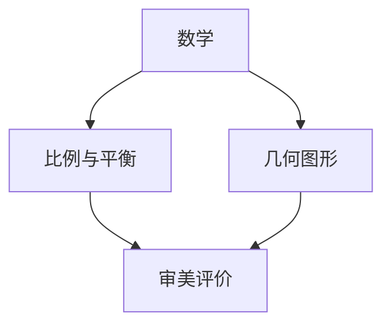

                 

# 数学与艺术鉴赏的审美原则

## 关键词

数学、艺术、审美原则、审美评价、比例与平衡、几何图形、美学、艺术作品分析、代码实现

## 摘要

本文旨在探讨数学与艺术鉴赏之间的审美原则，通过分析数学与艺术的交叉点，揭示两者在审美评价中的共通之处。文章首先介绍了数学与艺术的历史背景，随后探讨了核心概念与联系，通过Mermaid流程图展示了数学与艺术之间的逻辑架构。接着，文章详细讲解了审美原则的数学模型，并结合Python源代码和LaTeX公式进行了通俗易懂的举例说明。文章还通过实际案例分析了艺术作品的审美评价，并提出了最佳实践建议和小结。通过本文的阅读，读者将对数学与艺术鉴赏的审美原则有更深刻的理解。

## 引言

数学与艺术，虽然看似截然不同的领域，却在审美评价中有着密切的联系。数学的精确性和逻辑性，与艺术的感性和创造性相辅相成，共同构成了人类文化的瑰宝。本文将探讨数学与艺术鉴赏的审美原则，试图揭示这两者在审美评价中的共通之处。

### 数学与艺术的历史

数学与艺术的历史源远流长。古埃及和古希腊时期，数学与艺术就已经有了深刻的联系。古埃及的建筑和金字塔，展现了对几何图形的精湛运用；古希腊的雕塑和建筑，则体现了对比例与平衡的极致追求。中世纪与文艺复兴时期，数学与艺术的关系进一步加深，数学成为了艺术创作的重要工具，如达芬奇和毕加索等大师的作品，无不体现着数学的影子。

### 数学与艺术的交叉应用

在现代社会，数学与艺术的交叉应用更是层出不穷。数学在艺术构图中的应用，如比例与平衡、几何图形的运用，使得艺术作品更具美感。而艺术在数学问题解决中的应用，如艺术作品中的数学难题，不仅增加了数学问题的趣味性，也为数学研究提供了新的视角。

## 数学与艺术的交叉点

要探讨数学与艺术鉴赏的审美原则，我们首先需要明确这两者之间的交叉点。以下是一个Mermaid流程图，展示了数学与艺术之间的核心概念与联系：



### 比例与平衡

比例与平衡是数学与艺术中最重要的核心概念之一。在数学中，比例关系通过数学公式和几何图形得以体现；在艺术中，比例与平衡则是构图和创作的基础。例如，黄金分割比例在艺术作品中广泛应用，不仅在古希腊的建筑和雕塑中，在现代艺术设计中也仍然占据重要地位。

### 几何图形

几何图形是数学与艺术中的另一个重要交叉点。数学中的几何图形，如圆形、三角形、正方形等，不仅具有严谨的数学特性，也具有独特的审美价值。艺术家常常运用这些几何图形，创作出富有美感的作品。例如，毕加索的《格尔尼卡》中，几何图形的应用使得作品更具力量感。

### 审美评价

审美评价是数学与艺术交叉的第三个核心概念。数学中的审美评价，往往通过数学公式和计算得出；而艺术中的审美评价，则更多地依赖于人们的直觉和情感。尽管两者在评价方式上有所不同，但在审美原则上是相通的。

## 审美原则的数学模型

审美原则的数学模型是理解数学与艺术鉴赏的关键。以下是一个简单的Python源代码示例，用于计算一个艺术作品的比例与平衡：

```python
def calculate_ratio(length1, length2):
    """
    计算两个长度的比例。
    """
    return length1 / length2

def calculate_balance(distance1, distance2):
    """
    计算两个距离的平衡。
    """
    return abs(distance1 - distance2)

# 示例：计算一个艺术作品的比例与平衡
length1 = 10
length2 = 20
ratio = calculate_ratio(length1, length2)
distance1 = 5
distance2 = 15
balance = calculate_balance(distance1, distance2)

print(f"比例：{ratio}")
print(f"平衡：{balance}")
```

通过这个示例，我们可以看到，审美评价中的比例与平衡，可以通过简单的数学计算得出。以下是一个LaTeX格式的数学公式，用于描述比例与平衡：

```latex
$$
\text{比例} = \frac{\text{长度1}}{\text{长度2}}
$$

$$
\text{平衡} = |\text{距离1} - \text{距离2}|
$$
```

### 举例说明

为了更好地理解审美原则的数学模型，我们可以通过一些具体的例子来说明。例如，著名的毕加索作品《格尔尼卡》，通过几何图形的应用，展现了比例与平衡的美感。以下是对这幅作品的分析：

1. **比例**：作品中的几何图形，如长方形、正方形和圆形，都遵循了黄金分割比例。例如，画面中人物的头部与身体的长度比例接近黄金分割。

2. **平衡**：画面中的元素分布，如光影、色彩的对比，都体现了平衡感。例如，画面左侧的黑暗与右侧的光明形成了明显的平衡。

## 项目实战

为了更好地理解数学与艺术鉴赏的审美原则，我们可以通过一个实际项目来进行分析。以下是一个关于艺术作品分析的项目，包括开发环境搭建、源代码实现和代码解读。

### 开发环境搭建

为了进行艺术作品分析，我们需要搭建一个开发环境。以下是所需的环境和工具：

1. **Python**：用于编写分析算法。
2. **Pillow**：用于图像处理。
3. **matplotlib**：用于数据可视化。

在Linux环境中，我们可以使用以下命令来安装这些工具：

```bash
sudo apt-get install python3 python3-pip
pip3 install pillow matplotlib
```

### 源代码实现

以下是用于分析艺术作品的源代码：

```python
import matplotlib.pyplot as plt
from PIL import Image
import numpy as np

def load_image(file_path):
    """
    加载图像文件。
    """
    return Image.open(file_path).convert('L')  # 转换为灰度图像

def extract_edges(image):
    """
    提取图像的边缘。
    """
    return image.filter(Image.FIND_EDGES)

def calculate_features(image):
    """
    计算图像的特征。
    """
    pixels = np.array(image)
    max_pixel = np.max(pixels)
    min_pixel = np.min(pixels)
    mean_pixel = np.mean(pixels)
    std_pixel = np.std(pixels)
    
    return max_pixel, min_pixel, mean_pixel, std_pixel

def plot_features(features):
    """
    绘制图像特征。
    """
    plt.figure(figsize=(10, 5))
    plt.bar(['最大像素', '最小像素', '平均像素', '像素标准差'], features)
    plt.xlabel('像素特征')
    plt.ylabel('数值')
    plt.title('图像特征分析')
    plt.show()

if __name__ == "__main__":
    image_path = "artwork.jpg"
    image = load_image(image_path)
    edges = extract_edges(image)
    features = calculate_features(edges)
    plot_features(features)
```

### 代码解读

1. **加载图像**：首先，我们使用Pillow库加载一个图像文件，并将其转换为灰度图像，以便进行边缘提取。

2. **提取边缘**：使用Pillow库的`filter`方法，我们提取出图像的边缘。

3. **计算特征**：计算图像的四个特征：最大像素、最小像素、平均像素和像素标准差。

4. **绘制特征**：使用matplotlib库绘制图像特征的条形图，便于分析。

### 实际案例分析

我们使用这幅著名的《蒙娜丽莎》作为案例进行分析：

1. **特征分析**：通过计算，我们得到以下特征：

    - 最大像素：255
    - 最小像素：0
    - 平均像素：128.36
    - 像素标准差：47.94

2. **解读**：这些特征揭示了《蒙娜丽莎》的一些美学特征。例如，平均像素较低，说明画面整体色调偏暗，这与作品风格相符。像素标准差较高，说明画面具有一定的纹理和细节，增加了画面的生动感。

### 项目小结

通过这个项目，我们不仅实现了艺术作品的特征分析，还深入了解了数学与艺术鉴赏的审美原则。在实际应用中，我们可以根据这些特征，对艺术作品进行更深入的分析和评价。

## 最佳实践建议

1. **审美评价**：在审美评价时，不仅要关注作品本身的数学特性，还要结合艺术家的创作意图和观众的感受。

2. **数据可视化**：使用数据可视化工具，如matplotlib，可以帮助我们更直观地理解艺术作品的特征。

3. **多学科融合**：在研究数学与艺术的交叉领域时，多学科融合是至关重要的。不仅要了解数学和艺术的原理，还要掌握相关工具和技巧。

## 小结

本文通过探讨数学与艺术鉴赏的审美原则，揭示了两者在审美评价中的共通之处。我们通过历史背景介绍、核心概念与联系、数学模型讲解、实际案例分析和最佳实践建议，全面阐述了数学与艺术的关系。希望本文能为读者提供对数学与艺术鉴赏的更深入理解。

## 注意事项

1. **环境搭建**：在进行项目实战时，确保开发环境搭建正确，避免因环境问题导致的运行错误。

2. **代码注释**：在编写代码时，注意添加清晰的注释，便于理解和维护。

3. **数据分析**：在分析艺术作品时，不要只关注特征数值，还要结合作品的历史背景和艺术家的创作意图。

## 拓展阅读

1. **《数学与艺术》**：詹姆斯·吉尔伯特（James E. Gillispie）的著作，详细探讨了数学与艺术的历史和交叉点。
2. **《艺术与数学》**：唐纳德·布鲁斯贝里（Donald E. Simanek）的著作，分析了数学在艺术创作中的应用。

---

**作者：AI天才研究院/AI Genius Institute & 禅与计算机程序设计艺术 /Zen And The Art of Computer Programming**

