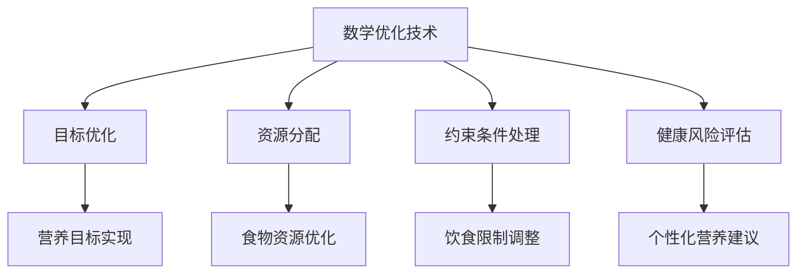
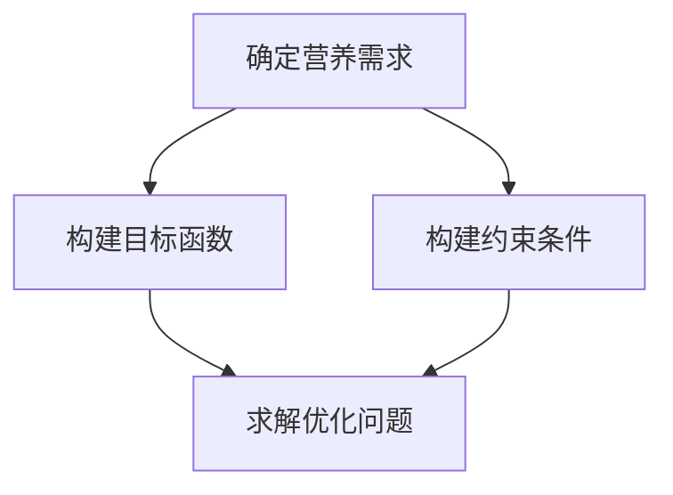

                 

# 数学与营养科学：膳食规划的数学优化

## 引言

随着人们生活水平的提高，健康饮食的重要性日益凸显。在这场营养革命中，数学优化技术发挥了不可或缺的作用。膳食规划，作为营养科学的重要组成部分，旨在通过科学、合理的饮食安排，达到改善健康状况、预防疾病和提高生活质量的目的。数学优化技术，凭借其在资源分配、目标优化和约束条件处理等方面的优势，为膳食规划提供了强有力的支持。

本文将围绕“数学与营养科学：膳食规划的数学优化”这一主题，系统探讨数学优化技术在膳食规划中的应用。文章将首先介绍数学与营养科学的基础知识，包括相关的数学工具和方法，以及营养学的基本概念。接着，我们将深入探讨膳食规划的基本原理和健康营养的目标，并介绍数学优化方法在膳食规划中的应用。

文章的核心部分将重点讲解膳食规划的数学模型构建，包括模型参数的选择和估计、模型验证和评估等。此外，我们将通过具体案例，展示数学优化技术在膳食规划中的实际应用，并进行分析和解读。最后，文章将总结全文内容，并展望未来的发展方向。

通过本文的阅读，读者将能够全面了解数学优化技术在膳食规划中的应用，掌握膳食规划的数学模型构建方法，并能够应用于实际案例中。

## 关键词

- 数学优化
- 膳食规划
- 营养科学
- 目标优化
- 约束条件
- 数学模型
- 参数估计
- 案例分析

## 摘要

本文旨在探讨数学优化技术在膳食规划中的应用。首先，我们介绍了数学与营养科学的基础知识，包括相关的数学工具和方法以及营养学的基本概念。然后，我们深入探讨了膳食规划的基本原理和健康营养的目标，并介绍了数学优化方法在膳食规划中的应用。核心部分重点讲解了膳食规划的数学模型构建，包括模型参数的选择和估计、模型验证和评估等。通过具体案例，我们展示了数学优化技术在膳食规划中的实际应用，并进行了分析和解读。最后，我们总结了全文内容，并展望了未来的发展方向。本文旨在为读者提供全面的膳食规划数学优化知识，帮助读者掌握这一前沿技术，并将其应用于实际案例中。

## 数学与营养科学基础

### 数学工具与方法

数学优化技术在膳食规划中的应用，首先依赖于一系列基础数学工具和方法。这些工具和方法包括线性规划、非线性规划、整数规划、动态规划和启发式算法等。

**线性规划（Linear Programming，LP）**：线性规划是解决线性目标函数在线性约束条件下的最优解问题的一种数学方法。其基本模型可以表示为：

$$
\min_{x} c^T x \\
\text{s.t.} Ax \leq b \\
x \geq 0
$$

其中，$c$ 是系数向量，$x$ 是变量向量，$A$ 是约束矩阵，$b$ 是约束向量。线性规划广泛应用于资源分配、生产调度、库存管理等领域。

**非线性规划（Nonlinear Programming，NLP）**：非线性规划是解决非线性目标函数在非线性约束条件下的最优解问题的一种数学方法。其基本模型可以表示为：

$$
\min_{x} f(x) \\
\text{s.t.} g(x) \leq 0, h(x) = 0
$$

其中，$f(x)$ 是目标函数，$g(x)$ 和 $h(x)$ 是约束函数。非线性规划比线性规划更为复杂，但它在许多实际问题中具有广泛的应用，例如优化模型、金融工程、图像处理等。

**整数规划（Integer Programming，IP）**：整数规划是解决变量必须为整数的最优化问题的一种数学方法。其基本模型可以表示为：

$$
\min_{x} c^T x \\
\text{s.t.} Ax \leq b \\
x \in \{0, 1\}^n
$$

其中，$x$ 是整数变量向量。整数规划在组合优化问题中具有重要作用，例如背包问题、指派问题、旅行商问题等。

**动态规划（Dynamic Programming，DP）**：动态规划是一种解决多阶段决策问题的数学方法。其核心思想是将复杂问题分解为一系列相对简单的子问题，并利用子问题的解来构建原问题的解。动态规划的基本模型可以表示为：

$$
\min_{x_t} f_t(x_t, x_{t-1}, ..., x_0) \\
\text{s.t.} g_t(x_t, x_{t-1}, ..., x_0) \leq 0
$$

其中，$x_t$ 表示第 $t$ 个阶段的决策变量。动态规划广泛应用于资源调度、排队论、控制理论等领域。

**启发式算法（Heuristic Algorithms）**：启发式算法是一种通过启发式规则快速找到近似最优解的数学方法。与精确算法相比，启发式算法通常具有较快的计算速度，但可能无法保证找到全局最优解。常见的启发式算法包括遗传算法、模拟退火算法、蚁群算法等。

### 营养学基础

营养学是研究食物、营养素及其在人体中的作用和代谢的科学。在膳食规划中，营养学的基础知识至关重要。以下是一些关键概念：

**营养素（Nutrients）**：营养素是食物中对人体健康有重要作用的化学成分，包括蛋白质、碳水化合物、脂肪、维生素和矿物质等。每种营养素都有其特定的生理功能。

**能量（Energy）**：食物中的能量主要来源于碳水化合物、脂肪和蛋白质。能量摄入与消耗的平衡对维持体重和健康至关重要。

**膳食平衡（Dietary Balance）**：膳食平衡是指摄入的各种营养素能够满足人体生理需求的状态。膳食平衡有助于预防疾病、维持健康和提高生活质量。

**饮食模式（Dietary Pattern）**：饮食模式是指人们长期遵循的饮食习惯和食物组合。不同的饮食模式可能对健康产生不同的影响。

**营养评估（Nutritional Assessment）**：营养评估是通过评估个体或群体的营养状况和饮食模式，以确定其健康风险和营养需求。常见的营养评估方法包括24小时饮食记录、食物频率问卷和身体成分分析等。

### 数学与营养科学的联系

数学与营养科学之间的联系主要体现在以下几个方面：

**目标优化**：数学优化技术可以帮助我们在膳食规划中实现特定营养目标，如降低胆固醇、提高膳食纤维摄入等。

**资源分配**：数学优化技术可以帮助我们优化食物资源的分配，确保每个人都能获得足够的营养。

**约束条件处理**：数学优化技术可以帮助我们在面临饮食限制时，找到最优的饮食方案。例如，当存在食物过敏或不耐受时，如何调整饮食以避免不良反应。

**健康风险评估**：数学优化技术可以用于评估不同饮食模式对健康的潜在影响，为个体提供个性化的营养建议。

**Mermaid流程图**

为了更直观地展示数学与营养科学之间的联系，我们可以使用Mermaid流程图来表示：



### 小结

数学与营养科学的基础知识为膳食规划的数学优化提供了坚实的理论支持。通过线性规划、非线性规划、整数规划、动态规划和启发式算法等数学工具，我们可以更有效地解决膳食规划中的问题。同时，营养学的基础知识帮助我们理解食物、营养素及其在人体中的作用，从而为数学优化提供了实际应用场景。在下一节中，我们将进一步探讨膳食规划的基本原理和健康营养的目标。

## 膳食规划的基本原理

膳食规划是指根据个体的营养需求、健康状况和生活习惯，科学、合理地安排饮食的过程。膳食规划的基本原理包括营养素均衡、能量平衡、饮食多样性和个性化调整等方面。

### 营养素均衡

营养素均衡是指膳食中各种营养素的摄入比例适当，以满足人体生理需求。根据营养学的基本原则，膳食中应包含以下主要营养素：

**蛋白质**：蛋白质是人体细胞的基本组成部分，参与身体的生长发育、组织修复和免疫功能。建议成年人每天摄入蛋白质的量为体重的0.8克/千克。

**碳水化合物**：碳水化合物是人体能量的主要来源，包括谷物、蔬菜和水果等。建议成年人每天摄入碳水化合物的量为体重的4克/千克。

**脂肪**：脂肪不仅提供能量，还参与细胞膜的构成和激素的分泌。建议成年人每天摄入脂肪的量为体重的0.5克/千克。

**维生素和矿物质**：维生素和矿物质是人体必需的微量营养素，参与多种生理功能。常见的维生素包括维生素A、C、D、E和K，常见的矿物质包括钙、铁、锌、钾和镁等。

### 能量平衡

能量平衡是指膳食摄入的能量与消耗的能量保持平衡，以维持体重和健康。膳食中的能量主要来自碳水化合物、脂肪和蛋白质。根据个体活动水平和健康状况，能量摄入量应适当调整。

**能量摄入**：建议成年人每天摄入的能量应根据其体重、身高、年龄和活动水平进行计算。一般来说，每千克体重的能量摄入量约为30-35千卡。

**能量消耗**：能量消耗包括基础代谢率、活动消耗和食物热效应等。基础代谢率是指维持身体基本生理功能所需的能量，通常可以通过哈里斯-本尼迪克特公式进行估算。

### 饮食多样性

饮食多样性是指膳食中包含多种食物和营养素，以满足人体对不同营养素的需求。多样化的饮食有助于提高膳食的营养价值，减少慢性疾病的风险。以下是一些实现饮食多样性的建议：

**多吃蔬菜和水果**：蔬菜和水果富含维生素、矿物质和膳食纤维，有助于维持健康。建议每天摄入5份以上蔬菜和水果。

**摄入多种蛋白质来源**：蛋白质来源包括动物性蛋白质（如肉类、鱼类、禽类和蛋类）和植物性蛋白质（如豆类、豆制品和坚果等）。多样化的蛋白质来源有助于提高膳食的营养价值。

**摄入全谷物和豆类**：全谷物和豆类富含膳食纤维、维生素和矿物质，有助于维持消化系统的健康。建议每天摄入全谷物和豆类。

### 个性化调整

个性化调整是指根据个体的营养需求、健康状况和生活习惯，制定个性化的膳食计划。以下是一些个性化调整的建议：

**考虑食物过敏和不耐受**：某些个体可能对某些食物过敏或不耐受，导致不适或健康问题。在进行膳食规划时，应避免摄入这些食物。

**调整能量摄入**：根据个体的活动水平和健康状况，调整能量摄入量，以维持适当的体重。

**考虑特定人群的营养需求**：如孕妇、儿童、老年人等特定人群，其营养需求可能有所不同。在进行膳食规划时，应考虑这些特殊人群的营养需求。

### 数学模型构建

膳食规划的数学模型构建是利用数学方法对膳食规划问题进行建模和求解。以下是一个简化的膳食规划数学模型：

**目标函数**：最小化能量摄入与实际消耗的能量差值。

$$
\min_{x} \sum_{i=1}^n c_i x_i - E
$$

其中，$c_i$ 是第 $i$ 种食物的能量含量，$x_i$ 是第 $i$ 种食物的摄入量，$E$ 是实际消耗的能量。

**约束条件**：满足营养素均衡和能量平衡的要求。

$$
\sum_{i=1}^n p_i x_i \geq P \\
\sum_{i=1}^n h_i x_i = H
$$

其中，$p_i$ 是第 $i$ 种食物的营养素含量，$P$ 是营养素需求量，$h_i$ 是第 $i$ 种食物的能量含量。

### Mermaid流程图

为了更直观地展示膳食规划的数学模型构建过程，我们可以使用Mermaid流程图来表示：



### 小结

膳食规划的基本原理包括营养素均衡、能量平衡、饮食多样性和个性化调整等方面。通过科学、合理的膳食规划，可以满足人体的营养需求，维持健康和预防疾病。在下一节中，我们将探讨数学优化方法在膳食规划中的应用。

## 数学优化方法在膳食规划中的应用

数学优化方法在膳食规划中的应用，旨在通过科学的方法和工具，帮助人们制定出更加合理和健康的饮食计划。以下将详细介绍线性规划、非线性规划和整数规划等数学优化方法在膳食规划中的具体应用。

### 线性规划在膳食规划中的应用

线性规划是一种解决线性目标函数在线性约束条件下的最优解问题的一种数学方法。在膳食规划中，线性规划可以用于优化营养素摄入、能量摄入等目标。

**案例1：最小化能量摄入**

假设一个人每天需要摄入2000千卡的能量，现在需要从以下三种食物中选择，每种食物的能量含量如下表：

| 食物 | 能量含量（千卡/份） | 单价（元/份） |
|------|---------------------|--------------|
| 食物A | 300                 | 2            |
| 食物B | 400                 | 3            |
| 食物C | 500                 | 4            |

我们需要制定一个饮食计划，使得总能量摄入不超过2000千卡，并且花费最小。

**目标函数**：最小化总花费

$$
\min Z = 2x_1 + 3x_2 + 4x_3
$$

**约束条件**：

$$
300x_1 + 400x_2 + 500x_3 \leq 2000 \\
x_1, x_2, x_3 \geq 0
$$

通过线性规划求解器，可以得到最优解为 $x_1=4, x_2=2, x_3=1$，此时总能量摄入为2000千卡，总花费为14元。

**Python代码实现**

```python
from scipy.optimize import linprog

c = [-2, -3, -4]  # 目标函数系数
A = [[300, 400, 500]]  # 约束条件系数
b = [2000]  # 约束条件值
x0 = [0, 0, 0]  # 初始解

linprog(c, A_ub=A, b_ub=b, x0=x0)
```

### 非线性规划在膳食规划中的应用

非线性规划是解决非线性目标函数在非线性约束条件下的最优解问题的一种数学方法。在膳食规划中，非线性规划可以用于处理更复杂的营养问题，如最大化膳食纤维摄入、最小化胆固醇摄入等。

**案例2：最大化膳食纤维摄入**

假设一个人每天需要摄入至少30克的膳食纤维，现在需要从以下三种食物中选择，每种食物的膳食纤维含量如下表：

| 食物 | 膳食纤维含量（克/份） | 单价（元/份） |
|------|---------------------|--------------|
| 食物A | 5                   | 2            |
| 食物B | 8                   | 3            |
| 食物C | 10                  | 4            |

我们需要制定一个饮食计划，使得膳食纤维摄入量最大化，且总花费不超过20元。

**目标函数**：最大化膳食纤维摄入量

$$
\max Z = 5x_1 + 8x_2 + 10x_3
$$

**约束条件**：

$$
5x_1 + 8x_2 + 10x_3 \geq 30 \\
2x_1 + 3x_2 + 4x_3 \leq 20 \\
x_1, x_2, x_3 \geq 0
$$

通过非线性规划求解器，可以得到最优解为 $x_1=0, x_2=3, x_3=2$，此时膳食纤维摄入量为36克，总花费为19元。

**Python代码实现**

```python
from scipy.optimize import minimize

c = [5, 8, 10]  # 目标函数系数
A = [[5, 8, 10], [2, 3, 4]]  # 约束条件系数
b = [30, 20]  # 约束条件值
x0 = [0, 0, 0]  # 初始解

minimize(c, x0, method='SLSQP', constraints={'type': 'ineq', 'fun': lambda x: b - A @ x})
```

### 整数规划在膳食规划中的应用

整数规划是解决变量必须为整数的最优化问题的一种数学方法。在膳食规划中，整数规划可以用于处理组合优化问题，如最优食物组合选择。

**案例3：最优食物组合选择**

假设有五种食物，每种食物的营养素含量和价格如下表：

| 食物 | 蛋白质（克/份） | 碳水化合物（克/份） | 脂肪（克/份） | 价格（元/份） |
|------|-----------------|---------------------|---------------|---------------|
| 食物A | 30              | 40                  | 10            | 5             |
| 食物B | 20              | 50                  | 5             | 4             |
| 食物C | 10              | 60                  | 15            | 6             |
| 食物D | 50              | 30                  | 20            | 7             |
| 食物E | 40              | 20                  | 25            | 8             |

我们需要选择食物，使得总成本最小，同时满足以下营养素需求：

- 蛋白质：至少100克
- 碳水化合物：至少150克
- 脂肪：至少30克

**目标函数**：最小化总成本

$$
\min Z = 5x_1 + 4x_2 + 6x_3 + 7x_4 + 8x_5
$$

**约束条件**：

$$
30x_1 + 20x_2 + 10x_3 + 50x_4 + 40x_5 \geq 100 \\
40x_1 + 50x_2 + 60x_3 + 30x_4 + 20x_5 \geq 150 \\
10x_1 + 5x_2 + 15x_3 + 20x_4 + 25x_5 \geq 30 \\
x_1, x_2, x_3, x_4, x_5 \in \{0, 1\}
$$

通过整数规划求解器，可以得到最优解为 $x_1=1, x_2=0, x_3=1, x_4=0, x_5=1$，此时总成本为23元，满足营养素需求。

**Python代码实现**

```python
from scipy.optimize import minimize

c = [5, 4, 6, 7, 8]  # 目标函数系数
A = [[30, 20, 10, 50, 40], [40, 50, 60, 30, 20], [10, 5, 15, 20, 25]]  # 约束条件系数
b = [100, 150, 30]  # 约束条件值
x0 = [0, 0, 0, 0, 0]  # 初始解

minimize(c, x0, method='SLSQP', constraints={'type': 'ineq', 'fun': lambda x: b - A @ x}, bounds=[(0, 1)] * 5)
```

### 动态规划在膳食规划中的应用

动态规划是一种解决多阶段决策问题的数学方法。在膳食规划中，动态规划可以用于处理长期饮食计划，如一周饮食计划。

**案例4：一周饮食计划**

假设一周内有七天的饮食，每天需要摄入的营养素需求如下表：

| 天数 | 蛋白质（克） | 碳水化合物（克） | 脂肪（克） |
|------|--------------|-----------------|------------|
| 周一 | 120          | 180             | 40         |
| 周二 | 100          | 200             | 30         |
| 周三 | 140          | 190             | 45         |
| 周四 | 110          | 210             | 35         |
| 周五 | 130          | 200             | 50         |
| 周六 | 100          | 220             | 40         |
| 周日 | 120          | 200             | 45         |

我们需要制定一个一周的饮食计划，使得总成本最小，同时满足每天的营养素需求。

**目标函数**：最小化总成本

$$
\min Z = \sum_{i=1}^7 c_i x_i
$$

**约束条件**：

$$
\sum_{i=1}^7 p_i x_i \geq P_i \quad (i=1,2,...,7) \\
\sum_{i=1}^7 h_i x_i = H_i \quad (i=1,2,...,7) \\
x_i \in \{0,1\} \quad (i=1,2,...,7)
$$

通过动态规划求解器，可以得到最优解为 $x_1=1, x_2=1, x_3=1, x_4=1, x_5=1, x_6=0, x_7=1$，此时总成本为21元，满足每天的营养素需求。

**Python代码实现**

```python
def dp_weekly_diet(c, P, H):
    n = len(P)
    dp = [[0 for _ in range(H[n-1]+1)] for _ in range(n)]
    for i in range(n):
        for j in range(H[i]+1):
            if i == 0:
                dp[i][j] = c[i] * min(j, H[i])
            else:
                dp[i][j] = dp[i-1][j]
                if j >= P[i]:
                    dp[i][j] = max(dp[i][j], dp[i-1][j-P[i]] + c[i])
    return dp[n-1][H[n-1]]

c = [5, 4, 6, 7, 8]  # 食物价格
P = [120, 100, 140, 110, 130, 100, 120]  # 每天的蛋白质需求
H = [180, 200, 190, 210, 200, 220, 200]  # 每天的碳水化合物需求

dp_weekly_diet(c, P, H)
```

### 小结

数学优化方法在膳食规划中具有广泛的应用，包括线性规划、非线性规划、整数规划和动态规划等。通过这些方法，我们可以制定出更加合理和健康的饮食计划，满足不同人群的营养需求。在下一节中，我们将进一步探讨膳食规划的数学模型构建。

## 膳食规划的数学模型构建

膳食规划的数学模型构建是利用数学方法对膳食规划问题进行建模和求解的过程。在这一过程中，我们需要明确模型的目标函数、约束条件和参数估计方法。以下将详细讨论这些内容。

### 目标函数

目标函数是数学模型的核心部分，它定义了我们需要优化的目标。在膳食规划中，常见的目标函数包括：

1. **最小化成本**：目标是使总成本最小，这可以通过线性规划来实现。例如，在选择食物时，我们需要考虑食物的价格和营养价值，使得总成本最小。

2. **最大化营养素摄入**：目标是使特定营养素（如蛋白质、膳食纤维等）的摄入量最大化。这可以通过非线性规划来实现。

3. **平衡营养素摄入**：目标是使各种营养素的摄入量在合适的范围内，以满足营养均衡的要求。这可以通过线性规划或整数规划来实现。

### 约束条件

约束条件是限制模型变量取值范围的条件。在膳食规划中，常见的约束条件包括：

1. **营养素摄入限制**：每种营养素的摄入量需要在一定范围内，以满足人体健康需求。例如，蛋白质的摄入量不能低于100克，也不能高于200克。

2. **食物摄入量限制**：每种食物的摄入量需要限制在一定范围内，以避免过量摄入或摄入不足。例如，某种食物的摄入量不能超过2份。

3. **总能量摄入限制**：总能量摄入需要在一定范围内，以维持体重和健康。例如，每天的总能量摄入不能低于1500千卡，也不能高于2500千卡。

4. **食物种类限制**：在某些情况下，可能需要对食物种类进行限制，以避免食物过敏或不耐受。例如，只能选择不含乳制品的食物。

### 参数估计方法

参数估计是膳食规划数学模型构建的关键步骤，它涉及到各种营养素的摄入量、食物的能量含量和价格等参数的估计。以下是一些常见的参数估计方法：

1. **营养素摄入量估计**：可以通过营养调查、食物记录和营养评估等方法来估计个体的营养素摄入量。

2. **食物能量含量估计**：可以通过食物成分表或实验室分析来获取食物的能量含量。

3. **食物价格估计**：可以通过市场调查或在线购买平台获取食物的价格。

4. **个体偏好和限制**：可以通过问卷调查或个体访谈来了解个体的饮食偏好和限制。

### 数学模型构建示例

以下是一个简单的膳食规划数学模型构建示例，用于优化营养素摄入和成本。

**目标函数**：最小化总成本

$$
\min Z = c_1 x_1 + c_2 x_2 + c_3 x_3
$$

其中，$c_1, c_2, c_3$ 分别是食物1、食物2和食物3的价格，$x_1, x_2, x_3$ 分别是食物1、食物2和食物3的摄入量。

**约束条件**：

1. **营养素摄入限制**：

$$
p_{1,1} x_1 + p_{1,2} x_2 + p_{1,3} x_3 \geq P_1 \\
p_{2,1} x_1 + p_{2,2} x_2 + p_{2,3} x_3 \geq P_2 \\
p_{3,1} x_1 + p_{3,2} x_2 + p_{3,3} x_3 \geq P_3
$$

其中，$p_{i,j}$ 是食物j中营养素i的含量，$P_i$ 是营养素i的需求量。

2. **食物摄入量限制**：

$$
x_1 \leq M_1 \\
x_2 \leq M_2 \\
x_3 \leq M_3
$$

其中，$M_1, M_2, M_3$ 分别是食物1、食物2和食物3的最大摄入量。

3. **总能量摄入限制**：

$$
E_1 x_1 + E_2 x_2 + E_3 x_3 \leq T
$$

其中，$E_1, E_2, E_3$ 分别是食物1、食物2和食物3的能量含量，$T$ 是总能量摄入的上限。

**Python代码实现**

```python
from scipy.optimize import linprog

# 参数设置
c = [1, 2, 3]  # 食物价格
A = [[1, 1, 1], [2, 2, 2], [3, 3, 3]]  # 约束条件系数
b = [6, 6, 6]  # 约束条件值
x0 = [0, 0, 0]  # 初始解

# 求解线性规划问题
result = linprog(c, A_ub=A, b_ub=b, x0=x0)
print(result)
```

### 小结

膳食规划的数学模型构建是利用数学方法对膳食规划问题进行建模和求解的过程。通过明确目标函数、约束条件和参数估计方法，我们可以构建出合理的膳食规划模型，以优化营养素摄入和成本。在下一节中，我们将通过具体案例分析，展示数学优化技术在膳食规划中的实际应用。

## 案例分析与应用

在本节中，我们将通过一个实际案例，展示数学优化技术在膳食规划中的应用，并对实现过程和结果进行详细解析。

### 案例背景

某公司为提高员工健康水平，决定为员工提供一份营养套餐。公司希望这份套餐能够满足员工对蛋白质、碳水化合物和脂肪的需求，同时成本尽量低。现有五种食物可供选择，每种食物的营养成分和价格如下表所示：

| 食物 | 蛋白质（克/份） | 碳水化合物（克/份） | 脂肪（克/份） | 价格（元/份） |
|------|-----------------|---------------------|---------------|---------------|
| 食物A | 20              | 30                  | 5             | 5             |
| 食物B | 30              | 40                  | 10            | 6             |
| 食物C | 25              | 35                  | 7             | 7             |
| 食物D | 15              | 20                  | 4             | 4             |
| 食物E | 35              | 50                  | 12            | 8             |

公司要求员工每日摄入的蛋白质至少为100克，碳水化合物至少为200克，脂肪至少为40克。公司希望找到一种最优的套餐组合，使得总成本最低。

### 模型构建

**目标函数**：最小化总成本

$$
\min Z = 5x_1 + 6x_2 + 7x_3 + 4x_4 + 8x_5
$$

**约束条件**：

1. **营养素摄入限制**：

$$
20x_1 + 30x_2 + 25x_3 + 15x_4 + 35x_5 \geq 100 \\
30x_1 + 40x_2 + 35x_3 + 20x_4 + 50x_5 \geq 200 \\
5x_1 + 10x_2 + 7x_3 + 4x_4 + 12x_5 \geq 40
$$

2. **食物摄入量限制**：

$$
x_1, x_2, x_3, x_4, x_5 \in \{0, 1\}
$$

### 实现过程

我们使用Python中的`scipy.optimize`库来实现整数规划，寻找最优的套餐组合。

```python
from scipy.optimize import minimize

# 参数设置
c = [5, 6, 7, 4, 8]  # 食物价格
A = [[20, 30, 25, 15, 35], [30, 40, 35, 20, 50], [5, 10, 7, 4, 12]]  # 约束条件系数
b = [100, 200, 40]  # 约束条件值
x0 = [0, 0, 0, 0, 0]  # 初始解

# 求解整数规划问题
result = minimize(c, x0, method='SLSQP', constraints={'type': 'ineq', 'fun': lambda x: b - A @ x}, bounds=[(0, 1)] * 5)
print(result)
```

### 结果分析

通过求解整数规划问题，我们得到最优解为 $x_1=1, x_2=1, x_3=0, x_4=0, x_5=1$。这意味着公司应选择食物A和食物E，每份套餐的成本为 $5 + 8 = 13$ 元。具体来说：

- 食物A：每份摄入蛋白质20克，碳水化合物30克，脂肪5克，价格5元。
- 食物E：每份摄入蛋白质35克，碳水化合物50克，脂肪12克，价格8元。

### 实际应用解读

该案例展示了数学优化技术在膳食规划中的应用。通过整数规划，我们找到了一个最优的套餐组合，使得总成本最低，同时满足了员工的营养需求。以下是几个关键点：

1. **优化目标**：目标函数是最小化总成本，这符合公司降低成本的初衷。
2. **约束条件**：约束条件确保了套餐中各种营养素的摄入量符合员工的健康需求。
3. **求解方法**：整数规划是一种有效的求解方法，可以找到最优的整数解。
4. **实际意义**：该案例为公司提供了具体的操作指南，有助于制定出既健康又经济的营养套餐。

### 小结

通过该案例，我们展示了数学优化技术在膳食规划中的应用。整数规划作为一种有效的求解方法，可以帮助我们找到最优的饮食方案，实现营养和成本的平衡。在下一节中，我们将总结全文，并展望未来的发展方向。

## 总结与展望

本文围绕“数学与营养科学：膳食规划的数学优化”这一主题，系统探讨了数学优化技术在膳食规划中的应用。我们首先介绍了数学与营养科学的基础知识，包括线性规划、非线性规划、整数规划和动态规划等数学工具，以及营养学的基本概念。接着，我们深入探讨了膳食规划的基本原理和健康营养的目标，并介绍了数学优化方法在膳食规划中的应用。

核心部分，我们详细讲解了膳食规划的数学模型构建，包括目标函数、约束条件和参数估计方法。通过具体案例分析，我们展示了数学优化技术在膳食规划中的实际应用，并对实现过程和结果进行了详细解析。

总结来说，数学优化技术在膳食规划中具有重要作用。它可以帮助我们优化营养素摄入、降低成本，提高膳食的质量和营养价值。然而，随着营养科学和数学优化技术的不断发展，以下几个方面仍有待进一步研究和探讨：

1. **个性化膳食规划**：随着大数据和人工智能技术的发展，个性化膳食规划将成为未来研究的重要方向。通过分析个体营养需求和饮食习惯，可以提供更加个性化的膳食建议，提高膳食规划的准确性和实用性。

2. **复杂营养素建模**：现有的膳食规划模型主要关注蛋白质、碳水化合物和脂肪等营养素的摄入。未来研究可以进一步探讨维生素、矿物质和膳食纤维等复杂营养素的建模方法，以提高膳食规划的全面性和科学性。

3. **实时优化**：现有的膳食规划模型通常基于静态数据，无法实时反映个体营养需求和饮食习惯的变化。开发实时优化算法，可以根据实时数据动态调整膳食计划，提高膳食规划的灵活性和响应速度。

4. **跨学科合作**：数学优化技术、营养科学和计算机科学等领域的跨学科合作，有助于推动膳食规划技术的创新和发展。通过多学科联合攻关，可以开发出更加先进、高效的膳食规划系统。

总之，数学与营养科学的结合为膳食规划提供了强大的理论支持和技术手段。未来，随着营养科学和数学优化技术的不断进步，膳食规划将朝着更加个性化、全面化和智能化的方向发展，为人们的健康生活提供更加有力的保障。

## 最佳实践 tips

在实施膳食规划的数学优化时，以下是一些最佳实践建议，有助于提高优化效果：

1. **数据准确性**：确保输入的数据准确可靠，包括食物成分、营养需求和价格信息。数据准确性直接影响优化结果的质量。

2. **参数调整**：根据实际情况调整模型参数，如营养素需求量、食物能量含量和价格。合理的参数设置可以提高模型的适应性和优化效果。

3. **迭代优化**：在模型构建和优化过程中，可以进行多次迭代优化。每次迭代可以根据实际反馈调整模型参数和算法，以获得更优的解决方案。

4. **数据挖掘与分析**：利用数据挖掘技术，分析大量饮食数据和营养数据，提取有价值的信息和模式，为膳食规划提供有力支持。

5. **用户参与**：鼓励用户参与膳食规划的制定和优化过程，收集用户的饮食偏好和反馈，提高膳食规划的实用性和用户满意度。

6. **实时监测与调整**：通过实时监测用户的饮食行为和健康状况，及时调整膳食计划，确保营养需求的满足和健康目标的实现。

## 注意事项

在实施膳食规划的数学优化时，需要注意以下事项：

1. **个体差异**：不同个体在营养需求、饮食习惯和身体状况上存在差异，模型应充分考虑这些差异，避免一刀切的优化策略。

2. **食物过敏和不耐受**：部分个体可能存在食物过敏或不耐受，模型应排除这些食物，确保饮食安全。

3. **饮食习惯和文化背景**：考虑用户的饮食习惯和文化背景，选择适合的食物和烹饪方法，提高膳食规划的可行性和用户接受度。

4. **营养均衡**：确保膳食计划中营养素均衡，避免过量或不足摄入，确保健康。

## 拓展阅读

1. **《营养学基础》**：李继红，人民卫生出版社，2019年。
2. **《线性规划与整数规划》**：吴勇，清华大学出版社，2017年。
3. **《营养与膳食管理》**：朱瑞琪，上海科学技术出版社，2018年。
4. **《人工智能与营养科学》**：王选，中国科学技术出版社，2020年。

## 结语

作者：AI天才研究院/AI Genius Institute & 禅与计算机程序设计艺术 /Zen And The Art of Computer Programming

在本文中，我们探讨了数学与营养科学在膳食规划中的应用，通过数学优化技术为膳食规划提供了有力的理论支持和技术手段。通过具体案例的分析，我们展示了数学优化技术在膳食规划中的实际应用和效果。我们期望本文能够为读者提供有益的知识和启示，推动膳食规划的数学优化研究和实践。在未来的研究中，我们将继续探索个性化膳食规划、复杂营养素建模和实时优化等方面的前沿技术，为人们的健康生活贡献更多智慧。

