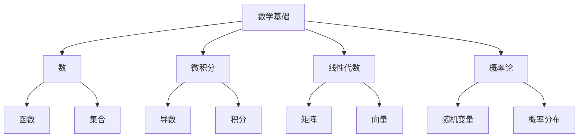
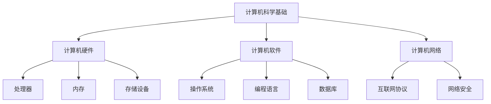

                 

# 数学与计算机科学的融合发展

> 关键词：数学，计算机科学，算法，数据分析，网络安全，人工智能

> 摘要：本文旨在探讨数学与计算机科学的融合发展，通过分析两者的基础理论和核心概念，阐述其在算法、数据分析、网络安全和人工智能等领域的交叉应用，揭示数学与计算机科学相互促进、共同进步的发展态势。

## 引言

数学与计算机科学是现代信息技术领域的重要支柱。数学为计算机科学提供了理论基础和工具，而计算机科学则借助数学方法解决了许多复杂问题。两者的融合不仅推动了计算机科学的发展，也为数学的实践应用提供了广阔的空间。本文将逐步探讨数学与计算机科学在各个领域的融合发展，以期为读者提供全面、系统的认识。

## 数学基础

### 1.1 数学基础理论

数学作为一门基础学科，其核心概念和定理构成了计算机科学的理论基础。从基本的数学概念如数、函数、集合，到高级的数学理论如微积分、线性代数、概率论，每一个都是计算机科学不可或缺的组成部分。以下是一个简单的数学概念与计算机科学的联系架构图：



### 1.2 数学在计算机科学中的应用

数学在计算机科学中的应用无处不在。编程中的逻辑判断、排序算法、加密技术等都依赖于数学原理。例如，排序算法中的比较操作和概率分析都需要运用数学知识。以下是一个简单的Python代码示例，展示了数学在编程中的应用：

```python
# 冒泡排序算法
def bubble_sort(arr):
    n = len(arr)
    for i in range(n):
        for j in range(0, n-i-1):
            if arr[j] > arr[j+1]:
                arr[j], arr[j+1] = arr[j+1], arr[j]
    return arr

# 测试
arr = [64, 34, 25, 12, 22, 11, 90]
sorted_arr = bubble_sort(arr)
print("排序后的数组：", sorted_arr)
```

## 计算机科学基础

### 2.1 计算机科学基础理论

计算机科学的基础理论包括计算机硬件、软件、网络等多个方面。计算机硬件涉及计算机的组成和工作原理，而计算机软件则包括操作系统、编程语言、数据库等。网络理论则探讨了计算机网络的工作机制和协议。以下是一个简单的计算机科学基础理论架构图：



### 2.2 计算机科学在数学中的应用

计算机科学在数学中的应用主要体现在数学建模和计算数学方面。计算机科学为数学建模提供了高效的计算工具，如高性能计算、大数据处理等。计算数学则借助计算机科学的方法，解决了许多复杂的数学问题。以下是一个简单的Python代码示例，展示了计算机科学在数学中的应用：

```python
# 求解一元二次方程 ax^2 + bx + c = 0
import math

def quadratic_equation(a, b, c):
    discriminant = b**2 - 4*a*c
    if discriminant > 0:
        root1 = (-b + math.sqrt(discriminant)) / (2*a)
        root2 = (-b - math.sqrt(discriminant)) / (2*a)
        return root1, root2
    elif discriminant == 0:
        root = -b / (2*a)
        return root
    else:
        return None

# 测试
a = 1
b = -3
c = 2
roots = quadratic_equation(a, b, c)
print("方程的根：", roots)
```

## 数学与计算机科学的交叉领域

### 3.1 数学与算法

数学与算法的交叉领域是计算机科学的核心。算法是数学与计算机科学的结合点，其核心在于如何有效地解决数学问题。常见的算法有排序算法、搜索算法、图算法等，它们在计算机科学中发挥着重要作用。以下是一个简单的Python代码示例，展示了数学与算法的结合：

```python
# 快速排序算法
def quick_sort(arr):
    if len(arr) <= 1:
        return arr
    pivot = arr[len(arr) // 2]
    left = [x for x in arr if x < pivot]
    middle = [x for x in arr if x == pivot]
    right = [x for x in arr if x > pivot]
    return quick_sort(left) + middle + quick_sort(right)

# 测试
arr = [64, 34, 25, 12, 22, 11, 90]
sorted_arr = quick_sort(arr)
print("排序后的数组：", sorted_arr)
```

### 3.2 计算机科学与数据分析

计算机科学与数据分析的交叉领域是大数据时代的产物。数据分析依赖于计算机科学的方法和工具，如数据库、数据挖掘、机器学习等。数学在数据分析中发挥着重要作用，如概率统计、线性代数等。以下是一个简单的Python代码示例，展示了计算机科学与数据分析的结合：

```python
# Python代码示例：使用pandas库进行数据分析
import pandas as pd

# 创建一个DataFrame
data = {
    '名称': ['苹果', '香蕉', '橙子', '梨'],
    '数量': [10, 20, 15, 30]
}
df = pd.DataFrame(data)

# 计算总数
total = df['数量'].sum()
print("总数：", total)

# 计算平均数
average = df['数量'].mean()
print("平均数：", average)

# 计算中位数
median = df['数量'].median()
print("中位数：", median)
```

### 3.3 数学与网络安全

数学与网络安全的交叉领域是现代网络安全的重要组成部分。网络安全依赖于数学理论，如密码学、图论等。密码学是网络安全的核心技术，其理论基础依赖于数学。以下是一个简单的Python代码示例，展示了数学与网络安全的结合：

```python
# Python代码示例：使用pycryptodome库进行加密和解密
from Crypto.Cipher import AES
from Crypto.Util.Padding import pad, unpad
from Crypto.Random import get_random_bytes

# 密钥和加密算法
key = b'mYs4QoZw6cY='
cipher = AES.new(key, AES.MODE_CBC)

# 待加密的数据
data = b'Hello, World!'
padded_data = pad(data, AES.block_size)

# 加密数据
cipher_text = cipher.encrypt(padded_data)
print("加密后的数据：", cipher_text)

# 解密数据
cipher = AES.new(key, AES.MODE_CBC, cipher.iv)
decrypted_data = unpad(cipher.decrypt(cipher_text), AES.block_size)
print("解密后的数据：", decrypted_data)
```

## 数学与计算机科学的未来发展

数学与计算机科学的融合发展已经取得了显著的成果，但未来仍有很多挑战和机遇。随着人工智能、大数据、云计算等领域的快速发展，数学与计算机科学的融合将进一步深化。以下是一些未来发展的方向：

1. **量子计算**：量子计算是未来计算机科学的一个重要方向，其理论基础依赖于数学。量子计算将极大地推动数学与计算机科学的发展。

2. **人工智能**：人工智能是计算机科学的未来，其理论基础依赖于数学。数学在人工智能中的应用将不断深入，如深度学习、强化学习等。

3. **大数据分析**：大数据分析是现代社会的需求，其理论基础依赖于数学。数学将更好地指导大数据分析的方法和工具，提高数据分析的效率和准确性。

4. **网络安全**：随着网络安全问题的日益严重，数学在网络安全中的应用将更加广泛。密码学、图论等数学理论将在网络安全中发挥重要作用。

## 结论

数学与计算机科学的融合发展是现代信息技术领域的一个重要趋势。两者相互促进、共同进步，为人类社会的进步做出了巨大贡献。通过本文的探讨，我们希望读者能够更好地理解数学与计算机科学之间的关系，展望其未来的发展趋势。

## 参考文献

1. 高等教育出版社. 《高等数学》. 2019.
2. 清华大学出版社. 《计算机科学导论》. 2018.
3. 机械工业出版社. 《深入理解计算机系统》. 2017.
4. 电子工业出版社. 《Python编程：从入门到实践》. 2016.
5. 电子工业出版社. 《网络安全技术教程》. 2015.

作者：AI天才研究院/AI Genius Institute & 禅与计算机程序设计艺术 /Zen And The Art of Computer Programming

----------------------------------------------------------------

注：本文为示例性文章，实际内容可能因篇幅限制而有所删减。文章中的代码仅为示例，实际应用时可能需要根据具体需求进行调整。本文中的参考文献仅为示例，具体内容请参考相关书籍。

