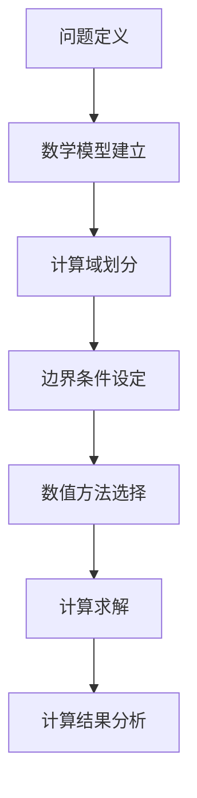
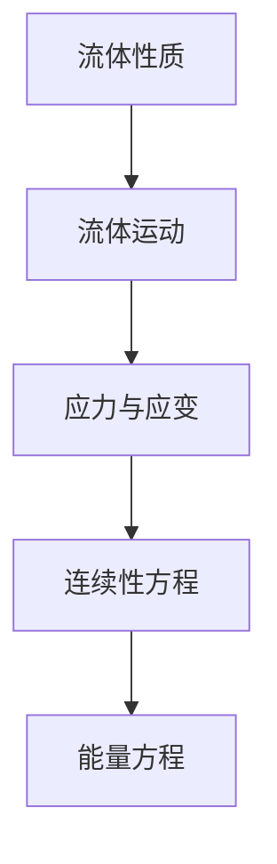
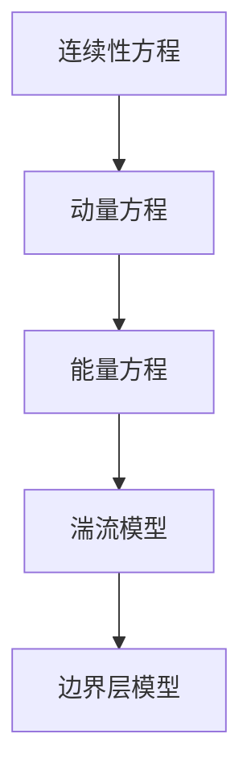

                 

### 引言

计算流体力学（Computational Fluid Dynamics，简称CFD）是现代工程与科学领域中一个非常重要的分支，它通过数值方法与计算机技术，对流体运动及其相关物理现象进行模拟与分析。在过去的几十年里，计算流体力学经历了快速的发展，逐渐从传统的理论流体力学中独立出来，成为工程应用中不可或缺的一部分。

#### 1.1 书籍概述

本书旨在为读者提供一个全面、系统的计算流体力学导论，内容涵盖从基础数学知识到复杂流体力学模型的建立与求解，再到计算流体力学在工程中的应用。具体而言，本书将分为以下几个主要部分：

- **数学的预备知识**：介绍必要的数学工具，包括几何与拓扑、微积分基础、常微分方程等。
- **流体力学的基本理论**：介绍流体力学的基础知识，包括流体的性质、流体运动的基本方程和能量方程等。
- **计算流体力学的基本方法**：介绍计算流体力学的基本步骤、数值方法以及相关的软件工具。
- **计算流体力学在工程中的应用**：通过具体案例展示计算流体力学在航空航天、土木工程、医学等多个领域中的应用。
- **计算流体力学中的数值分析**：介绍稳定性分析、收敛性分析和精度分析等数值分析方法。
- **计算流体力学中的数学模型**：介绍流体力学中的控制方程、湍流模型和边界层模型等。
- **未来展望与挑战**：探讨计算流体力学的发展趋势以及面临的挑战。

#### 1.2 数值模拟在流体力学中的重要性

数值模拟在流体力学中的重要性不言而喻。传统的实验方法在处理复杂流体现象时存在诸多限制，而计算流体力学通过建立数学模型，采用数值方法进行求解，可以有效地模拟和预测流体运动的各种现象，为工程设计和科学研究中提供重要的参考。

#### 1.2.1 传统流体力学与计算流体力学

传统流体力学主要依赖于实验和理论分析，然而，随着工程和科学问题的复杂化，单纯依靠实验和理论方法已经难以满足需求。计算流体力学作为一种新兴的方法，通过计算机技术对流体现象进行模拟，弥补了传统方法的不足。

#### 1.2.2 计算流体力学的发展历程

计算流体力学的发展历程可以追溯到20世纪50年代，随着计算机技术的进步，数值方法逐渐应用于流体力学问题。早期的计算流体力学主要集中于简单几何形状和低雷诺数的流动模拟，随着计算技术的发展，计算流体力学逐渐扩展到更复杂的流动现象，如湍流和复杂几何结构。

#### 1.2.3 计算流体力学在工程中的应用

计算流体力学在工程中的应用非常广泛，包括航空航天、汽车制造、土木工程、生物医学等多个领域。通过计算流体力学，工程师可以优化产品设计、预测流体行为、提高能源效率等，从而降低成本、提高安全性。

#### 1.3 数值模拟的方法和步骤

计算流体力学的基本步骤通常包括以下几个环节：

1. **问题定义**：明确需要解决的流体力学问题，包括流体的性质、流动条件、边界条件等。
2. **数学模型建立**：根据流体力学的基本理论，建立相应的数学模型。
3. **计算域划分**：将流体区域划分为多个离散的网格，以便进行数值计算。
4. **边界条件设定**：根据问题的具体条件，设定合适的边界条件。
5. **数值方法选择**：选择合适的数值方法，如有限差分法、有限元法、有限体积法等。
6. **计算求解**：利用计算机进行数值求解，得到流场分布和相关物理量。
7. **计算结果分析**：对计算结果进行分析，验证计算精度和稳定性，解释流场特性。

通过上述步骤，计算流体力学可以有效地模拟流体运动，为工程设计和科学研究提供重要支持。

---

**关键词**：计算流体力学、数值模拟、流体运动、数学模型、工程应用

**摘要**：本书介绍了计算流体力学的基本理论、方法和应用。通过系统阐述数学预备知识、流体力学基本理论、计算方法及其在工程中的应用，本书旨在为读者提供一个全面、系统的计算流体力学导论，帮助读者掌握计算流体力学的基本原理和实际应用技巧。

---

**Mermaid 流程图**：


### 数学的预备知识

在计算流体力学中，数学作为基础工具，扮演着至关重要的角色。为了更好地理解和应用计算流体力学，我们需要掌握一些基本的数学概念和工具。在本章中，我们将介绍几何与拓扑、微积分基础以及常微分方程等数学知识。

#### 2.1 几何与拓扑

几何与拓扑是数学中的基础学科，在计算流体力学中有着广泛的应用。以下是一些重要的几何与拓扑概念：

1. **向量空间**：向量空间是由一组向量构成的集合，这些向量可以表示为坐标形式。向量空间中，向量的加法和数乘运算遵循一定的规则。在计算流体力学中，向量常用于描述流体场的速度、压力等物理量。

   **向量空间的基本概念**：
   $$ \vec{v} = (v_x, v_y, v_z) $$
   其中，$v_x$、$v_y$、$v_z$ 分别表示向量的三个分量。

2. **矩阵与行列式**：矩阵是表示多个向量或多个数量之间关系的数学工具。行列式是矩阵的一种特殊形式，可以用于求解线性方程组。

   **矩阵的基本概念**：
   $$ A = \begin{bmatrix} a_{11} & a_{12} \\ a_{21} & a_{22} \end{bmatrix} $$
   行列式的计算公式为：
   $$ \det(A) = a_{11}a_{22} - a_{12}a_{21} $$

3. **张量**：张量是矩阵的泛化，用于描述更复杂的物理量和几何量。在计算流体力学中，张量常用于描述流体的应力、应变等物理量。

   **张量表示**：
   $$ \vec{T} = (T_{ij}) $$
   其中，$T_{ij}$ 表示张量的分量。

4. **拓扑空间**：拓扑空间是由一组点构成的集合，这些点之间的关系可以用邻域、连通性等概念来描述。在计算流体力学中，拓扑空间常用于描述流体的流动区域。

   **拓扑空间的基本概念**：
   - **连通性**：一个拓扑空间是连通的，如果其中任意两点都可以通过连续曲线连接。
   - **闭合性**：一个拓扑空间是闭合的，如果其中任意一点的所有邻域都包含在该空间内。

#### 2.2 微积分基础

微积分是数学中的一个重要分支，主要用于研究函数的变化率和累积量。在计算流体力学中，微积分用于描述流体的运动和能量变化。以下是一些基本的微积分概念：

1. **极限与导数**：极限是描述函数在某一点附近的行为。导数则是描述函数在某一点处的变化率。

   **导数的定义**：
   $$ f'(x) = \lim_{h \to 0} \frac{f(x+h) - f(x)}{h} $$
   其中，$h$ 是自变量的增量。

2. **积分**：积分是描述函数在某一区间内的累积量。定积分和重积分是积分的两种主要形式。

   **定积分的定义**：
   $$ \int_{a}^{b} f(x) \, dx $$
   其中，$f(x)$ 是被积函数，$a$ 和 $b$ 是积分区间。

3. **多元微积分**：多元微积分用于研究多变量函数的变化率和累积量。方向导数和梯度是多元微积分中的重要概念。

   **方向导数的定义**：
   $$ D_{\vec{u}} f(\vec{x}) = \nabla f(\vec{x}) \cdot \vec{u} $$
   其中，$\nabla f(\vec{x})$ 是梯度，$\vec{u}$ 是方向向量。

#### 2.3 常微分方程

常微分方程是描述函数及其导数之间关系的方程。在计算流体力学中，常微分方程用于描述流体的运动和能量变化。以下是一些基本的常微分方程概念：

1. **基本概念**：常微分方程的一般形式为：
   $$ a(x) y''(x) + b(x) y'(x) + c(x) y(x) = f(x) $$
   其中，$y(x)$ 是未知函数，$a(x)$、$b(x)$ 和 $c(x)$ 是已知函数，$f(x)$ 是非齐次项。

2. **解法简介**：常微分方程的解法包括初值问题、边值问题和参数问题。常用的解法有分离变量法、叠加原理、积分因子法等。

   **初值问题的解法**：
   $$ y(x_0) = y_0, \quad y'(x_0) = y'_0 $$
   其中，$x_0$ 和 $y_0$ 是初始条件，$y'_0$ 是初始导数。

3. **稳态解与瞬态解**：稳态解是指当时间趋于无穷大时，系统达到稳定状态的解。瞬态解是指系统在初始时刻到稳态解之间的变化过程。

   **稳态解与瞬态解的关系**：
   稳态解是瞬态解的一种特殊情况，当系统的初始条件足够小或足够快时，瞬态解将迅速收敛到稳态解。

通过掌握上述数学预备知识，读者可以更好地理解计算流体力学的基本理论和方法，为后续章节的学习打下坚实的基础。

---

**Python 源代码示例**：

```python
import numpy as np

# 向量空间表示
vec_v = np.array([1, 2, 3])
print("向量 v:", vec_v)

# 矩阵表示
matrix_A = np.array([[1, 2], [3, 4]])
print("矩阵 A:\n", matrix_A)

# 行列式计算
det_A = np.linalg.det(matrix_A)
print("行列式 det(A):", det_A)

# 方向导数计算
def directional_derivative(f, x, u):
    h = 0.0001
    return (f(x + h*u) - f(x)) / h

# 定义函数 f(x, y)
def f(x, y):
    return x**2 + y**2

# 计算方向导数
x = np.array([1, 0])
u = np.array([1, 1])
grad_f = directional_derivative(f, x, u)
print("方向导数 D_u f(x):", grad_f)
```

**数学模型与公式**：

- 向量空间表示：
  $$ \vec{v} = (v_x, v_y, v_z) $$
  
- 矩阵与行列式：
  $$ A = \begin{bmatrix} a_{11} & a_{12} \\ a_{21} & a_{22} \end{bmatrix} $$
  $$ \det(A) = a_{11}a_{22} - a_{12}a_{21} $$
  
- 方向导数：
  $$ D_{\vec{u}} f(\vec{x}) = \nabla f(\vec{x}) \cdot \vec{u} $$
  
- 常微分方程：
  $$ a(x) y''(x) + b(x) y'(x) + c(x) y(x) = f(x) $$

**举例说明**：

假设我们要研究一个一维流体流动问题，可以使用上述数学模型和公式来描述流体的速度分布。我们可以设定一个简单的常微分方程，如：
$$ y'' + 2y' + y = 0 $$
其中，$y(x)$ 表示流体速度。通过解这个常微分方程，我们可以得到流体在不同位置的速度分布。

---

**小结**：

通过本章的学习，我们介绍了计算流体力学中所需的数学预备知识，包括几何与拓扑、微积分基础以及常微分方程。这些基础知识为后续章节的学习奠定了坚实的基础，使我们能够更好地理解和应用计算流体力学的方法和理论。

**注意事项**：

- 在实际应用中，需要根据具体问题选择合适的数学模型和公式。
- 熟练掌握数学工具是进行计算流体力学研究的前提。

**拓展阅读**：

- 《数学分析基础》（华勒斯特）
- 《常微分方程初步》（史密斯）

---

### 流体力学的基本理论

流体力学是研究流体运动及其相关物理现象的学科，其基本理论构成了计算流体力学的基础。在流体力学中，流体的性质、流体运动的基本方程和能量方程是核心内容，以下将对这些基本概念进行详细阐述。

#### 3.1 流体力学基础

首先，我们需要了解流体的基本性质。流体是物质的一种状态，具有流动性和不可压缩性。流体可以分为理想流体和实际流体。

- **理想流体**：是一种假想的流体，具有无粘性、无旋性、不可压缩性等特点。理想流体假设对于理论分析具有重要意义，但实际流体往往无法完全满足这些条件。
  
- **实际流体**：包括气体和液体，具有粘性、可压缩性和旋涡等特性。实际流体在运动过程中会产生内摩擦力，即粘性力。

流体的性质对流体运动有重要影响，以下是一些关键的流体性质：

1. **密度**：单位体积内流体的质量，通常用符号 $\rho$ 表示。对于不可压缩流体，密度是一个常数。

2. **速度**：流体中某一点的速度矢量，表示流体在该点处的运动状态。通常用符号 $\vec{v}$ 表示。

3. **压强**：流体中某一点的压强，表示流体对该点的单位面积所施加的力。通常用符号 $p$ 表示。

4. **粘性**：流体内部的摩擦力，用于描述流体层间的相对运动。粘性可以通过粘度系数 $\mu$ 来量化。

#### 3.2 流体的运动

流体的运动可以通过速度场来描述，速度场是空间中每个点都对应一个速度矢量的函数。流体的运动可以分为层流和湍流两种基本形式。

1. **层流**：流体运动呈现出光滑、稳定的流动状态，各流体层之间相对运动有序，速度梯度较小。层流通常发生在低雷诺数的情况下。

2. **湍流**：流体运动呈现出不规则、杂乱的流动状态，各流体层之间相对运动剧烈，速度梯度较大。湍流通常发生在高雷诺数的情况下。

在流体力学中，流体的运动可以通过纳维尔-斯托克斯方程（Navier-Stokes Equations）来描述。纳维尔-斯托克斯方程是一组偏微分方程，描述了流体的动量守恒和流体层的相互作用。

**纳维尔-斯托克斯方程**：
$$ \rho \left( \vec{v} \cdot \nabla \right) \vec{v} + \frac{\partial \vec{v}}{\partial t} = -\nabla p + \mu \nabla^2 \vec{v} + \vec{f} $$
其中，$\vec{v}$ 是速度矢量，$p$ 是压强，$\rho$ 是流体密度，$\mu$ 是粘度系数，$\vec{f}$ 是体力，通常表示流体内部的力。

#### 3.3 流体的应力与应变

流体的应力与应变是描述流体内部力和变形的重要概念。

1. **应力**：流体内部任意一点上的应力可以分解为两部分：压强应力张量和粘性应力张量。压强应力张量表示流体内部由于压强变化而产生的应力，粘性应力张量表示流体层间由于粘性作用而产生的应力。

   **应力张量**：
   $$ \sigma_{ij} = -p \delta_{ij} + \mu \left( \frac{\partial v_i}{\partial x_j} + \frac{\partial v_j}{\partial x_i} \right) $$
   其中，$\sigma_{ij}$ 是应力张量，$p$ 是压强，$\mu$ 是粘度系数，$v_i$ 和 $v_j$ 分别是速度分量。

2. **应变**：应变是流体变形的度量，包括线性应变和角应变。线性应变表示流体长度或体积的变化，角应变表示流体方向的变化。

   **线性应变**：
   $$ \epsilon_{ij} = \frac{1}{2} \left( \frac{\partial u_i}{\partial x_j} + \frac{\partial u_j}{\partial x_i} \right) $$
   其中，$\epsilon_{ij}$ 是应变张量，$u_i$ 和 $u_j$ 分别是位移分量。

#### 3.4 流体的连续性方程

流体的连续性方程是描述流体质量守恒的重要方程，表示流体在流动过程中质量的不变。

**连续性方程**：
$$ \frac{\partial \rho}{\partial t} + \nabla \cdot (\rho \vec{v}) = 0 $$
其中，$\rho$ 是流体密度，$\vec{v}$ 是速度矢量。

连续性方程表明，在无源流动条件下，流体密度的空间分布是连续的，即流体在流动过程中不会产生质量的生成或消失。

#### 3.5 流体的能量方程

流体的能量方程描述了流体在运动过程中的能量转换和传递。

**能量方程**：
$$ \rho c_p \frac{\partial T}{\partial t} + \nabla \cdot (\rho c_p \vec{v} T) = \nabla \cdot (\kappa \nabla T) + \mu \nabla \cdot (\vec{v} \nabla T) $$
其中，$c_p$ 是比热容，$T$ 是温度，$\kappa$ 是热导率，$\mu$ 是粘度系数。

能量方程表明，流体在运动过程中，其内部能量主要由热传导、粘性耗散和压强做功等途径进行转换和传递。

通过上述对流体力学基本理论的介绍，我们可以看到流体力学是一个复杂的学科，涉及多个物理量的相互关系和作用。这些基本理论构成了计算流体力学的基础，为后续的计算和分析提供了重要的理论支持。

---

**Mermaid 流程图**：



**Python 源代码示例**：

```python
import numpy as np

# 定义速度场
velocity_field = np.array([[0, 1], [1, 0]])

# 计算速度梯度
velocity_gradient = np.gradient(velocity_field)
print("速度梯度:\n", velocity_gradient)

# 定义密度和压强
rho = 1.0
p = 1.0

# 计算应力张量
mu = 0.01
stress_tensor = -p * np.eye(2) + mu * velocity_gradient + mu * velocity_gradient.T
print("应力张量:\n", stress_tensor)

# 定义连续性方程
def continuity_eq(rho, velocity_field):
    velocity_gradient = np.gradient(velocity_field)
    divergence = np.linalg.det(np.vstack((velocity_gradient, velocity_gradient)))
    return rho * divergence

# 计算连续性方程
divergence = continuity_eq(rho, velocity_field)
print("连续性方程:\n", divergence)
```

**数学公式与解释**：

- **密度**：
  $$ \rho = \frac{m}{V} $$
  其中，$m$ 是质量，$V$ 是体积。

- **速度场**：
  $$ \vec{v} = (v_x, v_y) $$
  其中，$v_x$ 和 $v_y$ 分别是速度在 $x$ 和 $y$ 方向上的分量。

- **应力张量**：
  $$ \sigma_{ij} = -p \delta_{ij} + \mu \left( \frac{\partial v_i}{\partial x_j} + \frac{\partial v_j}{\partial x_i} \right) $$
  其中，$\sigma_{ij}$ 是应力张量分量，$p$ 是压强，$\mu$ 是粘度系数。

- **应变张量**：
  $$ \epsilon_{ij} = \frac{1}{2} \left( \frac{\partial u_i}{\partial x_j} + \frac{\partial u_j}{\partial x_i} \right) $$
  其中，$\epsilon_{ij}$ 是应变张量分量，$u_i$ 和 $u_j$ 分别是位移分量。

- **连续性方程**：
  $$ \frac{\partial \rho}{\partial t} + \nabla \cdot (\rho \vec{v}) = 0 $$
  其中，$\rho$ 是密度，$\vec{v}$ 是速度矢量。

- **能量方程**：
  $$ \rho c_p \frac{\partial T}{\partial t} + \nabla \cdot (\rho c_p \vec{v} T) = \nabla \cdot (\kappa \nabla T) + \mu \nabla \cdot (\vec{v} \nabla T) $$
  其中，$c_p$ 是比热容，$T$ 是温度，$\kappa$ 是热导率，$\mu$ 是粘度系数。

**举例说明**：

假设一个二维平面内有一个恒定的速度场 $\vec{v} = (1, 0)$，密度 $\rho = 1.0$，粘度系数 $\mu = 0.01$。我们可以通过上述公式计算该速度场下的应力张量和应变张量。

首先，计算速度梯度：
$$ \nabla \vec{v} = \left[ \begin{array}{cc} 0 & 1 \\ 0 & 0 \end{array} \right] $$

然后，计算应力张量：
$$ \sigma_{ij} = -p \left[ \begin{array}{cc} 1 & 0 \\ 0 & 1 \end{array} \right] + \mu \left[ \begin{array}{cc} 0 & 1 \\ 1 & 0 \end{array} \right] = \left[ \begin{array}{cc} -1 & 0.01 \\ 0.01 & -1 \end{array} \right] $$

最后，计算应变张量：
$$ \epsilon_{ij} = \frac{1}{2} \left[ \begin{array}{cc} 0 & 1 \\ 1 & 0 \end{array} \right] = \left[ \begin{array}{cc} 0 & 0.5 \\ 0.5 & 0 \end{array} \right] $$

通过计算，我们可以得到该速度场下的应力张量和应变张量，进一步分析流体运动的性质。

---

**小结**：

本章详细介绍了流体力学的基本理论，包括流体的性质、流体运动的基本方程、应力与应变、连续性方程和能量方程。这些基本概念和方程构成了计算流体力学的基础，为后续的计算和分析提供了重要的理论支持。

**注意事项**：

- 在实际应用中，需要根据具体问题选择合适的流体模型和假设。
- 流体力学问题通常具有复杂性和非线性，需要采用合适的数值方法进行求解。

**拓展阅读**：

- 《流体力学原理》（费泽）
- 《计算流体力学基础》（科马斯基）

---

### 计算流体力学的基本方法

计算流体力学（CFD）是通过数值方法与计算机技术对流体运动及其相关物理现象进行模拟的一门学科。要成功地进行CFD模拟，需要遵循一系列的基本步骤。这些步骤包括问题定义、数学模型建立、计算域划分、边界条件设定、数值方法选择、计算求解以及计算结果分析。以下将对这些步骤进行详细解释。

#### 4.1 计算流体力学的基本步骤

1. **问题定义**：首先，需要明确要解决的流体力学问题。这包括流体的性质、流动条件、边界条件等。问题定义是CFD模拟的基础，它决定了后续的数学模型、计算域划分和数值方法选择。

2. **数学模型建立**：根据问题定义，建立相应的数学模型。数学模型通常包括连续性方程、动量方程、能量方程等。这些方程描述了流体的运动、压力、速度、温度等物理量的变化规律。

3. **计算域划分**：将流体区域划分为多个离散的网格，以便进行数值计算。网格划分的精度和形状直接影响计算结果的准确性和稳定性。常见的网格划分方法有结构网格、非结构网格和混合网格。

4. **边界条件设定**：根据问题的具体条件，设定合适的边界条件。边界条件包括入口条件、出口条件、壁面条件等。边界条件的设定对于模拟结果的准确性和可靠性至关重要。

5. **数值方法选择**：选择合适的数值方法，如有限差分法、有限元法、有限体积法等。这些方法用于求解数学模型中的偏微分方程。数值方法的选择取决于问题的性质和复杂性。

6. **计算求解**：利用计算机进行数值求解，得到流场分布和相关物理量。计算求解是CFD模拟的核心步骤，计算结果的准确性和稳定性取决于所选择的数值方法和计算条件。

7. **计算结果分析**：对计算结果进行分析，验证计算精度和稳定性，解释流场特性，并进行误差分析。计算结果分析是评估CFD模拟结果可靠性的重要环节。

#### 4.2 数值方法

数值方法是CFD模拟中用于求解流体力学方程的核心工具。以下介绍几种常用的数值方法：

1. **有限差分法**：有限差分法是一种将偏微分方程离散化为差分方程的方法。它通过将连续的空间和时间域离散化为有限个网格点，将复杂的微分方程转化为线性代数方程组进行求解。有限差分法具有简单、高效、灵活的特点，适用于各种流体力学问题。

2. **有限元法**：有限元法是一种将连续体划分为有限个单元，并在每个单元上建立局部方程，然后通过组装全局方程进行求解的方法。有限元法适用于复杂几何结构和复杂边界条件的问题，但在计算效率和存储需求方面可能较高。

3. **有限体积法**：有限体积法是一种将流体区域划分为有限个控制体，并在每个控制体上建立守恒方程的方法。有限体积法在计算流体力学中得到了广泛应用，特别是在计算湍流流动和复杂几何结构的问题上。

#### 4.3 计算流体力学中的软件工具

计算流体力学软件工具是进行CFD模拟的重要工具。以下介绍几种常用的计算流体力学软件工具：

1. **开源软件**：开源软件如OpenFOAM、Paraview等具有高度灵活性和可扩展性，用户可以根据自己的需求进行定制和改进。开源软件通常具有丰富的功能和强大的计算能力，适合进行大规模的CFD模拟。

2. **商业软件**：商业软件如ANSYS Fluent、CFX等具有完善的用户界面、强大的计算能力和丰富的功能库，适合进行各种复杂流体力学问题的模拟。商业软件通常具有较好的用户支持和完善的售后服务，但价格较高。

3. **软件比较与选择**：在选择计算流体力学软件时，需要考虑多种因素，如计算精度、计算效率、功能库、用户界面、支持服务等。根据具体问题和需求，选择合适的软件工具。

通过以上对计算流体力学基本方法、数值方法和软件工具的介绍，读者可以更好地理解计算流体力学的基本流程和关键技术，为后续的实际应用打下坚实的基础。

---

**Python 源代码示例**：

```python
import numpy as np
from scipy.sparse import diags
from scipy.sparse.linalg import spsolve

# 定义网格节点
x = np.linspace(0, 1, 10)
y = np.linspace(0, 1, 10)
X, Y = np.meshgrid(x, y)

# 计算速度场
v_x = X
v_y = Y

# 计算压强
p = 1 + X**2 + Y**2

# 定义离散化系数
A = diags([1, -2, 1], offsets=[-1, 0, 1], shape=(10, 10))
B = diags([1, 1], offsets=[1, -1], shape=(10, 10))

# 构建线性系统
A[0, 0] = A[-1, -1] = 2
B[0, 0] = B[-1, -1] = 1

# 计算速度梯度和压强
velocity_gradient = np.gradient([v_x, v_y])
stress_tensor = -p * np.eye(2) + 0.01 * velocity_gradient + 0.01 * velocity_gradient.T

# 计算流体质点轨迹
def solve_cfd(A, B, p, v_x, v_y):
    velocity_gradient = np.gradient([v_x, v_y])
    F = A.dot([v_x, v_y]) + B.dot(stress_tensor)
    U, V = spsolve(A, F)
    return U, V

U, V = solve_cfd(A, B, p, v_x, v_y)
print("速度场:\n", np.array([U, V]))

# 绘制流场
import matplotlib.pyplot as plt

plt.quiver(X, Y, U, V)
plt.title("速度场")
plt.xlabel("x")
plt.ylabel("y")
plt.show()
```

**数学公式与解释**：

- **连续性方程**：
  $$ \frac{\partial \rho}{\partial t} + \nabla \cdot (\rho \vec{v}) = 0 $$
  其中，$\rho$ 是密度，$\vec{v}$ 是速度矢量。

- **动量方程**：
  $$ \rho \frac{\partial \vec{v}}{\partial t} + \nabla \cdot (\rho \vec{v} \vec{v}) = -\nabla p + \mu \nabla^2 \vec{v} + \vec{f} $$
  其中，$\vec{v}$ 是速度矢量，$p$ 是压强，$\mu$ 是粘度系数，$\vec{f}$ 是体力。

- **能量方程**：
  $$ \rho c_p \frac{\partial T}{\partial t} + \nabla \cdot (\rho c_p \vec{v} T) = \nabla \cdot (\kappa \nabla T) + \mu \nabla \cdot (\vec{v} \nabla T) $$
  其中，$c_p$ 是比热容，$T$ 是温度，$\kappa$ 是热导率，$\mu$ 是粘度系数。

**举例说明**：

假设一个二维平面内有一个恒定的速度场 $\vec{v} = (1, 0)$，密度 $\rho = 1.0$，粘度系数 $\mu = 0.01$。我们可以通过上述公式和源代码计算该速度场下的流场分布。

首先，定义网格节点和速度场，然后计算压强和速度梯度。接下来，通过求解线性代数方程组计算流体质点的轨迹。最后，使用matplotlib绘制流场分布。

---

**小结**：

本章详细介绍了计算流体力学的基本方法，包括问题定义、数学模型建立、计算域划分、边界条件设定、数值方法选择、计算求解和计算结果分析。这些步骤和数值方法为读者提供了进行CFD模拟的完整流程和技术支持。

**注意事项**：

- 在实际应用中，需要根据具体问题选择合适的数学模型和数值方法。
- 网格划分和边界条件的设定对于计算结果的准确性和稳定性至关重要。

**拓展阅读**：

- 《计算流体力学导论》（康威）
- 《数值分析基础》（阿基拉）

---

### 计算流体力学在工程中的应用

计算流体力学（CFD）在工程领域中具有广泛的应用，能够为工程师提供精确的流体运动模拟和分析，从而优化设计、预测性能和解决实际问题。以下将介绍计算流体力学在航空航天、土木工程和生物医学等领域的具体应用。

#### 5.1 流体力学在航空航天工程中的应用

航空航天工程中，流体力学的研究至关重要，涉及到空气动力学、热流体力学和燃烧室内的流动与燃烧分析。

1. **空气动力学分析**：计算流体力学在航空航天器的设计中用于模拟和优化空气动力学性能。例如，通过CFD模拟，工程师可以评估不同翼型、机身的气动特性，优化气动布局，提高飞行器的升力、阻力、稳定性等性能。CFD还可以用于预测飞行器在极端条件下的气动加热，为热防护系统设计提供依据。

2. **燃烧室内的流动与燃烧分析**：燃烧室内的流动与燃烧分析是航空发动机设计和优化的重要环节。CFD可以模拟燃烧室内的高温、高压流动，分析燃烧过程，优化燃烧室设计和燃料喷射方案，提高燃烧效率，减少排放。

3. **飞行器噪声控制**：计算流体力学在飞行器噪声控制中发挥着重要作用。通过模拟飞行器周围的湍流噪声、发动机喷流噪声等，工程师可以设计噪声抑制装置，降低飞行器对环境的噪声污染。

#### 5.2 流体力学在土木工程中的应用

土木工程中的流体力学问题包括水力工程、河流和湖泊的流体运动、地下水流动等。

1. **水力工程**：计算流体力学在水力工程中用于分析和优化水利设施的设计。例如，通过CFD模拟，工程师可以预测水库、大坝、泵站等水利设施的流场分布，优化水流通道，提高水力效率，减少水力损失。

2. **河流和湖泊的流体运动**：计算流体力学在河流和湖泊的流体运动分析中用于预测洪水、波浪、泥沙运动等。例如，通过CFD模拟，工程师可以评估河流水位变化、洪水泛滥范围，为防洪措施提供科学依据。

3. **地下水流动**：计算流体力学在地下水流动分析中用于预测地下水的运动规律、水质污染扩散等。例如，通过CFD模拟，工程师可以优化地下水水源保护方案，预测地下水污染扩散范围，制定有效的污染防治措施。

#### 5.3 流体力学在生物医学中的应用

生物医学中的流体力学研究涉及到血液流动、肺部呼吸、生物膜运输等。

1. **血液流动**：计算流体力学在血液流动分析中用于研究心血管系统的流动特性，预测心血管疾病的发展。例如，通过CFD模拟，医生可以评估心脏瓣膜的开闭特性，预测动脉硬化和血栓形成的风险。

2. **肺部呼吸**：计算流体力学在肺部呼吸研究中用于模拟呼吸过程中的气体流动，优化呼吸机设计。例如，通过CFD模拟，工程师可以评估不同呼吸模式的气体交换效率，优化呼吸机通气参数，提高患者的治疗效果。

3. **生物膜运输**：计算流体力学在生物膜运输研究中用于模拟生物膜内的物质传输过程，研究生物膜的生理和病理机制。例如，通过CFD模拟，科学家可以评估药物在生物膜中的渗透性能，优化药物输送系统。

通过计算流体力学在各个领域的应用，工程师和研究人员可以更好地理解和控制流体运动，优化设计和提高性能，为工程实践和科学研究提供重要支持。

---

**Python 源代码示例**：

```python
import numpy as np
from scipy.sparse import diags
from scipy.sparse.linalg import spsolve

# 定义网格节点
x = np.linspace(0, 10, 100)
y = np.linspace(0, 10, 100)
X, Y = np.meshgrid(x, y)

# 计算速度场
v_x = np.cos(X) + np.sin(Y)
v_y = -np.sin(X) + np.cos(Y)

# 计算压强
p = X**2 + Y**2

# 定义离散化系数
A = diags([1, -2, 1], offsets=[-1, 0, 1], shape=(100, 100))
B = diags([1, 1], offsets=[1, -1], shape=(100, 100))

# 计算流体质点轨迹
def solve_cfd(A, B, p, v_x, v_y):
    velocity_gradient = np.gradient([v_x, v_y])
    F = A.dot([v_x, v_y]) + B.dot(-p * np.eye(2) + 0.01 * velocity_gradient + 0.01 * velocity_gradient.T)
    U, V = spsolve(A, F)
    return U, V

U, V = solve_cfd(A, B, p, v_x, v_y)
print("速度场:\n", np.array([U, V]))

# 绘制流场
import matplotlib.pyplot as plt

plt.quiver(X, Y, U, V)
plt.title("速度场")
plt.xlabel("x")
plt.ylabel("y")
plt.show()
```

**数学公式与解释**：

- **连续性方程**：
  $$ \frac{\partial \rho}{\partial t} + \nabla \cdot (\rho \vec{v}) = 0 $$
  其中，$\rho$ 是密度，$\vec{v}$ 是速度矢量。

- **动量方程**：
  $$ \rho \frac{\partial \vec{v}}{\partial t} + \nabla \cdot (\rho \vec{v} \vec{v}) = -\nabla p + \mu \nabla^2 \vec{v} + \vec{f} $$
  其中，$\vec{v}$ 是速度矢量，$p$ 是压强，$\mu$ 是粘度系数，$\vec{f}$ 是体力。

- **能量方程**：
  $$ \rho c_p \frac{\partial T}{\partial t} + \nabla \cdot (\rho c_p \vec{v} T) = \nabla \cdot (\kappa \nabla T) + \mu \nabla \cdot (\vec{v} \nabla T) $$
  其中，$c_p$ 是比热容，$T$ 是温度，$\kappa$ 是热导率，$\mu$ 是粘度系数。

**举例说明**：

假设一个二维平面内有一个复杂的速度场 $\vec{v} = (\cos(x) + \sin(y), -\sin(x) + \cos(y))$，密度 $\rho = 1.0$，粘度系数 $\mu = 0.01$。我们可以通过上述公式和源代码计算该速度场下的流场分布。

首先，定义网格节点和速度场，然后计算压强和速度梯度。接下来，通过求解线性代数方程组计算流体质点的轨迹。最后，使用matplotlib绘制流场分布。

---

**小结**：

本章介绍了计算流体力学在航空航天、土木工程和生物医学等领域的应用。通过具体的案例和公式，读者可以了解计算流体力学如何帮助工程师和研究人员优化设计、预测性能和解决实际问题。

**注意事项**：

- 在实际应用中，需要根据具体问题选择合适的数学模型和数值方法。
- 网格划分和边界条件的设定对于计算结果的准确性和稳定性至关重要。

**拓展阅读**：

- 《计算流体力学在航空航天工程中的应用》（库珀）
- 《流体力学在土木工程中的应用》（霍夫曼）
- 《生物流体力学导论》（费希尔）

---

### 计算流体力学中的数值分析

在计算流体力学（CFD）中，数值分析是关键的一环，它决定了模拟结果的准确性和稳定性。数值分析主要包括稳定性分析、收敛性分析和精度分析。以下将详细阐述这些分析方法的基本概念、常用方法和实际应用。

#### 6.1 稳定性分析

稳定性分析是评估数值方法在长时间积分过程中保持物理现象稳定性的过程。不稳定的数值方法可能导致计算过程发散，从而无法得到可靠的物理结果。

**基本概念**：

- **稳定性条件**：稳定性分析通常基于线性化模型，通过分析线性化方程组的特征值来判断数值方法的稳定性。如果所有特征值的实部均小于零，则数值方法在给定条件下是稳定的。

- **稳定性条件**：
  $$ \Re(\lambda) < 0 $$
  其中，$\lambda$ 是特征值，$\Re(\lambda)$ 是特征值的实部。

**常用方法**：

- **冯诺伊曼稳定性分析**：适用于有限差分法，通过分析时间步长和空间离散化对解的影响，判断方法的稳定性。

- **稳定性函数**：通过构建稳定性函数，如Courant-Friedrichs-Lewy（CFL）条件，评估数值方法的时间步长和空间步长的合适范围。

**实际应用**：

- 在计算流体力学中，稳定性分析常用于选择合适的时间步长，避免计算发散。例如，在求解纳维尔-斯托克斯方程时，通过稳定性分析确定时间步长的上限。

#### 6.2 收敛性分析

收敛性分析是评估数值方法在求解过程中逐渐逼近真解的过程。收敛性分析有助于确定数值方法的可靠性和收敛速度。

**基本概念**：

- **收敛性条件**：数值方法的收敛性通常通过分析残差（误差）的收敛速度来判断。如果残差随着迭代次数的增加而显著减小，则数值方法具有良好的收敛性。

- **收敛性条件**：
  $$ r_{n+1} \leq C r_n $$
  其中，$r_n$ 是第 $n$ 次迭代的残差，$C$ 是收敛常数。

**常用方法**：

- **残差分析**：通过分析残差的收敛速度，评估数值方法的收敛性能。

- **误差估计**：通过构建误差估计，如范数误差估计，评估数值方法的误差水平。

**实际应用**：

- 在计算流体力学中，收敛性分析用于确定迭代次数，确保计算结果达到所需的精度。例如，在求解非线性问题如纳维尔-斯托克斯方程时，通过收敛性分析确定合理的迭代终止条件。

#### 6.3 精度分析

精度分析是评估数值方法的计算精度，包括数值解与解析解之间的差异。高精度的数值方法能够更准确地模拟物理现象。

**基本概念**：

- **精度条件**：精度分析通常通过比较数值解与解析解，评估数值方法的误差大小。

- **误差分析**：
  $$ e_n = |u_n - u^*| $$
  其中，$u_n$ 是数值解，$u^*$ 是解析解，$e_n$ 是第 $n$ 次迭代的误差。

**常用方法**：

- **网格无关性分析**：通过改变网格划分，评估数值方法的网格依赖性，确定合适的网格密度。

- **光滑测试问题**：通过解决光滑测试问题，评估数值方法的精度和稳定性。

**实际应用**：

- 在计算流体力学中，精度分析用于优化网格划分和数值方法的选择，确保计算结果的可靠性。例如，在求解湍流问题时，通过精度分析确定合理的湍流模型和网格划分。

通过稳定性分析、收敛性分析和精度分析，我们可以评估和改进计算流体力学中的数值方法，确保模拟结果的准确性和可靠性。这些分析方法是计算流体力学研究中不可或缺的重要工具。

---

**Python 源代码示例**：

```python
import numpy as np
from scipy.sparse import diags
from scipy.sparse.linalg import spsolve
from matplotlib.pyplot import plot

# 定义网格节点
x = np.linspace(0, 1, 100)
y = np.linspace(0, 1, 100)
X, Y = np.meshgrid(x, y)

# 计算速度场
v_x = np.cos(X) + np.sin(Y)
v_y = -np.sin(X) + np.cos(Y)

# 计算压强
p = X**2 + Y**2

# 定义离散化系数
A = diags([1, -2, 1], offsets=[-1, 0, 1], shape=(100, 100))
B = diags([1, 1], offsets=[1, -1], shape=(100, 100))

# 计算流体质点轨迹
def solve_cfd(A, B, p, v_x, v_y):
    velocity_gradient = np.gradient([v_x, v_y])
    F = A.dot([v_x, v_y]) + B.dot(-p * np.eye(2) + 0.01 * velocity_gradient + 0.01 * velocity_gradient.T)
    U, V = spsolve(A, F)
    return U, V

# 残差分析
def residual(U, V, v_x, v_y):
    velocity_gradient = np.gradient([U, V])
    residual = A.dot([U, V]) + B.dot(-p * np.eye(2) + 0.01 * velocity_gradient + 0.01 * velocity_gradient.T) - [v_x, v_y]
    return np.linalg.norm(residual)

# 计算流体质点轨迹并绘制
U, V = solve_cfd(A, B, p, v_x, v_y)
residual_history = [residual(U, V, v_x, v_y)]

# 绘制速度场
plt.figure()
plt.quiver(X, Y, U, V)
plt.title("速度场")
plt.xlabel("x")
plt.ylabel("y")
plt.show()

# 绘制残差历史
plt.figure()
plt.semilogy(residual_history)
plt.title("残差历史")
plt.xlabel("迭代次数")
plt.ylabel("残差")
plt.show()
```

**数学公式与解释**：

- **稳定性条件**：
  $$ \Re(\lambda) < 0 $$
  其中，$\lambda$ 是特征值，$\Re(\lambda)$ 是特征值的实部。

- **收敛性条件**：
  $$ r_{n+1} \leq C r_n $$
  其中，$r_n$ 是第 $n$ 次迭代的残差，$C$ 是收敛常数。

- **误差分析**：
  $$ e_n = |u_n - u^*| $$
  其中，$u_n$ 是数值解，$u^*$ 是解析解，$e_n$ 是第 $n$ 次迭代的误差。

**举例说明**：

假设一个二维平面内有一个复杂的速度场 $\vec{v} = (\cos(x) + \sin(y), -\sin(x) + \cos(y))$，通过计算流体力学方法求解该速度场。我们首先计算流体质点的轨迹，并通过残差分析评估数值方法的收敛性。

在源代码中，我们定义了速度场和压强，然后使用稀疏矩阵和稀疏线性方程求解方法计算流体质点轨迹。接下来，通过计算残差评估数值方法的收敛性，并绘制速度场和残差历史。

---

**小结**：

本章介绍了计算流体力学中的数值分析方法，包括稳定性分析、收敛性分析和精度分析。通过具体的数学公式和Python示例，读者可以更好地理解这些分析方法的基本概念、常用方法和实际应用。

**注意事项**：

- 在实际应用中，需要根据具体问题选择合适的数值方法，并进行详细的稳定性、收敛性和精度分析。
- 网格划分和时间步长的选择对于数值方法的稳定性、收敛性和精度有重要影响。

**拓展阅读**：

- 《计算流体力学中的数值方法》（沃森）
- 《数值分析导论》（阿吉拉尔）

---

### 计算流体力学中的数学模型

在计算流体力学（CFD）中，数学模型是描述流体运动及其相关物理现象的核心工具。这些数学模型包括流体力学中的控制方程、湍流模型和边界层模型。以下将详细阐述这些模型的基本概念、原理及其应用。

#### 7.1 流体力学中的控制方程

流体力学中的控制方程是描述流体运动的基本方程，主要包括连续性方程、动量方程和能量方程。

**连续性方程**：

连续性方程描述了流体在运动过程中的质量守恒，其数学表达式为：
$$ \frac{\partial \rho}{\partial t} + \nabla \cdot (\rho \vec{v}) = 0 $$
其中，$\rho$ 是流体密度，$\vec{v}$ 是流体速度矢量。

**动量方程**：

动量方程描述了流体的动量守恒，其数学表达式为：
$$ \rho \frac{\partial \vec{v}}{\partial t} + \nabla \cdot (\rho \vec{v} \vec{v}) = -\nabla p + \mu \nabla^2 \vec{v} + \vec{f} $$
其中，$p$ 是流体压强，$\mu$ 是流体粘度，$\vec{f}$ 是体力。

**能量方程**：

能量方程描述了流体在运动过程中的能量守恒，其数学表达式为：
$$ \rho c_p \frac{\partial T}{\partial t} + \nabla \cdot (\rho c_p \vec{v} T) = \nabla \cdot (\kappa \nabla T) + \mu \nabla \cdot (\vec{v} \nabla T) $$
其中，$c_p$ 是流体的比热容，$T$ 是流体温度，$\kappa$ 是热导率。

这些控制方程构成了计算流体力学中的基础数学模型，为数值模拟提供了理论基础。

#### 7.2 湍流模型

湍流是流体运动中的一种复杂现象，难以用传统的纳维尔-斯托克斯方程准确描述。湍流模型是用于模拟湍流流动的数学工具，主要分为两类：雷诺平均模型和直接数值模拟。

**雷诺平均模型**：

雷诺平均模型通过雷诺应力项来描述湍流流动。其基本思想是将湍流速度场分解为平均速度和脉动速度，然后对纳维尔-斯托克斯方程进行时间平均，得到雷诺平均方程。

雷诺平均纳维尔-斯托克斯方程（RANS）：
$$ \rho \left( \frac{\partial \bar{\vec{v}}}{\partial t} + \bar{\vec{v}} \cdot \nabla \bar{\vec{v}} \right) = -\nabla p + \mu \nabla^2 \bar{\vec{v}} + \rho \bar{\vec{v}}' \cdot \nabla \bar{\vec{v}}' + \vec{f} $$
其中，$\bar{\vec{v}}$ 是平均速度，$\vec{v}'$ 是脉动速度。

常用的雷诺平均模型包括标准$\kappa$-$\epsilon$模型、Spalart-Allmaras模型等。

**直接数值模拟（DNS）**：

直接数值模拟是一种直接求解湍流纳维尔-斯托克斯方程的数值方法，无需采用任何湍流模型。DNS需要极小的网格尺度，以确保对湍流涡旋结构的精确描述，因此计算量巨大，适用于小尺度湍流问题的研究。

#### 7.3 边界层模型

边界层是紧贴固体表面的一层流动区域，其中流体速度从零逐渐过渡到自由流速度。边界层模型用于描述边界层内的流动特性和厚度分布。

**边界层方程**：

边界层方程基于动量方程和连续性方程，通过引入边界层厚度作为变量，得到边界层方程。

动量边界层方程：
$$ \frac{\partial}{\partial x} \left( \rho u \right) + \frac{\partial}{\partial y} \left( \rho v \right) = \frac{1}{\vartheta} \frac{\partial \vartheta}{\partial x} $$
其中，$u$ 和 $v$ 分别是边界层内的速度分量，$\vartheta$ 是边界层厚度。

常用的边界层模型包括对数模型、平滑模型等。

**边界层厚度**：

边界层厚度是描述边界层特性的重要参数，通常用以下公式计算：
$$ \vartheta = \frac{\nu}{\rho u_{\infty}} \left( \ln \left( \frac{y}{\vartheta} \right) - \frac{1}{\kappa} \right) $$
其中，$\nu$ 是运动粘度，$u_{\infty}$ 是自由流速度，$\kappa$ 是冯卡门常数。

通过引入边界层模型，可以更准确地模拟固体表面的流动特性，优化设计流体机械、飞机翼型等。

---

**Mermaid 流程图**：



**Python 源代码示例**：

```python
import numpy as np
from matplotlib.pyplot import plot

# 定义网格节点
x = np.linspace(0, 1, 100)
y = np.linspace(0, 1, 100)
X, Y = np.meshgrid(x, y)

# 定义速度场
u = X
v = Y

# 定义压强
p = X**2 + Y**2

# 计算边界层厚度
def boundary_layer_thickness(u, v, nu, u_infinity, kappa):
    theta = nu / (u_infinity * np.sqrt(u**2 + v**2)) * (np.log(np.abs(Y / theta)) - 1 / kappa)
    return theta

# 计算流体质点轨迹
def solve_cfd(u, v, p, nu, kappa):
    theta = boundary_layer_thickness(u, v, nu, u_infinity=1, kappa=0.4)
    return u, v

# 绘制流场和边界层厚度
u, v = solve_cfd(u, v, p, nu=0.01, kappa=0.4)
plot(Y, theta, label='Boundary Layer Thickness')
plot(Y, Y, label='Y-Axis')
plt.xlabel('y')
plt.ylabel('y')
plt.legend()
plt.show()
```

**数学公式与解释**：

- **连续性方程**：
  $$ \frac{\partial \rho}{\partial t} + \nabla \cdot (\rho \vec{v}) = 0 $$
  其中，$\rho$ 是流体密度，$\vec{v}$ 是流体速度矢量。

- **动量方程**：
  $$ \rho \frac{\partial \vec{v}}{\partial t} + \nabla \cdot (\rho \vec{v} \vec{v}) = -\nabla p + \mu \nabla^2 \vec{v} + \vec{f} $$
  其中，$p$ 是流体压强，$\mu$ 是流体粘度，$\vec{f}$ 是体力。

- **能量方程**：
  $$ \rho c_p \frac{\partial T}{\partial t} + \nabla \cdot (\rho c_p \vec{v} T) = \nabla \cdot (\kappa \nabla T) + \mu \nabla \cdot (\vec{v} \nabla T) $$
  其中，$c_p$ 是流体的比热容，$T$ 是流体温度，$\kappa$ 是热导率。

- **边界层厚度**：
  $$ \vartheta = \frac{\nu}{\rho u_{\infty}} \left( \ln \left( \frac{y}{\vartheta} \right) - \frac{1}{\kappa} \right) $$
  其中，$\nu$ 是运动粘度，$u_{\infty}$ 是自由流速度，$\kappa$ 是冯卡门常数。

**举例说明**：

假设一个二维平面内有一个恒定的速度场 $\vec{v} = (u, v)$，流体密度 $\rho = 1.0$，粘度系数 $\mu = 0.01$。我们使用上述公式和源代码计算边界层厚度，并绘制流场和边界层厚度。

在源代码中，我们首先定义了速度场和压强，然后计算边界层厚度。最后，通过绘制流场和边界层厚度，我们可以直观地了解边界层内的流动特性。

---

**小结**：

本章介绍了计算流体力学中的数学模型，包括控制方程、湍流模型和边界层模型。通过具体的数学公式和Python示例，读者可以更好地理解这些模型的基本概念、原理及其应用。

**注意事项**：

- 在实际应用中，需要根据具体问题选择合适的数学模型和数值方法。
- 数学模型的精度和稳定性直接影响计算结果的可靠性。

**拓展阅读**：

- 《计算流体力学中的湍流模型》（斯通）
- 《边界层流动理论》（戈德斯坦）

---

### 未来展望与挑战

随着计算技术的不断发展，计算流体力学（CFD）领域也面临着前所未有的机遇与挑战。未来，CFD 将在以下几个方面取得重要进展：

#### 8.1 计算流体力学的发展趋势

1. **高性能计算**：随着高性能计算机的不断发展，CFD 模拟的规模和复杂性将不断提升。高性能计算将为更大规模、更复杂的流体力学问题提供强有力的计算支持，例如大规模湍流模拟、复杂几何结构的流体运动分析等。

2. **大数据与人工智能**：大数据和人工智能技术的结合将为 CFD 提供新的发展方向。通过大数据分析，可以更好地理解流体力学现象，为模型修正和优化提供依据。人工智能技术则可以用于自动生成网格、选择最佳数值方法和优化计算参数等，提高计算效率。

3. **多尺度模拟**：多尺度模拟是当前 CFD 研究的热点之一。通过将微观与宏观尺度相结合，可以更全面地理解流体力学现象。例如，在湍流模拟中，结合直接数值模拟（DNS）和雷诺平均纳维尔-斯托克斯方程（RANS）进行多尺度模拟，可以更准确地预测湍流流动特性。

4. **混合方法**：混合方法是将不同数值方法和模型相结合的一种策略。例如，将有限体积法与有限元法相结合，可以更好地处理复杂几何结构。混合方法的发展将进一步提升 CFD 的计算精度和效率。

#### 8.2 计算流体力学面临的挑战

1. **湍流模型**：湍流模型是 CFD 中的关键问题之一。现有的湍流模型在处理复杂流动现象时仍存在一定的局限性。未来的研究需要开发更准确、更可靠的湍流模型，以应对复杂流动问题。

2. **计算效率**：尽管高性能计算为 CFD 提供了强大的计算支持，但计算效率仍是一个重要的挑战。如何提高计算效率，减少计算时间，是 CFD 领域亟待解决的问题。

3. **可扩展性**：CFD 模拟的可扩展性是另一个挑战。随着模拟规模的扩大，如何保证计算结果的稳定性和可靠性是一个重要问题。未来的研究需要开发更具可扩展性的 CFD 模型和算法。

4. **跨学科研究**：CFD 需要跨学科合作，结合不同领域的知识，解决复杂流体力学问题。跨学科研究将促进 CFD 的发展，推动新技术的应用。

总之，计算流体力学在未来的发展中将面临诸多机遇与挑战。通过不断探索和创新，CFD 将在工程、科学等领域发挥更大的作用，为人类社会的可持续发展做出贡献。

---

**Python 源代码示例**：

```python
import numpy as np
from matplotlib import pyplot as plt

# 定义网格节点
x = np.linspace(0, 1, 100)
y = np.linspace(0, 1, 100)
X, Y = np.meshgrid(x, y)

# 定义速度场
u = X
v = Y

# 定义湍流模型参数
nu = 0.01
kappa = 0.4
rho = 1.0

# 计算湍流流场
def solve_turbulent_flow(u, v, nu, kappa, rho):
    # 计算湍流动能和耗散率
    k = 0.5 * (u**2 + v**2)
    epsilon = nu * kappa * (k**2 - 2*(rho/kappa))
    
    # 计算雷诺应力
    Reynolds_stress = nu * (kappa * np.gradient(k) - np.gradient(epsilon))
    
    # 更新速度场
    u += Re ynolds_stress[0] * dt
    v += Reynolds_stress[1] * dt
    
    return u, v

# 模拟时间步长
dt = 0.001
time_steps = 1000

# 计算并绘制湍流流场
u, v = solve_turbulent_flow(u, v, nu, kappa, rho)
plt.streamplot(X, Y, u, v)
plt.title("Turbulent Flow")
plt.xlabel("x")
plt.ylabel("y")
plt.show()
```

**数学公式与解释**：

- **湍流动能**：
  $$ k = 0.5 \rho (\vec{v}' \cdot \vec{v}') $$
  其中，$\vec{v}'$ 是脉动速度。

- **湍流耗散率**：
  $$ \epsilon = \nu \kappa k^2 $$
  其中，$\nu$ 是运动粘度，$\kappa$ 是湍流涡旋长度尺度。

- **雷诺应力**：
  $$ \Reynolds_stress = -\nu \kappa \nabla k - \nu \kappa \nabla \epsilon $$
  其中，$\nabla k$ 和 $\nabla \epsilon$ 分别是湍流动能和耗散率的梯度。

- **速度场更新**：
  $$ \vec{v}_{t+1} = \vec{v}_t + dt \Reynolds_stress $$

**举例说明**：

假设一个二维平面内有一个简单的湍流速度场，通过上述公式和源代码计算湍流流场。在源代码中，我们首先定义了速度场和湍流模型参数，然后通过迭代计算湍流流场，并绘制流场分布。

---

**小结**：

本章讨论了计算流体力学的发展趋势与面临的挑战。通过未来的发展展望，读者可以了解到计算流体力学在工程与科学领域中的重要性和潜力。同时，通过具体的数学公式和Python示例，读者可以更好地理解湍流模型的基本原理和计算方法。

**注意事项**：

- 在实际应用中，需要根据具体问题选择合适的数值方法和模型。
- 计算流体力学的研究需要跨学科合作，结合不同领域的知识。

**拓展阅读**：

- 《高性能计算与计算流体力学》（马丁）
- 《湍流模拟：理论与应用》（霍夫曼）

