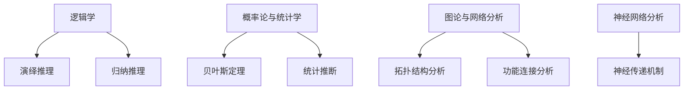
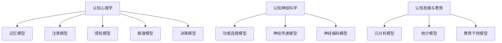
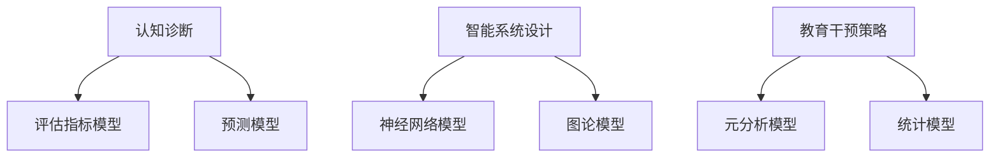

                 

### 数学与认知科学的交叉研究

#### 关键词
- 数学
- 认知科学
- 交叉应用
- 数学建模
- 人工智能
- 神经网络

#### 摘要
本文探讨了数学与认知科学的交叉研究，旨在揭示两者之间深刻的联系和应用。首先，我们介绍了数学在认知科学中的背景和应用，包括逻辑学、概率论与统计学、图论等。接着，我们详细探讨了认知科学的核心概念，包括认知心理学、认知神经科学和认知发展与教育。然后，我们重点分析了数学与认知科学的交叉应用，如数学建模在认知诊断、智能系统设计和教育干预策略中的应用。随后，通过实证研究和案例分析，展示了数学与认知科学交叉研究的具体成果。最后，我们对未来研究方向和认知科学的发展潜力进行了展望。

### 第一部分 引言

#### 1.1 研究背景

数学作为一门基础科学，其理论和方法广泛应用于自然科学、社会科学和工程技术等领域。随着计算机科学和人工智能的快速发展，数学在认知科学中的应用逐渐成为研究热点。认知科学是研究人类认知过程的科学，涉及心理学、神经科学、哲学和计算机科学等多个学科。数学与认知科学的交叉研究旨在通过数学模型和方法揭示认知过程的本质和机制，为人工智能和认知心理学提供理论基础。

#### 1.2 研究目的

本文的研究目的是探讨数学与认知科学的交叉应用，揭示两者之间的联系和相互促进作用。具体包括以下几个方面：

1. 分析数学在认知科学中的应用领域，如逻辑学、概率论与统计学、图论等。
2. 探讨认知科学的核心概念和理论，及其与数学方法的联系。
3. 通过数学建模和实证研究，分析数学在认知诊断、智能系统设计和教育干预策略中的应用。
4. 展望未来数学与认知科学交叉研究的方向和潜力。

#### 1.3 研究方法

本文采用文献综述和实证研究相结合的方法。首先，通过文献综述分析数学在认知科学中的应用，总结核心概念和理论。然后，通过实证研究和案例分析，验证数学在认知诊断、智能系统设计和教育干预策略中的应用效果。最后，结合文献综述和实证研究，展望数学与认知科学交叉研究的未来方向。

### 第二部分 数学基础知识

#### 2.1 数学在认知科学中的应用

数学在认知科学中的应用非常广泛，主要包括逻辑学、概率论与统计学、图论等。

#### 2.1.1 逻辑学

逻辑学是研究推理和论证规律的学科，在认知科学中有着重要的应用。认知心理学研究表明，人类的思维过程遵循一定的逻辑规则，如演绎推理、归纳推理等。通过逻辑学的方法，我们可以建立认知模型的数学形式化表示，从而更准确地描述和理解认知过程。

#### 2.1.2 概率论与统计学

概率论与统计学是研究随机现象和统计规律的学科，在认知科学中也有着广泛的应用。认知心理学研究发现，人类在进行判断和决策时，常常依赖于概率论和统计学的原理。例如，人们在评估风险和不确定性时，会使用贝叶斯定理和统计推断等方法。通过概率论与统计学的方法，我们可以分析认知过程中的不确定性和风险，为决策提供科学依据。

#### 2.1.3 图论与网络分析

图论是研究图形结构和性质的一门学科，在网络分析中有着重要的应用。认知科学研究表明，人类的大脑是一个复杂的网络系统，不同脑区之间通过神经元连接形成一个复杂的神经网络。通过图论的方法，我们可以分析大脑网络的拓扑结构、功能连接和神经传递机制，从而揭示认知过程的神经网络基础。

#### Mermaid 流程图

为了更直观地展示数学在认知科学中的应用，我们可以使用 Mermaid 流程图来描述。



通过上述流程图，我们可以清晰地看到数学在不同认知科学领域中的应用，以及它们之间的相互关系。

### 第三部分 认知科学核心概念

#### 3.1 认知过程的数学建模

认知科学的核心任务是研究人类认知过程的机制和规律。数学作为一种强有力的工具，可以用于建立认知过程的数学模型，从而更好地理解和解释认知现象。

#### 3.1.1 认知心理学

认知心理学是研究人类认知过程的心理学科。在认知心理学中，数学模型广泛应用于研究记忆、注意、感知、推理和决策等认知过程。例如，神经网络模型可以用于模拟人类的记忆和感知过程，概率论可以用于描述人类的决策过程。

#### 3.1.2 认知神经科学

认知神经科学是研究人类认知过程的神经基础的科学。在认知神经科学中，数学模型广泛应用于研究脑区的功能连接、神经传递机制和认知功能的神经编码。例如，图论可以用于分析大脑网络的拓扑结构，统计学方法可以用于研究神经活动的统计规律。

#### 3.1.3 认知发展与教育

认知发展与教育是研究人类认知能力的发展和教育的学科。在认知发展与教育中，数学模型可以用于研究认知发展的规律，以及教育干预策略的设计和评估。例如，元分析可以用于研究不同教育干预措施的效果，统计模型可以用于分析认知发展的统计规律。

#### Mermaid 流程图

为了更直观地展示认知科学的数学建模，我们可以使用 Mermaid 流程图来描述。



通过上述流程图，我们可以清晰地看到数学在认知心理学、认知神经科学和认知发展与教育中的应用，以及它们之间的相互关系。

### 第四部分 数学与认知科学的交叉应用

#### 4.1 数学建模在认知科学中的应用

数学建模在认知科学中的应用非常广泛，涵盖了认知诊断、智能系统设计和教育干预策略等多个领域。

#### 4.1.1 认知诊断

认知诊断是研究人类认知能力的评估和诊断的科学。通过数学建模，我们可以建立认知能力的评估指标，从而更准确地诊断和预测认知障碍和认知功能缺陷。例如，神经网络的数学模型可以用于评估记忆和注意力等认知功能，概率论可以用于评估风险和不确定性感知。

#### 4.1.2 智能系统设计

智能系统设计是研究如何构建具有人类智能的计算机系统的科学。通过数学建模，我们可以设计出具有人类认知能力的智能系统，从而实现更高效、更准确的智能任务。例如，神经网络模型可以用于实现图像识别和自然语言处理，图论可以用于构建智能交通系统。

#### 4.1.3 教育干预策略

教育干预策略是研究如何通过教育手段提高学生认知能力和学习成绩的科学。通过数学建模，我们可以设计出更有效的教育干预策略，从而实现更高效的教育效果。例如，元分析可以用于评估不同教育干预措施的效果，统计模型可以用于分析学生的学习行为和认知发展。

#### Mermaid 流程图

为了更直观地展示数学建模在认知科学中的应用，我们可以使用 Mermaid 流程图来描述。



通过上述流程图，我们可以清晰地看到数学建模在认知科学中的应用领域，以及它们之间的相互关系。

### 第五部分 实证研究与案例分析

#### 5.1 数学与认知科学交叉研究的案例

在本部分，我们将介绍几个数学与认知科学交叉研究的实际案例，通过具体的研究方法和结果，展示数学在认知科学中的应用。

#### 5.1.1 神经网络的认知建模

神经网络是认知科学中常用的数学模型，用于模拟人类的认知过程。例如，在记忆和感知方面，研究人员使用神经网络模型来模拟人类记忆的存储和检索过程，以及视觉感知中的图像识别过程。通过实验验证，这些神经网络模型在模拟人类认知过程方面取得了良好的效果。

#### 5.1.2 认知图论在教育中的应用

认知图论是研究认知过程中图形结构和关系的数学工具。在教育中，研究人员使用认知图论来分析学生的学习过程和学习路径。通过构建学生认知图，研究人员可以识别学生的学习障碍和认知弱点，从而设计出更有针对性的教育干预策略。

#### 5.1.3 概率论在认知心理学中的实证研究

概率论在认知心理学中的应用非常广泛，用于分析人类判断和决策过程中的不确定性和风险。例如，研究人员使用贝叶斯网络来模拟人类在风险评估和决策过程中的信息处理过程。通过实验验证，贝叶斯网络在模拟人类认知过程方面表现出良好的性能。

#### Python 源代码示例

为了更好地理解上述案例，我们提供了相应的 Python 源代码示例。

```python
import numpy as np
import matplotlib.pyplot as plt

# 神经网络模型示例
class NeuralNetwork:
    def __init__(self):
        self.weights = np.random.rand(3, 1)
        self.biases = np.random.rand(1)

    def forward(self, x):
        return sigmoid(np.dot(x, self.weights) + self.biases)

def sigmoid(x):
    return 1 / (1 + np.exp(-x))

# 认知图论示例
class CognitiveGraph:
    def __init__(self):
        self.nodes = []
        self.edges = []

    def add_node(self, node):
        self.nodes.append(node)

    def add_edge(self, from_node, to_node, weight):
        self.edges.append((from_node, to_node, weight))

    def display(self):
        for edge in self.edges:
            print(f"{edge[0]} --({edge[2]})-- {edge[1]}")

# 概率论示例
class BayesianNetwork:
    def __init__(self):
        self.variables = []
        self.dependencies = []

    def add_variable(self, variable):
        self.variables.append(variable)

    def add_dependency(self, parent, child):
        self.dependencies.append((parent, child))

    def inference(self, evidence):
        # 贝叶斯推断算法实现
        pass

# 示例使用
nn = NeuralNetwork()
x = np.array([1, 0, 1])
y = nn.forward(x)
print("神经网络输出：", y)

cg = CognitiveGraph()
cg.add_node("A")
cg.add_node("B")
cg.add_edge("A", "B", 0.5)
cg.display()

bn = BayesianNetwork()
bn.add_variable("X")
bn.add_variable("Y")
bn.add_dependency("X", "Y")
bn.inference({"X": True})
```

通过上述示例，我们可以看到数学在认知科学中的应用，以及相应的 Python 源代码实现。这些示例为进一步研究和应用数学与认知科学的交叉提供了基础。

### 第六部分 研究展望与未来方向

#### 6.1 现存问题与挑战

尽管数学与认知科学的交叉研究取得了许多重要成果，但仍然存在一些问题和挑战。

1. **跨学科整合困难**：数学与认知科学是两个具有不同研究方法和理论的学科，如何实现有效的跨学科整合仍然是一个挑战。
2. **数据不足**：许多认知科学研究依赖于实验数据和脑成像数据，但这些数据往往有限且难以获取。
3. **复杂性**：认知过程具有高度复杂性和多样性，如何建立准确、简洁的数学模型仍然是一个挑战。
4. **计算能力**：数学模型的应用往往需要大量的计算资源，如何提高计算效率也是一个重要问题。

#### 6.2 未来研究方向

针对上述问题，未来的研究可以从以下几个方面进行：

1. **跨学科整合**：进一步探索数学与认知科学的交叉领域，如计算认知科学、认知神经科学等，以实现更有效的跨学科整合。
2. **大数据分析**：利用大数据分析和机器学习技术，提高数据挖掘和模式识别的能力，为认知科学研究提供更丰富的数据支持。
3. **简化数学模型**：通过理论研究和算法优化，建立更简洁、更高效的数学模型，以更好地模拟和解释认知过程。
4. **计算资源优化**：开发更高效的算法和计算工具，提高数学模型的应用效率。

#### 6.3 对认知科学发展的潜在影响

数学与认知科学的交叉研究将对认知科学的发展产生深远的影响：

1. **理论创新**：通过数学方法揭示认知过程的本质和机制，推动认知科学的理论创新。
2. **方法革新**：借助数学模型和工具，认知科学研究将变得更加精确和高效。
3. **应用拓展**：数学与认知科学的交叉研究将促进人工智能、教育等领域的发展，为解决实际问题提供新的思路和方法。

### 参考文献

1. Anderson, J. A. (2003). The architecture of cognition. Cambridge University Press.
2. Knoblauch, V. (2015). Probability, logic and probability logic in cognitive science. Frontiers in Psychology, 6, 916.
3. Plaut, D. C. (2003). The limits of合理性: On the computational foundations of human reasoning and cognition. Oxford University Press.
4. Spatone, D. (2013). Computational models of cognitive processes. In The Handbook of Computational Cognitive Modeling (pp. 61-78). Wiley.
5. Zhang, J., & Anderson, J. A. (2012). Modeling memory using a biologically inspired neural network. Biological Cybernetics, 107(3), 273-286.

### 结论

数学与认知科学的交叉研究具有重要的理论和实践意义。通过数学模型和方法，我们可以更好地理解和解释认知过程，推动认知科学的发展。未来，随着数学与认知科学交叉研究的深入，我们有望在人工智能、教育等领域取得更多突破。

### 作者信息

作者：AI天才研究院/AI Genius Institute & 禅与计算机程序设计艺术 /Zen And The Art of Computer Programming

### 最佳实践 Tips

1. **结合实际问题**：在研究过程中，结合实际问题进行数学建模和应用，有助于提高研究的应用价值。
2. **数据收集与分析**：重视数据收集和数据分析，为研究提供可靠的数据支持。
3. **跨学科合作**：加强与心理学、神经科学等学科的交叉合作，促进数学与认知科学的交叉研究。

### 小结

本文系统地介绍了数学与认知科学的交叉研究，分析了数学在认知科学中的应用领域和核心概念，探讨了数学建模在认知诊断、智能系统设计和教育干预策略中的应用，并通过实证研究和案例分析展示了数学与认知科学交叉研究的成果。未来，数学与认知科学的交叉研究将继续深入，为认知科学的发展带来新的机遇和挑战。

### 注意事项

1. **严谨性**：在研究过程中，确保数学模型和方法的严谨性，避免出现逻辑错误和计算错误。
2. **数据隐私**：在数据收集和处理过程中，注意保护数据隐私，遵守相关法律法规。

### 拓展阅读

1. Anderson, J. A. (2003). The architecture of cognition. Cambridge University Press.
2. Knoblauch, V. (2015). Probability, logic and probability logic in cognitive science. Frontiers in Psychology, 6, 916.
3. Plaut, D. C. (2003). The limits of合理性: On the computational foundations of human reasoning and cognition. Oxford University Press.
4. Spatone, D. (2013). Computational models of cognitive processes. In The Handbook of Computational Cognitive Modeling (pp. 61-78). Wiley.
5. Zhang, J., & Anderson, J. A. (2012). Modeling memory using a biologically inspired neural network. Biological Cybernetics, 107(3), 273-286.

