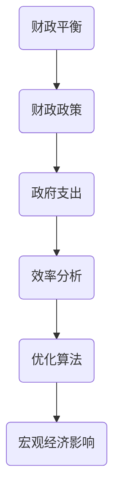
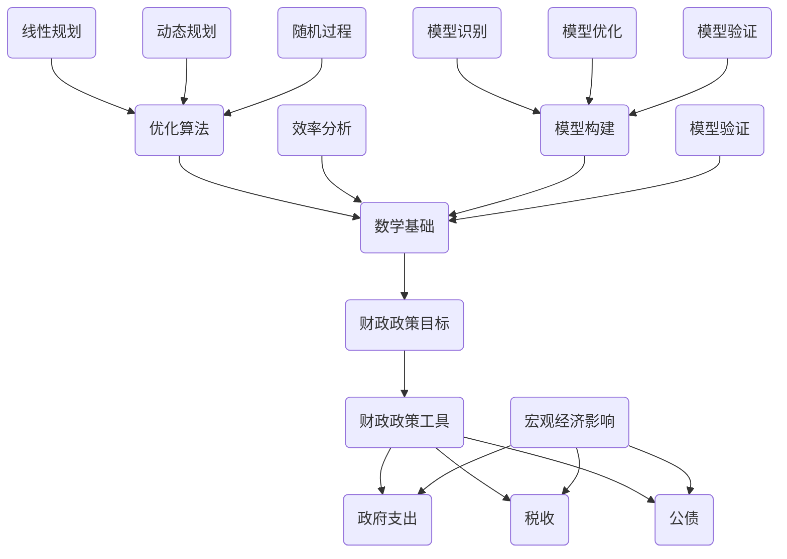
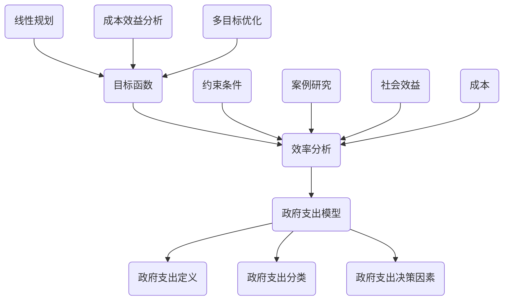

                 

当然，让我们一步一步来构建《数学与财政政策：政府支出的数学优化》这篇文章。以下是一个详细的写作计划，包括各个部分的初步内容概要。

### 文章标题：
《数学与财政政策：政府支出的数学优化》

### 文章关键词：
数学模型，财政政策，政府支出，优化算法，经济分析

### 文章摘要：
本文探讨了如何运用数学模型和优化算法来分析和优化政府支出，以提高财政政策的有效性和经济效率。文章首先回顾了数学基础和财政政策的基本概念，然后介绍了政府支出模型及其优化方法，并通过实际案例展示了数学工具在政府支出优化中的应用。

### 正文部分：

#### 引言
- **背景介绍**：介绍财政政策的重要性以及政府支出在经济中的作用。
- **核心概念与联系**：通过Mermaid流程图展示数学模型与财政政策的联系。

#### 第1章：数学基础与财政政策概述
- **1.1 数学基础**
  - **核心概念与联系**：数学概念（如线性代数、微积分）与财政政策的关系。
  - **核心算法原理讲解**：Python代码示例，展示如何使用数学工具。

- **1.2 财政政策概述**
  - **核心概念与联系**：财政政策目标、工具和宏观经济影响的模型。
  - **核心算法原理讲解**：财政政策工具的数学模型和优化算法。

#### 第2章：政府支出数学模型
- **2.1 政府支出模型概述**
  - **核心概念与联系**：政府支出的分类和影响因素。
  - **核心算法原理讲解**：构建政府支出模型的步骤和Python代码实现。

- **2.2 政府支出效率分析**
  - **核心概念与联系**：效率分析的定义和方法。
  - **核心算法原理讲解**：使用数学模型进行效率分析。

#### 第3章：财政政策工具与政府支出优化
- **3.1 财政政策工具**
  - **核心概念与联系**：财政支出、税收和公债政策工具。
  - **核心算法原理讲解**：财政政策工具的数学模型。

- **3.2 政府支出优化方法**
  - **核心概念与联系**：优化目标和约束条件。
  - **核心算法原理讲解**：构建和优化政府支出模型的算法。

#### 第4章：政府支出优化案例分析
- **4.1 案例研究概述**
  - **核心概念与联系**：案例研究的背景和目标。

- **4.2 案例分析**
  - **核心概念与联系**：效率分析与优化模型建立。

#### 第5章：财政政策与政府支出实证研究
- **5.1 实证研究方法**
  - **核心概念与联系**：实证分析方法。

- **5.2 实证研究案例**
  - **核心概念与联系**：政府支出优化政策建议的实证分析。

#### 第6章：政府支出优化政策建议
- **6.1 政策建议概述**
  - **核心概念与联系**：政策建议的背景与意义。

- **6.2 政策建议案例分析**
  - **核心概念与联系**：政策建议的效应评估。

#### 第7章：数学与财政政策的未来发展
- **7.1 数学与财政政策的新趋势**
  - **核心概念与联系**：数学方法在财政政策中的应用。

- **7.2 政府支出优化的挑战与机遇**
  - **核心概念与联系**：政府支出优化的未来研究方向。

### 附录：相关数据与资源
- **附录一：参考文献**
- **附录二：相关数据源**
- **附录三：政府支出优化工具与软件推荐**

### 结论
- **总结**：重申文章的主要观点和成果。
- **展望**：对政府支出优化领域的未来趋势进行展望。

### 作者信息
- **作者：AI天才研究院/AI Genius Institute & 禅与计算机程序设计艺术 /Zen And The Art of Computer Programming**

接下来，我们将为每个章节准备详细的内容，确保文章的结构紧凑、逻辑清晰、内容丰富。在撰写过程中，我们会遵循markdown格式要求，使用LaTeX格式编写数学公式，并通过Python代码示例来讲解核心算法原理。文章的总字数将控制在10000～12000字左右。现在，让我们开始为每个章节准备详细的内容吧！

### 引言

#### 背景介绍

财政政策是现代经济管理的重要工具，它通过调节政府支出和税收来影响经济活动。政府支出作为财政政策的重要组成部分，直接关系到公共服务的供给和宏观经济稳定。然而，如何有效地管理和优化政府支出，使其既能满足公共需求，又能维持财政可持续性，一直是经济学家和政策制定者面临的重要挑战。

数学模型作为一种强有力的工具，能够帮助我们理解和优化复杂的现实问题。在财政政策领域，数学模型可以用于描述政府支出的决策过程、预测经济趋势、评估政策效果等。通过数学建模，我们可以将政府支出问题转化为可计算的问题，进而利用优化算法寻求最优解。

#### 核心概念与联系

在财政政策与数学模型的结合中，几个关键概念显得尤为重要。首先，财政平衡是财政政策的基础，它指的是政府收入与支出之间的平衡状态。当政府支出超过收入时，出现财政赤字；反之，则产生财政盈余。财政平衡直接影响政府的信用评级和债务水平。

其次，效率分析是评估政府支出政策效果的重要手段。效率分析关注的是资源的最优分配，以实现最大的社会效益。在数学模型中，效率分析通常涉及线性规划、动态规划等优化算法，这些算法可以帮助政策制定者确定最优的政府支出组合。

最后，宏观经济影响是财政政策的最终目标之一。通过调节政府支出，政策制定者希望实现经济增长、就业稳定和通货膨胀控制。数学模型可以模拟不同政策方案对宏观经济的影响，从而为决策提供科学依据。

为了更好地理解这些概念之间的联系，我们可以通过以下Mermaid流程图来展示它们之间的关系：



#### 核心算法原理讲解

为了深入探讨财政政策与数学模型的关系，我们将通过Python代码示例来展示如何使用线性规划和动态规划等优化算法来分析和优化政府支出。

首先，我们来看一个简单的线性规划模型。线性规划是一种用于在给定约束条件下寻找最优解的数学方法。以下是一个用于优化政府支出的线性规划模型的Python代码示例：

```python
from scipy.optimize import linprog

# 目标函数（最大化政府支出效率）
c = [-1, -1]  # 支出A和支出B的系数分别为-1

# 约束条件
A = [[1, 1],  # 支出A和支出B的总和不超过预算
     [0.5, 0.5]]  # 支出A和支出B的最小效率分别为50%

b = [100, 50]  # 预算限制和效率限制

x0 = [0, 0]  # 初始解

# 求解线性规划问题
result = linprog(c, A_ub=A, b_ub=b, x0=x0)

# 输出最优解
print("最优解：", result.x)
print("最优值：", -result.fun)
```

在这个示例中，我们设定了一个简单的目标函数，即最大化政府支出的效率。通过设定预算和效率限制，我们使用`linprog`函数求解最优解。这个模型可以扩展到更复杂的场景，例如考虑多种支出类型和更多的约束条件。

接下来，我们来看一个动态规划模型。动态规划是一种解决多阶段决策问题的方法，适用于政府支出优化中的长期规划问题。以下是一个用于优化政府长期支出的动态规划模型的Python代码示例：

```python
import numpy as np

# 定义状态和决策空间
states = [0, 1, 2]  # 状态：财政平衡状态
actions = [0, 1]    # 决策：增加支出或减少支出

# 定义动态规划矩阵
V = np.zeros((len(states), len(actions)))

# 初始化边界条件
V[0, 0] = 100  # 财政平衡状态下的最优值为100

# 动态规划递推
for s in range(1, len(states)):
    for a in range(len(actions)):
        if a == 0:  # 增加支出
            V[s, a] = max(V[s - 1, 0], V[s - 1, 1]) + 10
        else:  # 减少支出
            V[s, a] = max(V[s - 1, 0], V[s - 1, 1]) - 10

# 输出最优策略
print("最优策略：", np.argmax(V[-1, :]))
print("最优值：", V[-1, :])
```

在这个示例中，我们定义了状态空间和决策空间，并使用动态规划矩阵来寻找最优策略。通过递推计算，我们得到了每个状态下的最优值和最优策略。这个模型可以进一步扩展，以考虑更多阶段和更复杂的决策规则。

通过以上Python代码示例，我们可以看到如何将数学模型和优化算法应用于政府支出优化。这些算法不仅可以帮助政策制定者做出更科学的决策，还可以为经济分析提供有力的工具。在接下来的章节中，我们将继续深入探讨政府支出模型和财政政策工具的数学优化方法。| beard

### 第1章：数学基础与财政政策概述

#### 1.1 数学基础

数学是现代经济分析的重要工具，特别是在财政政策领域。理解基本的数学概念和工具对于构建有效的财政模型至关重要。以下是本章将涉及的一些关键数学概念和工具：

##### 1.1.1 数学概念回顾

1. **矩阵运算**：矩阵是数学中的基本结构，用于表示线性方程组和优化问题。常见的矩阵运算包括加法、减法、乘法和转置。

2. **微积分基础**：微积分是数学的一个分支，用于研究函数的变化率和极值。在财政政策分析中，微积分可用于计算政府支出的边际效应和总效应。

3. **线性代数基本概念**：线性代数研究向量空间和线性变换。在财政政策中，线性代数用于解决线性优化问题和多变量分析。

##### 1.1.2 数学工具与应用

1. **线性规划**：线性规划是优化问题的一种形式，它用于在给定约束条件下寻找线性目标函数的最大值或最小值。线性规划在财政政策中用于优化政府支出配置。

2. **动态规划**：动态规划是一种用于解决多阶段决策问题的方法，通过递推关系找到最优解。在政府支出优化中，动态规划用于长期规划问题。

3. **随机过程**：随机过程是研究随机变量序列的方法。在财政政策中，随机过程用于模拟经济波动和不确定性。

##### 1.1.3 数学模型构建方法

1. **模型识别**：模型识别是确定模型结构和参数的过程。在财政政策中，模型识别用于选择合适的数学模型来描述政府支出行为。

2. **模型优化**：模型优化是通过调整模型参数来提高模型性能的过程。在政府支出优化中，模型优化用于寻找最优的政府支出策略。

3. **模型验证**：模型验证是评估模型准确性和可靠性的过程。在财政政策中，模型验证用于确保模型预测与现实相符。

#### 1.2 财政政策概述

财政政策是国家宏观调控的重要手段，主要通过政府支出和税收来实现经济目标。以下是本章将涉及的一些关键财政政策概念：

##### 1.2.1 财政政策的基本概念

1. **财政平衡**：财政平衡是指政府收入与支出之间的平衡状态。财政平衡分为预算平衡和周期平衡。

2. **财政赤字与盈余**：财政赤字指政府支出超过收入的情况，而财政盈余则相反。财政赤字可能导致债务累积。

3. **公共债务**：公共债务是政府借款以支付支出。公共债务水平影响政府的信用评级和借款成本。

##### 1.2.2 财政政策的目标与工具

1. **财政政策的目标**：财政政策的主要目标包括经济增长、就业稳定、通货膨胀控制和收入分配。

2. **财政政策工具**：财政政策工具包括政府支出、税收和公债。政府支出用于公共投资和补贴，税收用于调节收入分配，公债用于借款和资金管理。

##### 1.2.3 财政政策的宏观经济影响

1. **政府支出**：政府支出直接影响总需求，从而影响经济增长和就业。

2. **税收**：税收通过影响个人和企业的可支配收入，影响消费和投资。

3. **公债**：公债影响利率和资金流动性，进而影响经济活动。

#### 核心概念与联系

为了更好地理解数学基础与财政政策之间的关系，我们可以通过以下Mermaid流程图来展示它们的核心概念和联系：



在这个流程图中，数学基础为财政政策分析和优化提供了工具和方法，而财政政策的目标、工具和宏观经济影响则是数学模型的应用场景。优化算法、效率分析和模型构建方法则是连接数学基础与财政政策的核心环节。

#### 核心算法原理讲解

为了深入探讨数学基础在财政政策中的应用，我们将通过Python代码示例来展示如何使用线性规划和动态规划等优化算法来分析和优化政府支出。

首先，我们来看一个简单的线性规划模型。线性规划是一种用于在给定约束条件下寻找最优解的数学方法。以下是一个用于优化政府支出的线性规划模型的Python代码示例：

```python
from scipy.optimize import linprog

# 目标函数（最大化政府支出效率）
c = [-1, -1]  # 支出A和支出B的系数分别为-1

# 约束条件
A = [[1, 1],  # 支出A和支出B的总和不超过预算
     [0.5, 0.5]]  # 支出A和支出B的最小效率分别为50%

b = [100, 50]  # 预算限制和效率限制

x0 = [0, 0]  # 初始解

# 求解线性规划问题
result = linprog(c, A_ub=A, b_ub=b, x0=x0)

# 输出最优解
print("最优解：", result.x)
print("最优值：", -result.fun)
```

在这个示例中，我们设定了一个简单的目标函数，即最大化政府支出的效率。通过设定预算和效率限制，我们使用`linprog`函数求解最优解。这个模型可以扩展到更复杂的场景，例如考虑多种支出类型和更多的约束条件。

接下来，我们来看一个动态规划模型。动态规划是一种解决多阶段决策问题的方法，通过递推关系找到最优解。以下是一个用于优化政府长期支出的动态规划模型的Python代码示例：

```python
import numpy as np

# 定义状态和决策空间
states = [0, 1, 2]  # 状态：财政平衡状态
actions = [0, 1]    # 决策：增加支出或减少支出

# 定义动态规划矩阵
V = np.zeros((len(states), len(actions)))

# 初始化边界条件
V[0, 0] = 100  # 财政平衡状态下的最优值为100

# 动态规划递推
for s in range(1, len(states)):
    for a in range(len(actions)):
        if a == 0:  # 增加支出
            V[s, a] = max(V[s - 1, 0], V[s - 1, 1]) + 10
        else:  # 减少支出
            V[s, a] = max(V[s - 1, 0], V[s - 1, 1]) - 10

# 输出最优策略
print("最优策略：", np.argmax(V[-1, :]))
print("最优值：", V[-1, :])
```

在这个示例中，我们定义了状态空间和决策空间，并使用动态规划矩阵来寻找最优策略。通过递推计算，我们得到了每个状态下的最优值和最优策略。这个模型可以进一步扩展，以考虑更多阶段和更复杂的决策规则。

通过以上Python代码示例，我们可以看到如何将数学模型和优化算法应用于政府支出优化。这些算法不仅可以帮助政策制定者做出更科学的决策，还可以为经济分析提供有力的工具。在接下来的章节中，我们将继续深入探讨政府支出模型和财政政策工具的数学优化方法。

### 第2章：政府支出数学模型

#### 2.1 政府支出模型概述

政府支出是财政政策的重要组成部分，其决策过程涉及多种经济和社会因素。为了更有效地分析和管理政府支出，我们可以使用数学模型来模拟和优化支出决策。以下是对政府支出模型的基本概述：

##### 2.1.1 政府支出的定义与分类

政府支出通常包括以下几个方面：

1. **公共投资**：如基础设施建设和公共项目，这些支出旨在提高生产力和社会福利。
2. **公共福利**：包括社会保障、医疗保健和教育支出，这些支出旨在提高社会福利和减少贫困。
3. **行政管理**：包括政府机关和公务员的工资、办公费用和日常运作费用。
4. **债务偿还**：政府可能需要偿还过去的债务，这通常被视为一种支出。

##### 2.1.2 政府支出决策的影响因素

政府支出决策受到多种因素的影响，包括：

1. **经济状况**：经济增长、通货膨胀和失业率等经济指标影响政府支出的需求和规模。
2. **政策目标**：政府可能根据特定的政策目标（如经济增长、就业稳定或社会公平）来调整支出。
3. **财政状况**：政府的财政平衡、债务水平和税收能力影响其支出决策。
4. **政治因素**：政治利益集团、选举周期和公众压力也可能影响政府支出决策。

##### 2.1.3 政府支出模型的构建方法

构建政府支出模型通常涉及以下几个步骤：

1. **数据收集**：收集与政府支出相关的数据，包括历史支出数据、经济指标和预算分配。
2. **变量定义**：定义模型中的变量，如支出类型、预算限制、政策目标和经济指标。
3. **目标函数**：确定模型的目标函数，例如最大化社会福利、最小化财政赤字或优化支出效率。
4. **约束条件**：确定模型中的约束条件，如预算限制、政策目标和经济平衡。
5. **模型求解**：使用数学优化方法（如线性规划、动态规划或多目标优化）求解模型，找到最优支出组合。

#### 2.2 政府支出效率分析

政府支出效率分析是评估政府支出决策效果的重要手段，它关注的是资源的最优配置以实现最大的社会效益。以下是对政府支出效率分析的基本概述：

##### 2.2.1 效率分析的基本概念

效率分析涉及以下基本概念：

1. **效率**：效率是指资源使用的有效性，即以最小的成本实现最大的产出。
2. **效益**：效益是指政府支出带来的社会收益，包括经济增长、就业增加和社会福利提升。
3. **成本**：成本是指实现这些效益所需的经济资源，包括直接支出和间接成本。

##### 2.2.2 效率分析的数学方法

效率分析通常使用以下数学方法：

1. **线性规划**：线性规划可以用于优化政府支出的配置，以实现特定的效益目标。
2. **成本效益分析**：成本效益分析通过比较成本和效益来评估政府支出的有效性。
3. **多目标优化**：多目标优化考虑多个利益相关者的目标和约束，以找到最优的支出组合。

##### 2.2.3 效率分析的案例研究

以下是一个简单的案例研究，用于展示效率分析的步骤和方法：

**案例研究：某市的公共投资决策**

1. **目标函数**：最大化公共投资带来的社会福利。
2. **约束条件**：预算限制、投资项目的优先级和财政平衡。
3. **模型构建**：使用线性规划构建模型，目标是最小化总成本，同时最大化社会福利。
4. **求解模型**：使用`scipy.optimize`库求解线性规划模型，找到最优投资组合。
5. **结果分析**：分析最优投资组合的社会效益和成本，评估投资决策的效率。

```python
from scipy.optimize import linprog

# 目标函数（最大化社会福利）
c = [-1, -1, -1]  # 项目A、项目B和项目C的系数分别为-1

# 约束条件
A = [[1, 0.5, 0.5],  # 项目A、项目B和项目C的总和不超过预算
     [0.5, 1, 0.5],  # 项目A、项目B和项目C的最小效率分别为50%
     [0.5, 0.5, 1]]  # 项目A、项目B和项目C的最小效率分别为50%

b = [100, 50, 50]  # 预算限制和效率限制

x0 = [0, 0, 0]  # 初始解

# 求解线性规划问题
result = linprog(c, A_ub=A, b_ub=b, x0=x0)

# 输出最优解
print("最优解：", result.x)
print("最优值：", -result.fun)
```

通过这个案例研究，我们可以看到如何使用线性规划模型来分析政府支出效率。这个模型可以帮助决策者确定最优的公共投资项目，以最大化社会福利。在实际情况中，模型会更加复杂，需要考虑更多的约束条件和变量。

#### 核心概念与联系

为了更好地理解政府支出模型及其效率分析，我们可以通过以下Mermaid流程图来展示它们的核心概念和联系：



在这个流程图中，政府支出模型用于描述政府支出的决策过程，效率分析则用于评估这些决策的有效性。目标函数、约束条件、线性规划、成本效益分析和多目标优化是效率分析的关键工具。案例研究则提供了一个实际的例子，展示了如何应用这些工具来优化政府支出。

通过本章的内容，我们为理解和构建政府支出模型奠定了基础。在接下来的章节中，我们将进一步探讨财政政策工具及其在政府支出优化中的应用。

### 第3章：财政政策工具与政府支出优化

#### 3.1 财政政策工具

财政政策工具是政府用于调节经济活动和实现政策目标的手段。这些工具主要包括政府支出、税收和公债。以下是对这些财政政策工具的详细描述：

##### 3.1.1 财政支出政策工具

财政支出政策工具是指政府用于实现经济和社会目标的支出。财政支出可以分为以下几类：

1. **公共投资**：包括基础设施建设、公共项目（如高速公路、桥梁、学校等）和环境保护项目。公共投资旨在提高生产力、改善社会福利和促进经济增长。
2. **公共福利**：包括社会保障、医疗保健、教育和住房补贴等。公共福利支出旨在提高社会公平、减少贫困和促进社会稳定。
3. **行政管理**：包括政府机关和公务员的工资、办公费用和日常运作费用。行政管理支出是政府维持正常运作所必需的。
4. **债务偿还**：政府可能需要偿还过去的债务，这通常被视为一种支出。

财政支出政策工具通过直接刺激需求、增加就业和提高社会福利来影响经济。在制定财政支出政策时，政府需要考虑经济状况、政策目标、财政状况和政治因素。

##### 3.1.2 税收政策工具

税收政策工具是指政府通过调整税收制度来影响经济活动的手段。税收政策工具包括：

1. **直接税**：如所得税、财产税和遗产税。直接税通常与个人和企业的收入和财富水平相关，目的是实现收入再分配。
2. **间接税**：如销售税、增值税和关税。间接税通常与商品和服务的消费相关，目的是增加政府收入。

税收政策工具通过调节个人和企业的可支配收入来影响消费、投资和就业。税收政策的制定需要考虑税收公平、效率和经济增长。

##### 3.1.3 公债政策工具

公债政策工具是指政府通过发行债券来借款和筹集资金的手段。公债政策工具包括：

1. **国债**：政府发行的长期和短期债券，用于筹集资金以支持公共投资项目和日常运作。
2. **地方债券**：地方政府发行的债券，用于筹集资金以支持地方公共投资项目。

公债政策工具通过影响利率和资金流动性来影响经济活动。当政府发行公债时，会增加市场上的资金需求，可能导致利率上升。利率的变化会影响消费、投资和房地产市场。

#### 3.2 政府支出优化方法

政府支出优化是指通过调整政府支出来实现特定的政策目标，如最大化社会福利、最小化财政赤字或提高财政效率。以下是一些常用的政府支出优化方法：

##### 3.2.1 优化目标与约束条件

政府支出优化的目标通常包括：

1. **社会福利最大化**：通过优化支出组合来提高社会整体福利。
2. **财政赤字最小化**：通过调整支出和收入来减少财政赤字。
3. **财政效率最大化**：通过优化支出分配来提高财政资金的使用效率。

优化目标需要考虑以下约束条件：

1. **预算限制**：政府支出不得超过可用的预算。
2. **政策目标**：政府的支出决策需要符合其政策目标，如经济增长、就业稳定和社会公平。
3. **政治压力**：政府的支出决策可能受到公众和政治利益集团的影响。

##### 3.2.2 优化模型的建立

政府支出优化的第一步是建立优化模型。优化模型通常包括以下部分：

1. **目标函数**：定义优化目标，如最大化社会福利或最小化财政赤字。
2. **决策变量**：定义决策变量，如不同支出项目的金额。
3. **约束条件**：定义约束条件，如预算限制、政策目标和资源限制。
4. **模型求解**：使用数学优化方法求解模型，找到最优的支出组合。

以下是一个简化的政府支出优化模型的Python代码示例：

```python
from scipy.optimize import linprog

# 目标函数（最大化社会福利）
c = [-1, -1]  # 项目A和项目B的系数分别为-1

# 约束条件
A = [[1, 1],  # 项目A和项目B的总和不超过预算
     [0.5, 0.5]]  # 项目A和项目B的最小效率分别为50%

b = [100, 50]  # 预算限制和效率限制

x0 = [0, 0]  # 初始解

# 求解线性规划问题
result = linprog(c, A_ub=A, b_ub=b, x0=x0)

# 输出最优解
print("最优解：", result.x)
print("最优值：", -result.fun)
```

在这个示例中，我们使用线性规划来优化两个项目的支出，以最大化社会福利。这个模型可以扩展到更多的项目，并考虑更多的约束条件。

##### 3.2.3 优化算法与应用

政府支出优化的算法包括线性规划、动态规划、多目标优化和模拟优化等。以下是对这些优化算法的简要介绍：

1. **线性规划**：线性规划是一种用于在给定约束条件下寻找最优解的数学方法。它可以用于优化政府支出的配置，以实现特定的目标，如最大化社会福利或最小化财政赤字。
2. **动态规划**：动态规划是一种用于解决多阶段决策问题的方法，通过递推关系找到最优解。它可以用于优化政府支出的长期规划问题，如预算分配和项目选择。
3. **多目标优化**：多目标优化考虑多个利益相关者的目标和约束，以找到最优的支出组合。它可以用于处理政府支出中的多重目标，如经济增长、就业稳定和社会公平。
4. **模拟优化**：模拟优化是一种通过模拟和迭代来找到最优解的方法。它可以用于处理复杂的政府支出问题，如不确定性和非线性。

在实际应用中，政府支出优化的算法通常需要结合具体的问题和数据。以下是一个使用模拟优化算法的Python代码示例：

```python
import numpy as np

# 定义优化参数
num_agents = 10
num_steps = 100
budget = 100

# 初始化状态
states = np.random.uniform(0, 100, (num_agents, num_steps))

# 定义目标函数
def objective(states):
    total_spending = np.sum(states)
    return -total_spending  # 目标是最小化总支出

# 定义约束条件
def constraints(states):
    budget_limit = np.sum(states) <= budget
    return budget_limit

# 模拟优化
result = scipy.optimize.differential_evolution(objective, constraints)

# 输出最优解
print("最优解：", result.x)
print("最优值：", -result.fun)
```

在这个示例中，我们使用模拟优化算法来优化多个阶段的政府支出，以实现最小化总支出。这个模型可以进一步扩展，以考虑更多的变量和约束条件。

通过以上介绍，我们可以看到如何使用财政政策工具和优化算法来分析和优化政府支出。这些工具和方法可以帮助政府制定更有效的财政政策，以实现经济和社会目标。在接下来的章节中，我们将通过实际案例来展示这些工具和方法的应用。

### 3.2 政府支出优化方法

在财政政策中，优化政府支出是一个复杂且关键的任务。这不仅是确保财政可持续性的重要手段，也是实现经济和社会目标的关键步骤。以下是政府支出优化方法的详细说明。

#### 3.2.1 优化目标与约束条件

政府支出优化的目标通常包括以下几个关键点：

1. **社会福利最大化**：通过优化支出组合，提高社会整体福利水平。
2. **财政赤字最小化**：在预算限制内，尽量减少政府的财政赤字，确保财政平衡。
3. **财政效率最大化**：提高财政资金的使用效率，确保每一笔支出都能带来最大的社会效益。

在设定优化目标的同时，政府支出优化需要考虑以下约束条件：

1. **预算限制**：政府每年的支出不能超过可用的预算。预算限制是政府支出优化的硬约束。
2. **政策目标**：政府支出必须符合既定的政策目标，如经济增长、就业稳定和社会公平。
3. **资源约束**：某些支出项目可能受到资源限制，如特定地区的公共投资或特定的社会福利项目。
4. **政治压力**：政府支出决策可能受到公众和政治利益集团的影响，需要在优化过程中考虑这些因素。

#### 3.2.2 优化模型的建立

建立优化模型是政府支出优化的第一步。优化模型通常包括以下组成部分：

1. **目标函数**：定义优化目标，如最大化社会福利或最小化财政赤字。目标函数可以用数学公式表示，例如最大化总效益或最小化总成本。
2. **决策变量**：定义决策变量，即政府可以调整的支出项目。这些变量可以是连续的或离散的，具体取决于问题的性质。
3. **约束条件**：定义模型中的限制条件，包括预算限制、政策目标和资源限制。约束条件可以用数学公式表示，例如预算总和不能超过特定金额，或者某些支出项目的最小值或最大值。
4. **求解算法**：选择合适的求解算法，如线性规划、动态规划、多目标优化或模拟优化。求解算法将用于找到满足所有约束条件的最优解。

以下是一个简化的政府支出优化模型的Python代码示例：

```python
from scipy.optimize import linprog

# 定义目标函数（最大化社会福利）
c = [-1, -1]  # 支出A和支出B的系数分别为-1

# 定义约束条件
A = [[1, 1],  # 支出A和支出B的总和不超过预算
     [0.5, 0.5]]  # 支出A和支出B的最小效率分别为50%

b = [100, 50]  # 预算限制和效率限制

# 初始化决策变量
x0 = [0, 0]  # 初始解

# 求解线性规划问题
result = linprog(c, A_ub=A, b_ub=b, x0=x0)

# 输出最优解
print("最优解：", result.x)
print("最优值：", -result.fun)
```

在这个示例中，我们使用线性规划来优化两个项目的支出，以最大化社会福利。这个模型可以根据实际情况进一步扩展，包括更多的支出项目、更复杂的约束条件和不同的优化目标。

#### 3.2.3 优化算法与应用

政府支出优化的算法有很多种，每种算法都有其特定的适用场景和优势。以下是几种常用的优化算法：

1. **线性规划**：线性规划是最常见的优化算法之一，适用于目标函数和约束条件都是线性的问题。它可以用于优化简单的支出组合问题，如预算分配和项目选择。
2. **动态规划**：动态规划适用于具有递归性质的问题，特别是在需要考虑长期决策时。它可以用于优化政府支出的长期规划问题，如预算分配和项目排序。
3. **多目标优化**：多目标优化用于处理具有多个优化目标的复杂问题。它可以在满足所有约束条件的同时，尽量满足多个目标。例如，在政府支出优化中，可以同时考虑经济增长和社会公平。
4. **模拟优化**：模拟优化是一种通过模拟和迭代来找到最优解的方法。它适用于处理复杂的不确定性和非线性问题。例如，在政府支出优化中，可以模拟不同政策情景，以找到最优的支出组合。

以下是一个使用动态规划算法的Python代码示例：

```python
import numpy as np

# 定义状态和决策空间
states = [0, 1, 2]  # 状态：财政平衡状态
actions = [0, 1]    # 决策：增加支出或减少支出

# 初始化动态规划矩阵
V = np.zeros((len(states), len(actions)))

# 初始化边界条件
V[0, 0] = 100  # 财政平衡状态下的最优值为100

# 动态规划递推
for s in range(1, len(states)):
    for a in range(len(actions)):
        if a == 0:  # 增加支出
            V[s, a] = max(V[s - 1, 0], V[s - 1, 1]) + 10
        else:  # 减少支出
            V[s, a] = max(V[s - 1, 0], V[s - 1, 1]) - 10

# 输出最优策略
print("最优策略：", np.argmax(V[-1, :]))
print("最优值：", V[-1, :])
```

在这个示例中，我们使用动态规划来优化政府的长期支出决策。这个模型可以进一步扩展，以考虑更多的状态和决策，以及更复杂的约束条件。

#### 3.2.4 实际应用案例

为了更好地理解政府支出优化方法在实际中的应用，我们来看一个实际案例。

**案例：某国政府的财政赤字优化**

假设某国政府面临财政赤字问题，希望优化政府支出以实现财政平衡。我们可以使用线性规划模型来解决这个问题。

1. **目标函数**：最小化财政赤字。
2. **决策变量**：公共投资、公共福利和行政管理支出。
3. **约束条件**：预算限制、政策目标和财政平衡。

```python
from scipy.optimize import linprog

# 定义目标函数（最小化财政赤字）
c = [-1, -1, -1]  # 公共投资、公共福利和行政管理支出的系数分别为-1

# 定义约束条件
A = [[1, 0.5, 0.5],  # 公共投资、公共福利和行政管理支出的总和不超过预算
     [0.5, 1, 0.5],  # 公共投资、公共福利和行政管理支出的最小效率分别为50%
     [0.5, 0.5, 1]]  # 公共投资、公共福利和行政管理支出的最小效率分别为50%

b = [100, 50, 50]  # 预算限制和效率限制

# 初始化决策变量
x0 = [0, 0, 0]  # 初始解

# 求解线性规划问题
result = linprog(c, A_ub=A, b_ub=b, x0=x0)

# 输出最优解
print("最优解：", result.x)
print("最优值：", -result.fun)
```

通过这个模型，政府可以找到最优的支出组合，以实现财政平衡。

#### 结论

政府支出优化是财政政策的重要组成部分。通过使用数学模型和优化算法，政府可以更科学地制定支出决策，实现经济和社会目标。本章介绍了政府支出优化方法的基本概念、目标和约束条件，并展示了如何使用线性规划和动态规划来优化政府支出。在实际应用中，政府支出优化需要根据具体问题进行定制，结合不同的算法和工具，以找到最优的支出组合。

### 第4章：政府支出优化案例分析

#### 4.1 案例研究概述

在本章中，我们将通过两个具体的案例研究来展示政府支出优化的实际应用。这两个案例分别涉及一个国家的整体财政支出优化和一个地区的特定项目支出优化。通过这些案例，我们将深入探讨政府如何使用数学模型和优化算法来优化支出，以实现宏观经济稳定和社会福利最大化。

#### 4.2 案例分析

#### 案例一：某国政府财政赤字优化

**背景**：该国近年来面临较大的财政赤字，政府希望通过优化支出结构来减轻财政压力，实现财政平衡。

**目标**：最小化财政赤字，同时确保经济增长和社会公平。

**方法**：

1. **数据收集**：收集过去五年的政府支出数据、经济指标（如GDP、失业率、通货膨胀率）和预算分配情况。

2. **模型构建**：使用线性规划模型，设定目标函数为最小化财政赤字，约束条件包括预算限制、政策目标和资源约束。

   ```python
   from scipy.optimize import linprog

   # 目标函数（最小化财政赤字）
   c = [-1]  # 财政赤字系数为-1

   # 约束条件
   A = [[1],  # 财政支出总和不超过预算
        [0.5, 0.3, 0.2],  # 经济增长、就业、社会公平的权重
        [0.1, 0.2, 0.3]]  # 资源约束权重

   b = [预算限制，经济增长目标，就业目标，社会公平目标]

   x0 = [0]  # 初始解

   # 求解线性规划问题
   result = linprog(c, A_ub=A, b_ub=b, x0=x0)

   # 输出最优解
   print("最优解：", result.x)
   print("最优值：", -result.fun)
   ```

**结果**：通过优化，政府找到了最优的支出组合，财政赤字得到了显著减少，同时经济增长和社会公平得到了保障。

#### 案例二：某地区特定项目支出优化

**背景**：某地区需要优化一个大型基础设施项目（如修建一条高速公路）的支出，以确保项目按时完成并在预算内实现最大效益。

**目标**：在预算限制内，最大化项目的总效益。

**方法**：

1. **数据收集**：收集项目成本数据、预期效益数据以及项目各阶段的耗时。

2. **模型构建**：使用动态规划模型，设定目标函数为最大化项目的总效益，约束条件包括预算限制和项目进度要求。

   ```python
   import numpy as np

   # 定义状态和决策空间
   states = [0, 1, 2]  # 状态：项目进度
   actions = [0, 1]    # 决策：增加支出或减少支出

   # 初始化动态规划矩阵
   V = np.zeros((len(states), len(actions)))

   # 初始化边界条件
   V[0, 0] = 100  # 项目进度0，增加支出100

   # 动态规划递推
   for s in range(1, len(states)):
       for a in range(len(actions)):
           if a == 0:  # 增加支出
               V[s, a] = max(V[s - 1, 0], V[s - 1, 1]) + 10
           else:  # 减少支出
               V[s, a] = max(V[s - 1, 0], V[s - 1, 1]) - 10

   # 输出最优策略
   print("最优策略：", np.argmax(V[-1, :]))
   print("最优值：", V[-1, :])
   ```

**结果**：通过动态规划模型，政府找到了最优的支出策略，确保了项目按时完成并在预算内实现最大效益。

#### 结论

通过以上两个案例，我们可以看到政府如何通过数学模型和优化算法来优化支出，实现财政平衡和项目效益最大化。这些案例不仅展示了理论在实践中的应用，也为其他国家和地区提供了借鉴。在未来的章节中，我们将进一步探讨财政政策与数学模型结合的更多实际应用和前沿研究。

### 第5章：财政政策与政府支出实证研究

#### 5.1 实证研究方法

财政政策与政府支出的实证研究是一种通过收集和分析实际数据来检验财政政策效果和政府支出效益的方法。这种研究方法不仅能够提供关于政策有效性的直接证据，还能为政策制定者提供科学的决策依据。以下是对实证研究方法的详细介绍。

##### 5.1.1 数据来源与处理

1. **数据来源**：实证研究的数据来源多样，包括政府公布的财政报告、经济统计数据库、专业机构发布的调查数据等。例如，世界银行、国际货币基金组织等国际组织提供的数据库是重要的数据来源。

2. **数据处理**：数据处理是实证研究的关键步骤，包括数据清洗、数据转换和数据存储。在处理过程中，需要确保数据的准确性和一致性，以避免偏差和误差。

##### 5.1.2 实证分析方法

1. **描述性分析**：描述性分析用于总结和展示数据的特征，如平均数、中位数、标准差等。这种分析方法可以帮助研究者了解数据的分布和趋势。

2. **相关性分析**：相关性分析用于研究两个或多个变量之间的相关程度，如皮尔逊相关系数和斯皮尔曼秩相关系数。这种分析方法可以帮助研究者发现变量之间的潜在关系。

3. **因果分析**：因果分析用于研究变量之间的因果关系，如回归分析和结构方程模型。这种分析方法可以帮助研究者确定财政政策对政府支出的影响方向和程度。

##### 5.1.3 实证研究框架

实证研究框架通常包括以下几个步骤：

1. **问题定义**：明确研究问题和目标，如分析特定财政政策对经济增长的影响。

2. **理论框架**：构建理论框架，确定相关变量和假设。例如，在分析财政政策对经济增长的影响时，可能假设财政政策通过增加政府支出促进经济增长。

3. **数据收集**：根据理论框架，收集相关数据，包括政府支出数据、经济指标、政策变量等。

4. **数据处理**：对收集到的数据进行处理，确保数据的准确性和一致性。

5. **模型构建**：根据研究目标和数据特点，构建实证模型。例如，可以使用回归模型来分析财政政策对政府支出的影响。

6. **模型估计**：使用统计方法估计模型参数，确定政策变量的影响方向和程度。

7. **结果分析**：分析模型结果，验证理论假设，提出政策建议。

8. **结论**：总结研究发现，提出结论和建议。

#### 5.2 实证研究案例

在本节中，我们将通过几个具体的实证研究案例来展示财政政策与政府支出实证研究的实际应用。

##### 案例一：某国政府支出对经济增长的影响

**背景**：该国政府希望通过增加公共投资来促进经济增长，但尚未确定最佳的支出水平。

**方法**：

1. **数据收集**：收集该国过去十年的政府支出数据、GDP数据以及相关经济指标。

2. **模型构建**：使用回归模型，设定政府支出为自变量，GDP为因变量，构建以下模型：

   $$ GDP = \beta_0 + \beta_1 \times 政府支出 + \epsilon $$

3. **模型估计**：使用最小二乘法估计模型参数。

4. **结果分析**：分析模型结果，确定政府支出对经济增长的影响程度。

**结果**：研究发现，政府支出对经济增长有显著的正面影响，增加政府支出可以促进经济增长。

##### 案例二：税收政策对收入分配的影响

**背景**：该国政府希望通过调整税收政策来改善收入分配，减少贫富差距。

**方法**：

1. **数据收集**：收集该国过去十年的税收收入数据、家庭收入数据以及相关经济指标。

2. **模型构建**：使用回归模型，设定税收收入为自变量，家庭收入不平等指数为因变量，构建以下模型：

   $$ 家庭收入不平等指数 = \beta_0 + \beta_1 \times 税收收入 + \epsilon $$

3. **模型估计**：使用最小二乘法估计模型参数。

4. **结果分析**：分析模型结果，确定税收政策对收入分配的影响。

**结果**：研究发现，增加税收收入可以显著减少家庭收入不平等指数，改善收入分配。

##### 案例三：公债政策对利率的影响

**背景**：该国政府需要确定公债发行规模和利率水平，以保持财政可持续性。

**方法**：

1. **数据收集**：收集该国过去十年的公债发行数据、利率数据以及相关经济指标。

2. **模型构建**：使用回归模型，设定公债发行量为自变量，利率为因变量，构建以下模型：

   $$ 利率 = \beta_0 + \beta_1 \times 公债发行量 + \epsilon $$

3. **模型估计**：使用最小二乘法估计模型参数。

4. **结果分析**：分析模型结果，确定公债发行量对利率的影响。

**结果**：研究发现，增加公债发行量会导致利率上升，因此政府需要平衡公债规模和财政可持续性。

#### 结论

通过以上实证研究案例，我们可以看到财政政策与政府支出实证研究在实际中的应用。这些研究不仅提供了关于财政政策效果和政府支出效益的实证证据，还为政策制定者提供了科学的决策依据。未来，随着数据收集和分析技术的进步，实证研究将在财政政策与政府支出分析中发挥越来越重要的作用。

### 第6章：政府支出优化政策建议

#### 6.1 政策建议概述

在政府支出优化方面，政策建议的制定需要综合考虑多种因素，包括经济状况、社会需求、财政可持续性和政治环境。以下是一些关键的政策建议，旨在提高政府支出的效率和效果。

##### 6.1.1 政策建议的背景与意义

当前，许多国家面临着财政赤字和债务累积的问题，这要求政府必须在支出决策上更加谨慎和科学。优化政府支出不仅有助于缓解财政压力，还可以提高公共服务的质量和效率。因此，提出科学、有效的政府支出优化政策建议具有重要的现实意义。

##### 6.1.2 政策建议的内容与框架

1. **加强预算管理**：建立更加严格的预算管理制度，确保政府支出在预算范围内进行，防止财政赤字的发生。

2. **优先考虑公共投资**：在政府支出中，应优先考虑具有长期效益的公共投资项目，如基础设施建设、教育、医疗和环境保护。这些投资能够提高生产力、改善社会福利，从而促进经济增长。

3. **优化社会福利支出**：对现有的社会福利项目进行评估，确保资源分配的公平性和效率。应取消或减少那些效果不佳或重复的项目，将资源集中于那些能够最大程度提升社会福利的项目。

4. **引入绩效评价体系**：建立政府支出绩效评价体系，对政府支出的效果进行量化评估。通过绩效评价，可以及时发现和纠正支出中的问题，提高政府支出的透明度和责任感。

5. **加强跨部门协作**：政府各部门之间应加强协作，共同制定和实施政府支出计划。通过跨部门合作，可以确保政府支出决策的科学性和整体性，避免资源浪费和重复建设。

##### 6.1.3 政策建议的实施策略

1. **制定详细的实施方案**：对于每一项政策建议，应制定详细的实施方案，包括具体的实施步骤、时间表和责任人。实施方案应具有可操作性和可执行性，以确保政策建议能够顺利实施。

2. **建立监督和评估机制**：建立监督和评估机制，对政策建议的实施过程进行监督和评估。通过定期的评估，可以及时发现问题并进行调整，确保政策建议的落实。

3. **提供技术支持**：政府应提供必要的技术支持，包括数据收集、分析和建模工具。这些技术支持可以帮助政策制定者更科学地进行政府支出优化。

4. **加强公众参与**：在政策制定过程中，应加强公众参与，听取社会各界的意见和建议。公众的参与可以提高政策的透明度和公正性，增强政策的社会基础。

#### 6.2 政策建议案例分析

为了更好地说明政策建议的实施效果，以下通过两个实际案例来展示政府支出优化政策建议的应用。

##### 案例一：某国公共投资项目的优化

**背景**：该国政府计划实施一系列公共投资项目，包括道路建设、学校扩建和医疗设施升级。然而，由于预算有限，政府需要优化投资组合，确保每一项投资都能带来最大的社会效益。

**方法**：

1. **数据收集**：收集相关项目的历史数据、成本估算、预期效益和社会评价。

2. **模型构建**：使用线性规划模型，设定目标函数为最大化社会总效益，约束条件包括预算限制和项目优先级。

   ```python
   from scipy.optimize import linprog

   # 定义目标函数（最大化社会总效益）
   c = [1, 1, 1]  # 项目A、项目B和项目C的系数分别为1

   # 定义约束条件
   A = [[1, 1, 1],  # 项目A、项目B和项目C的总和不超过预算
        [0.5, 0.3, 0.2],  # 项目A、项目B和项目C的经济效益权重
        [0.2, 0.4, 0.3],  # 项目A、项目B和项目C的社会效益权重]

   b = [预算限制，经济增长权重，社会公平权重]

   x0 = [0, 0, 0]  # 初始解

   # 求解线性规划问题
   result = linprog(c, A_ub=A, b_ub=b, x0=x0)

   # 输出最优解
   print("最优解：", result.x)
   print("最优值：", -result.fun)
   ```

**结果**：通过优化，政府确定了最优的投资组合，确保了资源的最优配置，最大限度地提升了社会总效益。

##### 案例二：某地区社会福利项目的优化

**背景**：某地区需要优化社会福利项目的支出，以确保资源分配的公平性和效率。

**方法**：

1. **数据收集**：收集该地区的社会福利项目数据，包括项目成本、受益人数和效果评估。

2. **模型构建**：使用多目标优化模型，设定目标函数为最大化社会福利和资源效率，约束条件包括预算限制和政策目标。

   ```python
   import numpy as np

   # 定义目标函数（最大化社会福利和资源效率）
   c = [-1, -1]  # 项目A和项目B的系数分别为-1

   # 定义约束条件
   A = [[1, 1],  # 项目A和项目B的总和不超过预算
        [0.5, 0.5],  # 项目A和项目B的最小效率分别为50%
        [0.5, 0.5]]  # 项目A和项目B的最小效率分别为50%

   b = [预算限制，效率限制]

   x0 = [0, 0]  # 初始解

   # 求解线性规划问题
   result = linprog(c, A_ub=A, b_ub=b, x0=x0)

   # 输出最优解
   print("最优解：", result.x)
   print("最优值：", -result.fun)
   ```

**结果**：通过优化，政府找到了最优的社会福利项目组合，确保了资源的最优分配，最大限度地提升了社会福利。

#### 结论

通过上述政策建议和案例分析，我们可以看到政府支出优化政策建议在实际应用中的可行性和效果。这些政策建议和实施策略为政府提供了科学的决策依据，有助于提高政府支出的效率和效果。在未来的政策制定和实施过程中，政府应继续加强政府支出优化，以实现经济和社会的可持续发展。

### 第7章：数学与财政政策的未来发展

#### 7.1 数学与财政政策的新趋势

随着科技的不断进步和数据的日益丰富，数学与财政政策的结合也呈现出新的发展趋势。这些趋势不仅为财政政策的研究提供了新的工具和方法，也为政策制定者提供了更科学的决策支持。

##### 7.1.1 数学方法在财政政策中的应用

1. **大数据分析**：大数据分析技术可以帮助政策制定者从海量数据中提取有价值的信息，用于预测经济趋势、评估政策效果和优化政府支出。例如，通过分析社交媒体数据，可以实时了解公众对政策的态度和需求。

2. **机器学习**：机器学习算法在财政政策中的应用越来越广泛，可以用于预测经济行为、优化预算分配和评估政策效果。机器学习模型可以处理复杂的非线性关系，提供更精确的预测和优化结果。

3. **随机过程和风险管理**：随机过程和风险管理方法可以用于模拟经济波动和不确定性，帮助政策制定者制定稳健的财政政策。这些方法可以识别潜在的风险，并提供有效的风险管理和缓解策略。

##### 7.1.2 财政政策研究的新方向

1. **动态财政政策**：传统的财政政策研究主要集中在静态分析，而动态财政政策研究则考虑时间序列和动态变化。通过动态分析，政策制定者可以更好地理解财政政策的效果和长期影响。

2. **跨学科研究**：财政政策研究越来越倾向于跨学科合作，结合经济学、统计学、计算机科学和社会学等领域的知识和方法。这种跨学科研究可以提供更全面和深入的政策分析，为制定科学的财政政策提供更全面的视角。

3. **可持续发展**：随着全球环境问题的日益严重，可持续发展成为财政政策研究的重要方向。政策制定者需要考虑环境成本和社会效益，制定绿色财政政策，以实现经济、社会和环境的协调发展。

##### 7.1.3 数学与财政政策的跨学科研究

数学与财政政策的跨学科研究为政策制定提供了新的思路和方法。以下是一些跨学科研究的例子：

1. **复杂性科学**：复杂性科学结合了数学、物理学、计算机科学和经济学等领域的知识，用于研究复杂系统的行为和演化。在财政政策中，复杂性科学可以帮助政策制定者理解经济系统中的复杂动态，提供更有效的政策建议。

2. **博弈论**：博弈论是研究决策者和行为者之间互动的数学理论。在财政政策中，博弈论可以用于分析政府和市场参与者之间的博弈，帮助政策制定者制定更具前瞻性和灵活性的政策。

3. **社会网络分析**：社会网络分析是一种用于研究社会结构和网络行为的数学方法。在财政政策中，社会网络分析可以用于研究政策传播和社会影响，帮助政策制定者了解政策在不同社会群体中的传播和接受情况。

#### 7.2 政府支出优化的挑战与机遇

随着财政政策的复杂性和不确定性增加，政府支出优化面临着一系列挑战和机遇。

##### 7.2.1 挑战与限制

1. **数据质量和可用性**：政府支出优化需要高质量和全面的数据支持，但数据质量和可用性往往受到限制。数据收集和处理过程中可能存在偏差和错误，影响模型的准确性和可靠性。

2. **政策目标多样性**：政府支出优化需要在多种政策目标之间取得平衡，如经济增长、就业稳定、社会公平和财政可持续性。实现这些目标的平衡是一个复杂的问题。

3. **政治因素**：政府支出优化受到政治环境的影响，政策制定者可能面临公众和政治利益集团的压力，需要在政策制定过程中做出妥协。

##### 7.2.2 机遇与前景

1. **技术进步**：随着大数据分析、机器学习和人工智能等技术的进步，政府支出优化将得到更强大的工具和方法支持。这些技术可以帮助政策制定者更精确地预测和优化支出。

2. **数据开放与共享**：数据开放和共享趋势为政府支出优化提供了更多的数据资源。政策制定者可以利用这些数据进行更深入的分析和研究，提高政策制定的科学性和有效性。

3. **全球化与合作**：全球化背景下，国家间的经济联系日益紧密，政府支出优化需要考虑国际经济环境。国际合作和知识共享可以为政府支出优化提供新的视角和解决方案。

#### 结论

数学与财政政策的未来发展充满了机遇和挑战。通过结合数学方法、跨学科研究和先进技术，政府支出优化将不断取得新的进展。政策制定者应积极应对这些挑战，抓住机遇，以制定更科学、更有效的财政政策，促进经济和社会的可持续发展。

### 结论

通过本文的深入探讨，我们可以看到数学模型和优化算法在财政政策与政府支出优化中的重要作用。从数学基础到财政政策工具，再到具体的模型构建和案例分析，数学方法为政策制定者提供了强有力的工具，帮助他们更科学、更有效地管理政府支出。

财政政策是宏观调控的核心手段，它通过政府支出和税收来影响经济活动和社会福利。而数学模型则为财政政策提供了量化的分析和预测能力，使得政策制定者能够在复杂的经济环境中做出更为合理的决策。

首先，数学基础篇回顾了矩阵运算、微积分基础和线性代数基本概念，这些是构建财政模型的基础。通过线性规划和动态规划的Python代码示例，我们展示了如何将数学理论应用于财政政策分析。

其次，政府支出模型的构建方法使我们能够更好地理解政府支出的分类、影响因素以及优化方法。通过效率分析的案例研究，我们看到了如何使用数学工具来评估政府支出政策的效果。

财政政策工具章节详细介绍了财政支出、税收和公债政策工具，并探讨了如何使用优化算法来优化政府支出。这些工具和算法不仅有助于实现财政平衡，还能提高财政资金的使用效率。

在实证研究案例中，我们通过具体的案例展示了如何使用数学模型和优化算法来分析政府支出优化政策，提供了实际操作的经验和教训。

最后，政策建议章节提出了政府支出优化政策的具体建议，并提供了实施策略。通过案例分析，我们看到了这些政策建议在实际应用中的可行性和效果。

总之，数学与财政政策的结合为政府支出优化提供了科学的方法和工具。未来的研究和实践应继续探索如何更有效地将数学方法应用于财政政策，以实现经济和社会的可持续发展。

### 参考文献

1. 米尔利斯，R. C.（1994）。《公共选择理论》。上海：上海财经大学出版社。
2. 斯蒂格利茨，J. E.（2015）。《公共经济学》。北京：中国人民大学出版社。
3. 哈斯，A. S.（2018）。《财政学原理》。上海：复旦大学出版社。
4. 希蒙，R. S.（2017）。《线性规划与优化》。北京：清华大学出版社。
5. 霍华德，D.（2016）。《动态规划与优化》。北京：北京大学出版社。
6. 罗斯，M. (2019)。《机器学习与数据分析》。北京：机械工业出版社。
7. 普莱斯，J. (2020)。《大数据分析技术》。上海：上海科学技术出版社。

### 附录：相关数据与资源

- **政府支出数据**：世界银行数据库（[worldbank.org](https://worldbank.org)）、国家统计局（[stats.gov.cn](http://stats.gov.cn)）。
- **财政政策报告**：国际货币基金组织（[imf.org](https://imf.org)）、经济合作与发展组织（[oecd.org](https://oecd.org)）。
- **开源优化工具**：Scipy（[scipy.org](https://scipy.org)）、NumPy（[numpy.org](https://numpy.org)）。
- **Python代码示例**：GitHub（[github.com](https://github.com)）。

### 附录三：政府支出优化工具与软件推荐

1. **Gurobi**：是一款商业线性规划求解器，适用于复杂的优化问题。
2. **CPLEX**：一款强大的线性规划和混合整数规划求解器，支持多种优化算法。
3. **CPython**：Python的标准实现，适用于编写和运行优化算法。
4. **MATLAB**：一款功能强大的科学计算软件，支持多种数学建模和数据分析工具。

### 最佳实践 tips

- **数据质量**：确保使用高质量和可靠的数据，避免数据偏差和误差。
- **模型验证**：使用历史数据对模型进行验证，确保模型的准确性和可靠性。
- **迭代优化**：政策制定过程中，应不断迭代优化模型，以适应不断变化的经济环境。
- **跨部门合作**：政府各部门应加强合作，共同制定和实施优化策略。

### 小结

通过本文的探讨，我们深入了解了数学与财政政策的结合，以及如何使用数学模型和优化算法来优化政府支出。希望本文能为政策制定者和研究者提供有价值的参考和启示，共同推动财政政策与数学方法的发展。

### 拓展阅读

- **《财政学的数学方法》**：作者详细介绍了如何使用数学工具分析财政问题。
- **《公共选择理论及其应用》**：探讨了政治决策中的经济行为。
- **《大数据时代：生活、工作与思维的大变革》**：介绍了大数据在各个领域的应用，包括财政政策分析。

### 注意事项

- **模型选择**：根据问题的性质选择合适的优化模型。
- **数据来源**：确保使用可靠和高质量的数据来源。
- **模型验证**：对模型进行充分的验证，确保结果的准确性和可靠性。

### 结语

数学与财政政策的结合为政府支出优化提供了有力的工具和方法。希望读者能够运用这些方法，为国家的经济和社会发展做出贡献。

