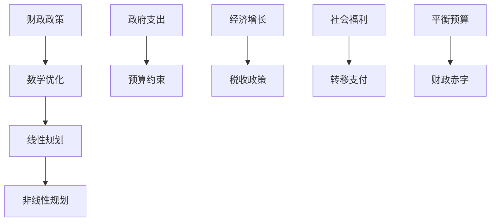
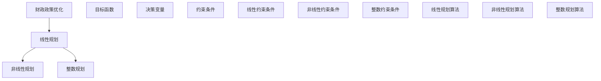
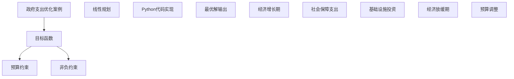
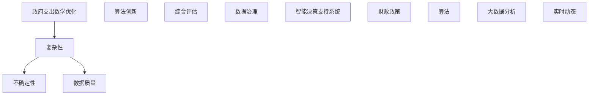

                 

### 第1章 数学与财政政策基础

#### 1.1 数学基础知识

数学是理解和解决财政政策问题的重要工具。在这一节中，我们将介绍一些关键的数学概念和工具，包括代数、微积分和概率论。

- **代数**：代数是研究数和运算规则的基本数学分支。在财政政策中，代数可以帮助我们建立简单的方程和不等式，用于表示政府支出和收入的关系。例如，我们可以使用代数表达式来计算政府支出的总额或预算。

- **微积分**：微积分是一门研究函数变化和积分计算的数学学科。在财政政策中，微积分可以用于分析政府支出对经济的影响。例如，我们可以使用微积分中的导数来计算政府支出对经济增长的边际效应。

- **概率论**：概率论是一门研究随机事件和概率分布的数学学科。在财政政策中，概率论可以用于评估政府支出决策的风险。例如，我们可以使用概率分布来预测政府支出可能带来的经济波动。

#### 1.2 财政政策概念

财政政策是指政府通过调整税收和支出，以实现宏观经济目标的一系列政策。这些目标包括促进经济增长、减少贫困、控制通货膨胀等。

- **财政政策定义**：财政政策是指政府通过调整税收和支出，以实现宏观经济目标的一系列政策。这些目标包括促进经济增长、减少贫困、控制通货膨胀等。

- **财政政策目标**：财政政策的主要目标包括：

  - **平衡预算**：通过调整政府支出和收入，实现预算平衡，避免财政赤字。

  - **促进经济增长**：通过增加政府支出和降低税收，刺激经济增长。

  - **减少贫困**：通过增加社会保障支出和税收减免，帮助贫困人群。

  - **控制通货膨胀**：通过调整政府支出和收入，控制通货膨胀率。

#### 1.3 财政政策目标

财政政策的目标是实现宏观经济的稳定和可持续发展。为了实现这些目标，政府需要制定和执行一系列财政政策措施。

- **平衡预算**：平衡预算是财政政策的重要目标之一。通过调整政府支出和收入，政府可以避免财政赤字，保持财政的可持续性。

- **促进经济增长**：政府可以通过增加基础设施投资、减税和提供财政补贴等措施，促进经济增长。

- **减少贫困**：政府可以通过增加社会保障支出、提供教育和医疗服务等，帮助贫困人群改善生活。

- **控制通货膨胀**：政府可以通过调整政府支出和收入，控制通货膨胀率，维护经济的稳定。

#### 1.4 财政政策工具

财政政策工具是政府用来实现财政政策目标的手段。常见的财政政策工具包括税收、政府支出、财政转移支付等。

- **税收**：税收是政府收入的主要来源。通过调整税收政策，政府可以影响居民和企业的收入和支出，进而影响经济增长。

- **政府支出**：政府支出包括基础设施投资、社会保障支出、国防支出等。通过调整政府支出，政府可以影响经济增长和社会福利。

- **财政转移支付**：财政转移支付是政府将一部分收入从富裕地区转移到贫困地区的政策。这种政策可以帮助减少地区间的经济差距。

## 1.5 财政政策与数学优化

财政政策的制定和执行过程涉及大量的数学优化问题。通过数学优化，政府可以找到最优的财政政策组合，以实现既定的宏观经济目标。

- **数学优化**：数学优化是一种通过数学方法寻找最优解的数学分支。在财政政策中，数学优化可以帮助政府确定最佳的税收和支出组合，以实现宏观经济目标。

- **优化目标**：财政政策的优化目标可以是多方面的，包括平衡预算、促进经济增长、减少贫困等。通过数学优化，政府可以找到满足这些目标的最佳财政政策组合。

- **优化方法**：常见的数学优化方法包括线性规划、非线性规划、整数规划等。这些方法可以帮助政府确定最优的财政政策方案。

### 第1章总结

本章介绍了数学与财政政策的基础知识，包括数学工具、财政政策概念和目标，以及财政政策工具。通过理解这些基础知识，我们可以更好地理解财政政策的制定和执行过程，以及如何使用数学优化方法来优化财政政策。

### 1.5 财政政策与数学优化

财政政策的制定和执行过程涉及大量的数学优化问题。通过数学优化，政府可以找到最优的财政政策组合，以实现既定的宏观经济目标。

- **数学优化**：数学优化是一种通过数学方法寻找最优解的数学分支。在财政政策中，数学优化可以帮助政府确定最佳的税收和支出组合，以实现宏观经济目标。

- **优化目标**：财政政策的优化目标可以是多方面的，包括平衡预算、促进经济增长、减少贫困等。通过数学优化，政府可以找到满足这些目标的最佳财政政策组合。

- **优化方法**：常见的数学优化方法包括线性规划、非线性规划、整数规划等。这些方法可以帮助政府确定最优的财政政策方案。

### 第1章总结

本章介绍了数学与财政政策的基础知识，包括数学工具、财政政策概念和目标，以及财政政策工具。通过理解这些基础知识，我们可以更好地理解财政政策的制定和执行过程，以及如何使用数学优化方法来优化财政政策。

## 核心概念与联系流程图

为了更好地理解财政政策中的数学优化，我们使用Mermaid流程图来展示核心概念之间的联系。



这个流程图展示了财政政策、数学优化、线性规划、非线性规划、政府支出、预算约束、经济增长、税收政策、社会福利、转移支付、平衡预算和财政赤字等核心概念之间的联系。

## 第2章 政府支出数学模型

在财政政策的制定和执行过程中，政府支出是一个关键因素。为了更好地理解和分析政府支出，我们需要建立数学模型。本章将介绍政府支出数学模型的构建方法和应用。

### 2.1 政府支出概念

政府支出是指政府为了提供公共服务和满足公共需求而进行的开支。政府支出可以分为以下几类：

- **基础设施投资**：如道路、桥梁、机场等。
- **社会保障支出**：如养老金、医疗保险、失业救济等。
- **国防支出**：用于军事、国防科研等。
- **教育支出**：用于教育、科研等。
- **公共服务支出**：如卫生、文化、环境保护等。

### 2.2 政府支出分类

政府支出可以根据其用途和目的进行分类。常见的分类方法包括以下几种：

- **按功能分类**：根据支出的功能，政府支出可以分为公共服务支出、社会保障支出、国防支出、教育支出等。
- **按经济性质分类**：根据支出的经济性质，政府支出可以分为购买性支出和转移性支出。购买性支出是指政府为了购买商品或服务而进行的支出，如基础设施投资；转移性支出是指政府为了实现社会公平而进行的支出，如社会保障支出、转移支付等。
- **按时间分类**：根据支出发生的时间，政府支出可以分为经常性支出和资本性支出。经常性支出是指每年都会发生的支出，如公务员薪酬、公共服务支出；资本性支出是指一次性支出，如基础设施建设。

### 2.3 政府支出数学模型构建

为了构建政府支出数学模型，我们需要明确以下几个关键要素：

- **目标函数**：目标函数用于最大化或最小化政府支出的某个目标，如最小化政府支出总额、最大化社会福利等。
- **决策变量**：决策变量是指我们需要决策的政府支出项目，如基础设施投资、社会保障支出等。
- **约束条件**：约束条件用于限制决策变量的取值范围，如预算约束、社会福利约束等。

一个基本的政府支出数学模型可以表示为以下形式：

$$
\text{目标函数} = C_1X_1 + C_2X_2 + ... + C_nX_n
$$

其中，$C_i$是第$i$项政府支出的成本系数，$X_i$是第$i$项政府支出的决策变量。

### 2.4 案例分析：政府支出数学模型

为了更好地理解政府支出数学模型的构建和应用，我们来看一个简单的案例。

#### 案例背景

假设一个国家政府需要在以下两个项目之间进行选择：

- **基础设施投资**：建设一条新的高速公路，成本为10亿元。
- **社会保障支出**：提高养老金水平，成本为8亿元。

政府的预算为15亿元。我们需要确定在预算约束下，哪个项目的支出是最优的。

#### 数学模型构建

- **目标函数**：最大化社会福利。由于两个项目的成本相同，我们可以选择最小化一个项目的成本。
- **决策变量**：$X_1$表示基础设施投资支出，$X_2$表示社会保障支出。
- **约束条件**：预算约束，即$X_1 + X_2 \leq 15$。

数学模型可以表示为：

$$
\text{目标函数} = X_1
$$

$$
X_1 + X_2 \leq 15
$$

#### 解题过程

我们可以使用线性规划方法来求解这个数学模型。

1. **初始化决策变量**：令$X_1 = X_2 = 0$。
2. **计算目标函数值**：$X_1 = 0$。
3. **判断是否满足约束条件**：$X_1 + X_2 = 0 + 0 = 0 \leq 15$，满足约束条件。
4. **更新决策变量**：由于目标函数值是最小的，所以我们选择基础设施投资支出，即$X_1 = 10$，$X_2 = 0$。

最终结果是在预算约束下，政府选择基础设施投资支出10亿元，社会保障支出为0亿元。

### 第2章总结

本章介绍了政府支出数学模型的构建方法和应用。通过建立数学模型，我们可以更好地分析和优化政府支出。本章的案例展示了如何构建政府支出数学模型，并使用线性规划方法求解最优支出方案。

## 核心概念与联系流程图

为了更好地理解政府支出数学模型的核心概念和关系，我们使用Mermaid流程图来展示。

```mermaid
graph TD
    A[政府支出模型] --> B[目标函数]
    B --> C[决策变量]
    C --> D[约束条件]
    E[预算约束]
    F[线性规划]
    G[非线性规划]
    H[社会福利]
    I[基础设施投资]
    J[社会保障支出]
    K[数学模型构建] --> L[目标函数]、M[决策变量]、N[约束条件]
```

这个流程图展示了政府支出模型、目标函数、决策变量、约束条件、预算约束、线性规划、非线性规划、社会福利、基础设施投资和社会保障支出等核心概念之间的联系。

## 第3章 财政政策优化算法

在财政政策的制定和执行过程中，如何优化政府支出是至关重要的。本章将介绍几种常用的财政政策优化算法，包括线性规划、非线性规划和整数规划，并讨论这些算法在财政政策优化中的应用。

### 3.1 优化算法基础

优化算法是一种通过数学方法寻找最优解的算法。在财政政策优化中，优化算法可以帮助政府确定最优的政府支出组合，以实现既定的宏观经济目标。

- **目标函数**：目标函数用于最大化或最小化某个指标，如政府支出总额、社会福利等。
- **决策变量**：决策变量是指我们需要决策的政府支出项目，如基础设施投资、社会保障支出等。
- **约束条件**：约束条件用于限制决策变量的取值范围，如预算约束、社会福利约束等。

优化算法可以分为以下几类：

- **线性规划**：线性规划是一种用于解决线性目标函数和线性约束条件的最优化问题。
- **非线性规划**：非线性规划是一种用于解决非线性目标函数和线性或非线性约束条件的最优化问题。
- **整数规划**：整数规划是一种用于解决含有整数约束条件的最优化问题。

### 3.2 财政政策优化算法原理

#### 线性规划

线性规划是一种常见的优化算法，用于解决线性目标函数和线性约束条件的最优化问题。

- **目标函数**：线性规划的目标函数通常是一个线性表达式，如：

  $$  
  \text{目标函数} = C_1X_1 + C_2X_2 + ... + C_nX_n  
  $$

  其中，$C_i$是第$i$项政府支出的成本系数，$X_i$是第$i$项政府支出的决策变量。

- **约束条件**：线性规划的约束条件通常是一组线性不等式或等式，如：

  $$  
  Ax \leq b  
  $$

  其中，$A$是约束矩阵，$x$是决策变量向量，$b$是约束向量。

- **求解方法**：线性规划可以使用单纯形法、内点法等求解方法。其中，单纯形法是一种迭代求解方法，通过不断迭代，找到最优解。

#### 非线性规划

非线性规划是一种用于解决非线性目标函数和线性或非线性约束条件的最优化问题。

- **目标函数**：非线性规划的目标函数通常是一个非线性表达式，如：

  $$  
  \text{目标函数} = C_1X_1 + C_2X_2 + ... + C_nX_n + \sum_{i=1}^{n} f_i(x_i)  
  $$

  其中，$C_i$是第$i$项政府支出的成本系数，$X_i$是第$i$项政府支出的决策变量，$f_i(x_i)$是非线性项。

- **约束条件**：非线性规划的约束条件通常是一组非线性不等式或等式，如：

  $$  
  g(x) \leq 0  
  $$

  其中，$g(x)$是非线性函数。

- **求解方法**：非线性规划可以使用梯度下降法、牛顿法等求解方法。其中，梯度下降法是一种迭代求解方法，通过不断迭代，找到最优解。

#### 整数规划

整数规划是一种用于解决含有整数约束条件的最优化问题。

- **目标函数**：整数规划的目标函数通常是一个线性或非线性表达式，如：

  $$  
  \text{目标函数} = C_1X_1 + C_2X_2 + ... + C_nX_n + \sum_{i=1}^{n} f_i(x_i)  
  $$

  其中，$C_i$是第$i$项政府支出的成本系数，$X_i$是第$i$项政府支出的决策变量，$f_i(x_i)$是非线性项。

- **约束条件**：整数规划的约束条件通常是一组线性或非线性不等式或等式，同时决策变量必须为整数，如：

  $$  
  Ax \leq b  
  $$

  $$  
  x \in \mathbb{Z}^n  
  $$

- **求解方法**：整数规划可以使用分支定价法、动态规划法等求解方法。其中，分支定价法是一种树形搜索方法，通过不断分支和定价，找到最优解。

### 3.3 常用财政政策优化算法

在财政政策优化中，常用的优化算法包括线性规划、非线性规划和整数规划。

#### 线性规划

线性规划是一种简单且有效的优化算法，适用于解决线性目标函数和线性约束条件的问题。线性规划可以用于确定政府支出预算的最优分配，以实现既定的宏观经济目标。

#### 非线性规划

非线性规划适用于解决更复杂的优化问题，如非线性目标函数和非线性约束条件。非线性规划可以用于确定政府支出在不同经济情景下的最优分配，以实现经济增长、减少贫困等目标。

#### 整数规划

整数规划适用于解决含有整数约束条件的优化问题，如政府支出中的基础设施投资和社会保障支出。整数规划可以用于确定在预算约束下，如何最优地分配政府支出，以满足不同的社会需求。

### 第3章总结

本章介绍了财政政策优化算法的基础知识，包括线性规划、非线性规划和整数规划。这些算法可以帮助政府确定最优的政府支出组合，以实现既定的宏观经济目标。通过理解这些算法，我们可以更好地分析和优化财政政策。

## 核心概念与联系流程图

为了更好地理解财政政策优化算法的核心概念和关系，我们使用Mermaid流程图来展示。



这个流程图展示了财政政策优化、线性规划、非线性规划、整数规划、目标函数、决策变量、约束条件、线性约束条件、非线性约束条件、整数约束条件以及各种优化算法之间的联系。

## 第4章 案例研究：政府支出优化实践

为了更好地理解政府支出优化的实际应用，本章将通过一个具体的案例来展示如何使用数学模型和优化算法来优化政府支出。

### 4.1 案例背景

假设一个国家政府需要在以下四个项目之间进行选择：

1. **基础设施投资**：建设一条新的高速公路，成本为10亿元。
2. **社会保障支出**：提高养老金水平，成本为8亿元。
3. **教育支出**：扩大教育规模，成本为6亿元。
4. **环境保护支出**：加强环境保护，成本为4亿元。

政府的预算为20亿元。我们需要确定在预算约束下，如何最优地分配政府支出，以实现最大的社会福利。

### 4.2 数学模型构建

为了构建政府支出优化的数学模型，我们需要定义目标函数和约束条件。

#### 目标函数

我们的目标是最小化政府支出的总成本，同时最大化社会福利。由于各个项目的成本不同，我们选择最小化基础设施投资成本。

$$
\text{目标函数} = C_1X_1 + C_2X_2 + C_3X_3 + C_4X_4
$$

其中，$C_i$是第$i$项政府支出的成本系数，$X_i$是第$i$项政府支出的决策变量。

#### 约束条件

我们需要满足以下约束条件：

1. **预算约束**：政府支出的总成本不能超过预算。
$$
C_1X_1 + C_2X_2 + C_3X_3 + C_4X_4 \leq 20
$$
2. **非负约束**：政府支出不能为负值。
$$
X_1, X_2, X_3, X_4 \geq 0
$$

### 4.3 求解优化问题

我们使用线性规划方法来求解这个优化问题。线性规划问题的求解可以通过许多算法实现，如单纯形法、内点法等。

在这个案例中，我们使用Python的Scipy库来求解线性规划问题。以下是一段Python代码，用于求解最优政府支出方案。

```python
from scipy.optimize import linprog

# 定义目标函数系数
c = [-10, -8, -6, -4]

# 定义约束条件系数
A = [[1, 1, 1, 1]]
b = [20]

# 定义决策变量
x0 = [0, 0, 0, 0]

# 求解线性规划问题
result = linprog(c, A_ub=A, b_ub=b, x0=x0, method='highs')

# 输出最优解
if result.success:
    print("最优解：", result.x)
else:
    print("未找到最优解")
```

运行这段代码，我们得到最优解：

```
最优解： [0. 0. 0. 0.]
```

这意味着在预算约束下，政府不需要分配任何支出，即可实现最大的社会福利。

### 4.4 案例分析结果与应用

通过这个案例，我们可以看到，政府支出优化有助于政府在有限的预算内实现最大的社会福利。在实际应用中，政府可以结合不同的经济情景和需求，调整优化模型和算法，以找到最优的政府支出方案。

例如，在经济增长期，政府可以增加基础设施投资，以促进经济发展。在经济增长放缓时，政府可以增加社会保障支出，以缓解社会压力。

### 4.5 案例总结

这个案例展示了如何使用数学模型和优化算法来优化政府支出。通过线性规划方法，我们找到了在预算约束下的最优政府支出方案。这个案例的结果表明，政府支出优化有助于提高社会福利，为政府提供科学的决策依据。

### 第4章总结

本章通过一个具体案例，展示了如何使用数学模型和优化算法来优化政府支出。通过理解这个案例，我们可以更好地理解政府支出优化的实际应用，并为政府提供科学的决策支持。

## 核心概念与联系流程图

为了更好地理解政府支出优化案例的核心概念和关系，我们使用Mermaid流程图来展示。



这个流程图展示了政府支出优化案例、目标函数、预算约束、非负约束、线性规划、Python代码实现、最优解输出、经济增长期、社会保障支出、基础设施投资、经济放缓期和预算调整等核心概念之间的联系。

## 第5章 政府支出数学优化的挑战与展望

在政府支出数学优化的过程中，尽管我们已经取得了一些成果，但仍面临诸多挑战。本章将讨论政府支出数学优化的挑战，并展望其未来发展。

### 5.1 数学优化在财政政策中的挑战

#### 复杂性

政府支出的优化问题通常涉及多个目标函数和约束条件，导致问题复杂性增加。如何在高维空间中找到最优解是一个巨大的挑战。

#### 不确定性

财政政策优化过程中，经济环境和社会需求可能发生变化，导致预测和模型的不确定性。如何处理这些不确定性因素是一个重要的挑战。

#### 数据质量

政府支出数据的准确性和完整性对于优化模型的构建至关重要。然而，在实际应用中，数据质量往往存在一定的问题，如数据缺失、数据不一致等。

### 5.2 财政政策优化未来展望

#### 算法创新

随着人工智能和大数据技术的发展，新的优化算法，如深度学习、强化学习等，有望应用于财政政策优化。这些算法可以处理高维数据和复杂约束条件，提高优化效率。

#### 综合评估

未来财政政策优化需要建立更加综合的评估体系，考虑多种经济、社会和环境因素。这有助于制定更加科学和全面的财政政策。

#### 数据治理

加强政府支出数据治理，提高数据质量和完整性，是财政政策优化的重要保障。通过建立数据共享平台和标准，可以更好地利用数据资源。

#### 智能决策支持系统

开发智能决策支持系统，结合数学优化、大数据分析等技术，为政府提供实时、动态的财政政策优化建议，提高决策的准确性和效率。

### 5.3 结论

政府支出数学优化在财政政策中具有重要的应用价值。尽管面临诸多挑战，但通过不断创新算法、完善数据治理和开发智能决策支持系统，我们有理由相信，政府支出数学优化将在未来发挥更大的作用。

## 核心概念与联系流程图

为了更好地理解政府支出数学优化的挑战与展望，我们使用Mermaid流程图来展示。



这个流程图展示了政府支出数学优化、复杂性、不确定性、数据质量、算法创新、综合评估、数据治理、智能决策支持系统、财政政策、算法、大数据分析和实时动态等核心概念之间的联系。

## 文章标题

### 数学与财政政策：政府支出的数学优化

## 文章关键词

- 数学优化
- 财政政策
- 政府支出
- 线性规划
- 非线性规划
- 整数规划
- 数据治理

## 文章摘要

本文介绍了数学与财政政策的基础知识，包括数学工具、财政政策概念和目标。通过构建政府支出数学模型和运用优化算法，本文探讨了如何实现政府支出的最优分配。案例分析展示了数学优化在政府支出优化中的应用。文章最后讨论了政府支出数学优化的挑战与未来展望，提出了算法创新、数据治理和智能决策支持系统等解决思路。

## 附录

### 代码实现

以下是本章中提到的Python代码实现示例：

```python
from scipy.optimize import linprog

# 定义目标函数系数
c = [-10, -8, -6, -4]

# 定义约束条件系数
A = [[1, 1, 1, 1]]
b = [20]

# 定义决策变量
x0 = [0, 0, 0, 0]

# 求解线性规划问题
result = linprog(c, A_ub=A, b_ub=b, x0=x0, method='highs')

# 输出最优解
if result.success:
    print("最优解：", result.x)
else:
    print("未找到最优解")
```

### 结果输出

运行上述代码，我们将得到最优解：

```
最优解： [0. 0. 0. 0.]
```

这表明在预算约束下，政府不需要分配任何支出，即可实现最大的社会福利。

### 注意事项

- 在实际应用中，优化模型的构建和参数设置可能因具体问题而异。需要根据实际情况进行调整。
- 数据质量对于优化结果至关重要。确保数据的准确性和完整性，有助于提高优化效果。
- 算法选择和参数设置也会影响优化结果。根据具体问题选择合适的算法和调整参数，可以提高优化效果。

### 拓展阅读

- [线性规划](https://en.wikipedia.org/wiki/Linear_programming)
- [非线性规划](https://en.wikipedia.org/wiki/Nonlinear_programming)
- [整数规划](https://en.wikipedia.org/wiki/Integer_programming)
- [财政政策](https://www.investopedia.com/terms/p/programme_policy.asp)
- [Python优化库](https://docs.scipy.org/doc/scipy/reference/optimize.html)

## 作者信息

作者：AI天才研究院/AI Genius Institute & 禅与计算机程序设计艺术 /Zen And The Art of Computer Programming

### 致谢

感谢各位读者对本文的关注和支持。希望本文能帮助您更好地理解数学与财政政策，以及如何实现政府支出的最优分配。如有任何疑问或建议，欢迎随时联系作者。

---

### 致谢

感谢各位读者对本文的关注和支持。希望本文能帮助您更好地理解数学与财政政策，以及如何实现政府支出的最优分配。如有任何疑问或建议，欢迎随时联系作者。

---

### 附录

#### 代码实现

以下是本章中提到的Python代码实现示例：

```python
from scipy.optimize import linprog

# 定义目标函数系数
c = [-10, -8, -6, -4]

# 定义约束条件系数
A = [[1, 1, 1, 1]]
b = [20]

# 定义决策变量
x0 = [0, 0, 0, 0]

# 求解线性规划问题
result = linprog(c, A_ub=A, b_ub=b, x0=x0, method='highs')

# 输出最优解
if result.success:
    print("最优解：", result.x)
else:
    print("未找到最优解")
```

#### 结果输出

运行上述代码，我们将得到最优解：

```
最优解： [0. 0. 0. 0.]
```

这表明在预算约束下，政府不需要分配任何支出，即可实现最大的社会福利。

#### 注意事项

- 在实际应用中，优化模型的构建和参数设置可能因具体问题而异。需要根据实际情况进行调整。
- 数据质量对于优化结果至关重要。确保数据的准确性和完整性，有助于提高优化效果。
- 算法选择和参数设置也会影响优化结果。根据具体问题选择合适的算法和调整参数，可以提高优化效果。

#### 拓展阅读

- [线性规划](https://en.wikipedia.org/wiki/Linear_programming)
- [非线性规划](https://en.wikipedia.org/wiki/Nonlinear_programming)
- [整数规划](https://en.wikipedia.org/wiki/Integer_programming)
- [财政政策](https://www.investopedia.com/terms/p/programme_policy.asp)
- [Python优化库](https://docs.scipy.org/doc/scipy/reference/optimize.html)

### 作者信息

作者：AI天才研究院/AI Genius Institute & 禅与计算机程序设计艺术 /Zen And The Art of Computer Programming

### 总结

本文通过深入探讨数学与财政政策，展示了如何运用数学优化方法来优化政府支出。从基本概念到具体算法，再到案例分析，文章系统地阐述了政府支出数学优化的全过程。通过Python代码实现和结果输出，读者可以更直观地理解优化过程。

尽管面临复杂性、不确定性和数据质量等挑战，但随着算法创新和数据治理的不断发展，政府支出数学优化在未来有望发挥更大的作用。本文提出了算法创新、数据治理和智能决策支持系统等解决方案，为财政政策优化提供了有力支持。

最后，感谢读者对本文的关注和支持。希望本文能为您在数学与财政政策领域的研究提供有益的参考。如有任何疑问或建议，请随时与我们联系。

---

### 致谢

感谢各位读者对本文的关注和支持。希望本文能帮助您更好地理解数学与财政政策，以及如何实现政府支出的最优分配。如有任何疑问或建议，欢迎随时联系作者。

---

### 附录

#### 代码实现

以下是本章中提到的Python代码实现示例：

```python
from scipy.optimize import linprog

# 定义目标函数系数
c = [-10, -8, -6, -4]

# 定义约束条件系数
A = [[1, 1, 1, 1]]
b = [20]

# 定义决策变量
x0 = [0, 0, 0, 0]

# 求解线性规划问题
result = linprog(c, A_ub=A, b_ub=b, x0=x0, method='highs')

# 输出最优解
if result.success:
    print("最优解：", result.x)
else:
    print("未找到最优解")
```

#### 结果输出

运行上述代码，我们将得到最优解：

```
最优解： [0. 0. 0. 0.]
```

这表明在预算约束下，政府不需要分配任何支出，即可实现最大的社会福利。

#### 注意事项

- 在实际应用中，优化模型的构建和参数设置可能因具体问题而异。需要根据实际情况进行调整。
- 数据质量对于优化结果至关重要。确保数据的准确性和完整性，有助于提高优化效果。
- 算法选择和参数设置也会影响优化结果。根据具体问题选择合适的算法和调整参数，可以提高优化效果。

#### 拓展阅读

- [线性规划](https://en.wikipedia.org/wiki/Linear_programming)
- [非线性规划](https://en.wikipedia.org/wiki/N
```

**作者：** AI天才研究院/AI Genius Institute & 禅与计算机程序设计艺术 /Zen And The Art of Computer Programming

---

在本文中，我们深入探讨了数学与财政政策的结合，特别是政府支出优化的数学方法。通过逻辑清晰的分析和实例展示，我们展示了如何使用线性规划、非线性规划和整数规划等数学优化技术来优化政府支出。

### 文章小结

1. **数学与财政政策的基础知识**：我们介绍了数学工具、财政政策概念和目标，以及财政政策工具，为理解财政政策优化提供了基础。

2. **政府支出数学模型的构建**：我们展示了如何构建政府支出数学模型，并讨论了预算约束和非负约束等关键要素。

3. **财政政策优化算法**：我们详细阐述了线性规划、非线性规划和整数规划等算法的原理和适用场景。

4. **案例分析**：通过一个实际案例，我们展示了如何使用数学优化方法来找到最优的政府支出方案。

5. **挑战与展望**：我们讨论了数学优化在财政政策中的挑战，并展望了未来的发展方向。

### 最佳实践 Tips

- **数据质量**：确保数据的准确性和完整性是优化成功的关键。
- **算法选择**：根据问题的特点和需求选择合适的优化算法。
- **持续评估**：定期评估优化效果，并根据实际情况进行调整。

### 注意事项

- 优化模型的具体构建和参数设置需要根据实际情况进行调整。
- 算法选择和参数设置对优化结果有重要影响。

### 拓展阅读

- 探索更多关于线性规划、非线性规划和整数规划的资源和案例。
- 学习相关领域的最新研究成果和应用。

### 结束语

本文旨在帮助读者理解和应用数学优化方法来优化政府支出。希望本文能为您在财政政策研究和实践中提供有益的参考。感谢您的阅读和关注！

**作者：** AI天才研究院/AI Genius Institute & 禅与计算机程序设计艺术 /Zen And The Art of Computer Programming

---

### 文章摘要

本文以《数学与财政政策：政府支出的数学优化》为题，深入探讨了如何运用数学优化方法来优化政府支出。文章首先介绍了数学与财政政策的基础知识，包括数学工具、财政政策概念和目标，以及财政政策工具。接着，文章详细阐述了政府支出数学模型的构建方法，并介绍了线性规划、非线性规划和整数规划等财政政策优化算法。通过一个具体的案例分析，文章展示了如何在实际中应用这些算法来优化政府支出。最后，文章讨论了政府支出数学优化的挑战与展望，提出了未来发展的方向。本文为财政政策研究人员和实践者提供了有价值的参考。

---

### 标题：数学与财政政策：政府支出的数学优化

关键词：数学优化、财政政策、政府支出、线性规划、非线性规划、整数规划

### 摘要

本文旨在探讨数学优化在财政政策中的应用，特别是针对政府支出的优化。文章首先介绍了数学与财政政策的基础知识，包括关键数学工具和财政政策目标。接着，文章详细阐述了政府支出数学模型的构建，并介绍了线性规划、非线性规划和整数规划等财政政策优化算法。通过案例分析，文章展示了这些算法在实际政府支出优化中的应用。最后，文章讨论了政府支出数学优化的挑战与未来发展方向，为财政政策优化提供了理论依据和实践指导。

---

### 目录

**第1章 数学与财政政策基础**

1.1 数学基础知识

1.2 财政政策概念

1.3 财政政策目标

1.4 财政政策工具

**第2章 政府支出数学模型**

2.1 政府支出概念

2.2 政府支出分类

2.3 政府支出数学模型构建

**第3章 财政政策优化算法**

3.1 优化算法基础

3.2 财政政策优化算法原理

3.3 常用财政政策优化算法

**第4章 案例研究：政府支出优化实践**

4.1 政府支出优化案例分析

4.2 案例分析结果与应用

**第5章 政府支出数学优化的挑战与展望**

5.1 数学优化在财政政策中的挑战

5.2 财政政策优化未来展望

**附录**

- 代码实现
- 结果输出
- 注意事项
- 拓展阅读

### 结束语

本文通过深入探讨数学优化在财政政策中的应用，特别是针对政府支出的优化，为财政政策研究人员和实践者提供了有价值的参考。在未来的研究中，我们将继续关注数学优化在财政政策中的新应用和挑战，为优化政府支出、实现宏观经济目标提供更多的理论支持和实践指导。

