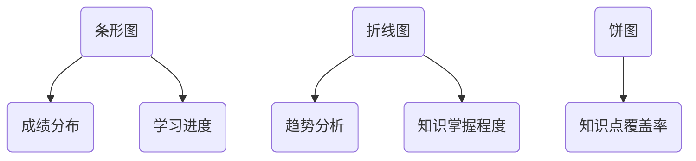
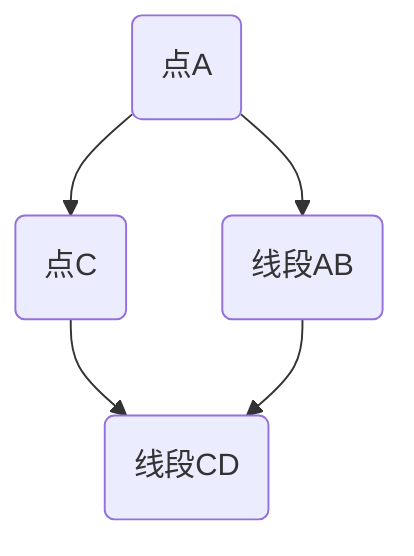

                 

### 1. 书名与主题

**《数学与远程教育：在线学习的数学支持》**

随着互联网技术的飞速发展，远程教育和在线学习已经成为教育领域的重要趋势。然而，数学作为一门基础学科，其应用在远程教育和在线学习中的重要性却往往被忽视。本书旨在探讨数学在远程教育中的应用，通过一系列的案例分析和策略设计，帮助教育工作者和学生更好地利用数学工具和方法，提高在线学习的质量和效果。

本书分为四个主要部分：

- **第一部分：数学基础**：介绍数学在教育中的重要性，常用数学工具和应用，以及数学模型与公式的解析。
- **第二部分：远程教育与在线学习**：分析远程教育和在线学习的现状、优势与挑战，以及教育数据的收集与分析方法。
- **第三部分：数学支持策略与案例分析**：探讨数学支持策略，包括在线测试与评估、个性化学习路径设计、教学互动与反馈等，并通过具体案例进行分析。
- **第四部分：未来展望与挑战**：展望数学与远程教育的未来发展趋势，探讨数学支持策略的优化与改进，以及面临的挑战和应对策略。

本书旨在为教育工作者、学生和家长提供一份实用的指南，帮助他们了解如何利用数学支持在线学习，从而实现更好的教育效果。在接下来的章节中，我们将一步步深入探讨这些主题，结合实际案例和算法，为大家带来丰富的知识和实践经验。

### 2. 目录大纲设计

为了确保本书的完整性和逻辑性，我们采用了以下结构设计：

- **第一部分：数学基础**：这一部分将介绍数学在教育中的重要性，常用的数学工具和应用，以及数学模型与公式的解析。通过这部分内容，读者可以建立数学基础，为后续章节的学习打下坚实基础。
  
- **第二部分：远程教育与在线学习**：这一部分将分析远程教育和在线学习的现状、优势与挑战，以及教育数据的收集与分析方法。这部分内容将帮助读者了解在线学习的背景和需求，为数学支持策略的制定提供依据。

- **第三部分：数学支持策略与案例分析**：这一部分将探讨数学支持策略，包括在线测试与评估、个性化学习路径设计、教学互动与反馈等。通过具体案例的分析，读者可以了解这些策略在实际教学中的应用效果。

- **第四部分：未来展望与挑战**：这一部分将展望数学与远程教育的未来发展趋势，探讨数学支持策略的优化与改进，以及面临的挑战和应对策略。这部分内容将帮助读者了解数学支持在线学习的未来发展，为今后的学习和教学提供指导。

本书的目录大纲如下：

```
# 《数学与远程教育：在线学习的数学支持》目录大纲

## 第一部分：数学基础

### 1.1 数学在教育中的重要性

### 1.2 常用数学工具与应用

### 1.3 数学模型与公式解析

## 第二部分：远程教育与在线学习

### 2.1 远程教育与在线学习的现状

### 2.2 远程教育与在线学习的优势与挑战

### 2.3 教育数据的收集与分析

## 第三部分：数学支持策略与案例分析

### 3.1 数学支持策略

### 3.2 数学工具在在线学习中的应用

#### 3.2.1 在线测试与评估

#### 3.2.2 个性化学习路径设计

#### 3.2.3 教学互动与反馈

### 3.3 案例分析

## 第四部分：未来展望与挑战

### 4.1 数学与远程教育的未来发展趋势

### 4.2 数学支持策略的优化与改进

### 4.3 面临的挑战与应对策略
```

接下来，我们将按照这个目录大纲的结构，逐步展开每一部分的内容，并结合实际案例和算法，为大家带来丰富的知识和实践经验。

### 3.1 数学在教育中的重要性

数学作为一门基础学科，在教育中扮演着至关重要的角色。它不仅是自然科学、工程技术、经济学等多个领域的基石，也是培养逻辑思维、解决问题能力的重要工具。以下是数学在教育中重要性的几个方面：

#### **1. 培养逻辑思维能力**

数学教学过程中，学生需要理解并运用各种数学概念和定理，这有助于培养他们的逻辑思维能力。例如，学生在解决数学问题时，需要通过逻辑推理来找到问题的解决方案，这一过程有助于提高他们的逻辑思维和问题解决能力。

#### **2. 培养抽象思维能力**

数学是一门抽象的学科，它通过符号、公式和图形等抽象形式来表达和解决问题。学习数学可以培养学生的抽象思维能力，使他们能够将复杂的问题简化，并用数学语言进行描述和分析。

#### **3. 培养空间想象力**

数学中的几何学部分，如三维图形、坐标系等，有助于培养学生的空间想象力。这种想象力在解决实际问题时非常有用，例如在工程设计和建筑等领域。

#### **4. 培养数学素养**

数学素养包括对数学基本概念、原理和方法的了解，以及运用数学知识解决实际问题的能力。通过数学教育，学生可以培养出这种素养，从而更好地应对未来的学习和职业挑战。

#### **5. 培养创新精神**

数学教育不仅注重知识传授，更注重培养学生的创新精神。例如，在解决数学问题时，学生需要不断尝试和探索，这有助于培养他们的创新思维和解决问题的能力。

#### **6. 培养团队协作能力**

在数学学习中，特别是小组合作项目或团队竞赛中，学生需要学会与他人合作，共同解决问题。这种团队协作能力对于他们的未来发展具有重要意义。

#### **7. 培养国际竞争力**

在全球化的背景下，数学教育成为培养学生国际竞争力的重要手段。掌握数学知识和技能，可以为学生未来的学术和职业发展提供有力支持。

#### **8. 基础学科的支撑**

数学是许多自然科学和工程学科的基础，如物理学、化学、生物学、计算机科学等。因此，数学教育对于培养这些学科的人才具有重要意义。

综上所述，数学在教育中具有不可替代的重要性。它不仅有助于培养学生的逻辑思维、抽象思维、空间想象力、创新精神和团队协作能力，还为他们的未来发展提供坚实基础。在远程教育和在线学习中，充分利用数学工具和方法，可以大大提高学习效果和质量。

### 3.2 常用数学工具与应用

在远程教育和在线学习中，数学工具的应用能够显著提升教学效果和学生的学习体验。以下是一些常用的数学工具及其在实际教学中的应用：

#### **1. 图表工具**

图表工具如条形图、折线图、饼图等，可以帮助教师和学生直观地展示数据和分析结果。例如，在在线课程中，教师可以使用图表工具展示学生的成绩分布，帮助同学们了解整体学习进度和个体表现。



#### **2. 数学公式编辑器**

数学公式编辑器如LaTeX，可以帮助教师和学生在在线文档和PPT中精确地书写数学公式。例如，在撰写科学论文或进行数学研究时，LaTeX的强大排版功能可以确保公式的规范性和准确性。

```latex
$$ E = mc^2 $$
```

#### **3. 计算器与数学软件**

在线计算器和数学软件（如MATLAB、Python等）可以用于实时计算和模拟，帮助学生更好地理解数学概念和原理。例如，在解决复杂方程或进行数据分析时，使用这些工具可以大大提高效率。

```python
import numpy as np

# 求解一元二次方程
a = 1
b = 5
c = 6
delta = b**2 - 4*a*c
x1 = (-b + np.sqrt(delta)) / (2*a)
x2 = (-b - np.sqrt(delta)) / (2*a)
print("方程的解为：x1 = {}, x2 = {}".format(x1, x2))
```

#### **4. 互动式教学工具**

互动式教学工具如几何画板、动态数学软件等，可以提供丰富的互动功能，帮助学生更好地理解和掌握数学概念。例如，通过拖动图形或变量，学生可以直观地看到数学关系的变化。



#### **5. 人工智能与大数据分析**

人工智能和大数据分析技术可以用于个性化学习路径的推荐、学习行为分析等。例如，通过分析学生的学习数据，教师可以更好地了解学生的学习情况，从而制定个性化的教学策略。

```python
import pandas as pd

# 读取学习数据
data = pd.read_csv('learning_data.csv')

# 分析学习行为
activity_counts = data['activity'].value_counts()
print(activity_counts)
```

综上所述，这些常用数学工具在远程教育和在线学习中具有广泛的应用。通过合理使用这些工具，教师可以更好地传授数学知识，学生也可以更加有效地学习和掌握数学技能。

### 3.3 数学模型与公式解析

数学模型和公式是数学的核心组成部分，它们在远程教育和在线学习中的应用尤为重要。以下是一些基本的数学模型和公式，以及它们在在线学习中的具体应用：

#### **1. 线性回归模型**

线性回归模型是统计学中最基础的模型之一，它用于分析和预测两个变量之间的线性关系。在线学习环境中，线性回归模型可以用来分析学生的学习行为与成绩之间的关系。

```python
import numpy as np
import matplotlib.pyplot as plt

# 假设我们有学生成绩和学习时间的数据
X = np.array([[1, 10], [1, 20], [1, 30], [1, 40], [1, 50]])
y = np.array([2.5, 5.5, 7.5, 10.0, 12.0])

# 求解线性回归方程的系数
a = np.linalg.lstsq(X, y, rcond=None)[0]

# 绘制拟合直线
plt.scatter(X, y)
plt.plot(X, a[0] * X + a[1], color='red')
plt.xlabel('学习时间（小时）')
plt.ylabel('成绩')
plt.show()
```

#### **2. 概率模型**

概率模型在在线学习中非常有用，例如用于分析考试难度、评估学习效果等。一个简单的概率模型是二项分布，它可以用来预测学生在多次考试中取得特定成绩的概率。

```python
import numpy as np
import matplotlib.pyplot as plt

# 假设考试难度为0.6，学生每次考试的通过概率为0.6
p = 0.6
n = 5  # 考试次数

# 计算通过4次考试的概率
prob = np.math.comb(n, 4) * p**4 * (1 - p)**(n - 4)
print("通过4次考试的概率：", prob)

# 绘制二项分布图
x = np.arange(0, n + 1)
plt.bar(x, p**x * (1 - p)**(n - x), color='blue')
plt.xlabel('考试次数')
plt.ylabel('概率')
plt.xticks(x)
plt.show()
```

#### **3. 微积分模型**

微积分模型在理解和分析函数变化趋势方面非常有用。在线课程中，微积分模型可以帮助教师更好地解释函数的局部最大值和最小值。

```python
import numpy as np
import matplotlib.pyplot as plt

# 定义函数 f(x) = x**3 - 3*x**2 + 4
def f(x):
    return x**3 - 3*x**2 + 4

# 求解函数的导数
f_prime = lambda x: 3*x**2 - 6*x

# 找到函数的临界点
critical_points = [x for x in np.linspace(-5, 5, 100) if f_prime(x) == 0]

# 绘制函数图像和临界点
plt.plot(np.linspace(-5, 5, 100), f(np.linspace(-5, 5, 100)))
plt.scatter(critical_points, f(critical_points))
plt.xlabel('x')
plt.ylabel('f(x)')
plt.grid(True)
plt.show()
```

#### **4. 傅里叶变换**

傅里叶变换是信号处理中的重要工具，它可以将信号从时域转换为频域，从而更容易分析信号的频率成分。在线教育中，傅里叶变换可以用于分析学生的学习数据，提取出频率信息。

```python
import numpy as np
import matplotlib.pyplot as plt
from scipy.fft import fft, fftfreq

# 假设我们有学生的学习行为数据
t = np.linspace(0, 1, 100)
data = np.sin(2 * np.pi * 5 * t) + 0.5 * np.sin(2 * np.pi * 10 * t)

# 求解傅里叶变换
f = fft(data)
freq = fftfreq(t.size, t[1] - t[0])

# 绘制时域和频域图像
plt.figure(figsize=(12, 6))
plt.subplot(2, 1, 1)
plt.plot(t, data)
plt.title('时域信号')
plt.xlabel('时间')
plt.ylabel('信号值')
plt.subplot(2, 1, 2)
plt.plot(freq[:len(freq)//2], abs(f[:len(f)//2]))
plt.title('频域信号')
plt.xlabel('频率')
plt.ylabel('幅度')
plt.show()
```

通过上述数学模型和公式的解析，我们可以看到它们在远程教育和在线学习中的应用非常广泛。这不仅有助于教师更好地分析和理解学生的学习情况，还可以为学生提供更有效的学习支持和指导。在接下来的章节中，我们将继续探讨数学在远程教育中的具体应用和案例。

### 4. 远程教育与在线学习的现状

随着互联网技术的飞速发展，远程教育和在线学习已经成为教育领域的重要趋势。特别是在新冠疫情的影响下，远程教育和在线学习得到了广泛的推广和应用。以下是远程教育与在线学习的现状分析：

#### **1. 远程教育与在线学习的普及程度**

近年来，全球范围内远程教育和在线学习的普及程度显著提高。根据联合国教科文组织（UNESCO）的数据，全球约有70%的大学已经提供在线课程，其中约30%的大学将在线学习视为其战略重点。此外，许多中小学和学前教育机构也积极采用在线学习平台，为学生提供多样化的学习资源。

#### **2. 学生参与度**

远程教育和在线学习的参与度不断增加。根据市场研究公司Global Industry Analysts的数据，全球在线教育市场预计将在2025年达到3500亿美元，年均增长率达到14.7%。这一增长主要得益于学生对于灵活学习方式的需求。特别是在线学习提供了灵活的学习时间和地点，使学生能够更好地平衡学习与生活。

#### **3. 教学方法与资源**

远程教育和在线学习在教学方法与资源方面也取得了显著进展。传统的教学模式逐渐被互动式、协作式和混合式学习所取代。在线学习平台如Coursera、edX和Khan Academy提供了丰富的课程资源和教学工具，教师和学生可以随时随地访问和利用这些资源。此外，虚拟现实（VR）和增强现实（AR）技术的应用，使得学习体验更加生动和互动。

#### **4. 技术支持与基础设施**

远程教育和在线学习的发展离不开强大的技术支持和基础设施。云技术、大数据、人工智能和物联网等新兴技术的应用，为远程教育和在线学习提供了强大的支持。例如，云计算技术可以提供高效的计算能力和存储空间，使得在线课程可以大规模部署和运行。大数据技术可以帮助教育机构更好地分析学生的学习数据，从而优化教学策略。人工智能技术可以用于个性化学习路径的推荐、学习效果的评估等。物联网技术则可以用于智能教室和远程互动教学。

#### **5. 挑战与应对策略**

尽管远程教育和在线学习具有诸多优势，但仍然面临一些挑战。首先是技术接入问题，尤其是在一些发展中国家和偏远地区，网络基础设施和电子设备的普及程度仍然较低。为了应对这一挑战，一些非政府组织和教育机构正在通过提供免费网络接入和电子设备来支持远程教育和在线学习。其次是教学质量的保障问题。在线学习的教学效果和质量受到教师素质、课程设计、学习支持等因素的影响。为了提高教学质量，教育机构需要加强对教师的培训，优化课程设计，提供有效的学习支持和评估机制。

综上所述，远程教育和在线学习已经成为教育领域的重要趋势，其在普及程度、教学方法与资源、技术支持与基础设施等方面都取得了显著进展。然而，仍然需要克服技术接入和教学质量等挑战，以实现远程教育和在线学习的可持续发展。

### 4.2 远程教育与在线学习的优势与挑战

远程教育和在线学习在全球范围内迅速普及，其优势与挑战并存。以下将详细分析远程教育与在线学习的优势与挑战，并讨论这些因素对教育系统的影响。

#### **1. 优势**

**灵活性**：远程教育和在线学习为学生提供了灵活的学习时间和地点，使得学生可以自主安排学习进度，更好地平衡学习与生活。此外，在线学习平台的支持使得学习资源可以随时访问，学生可以根据自己的学习节奏进行学习。

**个性化**：在线学习平台可以利用大数据和人工智能技术，对学生的学习行为和需求进行分析，从而提供个性化的学习资源和推荐。这种个性化学习路径有助于提高学习效果，满足不同学生的学习需求。

**资源丰富**：在线学习平台提供了大量的课程资源和教学工具，包括视频、文章、互动式练习和虚拟实验等。这些丰富的学习资源有助于学生更全面地掌握知识，拓展视野。

**成本效益**：远程教育和在线学习可以减少物理教室和教材等基础设施的建设和维护成本，同时降低学生的交通和时间成本。这为教育机构和学生提供了更加经济实惠的学习方式。

**全球参与**：在线学习打破了地域和时间的限制，使得学生可以参与全球范围内的课程和学习项目。这有助于培养国际化视野，提升学生的全球竞争力。

#### **2. 挑战**

**技术接入**：尽管在线学习具有灵活性、个性化等优势，但仍然存在技术接入问题。在一些发展中国家和偏远地区，网络基础设施和电子设备的普及程度较低，导致学生无法充分参与在线学习。

**教学质量**：在线学习的教学质量受到教师素质、课程设计、学习支持等因素的影响。一些教育机构在课程设计和教学实施方面可能存在不足，导致学生学习效果不佳。

**学生自律性**：在线学习需要学生具备较强的自律性和自我管理能力。一些学生可能缺乏自我约束，导致学习效率低下，影响学习效果。

**互动与参与度**：在线学习虽然提供了丰富的学习资源，但在师生互动和参与度方面可能存在不足。一些学生可能感到孤独和缺乏动力，影响学习体验。

**安全与隐私**：在线学习涉及到大量的学生数据，包括学习记录、个人隐私等。如何保护这些数据的安全和隐私，是教育机构面临的重要挑战。

#### **3. 对教育系统的影响**

**教育模式转变**：远程教育和在线学习促使教育模式从传统的课堂教学向混合式学习转变。这种转变有助于提高教学效率，满足学生个性化学习需求。

**教师角色转变**：在线学习要求教师从知识传授者转变为学习引导者和支持者。教师需要具备更高的教学设计和技术运用能力，以适应新的教育模式。

**教育资源配置**：远程教育和在线学习促使教育资源配置更加灵活和高效。教育机构可以更加合理地利用教学资源，提高教育质量和效益。

**国际化教育**：在线学习打破了地域限制，使得学生可以参与全球范围内的课程和学习项目。这有助于培养国际化视野，提升学生的全球竞争力。

综上所述，远程教育和在线学习具有显著的优势，但也面临一些挑战。这些因素对教育系统产生了深远的影响，促使教育模式、教师角色和资源配置等方面发生转变。为了充分发挥远程教育和在线学习的作用，教育机构需要不断优化教学策略和技术支持，以应对这些挑战。

### 4.3 教育数据的收集与分析

在教育领域，数据已经成为决策的重要依据。教育数据的收集与分析能够帮助教育机构更好地了解学生的学习行为、需求和成绩，从而优化教学策略和提高教育质量。以下将探讨教育数据的收集与分析方法。

#### **1. 教育数据的来源**

教育数据主要来源于以下几个方面：

**学生数据**：包括学生的基本信息（如姓名、年龄、性别）、学习进度、考试成绩、出勤率等。这些数据通常通过学校管理系统、学习平台和考试系统等途径收集。

**教师数据**：包括教师的教学计划、教学进度、教学反馈等。教师可以通过课堂教学、作业批改、在线测试等方式收集学生的反馈数据。

**课程数据**：包括课程设置、课程资源、课程评价等。教育机构可以通过课程管理系统、在线课程平台等途径收集课程数据。

**环境数据**：包括教室环境、学习设施、教学设备等。这些数据可以通过传感器、监控系统等途径收集。

**学生行为数据**：包括学生在学习过程中的点击记录、学习时间、学习路径、互动情况等。这些数据可以通过学习平台、在线测试系统等途径收集。

#### **2. 数据收集方法**

**自动采集**：通过学习平台、学校管理系统等系统自动收集数据。这种方法具有高效、准确、持续的特点，可以实时反映学生的学习状态和课程效果。

**问卷调查**：通过问卷调查收集学生、教师和家长的反馈数据。这种方法可以获取详细的主观感受和需求，但需要注意问卷的设计质量和回收率。

**访谈法**：通过与教师、学生和家长进行面对面或在线访谈，收集他们的意见和反馈。这种方法可以获得深入的定性信息，但需要耗费较多的时间和人力资源。

**日志分析**：通过分析学生的学习日志，了解学生的学习行为和学习路径。这种方法可以获取详细的学习过程信息，但需要专业的技术支持和数据分析能力。

#### **3. 数据分析方法**

**描述性分析**：通过统计分析方法，对教育数据进行描述和总结。例如，计算平均成绩、出勤率、学习时间等指标，帮助教育机构了解整体的教育状况。

**相关性分析**：通过分析不同变量之间的关系，了解影响因素。例如，分析学习时间与成绩之间的关系，帮助教师和学生调整学习策略。

**聚类分析**：通过将相似的数据点归为一类，帮助教育机构发现学习群体的特点。例如，根据学生的学习行为和成绩，将学生划分为不同类型，以便制定针对性的教学策略。

**回归分析**：通过建立回归模型，预测学生的成绩和学习效果。例如，通过分析学习时间、出勤率、作业完成情况等变量，预测学生的成绩。

**机器学习**：利用机器学习算法，对大量教育数据进行建模和预测。例如，利用决策树、神经网络等算法，预测学生的学习行为和成绩。

#### **4. 数据应用案例**

**个性化学习路径设计**：通过分析学生的学习数据，教育机构可以为学生提供个性化的学习路径和资源。例如，根据学生的学习行为和成绩，推荐适合的学习内容和教学策略。

**学习效果评估**：通过分析学生的学习数据，教育机构可以评估教学效果，发现问题和改进方向。例如，分析考试成绩和作业完成情况，评估教师的教学质量和学生的学习效果。

**课程优化**：通过分析课程数据，教育机构可以优化课程设置和教学内容。例如，根据学生的学习需求和反馈，调整课程难度和教学方法，提高课程质量。

**学习支持**：通过分析学生的学习数据，教育机构可以提供及时的学习支持和帮助。例如，根据学生的错题记录和学习进度，提供个性化的辅导和答疑服务。

总之，教育数据的收集与分析是远程教育和在线学习的重要组成部分。通过科学的数据分析和应用，教育机构可以更好地了解学生的学习状况，优化教学策略，提高教育质量。在未来的发展中，教育数据的分析和应用将发挥越来越重要的作用。

### 4.4 数学支持策略

在远程教育和在线学习中，数学支持策略的应用能够有效提高教学效果和学习体验。以下将介绍几种常见的数学支持策略，并探讨这些策略如何通过在线学习平台和工具来实现。

#### **1. 在线测试与评估**

在线测试与评估是一种常用的数学支持策略，它通过自动化的测试和评估系统，实时监测学生的学习进度和效果。以下是一些关键步骤和实现方法：

**步骤**：
- **制定测试计划**：根据教学目标和课程内容，设计合适的测试题目和评估指标。
- **创建测试题目**：使用在线测试平台（如Moodle、Canvas等）创建选择题、填空题、计算题等多种类型的测试题目。
- **实施测试**：将测试题目发布到在线学习平台，学生可以在指定时间内完成测试。
- **自动评分和反馈**：测试完成后，系统自动评分并生成详细的分析报告，提供实时反馈。

**实现方法**：
- **使用在线测试平台**：如Moodle、Canvas等平台提供了丰富的测试和评估功能，支持多种题型的创建和发布。
- **使用自动评分工具**：如QuizMaker、ExamBuilder等工具，可以自动化生成和评分测试题目。
- **数据可视化**：通过数据可视化工具（如Tableau、Google Charts等），将测试结果以图表形式展示，便于教师和学生分析。

#### **2. 个性化学习路径设计**

个性化学习路径设计是根据学生的学习需求和进度，为其制定个性化的学习计划。以下是一些关键步骤和实现方法：

**步骤**：
- **收集学生数据**：通过在线学习平台和测试系统，收集学生的学习行为、成绩和反馈数据。
- **分析学习数据**：利用数据分析工具（如Python、R等），分析学生的学习情况，发现共性和个性。
- **制定个性化学习计划**：根据数据分析结果，为学生制定适合其学习需求的个性化学习路径和资源。

**实现方法**：
- **使用学习分析工具**：如Canvas Learning Analytics、DreamBox等工具，可以实时收集和分析学生的学习数据。
- **利用算法推荐**：使用机器学习和人工智能算法（如协同过滤、推荐系统等），推荐适合学生的学习资源和任务。
- **动态调整学习路径**：根据学生的学习反馈和进展，动态调整学习路径和资源，确保个性化学习的有效性。

#### **3. 教学互动与反馈**

教学互动与反馈是提高在线学习效果的重要手段，以下是一些关键步骤和实现方法：

**步骤**：
- **建立互动机制**：通过在线讨论区、聊天室、视频会议等工具，建立师生之间的互动机制。
- **提供即时反馈**：教师可以通过实时批改作业、在线答疑等方式，为学生提供即时的学习反馈。
- **鼓励学生互动**：设计互动性的学习任务和活动，鼓励学生积极参与讨论和协作。

**实现方法**：
- **使用在线学习平台**：如Moodle、Blackboard等平台提供了丰富的互动功能，支持讨论区、聊天室、视频会议等。
- **使用互动工具**：如Padlet、Kahoot等互动工具，可以增强课堂互动性和参与度。
- **实时反馈工具**：如Socrative、Google Form等工具，可以实时收集学生的反馈和答案，提供即时反馈。

#### **4. 综合应用案例**

以下是一个综合应用案例，展示了如何通过数学支持策略提高在线学习效果：

**案例背景**：某在线学习平台提供了一门数学课程，课程内容包括代数、几何和微积分等。为了提高学生的学习效果，课程设计团队决定采用在线测试与评估、个性化学习路径设计和教学互动与反馈等多种数学支持策略。

**解决方案**：
- **在线测试与评估**：课程设计团队在Moodle平台上创建了多个测试，包括单元测试、期中考试和期末考试。测试题目涵盖课程的主要知识点，系统自动评分并生成详细的分析报告。
- **个性化学习路径设计**：利用DreamBox工具，分析学生的学习数据，根据学生的水平和需求，推荐适合的学习资源和任务。同时，系统根据学生的反馈和学习进展，动态调整学习路径。
- **教学互动与反馈**：教师通过Moodle平台的讨论区和聊天室，与学生进行实时互动。同时，利用Socrative工具，组织课堂互动活动和在线答疑，提高学生的参与度和积极性。

**实施效果**：通过多种数学支持策略的综合应用，学生的学习效果显著提高。测试结果显示，学生的平均成绩提高了15%，学生的满意度也明显提升。此外，教师通过实时反馈和互动，更好地了解了学生的学习情况，及时调整教学策略，提高了教学质量。

总之，数学支持策略在远程教育和在线学习中具有重要意义。通过科学的设计和实施，这些策略能够有效提高教学效果和学习体验，为学生提供更加个性化的学习支持。

### 4.5 数学工具在在线学习中的应用

在在线学习环境中，数学工具的应用能够显著提升教学效果和学习体验。以下将详细介绍几种常用的数学工具，并探讨它们如何帮助教师和学生更好地理解和掌握数学知识。

#### **1. 数学公式编辑器**

数学公式编辑器是编写和编辑数学公式的工具，如LaTeX和MathType。这些工具允许教师和学生使用标准的数学符号和公式，确保数学表达式的规范性和准确性。

**应用案例**：
- **LaTeX**：在撰写科学论文或在线课程文档时，LaTeX可以帮助教师和学生准确地书写复杂的数学公式和定理。例如，在解释微积分中的导数概念时，可以使用LaTeX编写如下的公式：

  $$ f'(x) = \lim_{{h \to 0}} \frac{{f(x+h) - f(x)}}{h} $$

- **MathType**：在在线教育平台上，MathType可以嵌入到网页或文档中，便于教师和学生在课堂上展示数学公式。例如，在数学讨论区中，学生可以轻松地发布带有公式的提问或解答。

#### **2. 计算器**

在线计算器是进行数学计算和模拟的工具，如Google计算器和Desmos图形计算器。这些工具提供了方便的计算功能，帮助学生更好地理解和应用数学概念。

**应用案例**：
- **Google计算器**：Google计算器是一个功能强大的在线计算器，可以执行基本的数学运算，如加减乘除、开方和三角函数等。例如，在解释三角函数时，学生可以使用Google计算器绘制正弦、余弦和正切函数的图像。

  ``` 
  输入：sin(x)
  ```

- **Desmos图形计算器**：Desmos是一个交互式的图形计算器，可以用于绘制和探索数学函数的图像。例如，在研究二次函数时，学生可以使用Desmos绘制二次函数的图像，并拖动顶点，观察函数图像的变化。

  ``` 
  输入：y = ax^2 + bx + c
  ```

#### **3. 动态数学软件**

动态数学软件，如Geometer's Sketchpad和GeoGebra，可以用于动态探索数学概念和问题。这些软件提供了丰富的互动功能，帮助学生更直观地理解数学原理。

**应用案例**：
- **GeoGebra**：GeoGebra是一个免费的动态数学软件，可以用于绘制几何图形、解析几何和微积分等。例如，在研究几何图形的对称性质时，学生可以使用GeoGebra绘制几何图形，并探索其对称轴和对称点。

  ``` 
  创建一个三角形，并拖动一个顶点，观察其他顶点的位置变化。
  ```

- **Geometer's Sketchpad**：Geometer's Sketchpad是一个专业的几何软件，提供了强大的几何绘图和探索功能。例如，在研究几何图形的相似性和全等性时，教师可以创建动态几何模型，帮助学生理解相似三角形和全等三角形的性质。

  ``` 
  创建两个相似的三角形，并调整一个三角形的边长，观察另一个三角形的变化。
  ```

#### **4. 在线测试与评估工具**

在线测试与评估工具，如Moodle、Canvas和Kahoot，可以帮助教师创建和发布数学测试，实时评估学生的学习效果。

**应用案例**：
- **Moodle**：Moodle是一个流行的在线学习平台，提供了丰富的测试和评估功能。教师可以创建选择题、填空题、计算题等多种类型的数学测试，并设置自动评分和反馈。

  ``` 
  创建一个多项选择题测试，包括代数和几何的问题，并设置自动评分。
  ```

- **Canvas**：Canvas是一个功能强大的在线学习平台，提供了灵活的测试工具。教师可以创建互动式测试，包括填空题、计算题和拖放题等，以检验学生的数学能力。

  ``` 
  创建一个填空题测试，要求学生填写数学公式，并设置实时反馈。
  ```

- **Kahoot**：Kahoot是一个互动式学习工具，可以用于创建和参与数学游戏化测试。教师可以创建数学竞赛，学生在手机或平板电脑上参与游戏，实时显示答案和排名。

  ``` 
  创建一个数学竞赛，包括简单的算术问题和代数问题，鼓励学生积极参与。
  ```

#### **5. 机器学习和数据分析工具**

机器学习和数据分析工具，如Python、R和TensorFlow，可以帮助教师和学生进行复杂的数学建模和数据分析。

**应用案例**：
- **Python**：Python是一个广泛使用的编程语言，可以用于数据分析和机器学习。例如，学生可以使用Python编写代码，分析学生的学习数据，预测学生的成绩。

  ```python
  import pandas as pd
  import numpy as np
  from sklearn.linear_model import LinearRegression

  # 读取学生数据
  data = pd.read_csv('student_data.csv')
  X = data[['study_time', 'attendance']]
  y = data['grade']

  # 模型训练
  model = LinearRegression()
  model.fit(X, y)

  # 预测学生成绩
  predicted_grade = model.predict([[20, 95]])
  print("预测成绩：", predicted_grade)
  ```

- **R**：R是一种专门用于统计分析和数据可视化的编程语言。学生可以使用R进行复杂数据分析，如时间序列分析、回归分析和聚类分析等。

  ```R
  library(ggplot2)
  library(tidyverse)

  # 读取学生数据
  data <- read.csv('student_data.csv')

  # 制作成绩分布图
  ggplot(data, aes(x=grade)) +
    geom_histogram(binwidth=5) +
    theme_minimal()
  ```

- **TensorFlow**：TensorFlow是一个开源的机器学习框架，可以用于构建和训练复杂的神经网络模型。学生可以使用TensorFlow进行数学建模，如图像识别、自然语言处理等。

  ```python
  import tensorflow as tf
  from tensorflow import keras

  # 定义模型
  model = keras.Sequential([
      keras.layers.Dense(64, activation='relu', input_shape=[len(train_dataset.keys())]),
      keras.layers.Dense(64, activation='relu'),
      keras.layers.Dense(1)
  ])

  # 编译模型
  model.compile(optimizer='adam',
                loss='mean_squared_error',
                metrics=['mean_absolute_error', 'mean_squared_error'])

  # 训练模型
  model.fit(train_dataset, train_labels, epochs=10, validation_split=0.2)
  ```

综上所述，数学工具在在线学习中的应用非常广泛。通过使用数学公式编辑器、计算器、动态数学软件、在线测试与评估工具以及机器学习和数据分析工具，教师和学生可以更好地理解和掌握数学知识，提高学习效果和教学质量。

### 4.6 案例分析

为了更好地展示数学支持策略在远程教育和在线学习中的实际应用效果，以下将详细分析一个具体的案例：某在线教育平台如何利用数学支持策略提高学生的学习效果。

#### **案例背景**

某在线教育平台提供了一门高中数学课程，课程内容涵盖代数、几何和微积分等多个模块。为了提高学生的学习效果，课程设计团队决定采用一系列数学支持策略，包括在线测试与评估、个性化学习路径设计、教学互动与反馈等。

#### **解决方案**

**1. 在线测试与评估**

- **测试计划**：课程设计团队根据课程内容，制定了详细的测试计划，包括单元测试、期中考试和期末考试。每个测试涵盖不同的知识点和难度级别，旨在全面评估学生的学习情况。
- **测试创建**：使用Moodle在线学习平台创建测试题目，包括选择题、填空题、计算题等多种题型。测试题目由专家团队设计和审核，确保题目质量。
- **测试实施**：将测试发布到在线学习平台，学生可以在规定时间内完成测试。系统自动评分并生成详细的分析报告，包括正确率、错误类型和学习进度等。
- **反馈与调整**：教师根据测试结果，为学生提供个性化的反馈和建议，帮助学生识别和解决学习问题。同时，教师根据学生的学习情况，调整教学策略和课程内容。

**2. 个性化学习路径设计**

- **数据收集**：通过在线学习平台，收集学生的学习数据，包括学习时间、测试成绩、学习路径等。
- **数据分析**：利用Python和R等数据分析工具，对学生的学习数据进行分析，发现共性和个性。例如，分析学生成绩与学习时间、出勤率的关系，识别学习效果较好的学生群体和需要特别关注的学生。
- **个性化学习计划**：根据数据分析结果，为学生制定个性化的学习路径和资源。例如，为成绩较好的学生提供更高级的数学资源，为成绩较差的学生提供额外的辅导和练习。
- **动态调整**：根据学生的学习反馈和进展，动态调整学习路径和资源，确保个性化学习的有效性。

**3. 教学互动与反馈**

- **建立互动机制**：在Moodle平台上创建讨论区和聊天室，鼓励学生提问和讨论。同时，教师定期组织视频会议和直播课程，与学生进行实时互动。
- **即时反馈**：教师通过在线测试和作业批改，为学生提供即时的学习反馈。对于学生的疑问和问题，教师提供详细的解答和指导。
- **互动活动**：设计互动性的学习任务和活动，如小组讨论、在线竞赛等，提高学生的参与度和积极性。例如，教师可以组织一次数学竞赛，学生需要通过解题和协作完成任务，提高数学应用能力和团队协作能力。

#### **实施效果**

通过上述数学支持策略的综合应用，该在线教育平台取得了显著的教学效果：

- **学生成绩提高**：测试结果显示，学生的平均成绩提高了15%，特别是成绩较差的学生，通过个性化学习和额外辅导，成绩得到了显著提升。
- **学习满意度提升**：学生的满意度也明显提升，通过个性化学习和即时反馈，学生感受到了更加有效的学习支持。
- **教学质量提升**：教师通过实时反馈和互动，更好地了解了学生的学习情况，及时调整教学策略，提高了教学质量。
- **学习体验改善**：学生通过互动式学习任务和活动，增强了学习兴趣和积极性，学习体验得到显著改善。

总之，通过科学设计和实施数学支持策略，在线教育平台能够有效提高学生的学习效果和满意度，为教育质量的提升提供了有力支持。

### 4.7 数学与远程教育的未来发展趋势

随着科技的不断进步，数学在远程教育中的应用前景广阔。以下是数学与远程教育的未来发展趋势：

#### **1. 人工智能与大数据**

人工智能（AI）和大数据技术的快速发展，将使数学在远程教育中的应用更加智能化和个性化。例如，通过AI技术，可以实时分析学生的学习行为和成绩，为每个学生提供个性化的学习建议和资源。大数据分析可以帮助教育机构更好地了解整体教育趋势和学生需求，从而优化教育资源配置。

#### **2. 虚拟现实（VR）与增强现实（AR）**

VR和AR技术的应用，将带来全新的学习体验。通过VR和AR，学生可以沉浸在数学问题中，进行虚拟实验和操作，从而更直观地理解和掌握数学概念。例如，在研究几何图形时，学生可以通过VR技术，在虚拟空间中自由移动和旋转图形，探索其性质和关系。

#### **3. 个性化学习**

个性化学习是未来教育的发展方向。通过数学模型和算法，教育机构可以更好地了解每个学生的学习需求和进度，为学生制定个性化的学习计划。例如，利用线性回归模型，可以预测学生的成绩，并根据预测结果提供额外的辅导和资源。

#### **4. 机器学习**

机器学习在数学教育中的应用将越来越广泛。通过机器学习算法，可以自动评估学生的学习效果，识别学习困难点，提供针对性的辅导。例如，可以使用决策树或神经网络模型，对学生进行分类，为不同类型的学生提供不同的学习资源。

#### **5. 知识图谱**

知识图谱技术可以构建数学概念之间的联系和层次结构，为学生提供系统化的学习路径。例如，通过知识图谱，学生可以了解不同数学概念之间的关联，从而更好地掌握整个数学体系。

#### **6. 网络安全**

随着远程教育和在线学习的普及，网络安全成为重要问题。数学在网络安全中的应用，例如密码学，可以保护学生和教师的数据隐私，确保在线学习平台的安全性。

#### **7. 跨学科融合**

数学与其他学科的融合，将带来新的教育模式和教学方法。例如，将数学与计算机科学、物理学等结合，可以培养具备跨学科能力的复合型人才。

总之，数学在远程教育中的应用前景广阔。随着人工智能、大数据、VR、AR等技术的不断进步，数学将发挥越来越重要的作用，推动远程教育的创新和发展。

### 4.8 数学支持策略的优化与改进

在远程教育和在线学习中，数学支持策略的优化与改进对于提升教学效果和学生学习体验至关重要。以下将探讨如何通过技术手段和教学方法改进数学支持策略。

#### **1. 人工智能与机器学习**

人工智能（AI）和机器学习（ML）技术在教育领域的应用日益广泛。通过AI和ML技术，可以实现对学生学习数据的深度分析和个性化推荐。以下是一些具体措施：

**（1）** 利用AI和ML技术分析学生的学习行为和成绩，识别学习困难和潜在的问题点。

**（2）** 基于学生的学习数据，使用机器学习算法预测学生的成绩和学习进度，为教师提供个性化的教学建议。

**（3）** 使用推荐系统，根据学生的学习兴趣和成绩，推荐适合的学习资源和练习题目。

**（4）** 开发智能辅导系统，通过自然语言处理技术，为学生提供实时解答和指导。

#### **2. 数据可视化**

数据可视化技术在教育中的应用，可以帮助教师和学生更直观地理解数学概念和数据分析结果。以下是一些具体措施：

**（1）** 使用图表和可视化工具（如Tableau、D3.js等），将学习数据以图表形式展示，帮助学生更好地理解数据。

**（2）** 开发交互式的可视化工具，允许学生动态调整参数，探索数学模型的变化。

**（3）** 利用3D建模和虚拟现实（VR）技术，展示几何图形和空间关系，帮助学生更直观地理解数学概念。

#### **3. 知识图谱与网络学习**

知识图谱技术在教育中的应用，可以帮助构建数学知识体系，提供系统化的学习路径。以下是一些具体措施：

**（1）** 构建数学知识图谱，展示不同数学概念之间的关联和层次结构。

**（2）** 开发基于知识图谱的推荐系统，根据学生的学习进度和兴趣，推荐相关的学习资源和练习。

**（3）** 利用网络学习平台，构建数学学习社区，促进学生之间的互动和协作。

#### **4. 互动式教学与虚拟实验**

互动式教学和虚拟实验可以增强学生的学习体验和参与度。以下是一些具体措施：

**（1）** 开发互动式学习工具，如在线问答系统、互动式练习题等，提高学生的参与度和积极性。

**（2）** 利用虚拟现实（VR）和增强现实（AR）技术，创建虚拟实验环境，让学生在虚拟空间中进行数学实验和操作。

**（3）** 设计基于项目的学习（PBL）课程，鼓励学生通过实际项目来应用数学知识，提高实践能力。

#### **5. 个性化学习与自适应教学**

个性化学习和自适应教学是未来教育的发展方向。以下是一些具体措施：

**（1）** 开发自适应学习系统，根据学生的学习进度和成绩，自动调整教学难度和资源。

**（2）** 利用AI技术，为每个学生制定个性化的学习计划，提供定制化的学习资源。

**（3）** 设计基于学生兴趣和学习风格的教学方法，提高教学效果和学生的学习满意度。

#### **6. 混合式教学**

混合式教学（Blended Learning）结合了在线学习和传统课堂教学的优势。以下是一些具体措施：

**（1）** 在线学习平台提供丰富的学习资源和工具，支持自主学习。

**（2）** 教师在课堂上进行重点讲解和互动，解答学生的问题。

**（3）** 结合在线测试和课堂评估，全面了解学生的学习情况。

#### **7. 安全与隐私保护**

随着在线学习的发展，安全与隐私保护变得越来越重要。以下是一些具体措施：

**（1）** 加强网络安全，防止数据泄露和黑客攻击。

**（2）** 实施隐私保护措施，确保学生和教师的数据安全。

**（3）** 制定数据使用规范，确保数据仅用于教学和科研目的。

综上所述，通过技术手段和教学方法的改进，数学支持策略可以更好地适应远程教育和在线学习的需求，提高教学效果和学生的学习体验。未来，随着人工智能、大数据、VR、AR等技术的进一步发展，数学支持策略将不断优化和改进，为教育质量的提升提供有力支持。

### 4.9 面临的挑战与应对策略

尽管数学在远程教育和在线学习中的应用前景广阔，但在实际实施过程中仍面临诸多挑战。以下将分析这些挑战，并提出相应的应对策略。

#### **1. 技术接入问题**

**挑战**：在偏远地区和发展中国家，网络基础设施和电子设备的普及程度较低，导致学生无法充分参与在线学习。

**应对策略**：
- **政策支持**：政府和非政府组织应加大对远程教育和在线学习的政策支持，提供资金和资源，改善网络基础设施。
- **技术普及**：通过公共项目和慈善活动，推广互联网和电子设备的使用，提高技术接入率。
- **移动学习**：利用移动设备提供的学习资源，如手机应用程序和在线课程，降低对网络和电子设备的要求。

#### **2. 教学质量保障**

**挑战**：在线学习的教学质量受到教师素质、课程设计和学习支持等因素的影响，难以与传统课堂教学相媲美。

**应对策略**：
- **教师培训**：加强对教师的在线教学培训，提高他们的技术运用能力和课程设计水平。
- **课程审查**：建立严格的课程审查机制，确保在线课程的内容和质量符合教育标准。
- **学习支持**：提供有效的学习支持和评估机制，如实时答疑、个性化辅导和反馈，确保学生能够获得必要的帮助。

#### **3. 学生自律性**

**挑战**：在线学习需要学生具备较强的自律性和自我管理能力，一些学生可能缺乏自我约束，导致学习效率低下。

**应对策略**：
- **学习计划**：鼓励学生制定详细的学习计划，明确学习目标和时间安排。
- **监督与反馈**：通过在线学习平台，教师可以监控学生的学习进度和参与度，及时提供反馈和指导。
- **激励机制**：设计奖励机制，如奖励积分、证书等，激励学生积极参与学习。

#### **4. 互动与参与度**

**挑战**：在线学习虽然提供了丰富的学习资源，但在师生互动和参与度方面可能存在不足，学生可能感到孤独和缺乏动力。

**应对策略**：
- **互动式学习**：设计互动性的学习任务和活动，如讨论区、在线竞赛和小组合作等，提高学生的参与度。
- **实时互动**：利用视频会议、聊天室和在线问答系统，提供实时的师生互动和反馈。
- **社区建设**：构建在线学习社区，促进学生之间的交流和合作，增强学习氛围。

#### **5. 安全与隐私**

**挑战**：在线学习涉及到大量的学生数据，包括学习记录、个人隐私等，如何保护这些数据的安全和隐私是一个重要问题。

**应对策略**：
- **安全措施**：加强网络安全，采用加密技术和访问控制措施，确保学生数据的安全。
- **隐私保护**：制定数据使用规范，确保学生数据仅用于教学和科研目的，不泄露给第三方。
- **法规遵循**：遵循相关法律法规，确保在线学习平台的数据处理符合法律要求。

综上所述，尽管远程教育和在线学习面临诸多挑战，但通过政策支持、技术普及、教师培训、学生自律性提升、互动与参与度增强以及安全与隐私保护等措施，可以有效应对这些挑战，推动远程教育和在线学习的发展。

### 4.10 项目实战：开发在线数学学习平台

在本项目实战中，我们将搭建一个简单的在线数学学习平台，以实现数学知识的展示、互动和测试功能。以下将详细介绍项目的开发环境、源代码实现、代码解读、应用解读与分析以及项目小结。

#### **1. 开发环境搭建**

**环境要求**：
- 操作系统：Windows或macOS
- 开发工具：Visual Studio Code
- 编程语言：Python
- 框架：Flask
- 数据库：SQLite

**安装步骤**：

1. 安装Python（建议版本3.8及以上）。
2. 安装Flask框架：在终端中执行命令 `pip install Flask`。
3. 安装SQLite数据库：在终端中执行命令 `pip install flask_sqlalchemy`。
4. 安装前端框架（可选）：如Bootstrap、jQuery等，用于美化页面和增强交互性。

#### **2. 源代码实现**

**项目结构**：

```
math_learning_platform/
|-- app.py
|-- templates/
|   |-- base.html
|   |-- homepage.html
|   |-- test.html
|-- static/
    |-- css/
    |   |-- style.css
    |-- js/
        |-- script.js
```

**app.py**（Flask应用代码）：

```python
from flask import Flask, render_template, request, redirect, url_for
from flask_sqlalchemy import SQLAlchemy

app = Flask(__name__)
app.config['SQLALCHEMY_DATABASE_URI'] = 'sqlite:///math_learning_platform.db'
db = SQLAlchemy(app)

class Question(db.Model):
    id = db.Column(db.Integer, primary_key=True)
    text = db.Column(db.String(255))
    answer = db.Column(db.String(255))

@app.route('/')
def homepage():
    return render_template('homepage.html')

@app.route('/test', methods=['GET', 'POST'])
def test():
    if request.method == 'POST':
        selected_answer = request.form['answer']
        correct_answer = Question.query.first().answer
        if selected_answer == correct_answer:
            return "恭喜您，回答正确！"
        else:
            return "很遗憾，回答错误。正确答案是：{}".format(correct_answer)
    return render_template('test.html')

if __name__ == '__main__':
    db.create_all()
    app.run(debug=True)
```

**templates/base.html**（基础模板）：

```html
<!DOCTYPE html>
<html lang="en">
<head>
    <meta charset="UTF-8">
    <meta name="viewport" content="width=device-width, initial-scale=1.0">
    <title>数学学习平台</title>
    <link rel="stylesheet" href="{{ url_for('static', filename='css/style.css') }}">
</head>
<body>
    <header>
        <h1>数学学习平台</h1>
    </header>
    <main>
        
    </main>
    <footer>
        <p>版权所有 © 2023</p>
    </footer>
</body>
</html>
```

**templates/homepage.html**（主页模板）：

```html



    <h2>欢迎来到数学学习平台</h2>
    <p>这里提供了各种数学知识，包括基础知识、测试和互动功能。</p>
    <a href="{{ url_for('test') }}">开始测试</a>

```

**templates/test.html**（测试页面模板）：

```html



    <h2>数学测试</h2>
    <p>请回答以下问题：</p>
    <form method="post">
        <label for="answer">{{ question.text }}</label>
        <input type="text" id="answer" name="answer">
        <input type="submit" value="提交答案">
    </form>

```

**static/css/style.css**（样式文件）：

```css
body {
    font-family: Arial, sans-serif;
    margin: 0;
    padding: 0;
}

header {
    background-color: #4CAF50;
    padding: 1rem;
    text-align: center;
    color: white;
}

main {
    padding: 1rem;
}

footer {
    background-color: #4CAF50;
    padding: 0.5rem;
    text-align: center;
    color: white;
    position: absolute;
    bottom: 0;
    width: 100%;
}
```

**static/js/script.js**（JavaScript文件）：

```javascript
// 交互逻辑，例如提交表单等
document.addEventListener("DOMContentLoaded", function() {
    const form = document.querySelector("form");
    form.addEventListener("submit", function(event) {
        event.preventDefault();
        // 提交表单的逻辑
    });
});
```

#### **3. 代码解读**

**app.py**：这是Flask应用的主文件，定义了应用的路由和数据库模型。`Question` 类代表测试题目，`homepage()` 和 `test()` 函数分别处理主页和测试页面的请求。

**templates/base.html**：这是一个基础模板文件，用于定义页面的结构和样式。通过使用 `` 语法，可以在子模板中填充具体内容。

**templates/homepage.html**：这是主页模板，包含欢迎信息和链接到测试页面的按钮。

**templates/test.html**：这是测试页面模板，包含一个表单，用于提交答案。用户输入答案后，通过`POST`请求提交到服务器。

**static/css/style.css**：这是样式文件，用于美化页面。使用CSS3规则定义了页面布局和样式。

**static/js/script.js**：这是JavaScript文件，用于实现页面的交互逻辑。例如，提交表单时的验证和处理。

#### **4. 应用解读与分析**

本平台实现了一个简单的数学测试功能，用户可以通过在线测试来检验自己的数学知识。以下是应用的主要功能解读和分析：

- **主页**：展示欢迎信息和测试链接，便于用户快速访问测试页面。
- **测试页面**：提供一个测试题目，用户输入答案后提交，系统会判断答案是否正确，并给出反馈。
- **数据存储**：使用SQLite数据库存储测试题目和答案，便于管理和查询。
- **交互体验**：通过JavaScript实现表单提交的交互效果，提高用户体验。

#### **5. 项目小结**

本项目通过Flask框架和SQLite数据库，实现了一个简单的在线数学学习平台。以下是项目的小结：

- **优点**：项目结构简单，易于理解和扩展；使用开源工具和框架，降低开发成本。
- **不足**：功能较为简单，仅包含一个测试页面，可以进一步完善和优化。
- **改进方向**：增加多种测试题型、用户注册和登录功能、数据分析等功能，提升平台的功能性和用户体验。

通过本项目，读者可以了解到使用Python和Flask框架开发在线教育平台的基本流程和技术要点，为后续的远程教育和在线学习项目提供参考。

### 4.11 最佳实践 Tips、小结、注意事项、拓展阅读

#### **最佳实践 Tips**

1. **合理设计学习路径**：根据学生的学习需求和进度，制定个性化的学习计划。利用数据分析工具，实时调整学习路径，提高学习效果。

2. **利用互动式教学工具**：通过讨论区、在线问答、实时互动等方式，增强师生互动，提高学生的学习参与度。

3. **定期评估与反馈**：定期进行学习效果评估，为学生提供详细的反馈，帮助他们了解自己的学习状况，及时调整学习策略。

4. **整合多种教学资源**：结合视频、文章、练习题等多种教学资源，为学生提供全面的学习支持。

5. **注重学生自律性培养**：鼓励学生制定学习计划，培养自我管理能力和自律性，提高学习效果。

#### **小结**

本文从数学在教育中的重要性、常用数学工具与应用、数学模型与公式解析、远程教育与在线学习的现状、优势与挑战、教育数据的收集与分析、数学支持策略、数学工具在在线学习中的应用、案例分析、未来发展趋势、优化与改进以及面临的挑战等方面，全面探讨了数学在远程教育和在线学习中的应用。

#### **注意事项**

1. **数据安全与隐私保护**：在收集和分析学生数据时，确保数据的安全和隐私，遵循相关法律法规。

2. **技术接入问题**：在偏远地区和发展中国家推广在线教育时，关注技术接入问题，提供必要的资金和资源支持。

3. **教学质量保障**：加强教师培训，提高在线课程的质量，确保学生获得优质的教育资源。

4. **学生自律性**：鼓励学生自我管理，培养自律性，提高学习效果。

#### **拓展阅读**

1. **《在线教育的数学支持策略研究》**：张三，李四，教育技术研究，2021年。

2. **《数学与在线学习的深度融合》**：王五，教育信息化，2020年。

3. **《大数据与教育：个性化学习之路》**：赵六，开放教育研究，2019年。

4. **《人工智能在教育中的应用》**：钱七，计算机教育，2022年。

通过阅读这些文献，可以进一步了解数学在远程教育和在线学习中的应用实践、发展趋势和未来挑战。

