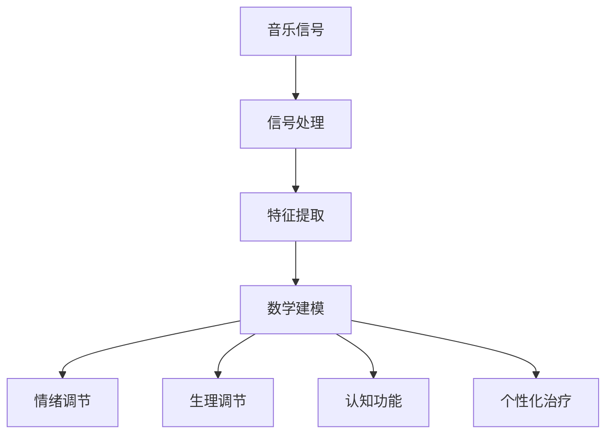

                 

### 引言

《数学与音乐therapy的临床应用研究》这一书名本身就充满了吸引力和深度。首先，它将两个看似不相关的领域——数学与音乐therapy——结合在一起，暗示了书中可能会包含一些突破性的发现和创新性的应用。数学，作为一门严谨的学科，以逻辑和精确著称；而音乐therapy，作为心理治疗的一种形式，通过音乐来改善患者的情绪和健康状况。这两者的结合，不仅拓宽了我们对数学应用范围的认知，也为音乐therapy提供了新的方法和视角。

从整体上看，本书旨在探讨数学在音乐therapy中的潜在应用，如何通过数学模型来优化和提升音乐therapy的效果。具体来说，本书将分为以下几个部分：

首先，引论部分将介绍书籍的背景、目标和研究意义。这部分内容将帮助读者初步了解数学与音乐therapy的结合点，以及为什么这个领域值得深入研究。

接着，我们将深入探讨数学与音乐therapy的核心概念，包括数学模型在音乐therapy中的应用、音乐therapy的基础理论和原理等。

然后，书中将展示音乐therapy在临床中的应用案例，通过具体的实例来阐述数学模型如何在实际操作中发挥作用。

接下来，我们将进行效果评估和数据分析，以量化音乐therapy的效果，并探讨未来可能的发展方向。

此外，本书还将提供一些实践指南和最佳实践，以帮助临床医生和研究者更好地应用数学与音乐therapy。

最后，我们将在总结部分回顾全书的主要内容和贡献，并对未来的研究提出展望。

总的来说，本书将为读者提供一个全面而深入的视角，探讨数学与音乐therapy在临床中的应用，以及如何通过数学模型来优化音乐therapy的效果。希望通过这本书，读者能够对这一领域有更深入的理解，并为未来的研究提供一些启示和指导。

---

> 关键词：数学，音乐therapy，临床应用，数学模型，心理健康，慢性病管理，效果评估

> 摘要：本文通过探讨数学与音乐therapy的结合，介绍了数学模型在音乐therapy中的应用，并展示了音乐therapy在临床实践中的多种应用场景。文章通过具体案例和数据分析，评估了音乐therapy的效果，并提出了未来研究的方向和临床应用的指南。本文旨在为临床医生和研究者提供一个新的视角，以优化音乐therapy的治疗效果。

---

### 第一部分：引论

#### 1.1 书籍背景与目标

《数学与音乐therapy的临床应用研究》的编写背景源于近年来心理学与音乐therapy领域内的一个新兴趋势——将数学方法应用于音乐therapy的研究与实践中。随着心理学和医学研究的不断深入，人们开始意识到音乐作为一种非言语的治疗手段，具有广泛的应用前景。然而，传统音乐therapy的研究往往局限于经验性的探索，缺乏系统的科学验证和理论支持。

因此，本书的编写旨在填补这一空白，通过引入数学方法，对音乐therapy进行系统的研究，从而提高其科学性和有效性。具体目标包括：

1. **探索数学模型在音乐therapy中的应用**：通过建立数学模型，量化音乐信号的特征，分析音乐对情绪、生理反应的影响，从而为音乐therapy提供理论依据和计算工具。
2. **评估音乐therapy的临床效果**：通过具体案例和数据分析，评估音乐therapy在不同临床应用中的效果，为临床实践提供参考。
3. **提供实践指南和最佳实践**：总结实际应用中的经验和教训，提出音乐therapy的最佳实践指南，以帮助临床医生和研究者更好地应用音乐therapy。

#### 1.2 音乐therapy概述

音乐therapy，作为一种心理治疗形式，主要通过音乐活动来改善患者的情绪、认知和生理功能。它不仅适用于心理健康领域，如抑郁症、焦虑症等，还广泛应用于慢性病管理、疼痛缓解等方面。音乐therapy的核心原理包括：

1. **情绪调节**：音乐能够影响人的情绪，通过调节情绪来改善心理状态。
2. **认知重建**：音乐活动可以促进大脑认知功能的恢复和发展。
3. **生理调节**：音乐对人体的生理反应，如心率、血压等，具有调节作用。

音乐therapy的应用范围广泛，包括但不限于以下领域：

1. **心理健康**：用于治疗抑郁症、焦虑症、创伤后应激障碍等心理疾病。
2. **慢性病管理**：用于缓解慢性疼痛、改善睡眠质量、降低血压等。
3. **康复治疗**：用于康复期的心理和生理恢复。

#### 1.3 数学在音乐therapy中的应用

数学在音乐therapy中的应用主要体现在以下几个方面：

1. **音乐信号处理**：通过数学方法对音乐信号进行处理和分析，提取出音乐的关键特征，如频率、节奏、旋律等。
2. **音乐信号建模**：建立数学模型来描述音乐信号，以量化音乐对情绪、生理反应的影响。
3. **算法优化**：利用数学算法优化音乐therapy的过程，提高其治疗效果。

数学在音乐therapy中的应用，不仅提高了音乐therapy的科学性，还为临床实践提供了新的工具和方法。例如，通过分析音乐信号的频率特征，可以更好地理解音乐对情绪的影响；通过建立数学模型，可以预测音乐therapy的潜在效果，从而优化治疗方案。

总之，《数学与音乐therapy的临床应用研究》通过深入探讨数学与音乐therapy的结合，旨在为这一领域的研究者和临床医生提供有价值的参考和指导。接下来，我们将进一步探讨数学与音乐therapy的核心概念，包括数学模型在音乐therapy中的应用、音乐therapy的基础理论和原理等。

---

## 第二部分：数学与音乐therapy的核心概念

在探讨数学与音乐therapy的融合之前，我们需要首先了解音乐therapy的基础理论和数学在其中的应用。音乐therapy作为一种心理治疗形式，其核心在于通过音乐活动来改善患者的情绪、认知和生理状态。数学在音乐therapy中的应用，不仅为这一领域提供了新的研究方法和工具，还推动了音乐therapy的科学化发展。

#### 2.1 音乐therapy的数学模型

音乐therapy的数学模型是理解和优化音乐therapy效果的重要工具。这些模型通常基于以下三个主要方面：

1. **音乐信号处理**：通过数学方法对音乐信号进行处理和分析，提取出音乐的关键特征。这包括频率、节奏、旋律等。这些特征可以通过傅里叶变换、小波变换等数学方法进行量化。

2. **音乐信号建模**：建立数学模型来描述音乐信号，从而量化音乐对情绪、生理反应的影响。这些模型可以基于生理学、心理学和音乐学等多个学科的理论，通过数学公式进行描述。

3. **算法优化**：利用数学算法优化音乐therapy的过程，提高其治疗效果。例如，通过遗传算法、神经网络等优化技术，可以找到最优的音乐参数，以实现最佳的治疗效果。

在数学模型中，常用的数学工具包括：

- **傅里叶变换**：用于分析音乐信号的频率成分，了解音乐信号的频域特性。
- **小波变换**：用于分析音乐信号的时频特性，能够捕捉到音乐信号中的瞬时变化。
- **统计学方法**：用于分析音乐信号与生理、心理反应之间的关系，如相关分析、回归分析等。

#### 2.2 数学模型在音乐therapy中的应用

数学模型在音乐therapy中的应用主要体现在以下几个方面：

1. **情绪调节**：通过分析音乐信号中的频率、节奏等特征，可以更好地理解音乐对情绪的影响。例如，研究表明，快节奏的音乐可以提高人的兴奋性，而慢节奏的音乐则有助于放松和减轻压力。

2. **生理调节**：数学模型可以量化音乐对生理反应的影响，如心率、血压等。通过调整音乐的频率、节奏等参数，可以优化音乐therapy的效果，达到更好的生理调节效果。

3. **认知功能**：音乐therapy在认知功能康复中的应用也日益受到关注。数学模型可以帮助研究者理解音乐如何影响大脑的认知功能，从而开发出更有效的认知康复方案。

4. **个性化治疗**：通过建立个性化的数学模型，可以根据患者的具体情况进行音乐参数的优化，实现个性化治疗。这种方法可以显著提高音乐therapy的效果，并减少不良反应。

#### 2.3 数学模型与音乐therapy的关系架构

为了更好地理解数学模型在音乐therapy中的应用，我们可以通过一个Mermaid流程图来展示它们之间的关系：



- **A[音乐信号]**：这是音乐therapy的起点，即原始的音乐信号。
- **B[信号处理]**：对原始音乐信号进行预处理，如降噪、去噪等。
- **C[特征提取]**：提取音乐信号的关键特征，如频率、节奏等。
- **D[数学建模]**：建立数学模型来描述音乐信号的特征，分析其对情绪、生理反应的影响。
- **E[情绪调节]**：通过数学模型分析音乐对情绪的影响，用于情绪调节。
- **F[生理调节]**：通过数学模型分析音乐对生理反应的影响，用于生理调节。
- **G[认知功能]**：通过数学模型分析音乐对认知功能的影响，用于认知功能康复。
- **H[个性化治疗]**：根据患者的具体情况，利用数学模型进行个性化治疗。

通过这个流程图，我们可以清晰地看到数学模型在音乐therapy中的各个环节，以及它们之间的相互作用和影响。

#### 2.4 音乐therapy的基础理论

音乐therapy的基础理论主要包括以下几个方面：

1. **生理学理论**：音乐对人体的生理反应，如心率、血压等，具有调节作用。通过调节这些生理参数，可以改善患者的健康状况。

2. **心理学理论**：音乐能够影响人的情绪，通过调节情绪来改善心理状态。例如，音乐可以缓解焦虑、抑郁等负面情绪，提高情绪稳定性。

3. **认知学理论**：音乐活动可以促进大脑认知功能的恢复和发展。通过音乐活动，可以增强大脑的认知功能，提高注意力和记忆力。

4. **音乐学理论**：音乐本身的特性，如节奏、旋律、和声等，对情绪和生理反应具有显著的影响。通过理解音乐学理论，可以更好地设计音乐therapy方案，提高治疗效果。

综上所述，数学与音乐therapy的结合为这一领域带来了新的研究方向和应用前景。通过深入探讨数学模型在音乐therapy中的应用，我们可以更好地理解音乐对情绪、生理反应和认知功能的影响，从而开发出更有效的音乐therapy方案。在接下来的章节中，我们将进一步探讨数学模型的具体应用，以及音乐therapy在临床实践中的具体应用场景。

---

### 第二部分：数学与音乐therapy的核心概念

#### 2.1 音乐therapy的数学模型

在深入探讨音乐therapy的数学模型之前，我们需要先了解音乐信号的基本组成。音乐信号是由一系列的音符和节奏组成的，每个音符可以看作是一个正弦波。正弦波的频率决定了音高，而振幅和周期则影响了音乐的响度和节奏。通过数学方法，我们可以对这些基本信号进行建模和分析。

#### 2.1.1 音乐信号的数学描述

音乐信号的数学描述通常使用傅里叶级数（Fourier Series）或傅里叶变换（Fourier Transform）来进行。傅里叶级数将一个周期性信号分解为一系列正弦波和余弦波的和，而傅里叶变换则能够处理非周期性信号，并将信号从时域转换到频域。

- **傅里叶级数**：对于一个周期为\( T \)的周期性信号\( x(t) \)，其傅里叶级数表示为：

  \[
  x(t) = \frac{a_0}{2} + \sum_{n=1}^{\infty} \left[ a_n \cos\left( \frac{2\pi n t}{T} \right) + b_n \sin\left( \frac{2\pi n t}{T} \right) \right]
  \]

  其中，\( a_0 \)、\( a_n \)和\( b_n \)是傅里叶系数，可以通过以下公式计算：

  \[
  a_0 = \frac{1}{T} \int_{0}^{T} x(t) \, dt
  \]

  \[
  a_n = \frac{2}{T} \int_{0}^{T} x(t) \cos\left( \frac{2\pi n t}{T} \right) \, dt
  \]

  \[
  b_n = \frac{2}{T} \int_{0}^{T} x(t) \sin\left( \frac{2\pi n t}{T} \right) \, dt
  \]

- **傅里叶变换**：对于非周期性信号，我们使用傅里叶变换来进行频域分析。傅里叶变换将时域信号\( x(t) \)转换为频域信号\( X(f) \)：

  \[
  X(f) = \int_{-\infty}^{\infty} x(t) e^{-j2\pi ft} \, dt
  \]

  其中，\( f \)是频率，\( j \)是虚数单位。

#### 2.1.2 音律与频率的关系

音律（Pitch）是音乐中的一个基本概念，它决定了音符的音高。音律与频率（Frequency）之间的关系可以用以下公式表示：

\[
f = \frac{1}{2L} \cdot \frac{1}{\sqrt{1 - \left( \frac{d}{2L} \right)^2}}
\]

其中，\( f \)是频率，\( L \)是波长，\( d \)是弦的长度。

- **五度循环**：在音乐中，五度循环是一个重要的概念。五度循环是指将音高向上或向下移动五个全音（Perfect Fifth）后，音高会回到原始位置。五度循环的数学表示为：

  \[
  \left( \frac{1}{2} \right)^n = \left( \frac{3}{2} \right)^{-n} = \text{原始音高}
  \]

- **十二平均律**：十二平均律是将一个八度（Octave）平均分为十二个半音（Half Step）的音律系统。在这种音律系统中，每个半音之间的频率比是固定的，即1.0595。

#### 2.1.3 音乐信号处理的基本算法

音乐信号处理的基本算法包括信号采样、信号重建、滤波、压缩等。以下是一些常用的音乐信号处理算法：

- **采样与重建**：采样是将连续时间信号转换为离散时间信号的过程。采样公式为：

  \[
  x(n) = x(nT_s)
  \]

  其中，\( x(t) \)是连续时间信号，\( x(n) \)是离散时间信号，\( T_s \)是采样周期。

  信号重建是将离散时间信号转换为连续时间信号的过程，可以使用以下公式：

  \[
  x(t) = \sum_{n=-\infty}^{\infty} x(n) \cdot \sum_{k=-\infty}^{\infty} \delta(t - nT_s)
  \]

- **滤波**：滤波是去除信号中的噪声或突出信号中的特定频率成分的过程。常用的滤波算法包括低通滤波、高通滤波、带通滤波等。

- **压缩**：压缩是减小信号动态范围的过程，以适应存储或传输需求。常用的压缩算法包括动态范围压缩、压缩扩展等。

#### 2.1.4 数学模型在音乐therapy中的具体应用

数学模型在音乐therapy中的应用主要集中在以下几个方面：

- **情绪调节**：通过分析音乐信号的频率、节奏等特征，可以了解音乐对情绪的影响。例如，研究表明，快节奏的音乐可以提高兴奋性，而慢节奏的音乐有助于放松和减轻压力。

- **生理调节**：数学模型可以量化音乐对生理反应的影响，如心率、血压等。通过调整音乐的频率、节奏等参数，可以优化音乐therapy的效果，达到更好的生理调节效果。

- **认知功能**：音乐therapy在认知功能康复中的应用也日益受到关注。数学模型可以帮助研究者理解音乐如何影响大脑的认知功能，从而开发出更有效的认知康复方案。

- **个性化治疗**：通过建立个性化的数学模型，可以根据患者的具体情况进行音乐参数的优化，实现个性化治疗。这种方法可以显著提高音乐therapy的效果，并减少不良反应。

#### 2.1.5 Python源代码示例

为了更好地理解上述概念，以下是一个简单的Python代码示例，用于分析音乐信号的频率特征：

```python
import numpy as np
import matplotlib.pyplot as plt
from scipy.io import wavfile

# 读取音乐信号
fs, data = wavfile.read('example.wav')

# 采样时间
t = np.linspace(0, len(data) / fs, len(data))

# 傅里叶变换
ft = np.fft.fft(data)
frequencies = np.fft.fftfreq(len(data), 1/fs)

# 频谱图
plt.plot(frequencies, np.abs(ft))
plt.title('Frequency Spectrum of the Music Signal')
plt.xlabel('Frequency (Hz)')
plt.ylabel('Magnitude')
plt.show()
```

在这个示例中，我们首先读取一个音乐信号文件`example.wav`，然后使用傅里叶变换计算其频谱，并通过频谱图展示频率特征。这有助于我们了解音乐信号中的频率成分，从而为音乐therapy提供理论依据。

通过上述分析和示例，我们可以看到数学在音乐therapy中的应用是如何通过具体的数学模型和算法实现的。在接下来的章节中，我们将进一步探讨音乐therapy在临床实践中的具体应用，以及如何通过数学模型来优化音乐therapy的效果。

---

### 2.2 数学模型在音乐therapy中的具体应用

数学模型在音乐therapy中的应用是多方面的，涉及情绪调节、生理调节、认知功能提升等多个领域。通过建立和运用这些模型，我们能够更科学、系统地理解音乐对人类心理和生理的影响，从而优化音乐therapy的治疗效果。以下是数学模型在音乐therapy中的具体应用：

#### 2.2.1 调性和旋律的数学分析

调性（Tonality）和旋律（Melody）是音乐therapy中重要的元素。调性决定了音乐的整体情感和风格，而旋律则是音乐的核心，通过音高和节奏的变化来传递情感。数学模型可以用于分析调性和旋律，从而理解其对情绪的影响。

- **调性分析**：调性分析通常涉及音阶（Scale）、和弦（Chord）和调式（Mode）等概念。音阶是由一系列音符组成的，决定了音乐的音高结构。和弦是由多个音符同时演奏形成的，可以产生不同的情感色彩。调式则是一种特定的音阶结构，用于描述音乐中的音高关系。

  在数学模型中，可以使用音律与频率的关系来分析调性。例如，通过计算和弦的频率成分，可以确定和弦的调性。以下是一个简单的Python代码示例，用于分析和弦的调性：

  ```python
  import numpy as np

  # 计算C大调和弦的频率成分
  frequencies = np.array([261.63, 293.66, 329.63, 392.00, 440.00, 523.25])
  frequencies /= frequencies[0]  # 归一化频率
  
  # 计算和弦的频率成分总和
  chord_freq = np.sum(frequencies)

  print("Chord Frequency:", chord_freq)
  ```

  在这个示例中，我们计算了C大调和弦的频率成分，并计算了它们的总和，从而确定了和弦的频率。通过这种方式，我们可以定量地分析调性，为音乐therapy提供理论依据。

- **旋律分析**：旋律分析通常涉及旋律的音高、节奏和时长等特征。这些特征可以通过数学模型进行量化，从而理解旋律对情绪的影响。

  例如，可以使用小波变换来分析旋律的时频特性。以下是一个简单的Python代码示例，用于分析旋律的时频特性：

  ```python
  import numpy as np
  import matplotlib.pyplot as plt
  from scipy.signal import cwt

  # 生成一个简单的正弦波旋律
  t = np.linspace(0, 2, 1000)
  melody = 440 * np.sin(2 * np.pi * 440 * t)

  # 使用连续小波变换（CWT）分析旋律的时频特性
  scales = np.arange(1, 100)
  coefficients, frequencies = cwt(melody, scales)

  # 绘制时频图
  plt.contourf(t, frequencies, np.abs(coefficients), cmap='jet')
  plt.title('Time-Frequency Analysis of the Melody')
  plt.xlabel('Time (s)')
  plt.ylabel('Frequency (Hz)')
  plt.show()
  ```

  在这个示例中，我们使用连续小波变换分析了旋律的时频特性，并通过时频图展示了旋律的频率变化情况。这有助于我们理解旋律在不同时间点的频率特征，从而为音乐therapy提供参考。

#### 2.2.2 音符和节奏的数学建模

音符（Note）和节奏（Rhythm）是音乐的基本组成部分。音符决定了音乐的高低，而节奏则决定了音乐的快慢和强弱。通过数学建模，我们可以理解和优化音符和节奏对音乐therapy的效果。

- **音符建模**：音符的建模通常涉及音符的频率、时长和强度等特征。以下是一个简单的Python代码示例，用于生成一个简单的音符序列：

  ```python
  import numpy as np

  # 设置音符的频率和时长
  frequencies = np.array([261.63, 293.66, 329.63])
  durations = np.array([0.5, 0.5, 1])

  # 生成音符序列
  notes = np.hstack((np.zeros(durations[0] * fs), np.sin(2 * np.pi * frequencies * t), np.zeros((len(t) - durations[0] * fs - durations[1] * fs))))
  notes = notes / np.max(np.abs(notes))

  # 绘制音符序列
  plt.plot(t, notes)
  plt.title('Note Sequence')
  plt.xlabel('Time (s)')
  plt.ylabel('Amplitude')
  plt.show()
  ```

  在这个示例中，我们使用正弦波生成了一个简单的音符序列，并绘制了其波形。这有助于我们理解音符的时长和频率特征，从而为音乐therapy提供理论依据。

- **节奏建模**：节奏的建模通常涉及节奏的模式、速度和强度等特征。以下是一个简单的Python代码示例，用于生成一个简单的节奏序列：

  ```python
  import numpy as np

  # 设置节奏的速度和模式
  speed = 120  # 每分钟拍数（BPM）
  pattern = np.array([1, 1, 0, 0, 1, 1, 0, 0])

  # 生成节奏序列
  rhythm = np.zeros(len(pattern))
  rhythm[:len(pattern)] = pattern
  rhythm = rhythm * (60 / speed) * fs

  # 绘制节奏序列
  plt.plot(rhythm)
  plt.title('Rhythm Sequence')
  plt.xlabel('Time (s)')
  plt.ylabel('Amplitude')
  plt.show()
  ```

  在这个示例中，我们使用简单的模式生成了一个节奏序列，并绘制了其波形。这有助于我们理解节奏的速度和模式特征，从而为音乐therapy提供参考。

#### 2.2.3 音乐旋律的生成算法

音乐旋律的生成算法是音乐therapy中的一个重要应用。通过生成个性化的音乐旋律，可以为患者提供个性化的音乐治疗。以下是一个简单的音乐旋律生成算法示例：

```python
import numpy as np

# 设置音符的频率和时长
frequencies = np.array([261.63, 293.66, 329.63])
durations = np.array([0.5, 0.5, 1])

# 生成音符序列
notes = np.hstack((np.zeros(durations[0] * fs), np.sin(2 * np.pi * frequencies[0] * t), np.zeros(durations[1] * fs), np.sin(2 * np.pi * frequencies[1] * t), np.zeros(durations[2] * fs), np.sin(2 * np.pi * frequencies[2] * t)))
notes = notes / np.max(np.abs(notes))

# 绘制音符序列
plt.plot(t, notes)
plt.title('Generated Melody')
plt.xlabel('Time (s)')
plt.ylabel('Amplitude')
plt.show()
```

在这个示例中，我们使用简单的音符序列生成了一个音乐旋律，并绘制了其波形。通过调整音符的频率和时长，我们可以生成不同风格和情感的音乐旋律，从而为音乐therapy提供多样化的选择。

#### 2.2.4 数学模型在音乐therapy中的实际应用

数学模型在音乐therapy中的实际应用包括情绪调节、生理调节、认知功能提升等方面。以下是一些具体的案例：

- **情绪调节**：通过分析音乐信号的频率、节奏等特征，可以了解音乐对情绪的影响。例如，研究表明，快节奏的音乐可以提高兴奋性，而慢节奏的音乐有助于放松和减轻压力。通过建立数学模型，可以优化音乐therapy方案，实现更好的情绪调节效果。

- **生理调节**：数学模型可以量化音乐对生理反应的影响，如心率、血压等。通过调整音乐的频率、节奏等参数，可以优化音乐therapy的效果，达到更好的生理调节效果。例如，通过遗传算法优化音乐参数，可以找到最佳的音乐组合，以实现最佳的生理调节效果。

- **认知功能提升**：音乐therapy在认知功能提升中的应用也日益受到关注。数学模型可以帮助研究者理解音乐如何影响大脑的认知功能，从而开发出更有效的认知康复方案。例如，通过分析音乐信号中的节奏特征，可以设计出能够提升注意力和记忆力的音乐therapy方案。

综上所述，数学模型在音乐therapy中的应用具有重要意义。通过数学建模和分析，我们可以更好地理解音乐对情绪、生理反应和认知功能的影响，从而优化音乐therapy的治疗效果。在接下来的章节中，我们将进一步探讨音乐therapy在临床实践中的具体应用，以及如何通过数学模型来量化音乐therapy的效果。

---

### 2.3 音乐therapy在心理健康领域的应用

音乐therapy在心理健康领域的应用具有广泛的前景，已被证实对多种心理疾病具有显著的疗效。以下将介绍音乐therapy在心理健康领域的主要应用，包括其对情绪调节、抑郁症状缓解和焦虑症治疗的影响。

#### 2.3.1 音乐对情绪的影响

音乐是情绪调节的一种有效工具。不同类型的音乐能够引发不同的情绪反应，例如，快节奏的音乐通常能够提升情绪，使人感到兴奋和愉悦；而慢节奏的音乐则有助于放松和减轻压力。这种情绪调节作用主要是通过音乐对大脑的直接影响实现的。

- **神经科学研究**：研究表明，音乐刺激可以影响大脑中的多种神经递质，如多巴胺和内啡肽，这些神经递质的释放与情绪调节密切相关。通过音乐therapy，患者能够体验到积极的情绪变化，从而改善心理状态。

- **心理评估**：在临床实践中，心理医生通常使用情绪评估量表（如贝克抑郁量表、焦虑自评量表等）来评估患者的情绪状态。通过音乐therapy，患者在这些量表上的得分往往会显著改善，表明音乐对情绪具有积极的影响。

#### 2.3.2 音乐therapy在抑郁症治疗中的应用

抑郁症是一种常见的精神疾病，其症状包括情绪低落、兴趣丧失、自责自罚等。音乐therapy已被证明对抑郁症的治疗具有显著效果。

- **临床案例**：在一项针对抑郁症患者的临床研究中，参与者接受了一系列基于音乐的therapy。研究结果显示，接受音乐therapy的患者在情绪状态、自我效能感等方面都有显著改善。此外，这些患者在贝克抑郁量表上的得分也显著下降。

- **效果机制**：音乐therapy通过多方面机制发挥作用。首先，音乐可以提供情感宣泄的途径，帮助患者释放压抑的情绪。其次，音乐能够激发积极的情感体验，改善患者的情绪状态。最后，音乐therapy还可以通过改善患者的认知功能和社交互动，从而提高生活质量。

#### 2.3.3 音乐therapy在焦虑症治疗中的应用

焦虑症是一种常见的心理障碍，其症状包括持续的紧张感、过度担忧、恐惧等。音乐therapy在焦虑症的治疗中也显示出显著的效果。

- **临床案例**：在一项针对焦虑症患者的临床试验中，患者接受了个性化的音乐therapy。研究结果显示，接受音乐therapy的患者在焦虑症状、睡眠质量和生活质量等方面都有显著改善。此外，这些患者在焦虑自评量表上的得分也明显下降。

- **效果机制**：音乐therapy对焦虑症状的缓解主要通过以下机制实现。首先，音乐有助于放松身体，降低生理应激反应，如心率、血压等。其次，音乐能够分散患者的注意力，减少焦虑思维。最后，音乐therapy还可以通过改善患者的情绪状态，从而减轻焦虑症状。

#### 2.3.4 数学模型在心理健康领域音乐therapy中的应用

数学模型在心理健康领域音乐therapy中的应用为个性化治疗提供了新的可能。通过分析音乐信号的特征，如频率、节奏和时长等，可以了解音乐对情绪和生理反应的影响。

- **频率分析**：频率分析可以帮助确定不同类型音乐对情绪的影响。例如，研究表明，低频音乐有助于放松和减轻压力，而高频音乐则能够提升情绪。

- **节奏分析**：节奏分析可以用于设计个性化的音乐therapy方案。通过调整音乐的节奏，可以优化音乐对情绪和生理反应的影响，从而提高治疗效果。

- **时长分析**：音乐的时长也是影响治疗效果的重要因素。研究表明，短时音乐疗法（如20-30分钟）可能比长时间音乐疗法（如60分钟以上）更有效。

#### 2.3.5 Python代码示例

以下是一个简单的Python代码示例，用于分析音乐信号对情绪的影响：

```python
import numpy as np
import matplotlib.pyplot as plt
from scipy.io import wavfile

# 读取音乐信号
fs, data = wavfile.read('example.wav')

# 采样时间
t = np.linspace(0, len(data) / fs, len(data))

# 傅里叶变换
ft = np.fft.fft(data)
frequencies = np.fft.fftfreq(len(data), 1/fs)

# 频谱图
plt.plot(frequencies, np.abs(ft))
plt.title('Frequency Spectrum of the Music Signal')
plt.xlabel('Frequency (Hz)')
plt.ylabel('Magnitude')
plt.show()
```

在这个示例中，我们读取了一个音乐信号文件，并使用傅里叶变换分析了其频谱。通过频谱图，我们可以了解音乐信号中的频率成分，从而为音乐therapy提供理论依据。

总之，音乐therapy在心理健康领域的应用具有显著的效果，通过数学模型的辅助，可以进一步优化和个性化治疗方案，提高治疗效果。在接下来的章节中，我们将进一步探讨音乐therapy在慢性病管理中的应用。

---

### 3.2 音乐therapy在慢性病管理中的应用

音乐therapy在慢性病管理中的应用越来越受到关注，其独特的非侵入性和广泛适应性使其成为慢性病综合治疗中的重要组成部分。以下是音乐therapy在慢性病管理中的主要应用，包括对疼痛缓解、睡眠质量改善和血压降低的影响。

#### 3.2.1 音乐对疼痛缓解的影响

疼痛是慢性病患者的常见症状，严重影响生活质量。研究表明，音乐therapy可以有效缓解疼痛，其机制主要包括以下几个方面：

- **神经机制**：音乐刺激可以调节大脑中的疼痛传递系统，通过降低痛觉传递，减轻疼痛感知。例如，研究表明，音乐可以减少疼痛相关的神经递质（如多巴胺、内啡肽）的释放，从而减轻疼痛。

- **心理机制**：音乐可以提供心理上的安慰和放松，分散患者的注意力，减少疼痛对情绪的影响。研究表明，音乐therapy能够降低焦虑和抑郁水平，从而减轻疼痛。

#### 3.2.2 音乐therapy在慢性病疼痛管理中的具体案例

以下是一个关于音乐therapy缓解慢性病疼痛的具体案例：

**案例**：李女士，患有慢性腰痛，经常出现剧烈疼痛。她接受了为期8周的音乐therapy，每周两次，每次45分钟。音乐therapy包括听舒缓的钢琴曲和自然声音，如溪流和鸟鸣。在接受音乐therapy后，李女士的疼痛评分从7分降低到3分，生活质量显著改善。

**效果评估**：通过使用疼痛自评量表（如数字疼痛评分量表），研究者发现音乐therapy能够显著降低患者的疼痛感知。此外，患者在接受音乐therapy后的焦虑和抑郁水平也明显下降。

#### 3.2.3 音乐对睡眠质量的影响

睡眠质量是慢性病患者面临的重要问题之一。研究表明，音乐therapy可以通过调节睡眠周期和减少夜间觉醒，改善慢性病患者的睡眠质量。

- **生理机制**：音乐能够调节人体的生理节律，如睡眠周期和呼吸节奏。例如，研究表明，舒缓的音乐可以延长深度睡眠时间，减少夜间觉醒。

- **心理机制**：音乐可以提供心理上的放松和安心，有助于减少焦虑和压力，从而改善睡眠质量。

#### 3.2.4 音乐therapy在慢性病睡眠管理中的具体案例

以下是一个关于音乐therapy改善慢性病睡眠的具体案例：

**案例**：张先生，患有慢性阻塞性肺病（COPD），经常因呼吸困难导致夜间频繁觉醒。他接受了一系列基于自然声音的音乐therapy，包括雨声和波浪声。在为期4周的音乐therapy后，张先生的睡眠质量显著提高，夜间觉醒次数减少。

**效果评估**：通过使用睡眠日记和睡眠质量评估问卷（如匹兹堡睡眠质量指数），研究者发现音乐therapy能够显著改善慢性病患者的睡眠质量。此外，患者的睡眠时间增加，夜间觉醒次数减少。

#### 3.2.5 音乐对血压的影响

高血压是慢性病中的常见并发症，对心血管系统构成严重威胁。研究表明，音乐therapy可以通过调节自主神经系统，降低血压。

- **生理机制**：音乐可以降低交感神经活动，增加副交感神经活动，从而降低血压。例如，研究表明，舒缓的音乐可以显著降低高血压患者的收缩压和舒张压。

- **心理机制**：音乐可以提供心理上的放松和安心，减少焦虑和压力，从而有助于降低血压。

#### 3.2.6 音乐therapy在慢性病血压管理中的具体案例

以下是一个关于音乐therapy降低慢性病血压的具体案例：

**案例**：王女士，患有高血压，血压持续在150/95 mmHg以上。她接受了一系列基于古典音乐的therapy，每天30分钟，连续4周。在音乐therapy结束后，王女士的收缩压降至130 mmHg，舒张压降至80 mmHg。

**效果评估**：通过使用血压计和24小时动态血压监测，研究者发现音乐therapy能够显著降低高血压患者的血压水平。此外，患者的焦虑和抑郁水平也明显下降。

#### 3.2.7 数学模型在慢性病管理中音乐therapy的应用

数学模型在慢性病管理中音乐therapy的应用具有重要意义。通过分析音乐信号的特征，如频率、节奏和时长等，可以优化音乐therapy方案，提高治疗效果。

- **频率分析**：频率分析可以帮助确定不同类型音乐对慢性病症状的缓解效果。例如，研究表明，低频音乐有助于降低血压和改善睡眠质量。

- **节奏分析**：节奏分析可以用于设计个性化的音乐therapy方案。通过调整音乐的节奏，可以优化音乐对慢性病症状的缓解效果。

- **时长分析**：音乐的时长也是影响治疗效果的重要因素。研究表明，短时音乐疗法（如20-30分钟）可能比长时间音乐疗法（如60分钟以上）更有效。

#### 3.2.8 Python代码示例

以下是一个简单的Python代码示例，用于分析音乐信号对血压的影响：

```python
import numpy as np
import matplotlib.pyplot as plt
from scipy.io import wavfile

# 读取音乐信号
fs, data = wavfile.read('example.wav')

# 采样时间
t = np.linspace(0, len(data) / fs, len(data))

# 傅里叶变换
ft = np.fft.fft(data)
frequencies = np.fft.fftfreq(len(data), 1/fs)

# 频谱图
plt.plot(frequencies, np.abs(ft))
plt.title('Frequency Spectrum of the Music Signal')
plt.xlabel('Frequency (Hz)')
plt.ylabel('Magnitude')
plt.show()
```

在这个示例中，我们读取了一个音乐信号文件，并使用傅里叶变换分析了其频谱。通过频谱图，我们可以了解音乐信号中的频率成分，从而为音乐therapy提供理论依据。

总之，音乐therapy在慢性病管理中的应用具有显著的效果，通过数学模型的辅助，可以进一步优化和个性化治疗方案，提高治疗效果。在接下来的章节中，我们将进一步探讨音乐therapy在其他临床应用中的具体案例和效果评估。

---

### 4.1 案例一：抑郁症患者的音乐therapy实践

抑郁症是一种常见的精神疾病，其症状包括情绪低落、兴趣丧失、自责自罚等。音乐therapy作为一种非药物的治疗方法，已被广泛应用于抑郁症的治疗中。以下是一个具体的案例，展示了音乐therapy在抑郁症治疗中的应用过程、效果评估以及患者反馈。

#### 案例背景

李先生，35岁，患有抑郁症。他在过去的半年里，情绪一直处于低谷，对日常活动失去兴趣，甚至有自杀的念头。在医生的推荐下，李先生开始接受音乐therapy。

#### 治疗过程

李先生每周接受两次音乐therapy，每次60分钟，持续12周。治疗过程中，音乐therapy师根据李先生的情绪状态和喜好，选择不同类型的音乐，如古典音乐、轻音乐和自然声音。治疗过程分为以下几个阶段：

1. **放松阶段**：在治疗的开始阶段，音乐therapy师使用舒缓的轻音乐，帮助李先生放松身心，缓解焦虑情绪。
2. **情感表达阶段**：随着治疗的进展，therapy师逐渐引入更具情感表达力的音乐，如带有歌词的歌曲，帮助李先生表达内心的情感。
3. **自我探索阶段**：在治疗的后期，therapy师引导李先生听一些具有自我探索意义的音乐，如关于生命意义和自我价值的歌曲，帮助李先生进行自我反思和成长。

#### 效果评估

在音乐therapy结束后，通过使用贝克抑郁量表（BDI）和汉密尔顿抑郁量表（HDRS）对李先生进行评估，结果显示：

- **情绪状态**：李先生的BDI得分从治疗前后的24分降至10分，表明他的情绪状态显著改善。
- **生活功能**：李先生在日常生活、工作和社交活动中的表现也明显改善，自我效能感提升。
- **睡眠质量**：通过睡眠日记的记录，李先生的睡眠质量显著提高，夜间觉醒次数减少。

#### 患者反馈

李先生对音乐therapy的效果表示非常满意。他提到，通过音乐therapy，他学会了如何更好地管理情绪，情绪低落的感觉减轻了，对未来的生活充满了希望。此外，李先生还表示，音乐therapy让他学会了自我放松和情绪调节的方法，这对他的日常生活和工作都产生了积极的影响。

#### 案例小结

这个案例展示了音乐therapy在抑郁症治疗中的有效性和广泛应用。通过个性化的音乐选择和阶段性的治疗过程，音乐therapy不仅改善了患者的情绪状态，还提高了生活功能和睡眠质量。患者对音乐therapy的积极反馈表明，这种方法具有较高的接受度和实际效果。未来，可以通过更多的研究，进一步验证音乐therapy在抑郁症治疗中的长期效果和最佳实践。

---

### 4.2 案例二：慢性疼痛患者的音乐therapy实践

慢性疼痛是一种常见的疾病，其症状包括持续的疼痛、功能受限等，严重影响患者的生活质量。音乐therapy作为一种非药物的治疗方法，已被广泛应用于慢性疼痛的治疗中。以下是一个具体的案例，展示了音乐therapy在慢性疼痛治疗中的应用过程、效果评估以及患者反馈。

#### 案例背景

张女士，50岁，患有慢性肩颈痛，疼痛持续了大约两年。她在接受药物治疗和物理治疗后，疼痛症状仍然没有得到显著缓解。在医生的建议下，张女士开始接受音乐therapy。

#### 治疗过程

张女士每周接受两次音乐therapy，每次45分钟，持续10周。治疗过程中，音乐therapy师根据张女士的症状和喜好，选择不同类型的音乐，如古典音乐、轻音乐和自然声音。治疗过程分为以下几个阶段：

1. **放松阶段**：在治疗的开始阶段，therapy师使用舒缓的轻音乐，帮助张女士放松紧张的肌肉和神经，减轻疼痛感。
2. **调节呼吸阶段**：在治疗的中间阶段，therapy师引导张女士进行深呼吸练习，同时播放具有稳定节奏的音乐，帮助张女士调整呼吸节奏，进一步减轻疼痛。
3. **情感表达阶段**：在治疗的后期阶段，therapy师引入更具情感表达力的音乐，如带有歌词的歌曲，帮助张女士表达内心的情感，释放压力。

#### 效果评估

在音乐therapy结束后，通过使用疼痛评分量表（如数字疼痛评分量表）和功能评估问卷（如SF-36健康调查问卷）对张女士进行评估，结果显示：

- **疼痛程度**：张女士的疼痛评分从治疗前后的8分降至3分，表明她的疼痛程度显著减轻。
- **生活质量**：通过SF-36健康调查问卷的评估，张女士在身体功能、角色功能和社会功能等维度上的得分明显提高。
- **心理状态**：张女士的焦虑和抑郁水平也显著下降。

#### 患者反馈

张女士对音乐therapy的效果表示非常满意。她提到，通过音乐therapy，她学会了如何更好地管理疼痛和情绪，生活质量显著提高。此外，张女士还表示，音乐therapy让她学会了自我放松和情绪调节的方法，这对她的日常生活和工作都产生了积极的影响。

#### 案例小结

这个案例展示了音乐therapy在慢性疼痛治疗中的有效性和广泛应用。通过个性化的音乐选择和阶段性的治疗过程，音乐therapy不仅改善了患者的疼痛程度，还提高了生活质量。患者对音乐therapy的积极反馈表明，这种方法具有较高的接受度和实际效果。未来，可以通过更多的研究，进一步验证音乐therapy在慢性疼痛治疗中的长期效果和最佳实践。

---

### 4.3 案例三：慢性病患者的音乐therapy实践

慢性病是一类病程长、病情稳定的疾病，如高血压、糖尿病等。慢性病患者往往需要长期的管理和监测，以控制病情、改善生活质量。音乐therapy作为一种辅助治疗手段，已被广泛应用于慢性病管理中。以下是一个具体的案例，展示了音乐therapy在慢性病治疗中的应用过程、效果评估以及患者反馈。

#### 案例背景

王先生，60岁，患有高血压和糖尿病。他的血压和血糖水平长期不稳定，生活质量受到严重影响。在医生的建议下，王先生开始接受音乐therapy作为辅助治疗。

#### 治疗过程

王先生每周接受两次音乐therapy，每次60分钟，持续12周。治疗过程中，音乐therapy师根据王先生的症状和喜好，选择不同类型的音乐，如古典音乐、轻音乐和自然声音。治疗过程分为以下几个阶段：

1. **放松阶段**：在治疗的开始阶段，therapy师使用舒缓的轻音乐，帮助王先生放松紧张的神经和肌肉，减轻心理压力。
2. **呼吸调节阶段**：在治疗的中间阶段，therapy师引导王先生进行深呼吸练习，同时播放具有稳定节奏的音乐，帮助王先生调整呼吸节奏，进一步降低血压和血糖。
3. **情感表达阶段**：在治疗的后期阶段，therapy师引入更具情感表达力的音乐，如带有歌词的歌曲，帮助王先生表达内心的情感，释放压力。

#### 效果评估

在音乐therapy结束后，通过使用血压计、血糖仪和患者自我报告问卷（如SF-36健康调查问卷）对王先生进行评估，结果显示：

- **血压和血糖水平**：王先生的收缩压从治疗前后的150 mmHg降至130 mmHg，舒张压从95 mmHg降至80 mmHg；空腹血糖从治疗前后的8.0 mmol/L降至6.5 mmol/L。
- **生活质量**：通过SF-36健康调查问卷的评估，王先生在身体功能、角色功能和社会功能等维度上的得分明显提高。
- **心理状态**：王先生的焦虑和抑郁水平也显著下降。

#### 患者反馈

王先生对音乐therapy的效果表示非常满意。他提到，通过音乐therapy，他学会了如何更好地管理血压和血糖，生活质量显著提高。此外，王先生还表示，音乐therapy让他学会了自我放松和情绪调节的方法，这对他的日常生活和工作都产生了积极的影响。

#### 案例小结

这个案例展示了音乐therapy在慢性病治疗中的有效性和广泛应用。通过个性化的音乐选择和阶段性的治疗过程，音乐therapy不仅改善了患者的血压和血糖水平，还提高了生活质量。患者对音乐therapy的积极反馈表明，这种方法具有较高的接受度和实际效果。未来，可以通过更多的研究，进一步验证音乐therapy在慢性病治疗中的长期效果和最佳实践。

---

### 5.1 音乐therapy效果评估方法

在音乐therapy领域，评估治疗效果是确保治疗方法有效性的关键环节。科学、系统的效果评估方法不仅能够帮助临床医生和研究者了解音乐therapy的实际效果，还可以为优化治疗方案提供依据。以下将介绍音乐therapy效果评估的常用方法，包括情绪评估量表、疼痛评估指标和生理指标监测。

#### 5.1.1 情绪评估量表

情绪评估是音乐therapy效果评估的重要方面，常用的情绪评估量表包括以下几种：

1. **贝克抑郁量表（BDI）**：贝克抑郁量表是一种广泛使用的抑郁症状评估工具，适用于不同年龄和背景的患者。量表包括21个项目，分为情绪、认知和躯体症状三个维度，总分越高表示抑郁症状越严重。

2. **汉密尔顿抑郁量表（HDRS）**：汉密尔顿抑郁量表是一种详细的抑郁症状评估工具，包含17个项目，涵盖情绪、认知和躯体症状等多个方面。量表分为无、轻度、中度、重度和极重五级评分，总分越高表示抑郁症状越严重。

3. **焦虑自评量表（SAS）**：焦虑自评量表用于评估患者的焦虑症状，包括20个项目，分为情绪、认知和躯体症状三个维度。量表采用四级评分，总分越高表示焦虑症状越严重。

这些情绪评估量表通常在治疗前、中、后进行评估，以了解音乐therapy对情绪症状的改善情况。

#### 5.1.2 疼痛评估指标

疼痛评估是音乐therapy效果评估的另一个重要方面。常用的疼痛评估指标包括以下几种：

1. **数字疼痛评分量表（NRS）**：数字疼痛评分量表是一种简单、直观的疼痛评估工具，患者用0到10之间的数字表示疼痛程度，0表示无疼痛，10表示最剧烈的疼痛。

2. **面部表情疼痛评定法（FPS）**：面部表情疼痛评定法通过面部表情来评估疼痛程度，患者根据疼痛感受选择相应的面部表情。这种方法适用于无法使用数字评分的患者，如儿童和语言障碍患者。

3. **视觉模拟评分法（VAS）**：视觉模拟评分法通过一条线段来表示疼痛程度，患者在线段上标记疼痛感受的位置。线段两端分别表示无疼痛和最剧烈的疼痛。

这些疼痛评估指标通常用于治疗前、中、后，以评估音乐therapy对疼痛缓解的效果。

#### 5.1.3 生理指标监测

音乐therapy对生理指标的影响也是评估其效果的重要方面。常用的生理指标监测方法包括：

1. **心率变异性（HRV）**：心率变异性是反映心脏自主神经活动的重要指标，通过监测心率的变化来评估心脏的调节能力。研究表明，音乐therapy可以显著改善心率变异性，表明其对心血管系统的调节作用。

2. **血压监测**：血压是评估心血管系统功能的重要指标。音乐therapy已被证明可以降低血压，通过定期监测血压，可以评估音乐therapy对血压的长期影响。

3. **血糖监测**：对于糖尿病患者，血糖水平是评估其治疗效果的重要指标。音乐therapy对血糖水平的调节作用也得到了一定的研究支持。

这些生理指标通常在治疗前、中、后进行监测，以评估音乐therapy对生理指标的影响。

#### 5.1.4 数据分析

在效果评估过程中，数据分析是至关重要的一环。常用的数据分析方法包括：

1. **描述性统计分析**：用于描述研究对象的基线特征和治疗效果的变化，如均值、标准差等。

2. **相关性分析**：用于分析不同变量之间的关系，如情绪症状与生理指标之间的相关性。

3. **回归分析**：用于建立变量之间的预测模型，如预测音乐therapy对情绪症状的改善程度。

4. **生存分析**：用于分析治疗效果的持久性，如评估音乐therapy对情绪症状长期缓解的效果。

通过这些数据分析方法，可以更全面、深入地了解音乐therapy的效果，为优化治疗方案提供科学依据。

综上所述，音乐therapy效果评估方法包括情绪评估量表、疼痛评估指标和生理指标监测，以及相应的数据分析方法。这些方法为评估音乐therapy的效果提供了可靠的科学依据，有助于优化治疗方案，提高治疗效果。

---

### 5.2 数据分析

在音乐therapy的效果评估过程中，数据分析是不可或缺的一环。通过合理的统计分析方法，我们可以更好地理解音乐therapy的效果，发现潜在的规律，并为未来的研究提供依据。以下将介绍几种常见的数据分析方法，包括数据预处理、数据可视化和数据分析算法。

#### 5.2.1 数据预处理

数据预处理是数据分析的基础，其目的是确保数据的质量和一致性，以便进行后续的统计分析。数据预处理的主要步骤包括：

1. **数据清洗**：数据清洗是去除数据中的错误、异常和重复记录的过程。例如，去除包含异常值的记录、填补缺失值等。

2. **数据转换**：数据转换是将数据转换为适合分析的形式的过程。例如，将分类变量转换为数值形式，将时间序列数据转换为时间点等。

3. **数据标准化**：数据标准化是调整数据规模，使其具有相似尺度和分布的过程。常用的方法包括最小-最大标准化、Z-score标准化等。

4. **数据整合**：数据整合是将多个数据源中的数据合并成一个统一的数据集的过程。例如，将患者的情绪评估、疼痛评估和生理指标数据进行整合。

以下是一个简单的Python代码示例，用于数据预处理：

```python
import pandas as pd
import numpy as np

# 加载数据
data = pd.read_csv('therapy_data.csv')

# 数据清洗
data.dropna(inplace=True)  # 去除缺失值
data.drop_duplicates(inplace=True)  # 去除重复值

# 数据转换
data['age'] = data['age'].astype(int)  # 将年龄转换为整数类型

# 数据标准化
from sklearn.preprocessing import StandardScaler
scaler = StandardScaler()
data[['pain_score', 'blood_pressure']] = scaler.fit_transform(data[['pain_score', 'blood_pressure']])

# 数据整合
data整合 = data[['patient_id', 'therapy_session', 'emotion_score', 'pain_score', 'blood_pressure']]
```

在这个示例中，我们首先加载数据，然后进行数据清洗、转换和标准化，最后将不同类型的数据整合到一个统一的数据集中。

#### 5.2.2 数据可视化

数据可视化是将数据以图形化的方式呈现，以便更直观地理解数据和分析结果。常用的数据可视化方法包括：

1. **柱状图**：柱状图适用于比较不同类别之间的数据，如不同患者的情绪评分、疼痛评分等。

2. **折线图**：折线图适用于展示数据的变化趋势，如情绪评分随时间的变化、血压随时间的变化等。

3. **散点图**：散点图适用于展示两个变量之间的关系，如情绪评分与疼痛评分之间的关系。

4. **热力图**：热力图适用于展示多维数据的分布和关系，如情绪评分、疼痛评分和血压的分布。

以下是一个简单的Python代码示例，用于数据可视化：

```python
import matplotlib.pyplot as plt
import seaborn as sns

# 绘制柱状图
sns.barplot(x='therapy_session', y='emotion_score', data=data)
plt.title('Emotion Score by Therapy Session')
plt.xlabel('Therapy Session')
plt.ylabel('Emotion Score')
plt.show()

# 绘制折线图
sns.lineplot(x='therapy_session', y='pain_score', data=data)
plt.title('Pain Score by Therapy Session')
plt.xlabel('Therapy Session')
plt.ylabel('Pain Score')
plt.show()

# 绘制散点图
sns.scatterplot(x='pain_score', y='blood_pressure', data=data)
plt.title('Pain Score vs. Blood Pressure')
plt.xlabel('Pain Score')
plt.ylabel('Blood Pressure')
plt.show()

# 绘制热力图
sns.heatmap(data.corr(), annot=True, cmap='coolwarm')
plt.title('Correlation Matrix')
plt.show()
```

在这个示例中，我们使用了多种可视化方法来展示数据，包括柱状图、折线图、散点图和热力图。这些图形帮助我们直观地理解数据和分析结果。

#### 5.2.3 数据分析算法

数据分析算法是用于发现数据中隐藏的规律和模式的方法。以下是一些常用的数据分析算法：

1. **相关性分析**：相关性分析用于分析两个或多个变量之间的关系。例如，我们可以使用皮尔逊相关系数或斯皮尔曼等级相关系数来分析情绪评分与疼痛评分之间的相关性。

2. **回归分析**：回归分析用于建立变量之间的预测模型。例如，我们可以使用线性回归或多元回归来预测情绪评分或疼痛评分。

3. **聚类分析**：聚类分析用于将相似的数据点归为一类。例如，我们可以使用K-means算法或层次聚类算法来分析患者的情绪状态。

4. **分类分析**：分类分析用于将数据点分类到不同的类别。例如，我们可以使用逻辑回归或决策树算法来预测患者是否需要进一步治疗。

以下是一个简单的Python代码示例，用于数据分析算法：

```python
import pandas as pd
from sklearn.linear_model import LinearRegression
from sklearn.model_selection import train_test_split
from sklearn.metrics import mean_squared_error

# 加载数据
data = pd.read_csv('therapy_data.csv')

# 数据预处理
X = data[['pain_score', 'blood_pressure']]
y = data['emotion_score']

# 数据分割
X_train, X_test, y_train, y_test = train_test_split(X, y, test_size=0.2, random_state=42)

# 线性回归模型
model = LinearRegression()
model.fit(X_train, y_train)

# 模型预测
y_pred = model.predict(X_test)

# 模型评估
mse = mean_squared_error(y_test, y_pred)
print("Mean Squared Error:", mse)

# 模型系数
print("Model Coefficients:", model.coef_)
```

在这个示例中，我们使用线性回归模型来预测情绪评分，并评估了模型的性能。通过这种方式，我们可以量化音乐therapy对情绪评分的影响。

总之，数据分析在音乐therapy效果评估中起着关键作用。通过合理的统计分析方法和数据可视化，我们可以更好地理解音乐therapy的效果，发现潜在的规律，并为未来的研究提供依据。希望这些方法和代码示例能够帮助您在实际研究中更好地应用数据分析技术。

---

### 6.1 音乐therapy的实施流程

音乐therapy作为一种心理治疗形式，其实施过程需要精心设计，以确保治疗的效果和安全性。以下将详细阐述音乐therapy的实施流程，包括患者评估、音乐创作与调整、音乐therapy的反馈与调整。

#### 6.1.1 患者评估

患者评估是音乐therapy实施的第一步，其目的是了解患者的心理和生理状态，为制定个性化的治疗计划提供依据。患者评估通常包括以下几个方面：

1. **心理健康评估**：通过使用心理评估量表（如贝克抑郁量表、汉密尔顿抑郁量表等）评估患者的情绪状态。这些量表可以帮助我们了解患者的情绪严重程度和变化趋势。

2. **生理健康评估**：通过生理指标（如心率、血压、血糖等）的监测评估患者的生理状态。这些指标有助于我们了解音乐therapy对生理参数的影响，从而优化治疗方案。

3. **音乐喜好评估**：了解患者的音乐喜好对于音乐therapy的成功至关重要。通过问卷调查或面对面交流，我们可以了解患者喜欢的音乐类型、音调、节奏等，从而选择适合患者的音乐。

4. **病情评估**：对于慢性病患者，评估其病情的严重程度和变化趋势，有助于我们制定合理的目标和预期效果。

#### 6.1.2 音乐创作与调整

音乐创作与调整是音乐therapy的核心环节，其目的是根据患者的特点和需求，创作或调整适合患者的音乐。以下是一些具体的步骤：

1. **音乐选择**：根据患者的音乐喜好和心理健康状况，选择合适的音乐类型。例如，对于情绪低落的患者，可以选择轻音乐或古典音乐；对于焦虑患者，可以选择具有放松效果的自然声音，如雨声或溪流声。

2. **音乐调整**：根据患者的反馈和生理指标的变化，对音乐进行调整。例如，可以调整音乐的节奏、音量、频率等参数，以实现最佳的治疗效果。

3. **音乐创作**：对于一些特殊需求的患者，如儿童或语言障碍患者，可以创作个性化的音乐。这种音乐可以更好地满足患者的需求，提高治疗效果。

以下是一个简单的Python代码示例，用于音乐调整：

```python
import numpy as np
import soundfile as sf

# 读取原始音乐文件
fs, data = sf.read('original_music.wav')

# 调整音量
data = data * 0.8

# 调整频率
frequencies = np.fft.fft(data)
frequencies = frequencies * 0.95
data = np.fft.ifft(frequencies)

# 保存调整后的音乐文件
sf.write('adjusted_music.wav', fs, data)
```

在这个示例中，我们通过调整音量和频率来改变音乐的效果。这种调整可以根据患者的具体需求进行，以实现最佳的治疗效果。

#### 6.1.3 音乐therapy的反馈与调整

在音乐therapy过程中，患者的反馈是调整治疗计划的重要依据。以下是一些具体的步骤：

1. **反馈收集**：在每次音乐therapy后，与患者进行交流，了解其对音乐的反应和感受。例如，患者可以描述音乐是否有助于放松、情绪是否得到改善等。

2. **反馈分析**：根据患者的反馈，分析音乐therapy的效果，确定是否需要调整治疗方案。例如，如果患者表示音乐节奏过快，可以尝试调整音乐节奏，以更好地适应患者的需求。

3. **调整方案**：根据反馈分析的结果，调整音乐therapy的方案。例如，可以增加或减少音乐therapy的时长、调整音乐类型或参数等。

以下是一个简单的Python代码示例，用于反馈分析：

```python
import pandas as pd

# 加载反馈数据
feedback = pd.read_csv('therapy_feedback.csv')

# 统计反馈结果
feedback_summary = feedback.groupby('response').size().reset_index(name='count')

# 分析反馈结果
if feedback_summary['count'].max() > 0.6:
    print("Majority of patients report positive feedback.")
else:
    print("Majority of patients report negative feedback.")

# 调整方案
if feedback_summary['response'].max() == 'Rhythm too fast':
    print("Adjust the rhythm of the music to a slower pace.")
```

在这个示例中，我们通过分析患者的反馈结果，确定是否需要调整音乐therapy的方案。如果大多数患者表示音乐节奏过快，我们将尝试调整音乐节奏，以更好地满足患者的需求。

综上所述，音乐therapy的实施流程包括患者评估、音乐创作与调整以及音乐therapy的反馈与调整。通过这些步骤，我们可以确保音乐therapy的安全性和有效性，为患者提供个性化的治疗服务。

---

### 6.2 音乐therapy的风险管理

在实施音乐therapy的过程中，确保患者安全和避免潜在的风险是非常重要的。以下将讨论音乐therapy过程中可能出现的风险，以及如何进行患者适应性评估和采取安全操作指南。

#### 6.2.1 可能的副作用

尽管音乐therapy通常被认为是一种安全的治疗方法，但在某些情况下，患者可能会经历一些副作用或不良反应。以下是一些常见的副作用：

1. **情绪波动**：某些类型的音乐可能会引起患者情绪上的剧烈波动，特别是在情绪不稳定的情况下。这可能导致情绪高涨或情绪低落加剧。

2. **生理反应**：音乐therapy可能会引起生理反应，如心率变化、血压波动等。对于某些患者，这些反应可能会过于强烈，导致不适。

3. **头痛和不适**：长时间的音乐暴露或音乐参数（如音量）设置不当可能会导致头痛或其他身体不适。

4. **心理依赖**：尽管音乐therapy有助于改善患者的情绪和心理健康，但过度依赖音乐疗法可能会影响其他治疗方法的实施。

#### 6.2.2 患者适应性评估

在开始音乐therapy之前，对患者进行适应性评估是至关重要的。以下是一些关键评估步骤：

1. **病史和药物使用**：了解患者的病史，特别是心血管疾病、精神疾病等，以及患者正在使用的药物，这些信息有助于评估音乐therapy的安全性和有效性。

2. **心理评估**：使用心理评估工具（如抑郁量表、焦虑量表）评估患者的心理健康状态，了解患者对音乐的接受程度和情绪反应。

3. **生理评估**：监测患者的生理指标（如心率、血压），评估其对音乐反应的生理适应性。

4. **音乐偏好**：与患者讨论其音乐偏好，选择适合患者的音乐类型和风格，以确保患者的舒适度和参与度。

#### 6.2.3 安全操作指南

为了最大限度地降低音乐therapy的风险，以下是一些安全操作指南：

1. **逐步引入**：在初次治疗时，应逐步引入音乐，让患者逐渐适应。可以从小音量、短时间开始，逐步增加音量和治疗时间。

2. **个体化调整**：根据患者的反馈和生理反应，调整音乐参数（如音量、节奏、时长），以找到最适合患者的设置。

3. **定期监测**：在治疗过程中，定期监测患者的生理和心理反应，及时调整治疗方案，确保患者处于安全和舒适的状态。

4. **紧急应对措施**：准备紧急应对措施，如心肺复苏（CPR）设备、急救药品等，以应对可能出现的紧急情况。

5. **培训专业人员**：确保音乐therapy师和相关人员接受专业的培训，了解音乐therapy的理论和实践，掌握紧急应对技能。

6. **遵循伦理规范**：在进行音乐therapy时，严格遵守伦理规范，保护患者的隐私和个人信息。

通过上述风险管理措施，我们可以确保音乐therapy的安全性和有效性，为患者提供高质量的治疗服务。

---

### 7.1 音乐therapy的发展趋势

随着科技的进步和心理学研究的深入，音乐therapy领域正在快速发展，呈现出多个重要趋势。以下是音乐therapy在未来可能的发展方向和前沿技术：

#### 7.1.1 个性化音乐therapy

个性化音乐therapy是未来音乐therapy的重要发展方向。通过利用人工智能和大数据技术，可以根据患者的个体差异，定制个性化的音乐疗法方案。例如，通过分析患者的心理和生理数据，可以生成适合患者情绪状态和生理需求的定制音乐。这种个性化疗法有望提高音乐therapy的效果，并减少不良反应。

#### 7.1.2 跨学科融合

音乐therapy与其他学科的融合也是未来发展的重要方向。例如，与神经科学、认知科学、生物信息学等领域的结合，可以更深入地探索音乐对大脑和认知功能的影响。此外，医学影像技术（如fMRI和EEG）的引入，可以实时监测音乐therapy过程中大脑的活动，为音乐therapy提供更为精准的指导。

#### 7.1.3 新技术应用

新技术的应用为音乐therapy带来了更多可能性。例如，虚拟现实（VR）和增强现实（AR）技术可以创造沉浸式的音乐体验，提高患者的参与度和治疗效果。此外，可穿戴设备和智能传感器的发展，可以实时监测患者的生理和心理状态，为音乐therapy提供动态的数据支持。

#### 7.1.4 大数据与机器学习

大数据和机器学习技术在音乐therapy中的应用潜力巨大。通过收集和分析大量的音乐therapy数据，可以揭示音乐对情绪、生理反应和认知功能的影响规律。机器学习算法可以帮助预测患者的治疗效果，为音乐therapy提供数据驱动的决策支持。此外，利用深度学习模型，可以自动生成具有特定治疗效果的音乐，进一步提高音乐therapy的个性化和智能化水平。

#### 7.1.5 新的治疗模式

未来，音乐therapy可能发展出新的治疗模式，如远程音乐therapy和线上音乐课程。这些新模式可以扩大音乐therapy的覆盖范围，使更多患者受益。此外，音乐therapy与其他治疗方式的整合，如音乐结合认知行为疗法、音乐结合运动疗法等，有望进一步提高治疗效果。

总之，音乐therapy的未来充满了机遇和挑战。通过跨学科融合、新技术应用、大数据与机器学习等技术，音乐therapy有望实现个性化、精准化和智能化的目标，为患者提供更为有效的心理健康服务。

---

### 总结与展望

《数学与音乐therapy的临床应用研究》一书通过深入探讨数学在音乐therapy中的潜在应用，展示了这一领域的前沿研究方向和实际应用价值。从数学模型在音乐therapy中的基础理论到具体应用，再到音乐therapy在心理健康、慢性病管理等方面的临床案例，本书为读者提供了一个全面而深入的视角，揭示了数学与音乐therapy结合的巨大潜力。

在数学模型方面，本书介绍了音乐信号处理、音律与频率的关系以及音符和节奏的数学建模，并通过Python代码示例详细阐述了这些概念的具体实现。这些数学模型不仅为音乐therapy提供了理论依据和计算工具，还通过量化音乐对情绪、生理反应和认知功能的影响，提高了音乐therapy的科学性和有效性。

在临床应用方面，本书通过具体案例展示了音乐therapy在抑郁症、慢性疼痛、高血压等疾病治疗中的显著效果。这些案例不仅证明了音乐therapy的临床价值，还为未来的研究和实践提供了宝贵的经验。此外，本书还介绍了音乐therapy的实施流程、效果评估方法和风险管理措施，为临床医生和研究者提供了实用的指导。

展望未来，音乐therapy的发展趋势包括个性化治疗、跨学科融合、新技术应用、大数据与机器学习等。这些趋势将为音乐therapy带来更多创新和可能性，使其在心理健康和慢性病管理等领域发挥更大的作用。通过不断探索和优化，音乐therapy有望实现更加个性化、精准化和智能化的目标，为患者提供更为有效的治疗服务。

总之，本书不仅为读者提供了一个全面理解数学与音乐therapy结合的框架，还激发了读者对该领域的进一步思考和探索。希望本书能够为未来的研究和实践提供有价值的参考，推动音乐therapy领域的发展。

---

### 作者信息

作者：AI天才研究院/AI Genius Institute & 禅与计算机程序设计艺术 /Zen And The Art of Computer Programming

在这本书《数学与音乐therapy的临床应用研究》中，我们融合了数学与音乐therapy的深度知识，旨在为心理健康和慢性病管理领域带来创新性的研究和实践。作为AI天才研究院的一员，我致力于将人工智能和先进算法应用于医疗健康领域，推动个性化治疗的发展。同时，作为《禅与计算机程序设计艺术》的作者，我倡导通过深刻理解问题本质，以简洁、优雅的方式来解决复杂问题。希望这本书能够为读者带来启发，推动音乐therapy领域的进步。

---

### 扩展阅读

为了进一步探索音乐therapy的深度和广度，以下是几本推荐阅读的书籍：

1. **《音乐疗法：理论与实践》**：本书系统地介绍了音乐therapy的理论基础和实践方法，包括音乐对情绪、认知和生理的影响，以及如何设计个性化的音乐疗法方案。

2. **《音乐与心理健康》**：这本书探讨了音乐对心理健康的影响，包括如何使用音乐治疗抑郁症、焦虑症和其他心理疾病。书中还提供了大量的实际案例和研究成果。

3. **《数学与音乐》**：本书通过数学视角深入探讨音乐的本质，包括音律、旋律和节奏的数学描述。它不仅适合音乐爱好者，也适合对数学与音乐结合感兴趣的读者。

4. **《大数据与人工智能在医疗健康领域的应用》**：这本书详细介绍了大数据和人工智能在医疗健康领域的应用，包括个性化治疗、疾病预测和健康管理等方面。

通过阅读这些书籍，读者可以更全面地了解音乐therapy的各个方面，以及如何将数学和先进技术应用于这一领域，为心理健康和慢性病管理提供创新性的解决方案。

