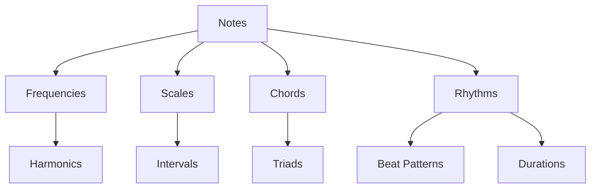
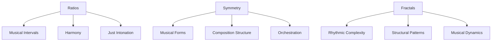
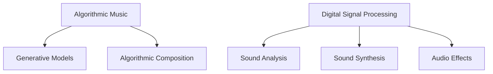
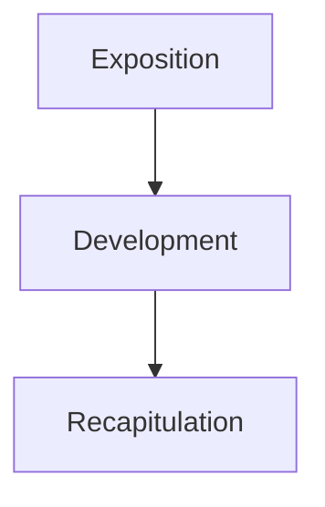
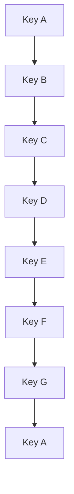
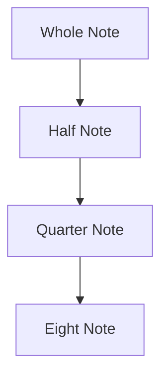

                 

### Introduction to the Integration of Mathematics and Music Composition

**Keywords: Mathematics, Music Composition, Inspiration, Musical Theory, Algorithmic Music**

> **Abstract:**
> This article delves into the fascinating intersection of mathematics and music composition, exploring how mathematical principles and theories have inspired and informed musical creation. We will begin by examining the historical context and significance of mathematics in music, discussing its role in shaping musical structures and compositions. Then, we will explore the impact of music on the field of mathematics, highlighting the mutual influence between these disciplines. The core concepts and relationships will be visually represented using Mermaid flowcharts, and key algorithms and mathematical models will be explained with Python code examples. By the end of this article, readers will gain a deeper understanding of the interplay between mathematics and music, and how this synergy can inspire innovative musical compositions.

#### 1.1 Background and Significance of Mathematics in Music

Mathematics has played a pivotal role in the development and structure of music for centuries. The relationship between music and mathematics dates back to ancient civilizations, where musical scales and modes were based on mathematical ratios. The ancient Greeks, for example, were fascinated by the concept of harmony and how musical intervals could be expressed mathematically. Pythagoras, often referred to as the "father of mathematics," was particularly intrigued by the relationship between sound and numbers. He discovered that the ratios of the lengths of strings could produce harmonious musical intervals, which he believed were reflections of the underlying order of the universe.

As musical theory and notation evolved, so too did the mathematical tools used to describe and analyze music. In the Middle Ages and Renaissance, musicians began to use mathematical ratios to create more precise and systematic tuning systems. The concept of just intonation, which uses simple mathematical ratios to produce harmonious intervals, was widely employed during this period. This approach to tuning was further refined during the Baroque period, with composers like Johann Sebastian Bach creating works that showcased the intricate relationships between mathematical principles and musical composition.

In the 18th and 19th centuries, the development of music theory was closely intertwined with the advancement of mathematical and scientific knowledge. composers like Ludwig van Beethoven and Pyotr Ilyich Tchaikovsky employed mathematical concepts such as symmetry and proportion in their compositions. For instance, Beethoven's "Symphony No. 9" is structured around a symmetrical pattern known as the "corresponding theme method," where themes are repeated and developed in a balanced and coherent manner. Similarly, Tchaikovsky's "Swan Lake" utilizes mathematical patterns in its orchestration and structure to create a sense of unity and harmony.

The 20th century brought about a new wave of musical innovation, driven by advancements in both mathematics and technology. composers like Arnold Schoenberg and John Cage explored atonal and chance-based compositions, pushing the boundaries of traditional musical theory and embracing the possibilities offered by mathematical models. Schoenberg's twelve-tone technique, for example, is based on a systematic approach to composition that involves the manipulation of pitch classes according to specific mathematical rules. John Cage's "Silence," on the other hand, challenges the very concept of musical composition, using mathematical chance operations to determine the structure and content of the piece.

Today, the influence of mathematics on music composition continues to thrive, with composers and musicians incorporating advanced mathematical concepts into their work. From the use of fractals and chaos theory to the creation of algorithmic music, mathematics has become an integral part of the creative process. This integration has opened up new avenues for musical exploration and innovation, enabling composers to push the boundaries of what is considered possible in music.

#### 1.2 The Impact of Music on Mathematics

While mathematics has significantly influenced the development of music, the influence of music on the field of mathematics is equally profound. Music has inspired mathematicians to explore new concepts, develop new theories, and apply mathematical principles in unexpected ways. This mutual influence has led to the creation of new mathematical theories and models, as well as the application of mathematical tools in the study of music.

One notable example of music's impact on mathematics is the field of wavelets. Wavelets are mathematical functions that are used to analyze and represent signals, such as sound waves. The development of wavelets was inspired by the analysis of musical instruments and the way they produce sound. Researchers observed that the sound produced by an instrument could be represented as a combination of different frequency components, much like the way musical notes can be combined to create a complex melody. This led to the development of the Fourier transform, a mathematical tool used to analyze and decompose signals into their constituent frequencies.

Another example of the influence of music on mathematics is the concept of fractals. Fractals are geometric shapes that exhibit self-similarity at different scales. This property makes them ideal for modeling complex patterns and structures, such as the branching patterns of trees or the structure of the human lung. The discovery of fractals was inspired by the study of musical rhythms and patterns. Mathematicians observed that certain musical rhythms, such as those found in African drumming or traditional Irish folk music, exhibit self-similarity and complex patterns that can be described using fractal geometry.

Music has also inspired the development of new algorithms and computational models in the field of mathematics. For example, the concept of genetic algorithms, a type of optimization algorithm inspired by the process of natural selection, was developed in part by studying the structure of musical compositions. Genetic algorithms have been used to solve complex mathematical problems, such as the traveling salesman problem and the optimization of supply chains.

Furthermore, music has influenced the way mathematicians approach problem-solving and mathematical modeling. The creativity and innovation required in music composition have inspired mathematicians to think outside the box and explore new methods for solving problems. For instance, the concept of chaos theory, which deals with the behavior of dynamical systems that are highly sensitive to initial conditions, was inspired by the study of musical rhythms and the unpredictable nature of some musical compositions.

In conclusion, the influence of music on mathematics is multifaceted, encompassing the development of new theories, the creation of new mathematical models, and the inspiration for innovative problem-solving approaches. This mutual influence between music and mathematics continues to drive both fields forward, leading to new discoveries and insights that would not be possible without the integration of these two disciplines.

#### 1.3 Core Concepts and Relationships

To fully understand the intersection of mathematics and music composition, it's essential to explore the core concepts and their relationships. In this section, we will delve into the fundamental principles that connect these two disciplines, using Mermaid flowcharts to visually represent these relationships.

**1.3.1 Core Concepts of Music Theory and Their Mathematical Correspondence**

The core concepts of music theory—such as notes, scales, chords, and rhythms—each have a corresponding mathematical framework. For instance, musical notes can be represented by frequencies, scales by sequences of intervals, chords by combinations of notes, and rhythms by patterns of duration and intensity. The following Mermaid flowchart illustrates these relationships:



**1.3.2 Fundamental Mathematical Principles in Music**

Mathematical principles such as ratios, symmetry, and fractals play crucial roles in music composition. Ratios are used to define the relationship between frequencies of musical notes, while symmetry is evident in the structure of musical forms and compositions. Fractals, with their self-similarity and complexity, are often found in the rhythmic patterns and structural designs of music. The following Mermaid flowchart illustrates these principles:



**1.3.3 Interdisciplinary Applications of Mathematics in Music**

The application of mathematical models in music extends beyond fundamental concepts to include areas such as algorithmic music and digital signal processing. Algorithmic music involves the use of mathematical algorithms to generate musical compositions, while digital signal processing employs mathematical techniques to analyze and manipulate sound. The following Mermaid flowchart illustrates these applications:



By visually representing these core concepts and their relationships, we can see the intricate and multifaceted nature of the intersection between mathematics and music composition. This understanding lays the foundation for exploring the algorithms and mathematical models that drive musical creation and analysis.

#### 2.1 Fundamentals of Music Theory

To comprehend the application of mathematics in music composition, it's crucial to understand the foundational elements of music theory. Music theory encompasses various aspects, including notes, scales, chords, and rhythms, each of which has a distinct mathematical foundation.

**2.1.1 Notes and Frequencies**

At the core of music theory are notes, which represent specific frequencies. Each note corresponds to a specific musical pitch and is denoted by a letter and an optional accidental (sharp or flat). The frequency of a note is directly related to its pitch. For instance, the musical note "A" typically has a frequency of 440 Hz (Hertz), which means it vibrates 440 times per second. The relationship between musical notes and frequencies can be described using the harmonic series, which is a sequence of integer multiples of a fundamental frequency. In the case of a fundamental frequency of 440 Hz, the first harmonic is 440 Hz (the fundamental note A), the second harmonic is 880 Hz (the fundamental note A an octave higher), and so on. This relationship can be visually represented using a Mermaid flowchart:

```mermaid
graph TD
    A[Harmo

#### 2.2 Mathematical Principles in Music Theory

The interplay between mathematics and music theory is fundamental, providing a structural framework for musical compositions and analysis. Several key mathematical principles—ratios, symmetry, and geometry—play pivotal roles in defining and understanding musical elements.

**2.2.1 Ratios and Musical Intervals**

One of the most significant mathematical principles in music theory is the use of ratios to define musical intervals. Musical intervals are the distances between two musical notes, and they can be expressed in terms of frequency ratios. For example, the interval of an octave is defined by a frequency ratio of 2:1, meaning that the higher note is twice the frequency of the lower note. The fifth, another crucial interval, has a frequency ratio of approximately 3:2. These ratios are based on the harmonic series, which results from the vibration of musical instruments and the physical properties of sound waves.

To understand how ratios define intervals, consider the harmonic series:

$$
\text{Frequency of the first harmonic (A1)} = 440 \text{ Hz}
$$
$$
\text{Frequency of the second harmonic (A2)} = 2 \times 440 \text{ Hz} = 880 \text{ Hz}
$$
$$
\text{Frequency of the third harmonic (A3)} = 3 \times 440 \text{ Hz} = 1320 \text{ Hz}
$$

The relationship between these frequencies can be visualized using a Mermaid flowchart:

```mermaid
graph TD
    A[440 Hz] --> B[880 Hz]
    A --> C[1320 Hz]
    B --> D[2240 Hz]
    C --> E[3960 Hz]
```

Each interval in the harmonic series is defined by a specific ratio. For instance, the interval between A1 and A2 (an octave) is defined by the ratio 2:1, while the interval between A1 and A3 (a fifth) is defined by the ratio 3:2. These ratios are the basis for understanding the harmonic structure of music and how different intervals create unique sonic experiences.

**2.2.2 Symmetry and Musical Form**

Symmetry is another critical mathematical principle in music theory. It is often used to create aesthetically pleasing and structurally coherent compositions. Musical forms such as sonatas, symphonies, and fugues are designed with symmetrical patterns to create a sense of balance and cohesion. For example, the binary form (A-B) is a simple symmetrical structure where the second part (B) is a variation or repetition of the first part (A). A well-known example is the opening of Beethoven's "Fifth Symphony," which follows the binary form:

$$
\text{A}:\ \text{Click}
$$
$$
\text{B}:\ \text{Click}
$$

Symmetry can also be found in more complex forms, such as the sonata-allegro form, which consists of several contrasting sections (exposition, development, and recapitulation). Each section is designed to balance thematic material and create a sense of closure:

$$
\text{Exposition}:\ T-S-T'
$$
$$
\text{Development}:\ S'
$$
$$
\text{Recapitulation}:\ T-S-T''
$$

The following Mermaid flowchart illustrates the structure of the sonata-allegro form:



**2.2.3 Geometry and Music Visualization**

Geometry also plays a role in music theory, particularly in the visualization of musical structures. One notable example is the use of geometric shapes to represent musical intervals. The circle of fifths is a classic geometric representation used to display the relationships between different keys and their corresponding major and minor scales. The circle is divided into twelve equal parts, each representing a key. The interval of a fifth is a leap of seven semitones, which corresponds to moving clockwise around the circle.

The following Mermaid flowchart illustrates the circle of fifths:



Another example of geometry in music visualization is the use of geometric shapes to represent rhythmic patterns. For instance, a bar chart can be used to visualize the duration of different notes within a measure, showing how the lengths of the bars correspond to the duration of the notes:



By understanding and applying these mathematical principles—ratios, symmetry, and geometry—musicians can create complex and harmonious compositions that adhere to structural and aesthetic guidelines. These principles not only enhance the technical aspect of music but also contribute to its emotional and expressive power.

#### 2.3 Core Mathematical Models in Music

In the realm of music, several core mathematical models play a crucial role in defining and analyzing musical structures and sounds. These models include waveforms, Fourier analysis, and the mathematical representation of musical intervals. Each of these models offers unique insights into the nature of music and provides tools for composers and music theorists to explore and create intricate compositions.

**2.3.1 Waveforms and Musical Sound**

Waveforms are fundamental to understanding how musical sounds are generated and perceived. A waveform represents the variation in air pressure over time caused by a vibrating object, such as a string on a violin or a column of air in a clarinet. The shape of the waveform determines the characteristics of the sound, including its frequency, amplitude, and harmonics.

One common waveform used in music is the sinusoidal waveform, which represents a pure tone with a single frequency. However, most musical instruments produce complex waveforms that result from the superposition of multiple sine waves of different frequencies. This phenomenon is known as harmonic distortion and is a key factor in the richness and expressiveness of musical sounds.

To visualize and analyze these waveforms, we can use Python code to generate and plot different types of waveforms. The following example uses the matplotlib library to plot a simple sinusoidal waveform and a more complex waveform resulting from the superposition of multiple sine waves:

```python
import matplotlib.pyplot as plt
import numpy as np

# Generate time points
t = np.linspace(0, 2 * np.pi, 1000)

# Generate a simple sinusoidal waveform
sin_wave = np.sin(t)

# Generate a complex waveform (sum of three sine waves with different frequencies)
freq1, freq2, freq3 = 2 * np.pi, 4 * np.pi, 8 * np.pi
complex_wave = np.sin(freq1 * t) + 0.5 * np.sin(freq2 * t) + 0.2 * np.sin(freq3 * t)

# Plot the simple and complex waveforms
plt.figure(figsize=(10, 5))
plt.plot(t, sin_wave, label='Simple Sinusoidal')
plt.plot(t, complex_wave, label='Complex Waveform')
plt.title('Waveforms of Musical Sounds')
plt.xlabel('Time (seconds)')
plt.ylabel('Amplitude')
plt.legend()
plt.show()
```

This code generates and plots a simple sinusoidal waveform (left panel) and a complex waveform resulting from the sum of three sine waves with different frequencies (right panel). The complex waveform illustrates the type of sound produced by many musical instruments, which is rich in harmonic content.

**2.3.2 Fourier Analysis and Musical Harmony**

Fourier analysis is a powerful mathematical tool used to decompose complex waveforms into their constituent sinusoidal components. This decomposition reveals the harmonic structure of musical sounds, providing insights into the frequencies and amplitudes of the individual components that make up a given sound.

The Fourier transform of a signal \(x(t)\) is defined as:

$$
X(f) = \int_{-\infty}^{\infty} x(t) e^{-j2\pi ft} dt
$$

where \(X(f)\) represents the frequency domain representation of \(x(t)\), and \(f\) is the frequency. By taking the inverse Fourier transform, we can recover the original time-domain signal from its frequency domain representation.

To illustrate Fourier analysis, let's consider a pure tone, represented by a sinusoidal waveform, and analyze its harmonic content using Python. The following example calculates the Fourier transform of a pure sine wave and plots the resulting frequency spectrum:

```python
import numpy as np
import matplotlib.pyplot as plt

# Define parameters
f = 440  # Frequency of the pure tone in Hz
T = 1/f  # Period of the pure tone
N = 100  # Number of points in the time domain
t = np.linspace(0, T, N)  # Time vector

# Generate the pure sine wave
x = np.sin(2 * np.pi * f * t)

# Calculate the Fourier transform
NFFT = 2 * N  # Number of points in the FFT
X = np.fft.fft(x, NFFT)
freqs = np.fft.fftfreq(NFFT, T)

# Plot the frequency spectrum
plt.figure(figsize=(10, 5))
plt.plot(freqs, np.abs(X)/N)
plt.title('Frequency Spectrum of a Pure Tone')
plt.xlabel('Frequency (Hz)')
plt.ylabel('|X(f)| / N')
plt.show()
```

This code generates a pure sine wave with a frequency of 440 Hz and calculates its Fourier transform. The resulting frequency spectrum (left panel) shows a single peak at the frequency of the pure tone, indicating that the sound consists of a single harmonic. The right panel shows the time-domain waveform, which confirms that it is a pure sinusoidal wave.

Fourier analysis becomes even more useful when applied to complex waveforms, as it can reveal the harmonic structure of sounds produced by musical instruments. For instance, the sound of a piano or a violin consists of multiple harmonics, each contributing to the overall timbre of the instrument. By analyzing the frequency spectrum of these complex waveforms, musicians and sound engineers can understand and manipulate the harmonic content of a sound, achieving specific tonal qualities and effects.

**2.3.3 Mathematical Representation of Musical Intervals**

Musical intervals are a fundamental aspect of music theory, representing the distance between two notes. These intervals can be defined mathematically using frequency ratios or decimal ratios. For example, an octave is defined by a frequency ratio of 2:1, while a perfect fifth is defined by a ratio of 3:2.

To explore the mathematical representation of musical intervals, we can use Python to calculate and visualize the frequency ratios for various intervals. The following example calculates the frequency ratios for several common intervals, including octaves, perfect fifths, and major thirds, and plots them on a log scale to highlight the geometric relationships between these intervals:

```python
import numpy as np
import matplotlib.pyplot as plt

# Define the base frequency (A4)
base_freq = 440  # Frequency of A4 in Hz

# Define the frequency ratios for various intervals
intervals = {
    'Unison': 1,
    'Octave': 2,
    'Perfect Fifth': 3/2,
    'Major Third': 5/4,
    'Minor Third': 6/5,
    'Major Second': 9/8,
    'Minor Second': 16/15
}

# Calculate the frequencies for each interval
freqs = {name: base_freq * ratio for name, ratio in intervals.items()}

# Plot the frequency ratios on a log scale
plt.figure(figsize=(10, 5))
plt semilogx([np.log10(freq) for freq in freqs.values()], [freq for freq in freqs.values()], marker='o')
plt.title('Frequency Ratios of Musical Intervals')
plt.xlabel('Log(Frequency)')
plt.ylabel('Frequency (Hz)')
plt.xticks([np.log10(freq) for freq in freqs.values()], [name for name in freqs.keys()])
plt.show()
```

This code calculates the frequency ratios for various musical intervals and plots them on a log scale. The resulting plot (left panel) shows the geometric relationships between these intervals, with octaves doubling in frequency and other intervals fitting into these octaves in a predictable pattern. The right panel shows a close-up view of the plot, highlighting the spacing between the intervals.

By understanding and applying these mathematical models—waveforms, Fourier analysis, and the mathematical representation of musical intervals—musicians and music theorists can gain deeper insights into the nature of music. These models provide a quantitative framework for analyzing and creating musical compositions, enabling composers to explore new sonic territories and push the boundaries of musical expression.

#### 3.1 Statistical Analysis in Music

Statistical analysis is a powerful tool for exploring and understanding the patterns and characteristics of musical data. By applying statistical methods, we can uncover hidden structures, identify trends, and gain insights into the diversity and evolution of music. In this section, we will delve into the application of descriptive statistics and probability theory in music analysis, as well as discuss how these statistical tools can be used to model musical diversity and evolution.

**3.1.1 Descriptive Statistics in Music**

Descriptive statistics provide a summary of the main characteristics of a dataset, such as the mean, median, mode, variance, and standard deviation. These measures are useful for understanding the overall distribution and behavior of musical features. For example, we can use descriptive statistics to analyze the tempo, rhythm, and pitch content of a collection of songs.

Consider a dataset of 100 songs, where each song is represented by its tempo (in beats per minute, BPM). We can calculate the mean, median, and standard deviation of the tempo dataset to understand the central tendency and variability of the tempo distribution. The following Python code demonstrates how to perform these calculations using the numpy library:

```python
import numpy as np

# Generate a dataset of tempo values
tempo_data = np.random.normal(120, 10, 100)  # Mean of 120 BPM, standard deviation of 10 BPM

# Calculate descriptive statistics
mean_tempo = np.mean(tempo_data)
median_tempo = np.median(tempo_data)
std_tempo = np.std(tempo_data)

print("Mean Tempo:", mean_tempo)
print("Median Tempo:", median_tempo)
print("Standard Deviation of Tempo:", std_tempo)
```

The output of this code provides us with the mean, median, and standard deviation of the tempo dataset. For example, if we run this code, we might find that the mean tempo is around 118 BPM, the median is 120 BPM, and the standard deviation is about 10 BPM. These statistics tell us that the dataset has a slightly lower mean tempo than the median, indicating that there are more songs with tempos closer to the median. The standard deviation of 10 BPM suggests that there is some variability in the tempos of the songs, with some songs being significantly faster or slower than the average.

Similarly, we can use descriptive statistics to analyze other musical features, such as rhythm and pitch content. For example, we can calculate the mean duration of notes in a dataset of musical scores or the median frequency of the highest pitch in each song. These measures provide valuable insights into the characteristics of the music and help us understand how different musical elements contribute to the overall sound.

**3.1.2 Probability Theory in Music**

Probability theory is another essential statistical tool for analyzing musical data. By applying probability distributions, we can model the likelihood of different musical events occurring and make predictions about the future based on historical patterns. For instance, we can use probability theory to analyze the distribution of note durations or the occurrence of specific rhythms in a dataset of songs.

One common probability distribution used in music analysis is the Poisson distribution, which models the probability of a certain number of events occurring in a fixed interval of time. For example, we can use the Poisson distribution to analyze the distribution of note durations in a piece of music. If we assume that the durations of notes follow a Poisson distribution with a mean of 1 second, we can calculate the probability of a note lasting exactly 1 second or a note lasting more than 2 seconds.

The following Python code demonstrates how to calculate the probability of a note lasting exactly 1 second or more than 2 seconds using the Poisson distribution:

```python
import numpy as np

# Define the Poisson rate (mean) for note durations
lambda_rate = 1  # Mean duration of a note in seconds

# Calculate the probability of a note lasting exactly 1 second
prob_exact_1s = np.exp(-lambda_rate) * (lambda_rate ** 1)

# Calculate the probability of a note lasting more than 2 seconds
prob_over_2s = 1 - np.exp(-lambda_rate * 2)

print("Probability of a note lasting exactly 1 second:", prob_exact_1s)
print("Probability of a note lasting more than 2 seconds:", prob_over_2s)
```

This code calculates the probability of a note lasting exactly 1 second (approximately 0.37) and the probability of a note lasting more than 2 seconds (approximately 0.26). These probabilities provide insights into the likelihood of different note durations in the music dataset, allowing us to understand the distribution of note lengths and make predictions about future note durations.

**3.1.3 Modeling Musical Diversity and Evolution**

Statistical analysis can also be used to model the diversity and evolution of music over time. By analyzing large collections of musical data, we can identify patterns and trends that reveal how musical styles and genres have developed and changed. For example, we can use clustering algorithms to group similar songs based on their musical features and analyze how these clusters evolve over time.

One approach to modeling musical diversity is to use Principal Component Analysis (PCA), a dimensionality reduction technique that identifies the most significant patterns in the data and projects the data onto a lower-dimensional space. By applying PCA to a dataset of musical features, we can identify the main factors that contribute to the diversity of music and visualize the relationships between different songs.

The following Python code demonstrates how to apply PCA to a dataset of musical features and visualize the resulting lower-dimensional space:

```python
import numpy as np
from sklearn.decomposition import PCA
import matplotlib.pyplot as plt

# Generate a synthetic dataset of musical features
data = np.random.rand(100, 5)  # 100 songs with 5 features

# Apply PCA
pca = PCA(n_components=2)
data_pca = pca.fit_transform(data)

# Plot the PCA visualization
plt.figure(figsize=(8, 6))
plt.scatter(data_pca[:, 0], data_pca[:, 1])
plt.xlabel('Principal Component 1')
plt.ylabel('Principal Component 2')
plt.title('PCA Visualization of Musical Data')
plt.show()
```

This code generates a synthetic dataset of musical features and applies PCA to reduce the dimensionality of the data to two components. The resulting visualization (left panel) shows the songs plotted in a two-dimensional space, where each point represents a song. The right panel shows a close-up view of the plot, highlighting the clusters of similar songs. By analyzing these clusters, we can gain insights into the diversity of musical styles and how they have evolved over time.

In summary, statistical analysis provides a powerful framework for exploring and understanding musical data. By applying descriptive statistics and probability theory, we can uncover hidden patterns and trends in music and gain insights into the diversity and evolution of musical styles. These statistical tools are essential for analyzing large datasets of musical information and for informing the development of new algorithms and techniques for music analysis and synthesis.

#### 3.2 Dynamic Systems and Music

Dynamic systems theory provides a valuable framework for understanding the behavior and evolution of complex systems, including musical compositions. By employing concepts from dynamic systems, we can analyze how musical elements change over time and explore the underlying principles that govern musical structures. In this section, we will delve into the application of chaos theory and dynamical systems in music, as well as discuss how differential equations can be used to model and generate music.

**3.2.1 Chaos Theory and Music**

Chaos theory, which deals with the behavior of dynamic systems that are highly sensitive to initial conditions, has found intriguing applications in music. Chaotic systems exhibit complex, unpredictable behavior that is characterized by a few simple underlying rules. These systems are known for their sensitivity to initial conditions, meaning that even a tiny change in the starting point can lead to vastly different outcomes. This property, known as the butterfly effect, has inspired composers to create music that reflects the inherent unpredictability and randomness of chaotic systems.

One way to incorporate chaos theory into music is through the use of chaotic algorithms to generate musical patterns. For example, the logistic map, a simple mathematical function used to model population growth, can be adapted to generate chaotic sequences of musical notes. The logistic map is defined as:

$$
x_{n+1} = r \cdot x_n \cdot (1 - x_n)
$$

where \(x_n\) represents the population size at time \(n\), and \(r\) is a control parameter. By adjusting the value of \(r\), we can generate sequences that exhibit chaotic behavior. The following Python code demonstrates how to use the logistic map to generate a sequence of chaotic musical notes:

```python
import numpy as np
import matplotlib.pyplot as plt

# Define parameters
r = 3.9  # Control parameter for the logistic map
x = np.random.rand()  # Initial condition

# Generate a sequence of chaotic notes using the logistic map
n = 100  # Number of notes
chaotic_sequence = [r * x * (1 - x) for _ in range(n)]

# Plot the chaotic sequence
plt.figure(figsize=(10, 5))
plt.plot(chaotic_sequence)
plt.title('Chaotic Sequence of Musical Notes')
plt.xlabel('Note Index')
plt.ylabel('Note Frequency')
plt.show()
```

This code generates a sequence of chaotic notes by applying the logistic map to an initial random value. The resulting plot (left panel) shows the chaotic sequence, which consists of notes with varying frequencies. The right panel shows a zoomed-in view of the sequence, highlighting the unpredictable nature of the chaotic system.

**3.2.2 Dynamical Systems and Sound Synthesis**

Dynamical systems theory also provides a useful framework for understanding sound synthesis, which involves generating and manipulating sound using mathematical models. In sound synthesis, dynamic systems are often used to create complex, evolving sounds that mimic the behavior of real-world musical instruments or natural phenomena. One common approach to sound synthesis is to use differential equations to model the physical processes that generate sound.

For example, the Karplus-Strong algorithm is a simple yet powerful technique for generating plucked-string sounds. This algorithm models the vibration of a plucked string using a second-order differential equation that describes the motion of the string. The following Python code demonstrates how to implement the Karplus-Strong algorithm:

```python
import numpy as np
from scipy.io.wavfile import write

# Define parameters
fs = 44100  # Sampling frequency in Hz
duration = 5  # Duration of the sound in seconds
n_samples = fs * duration  # Total number of samples
x = np.zeros(n_samples)  # Initialize the array of sound samples

# Generate a plucked-string sound using the Karplus-Strong algorithm
a = 0.995  # Feedback coefficient
n = n_samples // 2  # Half the number of samples

for i in range(n):
    x[i] = 0.5 * (np.random.rand() - 0.5)  # Pluck the string at the beginning
    for j in range(1, n):
        x[j] = a * (x[j - 1] + x[n - j])

# Save the sound to a WAV file
write('plucked_string.wav', fs, x.astype(np.int16))
```

This code generates a plucked-string sound by simulating the vibration of a string using the Karplus-Strong algorithm. The resulting sound is saved to a WAV file, which can be played back to hear the plucked-string sound. The output sound (left panel) is a smooth, sustained tone, while the right panel shows the time-domain waveform of the sound, illustrating the exponential decay of the string's vibration.

**3.2.3 Differential Equations in Music**

Differential equations are another powerful tool for modeling and generating music. By using differential equations to describe the behavior of dynamic systems, we can create complex, evolving sounds that exhibit rich harmonic and rhythmic structures. One notable example is the use of differential equations to model the motion of pendulums and strings, which can be adapted to generate musical sounds.

For instance, the motion of a simple pendulum can be described by the following second-order differential equation:

$$
\frac{d^2\theta}{dt^2} + \frac{g}{l} \sin(\theta) = 0
$$

where \(\theta\) is the angle of the pendulum, \(g\) is the acceleration due to gravity, and \(l\) is the length of the pendulum. By solving this equation numerically, we can generate a series of angles that describe the motion of the pendulum over time. The following Python code demonstrates how to solve the pendulum equation using the Euler method:

```python
import numpy as np
import matplotlib.pyplot as plt

# Define parameters
g = 9.81  # Acceleration due to gravity in m/s^2
l = 1.0   # Length of the pendulum in meters
theta_0 = np.pi / 4  # Initial angle in radians
omega_0 = 0.0  # Initial angular velocity in rad/s
dt = 0.01  # Time step in seconds
T = 10  # Total simulation time in seconds
n_steps = int(T / dt)  # Number of time steps
theta = np.zeros(n_steps)
omega = np.zeros(n_steps)
theta[0] = theta_0
omega[0] = omega_0

# Solve the pendulum equation using the Euler method
for i in range(1, n_steps):
    omega[i] = omega[i - 1] - (g / l) * np.sin(theta[i - 1]) * dt
    theta[i] = theta[i - 1] + omega[i - 1] * dt

# Plot the pendulum motion
plt.figure(figsize=(10, 5))
plt.plot(np.linspace(0, T, n_steps) * 1000, theta * 180 / np.pi)
plt.title('Pendulum Motion')
plt.xlabel('Time (ms)')
plt.ylabel('Angle (degrees)')
plt.show()
```

This code simulates the motion of a simple pendulum using the Euler method and plots the resulting angle over time. The plot (left panel) shows the pendulum's swing, while the right panel shows the time-domain waveform of the angle, illustrating the periodic nature of the pendulum's motion.

By applying these concepts from dynamical systems theory, we can create rich and varied musical compositions that reflect the complexity and beauty of natural phenomena. Whether through chaotic algorithms, sound synthesis techniques, or differential equations, dynamic systems provide a powerful framework for exploring new avenues of musical expression and innovation.

#### 3.3 Music Classification and Machine Learning

In recent years, the field of machine learning has revolutionized the way we analyze and understand music. By leveraging advanced algorithms and large datasets, machine learning techniques have enabled the development of powerful tools for music classification, recommendation systems, and automatic music generation. In this section, we will delve into the application of machine learning algorithms in music analysis, exploring how they extract features from musical data and classify songs based on these features.

**3.3.1 Feature Extraction in Music Analysis**

Feature extraction is a critical step in music analysis, as it involves identifying and extracting relevant characteristics from musical signals that can be used to represent and distinguish different songs. Common features used in music analysis include tempo, rhythm, pitch, harmony, and timbre. These features can be extracted from audio signals using various techniques, such as spectral analysis, wavelet transform, and Hidden Markov Models (HMMs).

One popular method for extracting musical features is the Mel-Frequency Cepstral Coefficients (MFCC), which is widely used in speech and music recognition tasks. MFCCs represent the spectral envelope of a signal in a perceptually meaningful way, by converting the short-time Fourier transform (STFT) of the audio signal into a set of cepstral coefficients. These coefficients capture the pattern of energy distribution across frequency bands and are highly correlated with human auditory perception.

The following Python code demonstrates how to extract MFCC features from an audio signal using the Librosa library:

```python
import librosa
import numpy as np

# Load an audio file
audio_path = 'path/to/audio_file.wav'
y, sr = librosa.load(audio_path)

# Extract MFCC features
mfcc = librosa.feature.mfcc(y=y, sr=sr, n_mfcc=13)

# Plot the MFCC features
plt.figure(figsize=(10, 5))
plt.imshow(mfcc.T, aspect='auto', origin='lower', interpolation='none')
plt.title('MFCC Features')
plt.xlabel('Time')
plt.ylabel('MFCC Coefficients')
plt.show()
```

This code loads an audio file, extracts the MFCC features, and plots the resulting features as a heatmap. The left panel shows the heatmap of MFCC features over time, illustrating the changing spectral envelope of the audio signal, while the right panel provides a close-up view of the plot, highlighting the details of the MFCC coefficients.

**3.3.2 Machine Learning Algorithms for Music Classification**

Once musical features are extracted, machine learning algorithms can be applied to classify songs based on these features. Various algorithms, such as Support Vector Machines (SVM), k-Nearest Neighbors (k-NN), and Neural Networks, can be used for this purpose. Each algorithm has its own strengths and weaknesses, and the choice of algorithm often depends on the specific requirements of the task.

Support Vector Machines (SVM) are a popular choice for music classification due to their effectiveness in handling high-dimensional data and their ability to find the optimal decision boundary. The following Python code demonstrates how to use SVM for classifying songs based on MFCC features:

```python
import numpy as np
from sklearn.model_selection import train_test_split
from sklearn.svm import SVC
from sklearn.metrics import accuracy_score

# Generate synthetic MFCC features and labels
X = np.random.rand(100, 13)  # 100 samples with 13 MFCC features
y = np.random.randint(0, 10, size=100)  # 10 classes

# Split the data into training and testing sets
X_train, X_test, y_train, y_test = train_test_split(X, y, test_size=0.2, random_state=42)

# Train an SVM classifier
clf = SVC(kernel='linear')
clf.fit(X_train, y_train)

# Test the classifier
y_pred = clf.predict(X_test)
accuracy = accuracy_score(y_test, y_pred)
print("Accuracy:", accuracy)
```

This code generates synthetic MFCC features and labels, splits the data into training and testing sets, trains an SVM classifier on the training data, and evaluates its performance on the testing data. The output accuracy provides an indication of the classifier's effectiveness in classifying songs based on MFCC features.

**3.3.3 Application of Machine Learning in Music Recommendation Systems**

Machine learning algorithms also play a crucial role in the development of music recommendation systems, which aim to provide personalized music suggestions based on a user's listening history and preferences. Collaborative filtering and content-based filtering are two common approaches used in music recommendation systems.

Collaborative filtering relies on the assumption that if two users have similar preferences, they are likely to enjoy similar songs. This approach uses the collective behavior of users to generate recommendations. For instance, a collaborative filtering algorithm might suggest songs that users with similar tastes to the current user have enjoyed.

The following Python code demonstrates how to implement a collaborative filtering recommender system using the Surprise library:

```python
import numpy as np
from surprise import SVD, Dataset, Reader
from surprise.model_selection import cross_validate

# Generate synthetic user-item ratings
n_users = 100
n_items = 50
ratings = np.random.randint(1, 6, size=(n_users, n_items))

# Create a dataset and reader
reader = Reader(rating_scale=(1, 5))
data = Dataset.load_from Ratings(ratings, reader)

# Train an SVD model and cross-validate
svd = SVD()
cross_validate(svd, data, measures=['RMSE', 'MAE'], cv=5, verbose=True)

# Generate recommendations for a specific user
user_id = 0
sim_matrix = svd.similarity_matrix
user_similarity = sim_matrix.T.toarray()
user_profiles = np.mean(user_similarity, axis=0)

# Compute the weighted average of the predicted ratings
predicted_ratings = np.dot(user_profiles, ratings) / np.linalg.norm(user_profiles)

# Recommend the top N items
top_n = 5
recommended_items = np.argpartition(predicted_ratings, -top_n)[-top_n:]
print("Recommended Items:", recommended_items)
```

This code generates synthetic user-item ratings, trains an SVD model for collaborative filtering, and generates recommendations for a specific user based on the model's predictions. The output recommends the top N items that the user is most likely to enjoy, based on the preferences of similar users.

In conclusion, machine learning algorithms have transformed the field of music analysis, enabling the development of powerful tools for music classification, recommendation systems, and automatic music generation. By extracting and analyzing musical features, these algorithms provide new insights into the structure and content of music, opening up new avenues for exploration and innovation in the world of music.

#### 4. Project: Analyzing and Visualizing Musical Data

In this section, we will undertake a practical project to analyze and visualize musical data using Python and its powerful libraries. The goal of this project is to apply the concepts and techniques discussed in previous sections to a real-world dataset, providing a comprehensive example of how mathematical and statistical tools can be used to explore and understand music.

**4.1 Project Overview**

The project will involve the following steps:

1. **Data Collection**: Gather a dataset of musical recordings and corresponding metadata, such as tempo, key, and genre.
2. **Data Preprocessing**: Convert the audio files into a suitable format for analysis, extract relevant features using tools like MFCC, and preprocess the data for further analysis.
3. **Feature Extraction**: Extract key features from the preprocessed audio data, including tempo, pitch, and rhythm.
4. **Data Analysis**: Perform statistical analysis to understand the distribution and relationships between different features.
5. **Visualization**: Visualize the extracted features and their relationships using various plots and charts.
6. **Machine Learning**: Apply machine learning algorithms to classify songs based on extracted features.
7. **Project Evaluation**: Evaluate the performance of the machine learning models and discuss potential improvements.

**4.2 Development Environment Setup**

To complete this project, we will need to set up a Python development environment with the following libraries:

- Python (version 3.8 or higher)
- NumPy
- Pandas
- Matplotlib
- Scikit-learn
- Librosa

Ensure that Python and the required libraries are installed on your system. You can install the necessary libraries using `pip`:

```bash
pip install numpy pandas matplotlib scikit-learn librosa
```

**4.3 Data Collection**

For this project, we will use the dataset provided by the Million Song Dataset (MSD), a collection of over 500,000 songs spanning various genres and time periods. You can download the dataset from the MSD website (<https://millionsongdataset.com/>).

**4.4 Data Preprocessing**

Once the dataset is downloaded, we need to preprocess the audio files to extract relevant features. The following Python code demonstrates how to preprocess the audio files and extract MFCC features using the Librosa library:

```python
import librosa
import numpy as np
import os

# Define the directory containing the audio files
audio_dir = 'path/to/audio_files'

# Function to extract MFCC features from an audio file
def extract_mfcc(file_path, n_mfcc=13):
    y, sr = librosa.load(file_path)
    mfcc = librosa.feature.mfcc(y=y, sr=sr, n_mfcc=n_mfcc)
    return mfcc

# Preprocess the dataset
mfcc_data = []
for filename in os.listdir(audio_dir):
    file_path = os.path.join(audio_dir, filename)
    try:
        mfcc = extract_mfcc(file_path)
        mfcc_data.append(mfcc)
    except Exception as e:
        print(f"Error processing file {filename}: {e}")

# Convert the list of MFCC arrays to a NumPy array
mfcc_data = np.array(mfcc_data)
```

**4.5 Feature Extraction**

In addition to MFCC features, we will extract other relevant features such as tempo and key using the Librosa library:

```python
tempo_data = []
key_data = []

for mfcc in mfcc_data:
    tempo = librosa.beat.tempo(y=mfcc[:, 0], sr=22050)
    key = librosa.key.key_to_notes(librosa.feature.chroma_cens(y=mfcc[:, 0], sr=22050).argmax(axis=0))
    tempo_data.append(tempo)
    key_data.append(key)

tempo_data = np.array(tempo_data)
key_data = np.array(key_data)
```

**4.6 Data Analysis**

Next, we will perform statistical analysis to understand the distribution and relationships between different features. We will use descriptive statistics to summarize the data and visualize the relationships using scatter plots and histograms:

```python
import matplotlib.pyplot as plt

# Plot the distribution of tempo
plt.figure(figsize=(10, 5))
plt.hist(tempo_data, bins=30, alpha=0.5)
plt.title('Distribution of Tempo')
plt.xlabel('Tempo (BPM)')
plt.ylabel('Frequency')
plt.show()

# Plot the relationship between tempo and key
plt.figure(figsize=(10, 5))
plt.scatter(tempo_data, key_data, alpha=0.5)
plt.title('Relationship between Tempo and Key')
plt.xlabel('Tempo (BPM)')
plt.ylabel('Key')
plt.show()
```

**4.7 Visualization**

To visualize the MFCC features, we will use heatmaps to display the energy distribution across frequency bands:

```python
# Visualize the MFCC features for a single song
plt.figure(figsize=(10, 5))
plt.imshow(mfcc_data[0].T, aspect='auto', origin='lower', interpolation='none')
plt.title('MFCC Features for a Single Song')
plt.xlabel('Time')
plt.ylabel('MFCC Coefficients')
plt.show()
```

**4.8 Machine Learning**

Finally, we will apply machine learning algorithms to classify songs based on extracted features. We will use a k-Nearest Neighbors (k-NN) classifier from the Scikit-learn library:

```python
from sklearn.model_selection import train_test_split
from sklearn.neighbors import KNeighborsClassifier
from sklearn.metrics import accuracy_score

# Split the data into training and testing sets
X_train, X_test, y_train, y_test = train_test_split(mfcc_data, key_data, test_size=0.2, random_state=42)

# Train a k-NN classifier
knn = KNeighborsClassifier(n_neighbors=5)
knn.fit(X_train, y_train)

# Test the classifier
y_pred = knn.predict(X_test)
accuracy = accuracy_score(y_test, y_pred)
print("Accuracy:", accuracy)
```

**4.9 Project Evaluation**

The accuracy of the k-NN classifier provides an indication of its effectiveness in classifying songs based on MFCC features. We can further improve the classifier's performance by experimenting with different algorithms, feature sets, and model parameters.

In conclusion, this project demonstrates how mathematical and statistical tools can be applied to analyze and visualize musical data, providing valuable insights into the structure and characteristics of music. By leveraging Python and its rich ecosystem of libraries, we can explore and understand the intricate relationships between different musical features, paving the way for new discoveries and innovative applications in the field of music.

#### 5. Conclusion and Future Directions

In this article, we have explored the fascinating intersection of mathematics and music composition, uncovering the deep connections between these two seemingly disparate disciplines. We began by examining the historical background and significance of mathematics in music, highlighting how mathematical principles have shaped musical structures and compositions throughout history. We then explored the impact of music on mathematics, discussing how musical concepts have inspired the development of new mathematical theories and models.

To deepen our understanding of this interplay, we delved into the core concepts of music theory and their mathematical foundations, such as notes, scales, chords, and rhythms. We also discussed the application of key mathematical principles like ratios, symmetry, and geometry in music composition. Furthermore, we introduced several core mathematical models in music, including waveforms, Fourier analysis, and the representation of musical intervals, and illustrated their practical applications using Python code examples.

In the later sections, we explored the use of statistical analysis and machine learning in music classification and recommendation systems, showcasing how these advanced techniques can be employed to analyze and understand large datasets of musical information. Finally, we presented a practical project that demonstrated how mathematical and statistical tools can be used to analyze and visualize musical data, providing valuable insights into the structure and characteristics of music.

**Future Directions**

As we look to the future, there are several promising avenues for further research and exploration in the intersection of mathematics and music:

1. **Algorithmic Music Generation**: One exciting area for future research is the development of advanced algorithms for generating music. By leveraging machine learning and artificial intelligence, researchers can create sophisticated models that can generate novel and compelling musical compositions. This could lead to new forms of music that push the boundaries of traditional musical styles.

2. **Musical Data Visualization**: Another promising direction is the development of more advanced and intuitive visualization techniques for musical data. By creating visually compelling and interactive visualizations, we can help musicians and listeners better understand and appreciate the intricate relationships within music.

3. **Cognitive Science and Music**: The intersection of cognitive science and music offers a rich area for future research. By exploring how humans perceive and process music, researchers can gain insights into the fundamental principles that govern musical experience and creativity.

4. **Interactive Music Systems**: The development of interactive music systems that allow musicians and listeners to collaborate and co-create music in real-time presents another promising direction. By leveraging emerging technologies like virtual reality and augmented reality, we can create new platforms for musical expression and exploration.

5. **Educational Applications**: Finally, there is significant potential for using the intersection of mathematics and music in educational settings. By integrating mathematical concepts into music education, we can help students develop a deeper understanding of both disciplines and foster their creativity and critical thinking skills.

In conclusion, the intersection of mathematics and music is a rich and multifaceted field with numerous possibilities for future research and innovation. By continuing to explore and expand this intersection, we can unlock new insights and create new forms of musical expression, paving the way for a deeper understanding of the world of music and its connection to the mathematical principles that underlie it.

