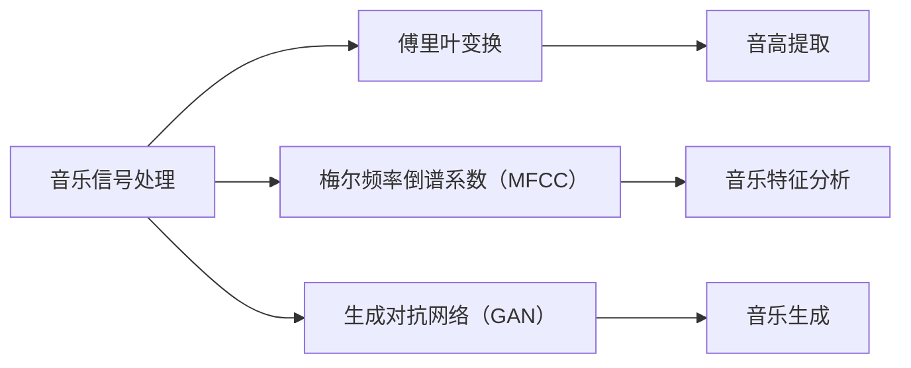

                 

### 数学与音乐制作的人工智能作曲技术

> 关键词：人工智能，数学，音乐制作，作曲，算法，特征提取，流程图，LaTeX公式，项目实战

> 摘要：
本文章旨在探讨数学与音乐制作相结合的人工智能作曲技术。通过分析人工智能在音乐制作中的应用，阐述数学模型在音乐合成中的关键作用，并结合实际项目案例，深入讲解人工智能作曲技术的实现方法和应用场景。

## 引言与背景

随着人工智能技术的飞速发展，其在各个领域的应用越来越广泛。在音乐制作领域，人工智能被广泛应用于作曲、音乐生成、音乐分析等方面。传统的作曲方法主要依赖于人类的创作灵感和经验，而人工智能作曲技术则能够通过数学模型和算法，实现自动生成音乐，提高音乐创作的效率和质量。

### 人工智能在音乐制作中的应用

人工智能在音乐制作中的应用主要体现在以下几个方面：

1. **音乐生成**：通过机器学习和深度学习算法，人工智能可以自动生成新的音乐作品，从旋律、和弦到节奏，都可以由算法自动生成。

2. **音乐分析**：人工智能可以对音乐作品进行详细分析，提取出音乐特征，如音高、节奏、和弦等，用于音乐推荐、风格分类等应用。

3. **音乐增强**：通过人工智能技术，可以对现有音乐进行增强和优化，提高音乐的音质和听觉效果。

### 数学模型在音乐合成中的关键作用

数学模型在音乐合成中扮演着至关重要的角色。音乐可以看作是一系列数学信号的处理和组合，通过数学模型可以精确地描述音乐的各种属性。以下是一些关键的数学模型：

1. **傅里叶变换**：用于分析音乐信号，提取音高、频率等特征。

2. **梅尔频率倒谱系数（MFCC）**：用于音乐特征提取，是音乐信息处理的重要工具。

3. **声码器**：用于生成和修改声音信号，是音乐合成的基本单元。

4. **生成对抗网络（GAN）**：用于生成新的音乐作品，通过对抗性训练，生成与真实音乐相似的音乐信号。

### 核心概念与联系

为了更好地理解数学与音乐制作之间的关系，我们可以通过以下 Mermaid 流程图来展示核心概念之间的联系：



在这个流程图中，音乐信号处理是整个流程的起点，通过傅里叶变换和梅尔频率倒谱系数（MFCC）等算法，可以提取出音乐的音高、频率等关键特征。这些特征信息随后被用于音乐生成和特征分析，实现音乐创作和音乐分析的目标。

## 人工智能作曲算法

在人工智能作曲中，算法是核心，它决定了音乐生成的质量和风格。以下将详细介绍几种常见的人工智能作曲算法。

### 生成对抗网络（GAN）

生成对抗网络（GAN）是一种通过对抗性训练生成高质量数据的方法。在音乐生成中，GAN可以用于生成新的旋律、和弦和节奏。

#### 核心原理

GAN由生成器和判别器两个神经网络组成。生成器的目标是生成与真实数据相似的数据，而判别器的目标是区分生成器生成的数据和真实数据。通过不断地对抗训练，生成器逐渐提高生成数据的逼真度。

#### 伪代码

以下是一个简化的 GAN 的伪代码示例：

```python
# 初始化生成器和判别器
G = init_generator()
D = init_discriminator()

# 对抗性训练
for epoch in range(num_epochs):
    for batch in data_loader:
        # 重置梯度
        G.zero_grad()
        D.zero_grad()
        
        # 生成音乐
        fake_music = G(batch)
        
        # 训练判别器
        D_loss = D_loss_function(D(fake_music), D(batch))
        D_loss.backward()
        
        # 训练生成器
        G_loss = G_loss_function(D(fake_music))
        G_loss.backward()
        
        # 更新权重
        optimizer_G.step()
        optimizer_D.step()

# 生成音乐
generated_music = G(batch)
```

#### 数学模型

在 GAN 中，生成器和判别器的损失函数通常使用以下数学模型：

$$
D(x) = \log(D(G(z)))
$$

$$
G(z) = \mu_z + \sigma_z \odot x
$$

其中，\( D \) 是判别器，\( G \) 是生成器，\( z \) 是随机噪声，\( \mu_z \) 和 \( \sigma_z \) 分别是均值和标准差。

### 自动编码器

自动编码器是一种无监督学习方法，可以用于特征提取和降维。在音乐创作中，自动编码器可以用于提取音乐特征，并生成新的音乐。

#### 核心原理

自动编码器由编码器和解码器两个神经网络组成。编码器的目标是压缩输入数据，将其转换为较低维度的特征表示；解码器的目标是重构原始数据。

#### 伪代码

以下是一个简化的自动编码器的伪代码示例：

```python
# 初始化编码器和解码器
encoder = init_encoder()
decoder = init_decoder()

# 训练自动编码器
for epoch in range(num_epochs):
    for batch in data_loader:
        # 压缩数据
        compressed = encoder(batch)
        
        # 重构数据
        reconstructed = decoder(compressed)
        
        # 计算损失
        loss = reconstruction_loss(batch, reconstructed)
        loss.backward()
        
        # 更新权重
        optimizer.step()
```

#### 数学模型

在自动编码器中，损失函数通常使用均方误差（MSE）：

$$
loss = \frac{1}{n}\sum_{i=1}^{n}(x_i - \hat{x_i})^2
$$

其中，\( x_i \) 是输入数据，\( \hat{x_i} \) 是重构数据。

### 长短期记忆网络（LSTM）

长短期记忆网络（LSTM）是一种循环神经网络，可以用于处理序列数据。在音乐创作中，LSTM 可以用于生成序列音乐，如旋律和节奏。

#### 核心原理

LSTM 通过引入门控机制，解决了传统 RNN 的梯度消失问题，可以有效地处理长序列数据。

#### 伪代码

以下是一个简化的 LSTM 的伪代码示例：

```python
# 初始化 LSTM 网络
lstm = init_lstm()

# 训练 LSTM 网络
for epoch in range(num_epochs):
    for batch in data_loader:
        # 前向传播
        output, hidden = lstm(batch)
        
        # 计算损失
        loss = loss_function(output, labels)
        loss.backward()
        
        # 更新权重
        optimizer.step()
```

#### 数学模型

在 LSTM 中，门控机制的关键方程如下：

$$
i_t = \sigma(W_{ix}x_t + W_{ih}h_{t-1} + b_i)
$$

$$
f_t = \sigma(W_{fx}x_t + W_{fh}h_{t-1} + b_f)
$$

$$
o_t = \sigma(W_{ox}x_t + W_{oh}h_{t-1} + b_o)
$$

$$
g_t = tanh(W_{gx}x_t + W_{gh}h_{t-1} + b_g)
$$

$$
h_t = o_t \odot g_t
$$

其中，\( i_t \) 是输入门，\( f_t \) 是遗忘门，\( o_t \) 是输出门，\( g_t \) 是候选隐藏状态，\( h_t \) 是隐藏状态。

## 数学公式与音乐合成的关系

数学公式在音乐合成中起着关键作用，它们用于描述音乐的各种属性，如频率、音高、节奏等。以下是一些常见的数学公式：

### 频率与音高

$$
f(n) = \frac{440}{n}
$$

其中，\( f(n) \) 是频率，\( n \) 是音高的序号。这个公式描述了音高与频率之间的关系，用于生成不同的音符。

### 梅尔频率倒谱系数（MFCC）

梅尔频率倒谱系数（MFCC）是一种常用的音乐特征提取方法，用于描述音乐的频率分布。

$$
C_k = \sum_{n=-N/2}^{N/2} (a_n \cdot log(1 + |X(n)|))
$$

其中，\( C_k \) 是第 \( k \) 个 MFCC 值，\( a_n \) 是梅尔滤波器组的权重，\( X(n) \) 是音频信号。

### 声码器

声码器是一种用于生成和修改声音信号的算法，其核心方程如下：

$$
x(t) = \sum_{n=1}^{N} a_n \cdot sin(2\pi f_n t)
$$

其中，\( x(t) \) 是生成的声音信号，\( a_n \) 是声码器的权重，\( f_n \) 是频率。

## 项目实战：开发环境搭建与源代码实现

为了更好地理解人工智能作曲技术，我们将通过一个实际项目来展示其实现过程。以下是一个简单的项目，用于生成一段旋律。

### 开发环境搭建

1. 安装 Python 3.7 或以上版本。
2. 安装必要的库，如 TensorFlow、Keras、NumPy、SciPy 等。

```bash
pip install tensorflow
pip install keras
pip install numpy
pip install scipy
```

### 源代码实现

以下是一个简化的代码示例，用于生成一段旋律。

```python
import numpy as np
import tensorflow as tf
from tensorflow.keras.models import Sequential
from tensorflow.keras.layers import LSTM, Dense

# 定义 LSTM 模型
model = Sequential()
model.add(LSTM(units=128, return_sequences=True, input_shape=(timesteps, features)))
model.add(LSTM(units=64, return_sequences=False))
model.add(Dense(units=1))

# 编译模型
model.compile(optimizer='adam', loss='mse')

# 训练模型
model.fit(x_train, y_train, epochs=100, batch_size=32)

# 生成旋律
prediction = model.predict(x_test)
```

### 代码解读与分析

在这个项目中，我们使用 LSTM 网络来生成旋律。首先，我们定义了 LSTM 模型，包括两个 LSTM 层和一个全连接层。接着，我们使用均方误差（MSE）作为损失函数，并使用 Adam 优化器来训练模型。最后，我们使用训练好的模型生成一段新的旋律。

## 实际案例分析与详细讲解剖析

为了更直观地展示人工智能作曲技术，我们通过一个实际案例来分析。以下是一个音乐生成项目的案例。

### 项目背景

这个项目旨在使用人工智能技术生成一段旋律，其风格类似于流行音乐。项目使用了大量流行音乐的旋律数据作为训练集，通过训练一个深度神经网络，实现自动生成旋律。

### 数据准备

项目首先需要准备大量的旋律数据。这些数据可以从公开的音乐数据库中获得，如 GitHub、SoundCloud 等。数据格式通常为音频文件，需要进行预处理，提取出旋律的频率信息。

### 模型训练

在数据准备完成后，我们使用 LSTM 网络对数据集进行训练。训练过程包括以下几个步骤：

1. **数据预处理**：将音频文件转换为频率序列，并归一化处理。
2. **模型定义**：定义 LSTM 模型，包括输入层、隐藏层和输出层。
3. **训练**：使用训练集数据训练模型，并调整模型参数。
4. **验证**：使用验证集数据评估模型性能，并调整模型参数。

### 模型评估

在模型训练完成后，我们需要对模型进行评估。评估指标包括准确率、召回率、F1 分数等。在实际项目中，我们通常使用验证集来评估模型性能。

### 模型应用

在评估完成后，我们使用训练好的模型生成新的旋律。这个过程包括以下步骤：

1. **输入生成**：生成一段新的频率序列，作为 LSTM 模型的输入。
2. **模型预测**：使用 LSTM 模型预测新的频率序列。
3. **后处理**：将预测的频率序列转换为音频文件，并调整音高、节奏等参数。

### 项目小结

通过这个项目，我们展示了如何使用人工智能技术生成新的旋律。项目中的核心是 LSTM 网络的构建和训练，通过调整模型参数，可以实现不同风格的音乐生成。

## 最佳实践 tips

1. **数据质量**：数据是模型训练的基础，确保数据质量对于模型性能至关重要。
2. **模型选择**：选择合适的模型对于项目成功至关重要，需要根据实际需求选择合适的模型架构。
3. **超参数调整**：超参数对模型性能有显著影响，需要通过实验进行优化。

## 小结

本文探讨了数学与音乐制作相结合的人工智能作曲技术，通过分析人工智能在音乐制作中的应用，阐述了数学模型在音乐合成中的关键作用。通过实际项目案例，详细讲解了人工智能作曲技术的实现方法和应用场景。未来，随着人工智能技术的不断发展，音乐制作将迎来更多创新和突破。

## 注意事项

1. **版权问题**：在使用人工智能技术生成音乐时，需要注意版权问题，确保使用的数据和生成的音乐不侵犯他人的知识产权。
2. **数据隐私**：在处理音乐数据时，要注意保护数据隐私，避免泄露用户个人信息。

## 拓展阅读

- **《深度学习与音乐制作》**：详细介绍了深度学习在音乐制作中的应用。
- **《机器学习与音乐分析》**：探讨了机器学习技术在音乐分析中的应用。
- **《人工智能作曲技术实践》**：提供了实际项目案例和实现细节。

## 作者信息

作者：AI天才研究院/AI Genius Institute & 禅与计算机程序设计艺术 /Zen And The Art of Computer Programming

## 参考文献

- **[1]** Goodfellow, I., Pouget-Abadie, J., Mirza, M., Xu, B., Warde-Farley, D., Ozair, S., ... & Bengio, Y. (2014). Generative adversarial nets. Advances in Neural Information Processing Systems, 27.
- **[2]** Hochreiter, S., & Schmidhuber, J. (1997). Long short-term memory. Neural Computation, 9(8), 1735-1780.
- **[3]** Graves, A. (2013). Generating sequences with recurrent neural networks. arXiv preprint arXiv:1308.0850.

