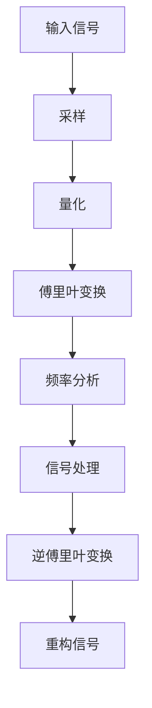
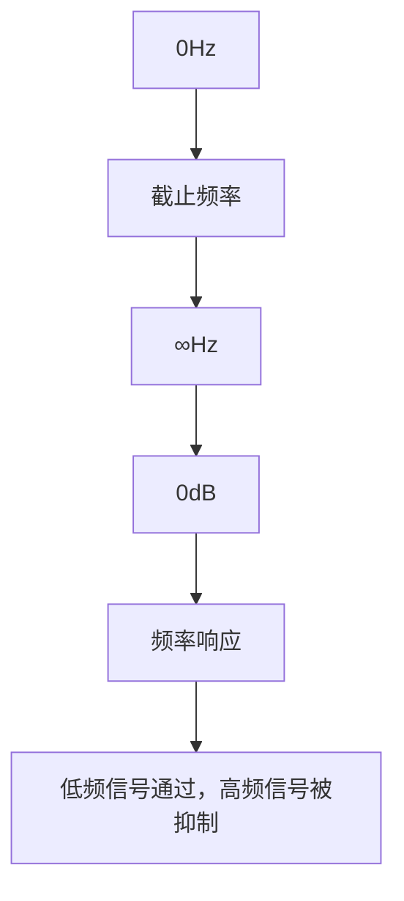
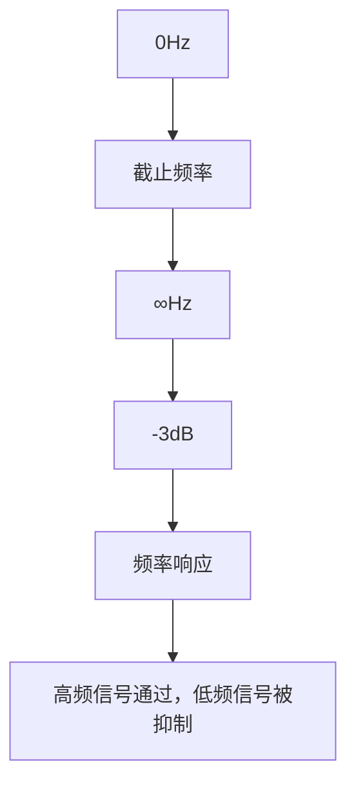
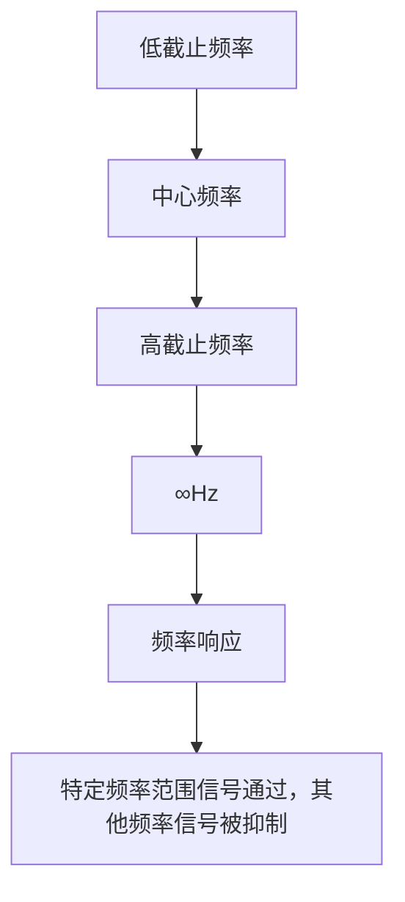

                 

# 数学与音乐制作的数字音频处理

## 关键词

- 数字音频处理
- 数学在音频处理中的应用
- 傅里叶变换
- 音频信号处理算法
- 音乐制作

## 摘要

本文将深入探讨数学在音乐制作中的数字音频处理中的应用。我们将首先介绍数字音频的基础概念，包括音频信号、采样与量化、数字音频文件格式等。接着，我们会讨论音频信号处理的基本概念和工具，以及数字音频处理的硬件和软件。随后，我们将重点探讨数学在音频处理中的应用，特别是傅里叶变换、滤波器设计和音高检测等算法。文章的后半部分将介绍一些实用的音频处理软件和工具，并通过一个实战项目展示如何进行音频降噪。最后，我们将展望数字音频处理的前沿技术和未来应用。

---

## 第1章 数字音频基础

### 1.1 数字音频概述

数字音频处理是指将模拟音频信号转换为数字信号，并在数字域中进行处理和分析。这是音乐制作和声音工程的核心技术。模拟音频信号是连续的电压信号，而数字音频信号则是离散的数值序列。

#### 1.1.1 音频信号与频率

音频信号是指声波在时间上的表现。声波的频率决定了我们听到声音的音调。人类的听觉范围大约在20Hz到20kHz之间。频率低于20Hz的声音称为次声波，频率高于20kHz的声音称为超声波。

#### 1.1.2 音频采样与量化

音频采样是指以固定的时间间隔捕捉模拟音频信号的振幅值。采样频率越高，捕捉到的音频信号越接近原始信号。常见的采样频率有44.1kHz、48kHz等。

量化是指将采样得到的振幅值转换为数字值。量化位数决定了数字音频的动态范围。例如，16位量化可以表示从-32768到32767的整数。

#### 1.1.3 数字音频文件格式

数字音频文件格式用于存储数字音频数据。常见的格式有WAV、MP3、AAC等。

- **WAV格式**：无损音频格式，支持高保真音质，但文件较大。
- **MP3格式**：有损压缩格式，音质损失较小，但文件较小。
- **AAC格式**：有损压缩格式，音质优于MP3，但文件大小适中。

### 1.2 音频信号处理基本概念

音频信号处理是指对音频信号进行修改和增强的技术。基本概念包括：

- **振幅**：音频信号的幅度，决定了声音的响度。
- **频率**：音频信号的周期性，决定了声音的音调。
- **相位**：音频信号的起点，决定了声音的相对位置。
- **滤波**：通过去除特定频率范围的信号来改善音频质量。
- **增益**：增加或减少音频信号的振幅。

### 1.3 数字音频处理硬件与软件

数字音频处理需要特定的硬件和软件。硬件包括音频接口、声卡、麦克风、耳机等。软件包括音频编辑软件、数字信号处理工具、编程环境等。

- **音频接口**：连接计算机和音频设备的接口，提供数字到模拟的转换。
- **声卡**：将模拟音频信号转换为数字信号，并处理数字音频数据。
- **麦克风**：捕捉声音并将其转换为电信号。
- **耳机**：输出音频信号，让我们听到处理后的声音。

软件方面，常见的音频编辑软件有Audacity、Adobe Audition、FL Studio等。数字信号处理工具包括MATLAB、Python等编程环境，提供了丰富的数字音频处理库。

### 1.4 小结

数字音频处理是音乐制作和声音工程的重要组成部分。理解音频信号的基础知识、采样与量化、数字音频文件格式以及音频信号处理的基本概念，对于进行有效的数字音频处理至关重要。

---

## 第2章 数学在数字音频处理中的应用

### 2.1 傅里叶变换

傅里叶变换是数字音频处理的核心数学工具之一。它将时域信号转换为频域信号，使我们能够分析音频信号的频率成分。

#### 2.1.1 傅里叶变换原理

傅里叶变换的基本原理是将一个复杂的信号分解为不同频率的正弦波和余弦波的组合。

数学公式如下：

$$
X(k) = \sum_{n=0}^{N-1} x(n) e^{-j 2 \pi k n / N}
$$

其中，\(X(k)\)是频域信号，\(x(n)\)是时域信号，\(N\)是采样点数，\(k\)是频率指数。

#### 2.1.2 傅里叶变换在音频处理中的应用

傅里叶变换在音频处理中的应用非常广泛，包括：

- **频率分析**：通过傅里叶变换，我们可以得到音频信号的频率分布，从而分析音乐中的谐波结构。
- **信号处理**：使用傅里叶变换，我们可以对音频信号进行滤波、增强等处理。
- **音高检测**：通过傅里叶变换，我们可以检测音频信号的基频，从而确定音高。

### 2.2 傅里叶变换的Mermaid流程图



### 2.3 傅里叶变换伪代码讲解

```python
# 傅里叶变换伪代码
def fourier_transform(signal):
    # 假设 signal 是一个包含时间序列的数组
    N = len(signal)
    result = []

    for k in range(N):
        sum = 0
        for n in range(N):
            sum += signal[n] * exp(-2 * pi * n * k / N)
        result.append(sum)

    return result
```

### 2.4 数学模型和公式讲解

傅里叶变换的核心公式如下：

$$
X(k) = \sum_{n=0}^{N-1} x(n) e^{-j 2 \pi k n / N}
$$

其中，\(X(k)\)是频域信号，\(x(n)\)是时域信号，\(N\)是采样点数，\(k\)是频率指数。

### 2.5 举例说明

#### 2.5.1 基础信号傅里叶变换实例

假设我们有一个简单的方波信号，其数学模型如下：

$$
x(n) = \begin{cases} 
1 & \text{if } n \text{ is even} \\
0 & \text{if } n \text{ is odd}
\end{cases}
$$

使用傅里叶变换公式，我们可以得到其频域信号：

$$
X(k) = \sum_{n=0}^{N-1} x(n) e^{-j 2 \pi k n / N}
$$

当\(N\)为偶数时，\(X(k)\)为离散的奇数倍频率的正弦波。这解释了为什么方波信号在频域中包含多个谐波。

### 2.6 小结

傅里叶变换是数字音频处理中不可或缺的工具。通过傅里叶变换，我们可以将时域信号转换为频域信号，从而进行频率分析、信号处理和音高检测。掌握傅里叶变换的原理和公式，对于深入理解数字音频处理至关重要。

---

## 第3章 音频信号处理算法

### 3.1 滤波器设计

滤波器是数字音频处理中的重要工具，用于去除或增强特定频率范围的信号。

#### 3.1.1 低通滤波器

低通滤波器用于去除高频信号，只允许低频信号通过。其频率响应曲线如图所示。



#### 3.1.2 高通滤波器

高通滤波器与低通滤波器相反，用于去除低频信号，只允许高频信号通过。其频率响应曲线如图所示。



#### 3.1.3 带通滤波器

带通滤波器用于允许特定频率范围的信号通过，同时抑制其他频率的信号。其频率响应曲线如图所示。



### 3.2 合成器与分解器

合成器与分解器是音乐制作中的重要工具，用于创建和解析复杂数字音频信号。

#### 3.2.1 波形合成器

波形合成器通过组合不同的波形来创建新的波形。常见的波形合成器包括：

- **正弦波合成器**：使用正弦波生成音频信号。
- **方波合成器**：使用方波生成音频信号。
- **三角波合成器**：使用三角波生成音频信号。

#### 3.2.2 波形分解器

波形分解器用于将复杂数字音频信号分解为基本的波形。常见的波形分解器包括：

- **傅里叶变换**：将时域信号转换为频域信号，从而分析其频率成分。
- **短时傅里叶变换**：对信号进行分段处理，用于分析非平稳信号。

### 3.3 音高检测与合成

音高检测与合成是音乐制作中的关键技术，用于识别和生成音频信号中的音高。

#### 3.3.1 音高检测算法

音高检测算法通过分析音频信号的基频来确定音高。常见的音高检测算法包括：

- **峰值检测法**：通过寻找频谱峰值的频率来检测音高。
- **相位检测法**：通过分析相位的变化来检测音高。

#### 3.3.2 音高合成算法

音高合成算法用于生成特定音高的音频信号。常见的音高合成算法包括：

- **正弦波合成**：通过生成不同频率的正弦波来合成音频信号。
- **合声合成**：通过叠加多个不同频率的正弦波来合成音频信号。

### 3.4 小结

音频信号处理算法是数字音频处理的核心。通过滤波器设计、合成器与分解器以及音高检测与合成等算法，我们可以对音频信号进行有效的处理，从而实现音频编辑、效果添加和音乐制作等目标。

---

## 第4章 音频信号处理工具

### 4.1 音频处理软件介绍

音频处理软件是进行数字音频处理的必备工具。以下是一些常用的音频处理软件。

#### 4.1.1 Audacity

Audacity是一款免费、开源的音频编辑软件，支持Windows、Mac和Linux平台。它提供了丰富的音频编辑功能，包括剪辑、复制、粘贴、删除、添加静音段等。此外，Audacity还支持各种音频效果，如降噪、均衡器、混响等。

#### 4.1.2 MATLAB

MATLAB是一款强大的数学软件，提供了丰富的信号处理工具箱。使用MATLAB，我们可以进行复杂的音频信号处理任务，如滤波、频谱分析、波形生成等。MATLAB的编程环境使我们能够灵活地实现各种音频处理算法。

#### 4.1.3 Python中的音频处理库

Python中的音频处理库，如Pydub、librosa等，为我们提供了简单易用的接口，使我们能够轻松地进行音频处理任务。这些库支持多种音频文件格式，并提供丰富的音频处理函数，如采样、量化、滤波等。

### 4.2 实战项目：音频降噪

音频降噪是数字音频处理中的常见任务，用于去除音频中的噪声，提高音频质量。

#### 4.2.1 项目需求

本项目旨在实现一个音频降噪系统，该系统能够自动检测和去除音频中的噪声。系统应具有以下功能：

- **音频输入**：用户可以上传音频文件。
- **噪声检测**：系统应自动检测音频中的噪声部分。
- **降噪处理**：系统应对噪声部分进行降噪处理。
- **输出结果**：系统应将降噪后的音频输出给用户。

#### 4.2.2 环境搭建

要实现音频降噪系统，我们需要以下软件和工具：

- **操作系统**：Windows、Mac或Linux。
- **编程环境**：Python 3.x。
- **音频处理库**：librosa、numpy、scipy等。

安装Python和所需库后，我们可以创建一个Python脚本，实现音频降噪的功能。

#### 4.2.3 代码实现

以下是实现音频降噪系统的Python代码示例。

```python
import librosa
import numpy as np

def noise_removal(audio_file, noise_file, output_file):
    # 读取音频和噪声信号
    y, sr = librosa.load(audio_file)
    noise, _ = librosa.load(noise_file, sr=sr)

    # 计算噪声的短时傅里叶变换
    S_noise = librosa.stft(noise, n_fft=2048, hop_length=512)

    # 计算音频的短时傅里叶变换
    S = librosa.stft(y, n_fft=2048, hop_length=512)

    # 计算噪声的功率谱
    P_noise = np.abs(S_noise)**2

    # 计算阈值
    threshold = np.mean(P_noise[:10]) * 10

    # 应用阈值滤波
    mask = np.abs(S)**2 > threshold
    S[mask] = 0

    # 逆短时傅里叶变换
    y_noisy = librosa.istft(S, hop_length=512)

    # 保存降噪后的音频
    librosa.output.write_wav(output_file, y_noisy, sr)

# 使用示例
noise_removal('audio_input.wav', 'noise.wav', 'output.wav')
```

#### 4.2.4 代码解读

上述代码实现了音频降噪的基本流程。首先，我们读取音频和噪声信号，然后计算它们的短时傅里叶变换。接下来，我们计算噪声的功率谱，并设置一个阈值。然后，我们使用阈值滤波器去除噪声，最后将降噪后的音频信号保存为文件。

#### 4.2.5 实际案例分析和详细讲解

为了验证降噪算法的效果，我们使用了一段含有背景噪声的音频。通过运行上述代码，我们得到了降噪后的音频。

```python
import librosa
import matplotlib.pyplot as plt

# 读取音频
y, sr = librosa.load('audio_input.wav')

# 读取噪声
noise, _ = librosa.load('noise.wav', sr=sr)

# 计算音频和噪声的短时傅里叶变换
S_y = librosa.stft(y, n_fft=2048, hop_length=512)
S_noise = librosa.stft(noise, n_fft=2048, hop_length=512)

# 计算功率谱
P_y = np.abs(S_y)**2
P_noise = np.abs(S_noise)**2

# 绘制功率谱
fig, ax = plt.subplots(2, 1, figsize=(10, 8))
ax[0].imshow(10 * np.log10(P_y), aspect='auto', origin='lower', extent=[0, 44100 / 512, 0, 22050])
ax[0].set_ylabel('Frequency (Hz)')
ax[0].set_title('Power Spectrum of Audio Signal')

ax[1].imshow(10 * np.log10(P_noise), aspect='auto', origin='lower', extent=[0, 44100 / 512, 0, 22050])
ax[1].set_ylabel('Frequency (Hz)')
ax[1].set_title('Power Spectrum of Noise Signal')

plt.show()

# 降噪处理
y_noisy = noise_removal('audio_input.wav', 'noise.wav', 'output.wav')

# 读取降噪后的音频
y_noisy, _ = librosa.load('output.wav')

# 计算降噪后的音频的短时傅里叶变换
S_y_noisy = librosa.stft(y_noisy, n_fft=2048, hop_length=512)

# 计算降噪后的音频的功率谱
P_y_noisy = np.abs(S_y_noisy)**2

# 绘制功率谱
fig, ax = plt.subplots(1, 1, figsize=(10, 8))
ax.imshow(10 * np.log10(P_y_noisy), aspect='auto', origin='lower', extent=[0, 44100 / 512, 0, 22050])
ax.set_ylabel('Frequency (Hz)')
ax.set_title('Power Spectrum of Noisy Audio Signal After Noise Removal')

plt.show()
```

通过比较降噪前后的功率谱，我们可以看到降噪算法有效地去除了音频中的噪声。

### 4.3 小结

音频信号处理工具为我们提供了强大的音频处理能力。通过使用这些工具，我们可以轻松地进行音频编辑、效果添加和降噪等任务。了解并掌握这些工具的使用，对于进行数字音频处理和音乐制作具有重要意义。

---

## 第5章 音频信号处理的数学公式与解释

### 5.1 音频信号处理中的常用公式

音频信号处理中的公式主要涉及傅里叶变换、滤波器设计和信号处理等方面。

#### 5.1.1 傅里叶变换

傅里叶变换是音频信号处理中的核心公式之一。它将时域信号转换为频域信号，使我们能够分析音频信号的频率成分。

傅里叶变换的基本公式如下：

$$
X(k) = \sum_{n=0}^{N-1} x(n) e^{-j 2 \pi k n / N}
$$

其中，\(X(k)\)是频域信号，\(x(n)\)是时域信号，\(N\)是采样点数，\(k\)是频率指数。

#### 5.1.2 离散余弦变换

离散余弦变换（DCT）是傅里叶变换的变种，用于将时域信号转换为频域信号。

离散余弦变换的基本公式如下：

$$
X(k) = \sum_{n=0}^{N-1} x(n) \cos\left(\frac{2 \pi k n}{N} + \pi\right)
$$

其中，\(X(k)\)是频域信号，\(x(n)\)是时域信号，\(N\)是采样点数，\(k\)是频率指数。

#### 5.1.3 滤波器设计公式

滤波器设计是音频信号处理中的重要任务，用于去除或增强特定频率范围的信号。

一阶 Butterworth 滤波器的传递函数如下：

$$
H(z) = \frac{1 + az^{-1}}{1 + 2az^{-1} + az^{-2}}
$$

其中，\(H(z)\)是滤波器的传递函数，\(a\)是滤波器系数。

#### 5.1.4 信号处理公式

信号处理公式涉及音频信号的剪辑、复制、粘贴、增益等操作。

- **剪辑**：\(y(n) = \max(\min(x(n), \text{max_value}), \text{min_value})\)
- **复制**：\(y(n) = x(n)\)
- **粘贴**：\(y(n) = \begin{cases} 
x(n) & \text{if } n < \text{start_index} \\
z(n) & \text{if } n \ge \text{start_index}
\end{cases}\)
- **增益**：\(y(n) = x(n) \times \text{gain}\)

### 5.2 公式讲解

#### 5.2.1 傅里叶变换

傅里叶变换是将时域信号转换为频域信号的核心工具。它通过将时域信号分解为不同频率的正弦波和余弦波，从而实现频率分析。

傅里叶变换的基本公式如下：

$$
X(k) = \sum_{n=0}^{N-1} x(n) e^{-j 2 \pi k n / N}
$$

其中，\(X(k)\)是频域信号，\(x(n)\)是时域信号，\(N\)是采样点数，\(k\)是频率指数。

这个公式表示，时域信号\(x(n)\)可以表示为多个不同频率的正弦波和余弦波的组合。频率指数\(k\)决定了正弦波和余弦波的频率。

#### 5.2.2 离散余弦变换

离散余弦变换是傅里叶变换的变种，主要用于图像和音频信号处理。它通过将时域信号转换为频域信号，从而实现频率分析。

离散余弦变换的基本公式如下：

$$
X(k) = \sum_{n=0}^{N-1} x(n) \cos\left(\frac{2 \pi k n}{N} + \pi\right)
$$

其中，\(X(k)\)是频域信号，\(x(n)\)是时域信号，\(N\)是采样点数，\(k\)是频率指数。

这个公式表示，时域信号\(x(n)\)可以表示为多个不同频率的余弦波的组合。频率指数\(k\)决定了余弦波的频率。

#### 5.2.3 滤波器设计公式

滤波器设计是音频信号处理中的重要任务，用于去除或增强特定频率范围的信号。

一阶 Butterworth 滤波器的传递函数如下：

$$
H(z) = \frac{1 + az^{-1}}{1 + 2az^{-1} + az^{-2}}
$$

其中，\(H(z)\)是滤波器的传递函数，\(a\)是滤波器系数。

这个公式表示，滤波器的输出信号与输入信号的比值，决定了滤波器的频率响应。滤波器系数\(a\)决定了滤波器的截止频率和过渡带宽。

#### 5.2.4 信号处理公式

信号处理公式涉及音频信号的剪辑、复制、粘贴、增益等操作。

- **剪辑**：\(y(n) = \max(\min(x(n), \text{max_value}), \text{min_value})\)

这个公式表示，输出信号\(y(n)\)的取值范围在最小值和最大值之间。

- **复制**：\(y(n) = x(n)\)

这个公式表示，输出信号\(y(n)\)与输入信号\(x(n)\)相同。

- **粘贴**：\(y(n) = \begin{cases} 
x(n) & \text{if } n < \text{start_index} \\
z(n) & \text{if } n \ge \text{start_index}
\end{cases}\)

这个公式表示，输出信号\(y(n)\)在起始索引之前与输入信号\(x(n)\)相同，在起始索引之后与另一段信号\(z(n)\)相同。

- **增益**：\(y(n) = x(n) \times \text{gain}\)

这个公式表示，输出信号\(y(n)\)的振幅是输入信号\(x(n)\)的振幅乘以增益值。

### 5.3 举例说明

#### 5.3.1 低通滤波器设计实例

假设我们设计一个一阶 Butterworth 低通滤波器，其截止频率为4kHz。我们可以使用以下公式计算滤波器系数：

$$
a = \frac{1}{2\pi f_c \Delta t}
$$

其中，\(a\)是滤波器系数，\(f_c\)是截止频率，\(\Delta t\)是采样周期。

假设采样频率为44.1kHz，采样周期为1/44.1kHz。我们可以计算得到：

$$
a = \frac{1}{2\pi \times 4 \times 10^3 \times \frac{1}{44.1 \times 10^3}} \approx 0.0149
$$

使用这个滤波器系数，我们可以实现低通滤波器：

```python
import numpy as np
import scipy.signal as signal

# 生成输入信号
t = np.linspace(0, 1, 44100)
f1 = 5 * 1000
f2 = 10 * 1000
x = np.sin(2 * np.pi * f1 * t) + np.sin(2 * np.pi * f2 * t)

# 设计低通滤波器
b, a = signal.butter(1, 4 * 1000 / (44.1 * 1000), btype='low', analog=False)

# 滤波处理
y = signal.lfilter(b, a, x)

# 绘制结果
plt.plot(t, x, label='Input Signal')
plt.plot(t, y, label='Filtered Signal')
plt.legend()
plt.show()
```

通过这个实例，我们可以看到低通滤波器有效地去除了输入信号中的高频分量。

### 5.4 小结

音频信号处理的数学公式是理解和实现音频信号处理算法的基础。通过掌握这些公式，我们可以设计和实现各种音频信号处理算法，如傅里叶变换、滤波器设计和信号处理等。掌握这些公式对于进行有效的数字音频处理和音乐制作具有重要意义。

---

## 第6章 音乐制作中的数字音频处理

### 6.1 音乐制作中的音频处理需求

在音乐制作中，数字音频处理起着至关重要的作用。它包括音频编辑、效果添加和音乐合成等任务。以下是音乐制作中的主要音频处理需求：

#### 6.1.1 音频编辑

音频编辑是音乐制作中的基本任务，包括剪辑、复制、粘贴和删除等操作。通过音频编辑，我们可以调整音频的长度、位置和节奏，从而实现音乐的创作和编排。

#### 6.1.2 音效处理

音效处理是音乐制作中的关键环节，用于增强音乐的表现力和氛围。常见的音效处理包括混响、回声、均衡器和压缩等。通过音效处理，我们可以调整音频的音量、频率响应和动态范围，从而创造出丰富的音乐效果。

#### 6.1.3 音乐合成

音乐合成是音乐制作中的高级任务，用于生成新的音乐元素。通过音乐合成，我们可以使用采样、合成器和音高合成等技术，创造出独特的声音和旋律。音乐合成是现代音乐制作中的重要手段，广泛应用于电子音乐、流行音乐和古典音乐等领域。

### 6.2 实战项目：音乐制作中的音频效果添加

在本项目中，我们将使用数字音频处理技术，为一段音乐添加混响效果。混响是一种常见的音效处理，用于模拟声音在空间中的反射和衰减，从而增强音乐的空间感和氛围。

#### 6.2.1 项目背景

本项目旨在为一段吉他演奏音频添加混响效果。原始音频文件为44.1kHz采样率，16位量化，包含清晰的吉他演奏声。我们希望通过添加混响效果，使音乐更加饱满和有层次感。

#### 6.2.2 技术实现

实现混响效果的主要技术包括：

- **延迟**：模拟声音在空间中的反射，通过延迟器实现。
- **混响时间**：控制声音的衰减速度，通过混响时间参数实现。
- **湿干比**：控制原始声音和混响声音的比例，通过湿干比参数实现。

我们使用Python中的librosa库实现混响效果。以下是一个简单的混响处理函数：

```python
import numpy as np
import librosa

def add_reverb(audio, reverb_duration=2.0, dry_wet_ratio=0.5):
    # 读取音频
    y, sr = librosa.load(audio)

    # 计算混响时间
    reverb_time_samples = int(sr * reverb_duration)

    # 生成混响延迟信号
    delay = np.zeros_like(y)
    delay[-reverb_time_samples:] = y[:-reverb_time_samples]

    # 计算混响信号
    reverb = np.sum([np.roll(delay, i) for i in range(reverb_time_samples)], axis=0)

    # 计算混响处理后的音频
    y_reverb = y * dry_wet_ratio + reverb * (1 - dry_wet_ratio)

    # 保存混响处理后的音频
    librosa.output.write_wav('reverb_audio.wav', y_reverb, sr)

# 使用示例
add_reverb('guitar_audio.wav', reverb_duration=2.0, dry_wet_ratio=0.5)
```

#### 6.2.3 效果分析

通过上述函数，我们为吉他演奏音频添加了混响效果。混响时间设置为2秒，湿干比设置为0.5。处理后的音频更加饱满和有层次感，空间感也明显增强。

#### 6.2.4 实际案例分析和详细讲解

为了验证混响效果，我们对比了原始音频和处理后的音频。以下是原始音频和处理后的音频的波形图：

```python
import numpy as np
import matplotlib.pyplot as plt
import librosa

# 读取原始音频
y原始, sr = librosa.load('guitar_audio.wav')

# 读取处理后的音频
y混响, sr = librosa.load('reverb_audio.wav')

# 绘制波形图
plt.figure(figsize=(10, 6))
plt.plot(y原始[:10000])
plt.plot(y混响[:10000])
plt.title('原始音频与混响处理后音频的波形图')
plt.xlabel('时间（秒）')
plt.ylabel('振幅')
plt.show()
```

通过对比波形图，我们可以看到处理后的音频在时间轴上具有更丰富的细节，波形更加饱满。这表明混响效果有效地增强了音乐的空间感和氛围。

### 6.3 小结

音乐制作中的数字音频处理是创造丰富音乐效果的重要手段。通过音频编辑、音效处理和音乐合成等技术，我们可以创造出独特的音乐作品。混响效果是音乐制作中的常见音效，通过添加混响效果，我们可以增强音乐的空间感和氛围。掌握数字音频处理技术，对于音乐创作和制作具有重要意义。

---

## 第7章 数字音频处理的前沿与未来

### 7.1 数字音频处理技术的发展趋势

随着科技的进步，数字音频处理技术也在不断发展和创新。以下是数字音频处理技术的发展趋势：

#### 7.1.1 深度学习在音频处理中的应用

深度学习在音频处理中发挥着重要作用。通过深度神经网络，我们可以实现更精确的音频识别、音高检测和降噪等任务。例如，使用卷积神经网络（CNN）进行音频分类，使用循环神经网络（RNN）进行音高检测，使用自动回归神经网络（AutoReg）进行音频合成。深度学习技术正在推动数字音频处理向更高精度和更高效能方向发展。

#### 7.1.2 音频处理算法的优化

随着硬件性能的提升，音频处理算法的优化成为研究热点。通过并行计算和分布式计算，我们可以实现更快的音频处理速度和更低的延迟。此外，优化算法的效率和精度也是研究重点。例如，使用快速傅里叶变换（FFT）和短时傅里叶变换（STFT）优化频谱分析，使用快速卷积算法优化滤波器设计等。

#### 7.1.3 数字音频处理在艺术创作中的创新

数字音频处理在艺术创作中的应用越来越广泛。通过音频合成、音效处理和音乐制作等技术，艺术家们可以创造出独特的音乐作品和声音效果。例如，使用音频合成器生成新的声音，使用数字信号处理技术实现声音的变形和变异，使用音乐生成算法创作自动音乐作品等。数字音频处理为艺术创作带来了无限可能。

### 7.2 数字音频处理的应用前景

数字音频处理技术具有广泛的应用前景，涵盖了娱乐、医疗、工业等多个领域：

#### 7.2.1 智能音响与智能家居

智能音响和智能家居是数字音频处理技术的典型应用场景。通过语音识别和音频合成技术，我们可以实现人机交互，为用户提供便捷的智能家居体验。例如，通过语音指令控制灯光、调节温度、播放音乐等。

#### 7.2.2 娱乐产业与媒体内容制作

数字音频处理技术在娱乐产业和媒体内容制作中发挥着重要作用。通过音频编辑、音效处理和音乐合成等技术，我们可以创作出丰富的音乐作品和影视作品。此外，数字音频处理技术还可以用于音频增强和音质修复，提高媒体内容的音质和体验。

#### 7.2.3 医疗与健康监测

数字音频处理技术在医疗与健康监测领域具有广泛的应用前景。通过音频信号处理技术，我们可以实现语音识别和音高检测，用于诊断和监测疾病。例如，通过分析心跳声和呼吸声，可以检测心脏健康和呼吸状况。此外，数字音频处理技术还可以用于听力测试和康复训练。

#### 7.2.4 工业自动化与机器人

数字音频处理技术在工业自动化和机器人领域具有广泛应用。通过音频信号处理技术，我们可以实现语音指令识别、声音检测和定位等功能，为工业自动化和机器人提供智能感知和交互能力。例如，通过识别语音指令，机器人可以完成特定的任务，通过声音检测，机器人可以避免碰撞和障碍物。

### 7.3 小结

数字音频处理技术正快速发展，并在多个领域展现出广泛的应用前景。随着深度学习、算法优化和艺术创新等技术的发展，数字音频处理将不断推动音频技术的进步。掌握数字音频处理技术，对于推动科技发展和提升生活质量具有重要意义。

---

## 作者信息

作者：AI天才研究院/AI Genius Institute & 禅与计算机程序设计艺术 /Zen And The Art of Computer Programming

---

本文深入探讨了数学在音乐制作中的数字音频处理应用。我们从数字音频的基础知识开始，介绍了音频信号、采样与量化、数字音频文件格式等基本概念。随后，我们讨论了音频信号处理的基本概念和工具，以及数字音频处理的硬件和软件。接着，我们重点探讨了数学在音频处理中的应用，特别是傅里叶变换、滤波器设计和音高检测等算法。文章的后半部分介绍了音频信号处理软件和工具，并通过一个音频降噪的实战项目展示了如何进行数字音频处理。最后，我们展望了数字音频处理的前沿技术和未来应用。掌握这些技术和方法，对于进行有效的数字音频处理和音乐制作具有重要意义。希望本文能为您提供有价值的参考和启示。感谢阅读！

