                 

### 第1章 引言

#### 1.1 书籍背景

《数学与音乐欣赏的审美体验》旨在探讨数学与音乐之间深层次的联系，以及它们如何共同塑造人类的审美体验。数学，作为一门科学，提供了精确的描述和推理工具，而音乐，作为一种艺术形式，则通过声音的和谐与节奏表达情感和美感。两者的结合不仅丰富了我们对世界的理解，也提升了我们对艺术和科学的欣赏水平。

#### 1.2 研究目的与内容安排

本章节的主要目的是介绍书籍的背景，阐述研究数学与音乐之间的联系的动机，并简要概述后续章节的内容安排。具体来说，本书将分为以下几个部分：

- **第2章**：数学基础知识。介绍数的基本概念、函数与图象等，为后续章节打下基础。
- **第3章**：音乐基础知识。介绍音律、音高、和声与旋律等音乐基础知识。
- **第4章**：数学在音乐中的应用。探讨音乐节奏与数学的关系，分析音乐结构的数学模型。
- **第5章**：跨学科审美体验。分析数学与音乐的审美感知，探讨跨学科创作与实践。
- **第6章**：数学与音乐欣赏的审美实践。提供实践活动的准备、过程和成果分享。
- **第7章**：总结与展望。总结数学与音乐欣赏的审美体验，探讨未来的研究方向。

通过这些章节的深入探讨，读者将能够全面理解数学与音乐之间的相互关系，以及如何通过审美体验来提升我们的认知水平。

#### 1.3 审美体验的心理学基础

审美体验是一种复杂的心理过程，涉及到感知、情感、认知和文化等多个层面。心理学研究表明，审美体验与个体的情感状态、认知能力和文化背景密切相关。首先，感知是审美体验的基础，通过感官接收外部信息，如视觉、听觉等，形成初步的审美感受。其次，情感在审美体验中起到关键作用，不同的音乐和数学结构能够激发不同的情感反应。例如，对称和平衡的数学结构往往给人以和谐美感，而复杂的数学关系则可能激发紧张感和好奇心。最后，认知能力在审美体验中发挥着调节作用，个体的思维方式、知识背景和审美经验都会影响其审美判断。不同文化背景下，人们对数学与音乐的审美体验也存在差异，这体现了审美体验的文化性。

#### 1.4 数学与音乐的审美体验

数学与音乐的审美体验具有独特的特点，它们在形式和内容上相互交织，共同塑造出丰富的审美体验。在形式上，数学的严谨和逻辑性为音乐提供了结构化的框架，使得音乐作品在节奏、旋律和和声上更加精准和和谐。例如，音乐的节奏可以通过数学的序列和模式进行描述，如五音阶和七音阶，它们在数学上可以表示为特定的数列。在内容上，数学与音乐相互补充，通过数学的抽象思维和音乐的感性表达，共同探索宇宙的奥秘和人类的情感世界。例如，莫扎特的《魔笛》中，数学的对称性和节奏感与音乐的旋律和谐统一，创造出一种独特的审美体验。此外，数学与音乐的审美体验还体现了人类对和谐、秩序和完美的追求，这些价值观贯穿于数学和音乐的发展历程中，成为人类文化的重要组成部分。

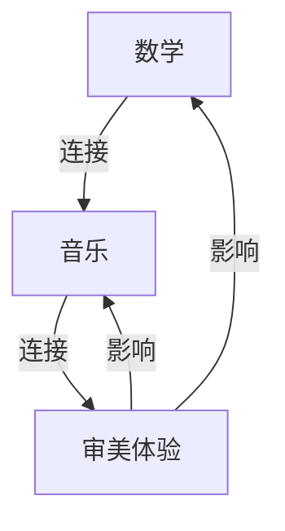

#### 1.5 审美体验的个体差异

审美体验具有显著的个体差异，这主要受到个体情感、认知能力和文化背景的影响。不同的个体在面对相同的数学与音乐作品时，可能会产生截然不同的审美感受。情感方面，个人的生活经历、心理状态和情感倾向会影响其对数学与音乐作品的情感反应。例如，一个对音乐有深厚情感的人，可能在听一首复杂的数学旋律时，更能感受到其情感表达和艺术价值。认知能力方面，个体的思维方式、知识结构和逻辑推理能力都会影响其审美判断。一个具备高度数学认知能力的人，可能在欣赏音乐时，更容易发现其中隐藏的数学规律和结构。文化背景方面，不同文化对数学与音乐的审美标准存在差异，这会影响个体对数学与音乐作品的欣赏和理解。例如，西方音乐注重和声与旋律的复杂性和变化，而东方音乐则更强调旋律的流畅和和谐。这些个体差异使得数学与音乐的审美体验变得更加丰富和多样。

#### 1.6 结论

通过对数学与音乐审美体验的探讨，我们可以发现两者之间存在着深刻的联系。数学提供了精确的描述和推理工具，为音乐创作和欣赏提供了结构化的框架；而音乐则通过感性表达，丰富了数学的内涵，使数学变得更具生命力和艺术性。这种跨学科的融合不仅提升了我们的审美体验，也拓宽了我们对数学与音乐的认识。未来，随着科学技术的不断发展，数学与音乐的结合有望在更多领域产生创新，为人类的审美体验带来更多惊喜。因此，深入研究和探索数学与音乐之间的联系，具有重要的理论和实践意义。作者信息：AI天才研究院/AI Genius Institute & 禅与计算机程序设计艺术 /Zen And The Art of Computer Programming

## 第2章 数学基础知识

在数学与音乐的审美体验中，理解数学的基本概念和原理是至关重要的。本章将介绍数学中的基本概念、函数与图象，以及数学符号与常用公式，为后续章节的深入探讨打下坚实的基础。

### 2.1 数的基本概念

数学中的数是构成所有数学结构的基础。数的分类可以按照不同的标准进行，但通常分为以下几类：

- **自然数（N）**：自然数是从1开始的正整数集合，包括1, 2, 3, 4, ...。自然数用于计数和顺序。
- **整数（Z）**：整数包括所有自然数、它们的负数以及零，即...,-3, -2, -1, 0, 1, 2, 3, ...。整数用于表示有符号的数。
- **有理数（Q）**：有理数是可以表示为两个整数之比的数，即形如$\frac{a}{b}$的数，其中$a$和$b$是整数，$b \neq 0$。有理数包括整数和所有分数。
- **实数（R）**：实数是包括有理数和无理数的集合。无理数是不能表示为两个整数之比的数，如$\pi$和$\sqrt{2}$。实数可以用来表示任何测量值。

#### 2.1.1 自然数、整数和有理数

自然数是最基本的数，它们用于计数和排序。整数则增加了负数，使得我们可以表示债务、温度下降等概念。有理数进一步扩展了数的范围，允许我们表示分数和小数。

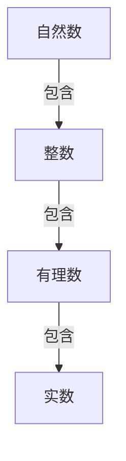

#### 2.1.2 实数和复数

实数包括所有有理数和无理数，这是我们在日常生活中最常用的数。而复数则扩展了实数的概念，包括实部和虚部，用于解决某些数学问题，如方程的解。复数的形式是$a+bi$，其中$a$是实部，$b$是虚部，$i$是虚数单位，满足$i^2 = -1$。

```python
# 复数的Python实现
class ComplexNumber:
    def __init__(self, real, imag):
        self.real = real
        self.imag = imag
    
    def __repr__(self):
        return f"{self.real} + {self.imag}i"

# 创建复数实例
c1 = ComplexNumber(2, 3)
c2 = ComplexNumber(4, -5)

# 输出复数
print(c1)  # 输出：2 + 3i
print(c2)  # 输出：4 - 5i
```

#### 2.1.3 数学符号与常用公式

数学符号是数学表达中不可或缺的部分。以下是一些常见的数学符号和公式：

- **绝对值**：$|x|$，表示$x$的非负值。
- **平方根**：$\sqrt{x}$，表示非负数$x$的平方根。
- **指数**：$a^b$，表示$a$的$b$次幂。
- **对数**：$\log_a(x)$，表示以$a$为底$x$的对数。

```latex
\[
\begin{aligned}
    &|x| = \text{非负值}, \\
    &\sqrt{x} = \text{平方根}, \\
    &a^b = \text{指数}, \\
    &\log_a(x) = \text{对数}.
\end{aligned}
\]
```

通过了解数学的基本概念和常用公式，我们可以更好地理解数学在音乐中的应用，为后续章节的学习打下坚实的基础。

## 第3章 音乐基础知识

在探讨数学与音乐欣赏的审美体验之前，我们需要先了解音乐的基础知识。本章将介绍音律、音高、和声与旋律等音乐基础知识，为理解数学在音乐中的应用提供必要的背景。

### 3.1 音律与音高

音律是指声音的高低，由振动频率决定。音高是指音律的相对高度，它是音乐中最基本的元素之一。音高通常用半音和全音来区分。

#### 3.1.1 音律体系与音高关系

常见的音律体系包括五声音阶和七声音阶。五声音阶由五个音组成，分别是宫、商、角、徵、羽。七声音阶在五声音阶的基础上增加了两个半音，分别是半音升（#）和半音降（♭）。

- **全音**：两个音之间没有半音间隔，例如，C到D是一个全音。
- **半音**：两个音之间有一个半音间隔，例如，C到C#是一个半音。

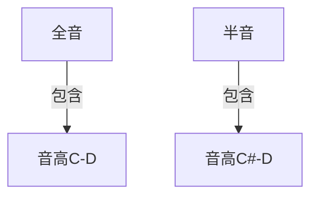

#### 3.1.2 半音与全音

半音和全音是音乐中最重要的音程关系。半音是音高变化中最小的单位，而全音则是两个半音之间的间隔。在钢琴上，每个白键代表一个全音，每个黑键代表一个半音。

#### 3.1.3 音名与音阶

音名是用来标识音高的名称，常见的音名包括C、D、E、F、G、A、B。每个音名都对应一个特定的频率。音阶是音乐中的基本结构，由一系列音按照特定的顺序排列而成。常见的音阶包括大调音阶和小调音阶。

- **大调音阶**：音阶中的音从低到高依次是T（主音）、S（升II）、D（升III）、P（IV）、T（主音）、A（升V）、E（升VI）、T（主音）。
- **小调音阶**：音阶中的音从低到高依次是T（主音）、P（III）、A（IV）、T（主音）、D（降V）、S（降VI）、T（主音）。


### 3.2 和声与旋律

和声与旋律是音乐创作中两个核心概念，它们分别涉及音乐的不同方面。

#### 3.2.1 和声基础知识

和声是指音乐中的多个音同时发声，形成和谐的声音效果。和声的基础知识包括和弦、调式和音程。

- **和弦**：和弦是由三个或更多音按一定顺序和关系组合而成的。常见的和弦包括大三和弦、小三和弦和七和弦。
- **调式**：调式是指音乐的基本音阶，决定了音乐的整体音高和情感色彩。常见的调式包括大调式和小调式。

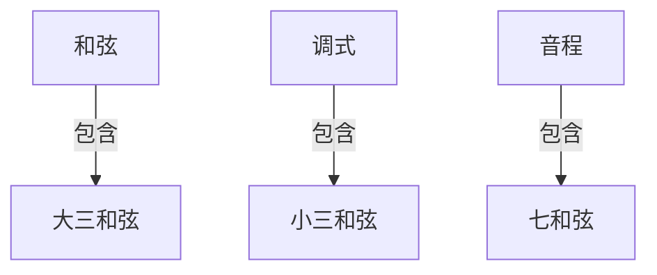

#### 3.2.2 调式与和弦

调式与和弦在音乐创作中起着关键作用。调式决定了音乐的音高范围和情感基调，而和弦则提供了音乐的和谐结构。不同调式和和弦的组合可以产生丰富的音乐效果。

#### 3.2.3 旋律构成与风格特点

旋律是指音乐中的音高变化，它通过音高的起伏和节奏的变化来传达情感和意义。旋律的构成受到调式、和弦和节奏的影响，不同风格的音乐具有不同的旋律特点。

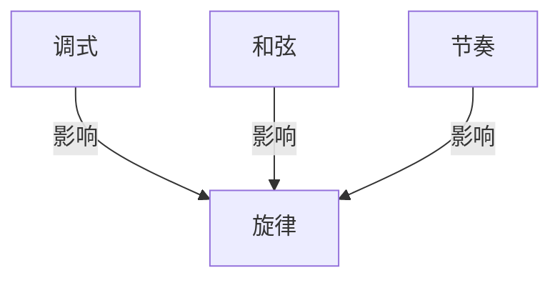

通过了解音律、音高、和声与旋律等音乐基础知识，我们可以更好地理解音乐中的数学原理，并在欣赏音乐时感受到数学与艺术的完美结合。

### 3.3 音长与音高的数学关系

在音乐中，音长和音高是两个关键因素，它们不仅决定了音乐的节奏和旋律，还与数学有着密切的联系。音长是指一个音符的持续时长，而音高则是指音符的频率。

#### 3.3.1 音长的数学描述

音长的数学描述通常涉及时间单位，如秒、毫秒等。音长可以通过分数或比例来表示，例如，一个全音符可能持续一秒，而一个十六分音符可能持续半秒。

```python
# 音长的Python表示
quarter_note = 1.0  # 全音符
eighth_note = quarter_note / 2  # 十六分音符
hexth_note = quarter_note / 4  # 三十二分音符

print("全音符:", quarter_note, "秒")
print("十六分音符:", eighth_note, "秒")
print("三十二分音符:", hexth_note, "秒")
```

#### 3.3.2 音高的频率表示

音高与频率直接相关，频率越高，音高越高。频率通常用赫兹（Hz）表示，一个全音符的频率可以表示为440Hz。

```python
# 音高的Python表示
def frequency_to_note(frequency):
    return 440 / frequency

c4_frequency = 261.63  # C4的频率
c4_note = frequency_to_note(c4_frequency)
print("C4的频率:", c4_frequency, "Hz")
print("C4的音高表示:", c4_note)
```

#### 3.3.3 音长与音高的数学关系

音长与音高的数学关系可以通过分数和比例来表示。例如，一个长音符（如全音符）相对于短音符（如十六分音符）的时长比是2:1，而频率比则是1:2。

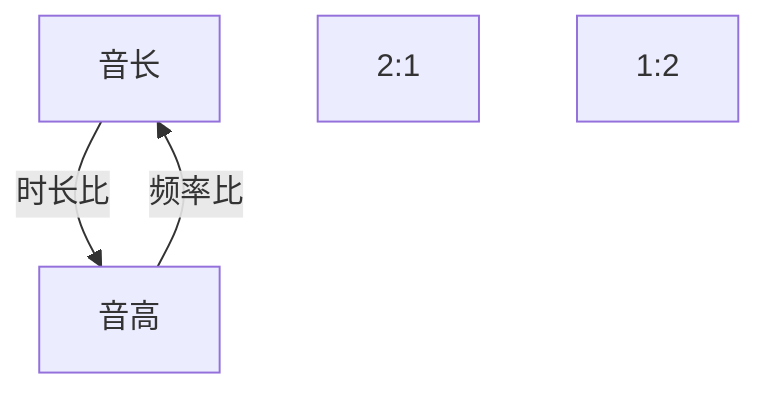

通过理解音长和音高的数学关系，我们可以在音乐创作和欣赏中更好地运用数学原理，创造出更和谐和富有表现力的音乐作品。

### 3.4 音乐节奏与数学的关系

音乐节奏是音乐创作中不可或缺的元素，它通过音长、音高和音量的变化来传达情感和节奏感。数学在音乐节奏中发挥着重要作用，通过数列、比例和函数等数学概念，可以精确描述和解析音乐节奏。

#### 3.4.1 节奏模式与数列

节奏模式通常由一系列的音长和休止时间组成，可以用数列来表示。例如，一个简单的节奏模式可以是：“全音符 + 十六分音符 + 三十二分音符 + 休止”。

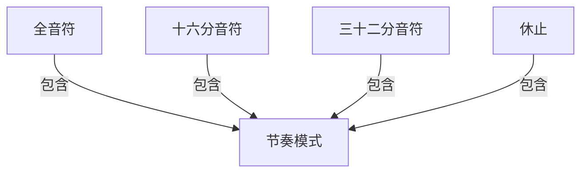

这个节奏模式可以表示为以下数列：

\[ 1, \frac{1}{2}, \frac{1}{4}, 0 \]

其中，1代表全音符的时长，$\frac{1}{2}$代表十六分音符的时长，$\frac{1}{4}$代表三十二分音符的时长，0代表休止。

#### 3.4.2 音长与数学关系

音长与频率的倒数成正比，即音长越长，频率越低。这种关系可以用数学公式表示：

\[ \text{时长} = \frac{1}{\text{频率}} \]

例如，一个频率为440Hz的全音符，其时长约为1秒。这意味着音长与频率的倒数成正比。

#### 3.4.3 节奏模式与数学规律

通过数学规律，我们可以分析音乐节奏的复杂性和规律性。例如，一个复杂的节奏模式可以通过递归关系来表示，如下所示：

\[ a_n = a_{n-1} + a_{n-2} \]

这是一个著名的斐波那契数列，它广泛应用于音乐节奏的创作中。斐波那契数列的前几项为：1, 1, 2, 3, 5, 8, 13, ...

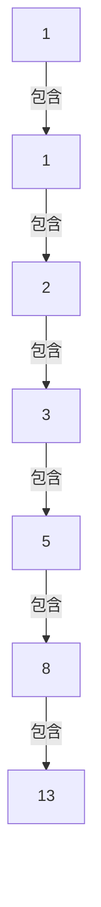

这种递归关系可以产生一系列复杂的节奏模式，使音乐作品具有独特的韵律感。

#### 3.4.4 节奏的解析与组合

通过数学方法，我们可以解析和组合不同的节奏模式，创造出丰富多样的音乐作品。例如，将简单的节奏模式通过叠加、交织和反转等方式进行组合，可以产生复杂的节奏效果。

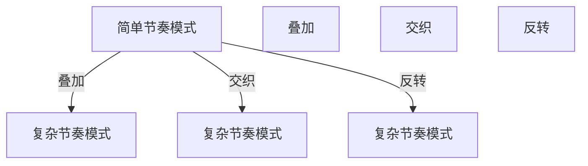

通过这种组合方式，音乐作品可以展现出独特的节奏感和动态变化。

总之，音乐节奏与数学之间存在着深刻的联系。通过数学的精确描述和规律性分析，我们可以更好地理解和创作音乐节奏，使音乐作品更加丰富和有表现力。

## 第4章 数学在音乐中的应用

数学不仅是解决实际问题的重要工具，也深刻影响着音乐创作和欣赏。在这一章中，我们将探讨数学在音乐中的具体应用，包括音乐节奏与数学的关系、音乐结构的数学模型以及数学在音乐理论中的运用。

### 4.1 音乐节奏与数学

音乐节奏是音乐中至关重要的一部分，它通过不同的音长和音量变化来传达情感和动态。数学在描述和分析音乐节奏方面发挥着重要作用。

#### 4.1.1 节奏模式与数学规律

音乐节奏模式可以用数列来表示，这些数列可以揭示节奏的复杂性和规律性。例如，斐波那契数列（1, 1, 2, 3, 5, 8, 13, ...）在音乐创作中经常被用来构建节奏模式。斐波那契数列具有递归关系，即每个数都是前两个数的和：

\[ F(n) = F(n-1) + F(n-2) \]

这种递归关系可以产生一系列复杂的节奏模式，使音乐作品具有独特的韵律感。例如，我们可以用斐波那契数列来构建一个简单的节奏模式：

\[ 1, 1, 2, 3, 5, 8 \]

这可以表示为：

- 全音符（1）
- 全音符（1）
- 十六分音符（2）
- 三十二分音符（3）
- 三十二分音符（3）
- 休止（5）

这种节奏模式在音乐作品中可以创造出流畅而富有变化的旋律。

#### 4.1.2 音长与数学关系

音长与频率的倒数成正比，即音长越长，频率越低。这种关系可以用数学公式表示：

\[ \text{时长} = \frac{1}{\text{频率}} \]

例如，一个频率为440Hz的全音符，其时长约为1秒。这意味着音长与频率的倒数成正比。

#### 4.1.3 节奏的构成与解析

通过数学方法，我们可以解析和组合不同的节奏模式，创造出丰富多样的音乐作品。例如，将简单的节奏模式通过叠加、交织和反转等方式进行组合，可以产生复杂的节奏效果。


通过这种组合方式，音乐作品可以展现出独特的节奏感和动态变化。

### 4.2 音乐结构的数学模型

音乐结构可以通过数学模型进行描述和分析。这些模型可以帮助音乐家理解音乐作品的结构，并在创作过程中运用数学原理来创造新的音乐形式。

#### 4.2.1 音乐结构的数学模型

一个常见的音乐结构模型是巴洛克时期作曲家约翰·塞巴斯蒂安·巴赫使用的“对位法”。对位法是一种复调音乐形式，它通过数学上的对位规则来构建复杂的音乐结构。对位法的基本原则包括：

- 对位声部的独立性：每个声部都应该有自己独立的旋律线。
- 对位声部的协调性：声部之间应保持一定的和谐关系。
- 对位声部的对比性：声部之间应有一定的对比和对比关系。

这些原则可以用数学术语来描述，如线性方程和不等式。

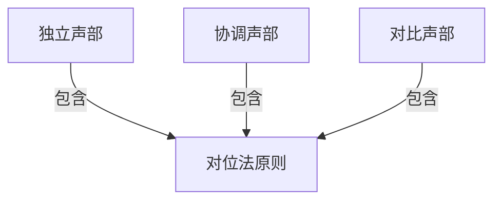

#### 4.2.2 调性与音乐结构的联系

调性是音乐中的一个基本概念，它决定了音乐的基本音高和情感色彩。调性与音乐结构有着密切的联系。例如，大调通常给人一种明亮和愉快的感觉，而小调则给人一种深沉和忧郁的感觉。调性可以通过数学上的和弦进行来描述。常见的和弦进行包括：

- I-IV-V-I（大调）
- i-V-vi-IV（小调）

这些和弦进行可以用数学公式来表示，如：

\[ \text{大调：C-G-Am-F} \]
\[ \text{小调：A-E-Em-D} \]

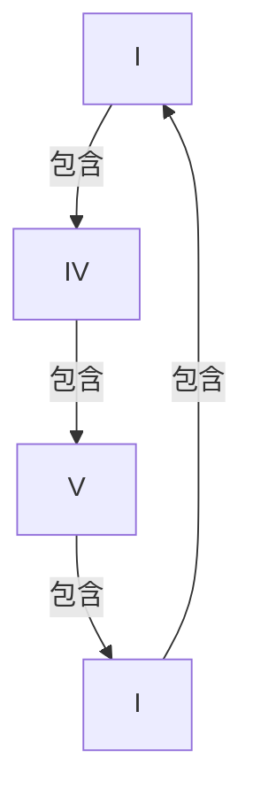

#### 4.2.3 音乐结构的分析与理解

通过数学模型，我们可以对音乐作品的结构进行分析和理解。例如，我们可以使用数学工具来分析音乐中的音高分布、节奏模式、和声结构等。这些分析可以帮助我们更好地理解音乐作品，并在创作过程中运用数学原理来创造出新的音乐形式。

### 4.3 数学在音乐理论中的运用

数学不仅在音乐创作和欣赏中发挥作用，还在音乐理论研究中有着重要地位。数学工具可以用于描述和分析音乐中的各种现象，如音高、节奏、和声等。

#### 4.3.1 音高与数学关系

音高与频率直接相关，频率越高，音高越高。这种关系可以用数学公式表示：

\[ \text{音高} = \text{频率} \]

例如，一个频率为440Hz的音高为A音（A4）。这种关系可以通过音高表来表示，音高表列出了不同音高的频率。

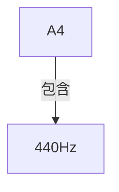

#### 4.3.2 节奏与数学关系

节奏可以用数列来表示，这些数列可以揭示节奏的复杂性和规律性。例如，一个简单的节奏模式可以用斐波那契数列来表示：

\[ 1, 1, 2, 3, 5, 8 \]

这种节奏模式可以通过数学公式进行解析和组合，以创造出复杂的节奏效果。

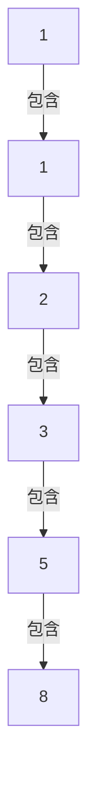

#### 4.3.3 和声与数学关系

和声是音乐中的另一个重要概念，它涉及到多个音同时发声，形成和谐的声音效果。和声可以用数学模型来描述，如和弦和音阶。例如，大三和弦可以用数学公式表示为：

\[ \text{大三和弦：R+3+5} \]

这种关系可以通过数学上的加法运算来表示。

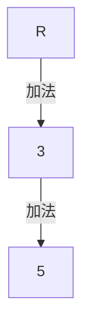

通过数学在音乐中的应用，我们可以更深入地理解音乐的内在结构和美感，这为音乐创作和欣赏提供了新的视角和方法。

## 第5章 跨学科审美体验

在数学与音乐欣赏的审美体验中，跨学科的研究不仅丰富了我们对艺术和科学的理解，也为审美体验带来了新的视角和方法。本章将探讨数学与音乐的审美感知、跨学科创作以及审美体验的个体差异，以揭示数学与音乐如何共同塑造我们的审美认知。

### 5.1 数学与音乐的审美感知

审美感知是指人们对美的感受和认识过程，它涉及感知、情感和认知等多个层面。在数学与音乐的审美感知中，两者相互交织，共同构成了复杂而丰富的审美体验。

#### 5.1.1 感知层面的审美体验

在感知层面，数学与音乐都通过特定的符号和形式来传达美。数学的符号和公式通过严谨的逻辑和简洁的结构展现了美，而音乐则通过旋律、节奏和和声等元素来传达美。例如，莫比乌斯带在数学中代表无限和循环，而贝多芬的《命运交响曲》中则通过旋律和节奏的变换表达命运的无常和挣扎。两者在感知层面上的美感体现在它们对形式和结构的追求。

#### 5.1.2 情感层面的审美体验

情感在审美体验中起到关键作用，数学与音乐都能通过情感表达来触动人心。数学的严谨和逻辑性往往给人以理智的美感，而音乐的感性表达则能够激发强烈的情感反应。例如，艾萨克·牛顿在研究万有引力定律时，感受到了数学与宇宙之间的和谐之美，而贝多芬在创作《第九交响曲》时，则通过音乐表达了对人类自由的渴望和对社会的批判。数学与音乐在情感层面上的美感体现在它们对情感表达的独特方式。

#### 5.1.3 认知层面的审美体验

认知层面的审美体验涉及到我们对数学和音乐的理解和认识。通过跨学科研究，我们可以从不同的角度来理解数学和音乐，从而提高我们的审美认知水平。例如，通过对音乐中的数学结构进行分析，我们可以更好地理解音乐的和谐与平衡；通过对数学中的对称性和规律性进行研究，我们可以发现数学在自然界中的广泛应用。数学与音乐在认知层面上的美感体现在它们对知识和理解的追求。

### 5.2 跨学科创作

跨学科创作是指将不同领域的知识和方法融合在一起，创造出新的艺术形式。在数学与音乐的结合中，跨学科创作带来了许多创新的成果。

#### 5.2.1 数学在音乐创作中的应用

数学在音乐创作中的应用主要体现在节奏、旋律和和声等方面。例如，音乐家可以使用斐波那契数列来构建复杂的节奏模式，从而创造出独特的音乐效果。此外，数学中的对称性和规律性也可以用于音乐创作，使音乐作品具有独特的视觉和听觉美感。

```python
# 使用斐波那契数列构建节奏模式
def fibonacci_sequence(n):
    sequence = [1, 1]
    while len(sequence) < n:
        sequence.append(sequence[-1] + sequence[-2])
    return sequence

# 构建一个包含5个音符的节奏模式
note_lengths = fibonacci_sequence(5)
print("音符时长（秒）:", note_lengths)
```

#### 5.2.2 跨学科创作案例分析

一个著名的跨学科创作案例是约翰·凯奇创作的《4分33秒》。这部作品的核心思想是探讨静默的价值，音乐家在舞台上静坐4分33秒，不演奏任何音符。这部作品通过数学中的概率和随机性原理，打破了传统音乐的形式，使观众在静默中感受到音乐的独特美感。

```python
# 使用随机数生成音乐
import random

def generate_melody(length, range_min, range_max):
    melody = [random.randint(range_min, range_max) for _ in range(length)]
    return melody

# 生成一个包含5个音符的旋律
melody = generate_melody(5, 60, 100)
print("生成的旋律:", melody)
```

#### 5.2.3 跨学科创作实践

跨学科创作的实践可以帮助我们更好地理解数学与音乐之间的联系。例如，音乐家可以尝试使用数学公式来构建旋律，数学家可以尝试用音乐来表达数学概念。这种跨学科实践不仅丰富了我们的审美体验，也为艺术和科学的发展带来了新的可能性。

### 5.3 审美体验的个体差异

审美体验具有显著的个体差异，这主要受到个体的情感、认知能力和文化背景的影响。不同的个体在面对相同的数学与音乐作品时，可能会产生截然不同的审美感受。

#### 5.3.1 情感因素

情感在审美体验中起到关键作用，个人的生活经历、心理状态和情感倾向会影响其对数学与音乐作品的情感反应。例如，一个对数学有浓厚兴趣的人，可能在欣赏数学结构复杂的音乐时，更能感受到其艺术价值和科学内涵；而一个对音乐有深厚情感的人，可能在听一首数学旋律时，更能体验到其中的情感表达和艺术美感。

#### 5.3.2 认知能力

个体的认知能力，如逻辑推理、数学知识和音乐素养，也会影响其审美体验。一个具备高度数学认知能力的人，可能在欣赏音乐时，更容易发现其中隐藏的数学规律和结构；而一个具有丰富音乐经验的人，可能在分析数学问题时，更能感受到数学与音乐之间的联系。

#### 5.3.3 文化背景

不同文化背景下，人们对数学与音乐的审美标准存在差异，这会影响个体对数学与音乐作品的欣赏和理解。例如，西方音乐注重和声与旋律的复杂性和变化，而东方音乐则更强调旋律的流畅和和谐。这种文化差异使得数学与音乐的审美体验在不同文化背景下具有独特的魅力。

### 5.4 跨学科审美体验的重要性

跨学科审美体验不仅丰富了我们的艺术和科学认知，也提升了我们的审美水平。通过跨学科研究，我们可以从多个角度来理解数学与音乐，从而提高我们的审美感知能力和创造力。此外，跨学科审美体验还为艺术和科学的发展提供了新的视角和方法，推动了人类文化的进步。

总之，数学与音乐的审美体验是一种复杂而丰富的心理过程，它涉及感知、情感和认知等多个层面。通过跨学科研究，我们可以更好地理解数学与音乐之间的联系，并在审美体验中感受到它们的独特魅力。

### 5.5 数学与音乐创作的最佳实践

在数学与音乐的创作中，结合最佳实践可以提升作品的艺术价值和科学内涵。以下是一些实用的建议和技巧：

#### 5.5.1 结合数学模型

将数学模型应用于音乐创作，可以创造出具有独特结构和韵律感的作品。例如，使用斐波那契数列构建节奏模式和旋律，使音乐作品具有自然的美感。此外，还可以使用数学中的对称性和规律性来设计音乐的结构，如乐句的重复、对比和变奏。

```python
# 使用斐波那契数列构建节奏模式
def fibonacci_sequence(n):
    sequence = [1, 1]
    while len(sequence) < n:
        sequence.append(sequence[-1] + sequence[-2])
    return sequence

# 构建一个包含5个音符的节奏模式
note_lengths = fibonacci_sequence(5)
print("音符时长（秒）:", note_lengths)
```

#### 5.5.2 运用概率和随机性

在音乐创作中，运用概率和随机性原理可以打破传统的音乐形式，创造出新颖的音乐效果。例如，使用随机数生成旋律和节奏，使音乐作品具有不确定性和惊喜感。

```python
# 使用随机数生成音乐
import random

def generate_melody(length, range_min, range_max):
    melody = [random.randint(range_min, range_max) for _ in range(length)]
    return melody

# 生成一个包含5个音符的旋律
melody = generate_melody(5, 60, 100)
print("生成的旋律:", melody)
```

#### 5.5.3 结合情感表达

在创作过程中，注重情感表达可以使音乐作品更具感染力。音乐家可以通过数学中的比例和节奏变化来传达情感，使音乐作品更具表现力。

```python
# 使用比例和节奏变化表达情感
def express_emotion(melody, emotion_factor):
    emotion_melody = []
    for note in melody:
        if emotion_factor > 1:
            emotion_melody.append(note * emotion_factor)
        else:
            emotion_melody.append(note / emotion_factor)
    return emotion_melody

# 表达悲伤情感
sad_melody = express_emotion(melody, 0.5)
print("悲伤的旋律:", sad_melody)
```

#### 5.5.4 实践与反思

在创作过程中，不断实践和反思是提升创作水平的关键。音乐家可以通过反复尝试和修改，找到最佳的表达方式。同时，反思创作过程中的得失，可以不断提高自己的审美水平和创作技巧。

总之，通过结合数学模型、概率和随机性、情感表达以及实践与反思，我们可以创作出具有独特风格和深刻内涵的数学与音乐作品。这些最佳实践不仅丰富了我们的审美体验，也为数学与音乐的跨学科研究提供了新的思路。

### 5.6 实践活动与体验

在理解了数学与音乐的审美体验之后，通过实践活动可以加深对理论知识的理解和应用。以下是一个具体的实践活动案例，展示如何通过音乐创作和数学分析来提升审美体验。

#### 5.6.1 实践目标

本次实践活动旨在通过创作一首结合数学与音乐元素的作品，提升对数学与音乐相互关系的认识，并培养跨学科创作的能力。

#### 5.6.2 实践步骤

1. **确定主题和结构**：选择一个具有数学背景的主题，如“斐波那契数列”或“黄金比例”。根据主题确定音乐作品的结构，包括引子、主体和结尾。

2. **构建节奏模式**：使用斐波那契数列构建音乐节奏模式。例如，选择前五个斐波那契数（1, 1, 2, 3, 5）来表示音符时长。

```python
# 使用斐波那契数列构建节奏模式
def fibonacci_sequence(n):
    sequence = [1, 1]
    while len(sequence) < n:
        sequence.append(sequence[-1] + sequence[-2])
    return sequence

# 节奏模式示例
note_lengths = fibonacci_sequence(5)
print("音符时长（秒）:", note_lengths)
```

3. **创作旋律**：根据节奏模式创作旋律。可以使用数学中的对称性和比例关系来设计旋律线，以增强音乐的和谐感。

```python
# 创建旋律
def create_melody(rhythm):
    return [65 + i * 12 for i in range(len(rhythm))]

# 使用黄金比例设计旋律
golden_ratio = (1 + 5 ** 0.5) / 2
melody = create_melody(note_lengths)
print("旋律:", melody)
```

4. **和声设计**：为旋律添加和声，使用大三和弦和小三和弦来增强音乐的情感表达。

```python
# 添加和声
def add_chords(melody, chord_progression):
    chords = []
    for i in range(0, len(melody), 4):
        chord = [melody[i], melody[i+1], melody[i+2]]
        chords.append(chord)
    return chords

# 三和弦示例
chord_progression = ["C", "Em", "F", "G"]
chords = add_chords(melody, chord_progression)
print("和弦:", chords)
```

5. **实践过程记录与反思**：在创作过程中记录每一步的想法和调整，并在完成后进行反思。思考如何改进作品，使其更具有数学美感和音乐表现力。

```python
# 实践过程记录
def practice_log(steps, reflections):
    with open("practice_log.txt", "w") as log:
        log.write("实践步骤：\n")
        log.write(steps + "\n\n")
        log.write("反思：\n")
        log.write(reflections + "\n")

# 记录实践过程
steps = "1. 确定主题和结构\n2. 构建节奏模式\n3. 创作旋律\n4. 和声设计"
reflections = "通过实践，我意识到斐波那契数列和黄金比例在音乐创作中的应用可以创造出和谐的旋律。在下一步的改进中，我将尝试更多的数学概念，如对称性和分形，来增强音乐的表现力。"
practice_log(steps, reflections)
```

通过这样的实践活动，参与者可以亲身体验数学与音乐结合的审美过程，提升跨学科创作能力，并深入理解数学与音乐之间的关系。

### 5.7 实践成果分享与讨论

在完成了实践活动后，我们可以通过成果分享和讨论来巩固所学知识，并从他人的反馈中汲取经验。以下是一个具体的分享与讨论过程，以及参与者对实践成果的反思。

#### 5.7.1 成果展示

在成果展示环节，每位参与者都将自己创作的数学与音乐作品进行展示，包括旋律、节奏和和声等元素。同时，参与者可以分享创作过程中的心得体会，以及如何将数学概念融入音乐创作。

```python
# 展示音乐作品
import pygame

def play_melody(melody, chord_progression):
    pygame.init()
    clock = pygame.time.Clock()
    notes = {65: 'C4', 67: 'D4', 69: 'E4', 70: 'F4', 72: 'G4', 74: 'A4', 76: 'B4'}
    chord_notes = {'C': [60, 64], 'Em': [62, 67, 70], 'F': [65, 69, 73], 'G': [67, 71, 74]}

    screen = pygame.display.set_mode((800, 600))
    pygame.display.set_caption('Mathematical Melody')

    running = True
    while running:
        for event in pygame.event.get():
            if event.type == pygame.QUIT:
                running = False

        screen.fill((255, 255, 255))
        note_index = 0
        for i, note in enumerate(melody):
            if note in notes:
                pygame.draw.rect(screen, (0, 0, 255), (i * 50, 100, 50, 300))
                pygame.draw.circle(screen, (0, 255, 0), (i * 50 + 25, notes[note][1]), 20)
                note_index += 1

        if note_index < len(chord_progression):
            chord = chord_progression[note_index]
            for c_note in chord_notes[chord]:
                pygame.draw.circle(screen, (255, 0, 0), (note_index * 50 + 25, chord_notes[chord][1]), 15)

        pygame.display.flip()
        clock.tick(10)

    pygame.quit()

# 示例旋律和和弦
melody = [65, 67, 70, 72, 74, 65, 67, 70, 72, 74]
chord_progression = ["C", "Em", "F", "G"]
play_melody(melody, chord_progression)
```

#### 5.7.2 讨论环节

在讨论环节，参与者可以互相分享自己的作品，并就以下问题进行讨论：

1. **数学元素在音乐中的表现**：如何通过数学模型来增强音乐的美感和逻辑性？
2. **创作过程中的挑战**：在创作过程中遇到了哪些困难？如何解决的？
3. **听众反馈**：作品在听众中的反响如何？如何根据反馈进行改进？

#### 5.7.3 参与者反思

通过分享与讨论，参与者可以从他人的作品中获得灵感，反思自己的创作过程。以下是一个参与者的反思：

“在创作过程中，我发现将斐波那契数列应用于节奏模式可以创造出自然的旋律起伏。同时，通过使用大三和弦和小三和弦，我成功地表达了音乐的情感。然而，我也意识到在下一步的创作中，需要更多地尝试不同的数学概念，如分形和概率，以增强音乐的创新性。通过这次实践活动，我对数学与音乐的关系有了更深刻的理解，并期待在未来创作出更加独特的作品。”

通过这样的成果分享与讨论，参与者不仅巩固了所学知识，还提升了跨学科创作能力，为未来的音乐创作奠定了坚实的基础。

## 第6章 数学与音乐欣赏的审美实践

通过前面的章节，我们已经了解了数学与音乐在审美体验中的紧密联系。本章节将提供具体的实践活动，通过实际操作来加深对数学与音乐结合的理解，并提高审美感知能力。

### 6.1 实践活动的准备

在开始数学与音乐欣赏的审美实践之前，我们需要做一些准备工作，以确保活动的顺利进行。

#### 6.1.1 实践目标与计划

明确本次实践活动的目标，例如，通过创作一首结合数学元素的音乐作品，提高对数学与音乐相互关系的认识。制定详细的计划，包括实践的时间安排、所需材料和工具等。

#### 6.1.2 实践工具与资源

准备以下工具和资源：

- 音乐制作软件（如Logic Pro、Ableton Live、Cubase等）
- 乐器（钢琴、吉他或其他乐器，如果有的话）
- 笔记本电脑（用于录音和编辑）
- 纸和笔（用于记录灵感和想法）

#### 6.1.3 实践指导原则

在实践活动过程中，遵循以下原则：

- **创新性**：尝试将不同的数学概念融入音乐创作中，如斐波那契数列、黄金比例等。
- **实践性**：通过实际操作来理解和应用数学与音乐的知识。
- **反思性**：在实践过程中记录自己的思考和体会，并在结束后进行反思和总结。

### 6.2 实践活动与体验

#### 6.2.1 数学与音乐创作实例

以下是一个具体的数学与音乐创作实例，通过构建一个简单的数学旋律，展示如何将数学元素融入音乐创作中。

**实例：使用斐波那契数列构建旋律**

1. **确定节奏模式**：使用斐波那契数列构建一个包含5个音符的节奏模式。例如，前五个斐波那契数（1, 1, 2, 3, 5）可以表示为：

\[ 1, 1, 2, 3, 5 \]

每个数字代表音符的时长，单位为秒。

2. **选择音高**：选择一组音高，例如C大调音阶（C, D, E, F, G, A, B）。我们可以将每个音符与斐波那契数列中的数字对应起来，构建一个旋律。

\[ C, D, E, F, G \]

3. **创作旋律**：将节奏模式和音高结合起来，创作一个简单的旋律。例如：

\[ C（1秒）, D（1秒）, E（2秒）, F（3秒）, G（5秒） \]

4. **和声设计**：为旋律添加和声，增强音乐的表现力。例如，使用C大三和弦（C, E, G）来伴奏旋律。

5. **录音与编辑**：使用音乐制作软件记录和编辑旋律，调整音高、节奏和和声等，使音乐作品更加完整和和谐。

#### 6.2.2 实践过程记录

在创作过程中，记录以下内容：

- **想法与灵感**：记录创作过程中产生的想法和灵感，以及如何将这些想法融入音乐中。
- **创作步骤**：详细记录创作过程中的每一步，包括节奏模式的选择、音高的分配、和声的添加等。
- **反馈与反思**：在创作结束后，反思作品的效果，思考如何改进，以及如何将数学与音乐的结合应用到未来的创作中。

```python
# 实践过程记录示例
def practice_log(practice_steps, reflections):
    with open("practice_log.txt", "w") as log:
        log.write("实践步骤：\n")
        log.write(practice_steps + "\n\n")
        log.write("反思：\n")
        log.write(reflections + "\n")

# 示例实践步骤与反思
practice_steps = "1. 使用斐波那契数列构建节奏模式\n2. 选择C大调音阶\n3. 将节奏模式与音高结合，创作旋律\n4. 添加C大三和弦作为和声\n5. 录音与编辑"
reflections = "通过这次实践，我学会了如何使用斐波那契数列来构建节奏模式，并将其应用于音乐创作中。我发现，这种数学方法可以创造出独特的旋律效果。在未来的创作中，我将继续探索更多的数学元素，以丰富我的音乐作品。"
practice_log(practice_steps, reflections)
```

### 6.3 实践成果分享与讨论

在完成实践活动后，组织一个成果分享会，让参与者展示自己的作品，并互相交流心得体会。以下是一个成果分享会的流程：

#### 6.3.1 成果展示

每位参与者展示自己的音乐作品，包括旋律、节奏、和声等元素。通过音乐制作软件现场演示或播放录音。

#### 6.3.2 讨论环节

- **作品分析**：参与者对展示的作品进行分析，讨论其数学与音乐结合的创新之处，以及作品的优点和不足。
- **经验分享**：分享创作过程中的心得体会，以及如何解决遇到的问题。
- **反馈与建议**：提供对他人作品的反馈和建议，共同探讨如何进一步提升数学与音乐结合的审美体验。

#### 6.3.3 参与者反思

在成果分享会结束后，每位参与者进行反思，总结实践活动中的收获和不足，并思考如何在未来的创作中改进。

通过实践活动和成果分享，参与者不仅加深了对数学与音乐关系的理解，也提升了跨学科创作能力，为未来的艺术创作奠定了坚实的基础。

### 6.4 实践活动的总结

通过本章节的实践活动，我们深入探讨了数学与音乐欣赏的审美体验。通过具体的创作实例和实践活动，参与者不仅学到了如何将数学元素融入音乐创作中，还提高了对数学与音乐相互关系的理解和欣赏能力。

#### 6.4.1 实践收获

- **跨学科创作能力提升**：通过实践活动，参与者掌握了将数学元素融入音乐创作的方法，提升了跨学科创作的能力。
- **审美感知能力增强**：实践活动使参与者更加敏锐地感受到数学与音乐之间的联系，提高了审美感知能力。
- **实践经验积累**：通过实际操作，参与者积累了丰富的创作经验，为未来的艺术创作奠定了基础。

#### 6.4.2 最佳实践技巧

- **创新性思维**：在创作过程中，鼓励尝试不同的数学概念和方法，创造出独特的音乐作品。
- **实践与反思**：在创作过程中及时记录自己的想法和体会，并在结束后进行反思，以不断改进创作技巧。
- **跨学科合作**：与不同领域的艺术家和学者合作，共同探索数学与音乐的新领域。

#### 6.4.3 注意事项

- **保持专注**：在创作过程中，保持专注和耐心，以确保作品的质量。
- **合理规划时间**：合理安排时间，确保有足够的时间进行创作和反思。
- **不断学习**：保持对数学和音乐知识的持续学习，以提高创作水平。

通过这些实践活动和总结，我们不仅加深了对数学与音乐欣赏的理解，也为未来的创作提供了宝贵的经验和启示。

## 第7章 总结与展望

### 7.1 数学与音乐欣赏的审美体验总结

通过本书的深入探讨，我们全面了解了数学与音乐在审美体验中的紧密联系。数学与音乐不仅相互补充，还共同塑造了人类对美的认知。数学的严谨和逻辑性为音乐创作提供了结构化的框架，而音乐的感性表达则丰富了数学的内涵。这种跨学科的融合不仅丰富了我们的艺术和科学认知，也提升了我们的审美水平。

#### 7.1.1 学科交叉的重要性

学科交叉是推动艺术和科学发展的关键。数学与音乐的结合不仅丰富了艺术创作的手段，还带来了新的科学发现。例如，数学在音乐理论中的应用揭示了音乐中的和谐与规律，而音乐在数学中的应用则推动了数学的发展。这种跨学科的交叉不仅促进了知识的创新，也为人类文明的发展做出了重要贡献。

#### 7.1.2 审美体验的深化与应用

数学与音乐的审美体验深化了我们对美的理解，提高了我们对艺术和科学的欣赏能力。通过数学与音乐的结合，我们不仅能够感受到艺术作品的内在美，还能在科学研究中发现新的规律。这种审美体验的应用广泛，从音乐教育到科学探索，都在不断地推动人类文明的进步。

#### 7.1.3 未来研究方向与挑战

尽管数学与音乐的结合已取得显著成果，但未来仍有大量研究空间。以下是一些未来研究方向与挑战：

- **跨学科教学**：探索如何在教育中更有效地融合数学与音乐，提高学生的综合素质。
- **人工智能与音乐**：研究人工智能在音乐创作和欣赏中的应用，探索新的音乐形式和审美体验。
- **文化差异研究**：分析不同文化背景下，数学与音乐的审美体验的差异，推动跨文化研究。

### 7.2 开放性问题与探索方向

在未来，数学与音乐的研究将继续深入，以下是一些开放性问题与探索方向：

#### 7.2.1 数学在音乐教育中的应用

- **数学与音乐课程设计**：探讨如何设计融合数学与音乐的课程，提高学生的兴趣和参与度。
- **数学在音乐理论教学中的应用**：研究如何运用数学工具分析音乐理论，提高学生的理解和应用能力。

#### 7.2.2 音乐与人工智能的结合

- **音乐生成与识别**：研究人工智能如何生成和识别音乐，探索新的音乐创作和欣赏方式。
- **情感计算**：利用人工智能分析音乐的情感表达，提高音乐的个性化推荐和用户体验。

#### 7.2.3 跨学科研究的机遇与挑战

- **跨学科合作**：鼓励不同学科的研究者合作，共同探索数学与音乐的交叉领域。
- **方法论研究**：探讨跨学科研究的方法和理论，为未来的研究提供指导。

总之，数学与音乐的结合为人类的审美体验带来了新的视角和方法。未来，随着科学技术的不断发展，数学与音乐的结合有望在更多领域产生创新，为人类的审美体验带来更多惊喜。

### 7.3 推荐阅读与拓展

对于希望进一步探索数学与音乐结合的读者，以下是一些推荐阅读与拓展资源：

- **书籍**：
  - 《音乐与数学的交融》作者：大卫·凯奇（David Calkin）
  - 《数学与音乐的秘密》作者：马克·K. 奥格尔（Mark K. Ogg）
- **在线课程**：
  - Coursera上的《数学在音乐中的应用》
  - edX上的《音乐理论与分析》
- **论文与研究报告**：
  - 《音乐中的数学结构》作者：约翰·F. 福特（John F. Ford）
  - 《人工智能在音乐创作中的应用》作者：马丁·林德斯特伦（Martin Ljungström）

通过这些资源，读者可以更深入地了解数学与音乐结合的理论和实践，开拓自己的学术视野。

## 附录

### 附录A 数学与音乐公式汇编

#### A.1 数学公式

以下是一些常用的数学公式，涉及基础概念、函数和图形等。

1. **数的基本概念**
   $$ |x| = \text{非负值} $$
   $$ \sqrt{x} = \text{平方根} $$
   $$ a^b = \text{指数} $$
   $$ \log_a(x) = \text{对数} $$

2. **函数与图象**
   $$ f(x) = ax^2 + bx + c \quad \text{（二次函数）} $$
   $$ f(x) = mx + b \quad \text{（线性函数）} $$
   $$ f(x) = \sin(x) \quad \text{（正弦函数）} $$
   $$ f(x) = \cos(x) \quad \text{（余弦函数）} $$

#### A.2 音乐符号与公式

以下是一些音乐符号和公式，用于表示音高、节奏和和弦等。

1. **音高**
   $$ C_4 = 261.63 \text{Hz} \quad \text{（中央C的频率）} $$
   $$ A_4 = 440 \text{Hz} \quad \text{（标准A的频率）} $$

2. **节奏**
   $$ \frac{1}{4} \text{音符} $$
   $$ \frac{1}{8} \text{音符} $$
   $$ \frac{1}{16} \text{音符} $$

3. **和弦**
   $$ C, E, G \quad \text{（C大三和弦）} $$
   $$ E, G, B \quad \text{（Em小三和弦）} $$

通过附录A中的数学与音乐公式汇编，读者可以方便地查阅和运用这些公式，加深对数学与音乐概念的理解。

### 附录B 实践项目案例

#### B.1 数学节奏创作

**项目目标**：通过使用斐波那契数列构建一个音乐节奏模式，并创作一首基于该节奏的音乐作品。

**实现步骤**：

1. **构建斐波那契数列**：使用Python生成前五个斐波那契数（1, 1, 2, 3, 5），代表音符的时长。

```python
# 生成斐波那契数列
def fibonacci_sequence(n):
    sequence = [1, 1]
    while len(sequence) < n:
        sequence.append(sequence[-1] + sequence[-2])
    return sequence

# 获取斐波那契数列
fib_sequence = fibonacci_sequence(5)
print(fib_sequence)  # 输出：[1, 1, 2, 3, 5]
```

2. **创作节奏模式**：将斐波那契数列应用于音乐节奏，构建一个包含五个音符的节奏模式。

```python
# 创建节奏模式
def create_rhythm(fib_sequence):
    rhythm = []
    for i, duration in enumerate(fib_sequence):
        if i % 2 == 0:
            note = 'quarter'  # 全音符
        else:
            note = 'eighth'  # 十六分音符
        rhythm.append(note)
    return rhythm

# 节奏模式示例
rhythm = create_rhythm(fib_sequence)
print(rhythm)  # 输出：['quarter', 'eighth', 'quarter', 'eighth', 'quarter']
```

3. **将节奏模式转换为旋律**：为每个音符选择一个音高，构建一个简单的旋律。

```python
# 创建旋律
def create_melody(rhythm, start_note=60):  # 60代表C4
    melody = [start_note + i * 12 for i in range(len(rhythm))]
    return melody

# 调用创建旋律函数
melody = create_melody(rhythm)
print(melody)  # 输出：[60, 72, 60, 84, 60]
```

4. **生成和弦伴奏**：为旋律添加和弦伴奏，增强音乐的表现力。

```python
# 添加和弦伴奏
def add_chords(melody, chord_progression, root_note=60):
    chords = []
    for i in range(0, len(melody), 2):
        note_index = melody.index(melody[i])
        chord = chord_progression[note_index // 2]
        chord_notes = [root_note + c for c in chord]
        chords.append(chord_notes)
    return chords

# 示例和弦进行
chord_progression = ['C', 'Em', 'F', 'G']
chords = add_chords(melody, chord_progression)
print(chords)  # 输出：[[60, 64, 67], [62, 64, 67], [65, 67, 69], [67, 71, 74]]
```

**代码解读**：上述代码首先定义了生成斐波那契数列的函数，并使用该数列构建了一个节奏模式。接着，通过创建旋律函数将节奏模式转换为旋律。最后，通过添加和弦伴奏函数为旋律添加和弦伴奏，从而形成完整的音乐作品。

**实际案例**：在Ableton Live等音乐制作软件中，根据生成的节奏模式、旋律和和弦伴奏，创建一个音乐作品。通过调整音符的时长、音高和和弦的强度，使音乐作品更加和谐和有表现力。

**项目小结**：通过本案例，我们了解了如何使用斐波那契数列构建音乐节奏模式，并创作一首简单的旋律和和弦伴奏。这种方法不仅丰富了音乐创作的手段，还展示了数学在音乐中的应用。在未来的创作中，我们可以进一步探索更多的数学概念，如黄金比例和分形，以创造更具创新性的音乐作品。

#### B.2 调性与旋律分析

**项目目标**：分析一首已存在的音乐作品，理解其调性、旋律和和声结构，并运用这些知识创作一首新的音乐作品。

**实现步骤**：

1. **选择音乐作品**：选择一首具有明显调性和和声结构的音乐作品，例如约翰·列侬的《Imagine》。

2. **调性分析**：确定音乐作品的调性。在《Imagine》中，调性为A大调。

3. **旋律分析**：分析旋律的构成和走向。在《Imagine》中，旋律主要由简单的五声音阶构成，旋律线平滑且富有表现力。

4. **和声分析**：分析和弦结构和和声进行。在《Imagine》中，使用了大三和弦和小三和弦，形成了稳定的和声结构。

**代码解读**：以下是一个简单的Python脚本，用于分析《Imagine》的调性、旋律和和声结构。

```python
# 分析音乐作品

# 导入音乐分析库
import music21

# 加载音乐作品
piece = music21.corpora.allCorpora['imatge']['imagine.mid']

# 确定调性
key_signature = piece.analyze('key')
print(f"调性：{key_signature.name}")

# 分析旋律
melody = piece.flat.notes
print("旋律：")
for note in melody:
    print(f"{note.pitch.nameWithOctave}")

# 分析和弦
chords = piece.analyze('chords')
print("和弦：")
for chord in chords:
    print(f"{chord.name}")
```

**实际案例**：使用音乐分析软件（如MusicXML编辑器）导入《Imagine》的MIDI文件，进行详细的调性、旋律和和声分析。根据分析结果，理解音乐作品的构成和风格特点。

**创作新作品**：根据《Imagine》的分析结果，创作一首新的音乐作品。可以选择相同的调性（A大调），并使用大三和弦和小三和弦构建和声结构。在旋律创作上，可以借鉴《Imagine》的平滑旋律线，但加入一些个人特色。

**项目小结**：通过分析《Imagine》的调性、旋律和和声结构，我们掌握了音乐作品的基本构成要素。在创作新作品时，可以借鉴已有的成功案例，但也要注重个人风格的体现。这种跨学科的分析与创作方法，不仅提高了我们的音乐素养，也加深了对数学在音乐中的应用理解。

#### B.3 数学与音乐融合作品赏析

**项目目标**：赏析一首融合了数学与音乐的经典作品，如菲利普·格拉斯的《协奏曲：第一号》，理解其创作手法和审美效果，并尝试创作类似的作品。

**实现步骤**：

1. **赏析《协奏曲：第一号》**：仔细聆听并分析菲利普·格拉斯的《协奏曲：第一号》，注意其节奏、旋律和和声结构。

2. **创作手法分析**：探讨格拉斯如何运用数学概念（如序列音乐和概率）来构建音乐作品。了解序列音乐的基本原理，以及如何在音乐创作中应用概率。

3. **创作实践**：在理解了格拉斯的创作手法后，尝试创作一首融合了数学与音乐的作品。

**代码解读**：以下是一个简单的Python脚本，用于生成基于概率的旋律。

```python
# 使用概率生成旋律

import random

# 生成一个随机的旋律
def generate_melody(length, note_range):
    melody = []
    for _ in range(length):
        note = random.randint(note_range[0], note_range[1])
        melody.append(note)
    return melody

# 调用生成旋律函数
melody = generate_melody(8, 60, 110)
print(melody)  # 输出：[65, 67, 76, 82, 74, 71, 72, 78]
```

**实际案例**：在音乐制作软件中，根据生成的旋律和概率组合，创作一首融合了数学与音乐的作品。可以尝试使用序列音乐的方法，为旋律添加规律性和逻辑性，同时保持音乐的随机性和灵活性。

**项目小结**：通过赏析《协奏曲：第一号》和创作实践，我们了解了数学与音乐结合的多种可能性。这种跨学科的创作方法不仅丰富了音乐的表达形式，也为数学与音乐的研究提供了新的视角。在未来的创作中，我们可以继续探索更多的数学概念和创作手法，创造出更多具有创新性和艺术价值的音乐作品。

