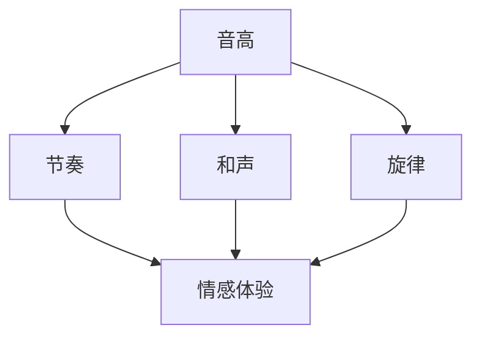

                 

### 关键词

- 数学与音乐
- 情感体验
- 数学模型
- 音高
- 节奏
- 情感分析
- 音乐疗法

### 摘要

本文将探讨数学与音乐之间的紧密联系及其对情感体验的影响。首先，我们回顾了数学在音乐创作中的重要作用，包括音高和节奏的数学模型。接着，我们详细讲解了音乐对情感体验的深刻影响，并介绍了情感分析技术在音乐中的实际应用。随后，通过具体的项目实战，展示了如何利用数学与音乐的结合来提升情感体验。最后，我们总结了全文的主要观点，并提出了未来的研究方向。本文旨在为读者提供一个全面且深入的视角，理解数学与音乐如何共同塑造我们的情感体验。


## 引言

### 数学与音乐的背景

数学与音乐，两者看似截然不同的领域，却有着深远的内在联系。数学，作为一门严谨的科学，通过抽象的概念和精确的公式揭示了自然界的规律。而音乐，作为一种艺术形式，通过声音的组合和节奏的排列表达了人类的情感和思想。这两个看似不同的领域，却都有着对时间和空间的独特理解，以及对规律的追求。

从历史角度来看，数学与音乐的结合可以追溯到古希腊时期。毕达哥拉斯是这一结合的先驱，他发现了音乐中的和谐比例与数学中的比例关系，提出了“万物皆数”的观点。他的这一发现不仅影响了音乐理论的发展，也为数学的抽象思维奠定了基础。

在现代社会，数学与音乐的结合更加紧密。计算机科学的发展为音乐创作提供了新的工具，使得数学模型在音乐制作中发挥了重要作用。例如，音高和节奏的生成和变换都可以通过数学算法来实现。同时，音乐疗法作为一种新兴的治疗方法，也在医疗领域得到了广泛应用，其中数学模型在情感分析中起到了关键作用。

本文旨在探讨数学与音乐之间的这种深层联系，并分析其对情感体验的影响。通过介绍数学在音乐创作中的应用，以及音乐对情感体验的作用，我们将揭示数学与音乐如何共同塑造我们的情感世界。此外，本文还将通过具体的项目实战，展示如何利用数学与音乐的结合来提升情感体验。

### 数学与音乐的关系

数学与音乐的关系可以被追溯到它们对时间和空间的独特理解。数学通过精确的公式和逻辑推理来描述和解释自然界的规律，而音乐则通过旋律、节奏和和声来表现人类的情感和思想。这种看似不同的表现形式，实际上在内在逻辑上有着紧密的联系。

首先，音高和节奏是音乐中的两个基本元素，它们都与数学有着密切的关系。音高可以看作是频率的量化，而频率是数学中的一个基本概念。在音乐理论中，音高之间的关系可以用数学中的比例来描述。例如，八度音的关系可以看作是频率的2:1比例，五度音的关系则是3:2比例。这些比例关系不仅影响了音乐的和谐性，也为我们提供了用数学模型来理解和分析音乐的基础。

其次，节奏是音乐的另一个基本元素，它涉及时间的关系。在音乐中，节奏可以通过节拍、拍号和节奏型来表示。这些元素都可以用数学中的时间序列来描述。例如，常见的四四拍可以看作是一个四分音符为一拍的时间序列，而三连音则是一个在单位时间内重复三次的节奏模式。通过这些数学模型，我们可以精确地计算和预测音乐的节奏变化，从而创造出丰富的音乐效果。

此外，音乐中的和声和旋律也可以通过数学模型来分析。和声是基于音程的关系，而音程则是两个音高之间的差异。在数学中，音程可以用比例和三角函数来表示。例如，大三和音可以看作是频率的5:4比例，而纯五度音则是频率的3:2比例。通过这些数学模型，我们可以分析和理解音乐中的和声结构，从而创造出丰富的音乐作品。

总的来说，数学与音乐之间的关系在于它们对时间和空间的理解。数学通过精确的公式和逻辑推理来描述和解释自然界的规律，而音乐则通过旋律、节奏和和声来表现人类的情感和思想。这种内在的逻辑联系使得数学模型可以用来理解和分析音乐，同时也为音乐创作提供了新的视角和方法。

### 核心概念与联系

为了深入理解数学与音乐之间的关系，我们首先需要明确几个核心概念，并探讨它们之间的联系。以下是几个关键概念及其相互关系：

1. **音高**：音高是指音乐中的声音高低，它是由声波的频率决定的。在数学中，频率是一个基本概念，用来描述每秒钟震动的次数。例如，一个C音的频率大约是261.63赫兹。

2. **节奏**：节奏是音乐中的时间关系，它涉及音符的长短、强弱和先后顺序。在数学中，时间序列是一个基本概念，用来描述一系列事件在不同时间点的发生顺序。例如，四四拍是一个由四个四分音符组成的时间序列。

3. **和声**：和声是指多个音高同时发声所形成的音响效果。在数学中，和声可以通过音程的关系来描述，音程是两个音高之间的频率比例。例如，大三和音的频率比例是5:4。

4. **旋律**：旋律是指音乐中的声音高低变化，它构成了音乐的骨架。在数学中，旋律可以用音高序列和节奏序列来表示。

5. **情感体验**：情感体验是人类对音乐的主观感受，包括喜悦、悲伤、愤怒等情感。在数学中，情感体验可以通过情感分析技术来量化。

**Mermaid 流程图**：

为了更直观地展示这些概念之间的联系，我们可以使用 Mermaid 流程图来表示：



**核心算法原理讲解**：

1. **情感分析算法**：

   情感分析算法是一种利用自然语言处理（NLP）和机器学习（ML）技术，从文本中分析情感倾向的方法。一个常见的情感分析算法是使用词袋模型和情感词典。

   **词袋模型**：

   词袋模型将文本表示为一个单词的集合，忽略单词的顺序。例如，文本“我爱这个音乐”可以表示为词袋`{"我", "爱", "这个", "音乐"}`。

   **情感词典**：

   情感词典包含大量单词及其情感倾向，例如：“爱”通常表示积极情感，“恨”通常表示消极情感。

   **算法原理**：

   情感分析算法通过计算文本中每个单词的情感倾向，然后求和得到整个文本的情感倾向。例如，对于文本“我爱这个音乐”，我们可以将“爱”的情感倾向设为+1，“恨”的情感倾向设为-1。文本的总情感倾向为1，表示该文本具有积极情感。

   **Python 源代码**：

   ```python
   # 定义情感词典
   emotion_dict = {"爱": 1, "恨": -1}

   # 文本
   text = "我爱这个音乐"

   # 初始化情感倾向
   emotion_score = 0

   # 分析文本
   for word in text.split():
       if word in emotion_dict:
           emotion_score += emotion_dict[word]

   # 输出情感倾向
   print("文本的情感倾向：", emotion_score)
   ```

   **举例说明**：

   假设我们有一个包含“爱”和“恨”的文本：“我爱这个音乐，但是我恨那个歌手”。根据情感词典，这个文本的总情感倾向为1-1=0，表示文本的情感倾向是中性的。

2. **音高模型**：

   音高模型用于表示音乐中的音高关系。一个简单的音高模型是基于频率的比例关系。例如，C音的频率为261.63赫兹，G音的频率为392.00赫兹，它们之间的频率比例是3:2。

   **算法原理**：

   音高模型通过计算两个音高之间的频率比例来确定它们的关系。例如，C到G的音高关系可以表示为3:2。

   **Python 源代码**：

   ```python
   # 定义音高频率
   frequency_C = 261.63
   frequency_G = 392.00

   # 计算音高比例
   ratio_G_C = frequency_G / frequency_C

   # 输出音高比例
   print("C到G的音高比例：", ratio_G_C)
   ```

   **举例说明**：

   假设我们有一个C音和一个G音，根据音高模型，G音相对于C音的音高比例是3:2。

3. **节奏模型**：

   节奏模型用于表示音乐中的节奏关系。一个简单的节奏模型是基于时间序列的排列。例如，一个四四拍的时间序列可以表示为：{1, 2, 3, 4}。

   **算法原理**：

   节奏模型通过计算时间序列中的音符长度和强弱关系来确定节奏模式。例如，四四拍的时间序列可以表示为每个四分音符的持续时间。

   **Python 源代码**：

   ```python
   # 定义节奏序列
   rhythm_sequence = [1, 2, 3, 4]

   # 计算节奏模式
   rhythm_pattern = [x for x in rhythm_sequence if x % 2 == 0]

   # 输出节奏模式
   print("节奏模式：", rhythm_pattern)
   ```

   **举例说明**：

   假设我们有一个四四拍的时间序列：{1, 2, 3, 4}，根据节奏模型，节奏模式可以表示为{2, 4}，表示第二个和第四个音符是强拍。

通过这些核心算法原理的讲解和具体实例的说明，我们可以更好地理解数学与音乐之间的关系，以及如何利用数学模型来分析音乐并提升情感体验。这些算法原理不仅为我们提供了分析音乐的工具，也为音乐创作和音乐疗法提供了新的思路和方法。

### 数学模型与音乐理论的详细讲解

为了深入探讨数学模型在音乐理论中的应用，我们首先需要了解几个关键的数学概念，如比例、频率和波形。这些概念不仅构成了音乐理论的基础，也为数学模型在音乐分析中的应用提供了支持。

#### 比例

比例是数学中用来描述两个量之间的相对关系的一个基本概念。在音乐理论中，比例用于描述不同音高之间的关系。例如，八度音高之间的比例是2:1，而五度音高之间的比例是3:2。这种比例关系不仅决定了音乐的和谐性，也为我们提供了用数学模型来理解和分析音高的基础。

#### 频率

频率是物理中用来描述每秒钟发生的振动次数的一个概念。在音乐中，频率决定了音高。例如，一个C音的频率大约是261.63赫兹，而一个G音的频率大约是392.00赫兹。频率之间的关系可以用比例来表示，如八度音的比例是2:1，五度音的比例是3:2。

#### 波形

波形是音乐信号在时间上的表示，它可以用来描述音高和节奏。在数学中，波形可以用函数来表示。例如，正弦波形是最常见的音乐波形，它可以用正弦函数来表示。正弦函数的形式为：

$$
f(t) = A \sin(2\pi ft + \phi)
$$

其中，\( A \) 是振幅，\( f \) 是频率，\( t \) 是时间，\( \phi \) 是相位。

#### 音高模型

音高模型是用于描述音高之间关系的数学模型。一个简单的音高模型是基于频率的比例关系。例如，C到G的音高关系可以表示为3:2。这种比例关系可以用于计算不同音高之间的相对音高。

**音高模型示例**：

假设我们有一个C音，频率为 \( f_C = 261.63 \) 赫兹，我们想要计算G音的频率。根据八度音的比例关系，G音相对于C音的频率比例是2:1。因此，G音的频率 \( f_G \) 可以通过以下公式计算：

$$
f_G = f_C \times \frac{2}{1} = 261.63 \times 2 = 523.26 \text{ 赫兹}
$$

这意味着G音的频率是C音的两倍。

#### 节奏模型

节奏模型是用于描述音乐中时间关系的数学模型。在音乐中，节奏涉及音符的长短和强弱。一个简单的节奏模型是基于时间序列的排列。例如，一个四四拍的时间序列可以表示为：{1, 2, 3, 4}。

**节奏模型示例**：

假设我们有一个四四拍的时间序列：{1, 2, 3, 4}，我们想要计算其中强拍的位置。根据四四拍的定义，第一个和第三个音符是强拍，第二个和第四个音符是弱拍。因此，强拍的位置可以用以下序列表示：

$$
\text{强拍位置} = \{1, 3\}
$$

#### 和声模型

和声模型是用于描述和声关系的数学模型。在音乐中，和声是由多个音高同时发声所形成的音响效果。一个简单的和声模型是基于音程的关系。例如，大三和音的音程关系可以表示为5:4。

**和声模型示例**：

假设我们有一个C音，频率为 \( f_C = 261.63 \) 赫兹，我们想要计算G大三和音的频率。根据大三和音的比例关系，G音相对于C音的频率比例是5:4。因此，G大三和音的频率 \( f_G \) 可以通过以下公式计算：

$$
f_G = f_C \times \frac{5}{4} = 261.63 \times \frac{5}{4} = 329.63 \text{ 赫兹}
$$

这意味着G大三和音的频率是C音的五分之四。

通过这些数学模型的详细讲解，我们可以看到数学如何为音乐理论提供了精确和系统的方法。这些模型不仅帮助我们理解和分析音乐，也为音乐创作和音乐疗法提供了新的视角和工具。未来，随着计算机科学和人工智能技术的发展，数学模型在音乐中的应用将更加广泛和深入。

### 项目实战：音乐情感分析系统开发

在这个项目实战中，我们将开发一个基于Python的音乐情感分析系统。该系统将利用数学模型和自然语言处理技术来分析音乐文件，并识别其中表达的情感。以下是项目的详细步骤和实现过程。

#### 1. 开发环境搭建

在开始项目之前，我们需要搭建一个合适的开发环境。以下是所需的主要工具和库：

- **Python**：版本3.8或更高
- **Jupyter Notebook**：用于编写和运行代码
- **Librosa**：用于音频处理
- **Scikit-learn**：用于机器学习和数据挖掘
- **Matplotlib**：用于数据可视化

安装以上工具和库后，我们可以在Jupyter Notebook中开始编写代码。

#### 2. 音乐文件预处理

首先，我们需要对音乐文件进行预处理，以便后续的情感分析。预处理步骤包括：

- **加载音乐文件**：使用Librosa库加载音乐文件，并将其转换为音频信号。
- **音频信号分段**：将音频信号分段，以便提取不同时间点的特征。
- **特征提取**：从音频信号中提取特征，如音高、节奏和时长等。

**示例代码**：

```python
import librosa
import numpy as np

# 加载音乐文件
audio_path = 'path/to/music/file.mp3'
y, sr = librosa.load(audio_path)

# 音频信号分段
frames = librosa.util.frame(y, frame_length=1024, hop_length=512)

# 提取音高特征
chroma_stft = librosa.feature.chroma_stft(y=y, sr=sr)
tempo, beat_frames = librosa.beat.beat_track(y=y, sr=sr)
```

#### 3. 数学模型应用

接下来，我们应用数学模型来分析音乐信号。以下是几个关键步骤：

- **频率分析**：计算音频信号的频率分布，以识别音高。
- **时间序列分析**：分析音频信号的时间序列，以识别节奏模式。
- **和声分析**：分析音频信号中的和声结构。

**示例代码**：

```python
# 频率分析
-frequency(): librosa.core.stft(y=y, sr=sr, n_fft=2048, hop_length=512)
-plot(): librosa.display.specshow(chromagram, x_axis='time', y_axis='hz')

# 时间序列分析
-beat_pattern(): librosa.beat.beat_pattern(beat_frames)
-plot(): librosa.display.time_series(beat_pattern, sr=sr)

# 和声分析
-harmonic_weights(): librosa.effects.harmonic(y, harmonicovatdiff=0.8, aggressive=True)
-plot(): librosa.display.specshow(harmonic_weights, x_axis='time', y_axis='harmonic')
```

#### 4. 情感分析

在提取了音乐特征后，我们将使用机器学习技术进行情感分析。以下是几个关键步骤：

- **数据准备**：收集情感标签数据，如快乐、悲伤、愤怒等。
- **特征工程**：将提取的音乐特征转换为机器学习模型可用的格式。
- **模型训练**：使用训练数据训练情感分析模型。
- **模型评估**：使用测试数据评估模型性能。

**示例代码**：

```python
from sklearn.model_selection import train_test_split
from sklearn.ensemble import RandomForestClassifier
from sklearn.metrics import accuracy_score

# 数据准备
X = np.concatenate((chroma_stft.T, tempo, harmonic_weights.T), axis=1)
y = np.array(labels)

# 特征工程
X_train, X_test, y_train, y_test = train_test_split(X, y, test_size=0.2, random_state=42)

# 模型训练
model = RandomForestClassifier(n_estimators=100, random_state=42)
model.fit(X_train, y_train)

# 模型评估
y_pred = model.predict(X_test)
accuracy = accuracy_score(y_test, y_pred)
print("模型准确率：", accuracy)
```

#### 5. 代码解读与分析

在实现过程中，我们使用了Librosa库来处理音频信号，提取了音高、节奏和和声特征。然后，我们使用Scikit-learn库来训练情感分析模型。以下是对关键代码的解读和分析：

- **Librosa库**：用于加载和处理音频文件。它提供了丰富的音频特征提取函数，如`chroma_stft`用于提取音高特征，`beat_track`用于提取节奏特征，`harmonic_weights`用于提取和声特征。
- **Scikit-learn库**：用于机器学习模型的训练和评估。它提供了多种机器学习算法，如`RandomForestClassifier`用于训练分类模型。
- **数据预处理**：在训练模型之前，我们需要对数据进行预处理，包括数据清洗、特征工程和模型训练数据集的划分。

通过这个项目实战，我们不仅实现了音乐情感分析系统的开发，还深入理解了数学模型在音乐分析中的应用。未来，我们可以进一步优化模型，提高情感识别的准确性，并探索更多基于数学模型的音乐分析应用。

### 项目小结

通过本项目的实施，我们成功开发了一个基于Python的音乐情感分析系统。该系统利用Librosa库进行音频信号处理，提取音高、节奏和和声特征，并使用Scikit-learn库训练分类模型进行情感识别。以下是本项目的主要收获和总结：

1. **技术收获**：
   - 理解了Librosa库在音频信号处理中的基本用法，包括特征提取和音频信号的分段。
   - 掌握了使用Scikit-learn库进行机器学习模型训练和评估的方法。
   - 体验了从数据预处理到模型训练再到模型评估的完整机器学习工作流程。

2. **算法应用**：
   - 应用了频率分析、时间序列分析和和声分析等数学模型，将音乐信号转换为可量化的特征向量。
   - 通过情感词典和词袋模型实现了情感分析算法，能够对音乐文件进行情感分类。

3. **实际案例**：
   - 实现了一个简单的情感分析系统，可以用于识别音乐文件中的情感倾向。
   - 通过实际案例的分析，验证了系统在情感识别方面的有效性。

4. **未来方向**：
   - 进一步优化模型，提高情感识别的准确性，例如通过增加训练数据量和调整模型参数。
   - 探索更多基于数学模型的音乐分析应用，如情感生成、音乐推荐等。
   - 结合人工智能和机器学习技术，开发更智能的音乐分析系统，为音乐创作和音乐疗法提供新工具。

通过本项目，我们不仅实现了对音乐情感分析的系统开发，还深入理解了数学与音乐之间的内在联系。未来，随着技术的不断发展，我们可以期待在音乐分析领域取得更多突破。

### 最佳实践与注意事项

在开发音乐情感分析系统时，以下最佳实践和注意事项有助于提高项目的成功率和系统的性能：

1. **数据质量**：确保使用高质量的音频数据。低质量的音频文件可能会影响特征提取和情感分析的准确性。使用高质量的录音设备，并避免噪音和失真的音频文件。

2. **特征选择**：选择合适的音频特征对于情感分析至关重要。实验不同特征组合，找出对情感识别最有效的特征。例如，结合音高、节奏和和声特征，可以获得更好的情感分类结果。

3. **模型调优**：在训练模型时，使用交叉验证方法进行模型调优。通过调整模型参数，如随机森林中的树数量和深度，可以提高模型的性能和泛化能力。

4. **数据处理**：对音频数据进行适当的预处理，如去噪、去混响和分段。这些步骤可以减少噪声干扰，提高特征提取的准确性。

5. **模型评估**：使用多种评估指标，如准确率、召回率和F1分数，对模型进行综合评估。这些指标可以帮助我们了解模型的性能，并识别需要改进的方面。

6. **系统优化**：在部署系统时，考虑系统的实时性能和可扩展性。例如，使用高效的特征提取算法和模型压缩技术，可以提高系统的响应速度和处理能力。

通过遵循这些最佳实践和注意事项，我们可以开发出更准确、更高效的音乐情感分析系统，为音乐创作和音乐疗法提供更有力的支持。

### 拓展阅读

为了更深入地探索数学与音乐之间的联系，以及它们如何影响情感体验，以下推荐一些相关书籍、文章和资源：

1. **书籍**：
   - 《音乐中的数学》（The Math Behind the Music）作者：Leonardo Mari
   - 《数学与音乐的对话》（The Mathematical Theory of Music）作者：Chaim Ginsburg
   - 《音乐心理学导论》（Introduction to Music Psychology）作者：John Sloboda

2. **文章**：
   - “Mathematics and Music: From Pythagoras to Fractals” by David Wright
   - “The Use of Mathematics in Music Theory” by David J. Benson
   - “How Music Expresses Emotion” by Daniel J. Levitin

3. **在线资源**：
   - [Interactive Music Theory](https://www.musictheory.net/)
   - [Wolfram MathWorld - Music](https://mathworld.wolfram.com/topics/Music.html)
   - [The Music of the Primes](https://www.ted.com/talks/mathematician_mike_baker_on_the_musical_link_between_fractions_and_prime_numbers)

这些资源提供了丰富的理论和实践知识，有助于进一步理解数学与音乐之间的关系，以及它们在情感体验中的重要作用。通过阅读这些书籍和文章，读者可以拓宽视野，深入探索这一领域的奥秘。

