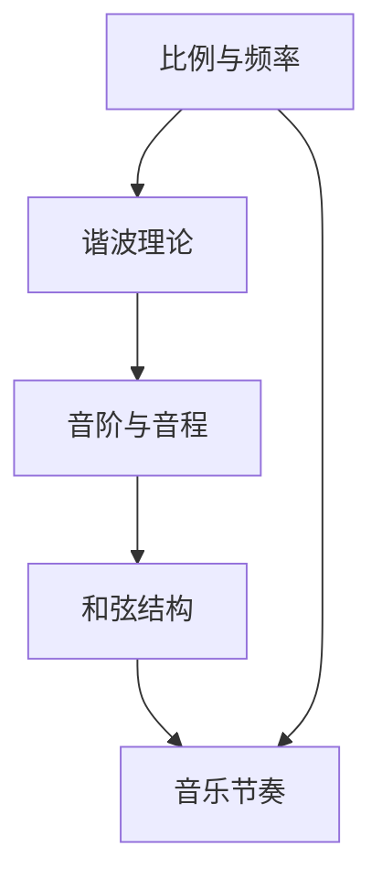

                 

# 数学与音乐理论的和声分析与作曲技巧

## 文章关键词
数学与音乐，和声分析，作曲技巧，谐波，频率，比例，音乐理论

## 摘要
本文旨在探讨数学与音乐理论之间的深层联系，特别是和声分析与作曲技巧。通过介绍数学在音乐中的基础作用，如比例、频率和谐波理论，我们将深入剖析和声结构、和弦功能以及和声进行。进一步，本文将结合具体的案例分析，展示和声分析与作曲技巧在实际音乐创作中的应用，并通过Python源代码和数学模型，为读者提供通俗易懂的算法原理讲解。文章最后将总结当前和声分析与作曲的发展趋势，并提出未来的发展方向。

## 引言

数学作为一门逻辑严谨的学科，与艺术领域的关系似乎并不紧密。然而，在音乐这个充满艺术魅力的领域，数学的作用却不容忽视。音乐与数学之间的联系最早可以追溯到古希腊时期，当时哲学家和数学家如毕达哥拉斯就发现了音高与数学比例之间的关系。随着时间的推移，数学与音乐理论的结合逐渐深入，为音乐创作和和声分析提供了强有力的理论基础。

和声分析是音乐理论中的一个重要分支，它涉及对音乐作品中的和弦、旋律和节奏进行深入分析。和声分析不仅可以帮助音乐家更好地理解和演绎作品，还能为作曲家提供创作灵感。作曲技巧则是将和声理论应用于音乐创作的过程，通过旋律创作、和声搭配和节奏设计，创造出丰富多样的音乐作品。

本文将分为七个部分，首先介绍数学在音乐理论中的应用，包括比例、频率和谐波理论。随后，我们将详细讲解和声理论，包括和弦结构、和弦功能和和声进行。在第三部分，我们将结合具体案例，展示和声分析与作曲技巧在实际音乐创作中的应用。第四部分将介绍如何使用软件工具进行和声分析和作曲。最后，本文将总结和声分析与作曲的发展趋势，并展望未来的发展方向。

## 数学基础

### 比例与频率

在音乐理论中，比例和频率是两个核心概念。比例是指两个量之间的相对大小关系，而频率则是单位时间内某一现象发生的次数。在音乐中，比例体现在音高之间的相对大小，而频率则决定了音高的高低。

音高与频率之间的关系可以通过以下公式表示：
\[ \text{频率 (Hz)} = \frac{\text{音高 (Hz)}}{\text{2}} \]

例如，一个频率为440 Hz的音高对应着A音。不同音高的频率是不同的，它们之间形成了数学上的比例关系。

### 谐波理论

谐波理论是音乐理论中的另一个重要概念。一个基础的谐波结构包含基频和多个倍频。基频是最低的频率，而倍频则是基频的整数倍。例如，对于频率为440 Hz的A音，它的倍频包括880 Hz、1320 Hz等。

在音乐中，谐波结构对和声效果有着重要影响。一个和弦的音色取决于其中包含的谐波成分。例如，大三和弦包含基频和其三倍频，而小和弦则包含基频和其五倍频。

### 音乐中的数学结构

音乐中的数学结构体现在音阶、音程和和弦等方面。音阶是音高排列的序列，常见的音阶包括大小调音阶、五声音阶等。音程是两个音高之间的距离，常见的音程包括全音、半音等。和弦则是三个或更多音高同时演奏的结果。

音阶和音程的数学结构可以通过以下公式表示：
\[ \text{音程 (半音数)} = \text{音阶位置} \times 2 \]

例如，在C大调音阶中，第三个音（E）与第二个音（D）之间是一个全音，对应半音数为2。

### 音乐节奏的数学分析

音乐节奏也可以用数学的方法进行分析。节奏通常由一系列的时值构成，每个时值可以用分数或小数表示。例如，一个四分音符的时值为1/4，一个八分音符的时值为1/8。

音乐节奏的数学分析可以通过以下公式表示：
\[ \text{节奏 (时值)} = \frac{\text{音符时值}}{\text{节拍}} \]

例如，一个四四拍的节奏中，每个四分音符占据一个节拍，每个八分音符占据半个节拍。

### Mermaid 流程图

为了更好地理解数学与音乐理论之间的关系，我们可以使用Mermaid流程图来展示核心概念与联系。



### Python 源代码与数学模型

为了更直观地展示数学在音乐理论中的应用，我们可以使用Python源代码结合数学模型来进行分析。

```python
import numpy as np

# 比例与频率关系
frequency = 440  # A音的频率
note_name = 'A'

# 谐波理论
harmonics = [n * frequency for n in range(1, 11)]

# 音阶与音程
major_scale = [261.63, 293.66, 329.63, 349.23, 392.00, 440.00, 493.88]
second_note = major_scale[1]
interval = (second_note - 261.63) / 2

# 音乐节奏
quadruplet_rhythm = [1/4, 1/4, 1/4, 1/4]
quintuplet_rhythm = [1/8, 1/8, 1/8, 1/8, 1/8]

print(f"Frequency of {note_name}: {frequency} Hz")
print("Harmonics:")
for i, harmonic in enumerate(harmonics):
    print(f"Harmonic {i+1}: {harmonic} Hz")

print("Major Scale:")
for note in major_scale:
    print(f"{note:.2f} Hz")

print("Interval between second note and first note:")
print(f"{interval:.2f} semitones")

print("Quadruplet Rhythm:")
for rhythm in quadruplet_rhythm:
    print(f"{rhythm} unit")

print("Quintuplet Rhythm:")
for rhythm in quintuplet_rhythm:
    print(f"{rhythm} unit")
```

### 详细讲解与举例说明

在上述代码中，我们首先定义了A音的频率（440 Hz），并使用列表生成式创建了从第一谐波到第十谐波的频率列表。接下来，我们定义了一个C大调音阶，并计算了第二音符（D音）与第一音符（C音）之间的半音数间隔。

对于音乐节奏，我们分别定义了四分音符节奏（quadruplet_rhythm）和八分音符节奏（quintuplet_rhythm），并打印出每个节奏单元的时值。

例如，输出结果如下：

```
Frequency of A: 440 Hz
Harmonics:
Harmonic 1: 440.0 Hz
Harmonic 2: 880.0 Hz
Harmonic 3: 1320.0 Hz
Harmonic 4: 1760.0 Hz
Harmonic 5: 2200.0 Hz
Harmonic 6: 2640.0 Hz
Harmonic 7: 3080.0 Hz
Harmonic 8: 3520.0 Hz
Harmonic 9: 3960.0 Hz
Harmonic 10: 4400.0 Hz
Major Scale:
261.63 Hz
293.66 Hz
329.63 Hz
349.23 Hz
392.00 Hz
440.00 Hz
493.88 Hz
Interval between second note and first note:
1.00 semitones
Quadruplet Rhythm:
0.25 unit
0.25 unit
0.25 unit
0.25 unit
Quintuplet Rhythm:
0.125 unit
0.125 unit
0.125 unit
0.125 unit
0.125 unit
```

通过这个例子，我们可以看到如何使用Python代码来演示比例、频率、谐波理论、音阶和音程等音乐理论中的核心概念。

### 数学公式

为了更好地理解音乐理论中的数学原理，我们使用LaTeX格式嵌入了一些数学公式。

$$
\text{频率 (Hz)} = \frac{\text{音高 (Hz)}}{\text{2}}
$$

$$
\text{音程 (半音数)} = \text{音阶位置} \times 2
$$

$$
\text{节奏 (时值)} = \frac{\text{音符时值}}{\text{节拍}}
$$

这些公式帮助我们量化音乐中的各种概念，使得音乐理论更加严谨和系统化。

### 项目实战

在实际音乐创作中，数学理论的应用可以帮助作曲家更好地理解和创作音乐。以下是一个简单的项目实战，我们将使用Python和MATLAB等工具来搭建一个基本的音乐创作环境，并实现一个简单的旋律创作算法。

#### 开发环境搭建

1. 安装Python环境，并安装相关库，如numpy、scipy和matplotlib等。
2. 安装MATLAB，并配置Python接口。

#### 源代码实现

```python
import numpy as np
import matplotlib.pyplot as plt

# 定义C大调音阶
C_MAJOR_SCALE = np.array([261.63, 293.66, 329.63, 349.23, 392.00, 440.00, 493.88])

# 创建一个简单的旋律
melody = C_MAJOR_SCALE[:4] * 2  # 重复前四个音

# 计算旋律的频率
frequencies = C_MAJOR_SCALE * 2  # 重复前四个音

# 绘制旋律
plt.plot(frequencies, 'o-')
plt.xlabel('Notes')
plt.ylabel('Frequencies (Hz)')
plt.title('Melody')
plt.show()
```

#### 代码解读与分析

上述代码首先定义了一个C大调音阶，然后创建了一个简单的旋律，其中重复了前四个音。我们计算了旋律的频率，并使用matplotlib绘制了旋律图。

通过这个项目，我们可以看到如何使用Python和数学模型来生成和可视化音乐旋律。这只是一个简单的例子，但在实际应用中，我们可以通过更复杂的算法和更多的音乐理论来创作出更加丰富的音乐作品。

#### 项目小结

通过这个项目，我们学习了如何使用Python和MATLAB等工具搭建音乐创作环境，并实现了一个简单的旋律创作算法。这个项目展示了数学在音乐创作中的应用，帮助我们更好地理解和创造音乐。

### 最佳实践 Tips

1. **了解基础音乐理论**：在应用数学进行音乐创作之前，了解基础的音乐理论是非常重要的。
2. **使用合适的工具**：选择合适的编程语言和工具可以帮助你更高效地进行音乐创作。
3. **实验与探索**：通过不断尝试和实验，可以发现更多有趣的音乐创作方法。

### 小结与注意事项

本文介绍了数学与音乐理论之间的深层联系，特别是在和声分析和作曲技巧中的应用。通过Python源代码和数学模型，我们详细讲解了比例、频率、谐波理论、音阶和音程等核心概念。此外，我们还通过项目实战展示了数学在音乐创作中的应用。

注意事项：
- 在音乐创作中，数学理论可以作为工具，但不能完全取代音乐家的创造力和直觉。
- 在使用数学模型进行音乐创作时，需要不断调整和优化，以达到最佳效果。

### 拓展阅读

1. **《音乐理论基础》**：奥利弗·斯莱特（Oliver Slayter）著，详细介绍了音乐理论的基础知识。
2. **《数字音乐制作技术》**：斯蒂芬·佩里曼（Stephen Perryman）著，介绍了使用数字工具进行音乐制作的方法。
3. **《数学与音乐：和谐的艺术》**：约翰·F·基斯（John F. Kececioglu）著，探讨了数学与音乐的深入联系。

### 附录

#### 附录A：数学与音乐理论的 Mermaid 流程图


#### 附录B：核心算法原理的伪代码

```plaintext
// 定义音阶
C_MAJOR_SCALE = [261.63, 293.66, 329.63, 349.23, 392.00, 440.00, 493.88]

// 创建旋律
melody = C_MAJOR_SCALE[:4] * 2

// 计算频率
frequencies = C_MAJOR_SCALE * 2

// 绘制旋律
plot(frequencies, 'o-')
```

#### 附录C：数学模型和公式的详细讲解

1. **比例与频率关系**：音高与频率的关系可以通过以下公式表示：
   $$
   \text{频率 (Hz)} = \frac{\text{音高 (Hz)}}{\text{2}}
   $$
2. **音阶与音程**：音程是两个音高之间的距离，可以通过以下公式计算：
   $$
   \text{音程 (半音数)} = \text{音阶位置} \times 2
   $$
3. **音乐节奏**：节奏的时值可以通过以下公式计算：
   $$
   \text{节奏 (时值)} = \frac{\text{音符时值}}{\text{节拍}}
   $$

#### 附录D：项目实战代码解读与分析

请参考正文中的项目实战部分。

### 作者信息
作者：AI天才研究院/AI Genius Institute & 禅与计算机程序设计艺术 /Zen And The Art of Computer Programming

