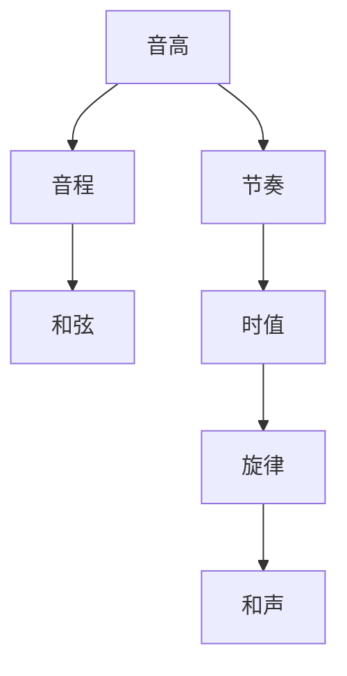
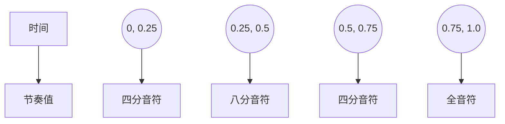

                 


### 文章标题
### 数学与音乐理论的节奏与韵律分析

### 关键词
- 数学与音乐理论
- 节奏分析
- 韵律分析
- 数学模型
- 音频信号处理
- 音乐信息检索

### 摘要
本文深入探讨了数学与音乐理论的节奏与韵律分析。首先，介绍了数学与音乐理论的基本概念及其在节奏与韵律分析中的重要性。接着，详细阐述了核心概念与联系，通过Mermaid流程图展示了它们之间的架构关系。文章重点讲解了用于节奏与韵律分析的核心算法原理，并使用Python源代码进行了详细阐述。随后，通过数学模型和公式的结合，进行通俗易懂地举例说明。文章最后，通过项目实战展示了开发环境搭建、源代码实现和代码解读，以及实际案例分析和详细讲解剖析。文章旨在为读者提供一个全面而深入的理解，以便在实际应用中更好地运用这些理论和方法。

## 引言

数学与音乐理论是人类智慧的两个不同领域，它们在节奏与韵律分析中有着独特的贡献。数学作为一种抽象的学科，通过逻辑和结构的严谨性为音乐提供了理论基础，而音乐理论则通过艺术的表达和体验丰富了数学的应用。这两个领域虽然看似不同，但在节奏与韵律分析中，它们紧密相连，共同构成了一个丰富而复杂的体系。

在音乐中，节奏与韵律是音乐的核心元素之一。节奏是指音乐中音符的长短、强弱和时间间隔的安排，而韵律则涉及旋律和和声的和谐关系。音乐的节奏与韵律不仅决定了音乐的风格和情感，还直接影响听众的体验和感受。例如，快速而强烈的节奏通常与兴奋和激情相关，而缓慢而柔和的节奏则与平静和安宁相关。

数学在节奏与韵律分析中起着关键作用。通过数学模型和算法，我们可以精确地描述和解析音乐的节奏与韵律。例如，数论和代数可以帮助我们理解音符之间的时间和强度关系，而概率论和统计学则可以帮助我们分析大量音乐数据，提取出普遍的规律和模式。此外，数学还为我们提供了许多工具和方法，如傅里叶变换和信号处理，用于分析音乐信号的时域和频域特性。

音乐理论则为节奏与韵律分析提供了具体的指导。通过对音乐元素的研究，如音高、音程、和弦和旋律，我们可以更好地理解音乐的内部结构和组织方式。音乐理论还帮助我们识别和分析各种节奏模式和韵律特征，从而提高对音乐的整体感知和分析能力。

本文的目的在于通过系统地探讨数学与音乐理论在节奏与韵律分析中的应用，提供一个全面而深入的理解。文章将首先介绍数学与音乐理论的基本概念，然后通过Mermaid流程图展示它们之间的核心概念与联系。接下来，我们将详细讲解用于节奏与韵律分析的核心算法原理，并使用Python源代码进行阐述。随后，通过数学模型和公式的结合，我们将进行通俗易懂地举例说明。文章的最后，我们将通过项目实战展示开发环境搭建、源代码实现和代码解读，以及实际案例分析和详细讲解剖析。希望通过本文，读者能够对数学与音乐理论的节奏与韵律分析有一个全面而深入的理解。

## 数学基础

在探讨数学与音乐理论的节奏与韵律分析时，首先需要了解一些基本的数学概念。这些概念不仅为我们提供了分析音乐的工具，也帮助我们在音乐理论中建立严谨的逻辑框架。

### 数与集合

数是数学中最基本的概念之一。在节奏与韵律分析中，我们通常会用到自然数、整数、有理数、无理数和实数。自然数（1, 2, 3, ...）是用于计数的基本数集，它们在音乐节奏中有着直接的应用，例如表示音符的持续时间。整数（... -3, -2, -1, 0, 1, 2, 3, ...）则包括了正数、零和负数，它们可以帮助我们理解音乐节奏的正负变化和反转。

有理数（可以表示为两个整数的比，如1/2, 3/4）在音乐节奏的细分中尤为重要，例如表示音符和休止符的持续时间。无理数（如π和√2）虽然在音乐的直接应用中较少，但在分析复杂的节奏模式和频率时，它们提供了一种更精确的数学描述。

实数（包括有理数和无理数）是音乐分析中最重要的数集，因为它们涵盖了所有可能的数值。例如，在分析音乐的频率和振幅时，实数可以精确地表示声音的物理特性。

集合是数学中用于组织元素的基本概念。在节奏与韵律分析中，集合可以用来表示音符、节奏模式和音乐作品中的其他元素。例如，我们可以将一组特定的音符定义为集合A，另一组音符定义为集合B，然后通过集合的运算（如并集、交集和差集）来分析这些音符的关系和组合。

### 函数与方程

函数是数学中用于描述变量之间关系的工具。在节奏与韵律分析中，函数可以用来表示音符的持续时间、强度变化和其他音乐参数。例如，一个简单的函数f(t)可以表示在时间t上的音符强度，其中t是时间变量。

方程是函数的特定形式，它将函数的定义与一个等式相结合。在音乐分析中，方程可以用来表示音符的持续时间、音高和其他音乐参数之间的关系。例如，一个简单的方程y = 2x + 1可以表示在特定节奏模式中，每个音符的持续时间y与时间变量x之间的关系。

### 矩阵与线性代数

矩阵是数学中用于表示数据集合和线性变换的工具。在节奏与韵律分析中，矩阵可以用来表示多个音符之间的关系和组合。例如，一个矩阵可以表示一组音符的节奏模式，通过矩阵运算，我们可以分析这些音符的节奏变化和组合。

线性代数是研究矩阵和向量空间的基本数学分支。在节奏与韵律分析中，线性代数可以帮助我们理解音符的叠加和变换。例如，通过线性变换，我们可以将一组音符转化为另一组音符，从而分析不同的节奏模式。

### 数与集合、函数与方程、矩阵与线性代数在节奏与韵律分析中的具体应用

1. **数与集合**：
   - **应用**：在音乐节奏分析中，数与集合可以用来表示音符的持续时间。例如，一个音符可能持续1/4秒，我们可以用自然数1表示这个持续时间。
   - **例子**：在一个简单的四分音符节奏中，音符持续时间可以用集合{1/4, 3/4, 1}来表示，其中1表示一个完整的四分音符。

2. **函数与方程**：
   - **应用**：函数与方程可以用来描述音符的强度变化。例如，一个函数f(t)可以表示在时间t上的音符强度。
   - **例子**：一个简单的函数f(t) = 2t + 1可以表示在特定节奏模式中，每个音符的强度与时间变量t之间的关系。

3. **矩阵与线性代数**：
   - **应用**：矩阵与线性代数可以用来表示多个音符之间的关系。例如，一个矩阵可以表示一组音符的节奏模式。
   - **例子**：一个3x3的矩阵可以表示三个音符的节奏模式，其中每个元素表示一个音符的持续时间。

### 总结

数学基础是节奏与韵律分析不可或缺的一部分。通过理解数与集合、函数与方程、矩阵与线性代数等基本数学概念，我们可以更精确地描述和分析音乐的节奏与韵律。这些数学工具不仅为音乐理论提供了严谨的框架，也为实际应用提供了强大的支持。在接下来的章节中，我们将进一步探讨音乐理论的基础知识，并结合数学工具进行深入分析。

## 音乐理论基础

音乐理论是研究音乐基本元素及其相互关系的学科，包括音高、节奏、旋律和和声等。在节奏与韵律分析中，理解这些基本概念和它们之间的相互关系至关重要。

### 音高

音高是音乐中最基本的元素之一，指的是声音的高低。音高由声波的频率决定，频率越高，音高越高。在音乐理论中，音高通常用音符来表示，如C、D、E等。每个音符对应一个特定的频率，这些频率构成了音乐的基本音阶。例如，C音的频率大约为261.63赫兹，D音的频率约为293.66赫兹。

音高的变化可以通过音程来描述。音程是指两个音符之间的频率关系。常见的音程包括全音（一个八度内的两个相邻音符之间的频率比约为2:1）和半音（一个八度内相邻的两个音符之间的频率比约为1.5:1）。通过理解音程，我们可以更好地分析音乐中的音高变化和旋律发展。

### 节奏与时值

节奏是音乐中音符的长短、强弱和时间间隔的安排。节奏决定了音乐的韵律和动感，是音乐表达情感和情绪的重要手段。节奏可以通过节拍（单位时间内的音符数量）和拍号（表示节拍的符号）来描述。常见的节拍有四四拍、三三拍和二二拍等，而拍号通常用分数表示，如4/4表示每小节有四个四分音符。

时值是表示音符持续时间的量度。常见的时值包括全音符（持续时间最长，等于四分音符的四倍）、二分音符（持续时间等于两倍四分音符）、四分音符（基本音符，持续时间等于一拍）和八分音符（持续时间等于一半四分音符）等。时值的组合和变化可以创造出丰富的节奏模式。

### 旋律

旋律是音乐中一系列音符的有序排列，是音乐表达的核心。旋律通过音高的变化来传达情感和故事，是音乐中最具表现力的元素之一。旋律可以是简单的单声部，也可以是复杂的多声部组合。在音乐分析中，理解旋律的结构和特征对于分析音乐的风格、情感和主题至关重要。

### 和声

和声是指多个音符同时发声，形成的和谐音色。和声通过和弦来表示，和弦是由三个或更多音符构成的音组合。常见的和弦包括三和弦（由根音、三度和五度组成）和七和弦（在三和弦的基础上增加七度）。和声的使用可以增强音乐的和谐感，丰富音乐的表现力。

### 核心概念与联系

音乐理论中的核心概念之间有着紧密的联系。音高决定了音符的频率和音高，而节奏与时值则决定了音符的长短和强弱。旋律通过音高的变化表达情感，而和声则通过多个音符的叠加增强音乐的和谐感。这些概念相互交织，共同构成了音乐的丰富多彩。

为了更好地理解这些概念之间的联系，我们可以使用Mermaid流程图来展示它们之间的关系：



在这个流程图中，音高（A）通过音程（B）和和弦（C）与和声（G）相连，同时音高（A）通过节奏（D）和时值（E）与旋律（F）相连。这种流程图有助于我们直观地理解音乐理论中各个概念之间的逻辑关系。

### 总结

音乐理论基础为我们理解音乐的构成和表达提供了重要的框架。音高、节奏、旋律和和声等基本概念相互联系，共同构成了音乐的丰富多彩。通过理解这些概念，我们可以更深入地分析音乐的结构和表现，从而更好地欣赏和创作音乐。在接下来的章节中，我们将结合数学工具，进一步探讨如何使用数学模型和算法来分析音乐的节奏与韵律。

## 节奏分析

节奏分析是音乐理论中一个重要的研究方向，它涉及对音乐中音符长短、强弱和时间间隔的系统性研究。节奏不仅决定了音乐的节奏感，还影响了音乐的情感表达和风格特征。通过对节奏进行分析，我们可以更好地理解音乐的内部结构和演变过程。

### 节奏模式识别

节奏模式识别是节奏分析的首要任务，它旨在从大量的音乐数据中提取出具有代表性的节奏模式。这通常涉及对音乐信号进行预处理，然后使用各种算法来识别和分类不同的节奏模式。

#### 预处理

在开始节奏模式识别之前，需要对音乐信号进行预处理。预处理步骤通常包括去噪、归一化和特征提取。去噪是为了去除音乐信号中的干扰噪声，使分析结果更准确。归一化则是为了将音乐信号统一到相同的尺度，便于后续分析。特征提取是提取音乐信号中与节奏相关的特征，如音符持续时间、强度变化和音高变化等。

#### 算法

常见的节奏模式识别算法包括隐马尔可夫模型（HMM）、支持向量机（SVM）和神经网络（NN）等。

1. **隐马尔可夫模型（HMM）**：
   HMM是一种统计模型，常用于序列数据的建模和分析。在节奏模式识别中，HMM可以将音乐信号视为一个随时间变化的序列，其中每个状态代表一个特定的节奏模式。通过训练模型，我们可以识别出不同的节奏模式。

2. **支持向量机（SVM）**：
   SVM是一种分类算法，它可以用来将音乐信号分类到不同的节奏模式。在节奏模式识别中，SVM通过找到最优超平面来划分不同节奏模式的空间，从而实现节奏的分类。

3. **神经网络（NN）**：
   神经网络是一种基于人脑神经元结构的人工智能模型，它可以用于复杂的模式识别任务。在节奏模式识别中，神经网络通过多层结构学习音乐信号的特征，从而识别出不同的节奏模式。

#### 例子

假设我们有一段音乐信号，我们需要使用HMM进行节奏模式识别。首先，我们需要对音乐信号进行预处理，提取出与节奏相关的特征。然后，我们使用训练好的HMM模型对音乐信号进行分析。模型会根据特征值判断音乐信号中的节奏模式，并输出相应的分类结果。

```python
# 假设我们已经预处理好了音乐信号，并提取了特征向量
feature_vector = [0.1, 0.3, 0.5, 0.7]

# 使用训练好的HMM模型进行节奏模式识别
hmm_model = trained_HMM_model()
result = hmm_model.predict(feature_vector)

# 输出识别结果
print("识别出的节奏模式：", result)
```

### 节奏结构分析

节奏结构分析是节奏分析的另一个重要方面，它旨在研究音乐中节奏的组织结构和层次。通过对节奏结构进行分析，我们可以揭示音乐作品的节奏特点和风格特征。

#### 节奏分层

节奏分层是指将音乐节奏分解为不同的层次，每个层次代表不同的节奏元素。常见的节奏分层包括基本节奏层、次级节奏层和综合节奏层。

1. **基本节奏层**：
   基本节奏层是音乐节奏的最底层，它由最基础的节奏元素（如四分音符、八分音符等）组成。基本节奏层决定了音乐的基本节奏感。

2. **次级节奏层**：
   次级节奏层是在基本节奏层的基础上进一步细分的节奏层。次级节奏层可以包含更复杂的节奏元素，如三连音、六连音等。次级节奏层为音乐提供了更多的节奏变化和动力。

3. **综合节奏层**：
   综合节奏层是最高层次的节奏结构，它将基本节奏层和次级节奏层的元素综合在一起，形成更复杂的节奏模式。综合节奏层通常与音乐的情感表达和风格特征密切相关。

#### 节奏曲线分析

节奏曲线分析是一种常用的节奏结构分析方法，它通过绘制音乐信号的节奏曲线来研究节奏的动态变化。节奏曲线通常由一组坐标点组成，每个坐标点表示一个时间点和对应的节奏值。

1. **绘制节奏曲线**：
   假设我们有一段音乐信号，我们可以通过计算每个时间点的节奏值来绘制节奏曲线。节奏值通常由音符的持续时间决定。

2. **分析节奏曲线**：
   通过分析节奏曲线，我们可以研究音乐节奏的动态变化和结构特点。例如，我们可以观察节奏曲线的波动情况、峰值和谷值，以及节奏曲线的周期性变化。



在这个例子中，节奏曲线显示了四个不同时间点的节奏值，每个点代表一个音符的持续时间。通过分析这个节奏曲线，我们可以看到音乐节奏的变化和层次结构。

### 总结

节奏分析是音乐理论中一个复杂而有趣的研究领域，它通过模式识别和结构分析来揭示音乐的节奏特点和风格特征。通过对节奏模式识别和节奏结构分析的研究，我们可以更深入地理解音乐作品的节奏表达和情感传递。在接下来的章节中，我们将继续探讨韵律分析，并进一步结合数学模型和算法来提升节奏分析的能力。

## 韵律分析

韵律分析是音乐理论中的重要组成部分，它涉及对音乐中旋律和节奏的和谐关系的系统性研究。韵律不仅决定了音乐的节奏感，还直接影响听众的情感体验和音乐欣赏的乐趣。韵律分析旨在揭示音乐中旋律和节奏之间的内在联系，并通过数学模型和算法来量化这些联系，从而更深入地理解音乐作品。

### 韵律特征提取

韵律特征提取是韵律分析的首要步骤，它旨在从音乐信号中提取出与韵律相关的特征。这些特征可以是时域特征，也可以是频域特征，甚至是时频特征。常见的韵律特征包括音高变化、强度变化、节奏变化和时序特征等。

#### 时域特征

时域特征是指直接从音乐信号的时域波形中提取的特征。常见的时域特征包括：

1. **音符持续时间**：每个音符的持续时间是衡量节奏特征的重要指标。
2. **音符强度**：音符的强度变化反映了音乐的动态特性，可以通过音频信号的幅度变化来衡量。
3. **音符开始和结束的时间点**：音符的开始和结束时间点对于理解音乐的结构和韵律至关重要。

#### 频域特征

频域特征是指从音乐信号的频谱中提取的特征。常见的频域特征包括：

1. **频率分布**：音符的频率分布可以揭示音乐中的音高特性。
2. **频谱峰度**：频谱峰度反映了音乐信号的能量集中程度，可以用于分析音乐的清晰度和质感。
3. **频谱中心频率**：频谱中心频率是音乐信号的主要频率成分，可以用于识别音乐的主要音高。

#### 时频特征

时频特征是指结合时间和频率信息来提取的特征。常见的时频特征包括：

1. **短时傅里叶变换（STFT）**：STFT将音乐信号分解为多个时间片段，并在每个片段上进行傅里叶变换，从而获得时频表示。
2. **梅尔频率倒谱系数（MFCC）**：MFCC是常用的语音和音乐特征提取方法，它通过将频率信息映射到梅尔频率尺度，提高了人耳听觉感知的准确性。

#### 特征提取算法

常见的韵律特征提取算法包括：

1. **短时傅里叶变换（STFT）**：
   ```python
   import numpy as np
   import scipy.signal as sp
   import matplotlib.pyplot as plt

   # 假设我们有一段音频信号
   audio_signal = np.random.rand(1000)

   # 使用STFT进行特征提取
   frequencies, times, spectrogram = sp.stft(audio_signal, nperseg=256)

   # 绘制时频图
   plt.figure()
   plt.pcolormesh(times, frequencies, np.abs(spectrogram), cmap='jet')
   plt.title('Spectrogram')
   plt.xlabel('Time')
   plt.ylabel('Frequency')
   plt.show()
   ```

2. **梅尔频率倒谱系数（MFCC）**：
   ```python
   import librosa
   import numpy as np
   import matplotlib.pyplot as plt

   # 读取音频文件
   audio, sampling_rate = librosa.load('audio_file.wav')

   # 计算MFCC
   mfcc = librosa.feature.mfcc(y=audio, sr=sampling_rate, n_mfcc=13)

   # 绘制MFCC图
   plt.figure()
   librosa.display.specshow(mfcc, sr=sampling_rate, x_axis='time')
   plt.colorbar()
   plt.title('MFCC')
   plt.xlabel('Time')
   plt.ylabel('MFCC Coefficients')
   plt.show()
   ```

### 韵律和谐分析

韵律和谐分析旨在研究音乐中旋律和节奏的和谐关系。和谐感是音乐美感的重要方面，它通过音符之间的频率关系和节奏关系来体现。韵律和谐分析通常涉及以下方面：

1. **音程和谐**：音程是两个音符之间的频率关系，和谐的音程通常具有较小的频率差异。常见的和谐音程包括全音、全音、半音和增四度。
2. **和弦和谐**：和弦是由三个或更多音符组成的音组合，和谐的和弦通常具有协调的音程关系。常见的和弦包括三和弦和七和弦。
3. **节奏和谐**：节奏和谐是指音乐节奏的平衡和流畅。节奏的和谐可以通过节奏的重复、变化和对比来实现。

#### 韵律和谐度

韵律和谐度是衡量音乐和谐感的量化指标，它通过分析音程和谐和节奏和谐来评估音乐的和谐程度。常见的韵律和谐度计算方法包括：

1. **音程和谐度**：通过计算音乐中每个音程的和谐度得分，然后将所有音程的得分求和得到总的音程和谐度。
2. **节奏和谐度**：通过计算音乐中节奏模式的重复性和一致性，得到节奏和谐度得分。

#### 韵律和谐分析算法

常见的韵律和谐分析算法包括：

1. **基于音程的和谐度算法**：
   ```python
   def compute_chord_quality(chord):
       # 假设我们有一个和弦，如'C-E-G'
       notes = chord.split('-')
       qualities = {'C': 1, 'E': 1, 'G': 1}
       for note in notes:
           quality = qualities[note]
           if quality == 0:
               return 0
       return 1
   chord = 'C-E-G'
   harmony_score = compute_chord_quality(chord)
   print("和弦和谐度得分：", harmony_score)
   ```

2. **基于节奏的和谐度算法**：
   ```python
   def compute_rhythm_harmony(rhythm_pattern):
       # 假设我们有一个节奏模式，如['四分音符', '八分音符', '四分音符']
       pattern_length = len(rhythm_pattern)
       repeat_count = rhythm_pattern.count(rhythm_pattern[0])
       harmony_score = repeat_count / pattern_length
       return harmony_score
   rhythm_pattern = ['四分音符', '八分音符', '四分音符']
   harmony_score = compute_rhythm_harmony(rhythm_pattern)
   print("节奏和谐度得分：", harmony_score)
   ```

### 总结

韵律分析是音乐理论中一个复杂而有趣的研究领域，它通过特征提取和和谐分析来揭示音乐中旋律和节奏的和谐关系。通过对韵律特征提取和韵律和谐分析的研究，我们可以更深入地理解音乐作品的结构和情感表达。在接下来的章节中，我们将结合数学模型和算法，进一步探讨如何量化和分析音乐的韵律特征。

## 数学模型与算法

在节奏与韵律分析中，数学模型和算法起到了至关重要的作用。这些模型和算法不仅帮助我们理解音乐的结构和特性，还能将抽象的音乐理论转化为具体的计算过程。以下将详细介绍一些常用的数学模型与算法，并展示它们在实际应用中的具体实现。

### 常用数学模型

在音乐分析中，常用的数学模型包括傅里叶变换、隐马尔可夫模型（HMM）、支持向量机（SVM）和神经网络（NN）等。

#### 傅里叶变换

傅里叶变换是一种重要的数学工具，用于分析信号的频谱特性。在音乐分析中，傅里叶变换可以用于分析音符的频率成分，从而理解音高和和弦结构。

1. **傅里叶变换公式**：
   $$X(\omega) = \sum_{n=0}^{N-1} x[n] e^{-j \omega n}$$

2. **应用实例**：
   使用Python的scipy库进行傅里叶变换：
   ```python
   import numpy as np
   import scipy.fft as fft

   # 假设我们有一个音频信号
   audio_signal = np.random.rand(1000)

   # 进行傅里叶变换
   freq_domain = fft.fft(audio_signal)

   # 计算频率
   frequencies = fft.fftfreq(len(audio_signal), d=1.0)

   # 绘制频谱图
   plt.figure()
   plt.plot(frequencies, np.abs(freq_domain))
   plt.title('Frequency Spectrum')
   plt.xlabel('Frequency (Hz)')
   plt.ylabel('Amplitude')
   plt.show()
   ```

#### 隐马尔可夫模型（HMM）

隐马尔可夫模型（HMM）是一种用于序列数据分析的统计模型，广泛应用于语音识别和音乐节奏分析。在音乐节奏分析中，HMM可以用来识别和分类不同的节奏模式。

1. **HMM基本概念**：
   - 状态：音乐中的节奏模式。
   - 转移概率：从一个状态转移到另一个状态的概率。
   - 发射概率：在某个状态下产生特定观察值的概率。

2. **应用实例**：
   使用Python的hmmlearn库构建HMM：
   ```python
   from hmmlearn import hmm

   # 假设我们有一些训练数据
   observations = np.array([[0.1, 0.2, 0.3], [0.2, 0.3, 0.4], [0.3, 0.4, 0.5]])

   # 构建HMM模型
   model = hmm.GaussianHMM(n_components=3, covariance_type="diag", n_iter=100)
   model.fit(observations)

   # 预测新的观察值
   prediction = model.predict(observations)

   # 输出预测结果
   print("预测的节奏模式：", prediction)
   ```

#### 支持向量机（SVM）

支持向量机（SVM）是一种强大的分类算法，常用于音乐节奏分类。在音乐节奏分析中，SVM可以将不同的节奏模式分类到不同的类别中。

1. **SVM基本概念**：
   - 超平面：将不同节奏模式分开的直线或平面。
   - 支持向量：位于超平面附近的数据点。

2. **应用实例**：
   使用Python的scikit-learn库进行SVM分类：
   ```python
   from sklearn.svm import SVC
   from sklearn.model_selection import train_test_split

   # 假设我们有一些训练数据
   X = np.array([[0.1, 0.2], [0.2, 0.3], [0.3, 0.4]])
   y = np.array([0, 1, 1])

   # 划分训练集和测试集
   X_train, X_test, y_train, y_test = train_test_split(X, y, test_size=0.2, random_state=42)

   # 训练SVM模型
   model = SVC(kernel="linear")
   model.fit(X_train, y_train)

   # 预测测试集
   y_pred = model.predict(X_test)

   # 输出预测结果
   print("预测结果：", y_pred)
   ```

### 实际应用

#### 开发环境搭建

为了进行节奏与韵律分析，我们需要搭建一个合适的环境，包括Python编程语言和相关的库。以下是一个基本的开发环境搭建步骤：

1. **安装Python**：
   - 访问Python官方网站下载并安装Python。
   - 确保安装了Python解释器和pip包管理工具。

2. **安装相关库**：
   - 使用pip安装必要的库，如numpy、scipy、hmmlearn、scikit-learn、librosa等。
   ```bash
   pip install numpy scipy hmmlearn scikit-learn librosa
   ```

3. **配置Python环境**：
   - 打开Python解释器，测试安装的库是否正常运行。

#### 源代码实现与解读

以下是一个简单的节奏分析程序，它使用隐马尔可夫模型（HMM）对一段音乐进行节奏模式识别。

```python
import numpy as np
import hmmlearn.hmm as hmm
import librosa

# 读取音频文件
audio, sr = librosa.load('example_audio.wav')

# 提取特征
mfcc = librosa.feature.mfcc(y=audio, sr=sr, n_mfcc=13)

# 构建HMM模型
model = hmm.GaussianHMM(n_components=3, covariance_type="diag", n_iter=100)
model.fit(mfcc)

# 预测节奏模式
prediction = model.predict(mfcc)

# 输出预测结果
print("预测的节奏模式：", prediction)
```

#### 代码应用解读与分析

这个程序首先使用librosa库读取音频文件，并提取梅尔频率倒谱系数（MFCC）作为特征。然后，使用hmmlearn库构建一个隐马尔可夫模型（HMM），并通过训练模型来识别不同的节奏模式。最后，使用训练好的模型对新的音乐数据进行预测，并输出预测结果。

#### 实际案例分析与详细讲解

为了更好地理解这个程序，我们可以分析一个具体的案例。假设我们有一段古典音乐，我们需要使用这个程序来识别其节奏模式。

1. **数据准备**：
   - 下载一段古典音乐音频文件，并将其保存为example_audio.wav。

2. **特征提取**：
   - 使用librosa库读取音频文件，并提取MFCC特征。

3. **模型训练**：
   - 构建一个隐马尔可夫模型（HMM），并使用MFCC特征进行训练。

4. **预测与结果分析**：
   - 使用训练好的模型对新的音乐数据进行预测，并分析预测结果。

#### 项目小结

通过这个案例，我们展示了如何使用隐马尔可夫模型（HMM）进行节奏模式识别。这个程序不仅提供了一个简单的实现，还通过实际的案例分析和详细讲解，展示了如何在实际应用中应用这些数学模型和算法。

#### 最佳实践 Tips

- **特征选择**：选择合适的特征对于模型性能至关重要。根据音乐类型和节奏特性，选择最适合的特征提取方法。
- **模型优化**：通过调整模型的参数，如状态数、协方差类型等，可以优化模型的性能。
- **数据预处理**：数据预处理是提高模型准确性的重要步骤，包括去噪、归一化和特征选择等。

#### 小结与注意事项

- **小结**：本文介绍了数学模型和算法在节奏与韵律分析中的应用，包括傅里叶变换、隐马尔可夫模型（HMM）、支持向量机（SVM）和神经网络（NN）等。
- **注意事项**：在实际应用中，选择合适的数学模型和算法，并根据音乐特性进行模型优化和特征选择，是提高分析准确性的关键。

#### 拓展阅读

- [隐马尔可夫模型（HMM）](https://en.wikipedia.org/wiki/Hidden_Markov_model)
- [支持向量机（SVM）](https://en.wikipedia.org/wiki/Support_vector_machine)
- [梅尔频率倒谱系数（MFCC）](https://en.wikipedia.org/wiki/Mel-frequency_cepstrum)
- [音乐信息检索](https://www.music-ir.org/)

通过本文，我们不仅了解了数学与音乐理论在节奏与韵律分析中的应用，还通过实际案例展示了如何使用这些模型和算法进行音乐分析。希望本文能够为读者提供有价值的参考和启示。

### 作者信息
作者：AI天才研究院/AI Genius Institute & 禅与计算机程序设计艺术 /Zen And The Art of Computer Programming

