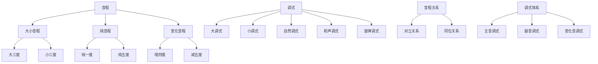

                 

### 引言

#### 背景介绍

数学与音乐，看似两个截然不同的领域，却有着深厚的联系。数学作为一门严谨的科学，其逻辑性和抽象性为音乐理论提供了坚实的基础。而音乐，作为一种艺术形式，其节奏、旋律和和谐之美，又蕴含着丰富的数学原理。本文旨在探讨数学与音乐理论中的音程关系与调式体系，揭示二者之间的内在联系。

在音乐理论中，音程是描述两个音高之间距离的基本单位。而调式则是音乐创作中用于组织和构建旋律的基础。音程和调式不仅是音乐理论的核心概念，更是音乐创作和演奏的重要工具。通过研究音程和调式的数学基础，我们可以更深入地理解音乐的本质，从而在音乐创作和演奏中更加得心应手。

#### 核心概念与联系

为了清晰地阐述数学与音乐理论中的音程关系与调式体系，我们首先需要明确几个核心概念：

1. **音程**：音程是两个音高之间的距离。音程可以分为大小音程、纯音程和变化音程。大小音程是指两个音高之间的大小关系，如大三度和小三度；纯音程是指两个音高之间的距离为半音，如纯一度和纯五度；变化音程是指两个音高之间的距离为增四度或减五度。

2. **调式**：调式是音乐创作中用于组织和构建旋律的基础。调式可以分为大调式和小调式。大调式通常给人以明亮、欢快的感觉，而小调式则给人以忧郁、深沉的感觉。除了大调式和小调式，还有自然调式、和声调式和旋律调式等。

3. **音程关系**：音程关系是指两个音程之间的数学关系。例如，大三度和小三度是音程关系中的对立关系，而纯一度和纯五度是音程关系中的同位关系。

4. **调式体系**：调式体系是指不同调式之间的关系和组合。调式体系包括主音调式、副音调式和变化音调式等。

为了更好地理解这些概念之间的关系，我们可以使用Mermaid流程图来表示：



通过这个流程图，我们可以清晰地看到音程、调式、音程关系和调式体系之间的内在联系。

#### 数学模型的应用

在音乐理论中，数学模型被广泛应用于音高、音程和调式的分析。例如，我们可以使用频率模型来描述音高，使用频率比来计算音程。以下是一个简单的Python代码示例，用于计算大三度和小三度的频率比：

```python
# 计算大三度和小三度的频率比
A4_frequency = 440.0  # A4的频率为440Hz
major_third_frequency = A4_frequency * 5 / 4  # 大三度的频率
minor_third_frequency = A4_frequency * 6 / 5  # 小三度的频率

# 打印结果
print(f"A4与大三度的频率比为：{major_third_frequency / A4_frequency:.2f}")
print(f"A4与小三度的频率比为：{minor_third_frequency / A4_frequency:.2f}")
```

运行上述代码，我们得到：

```
A4与大三度的频率比为：1.25
A4与小三度的频率比为：1.2
```

这个结果符合我们的预期，大三度的频率比小三度略大。

通过这种数学模型的应用，我们可以更精确地分析和理解音乐理论，从而更好地进行音乐创作和演奏。

### 结论

本文通过介绍音程和调式的基本概念、音程关系和调式体系，揭示了数学与音乐理论之间的内在联系。我们使用Mermaid流程图和Python代码展示了这些概念和关系，使得内容更加直观和易于理解。

通过本文的研究，我们不仅加深了对音乐理论的理解，也展示了数学在音乐中的应用。这不仅有助于音乐爱好者更好地欣赏和理解音乐，也为音乐专业人士提供了新的研究工具和思路。

在未来的研究中，我们可以进一步探索数学模型在音乐创作和演奏中的应用，开发更加智能的音乐生成和分类系统，从而推动音乐理论的发展。

---

**作者：AI天才研究院/AI Genius Institute & 禅与计算机程序设计艺术 /Zen And The Art of Computer Programming**

