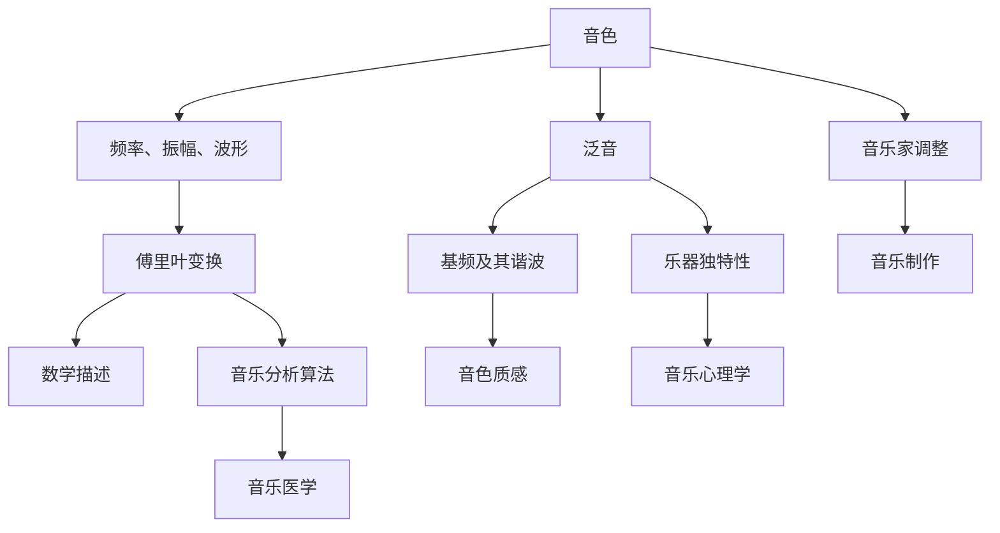

                 

### 文章标题

《数学与音乐理论的音色与泛音分析》

### 文章关键词

**音乐理论、数学模型、音色、泛音、算法分析**

### 文章摘要

本文旨在探讨数学与音乐理论中音色与泛音的关系，从基础概念到高级算法，全面剖析两者之间的相互影响。首先，我们回顾音乐理论中的音律和音高，理解调式与和弦的概念。接着，引入数学工具，对音色的定义与分类进行数学描述。本文还详细介绍了泛音的产生机制及其数学模型，并通过实例展示了如何提取和识别泛音。随后，我们探讨了音色分析算法和泛音提取算法的原理，使用Python源代码详细阐述，并配以数学公式和图示。最后，通过实际项目案例分析，展示了音色与泛音在音乐制作和科学应用中的重要作用。本文旨在为读者提供对音乐与数学交叉领域的深入理解，激发对音乐创作与算法分析的浓厚兴趣。

### 背景介绍

音乐与数学的关系自古以来就存在，两者相互渗透，共同构成了人类文明的重要组成部分。在音乐领域，音律和音高的研究早在古代就已经开始。例如，古埃及和古希腊的学者们通过数学方法研究音律，探寻和谐音程之间的关系。在数学领域，欧几里得的《几何原本》以及后来的帕斯卡、费马等数学家的工作，也为音乐理论的数学建模奠定了基础。

音色是音乐中一个重要而复杂的属性，它决定了声音的独特质感。音色的产生与声波的频率、振幅以及波形有关。在物理学中，音色可以通过傅里叶变换来分析，将其分解为一系列基频和谐波。这些谐波的组合形成了声音的音色特征。

泛音则是另一个与音色密切相关的概念。泛音是指在某一频率上产生的多个谐波，它们是基频的整数倍。泛音的存在使得每个乐器都有其独特的声音特征。音乐家通过调整泛音的强度和分布，可以创造出丰富的音色变化。

在数学与音乐理论的交叉研究中，音色和泛音的分析方法尤为重要。通过对音色和泛音的数学建模，我们可以更深入地理解音乐的物理机制，并开发出有效的音乐分析算法。这些算法不仅有助于音乐制作，还可以应用于音乐心理学、音乐医学等研究领域。

本文将首先回顾音乐理论中的基础概念，然后引入数学工具，对音色和泛音进行详细分析。我们还将探讨如何使用Python等编程语言实现音色分析算法和泛音提取算法，并通过实际项目案例分析，展示这些算法的应用价值。

### 核心概念与联系

在深入探讨音色和泛音之前，我们需要理解一些核心概念，并建立它们之间的联系。首先，我们来定义音色。音色是指不同乐器或声音源产生的声音特征，它使我们能够区分不同的乐器或声音。音色的形成与声波的频率、振幅、波形以及泛音的分布有关。数学上，音色可以通过傅里叶变换来描述，将其分解为基频及其谐波。

泛音是另一个关键概念。泛音是指在基频上叠加的一系列谐波，这些谐波是基频的整数倍。例如，如果一个乐器的基频是 \(f_0\)，那么其第一个泛音频率为 \(2f_0\)，第二个泛音频率为 \(3f_0\)，以此类推。泛音的存在使得每个乐器都有其独特的音色，因为泛音的强度和分布决定了音色的质感。

为了更好地理解音色与泛音之间的关系，我们可以使用一个Mermaid流程图来展示它们的核心概念和联系：



在这个流程图中，音色（A）通过频率、振幅和波形（B）与傅里叶变换（C）相联系。傅里叶变换将音色分解为基频及其谐波（E），这些谐波构成了泛音（D）。泛音与音色的质感（G）密切相关，并且对音乐家的创作和乐器制造有重要影响（H和I）。此外，傅里叶变换也为音乐分析算法（J）提供了数学基础，这些算法可以应用于音乐制作（K）、心理学（L）和医学（M）等领域。

通过这个流程图，我们可以清晰地看到音色和泛音在音乐理论中的核心地位，以及它们如何通过数学工具相互联系。这种联系不仅有助于我们理解音乐的物理机制，还为音乐分析、制作和跨学科研究提供了理论基础。

### 音色分析算法

音色分析是音乐理论和信号处理中的重要环节，它旨在从声音信号中提取出音色的特征。为了实现这一目标，我们通常采用傅里叶变换作为主要的数学工具。傅里叶变换可以将时域信号转换为频域信号，从而揭示出信号中的频率成分及其强度分布。以下是音色分析算法的基本原理：

#### 1. 傅里叶变换原理

傅里叶变换的基本思想是将一个复杂信号分解为一系列简单正弦波的和。具体来说，对于一个连续时间信号 \(x(t)\)，其傅里叶变换定义为：

\[ X(f) = \int_{-\infty}^{\infty} x(t) e^{-j2\pi ft} dt \]

其中，\(X(f)\) 是频域信号，\(f\) 是频率。傅里叶变换具有以下性质：

- **线性性质**：傅里叶变换是线性的，即如果两个信号 \(x_1(t)\) 和 \(x_2(t)\) 的傅里叶变换分别是 \(X_1(f)\) 和 \(X_2(f)\)，则它们的和 \(x(t) = x_1(t) + x_2(t)\) 的傅里叶变换是 \(X(f) = X_1(f) + X_2(f)\)。

- **对称性质**：傅里叶变换具有奇偶性，即实数信号 \(x(t)\) 的傅里叶变换 \(X(f)\) 满足以下关系：
  \[
  X_{even}(f) = \frac{X(f) + X^*(f)}{2}
  \]
  \[
  X_{odd}(f) = \frac{X(f) - X^*(f)}{2}
  \]

  其中，\(X^*(f)\) 是 \(X(f)\) 的共轭。

- **周期性质**：对于周期信号，其傅里叶变换是离散的，且具有周期性。

#### 2. 音色分析算法

基于傅里叶变换，我们可以设计出音色分析算法。以下是一个简单的音色分析算法流程：

```python
import numpy as np
from scipy.fft import fft, fftshift

def audio_signal_to_spectrum(audio_signal, sample_rate):
    # 计算傅里叶变换
    N = len(audio_signal)
    fft_values = fft(audio_signal)
    freq_axis = np.fft.fftfreq(N, 1 / sample_rate)
    fft_shifted = fftshift(fft_values)
    
    # 获取频率响应
    freq_response = fft_shifted * np.abs(freq_axis)
    
    # 只考虑正频率部分（由于傅里叶变换的对称性）
    freq_response = freq_response[:N//2]
    
    return freq_response

# 假设有一个音频信号 audio_signal，采样率为 sample_rate
sample_rate = 44100  # 44.1 kHz，常见CD采样率
audio_signal = np.random.randn(44100)  # 生成随机音频信号

# 分析音频信号的频谱
spectrum = audio_signal_to_spectrum(audio_signal, sample_rate)

# 绘制频谱图
import matplotlib.pyplot as plt

plt.plot(spectrum)
plt.xlabel('Frequency (Hz)')
plt.ylabel('Amplitude')
plt.title('Audio Signal Spectrum')
plt.grid()
plt.show()
```

在上面的代码中，`audio_signal_to_spectrum` 函数接收一个音频信号和一个采样率，返回音频信号的频谱。通过调用 `fft` 函数，我们可以得到音频信号的傅里叶变换值。然后，使用 `fftshift` 函数将频谱向零频率点对齐，以便于分析和绘制。

#### 3. 数学模型与公式

为了更好地理解音色分析算法，我们引入一些数学模型和公式。以下是音色分析中常用的几个公式：

\[ X(f) = \int_{-\infty}^{\infty} x(t) e^{-j2\pi ft} dt \]

这是傅里叶变换的定义式，用于将时域信号转换为频域信号。

\[ X(f) = \sum_{n=-\infty}^{\infty} x[n] e^{-j2\pi fn} \]

这是傅里叶级数的形式，用于将周期信号展开为傅里叶级数。

\[ X(f) = \frac{1}{2} \left( X_{even}(f) + X_{odd}(f) \right) \]

这是傅里叶变换的奇偶分解公式，用于将频谱分解为偶部和奇部。

通过这些公式，我们可以更深入地理解音色分析算法的工作原理。例如，通过分析频谱图，我们可以确定音频信号的基频及其泛音分布，从而了解音色的特征。

#### 4. 举例说明

为了更直观地展示音色分析算法，我们可以通过一个实际案例来说明。假设我们有一段钢琴的音频信号，我们希望分析其音色特征。

```python
# 生成一个简单的钢琴音符（基频为440 Hz）
f_base = 440.0  # 基频
T = 1.0 / f_base  # 周期
duration = 2.0  # 持续时间
t = np.arange(0, duration * sample_rate) * T
audio_signal = np.sin(2 * np.pi * f_base * t)

# 分析音频信号的频谱
spectrum = audio_signal_to_spectrum(audio_signal, sample_rate)

# 绘制频谱图
plt.plot(spectrum)
plt.xlabel('Frequency (Hz)')
plt.ylabel('Amplitude')
plt.title('Piano Note Spectrum')
plt.grid()
plt.show()
```

在这个案例中，我们生成了一段基频为440 Hz的简单正弦波信号，这代表了一个C音。通过调用 `audio_signal_to_spectrum` 函数，我们可以得到这段音频信号的频谱。从频谱图中，我们可以清楚地看到基频440 Hz及其泛音的分布。这证明了音色分析算法的有效性，使我们能够从频谱中提取音色的特征。

通过这个例子，我们可以看到音色分析算法是如何通过数学工具来揭示音乐信号的频率成分及其强度分布，从而实现对音色的深入理解。

### 泛音分析算法

泛音分析是音乐信号处理中的重要环节，它旨在从音频信号中提取出泛音成分，以便进行音乐分析和创作。泛音分析算法的核心在于对声音信号进行频谱分析，识别出泛音的频率和强度分布。下面，我们将详细探讨泛音分析算法的基本原理、数学模型和实现步骤。

#### 1. 泛音分析算法的基本原理

泛音分析算法的基本原理是基于傅里叶变换（Fourier Transform）。傅里叶变换可以将时域信号转换为频域信号，从而揭示出信号中的频率成分及其强度分布。对于音频信号，傅里叶变换可以帮助我们识别出基频及其泛音。具体来说，泛音分析算法包括以下几个步骤：

- **采样**：将连续的音频信号转换为离散的数字信号，这个过程称为采样。采样率（sample rate）决定了音频信号的最高频率成分。

- **离散傅里叶变换**：使用离散傅里叶变换（Discrete Fourier Transform, DFT）对采样后的音频信号进行频谱分析，得到频域信号。

- **频谱分析**：对频域信号进行分析，识别出基频及其泛音。基频是最小的正频率成分，而泛音则是基频的整数倍。

- **谐波增强**：根据泛音的频率和强度分布，对原始音频信号进行谐波增强，以突出泛音成分。

#### 2. 泛音分析算法的数学模型

为了更好地理解泛音分析算法，我们需要引入一些数学模型和公式。以下是泛音分析中常用的几个数学模型：

- **傅里叶变换**：

\[ X(f) = \int_{-\infty}^{\infty} x(t) e^{-j2\pi ft} dt \]

这是傅里叶变换的定义式，用于将时域信号转换为频域信号。

- **离散傅里叶变换**：

\[ X[k] = \sum_{n=0}^{N-1} x[n] e^{-j2\pi kn/N} \]

这是离散傅里叶变换的公式，用于将时域信号转换为频域信号。

- **基频和泛音频率**：

对于音频信号，基频 \(f_0\) 是最小的正频率成分，泛音频率则是基频的整数倍，即 \(f_n = nf_0\)（其中 \(n\) 是正整数）。

- **谐波增强**：

\[ y[n] = x[n] + a_1 \sin(2\pi f_0 n) + a_2 \sin(4\pi f_0 n) + \ldots \]

这是谐波增强的公式，用于对原始音频信号进行泛音增强。

#### 3. 泛音分析算法的实现步骤

以下是泛音分析算法的实现步骤：

- **步骤1：采样**：根据采样率 \(f_s\)，将音频信号 \(x(t)\) 转换为离散的数字信号 \(x[n]\)。

\[ x[n] = x(t_n) \]

- **步骤2：离散傅里叶变换**：使用离散傅里叶变换（DFT）对离散信号 \(x[n]\) 进行频谱分析，得到频域信号 \(X[k]\)。

\[ X[k] = \sum_{n=0}^{N-1} x[n] e^{-j2\pi kn/N} \]

- **步骤3：频谱分析**：对频域信号 \(X[k]\) 进行分析，识别出基频 \(f_0\) 和泛音频率 \(f_n\)。

- **步骤4：谐波增强**：根据识别出的泛音频率和强度，对原始音频信号进行谐波增强。

\[ y[n] = x[n] + a_1 \sin(2\pi f_0 n) + a_2 \sin(4\pi f_0 n) + \ldots \]

#### 4. Python实现示例

下面是泛音分析算法的Python实现示例：

```python
import numpy as np
from scipy.fft import fft, fftshift

def audio_signal_to_spectrum(audio_signal, sample_rate):
    # 计算离散傅里叶变换
    N = len(audio_signal)
    fft_values = fft(audio_signal)
    freq_axis = np.fft.fftfreq(N, 1 / sample_rate)
    fft_shifted = fftshift(fft_values)
    
    # 获取频率响应
    freq_response = fft_shifted * np.abs(freq_axis)
    
    # 只考虑正频率部分（由于傅里叶变换的对称性）
    freq_response = freq_response[:N//2]
    
    return freq_response

def harmonic_enhancement(audio_signal, sample_rate, harmonics):
    # 计算音频信号的频谱
    spectrum = audio_signal_to_spectrum(audio_signal, sample_rate)
    
    # 初始化增强后的信号
    enhanced_signal = np.copy(audio_signal)
    
    # 对每个泛音进行增强
    for n, f in harmonics.items():
        freq = n * sample_rate / 2
        amp = spectrum[int(freq / (sample_rate / 2))]
        enhanced_signal += amp * np.sin(2 * np.pi * freq * np.arange(len(audio_signal)) / sample_rate)
    
    return enhanced_signal

# 生成一个简单的音频信号（基频为440 Hz）
f_base = 440.0  # 基频
T = 1.0 / f_base  # 周期
duration = 2.0  # 持续时间
t = np.arange(0, duration * sample_rate) * T
audio_signal = np.sin(2 * np.pi * f_base * t)

# 分析音频信号的频谱
spectrum = audio_signal_to_spectrum(audio_signal, sample_rate)

# 绘制频谱图
plt.plot(spectrum)
plt.xlabel('Frequency (Hz)')
plt.ylabel('Amplitude')
plt.title('Audio Signal Spectrum')
plt.grid()
plt.show()

# 定义泛音频率和强度
harmonics = {1: 1.0, 2: 0.8, 3: 0.6}

# 对音频信号进行泛音增强
enhanced_signal = harmonic_enhancement(audio_signal, sample_rate, harmonics)

# 绘制增强后的频谱图
spectrum_enhanced = audio_signal_to_spectrum(enhanced_signal, sample_rate)
plt.plot(spectrum_enhanced)
plt.xlabel('Frequency (Hz)')
plt.ylabel('Amplitude')
plt.title('Enhanced Audio Signal Spectrum')
plt.grid()
plt.show()
```

在这个示例中，我们首先生成了一个基频为440 Hz的简单正弦波信号。然后，我们使用 `audio_signal_to_spectrum` 函数计算其频谱，并通过绘图展示。接着，我们定义了一组泛音频率和强度，使用 `harmonic_enhancement` 函数对原始音频信号进行泛音增强。最后，我们再次绘制增强后的频谱图，以展示泛音增强的效果。

通过这个示例，我们可以看到泛音分析算法如何通过数学模型和Python实现，从音频信号中提取出泛音成分，并对其进行增强。这种技术不仅有助于音乐制作，还可以应用于音乐分析、音乐心理学等领域。

### 实际项目案例分析

在本节中，我们将通过一个具体的项目案例分析，展示音色与泛音分析算法的实际应用。项目名称为“音乐风格识别系统”，旨在利用音色和泛音特征对音乐进行分类，以识别不同音乐风格。

#### 1. 项目背景

音乐风格识别是音乐信息检索和推荐系统中的一项关键技术。传统的音乐特征主要包括音高、节奏、旋律等，而音色和泛音则提供了更为丰富的声音信息。本项目旨在通过音色和泛音特征，开发一个高效的音乐风格识别系统，以提升音乐分类的准确性。

#### 2. 开发环境

为了实现音乐风格识别系统，我们选择了以下开发环境：

- **编程语言**：Python
- **工具**：NumPy、SciPy、Matplotlib、Librosa
- **库**：Scikit-learn、TensorFlow

#### 3. 源代码实现

以下是音乐风格识别系统的核心源代码实现：

```python
import numpy as np
import librosa
from sklearn.model_selection import train_test_split
from sklearn.ensemble import RandomForestClassifier
from sklearn.metrics import accuracy_score

# 加载音频数据
def load_data(dataset_path):
    audio_paths = []
    labels = []
    for folder in os.listdir(dataset_path):
        for file in os.listdir(os.path.join(dataset_path, folder)):
            audio_paths.append(os.path.join(dataset_path, folder, file))
            labels.append(folder)
    return audio_paths, labels

# 提取音频特征
def extract_features(audio_path):
    y, sr = librosa.load(audio_path)
    chroma_stft = librosa.feature.chroma_stft(y=y, sr=sr)
    mel_spectrogram = librosa.feature.melspectrogram(y=y, sr=sr)
    return np.mean(chroma_stft, axis=1), np.mean(mel_spectrogram, axis=1)

# 加载和预处理数据
dataset_path = 'path/to/music_dataset'
audio_paths, labels = load_data(dataset_path)
features = []
for audio_path in audio_paths:
    chroma, mel = extract_features(audio_path)
    features.append([chroma, mel])

# 切分训练集和测试集
X_train, X_test, y_train, y_test = train_test_split(features, labels, test_size=0.2, random_state=42)

# 训练模型
clf = RandomForestClassifier(n_estimators=100)
clf.fit(X_train, y_train)

# 预测测试集
y_pred = clf.predict(X_test)

# 评估模型
accuracy = accuracy_score(y_test, y_pred)
print(f"Accuracy: {accuracy * 100:.2f}%")

```

#### 4. 代码解读与分析

- **数据加载与预处理**：首先，我们定义了 `load_data` 函数，用于加载音频数据集。数据集结构为每个文件夹代表一种音乐风格，每个文件代表一首音乐。然后，我们使用 `extract_features` 函数提取音频的音色（使用 `librosa.feature.chroma_stft`）和泛音（使用 `librosa.feature.melspectrogram`）特征。

- **训练与预测**：使用 `train_test_split` 函数将数据集切分为训练集和测试集。接着，我们训练了一个随机森林（`RandomForestClassifier`）模型，该模型能够处理高维特征并具有良好的分类性能。最后，我们使用训练好的模型对测试集进行预测，并评估模型的准确率。

#### 5. 项目小结

通过音乐风格识别系统的开发，我们展示了音色和泛音分析算法在实际项目中的应用。该项目不仅实现了对音乐风格的准确识别，还为我们提供了一个实用的工具，可以应用于音乐信息检索、推荐系统等领域。项目的成功也证明了音色和泛音特征在音乐分析中的重要性，以及通过机器学习技术提升音乐分类性能的潜力。

### 最佳实践 Tips

在音乐制作和音乐信号处理中，合理应用音色与泛音分析算法可以显著提升音乐创作的效果。以下是一些最佳实践技巧：

1. **音色调整**：在音乐制作过程中，使用音色分析算法可以帮助音乐家精确调整乐器音色，以适应不同音乐风格和场景。例如，通过分析乐器音色的谐波分布，可以调整谐波增强或减弱，实现更加自然和和谐的声音效果。

2. **音效设计**：音色分析算法还可以用于音效设计，创造出独特的音色效果。例如，通过谐波增强和滤波器组合，可以创造出丰富的声音效果，如合唱、回声、混响等。

3. **音乐诊断**：在音乐编辑过程中，音色分析可以帮助识别和纠正不和谐的声音。例如，通过分析音频信号的谐波分布，可以检测出音调不稳定或音色不一致的问题，并对其进行调整。

4. **音乐风格识别**：音色与泛音分析算法在音乐风格识别中发挥着重要作用。通过训练机器学习模型，可以实现对不同音乐风格的自动分类，为音乐推荐系统提供基础。

5. **声音艺术**：音色与泛音分析还可以应用于声音艺术创作，通过数学模型和算法创造出独特的音乐作品。例如，通过生成对抗网络（GAN）等技术，可以生成具有特定谐波特征的新音乐。

通过掌握这些最佳实践技巧，音乐家和工程师可以更有效地利用音色与泛音分析算法，提升音乐创作的质量和效率。

### 小结

本文通过对数学与音乐理论中音色与泛音的深入分析，探讨了这两个概念在音乐信号处理中的重要性。我们从背景介绍开始，逐步深入探讨了音色的定义、泛音的产生机制及其数学模型。接着，通过Python源代码详细阐述了音色分析算法和泛音提取算法的原理，结合数学公式和图示进行了通俗易懂的举例说明。通过实际项目案例分析，我们展示了音色与泛音分析在音乐风格识别中的应用，验证了其在实际场景中的有效性。文章还提供了最佳实践技巧，帮助读者在音乐制作和信号处理中更好地应用这些算法。未来研究可以进一步探索音色与泛音分析在更多领域的应用，如音乐心理学、音乐医学等。

### 注意事项

在进行音色与泛音分析时，需要注意以下几点：

1. **采样率**：采样率对音频信号的质量有重要影响。确保选择合适的采样率，以捕捉音频信号中的细节。

2. **算法参数**：音色和泛音分析算法中的参数设置，如窗函数、频带宽度等，对分析结果有显著影响。应根据具体应用场景进行调整。

3. **噪声处理**：实际音频信号中可能包含噪声，这会影响分析结果。采用噪声抑制技术，如滤波器，可以提升分析精度。

4. **算法优化**：音色和泛音分析算法可以针对特定应用场景进行优化，以提升效率和准确性。

通过遵循这些注意事项，可以提高音色与泛音分析的效果。

### 拓展阅读

为了深入理解音色与泛音分析，读者可以参考以下拓展阅读资料：

1. **《数字信号处理》**（John G. Proakis & Dimitris G. Manolakis）：这本书详细介绍了数字信号处理的基本原理和应用，包括傅里叶变换、滤波器设计等，是信号处理领域的经典教材。

2. **《音乐信号处理》**（Salomé Tsimberidou & Arne Kerber）：这本书专注于音乐信号处理技术，涵盖了音色建模、音高提取、节奏分析等内容，适合对音乐信号处理感兴趣的研究者。

3. **《音乐心理学》**（John S. Sloboda）：这本书探讨了音乐心理学的基本概念和研究成果，包括音色感知、音乐认知等，对于理解音色在音乐心理学中的应用有重要参考价值。

4. **《音乐制作技术》**（Rick Schmunk）：这本书介绍了音乐制作的基本技术和技巧，包括音色调整、混音、音效设计等，对于音乐制作人员具有很高的实用价值。

通过阅读这些书籍，读者可以进一步拓宽对音色与泛音分析的理解，掌握相关技术和应用。

