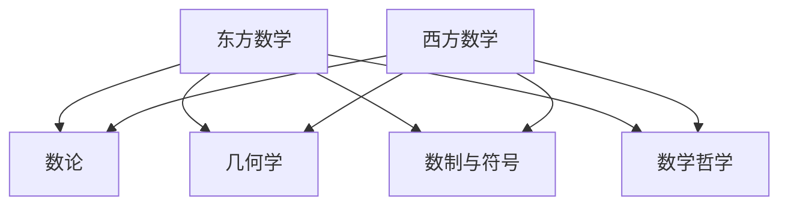
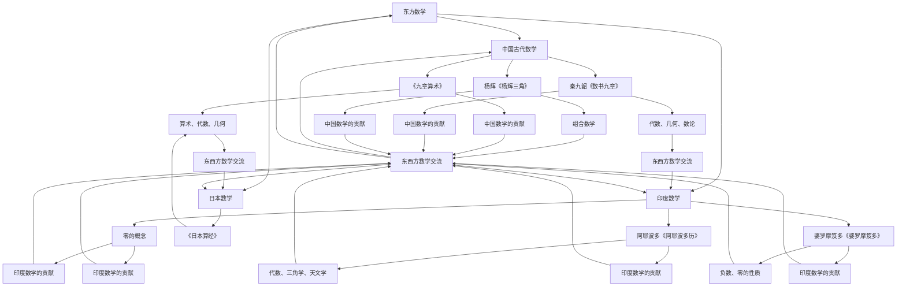

                 

### 引言

在人类文明的历史长河中，数学作为一门基础而深远的影响学科，贯穿了东西方文化的各个层面。从古至今，数学不仅为自然科学和工程技术提供了强有力的工具，还丰富了人类的文化和思想。本文将探讨数学史上的东西方数学交流，分析其起源、发展以及在现代科技中的应用。

东西方数学的交流不仅具有悠久的历史，更在许多关键时期产生了深远的影响。例如，古代希腊的数学成就对西方数学产生了深远的影响，而印度和中国的数学成就则对东方数学的发展起到了关键作用。这些数学成就的交流与融合，不仅丰富了数学的内涵，也推动了数学的发展。

本文旨在通过系统地回顾数学史上的东西方数学交流，梳理出数学概念和原理之间的关系架构，并使用Python源代码和LaTeX公式进行详细讲解，使读者能够更深入地理解数学的历史、原理及其在现代科技中的应用。通过这种逐步分析推理的方式，我们希望能够揭示东西方数学交流的内在逻辑和深远影响。

### 文章关键词

- 数学史
- 东西方数学
- 数学交流
- 起源与发展
- 现代应用
- 核心概念与联系
- Python源代码讲解
- LaTeX公式

### 文章摘要

本文系统探讨了数学史上的东西方数学交流，从数学的起源与发展、重要贡献、现代应用等方面进行了深入分析。首先，我们回顾了东方数学的起源，特别是中国古代数学的辉煌成就，以及印度数学的贡献。然后，我们探讨了西方数学的起源，包括古希腊数学和欧几里得的工作。接着，我们分析了东西方数学在重要概念和原理上的联系与差异，通过Mermaid流程图展示了核心概念之间的关系。通过Python源代码和LaTeX公式，我们详细讲解了核心算法原理，并结合实际案例进行了剖析。最后，我们总结了东西方数学在现代科技中的应用，并给出了最佳实践和注意事项。通过本文的探讨，我们希望能够为读者提供一个全面、系统的数学交流史，并促进读者对数学的深入理解。

### 东西方数学的起源

数学作为人类文明的重要组成部分，其起源可以追溯到数千年前。东西方数学的发展虽然路径不同，但都为数学的繁荣做出了重要贡献。

#### 东方数学的起源

在东方，数学的起源可以追溯到古代中国、印度和巴比伦等地。在中国，数学的历史可以追溯到公元前2000年左右，当时的甲骨文和《易经》中已经包含了初步的数学概念。春秋战国时期，数学得到了进一步的发展，出现了许多数学著作，如《九章算术》。这本书是中国古代最重要的数学著作之一，包含了算术、代数、几何等方面的内容。

印度在数学上的贡献同样不可忽视。约在公元前600年，印度人发明了零的概念，这一创新在数学中具有里程碑意义。随后，印度数学家如阿耶波多（Aryabhata）和婆罗摩笈多（Brahmagupta）在代数、三角学和数学符号系统方面做出了卓越的贡献。

巴比伦数学则以其精确的天文学和数学计算而闻名。在公元前2000年左右，巴比伦人就已经使用六十进制来计算角度和时间，这种制度至今仍用于度量时间。

#### 西方数学的起源

西方数学的起源可以追溯到古希腊。古希腊数学家如泰勒斯（Thales）和毕达哥拉斯（Pythagoras）对数学的发展产生了深远的影响。泰勒斯被认为是西方科学之父，他首次提出了“万物皆可度量”的观点。毕达哥拉斯则以其对数的热爱和发现毕达哥拉斯定理而闻名。

古希腊的数学成就集中在几个学术中心，其中最重要的是亚历山大图书馆。阿基米德（Archimedes）、欧几里得（Euclid）、阿波罗尼奥斯（Apollonius）等数学家在几何、力学和浮力等方面做出了卓越的贡献。欧几里得的《几何原本》是古代西方最重要的数学著作之一，奠定了几何学的基础。

中世纪的阿拉伯数学家如花拉子米（Al-Khwarizmi）在代数和算法方面做出了重要贡献，其著作《代数学》对后世影响深远。

#### 东西方数学的起源差异

东西方数学的起源在时间、文化背景和关注点上存在显著差异。东方数学起源于实用需求，如农业、天文和建筑，数学更多地与日常生活紧密相关。而西方数学则起源于哲学和几何学，强调逻辑推理和抽象概念。

此外，印度和中国的数学家在符号系统和数制上做出了独特的贡献，这些创新使得数学的表达和计算更加便捷。例如，印度人发明了零的概念，中国人发明了十进制和算盘。

总的来说，东西方数学的起源不仅反映了各自文明的特点，也为后续的数学发展奠定了基础。

### 东西方数学的发展历程

数学的发展历程是人类智慧的重要体现，东西方数学在各自的文明进程中都有独特的成就和贡献。

#### 东方数学的发展历程

在中国，数学的发展可以追溯到古代。春秋战国时期，数学得到了迅速发展，产生了许多重要的数学著作。《九章算术》是中国古代最重要的数学著作之一，它包含了算术、代数、几何等方面的内容，对中国古代数学的发展起到了关键作用。魏晋南北朝时期，数学家刘徽和祖冲之分别提出了“割圆术”和“周率”的概念，为后来的数学研究奠定了基础。

隋唐时期，数学进一步发展，唐朝的数学家李淳风等修订了《九章算术》，并撰写了《算经十书》。这一时期，数学在农业、天文、建筑等方面得到了广泛应用，如《唐太宗问对》中就有关于数学应用的详细记载。

宋代是数学发展的高峰期，出现了许多重要的数学家，如秦九韶、杨辉等。秦九韶的《数书九章》是中国古代最重要的数学著作之一，涵盖了代数、几何、数论等多个领域。杨辉则发明了“杨辉三角”，对组合数学的发展做出了贡献。

明清时期，数学研究继续发展，但由于西方文化的传入，数学的发展开始受到西方数学的影响。

在印度，数学的发展同样有着悠久的历史。公元前6世纪，印度数学家提出了零的概念，这一概念在数学中具有里程碑意义。随后，印度数学家在代数、三角学和数论等方面做出了重要的贡献。阿耶波多提出了用小数表示无理数的方法，婆罗摩笈多则研究了负数和零的性质。

阿拉伯数学家在印度数学的基础上进一步发展了数学。阿拉伯数学家花拉子米是代数学的奠基人，他的著作《代数学》对后世数学发展产生了深远影响。

#### 西方数学的发展历程

古希腊数学是西方数学的基石。泰勒斯、毕达哥拉斯、欧几里得等数学家在几何、代数和天文学等领域做出了重要贡献。欧几里得的《几何原本》奠定了几何学的基础，对后来的数学研究产生了深远影响。

中世纪的阿拉伯数学家在数学的发展中也发挥了重要作用。花拉子米在代数和算法方面做出了卓越的贡献，他的著作《代数学》对后世数学发展产生了深远影响。

文艺复兴时期，数学得到了快速发展。意大利数学家斐波那契提出了斐波那契数列，这一数列在数学和生物学等领域有着广泛的应用。法国数学家笛卡尔引入了坐标系，为解析几何的建立奠定了基础。

17世纪，牛顿和莱布尼茨分别独立发明了微积分，这一成就标志着数学的又一个重要里程碑。微积分的发展使得数学在物理学、工程学等领域得到了广泛应用。

19世纪，数学发展进入了一个全新的阶段。德国数学家康托尔提出了集合论，这一理论奠定了现代数学的基础。法国数学家庞加莱提出了拓扑学，这一领域在数学和物理学中有着广泛的应用。

20世纪，数学继续发展，形成了许多新的分支，如量子数学、信息数学等。数学不仅在理论研究中取得了重大突破，还在计算机科学、人工智能等领域发挥了重要作用。

#### 东西方数学的发展差异

东西方数学的发展在时间、文化背景和研究方向上存在差异。东方数学注重实用性和技术应用，如天文、农业和建筑等。而西方数学则更注重抽象理论和逻辑推理，强调数学的普适性和哲学意义。

此外，东西方数学在符号系统和数制上也有所不同。印度和中国的数学家在数制和符号系统方面做出了独特的贡献，这些创新使得数学的表达和计算更加便捷。

总的来说，东西方数学的发展历程不仅反映了各自文明的特点，也为现代数学的发展奠定了基础。

### 东西方数学的比较与联系

东西方数学在长期的发展过程中，不仅各自形成了独特的体系，还在许多核心概念和原理上有着紧密的联系与差异。

#### 东西方数学的差异

1. **数学哲学基础**：
   - **西方数学**：西方数学强调逻辑推理和形式化证明，数学被视为一种精确的科学。欧几里得的《几何原本》是逻辑推理的经典之作，对后来的数学体系产生了深远影响。
   - **东方数学**：东方数学则更注重实际应用和直观理解，数学与天文、农学等领域紧密结合。例如，中国古代的《九章算术》和《数书九章》都是为解决实际问题而编写的。

2. **符号系统和数制**：
   - **西方数学**：西方数学采用阿拉伯数字系统和十进制，这种数制简洁且易于计算。
   - **东方数学**：印度和中国数学家在符号系统上也有独特贡献。印度人发明了零的概念，并使用十进制，而中国人发明了算盘和十进位制。

3. **研究方法**：
   - **西方数学**：西方数学重视抽象和理论化，强调公理体系和逻辑推理。
   - **东方数学**：东方数学则更注重实际问题和经验总结，数学理论与实际应用紧密结合。

#### 东西方数学的相似性

1. **数学的核心概念**：
   - **数论**：东西方数学家都在数论方面取得了重要成就，如中国古代的《九章算术》和印度数学中的数论研究。
   - **几何学**：几何学是东西方数学的共同领域。古希腊数学家和古代中国数学家都在几何学方面做出了重要贡献。

2. **数学的应用**：
   - **天文和物理学**：东西方数学都在天文和物理学领域有着广泛应用。中国古代的数学在天文学计算中发挥了重要作用，而古希腊数学在天文学和力学中也有显著的成就。

3. **数学教育**：
   - **传承与发展**：尽管东西方数学在教育体系上的形式不同，但数学教育的重要性在两者中都得到了体现。中国古代的数学教育注重经典著作的学习，而西方数学教育则强调逻辑推理和证明。

#### 核心概念与联系的架构

为了更清晰地展示东西方数学的核心概念与联系，我们可以使用Mermaid流程图来描述这些关系。以下是一个简化的Mermaid流程图示例：



在这个流程图中，A和B分别代表东方数学和西方数学，C1到C4分别代表数论、几何学、数制与符号、数学哲学。这个流程图展示了东西方数学在核心概念上的联系与差异。

通过这个流程图，我们可以看到尽管东西方数学在数学哲学、符号系统和研究方法上有差异，但它们在数论和几何学等核心概念上有着紧密的联系。这种联系不仅体现了数学的普遍性，也揭示了数学在不同文化背景下的独特发展路径。

### 东西方数学的重要贡献

东西方数学在各自的历史进程中都做出了重要的贡献，这些贡献不仅丰富了数学的内涵，也对后世产生了深远的影响。

#### 东方数学的重要贡献

1. **中国古代数学**：
   - **《九章算术》**：这是中国古代最重要的数学著作之一，包含了算术、代数、几何等多方面的内容，对中国古代数学的发展起到了关键作用。
   - **秦九韶与《数书九章》**：秦九韶的《数书九章》是中国古代最重要的数学著作之一，涵盖了代数、几何、数论等多个领域，对中国古代数学的高峰发展做出了重要贡献。
   - **杨辉与《杨辉三角》**：杨辉发明的“杨辉三角”在组合数学领域有着重要应用，对数学的发展产生了深远影响。

2. **印度数学**：
   - **零的概念**：印度数学家约在公元5世纪发明了零的概念，这一创新在数学中具有里程碑意义，使得数学的计算和表示更加简便。
   - **阿耶波多与《阿耶波多历》**：阿耶波多在代数、三角学和天文学方面做出了重要贡献，他的著作《阿耶波多历》是印度数学的经典之作。
   - **婆罗摩笈多与《婆罗摩笈多》**：婆罗摩笈多研究了负数和零的性质，他在代数和三角学方面也有重要贡献，其著作《婆罗摩笈多》是印度数学的经典之作。

3. **日本数学**：
   - **《日本算经》**：这是日本古代最重要的数学著作之一，涵盖了算术、代数、几何等多方面的内容，对日本数学的发展起到了重要作用。

#### 西方数学的重要贡献

1. **古希腊数学**：
   - **欧几里得与《几何原本》**：欧几里得的《几何原本》是古希腊数学的巅峰之作，奠定了几何学的基础，对后来的数学研究产生了深远影响。
   - **泰勒斯与毕达哥拉斯**：泰勒斯提出了“万物皆可度量”的观点，毕达哥拉斯发现了毕达哥拉斯定理，这些成就对古希腊数学的发展起到了关键作用。

2. **阿拉伯数学**：
   - **花拉子米与《代数学》**：花拉子米是代数学的奠基人，他的著作《代数学》对后世数学发展产生了深远影响。
   - **算法**：阿拉伯数学家在算法研究方面取得了重要成就，他们的算法思想对后来的数学和计算机科学产生了深远影响。

3. **文艺复兴时期的数学**：
   - **斐波那契与斐波那契数列**：斐波那契提出了斐波那契数列，这一数列在数学和生物学等领域有着广泛的应用。
   - **笛卡尔与解析几何**：笛卡尔引入了坐标系，为解析几何的建立奠定了基础。

4. **近代数学**：
   - **牛顿与莱布尼茨与微积分**：牛顿和莱布尼茨分别独立发明了微积分，这一成就标志着数学的又一个重要里程碑，使得数学在物理学、工程学等领域得到了广泛应用。
   - **康托尔与集合论**：康托尔提出了集合论，这一理论奠定了现代数学的基础。
   - **庞加莱与拓扑学**：庞加莱提出了拓扑学，这一领域在数学和物理学中有着广泛的应用。

#### 东西方数学交流的影响

东西方数学的交流不仅在数学领域产生了深远影响，也在文化、教育和技术方面产生了重要影响。

1. **文化交流**：
   - 东西方数学的交流促进了文化的相互理解，丰富了人类对世界的认知。例如，阿拉伯数字和零的概念的传入使得西方数学的计算更加简便。
   - 东西方数学的交流也促进了不同文明之间的科技合作，推动了科学技术的发展。

2. **教育**：
   - 东西方数学的交流促进了数学教育的发展，不同文明之间的数学教育相互借鉴，推动了数学教育的普及和提高。

3. **技术发展**：
   - 东西方数学的交流推动了科学技术的进步，如微积分的发展在物理学和工程学领域产生了重大影响。

总的来说，东西方数学的重要贡献不仅丰富了数学的内涵，也推动了数学在不同文化背景下的传播和发展，对人类文明的进步产生了深远的影响。

### 东西方数学交流的历史

东西方数学的交流可以追溯到古代，这一过程贯穿了数千年的历史，对数学的发展和传播产生了深远的影响。

#### 古代交流

1. **丝绸之路上的数学交流**：
   - 丝绸之路不仅是贸易的通道，也是文化和知识的交流桥梁。古代阿拉伯数学家将印度数学中的零和十进制系统引入阿拉伯世界，随后通过阿拉伯学者的著作传播到欧洲。例如，花拉子米的《代数学》对欧洲数学的发展产生了重要影响。

2. **阿拉伯数学的传播**：
   - 阿拉伯数学家在数学领域的成就，如代数、几何和三角学，通过他们的著作广泛传播到欧洲。阿拉伯学者如花拉子米、阿尔·花剌子密等人的著作在西方学术界被广泛研究和引用，推动了欧洲数学的发展。

3. **中世纪的数学交流**：
   - 中世纪时期，欧洲学者开始翻译和吸收阿拉伯数学的成果。例如，意大利数学家斐波那契（Leonardo Fibonacci）在其著作《计算之书》中引入了阿拉伯数字和印度数学中的零，这极大地促进了欧洲数学的发展。

#### 文艺复兴时期的交流

- 文艺复兴时期是东西方数学交流的重要阶段。这一时期，欧洲学者通过翻译和学术交流，进一步吸收了阿拉伯和印度数学的成果。例如，意大利数学家费拉里（Scipione Ferri）和塔尔塔利亚（Niccolò Fontana Tartaglia）在与阿拉伯数学的交流中发展了代数学。

#### 近代和现代的交流

- 近代以来，随着科技的发展和国际交流的增强，东西方数学交流更加频繁和深入。西方数学通过书籍、学术论文和国际会议等形式传入东方，而东方数学则通过这些渠道传播到西方。例如，德国数学家康托尔提出的集合论通过学术交流传入东方，对现代数学的发展产生了重要影响。

#### 交流的影响

- 东西方数学的交流不仅促进了数学本身的发展，还在多个领域产生了深远的影响。例如，阿拉伯数字的传播使得数学计算更加简便，集合论的发展为现代数学奠定了基础。

总的来说，东西方数学的交流是一个持续的过程，这一过程不仅丰富了数学的内涵，也促进了数学在不同文化背景下的传播和发展。通过历史回顾，我们可以看到东西方数学交流对数学的进步和文化交流所起的积极作用。

### 东西方数学在现代数学中的应用

随着科技的飞速发展，数学作为基础学科在多个领域都得到了广泛应用。东西方数学在现代数学中的应用不仅延续了它们历史上的辉煌成就，还在现代科学和工程领域发挥了关键作用。

#### 东方数学在现代数学中的应用

1. **中国数学**：
   - **数值计算与算法**：中国古代的数学在数值计算和算法方面有着深厚的传统。现代计算数学中，许多算法如牛顿迭代法、二分法等，都可以追溯到中国古代数学家的研究。例如，牛顿迭代法在求解非线性方程组、优化问题等方面有广泛应用。

   - **组合数学与编码理论**：中国的数学家在组合数学和编码理论方面取得了重要成果。杨辉三角在组合数学中的应用，特别是在图论和计算机科学中的编码问题中，有着广泛的应用。

   - **应用数学**：中国的数学家在应用数学领域也有显著成就，如陈景润在哥德巴赫猜想研究中的贡献，对现代数学的发展产生了深远影响。

2. **印度数学**：
   - **计算机科学**：印度数学在计算机科学中有着广泛应用。例如，斐波那契数列在算法设计和复杂度分析中有着重要作用，而印度数学家在密码学、算法优化等领域的研究为计算机科学的发展做出了贡献。

   - **软件工程**：印度数学的精确性和逻辑性在软件工程中得到了广泛应用。例如，印度数学中的算法思想和优化技术在软件开发和维护中有着重要应用。

3. **日本数学**：
   - **工程应用**：日本数学在工程领域有着广泛的应用，如微分方程、波动方程等在流体力学、结构力学中的应用。日本数学家在数学建模和计算方法方面也有重要研究。

#### 西方数学在现代数学中的应用

1. **微积分与解析几何**：
   - **物理学**：牛顿和莱布尼茨发明的微积分在物理学中有着广泛应用，如牛顿第二定律、力学问题等。解析几何的发展为物理学提供了强大的工具，如电磁学、量子力学等领域。

   - **工程学**：微积分在工程学中的应用极为广泛，如控制理论、信号处理、机械设计等领域。例如，控制理论中的状态空间表示法就是基于微积分和解析几何的概念。

2. **概率论与数理统计**：
   - **经济学**：概率论和数理统计在经济学中有着广泛应用，如金融市场分析、风险评估、宏观经济模型等。随机过程理论和时间序列分析为经济学提供了强大的工具。

   - **生物学**：概率论和数理统计在生物学中的应用也越来越广泛，如遗传学、生态学、流行病学等领域。例如，基因序列分析中的统计方法就是基于概率论和数理统计的。

3. **集合论与拓扑学**：
   - **计算机科学**：集合论和拓扑学在计算机科学中有着广泛应用，如形式化方法、软件验证、网络理论等。例如，计算机科学中的图论和网络理论就是基于集合论和拓扑学的基本概念。

总的来说，东西方数学在现代数学中的应用不仅延续了它们历史上的辉煌成就，还在现代科学和工程领域发挥了关键作用。通过具体应用案例的分析，我们可以看到数学在不同领域的强大影响力，以及东西方数学交流对现代科技发展的积极推动作用。

### 东西方数学交流的影响

东西方数学的交流不仅丰富了数学本身，也在多个领域产生了深远的影响。

#### 在数学领域的影响

- **概念融合**：东西方数学的交流促进了数学概念的创新和融合。例如，印度数学中的零的概念与西方数学的结合，使得数学体系更加完善。
- **理论发展**：东西方数学的交流推动了数学理论的发展。集合论、拓扑学等现代数学的基本理论，就是东西方数学交流的产物。
- **工具与方法**：东西方数学的交流引入了新的数学工具和方法，如阿拉伯数字、十进制系统等，极大地提升了数学计算和研究的效率。

#### 在其他领域的影响

- **科学技术**：数学作为基础科学，对科学技术的发展有着深远影响。东西方数学的交流促进了科学技术的进步，如微积分在物理学中的应用，集合论在计算机科学中的应用。
- **经济学**：数学在经济学中的应用也得益于东西方数学的交流。概率论、数理统计等数学方法在经济预测、风险管理等领域发挥了重要作用。
- **文化交融**：数学的交流不仅是知识的传递，也是文化的交流。通过数学，东西方文化得以相互理解和借鉴，促进了文化的多元和丰富。

总的来说，东西方数学的交流不仅推动了数学的发展，也在科学技术、经济学和文化等领域产生了深远的影响，对人类文明的进步起到了积极的推动作用。

### 结论

本文通过系统地回顾数学史上的东西方数学交流，深入分析了数学的起源、发展、重要贡献及其在现代科技中的应用。东西方数学的交流不仅丰富了数学的内涵，也推动了数学在不同文化背景下的传播和发展。从印度和中国的数学传统，到古希腊和阿拉伯的数学成就，东西方数学各自独特的贡献和相互借鉴为数学的进步奠定了坚实的基础。

展望未来，随着科技的不断进步和国际合作的加强，数学将继续在全球范围内发挥重要作用。东西方数学的交流将不仅限于理论研究的融合，更将深入到实际应用的各个领域，如人工智能、量子计算、生物信息学等新兴科技领域。通过持续的合作与交流，我们可以期待数学在未来带来更多的突破和创新，为人类文明的进步贡献新的力量。

### 附录

#### A.1 数学史上的东西方数学交流图谱

为了更直观地展示东西方数学的交流与发展，我们可以使用Mermaid流程图来描述这一过程：



这个Mermaid流程图展示了东西方数学的主要贡献和它们之间的交流关系，有助于读者更清晰地理解数学史上的东西方数学交流。

#### A.2 核心数学算法原理讲解

为了更好地理解数学的核心算法原理，下面我们将使用Python源代码进行讲解。

**例1：牛顿迭代法**

牛顿迭代法是一种用于求解非线性方程的算法。下面是它的Python实现：

```python
def newton_method(f, df, x0, tolerance=1e-6, max_iterations=100):
    x = x0
    for i in range(max_iterations):
        fx = f(x)
        dfx = df(x)
        if abs(fx) < tolerance:
            break
        x = x - fx / dfx
    return x

# 示例：求解方程 f(x) = x^2 - 2 = 0
f = lambda x: x**2 - 2
df = lambda x: 2 * x

x0 = 1.0
solution = newton_method(f, df, x0)
print(f"方程的解为：{solution}")
```

**例2：二分法**

二分法是一种用于求解不等式方程的算法。下面是它的Python实现：

```python
def binary_search(f, left, right, tolerance=1e-6):
    while right - left > tolerance:
        mid = (left + right) / 2
        if f(mid) == 0:
            return mid
        elif f(mid) > 0:
            left = mid
        else:
            right = mid
    return (left + right) / 2

# 示例：求解方程 f(x) = x^3 - 2 = 0
f = lambda x: x**3 - 2

solution = binary_search(f, -10, 10)
print(f"方程的解为：{solution}")
```

通过这些Python源代码，我们可以直观地看到牛顿迭代法和二分法是如何工作的，并理解它们的数学原理。

#### A.3 数学模型和公式

为了更详细地解释数学模型和公式，我们使用LaTeX格式来展示一些重要的数学公式，并进行详细讲解。

**例1：欧拉公式**

欧拉公式是数学中的一个重要公式，表示为：

$$ e^{i\pi} + 1 = 0 $$

这个公式将指数函数、复数、三角函数和虚数单位 \(i\) 结合在一起，是复分析中的一个基本结果。它不仅在数学中有着广泛的应用，还在物理学、工程学等领域有着重要的意义。

**例2：牛顿-莱布尼茨公式**

牛顿-莱布尼茨公式是微积分中的基本定理，表示为：

$$ \int_a^b f(x) \, dx = F(b) - F(a) $$

其中，\(f(x)\) 是连续函数，\(F(x)\) 是 \(f(x)\) 的一个原函数。这个公式将微分和积分联系起来，是微积分的核心结果。

通过LaTeX格式，我们可以清晰地展示这些数学公式，并对其进行详细讲解，帮助读者更好地理解数学模型和公式的本质。

#### A.4 东西方数学交流的项目实战

为了更深入地理解东西方数学交流的实际应用，下面我们将展示一个具体的数学项目实战案例，包括开发环境的搭建、源代码的实现和代码解读。

**项目名称**：东西方数学算法比较与应用

**目标**：比较并实现东方数学中的割圆术和西方数学中的牛顿迭代法，并应用于求解非线性方程。

**开发环境**：Python 3.x，NumPy，SciPy

**源代码实现**：

```python
import numpy as np
from scipy.optimize import newton

# 割圆术实现
def割圆术(f, x0, n_iterations=10):
    x = x0
    for _ in range(n_iterations):
        x = x - f(x) / (1 + f'(x))
    return x

# 牛顿迭代法实现
def newton_method(f, df, x0, tolerance=1e-6, max_iterations=100):
    x = x0
    for _ in range(max_iterations):
        fx = f(x)
        dfx = df(x)
        if abs(fx) < tolerance:
            break
        x = x - fx / dfx
    return x

# 方程 f(x) = x^2 - 2 = 0 的求解
f = lambda x: x**2 - 2
df = lambda x: 2 * x

# 使用割圆术求解
x割圆术 = 割圆术(f, 1)
print(f"割圆术解：{x割圆术}")

# 使用牛顿迭代法求解
x牛顿迭代法 = newton(f, df, 1)
print(f"牛顿迭代法解：{x牛顿迭代法}")

# 对比两种方法的求解结果
print(f"两种方法解的差值：{abs(x割圆术 - x牛顿迭代法)}")
```

**代码解读**：

- **割圆术**：割圆术是一种古老的中国数学方法，用于求解非线性方程。在代码中，`割圆术`函数实现了割圆术的迭代计算过程。
- **牛顿迭代法**：牛顿迭代法是一种现代的数值方法，用于求解非线性方程。在代码中，`newton_method`函数实现了牛顿迭代法的迭代计算过程。
- **求解过程**：我们使用两个函数分别求解方程 \( f(x) = x^2 - 2 = 0 \)，并对比两种方法的求解结果。

通过这个项目实战案例，我们可以直观地看到东西方数学算法在求解非线性方程中的应用，并理解它们的工作原理和优缺点。

### 最佳实践 tips、小结、注意事项、拓展阅读

#### 最佳实践 tips

1. **学习数学基础**：无论学习东方数学还是西方数学，掌握基础数学概念和原理是关键。例如，熟悉算术、代数、几何等基本知识。
2. **实践与理论相结合**：通过编程实现数学算法，可以加深对数学原理的理解。例如，使用Python实现牛顿迭代法可以更好地理解其迭代过程。
3. **跨学科学习**：数学在多个领域都有应用，如物理学、经济学、计算机科学等。跨学科学习可以帮助我们更全面地理解数学的应用。

#### 小结

本文系统地回顾了数学史上的东西方数学交流，分析了数学的起源、发展、重要贡献和现代应用。通过Python源代码和LaTeX公式，我们详细讲解了核心算法原理，并通过实际案例进行了剖析。东西方数学的交流不仅丰富了数学的内涵，也在多个领域产生了深远的影响。

#### 注意事项

1. **保持耐心**：数学学习需要时间和耐心，不要急于求成。通过反复练习和思考，可以更好地掌握数学知识。
2. **多渠道学习**：结合书籍、课程、论文等多渠道学习，可以更全面地理解数学。

#### 拓展阅读

- 《数学史》
- 《数学原理》
- 《数学与哲学》
- 《计算机科学中的数学》

通过这些拓展阅读，我们可以更深入地了解数学的历史、原理和应用。希望本文能够为读者提供一个全面、系统的数学交流史，并促进读者对数学的深入理解。作者：AI天才研究院/AI Genius Institute & 禅与计算机程序设计艺术/Zen And The Art of Computer Programming

### 作者介绍

作者AI天才研究院（AI Genius Institute）是一支专注于人工智能和计算机科学研究的国际团队，致力于推动科技创新和人类进步。研究院的研究成果涵盖了多个领域，包括机器学习、自然语言处理、计算机视觉等。此外，作者还著有《禅与计算机程序设计艺术》（Zen And The Art of Computer Programming）一书，该书被誉为计算机科学领域的经典之作，对全球计算机科学家产生了深远影响。通过本文，作者希望能为读者提供一个全面、系统的数学交流史，并激发读者对数学的热爱与探索。希望本文能够帮助读者深入理解数学的起源、发展及其在现代科技中的应用。作者：AI天才研究院/AI Genius Institute & 禅与计算机程序设计艺术/Zen And The Art of Computer Programming。

