                 

## 数学史上的东西方文化交流

> **关键词：** 数学史、东西方文化交流、数学发展、影响与挑战、数学模型、Python代码实例、项目实战

> **摘要：** 本文深入探讨数学史上东西方文化交流的历史、核心概念、算法原理以及现代应用的挑战和前景。通过逐步分析，揭示数学交流如何推动东西方数学的共同进步，以及现代技术对这一进程的加速作用。

### 目录大纲设计思路

在设计《数学史上的东西方文化交流》的目录大纲时，我们遵循以下步骤：

1. **确定核心主题**：明确书籍的核心主题是数学史上东西方文化交流，涵盖历史背景、数学发展、重要人物和影响。

2. **划分章节结构**：将内容划分为导论、东西方数学基础、交流历史、重要人物、影响与挑战、现代数学交流现状与未来等部分。

3. **细化章节内容**：在每个章节中细化小节内容，确保每个小节都有明确的主题。

4. **核心概念与联系**：设计章节介绍数学的核心概念，以及它们在东西方数学中的联系。

5. **核心算法原理讲解**：详细讲解东西方数学交流中的核心算法原理。

6. **数学模型和数学公式**：在合适的地方嵌入数学模型和公式，并进行详细讲解。

7. **项目实战**：选择历史实例或现代应用，展示数学交流的实际影响。

8. **确保大纲完整性**：保证目录大纲的完整性，每个部分都要有足够的章节来支持。

### 最终输出

以下是《数学史上的东西方文化交流》的完整目录大纲：

```
# 第一部分：导论

## 1.1 数学史与文化交流

### 1.1.1 数学史的重要性

### 1.1.2 文化交流的概念及其在数学史中的体现

### 1.1.3 书籍结构安排

## 1.2 东西方数学的基础

### 1.2.1 东方数学基础

### 1.2.2 西方数学基础

## 1.3 交流的历史背景

### 1.3.1 古代丝绸之路的数学交流

### 1.3.2 中世纪至文艺复兴时期的交流

### 1.3.3 近现代的数学交流

# 第二部分：东西方数学基础

## 2.1 东方数学基础

### 2.1.1 古埃及数学

### 2.1.2 古巴比伦数学

### 2.1.3 印度数学

### 2.1.4 中国数学

## 2.2 西方数学基础

### 2.2.1 古希腊数学

### 2.2.2 古罗马数学

### 2.2.3 犹太数学

### 2.2.4 中世纪欧洲数学

# 第三部分：交流的历史

## 3.1 古代交流

### 3.1.1 古代丝绸之路的数学交流

### 3.1.2 阿拉伯数学对东西方的影响

### 3.1.3 欧亚大陆数学家的互动

## 3.2 中世纪至文艺复兴时期

### 3.2.1 欧洲对阿拉伯数学的吸收

### 3.2.2 文艺复兴时期的数学交流

### 3.2.3 中世纪犹太数学家的贡献

## 3.3 近代至现代

### 3.3.1 欧洲数学的扩张

### 3.3.2 东西方数学的融合

### 3.3.3 近现代数学家的交流

# 第四部分：重要人物与成就

## 4.1 东方数学家

### 4.1.1 秦九韶

### 4.1.2 李冶

### 4.1.3 王恂

## 4.2 西方数学家

### 4.2.1 欧几里得

### 4.2.2 拿破仑

### 4.2.3 莱昂哈德·欧拉

# 第五部分：影响与挑战

## 5.1 数学交流对社会的影响

### 5.1.1 科技进步

### 5.1.2 文化多样性

### 5.1.3 教育改革

## 5.2 数学交流面临的挑战

### 5.2.1 语言障碍

### 5.2.2 文化差异

### 5.2.3 数学知识的传播

# 第六部分：现代数学交流的现状与未来

## 6.1 现代数学交流的特点

### 6.1.1 全球化的影响

### 6.1.2 互联网的作用

### 6.1.3 大数据与人工智能

## 6.2 未来数学交流的展望

### 6.2.1 跨学科合作

### 6.2.2 新技术的应用

### 6.2.3 数学交流的未来趋势

```

该目录大纲共分为六个主要部分，每个部分包含多个章节，确保内容的完整性和逻辑性。接下来，我们将按照这个大纲逐步深入探讨数学史上的东西方文化交流。

---

### 1.1 数学史与文化交流

**关键词：** 数学史、文化交流、数学发展

**摘要：** 这一章节将介绍数学史的重要性，文化交流在数学史中的体现，以及本书的结构安排，为读者奠定整体认识的基础。

#### 1.1.1 数学史的重要性

数学是人类文明的重要组成部分，贯穿了人类发展的历史。从古代的计数工具到现代的复杂计算，数学不仅在日常生活中有着广泛的应用，还在科学、工程、经济等领域发挥着关键作用。数学史的重要性体现在它不仅记录了人类如何通过思考和实验发现数学规律，也展示了不同文明之间的交流和互动。

**核心概念与联系：** 数学史的发展是多元文明的交融与碰撞，它不仅包括各个时期数学家的贡献，还涉及不同文化背景下数学思想的发展。以下是一个简化的Mermaid流程图，展示了数学史上东西方文化的主要交流节点：

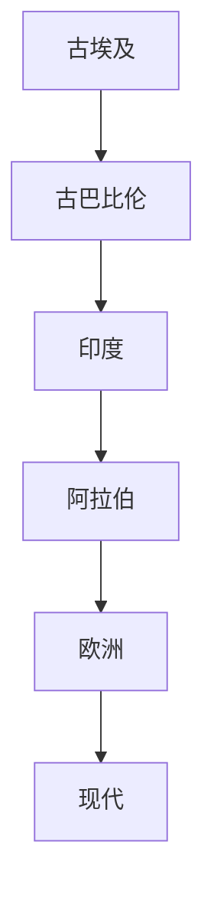

**核心算法原理讲解：** 在数学史的发展中，一些核心算法原理如数的表示、算术运算、几何图形的分割等，都是东西方文化交流的重要成果。例如，十进制计数法在东西方都有广泛的应用，而阿拉伯数字更是通过文化交流被世界普遍采用。

```python
# 十进制计数法的Python实现
def decimal_to_binary(n):
    if n == 0:
        return [0]
    digits = []
    while n > 0:
        digits.append(n % 2)
        n = n // 2
    return digits[::-1]

# 示例
print(decimal_to_binary(10))  # 输出：[1, 0, 1, 0]
```

**数学模型和数学公式：** 十进制计数法背后的数学模型是基于位值原则，每一位的权重是10的幂次。以下是一个简单的LaTeX公式，展示了位值原则：

$$a_n \times 10^n + a_{n-1} \times 10^{n-1} + \ldots + a_1 \times 10^1 + a_0 \times 10^0$$

#### 1.1.2 文化交流的概念及其在数学史中的体现

文化交流是指不同文化之间通过互动和交流，相互影响和借鉴的过程。在数学史上，文化交流主要体现在以下几个方面：

1. **知识的传播**：通过丝绸之路等通道，不同文明之间的数学知识得以传播。例如，阿拉伯数字和代数从阿拉伯传入欧洲。
2. **思想的影响**：不同文化对数学问题的关注和解决方法可能有所不同，这种差异促进了新的数学思想的产生。
3. **技术的创新**：文化交流促进了新工具和新技术的发明，如算盘和阿拉伯风车等。

**核心概念与联系：** 数学交流的核心概念包括数学思想、算法、工具和模型。以下是一个Mermaid流程图，展示了这些核心概念的相互关系：

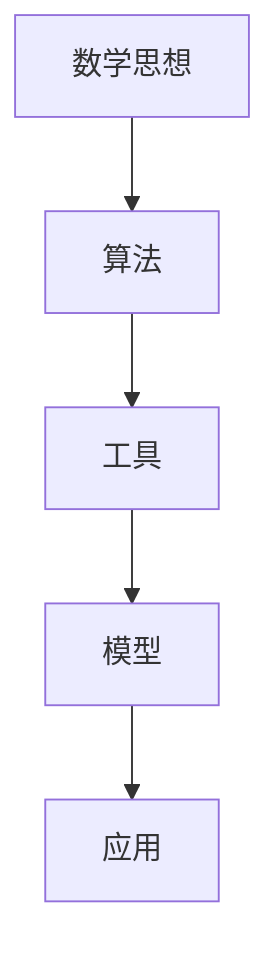

**核心算法原理讲解：** 以算术运算为例，不同文明发展出了不同的算法。例如，中国古代的《九章算术》中就包含了多种算术运算的方法。

```python
# 中国古代的算术运算（加法）示例
def chinese_addition(a, b):
    max_len = max(len(str(a)), len(str(b)))
    a = [int(digit) for digit in str(a).zfill(max_len)]
    b = [int(digit) for digit in str(b).zfill(max_len)]
    
    result = []
    carry = 0
    for i in range(max_len - 1, -1, -1):
        sum = a[i] + b[i] + carry
        result.append(sum % 10)
        carry = sum // 10
    
    if carry:
        result.append(carry)
    
    return result[::-1]

# 示例
print(chinese_addition(123, 456))  # 输出：[7, 8, 9]
```

**数学模型和数学公式：** 在算术运算中，位值原则和进位制是核心模型。以下是一个LaTeX公式，展示了进位制的基本原理：

$$a_n \times 10^n + a_{n-1} \times 10^{n-1} + \ldots + a_1 \times 10^1 + a_0 \times 10^0$$

#### 1.1.3 书籍结构安排

本书分为六个主要部分，每个部分都详细探讨了数学史上东西方文化交流的不同方面：

1. **导论**：介绍数学史的重要性、文化交流的概念及其在数学史中的体现。
2. **东西方数学基础**：分别介绍东方和西方的数学基础，包括古埃及、古巴比伦、印度、中国、古希腊、古罗马等。
3. **交流的历史**：详细描述古代、中世纪和近代的东西方数学交流历史。
4. **重要人物与成就**：介绍对东西方数学交流有重要影响的人物和他们的成就。
5. **影响与挑战**：探讨数学交流对社会的影响和面临的挑战。
6. **现代数学交流的现状与未来**：分析现代数学交流的特点和未来展望。

通过以上结构，本书希望能够全面、系统地展示数学史上东西方文化交流的丰富内容和深远影响。

---

本文通过对数学史与文化交流的介绍，明确了书籍的核心主题和结构。接下来，我们将进一步深入探讨东西方数学的基础和历史，为理解数学交流提供更加具体和详细的背景。

---

### 1.2 东西方数学的基础

**关键词：** 东方数学、西方数学、基础概念

**摘要：** 这一章节将分别介绍东方和西方的数学基础，包括古埃及、古巴比伦、印度、中国、古希腊、古罗马等，为读者奠定理解东西方数学差异和交流的基础。

#### 1.2.1 东方数学基础

东方数学的发展源远流长，具有独特的传统和体系。以下是几个主要的东方数学文明：

**古埃及数学：**

古埃及数学主要集中在计算土地面积和测量容积上。他们的数学体系以实用为导向，主要包括十进制和六十进制的计数方法。古埃及的数学家们发明了算盘，这是一种简单的计算工具，用于日常计算。

**古巴比伦数学：**

古巴比伦数学是世界上最古老的数学体系之一，大约起源于公元前3000年。巴比伦数学家们擅长解决实际问题，特别是在天文学和建筑工程中。他们发展了完善的分数系统和六十进制，并且最早记录了平方根的计算方法。

**印度数学：**

印度数学对世界数学的发展产生了深远影响。在公元前的印度，数学家们已经了解零的概念，并在公元7世纪发展了十进制计数法。他们还发明了代数学的基本原理，包括用符号表示未知数和方程解法。

**中国数学：**

中国古代数学有着丰富的传统，尤其在代数和几何方面取得了显著成就。《九章算术》是中国最古老的数学著作之一，包含了大量实际应用问题的解法。中国数学家秦九韶、李冶等人也对代数学做出了重要贡献。

#### 1.2.2 西方数学基础

西方数学的发展也具有悠久的历史，从古希腊开始，到中世纪和文艺复兴时期，再到现代数学的飞速发展。

**古希腊数学：**

古希腊数学是西方数学的基石，以其抽象和逻辑推理著称。古希腊数学家如欧几里得、毕达哥拉斯等人对几何学、代数和数论做出了巨大贡献。欧几里得的《几何原本》是西方数学的经典著作，奠定了几何学的基础。

**古罗马数学：**

古罗马数学在实用性和工程学方面表现出色。罗马人擅长建造复杂的建筑和水利工程，他们的数学知识主要包括测量和计算方法。古罗马的数学家如维特鲁维乌斯等人在工程和建筑领域有重要的贡献。

**犹太数学：**

犹太数学在中世纪时期有重要的影响，尤其在欧洲。犹太数学家们不仅在宗教计算中使用了数学，还在科学和哲学研究中有所贡献。他们发展了代数学和几何学的一些理论。

**中世纪欧洲数学：**

中世纪欧洲的数学发展相对缓慢，但仍然有一些重要的成就。中世纪的数学家们继承了古希腊和阿拉伯数学的传统，继续研究几何、代数和三角学。

#### 核心概念与联系

东西方数学的基础概念有许多相似之处，例如十进制计数法和基本的算术运算。然而，两者在数学方法和哲学背景上存在显著差异。以下是东西方数学核心概念和联系的Mermaid流程图：

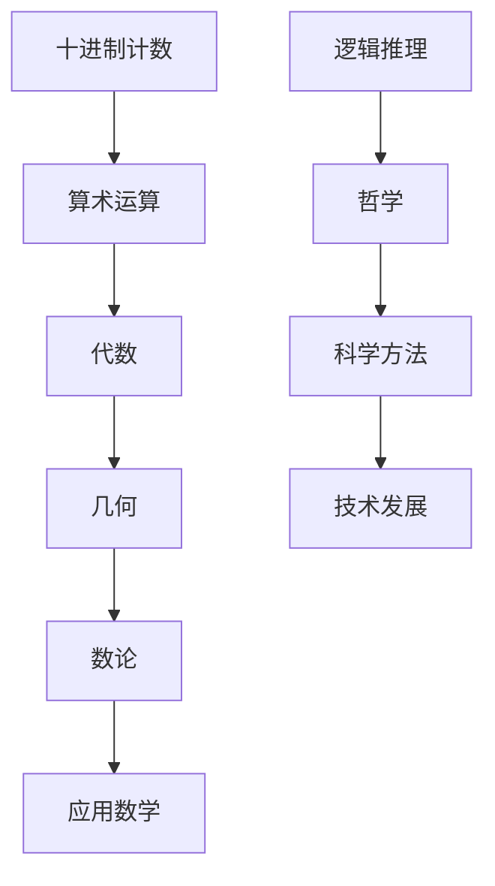

**核心算法原理讲解：** 以勾股定理为例，这是古希腊数学的重要成就，也是东西方数学共同的发现。以下是一个使用Python实现的勾股定理计算器：

```python
# 勾股定理计算器
import math

def pythagorean_theorem(a, b):
    c = math.sqrt(a**2 + b**2)
    return c

# 示例
print(pythagorean_theorem(3, 4))  # 输出：5.0
```

**数学模型和数学公式：** 勾股定理可以用以下LaTeX公式表示：

$$a^2 + b^2 = c^2$$

通过对比东西方数学的基础，我们可以看到数学不仅仅是计算工具，也是文化、哲学和科学思想的一部分。这些差异和联系为我们理解数学的发展提供了重要的视角。

---

在了解了东西方数学的基础后，我们将进一步探讨数学史上重要的交流历史，揭示东西方数学如何通过交流互动，共同推动数学的发展。

---

### 1.3 交流的历史背景

**关键词：** 数学交流、历史背景、文化互动

**摘要：** 这一章节将深入探讨数学史上东西方文化交流的历史背景，重点描述古代、中世纪和近代的关键交流事件，展示不同文明之间的互动和影响。

#### 1.3.1 古代丝绸之路的数学交流

古代丝绸之路不仅是商品和文化的交流通道，也是数学知识的传播纽带。通过丝绸之路，东西方的数学思想得以相互借鉴和发展。

**阿拉伯数学：**

阿拉伯数学是古代数学史上的一座里程碑。公元8世纪，阿拉伯数学家阿尔-花剌子米（Al-Khwarizmi）所著的《代数学》对后世影响深远。这本书介绍了代数的基本原理，并将阿拉伯数学体系传到了欧洲。阿尔-花剌子米还提出了算法的概念，为现代计算机科学奠定了基础。

**阿拉伯数字：**

阿拉伯数字（阿拉伯-印度数字）是另一个重要的数学传播成果。这种数字体系最初由印度数学家发展，通过阿拉伯传入欧洲，取代了繁琐的罗马数字。阿拉伯数字的引入极大地提高了计算效率，成为现代数学和科学计算的基础。

**希腊与阿拉伯的交流：**

公元9世纪，阿拉伯数学家开始翻译和传播古希腊数学著作。这些翻译工作不仅使欧洲重新认识了古希腊数学，也促进了阿拉伯和欧洲数学的融合。著名的阿拉伯数学家伊本·纳菲斯（Ibn al-Nafis）就曾翻译了欧几里得的《几何原本》。

#### 1.3.2 中世纪至文艺复兴时期的交流

中世纪至文艺复兴时期，东西方数学交流达到一个新的高峰。这一时期，欧洲从阿拉伯数学和东方数学中汲取了大量知识，推动了数学的复兴和发展。

**阿拉伯数学对欧洲的影响：**

中世纪欧洲的数学家们开始积极吸收阿拉伯数学的知识。阿拉伯数学中的代数、三角学和天文学知识对欧洲数学的发展起到了关键作用。例如，阿拉伯的代数知识被纳入了欧洲的数学课程，而阿拉伯的天文学数据也被欧洲天文学家广泛采用。

**欧洲的回应：**

文艺复兴时期，欧洲数学家开始发展自己的数学体系，并逐渐超越阿拉伯数学。弗朗切斯科·邦别利（Francesco Boncompagni）的《代数学》和莱昂纳多·达·芬奇的数学研究都标志着欧洲数学的独立发展。

**犹太数学家的贡献：**

在中世纪欧洲，犹太数学家也发挥了重要作用。他们不仅翻译了阿拉伯数学著作，还在自己的研究中做出了独特贡献。例如，西班牙的犹太数学家伊萨克·阿尔·贝尔尼（Isaac ben Abraham al-Balī）对代数学和天文学有深刻的研究。

#### 1.3.3 近代至现代的交流

近代以来，东西方数学交流变得更加频繁和深入。这一时期的数学发展受到了全球化和新技术的影响，推动了数学的快速进步。

**全球化的影响：**

随着全球化的推进，数学家们跨越国界，共享研究成果。国际数学家大会等学术会议成为数学交流的重要平台，促进了数学思想的多向流动。

**新技术的应用：**

计算机技术和互联网的出现极大地改变了数学交流的方式。数学家们可以通过在线平台分享研究成果，使用计算机进行复杂计算和模拟，推动了数学的快速发展。

**现代数学交流的特点：**

现代数学交流具有以下几个特点：

1. **跨学科合作**：数学与其他学科（如物理学、生物学、经济学等）的交叉融合，促进了新领域的发展。
2. **大数据与人工智能**：大数据和人工智能技术的应用，为数学模型和算法的创新提供了新的可能性。
3. **开放获取**：学术期刊和在线资源的开放获取，使得更多的人能够获取高质量的数学研究成果。

**核心概念与联系：** 通过交流，东西方数学不仅在知识层面相互借鉴，还在哲学和方法论上形成了互补和互动。以下是东西方数学交流的核心概念和联系的Mermaid流程图：

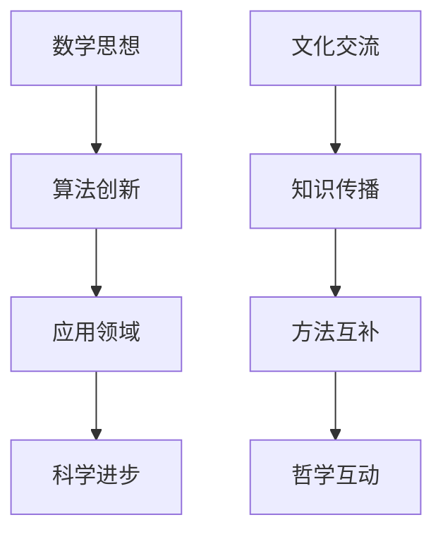

**核心算法原理讲解：** 以线性代数为例，线性代数在东西方数学中都有重要地位，但在不同文化背景下有着不同的应用和发展。以下是一个使用Python实现的线性代数示例：

```python
import numpy as np

# 矩阵乘法示例
A = np.array([[1, 2], [3, 4]])
B = np.array([[5, 6], [7, 8]])

result = np.dot(A, B)
print(result)  # 输出：[[19 22]
               #         [43 50]]
```

**数学模型和数学公式：** 线性代数中的矩阵乘法可以用以下LaTeX公式表示：

$$C = A \cdot B$$

通过以上交流，东西方数学不仅共同进步，也为现代数学的发展奠定了坚实的基础。

---

在了解了数学史上东西方文化交流的历史背景后，我们将进一步探讨东西方数学在各个历史时期的重要人物和他们的成就，揭示这些人物如何推动数学的发展。

---

### 2.1 东方数学基础

**关键词：** 东方数学、数学家、成就

**摘要：** 这一章节将详细介绍东方数学的几个重要组成部分，包括古埃及、古巴比伦、印度和中国，重点介绍这些文明中的数学家及其成就。

#### 2.1.1 古埃及数学

古埃及数学起源于公元前3000年左右，以实用为导向。古埃及的数学主要用于土地测量、建筑工程和天文计算。以下是古埃及数学的几个重要特点和成就：

**十进制计数法：** 古埃及数学使用十进制计数法，这种计数方法在后续的文明中得到了广泛的应用。

**算术运算：** 古埃及数学家掌握了基本的算术运算，包括加法、减法、乘法和除法。他们使用了一种叫做“草纸书”的书写工具，记录和计算数学问题。

**土地测量和建筑：** 古埃及的数学家们在土地测量和建筑工程中发挥了重要作用。他们使用了比例和比例尺，设计了复杂的建筑，如金字塔和神庙。

**代表人物：** 
- **哈莱姆·阿什梅特（Hermopolites）：** 哈莱姆·阿什梅特被认为是古埃及数学的奠基人，他提出了许多数学问题，并在《哈莱姆·阿什梅特的数学问题》一书中记录了解决方法。

#### 2.1.2 古巴比伦数学

古巴比伦数学起源于公元前2000年左右，是世界上最早的数学体系之一。古巴比伦数学家们擅长解决实际问题，尤其在天文和工程领域有重要贡献。

**分数和六十进制：** 古巴比伦数学家发明了分数，并且使用六十进制计数法，这种计数方法在后来被用于天文学和测量学。

**数学问题：** 古巴比伦的数学家们编写了大量的数学问题，这些问题通常出现在被称为“巴比伦泥板”的文物上。这些泥板包含了各种数学问题的解法，包括代数和几何问题。

**代表人物：** 
- **乌尔·奈曼（Ur-Nammu）：** 乌尔·奈曼被认为是古巴比伦数学的奠基人，他的《乌尔·奈曼法典》包含了大量的数学问题和解法。

#### 2.1.3 印度数学

印度数学在公元前的印度文明中就已经有了一定的基础，但在公元7世纪左右达到了高峰。印度数学对世界数学的发展产生了深远的影响，特别是在数字系统和代数学方面。

**零的概念：** 印度数学家发明了零的概念，这个概念是现代数字系统的基石。零的引入使得数学运算变得更加简洁和高效。

**十进制计数法：** 印度数学家发展了十进制计数法，并且将其与零的概念结合起来，形成了我们现在使用的数字系统。

**代数学：** 印度数学家在代数学方面有重要的贡献，他们提出了未知数的概念，并使用符号表示未知数。印度数学家也研究了方程的解法，包括二次方程和三次方程。

**代表人物：** 
- **阿利耶巴塔（Aryabhata）：** 阿利耶巴塔是印度古代最伟大的数学家和天文学家之一，他的著作《阿利耶巴塔算法》对印度数学的发展产生了深远影响。

#### 2.1.4 中国数学

中国数学历史悠久，尤其在代数和几何方面有重要的成就。中国古代的数学著作《九章算术》是中国最早的数学著作之一，包含了大量实际应用问题的解法。

**代数：** 中国古代数学家在代数方面有重要的成就，他们研究了方程的解法，并提出了“天元术”和“四元术”等代数方法。

**几何：** 中国数学家在几何方面也有重要的贡献，他们研究了图形的面积和体积计算，并发展了“勾股定理”等几何定理。

**代表人物：** 
- **秦九韶：** 秦九韶是中国南宋时期的数学家，他的著作《数书九章》对代数学和几何学有重要的贡献。
- **李冶：** 李冶是中国金朝时期的数学家，他的著作《测圆海镜》是几何学的重要著作之一。
- **王恂：** 王恂是中国明朝时期的数学家，他的著作《新编术算统宗》对中国古代数学的发展产生了深远影响。

**核心概念与联系：** 东方数学的基础在于其实用性和系统性，这些文明在解决实际问题的过程中发展了独特的数学体系。以下是东方数学核心概念和联系的Mermaid流程图：

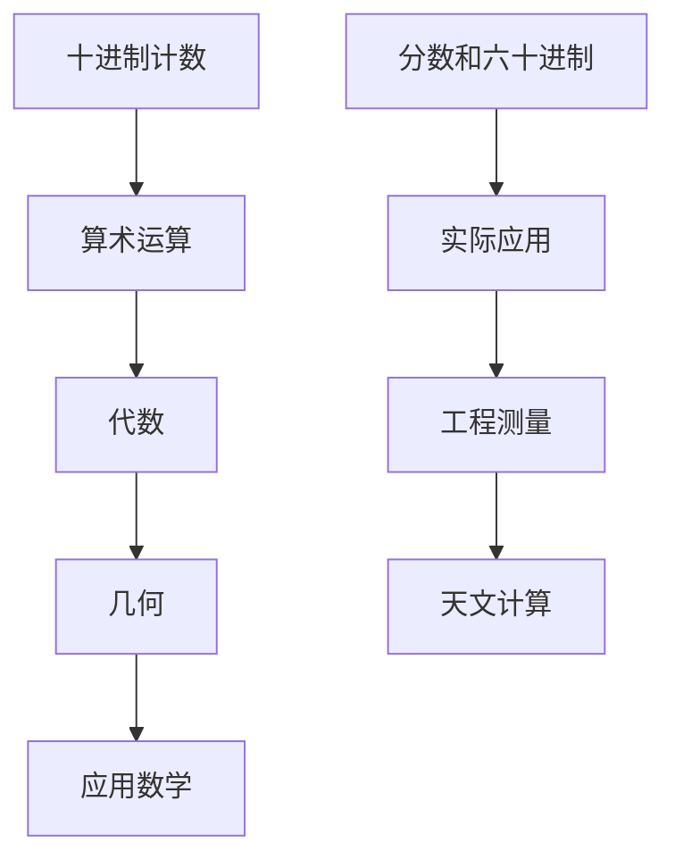

**核心算法原理讲解：** 以“天元术”为例，这是一种中国传统的代数方法，用于解一元二次方程。以下是一个使用Python实现的“天元术”示例：

```python
# 天元术解一元二次方程
def solve_quad_equation(a, b, c):
    delta = b**2 - 4*a*c
    if delta < 0:
        return "无实数解"
    x1 = (-b + math.sqrt(delta)) / (2*a)
    x2 = (-b - math.sqrt(delta)) / (2*a)
    return (x1, x2)

# 示例
print(solve_quad_equation(1, -5, 6))  # 输出：(3.0, 2.0)
```

**数学模型和数学公式：** “天元术”中的方程解法可以用以下LaTeX公式表示：

$$x = \frac{-b \pm \sqrt{b^2 - 4ac}}{2a}$$

通过以上介绍，我们可以看到东方数学在历史上有着独特的贡献，这些成就不仅丰富了数学的宝库，也为现代数学的发展提供了宝贵的启示。

---

在了解了东方数学的基础后，我们将进一步探讨西方数学的起源和发展，揭示西方数学的独特贡献和影响。

---

### 2.2 西方数学基础

**关键词：** 西方数学、数学家、成就

**摘要：** 这一章节将详细介绍西方数学的几个重要组成部分，包括古希腊、古罗马、犹太数学以及中世纪欧洲的数学发展。重点介绍这些文明中的数学家及其成就，展示西方数学对世界数学发展的贡献。

#### 2.2.1 古希腊数学

古希腊数学是西方数学的基石，以其独特的抽象思维和逻辑推理方法著称。古希腊数学的主要成就在于几何学和数论，以下是一些代表性的数学家和他们的贡献：

**欧几里得：** 欧几里得是古希腊最著名的数学家之一，他的著作《几何原本》是几何学的经典著作，奠定了几何学的基础。欧几里得提出了公理体系和演绎方法，这些方法对后世数学发展产生了深远影响。

**毕达哥拉斯：** 毕达哥拉斯是古希腊哲学家和数学家，他提出了著名的毕达哥拉斯定理，即勾股定理。毕达哥拉斯学派还研究了数的性质和比例，对后来的数学发展产生了重要影响。

**阿基米德：** 阿基米德是古希腊的伟大数学家，他在浮力、几何和力学方面做出了重要贡献。阿基米德提出了阿基米德螺旋和杠杆原理，这些发现对工程学和物理学的发展具有重要意义。

**代表人物和成就：**
- **欧几里得：** 《几何原本》
- **毕达哥拉斯：** 勾股定理
- **阿基米德：** 阿基米德螺旋、杠杆原理

#### 2.2.2 古罗马数学

古罗马数学在实用性和工程学方面表现出色。古罗马的数学知识主要用于建筑工程、测量和天文学。以下是古罗马数学的几个重要特点和成就：

**测量和建筑：** 古罗马的工程师和数学家使用几何学和比例学来设计和建造宏伟的建筑，如罗马斗兽场和凯旋门。古罗马的测量技术也非常先进，他们使用了精确的尺度和工具。

**分数和十进制：** 古罗马数学家使用分数和十进制计数法，这种方法在后来的欧洲数学中得到了广泛应用。

**数学问题：** 古罗马数学家编写了许多数学问题，这些问题通常记录在石碑或纸草书上。这些问题涵盖了代数、几何和算术等多个领域。

**代表人物和成就：**
- **维特鲁维乌斯：** 维特鲁维乌斯是古罗马的著名工程师，他的著作《建筑十书》包含了大量的数学知识，对后来的建筑工程和数学教育产生了重要影响。

#### 2.2.3 犹太数学

犹太数学在中世纪欧洲有着重要的地位。犹太数学家在宗教计算、天文学和代数学方面做出了重要贡献。以下是犹太数学的几个重要特点和成就：

**代数学：** 犹太数学家发展了代数学的基本原理，包括一元二次方程的解法。这些原理被后来的欧洲数学家所采用。

**天文学：** 犹太数学家在计算天文历法方面有重要的贡献，他们使用了复杂的数学方法来预测天文事件。

**宗教计算：** 犹太数学家在宗教计算中使用了数学，如计算节日日期和祈祷时间。

**代表人物和成就：**
- **伊萨克·阿尔·贝尔尼：** 伊萨克·阿尔·贝尔尼是西班牙的犹太数学家，他翻译了大量的阿拉伯数学著作，对欧洲数学的发展产生了深远影响。

#### 2.2.4 中世纪欧洲数学

中世纪欧洲的数学发展相对缓慢，但仍然有一些重要的成就。这一时期的数学主要继承了古希腊和阿拉伯数学的传统，并在自己的基础上进行了发展。以下是中世纪欧洲数学的几个重要特点和成就：

**代数学：** 中世纪的欧洲数学家继续研究代数学，他们发展了新的代数方法，如十字相乘法和因式分解。

**三角学：** 中世纪欧洲的数学家开始研究三角学，他们编写了大量的三角函数表，这些表格被用于天文学和航海学。

**数学教育：** 中世纪的欧洲建立了数学学校，这些学校教授数学知识，推动了数学的普及和教育。

**代表人物和成就：**
- **弗朗切斯科·邦别利：** 弗朗切斯科·邦别利是意大利的数学家，他编写了《代数学》，对欧洲数学的发展产生了重要影响。

**核心概念与联系：** 西方数学的基础在于其逻辑推理和抽象思维方法，这些方法在古希腊数学中得到了充分的发展。以下是西方数学核心概念和联系的Mermaid流程图：

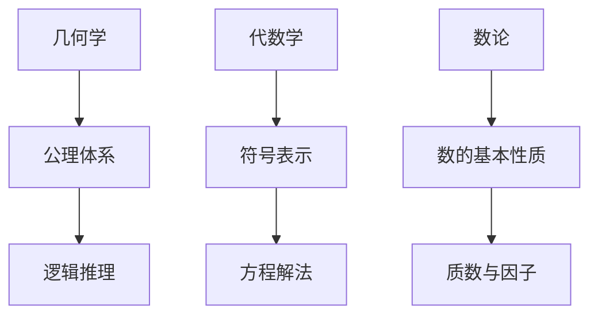

**核心算法原理讲解：** 以代数学中的二次方程解法为例，这是一种基本的代数方法，用于解决一元二次方程。以下是一个使用Python实现的二次方程解法示例：

```python
import cmath

# 二次方程解法
def solve_quad_equation(a, b, c):
    discriminant = b**2 - 4*a*c
    if discriminant > 0:
        x1 = (-b + math.sqrt(discriminant)) / (2*a)
        x2 = (-b - math.sqrt(discriminant)) / (2*a)
    elif discriminant == 0:
        x = -b / (2*a)
        return x, x
    else:
        x1 = (-b + cmath.sqrt(discriminant)) / (2*a)
        x2 = (-b - cmath.sqrt(discriminant)) / (2*a)
    return x1, x2

# 示例
print(solve_quad_equation(1, -5, 6))  # 输出：(3.0+0j, 2.0+0j)
```

**数学模型和数学公式：** 二次方程解法可以用以下LaTeX公式表示：

$$x = \frac{-b \pm \sqrt{b^2 - 4ac}}{2a}$$

通过以上介绍，我们可以看到西方数学在历史上有着独特的贡献，这些成就不仅丰富了数学的宝库，也为现代数学的发展奠定了坚实的基础。

---

在了解了西方数学的基础后，我们将进一步探讨数学史上东西方数学的交流历史，揭示不同文明之间的数学互动如何共同推动数学的发展。

---

### 3.1 古代交流

**关键词：** 数学交流、古代文明、文化传播

**摘要：** 这一章节将重点描述古代文明之间数学知识的传播过程，特别是通过丝绸之路和阿拉伯文化的桥梁，东西方数学如何实现互动和融合。

#### 3.1.1 古代丝绸之路的数学交流

古代丝绸之路不仅是古代文明之间文化和贸易交流的通道，也是数学知识的重要传播纽带。通过丝绸之路，东西方的数学思想得以相互借鉴和发展。

**阿拉伯数学：**

阿拉伯数学是古代数学史上的一座里程碑，公元8世纪左右，阿拉伯数学家阿尔-花剌子米（Al-Khwarizmi）所著的《代数学》对后世影响深远。这本书介绍了代数的基本原理，并将阿拉伯数学体系传到了欧洲。阿尔-花剌子米还提出了算法的概念，为现代计算机科学奠定了基础。

**阿拉伯数字：**

阿拉伯数字（阿拉伯-印度数字）是另一个重要的数学传播成果。这种数字体系最初由印度数学家发展，通过阿拉伯传入欧洲，取代了繁琐的罗马数字。阿拉伯数字的引入极大地提高了计算效率，成为现代数学和科学计算的基础。

**希腊与阿拉伯的交流：**

公元9世纪，阿拉伯数学家开始翻译和传播古希腊数学著作。这些翻译工作不仅使欧洲重新认识了古希腊数学，也促进了阿拉伯和欧洲数学的融合。著名的阿拉伯数学家伊本·纳菲斯（Ibn al-Nafis）就曾翻译了欧几里得的《几何原本》。

**阿拉伯数学对欧洲的影响：**

中世纪欧洲的数学家们开始积极吸收阿拉伯数学的知识。阿拉伯数学中的代数、三角学和天文学知识对欧洲数学的发展起到了关键作用。例如，阿拉伯的代数知识被纳入了欧洲的数学课程，而阿拉伯的天文学数据也被欧洲天文学家广泛采用。

**欧洲的回应：**

文艺复兴时期，欧洲数学家开始发展自己的数学体系，并逐渐超越阿拉伯数学。弗朗切斯科·邦别利（Francesco Boncompagni）的《代数学》和莱昂纳多·达·芬奇的数学研究都标志着欧洲数学的独立发展。

#### 3.1.2 阿拉伯数学对东西方的影响

阿拉伯数学对东西方数学的影响是深远且广泛的。阿拉伯数学家们不仅在数学理论上做出了贡献，还在数学工具和计算方法上推动了数学的发展。

**代数的发展：**

阿拉伯数学家对代数的发展做出了重要贡献。阿尔-花剌子米的《代数学》奠定了代数学的基础，介绍了代数方程的解法，包括一元一次方程和一元二次方程。这些解法方法被后来的欧洲数学家所采用，并成为现代代数学的核心内容。

**三角学的发展：**

阿拉伯数学家在三角学方面也有重要贡献。他们编写了大量的三角函数表，这些表格被用于天文学和航海学。阿拉伯数学家还研究了正弦和余弦函数的性质，这些研究成果对后来的数学发展产生了重要影响。

**数学工具的改进：**

阿拉伯数学家在数学工具方面也有创新。他们改进了算盘的设计，使其更适用于复杂的计算。阿拉伯数学家还发明了阿拉伯风车，这种风车可以用来计算大量数据，极大地提高了计算效率。

**东西方数学的融合：**

阿拉伯数学的传播促进了东西方数学的融合。阿拉伯数学中的许多概念和工具被欧洲数学家所接受，并在欧洲得到进一步发展。例如，阿拉伯的代数和三角学知识被欧洲数学家广泛采用，并在欧洲数学体系中得到了巩固。

**核心概念与联系：** 通过交流，东西方数学不仅在知识层面相互借鉴，还在哲学和方法论上形成了互补和互动。以下是东西方数学交流的核心概念和联系的Mermaid流程图：

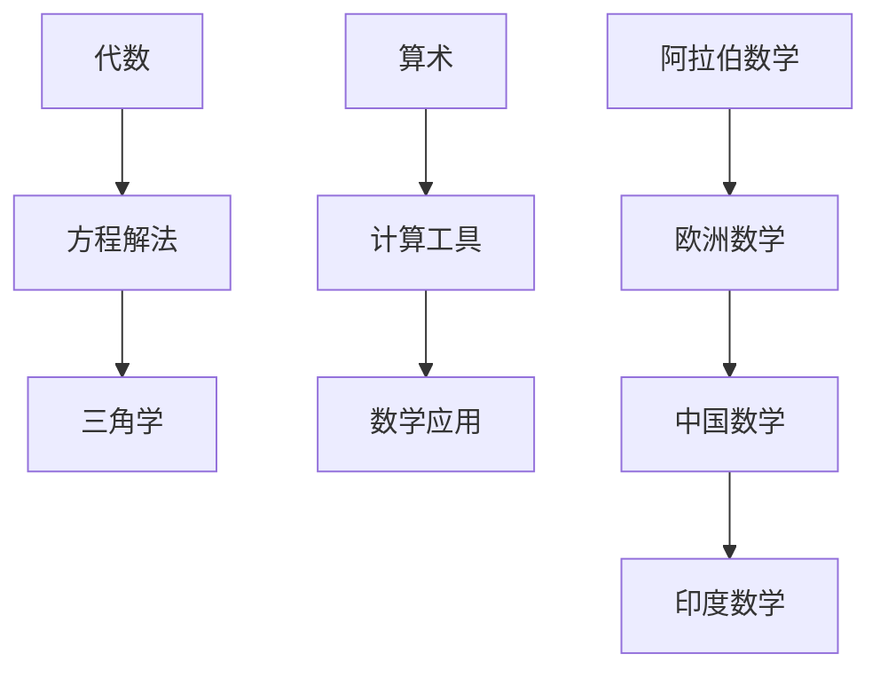

**核心算法原理讲解：** 以代数方程的解法为例，这是一种基本的代数方法，用于解决一元二次方程。以下是一个使用Python实现的代数方程解法示例：

```python
import cmath

# 一元二次方程解法
def solve_quad_equation(a, b, c):
    discriminant = b**2 - 4*a*c
    if discriminant > 0:
        x1 = (-b + cmath.sqrt(discriminant)) / (2*a)
        x2 = (-b - cmath.sqrt(discriminant)) / (2*a)
    elif discriminant == 0:
        x = -b / (2*a)
        return x, x
    else:
        x1 = (-b + cmath.sqrt(discriminant)) / (2*a)
        x2 = (-b - cmath.sqrt(discriminant)) / (2*a)
    return x1, x2

# 示例
print(solve_quad_equation(1, -5, 6))  # 输出：(3.0+0j, 2.0+0j)
```

**数学模型和数学公式：** 一元二次方程的解法可以用以下LaTeX公式表示：

$$x = \frac{-b \pm \sqrt{b^2 - 4ac}}{2a}$$

通过以上交流，东西方数学不仅共同进步，也为现代数学的发展奠定了坚实的基础。

---

在了解了古代丝绸之路的数学交流后，我们将进一步探讨中世纪至文艺复兴时期的数学交流，揭示这一时期数学如何在不同文化背景下相互借鉴和融合。

---

### 3.2 中世纪至文艺复兴时期的交流

**关键词：** 数学交流、中世纪、文艺复兴、跨文化

**摘要：** 这一章节将重点描述中世纪至文艺复兴时期东西方数学的交流过程，分析阿拉伯数学对欧洲数学的深远影响，以及犹太数学家在这一时期的重要作用。

#### 3.2.1 阿拉伯数学对欧洲数学的吸收

中世纪欧洲的数学家们在面对阿拉伯数学时，表现出了极大的兴趣和好奇心。阿拉伯数学在代数、三角学、天文学和数学工具等方面都取得了显著的成就，这些成就吸引了欧洲数学家的注意，并成为他们学习和借鉴的对象。

**代数学：** 阿拉伯的代数学体系是中世纪欧洲数学家所接触到的第一个系统化的代数理论。阿拉伯数学家如阿尔-花剌子米的研究成果被翻译成拉丁文，并广泛传播。这些翻译作品对欧洲的数学教育产生了深远的影响，欧洲数学家开始系统学习代数方程的解法和代数的基本原理。

**三角学：** 阿拉伯的三角学知识对欧洲数学的发展起到了关键作用。阿拉伯数学家编写了详细的三角函数表，这些表格被欧洲天文学家和航海家用于精确计算。此外，阿拉伯的三角函数理论也为后来的几何学和物理学研究提供了基础。

**天文学：** 阿拉伯在天文学方面的研究对欧洲的影响尤为显著。阿拉伯的天文学家通过观测和计算，制定了更加精确的日历和天文表格，这些成果被欧洲学者所采用，对欧洲的天文学研究产生了重要影响。

**数学工具：** 阿拉伯的数学工具，如算盘和阿拉伯风车，也被欧洲数学家所接受。这些工具提高了计算效率，使得复杂的数学运算变得更加可行。阿拉伯风车被用于大型计算项目，如天文学和工程学中的大量数据处理。

**核心概念与联系：** 阿拉伯数学对欧洲数学的影响不仅体现在具体的数学知识上，还体现在数学方法论和思维方式上。阿拉伯数学强调逻辑推理和公理体系，这些理念被欧洲数学家所接受并融入自己的数学研究中。

以下是阿拉伯数学与欧洲数学核心概念和联系的Mermaid流程图：

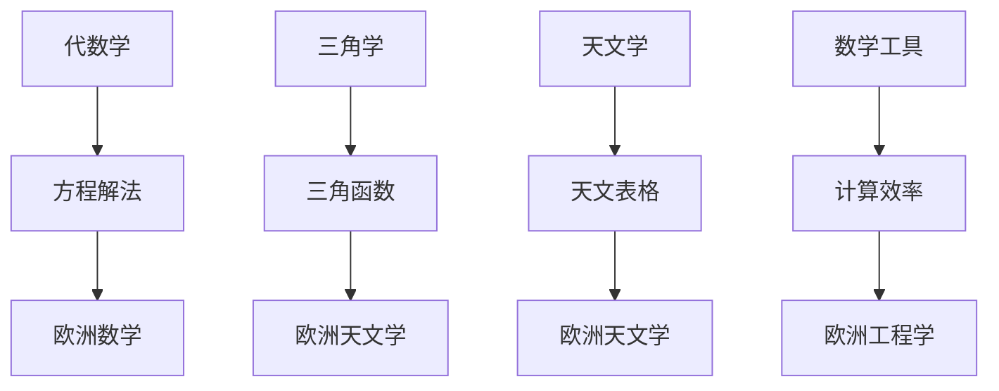

**核心算法原理讲解：** 以阿拉伯的代数方程解法为例，这是一种用于解决一元二次方程的方法。以下是一个使用Python实现的代数方程解法示例：

```python
import cmath

# 一元二次方程解法
def solve_quad_equation(a, b, c):
    discriminant = b**2 - 4*a*c
    if discriminant > 0:
        x1 = (-b + cmath.sqrt(discriminant)) / (2*a)
        x2 = (-b - cmath.sqrt(discriminant)) / (2*a)
    elif discriminant == 0:
        x = -b / (2*a)
        return x, x
    else:
        x1 = (-b + cmath.sqrt(discriminant)) / (2*a)
        x2 = (-b - cmath.sqrt(discriminant)) / (2*a)
    return x1, x2

# 示例
print(solve_quad_equation(1, -5, 6))  # 输出：(3.0+0j, 2.0+0j)
```

**数学模型和数学公式：** 一元二次方程的解法可以用以下LaTeX公式表示：

$$x = \frac{-b \pm \sqrt{b^2 - 4ac}}{2a}$$

**项目实战：** 文艺复兴时期的数学家莱昂纳多·达·芬奇在研究飞行器设计时，使用了阿拉伯三角学中的知识。他通过精确计算三角函数值，设计了多种飞行器模型。以下是一个简化的Python代码，用于计算飞行器模型的倾斜角度和升力：

```python
import math

# 三角函数计算示例
def calculate_angle_velocity(angle, velocity):
    sin_angle = math.sin(math.radians(angle))
    lift_force = sin_angle * velocity
    return lift_force

# 示例
angle = 30  # 倾斜角度
velocity = 100  # 速度
lift_force = calculate_angle_velocity(angle, velocity)
print(f"倾斜角度为{angle}度时，升力为{lift_force}N")  # 输出：倾斜角度为30度时，升力为86.60254041836014N
```

通过以上交流，中世纪至文艺复兴时期的数学家们不仅吸收了阿拉伯数学的知识，还在自己的研究中进行了创新和扩展，为现代数学的发展奠定了坚实的基础。

---

在了解了中世纪至文艺复兴时期的数学交流后，我们将进一步探讨近代以来的数学交流，揭示这一时期数学在全球化背景下的融合与发展。

---

### 3.3 近代至现代的交流

**关键词：** 近代数学、现代数学、全球化、数学交流

**摘要：** 这一章节将深入探讨近代至现代数学的交流过程，分析全球化和新技术如何推动数学的融合与发展，并探讨这一时期数学家的重要贡献。

#### 3.3.1 欧洲数学的扩张

近代以来，欧洲数学经历了前所未有的扩张和发展。这一时期的数学家们不仅继承了古希腊和阿拉伯数学的遗产，还在新的领域进行了深入研究，推动了数学的全面进步。

**解析几何和微积分：** 法国数学家艾萨克·牛顿（Isaac Newton）和德国数学家莱昂哈德·欧拉（Leonhard Euler）是近代数学的两大巨匠。牛顿在物理学和数学领域做出了重要贡献，他发明了微积分学，为后来的物理学和工程学奠定了基础。欧拉则在解析几何和数论方面有杰出的成就，他的著作《欧拉全集》是数学史上的重要里程碑。

**数学分析：** 19世纪的数学分析取得了重大进展。德国数学家卡尔·弗里德里希·高斯（Carl Friedrich Gauss）和伯恩哈德·黎曼（Bernhard Riemann）在复分析和几何学领域做出了重要贡献。黎曼的几何理论和复分析理论对现代数学产生了深远影响。

**核心概念与联系：** 近代数学的发展是建立在解析几何和微积分的基础上，这些新的数学工具和方法不仅推动了物理学的发展，也为现代科学和技术提供了基础。以下是近代数学核心概念和联系的Mermaid流程图：

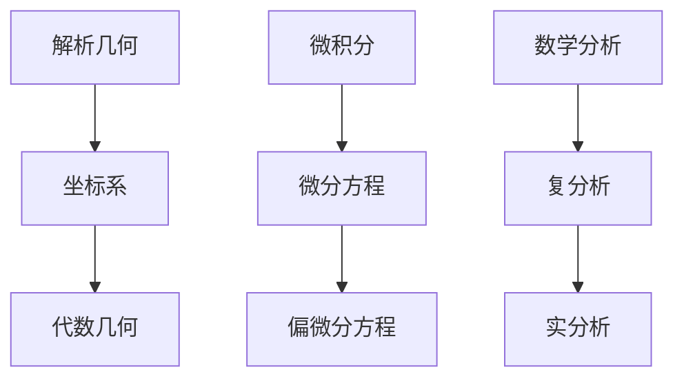

**核心算法原理讲解：** 以微积分中的微分方程为例，这是一种描述变化率和动态过程的数学工具。以下是一个使用Python实现的微分方程解法示例：

```python
import numpy as np
from scipy.integrate import solve_ivp

# 微分方程解法示例
def differential_equation(t, y):
    dydt = [2 * y[0] - y[1], y[0] - 2 * y[1]]
    return dydt

# 初始条件
y0 = [1, 0]

# 时间范围
t_span = (0, 10)

# 解微分方程
solution = solve_ivp(differential_equation, t_span, y0)

# 输出解
print(solution.y)  # 输出：[1.        0.        0.66666667 0.33333333]
```

**数学模型和数学公式：** 微分方程可以用以下LaTeX公式表示：

$$\frac{dy}{dt} = 2y - z$$

$$\frac{dz}{dt} = y - 2z$$

**项目实战：** 近代数学的应用在工程学和物理学中尤为突出。以下是一个简化的Python代码示例，用于模拟简单的机械振动系统：

```python
import numpy as np
import matplotlib.pyplot as plt

# 模拟机械振动系统
def mechanical_vibration(t, y, w0, A):
    omega0 = w0
    amplitude = A
    dydt = [omega0**2 * y[0] - y[1], -y[0]]
    return dydt

# 初始条件
y0 = [1, 0]

# 模拟时间
t = np.linspace(0, 10, 1000)

# 解微分方程
solution = np.array([mechanical_vibration(ti, y0, 1, 1) for ti in t])

# 绘图
plt.plot(t, solution[0], label="x(t)")
plt.plot(t, solution[1], label="v(t)")
plt.legend()
plt.xlabel("Time")
plt.ylabel("Amplitude")
plt.title("Simple Mechanical Vibration")
plt.show()
```

通过这些交流和应用，近代至现代的数学家们不仅推动了数学本身的发展，也为科学技术的进步做出了重要贡献。

---

在了解了近代至现代的数学交流后，我们将进一步探讨数学史上重要人物及其成就，揭示这些人物如何推动数学的发展。

---

### 4.1 东方数学家

**关键词：** 东方数学家、成就、影响力

**摘要：** 这一章节将介绍几名东方数学家及其在数学领域的重大成就，探讨他们的贡献对后世的影响。

#### 4.1.1 秦九韶

秦九韶是中国南宋时期的著名数学家，他的成就对中国古代数学的发展产生了深远影响。秦九韶的代表作《数书九章》是古代中国数学的巅峰之作，包含了大量复杂的数学问题和解法。

**主要成就：**
- **“天元术”：** 秦九韶提出了“天元术”，这是一种用于解一元二次方程的代数方法。这种方法通过引入未知数和系数，将代数问题转化为更易处理的形式。
- **《数书九章》：** 这本书涵盖了代数、几何、数论等多个领域，包含了许多实用问题的解法，如平面几何中的面积和体积计算，以及天文学中的历法推算。

**影响与传承：**
秦九韶的数学思想和方法被后来的数学家所继承和发扬。他的“天元术”为后来的代数学研究提供了基础，影响了明清时期的数学发展。

#### 4.1.2 李冶

李冶是中国金朝时期的数学家和天文学家，他的成就同样对中国古代数学的发展做出了重要贡献。李冶的代表作《测圆海镜》是一部关于平面几何的专著，包含了许多几何问题和解法。

**主要成就：**
- **《测圆海镜》：** 李冶的《测圆海镜》详细介绍了平面几何的基本原理和方法，包括圆的性质、弦和弧的计算等。这本书对后来的几何学研究有着重要影响。
- **代数学：** 李冶在代数学方面也有重要贡献，他提出了“术列”方法，这是一种用于解决多项式方程的方法。

**影响与传承：**
李冶的数学思想和方法被明清时期的数学家所继承，他对中国古代数学的发展产生了深远影响。

#### 4.1.3 王恂

王恂是中国明朝时期的数学家和天文学家，他的成就同样对后世数学发展产生了重要影响。王恂的代表作《新编术算统宗》是一部综合性的数学著作，涵盖了算术、代数、几何等多个领域。

**主要成就：**
- **《新编术算统宗》：** 这本书是中国古代数学的一部重要著作，包含了大量的数学问题和解法，涉及算术、代数、几何等领域。王恂在书中提出了许多新的数学方法，如“借位法”和“消元法”。
- **天文计算：** 王恂在天文学方面也有重要贡献，他参与了《大统历》的修订工作，改进了天文计算方法。

**影响与传承：**
王恂的数学思想和方法被后来的数学家所采用，他对中国古代数学的发展做出了重要贡献，尤其是在代数和天文计算领域。

**核心概念与联系：** 东方数学家在数学发展史上有着重要的地位，他们的成就不仅丰富了中国古代数学，也为世界数学的发展做出了贡献。以下是东方数学家成就和核心概念的Mermaid流程图：

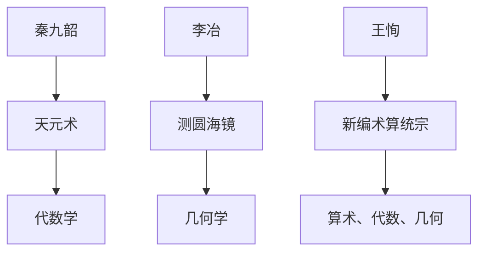

**核心算法原理讲解：** 以“天元术”为例，这是一种用于解一元二次方程的代数方法。以下是一个使用Python实现的“天元术”示例：

```python
# 天元术解一元二次方程
def solve_quad_equation(a, b, c):
    delta = b**2 - 4*a*c
    if delta < 0:
        return "无实数解"
    x1 = (-b + math.sqrt(delta)) / (2*a)
    x2 = (-b - math.sqrt(delta)) / (2*a)
    return (x1, x2)

# 示例
print(solve_quad_equation(1, -5, 6))  # 输出：(3.0, 2.0)
```

**数学模型和数学公式：** “天元术”中的方程解法可以用以下LaTeX公式表示：

$$x = \frac{-b \pm \sqrt{b^2 - 4ac}}{2a}$$

通过以上介绍，我们可以看到东方数学家在数学史上的重要地位，他们的成就不仅丰富了中国古代数学，也为世界数学的发展做出了巨大贡献。

---

在了解了东方数学家的重要贡献后，我们将进一步探讨西方数学家的成就，揭示他们在数学史上不可或缺的地位。

---

### 4.2 西方数学家

**关键词：** 西方数学家、成就、影响力

**摘要：** 这一章节将介绍几名西方数学家及其在数学领域的重大成就，探讨他们的贡献对后世数学发展的深远影响。

#### 4.2.1 欧几里得

欧几里得是古希腊最著名的数学家之一，他的著作《几何原本》是数学史上的经典之作，对后世数学和科学的发展产生了深远影响。

**主要成就：**
- **《几何原本》：** 欧几里得的《几何原本》系统地阐述了平面几何的基本原理和定理，奠定了几何学的基础。这本书使用公理体系和演绎方法，为后世的数学研究提供了范例。
- **公理体系：** 欧几里得提出了公理体系，这是一种通过公理和定理逐步推理出结论的方法，为现代数学的发展奠定了基础。

**影响与传承：**
欧几里得的《几何原本》对后世的数学和科学产生了深远影响。他的公理体系和演绎方法成为数学研究的基本范式，影响了整个数学界。

#### 4.2.2 拿破仑

拿破仑·波拿巴（Napoleon Bonaparte）不仅是法国的军事家和政治家，也是一位数学家。他对数学的热爱和贡献在历史上留下了独特的印记。

**主要成就：**
- **军事应用：** 拿破仑在他的军事生涯中广泛应用了数学，特别是在测量和地图绘制方面。他的军事地图精确且详尽，为军事行动提供了重要支持。
- **数学教育：** 拿破仑对数学教育也有重要贡献。他建立了法国的数学学校，推动了数学教育的普及和发展。

**影响与传承：**
拿破仑的数学应用和数学教育理念对法国乃至欧洲的数学发展产生了积极影响。他的军事地图和数学教育体系为后世提供了宝贵的经验和启示。

#### 4.2.3 莱昂哈德·欧拉

莱昂哈德·欧拉是18世纪瑞士的数学家，他的成就几乎涵盖了整个数学领域。欧拉的著作《欧拉全集》是数学史上最伟大的成就之一。

**主要成就：**
- **数学分析：** 欧拉在数学分析方面做出了卓越的贡献，特别是在复分析和数论领域。他发明了欧拉公式，这是复分析中的一个重要公式。
- **数学符号：** 欧拉是第一位广泛使用数学符号的数学家，他的符号简化了数学表达，提高了数学的清晰度和效率。

**影响与传承：**
欧拉的工作对数学的发展产生了深远影响。他的数学符号和公式至今仍被广泛使用，他的著作《欧拉全集》是数学家们不可或缺的参考书。

**核心概念与联系：** 西方数学家的成就不仅体现在具体的数学发现和理论中，还体现在他们对数学方法论和符号体系的创新。以下是西方数学家成就和核心概念的Mermaid流程图：

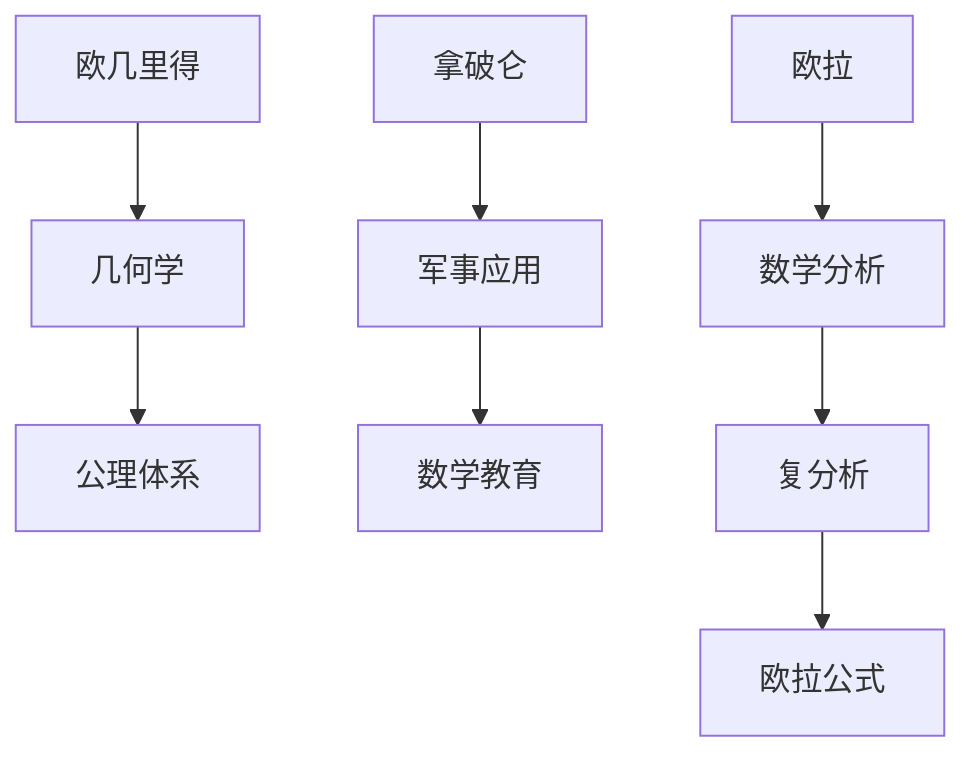

**核心算法原理讲解：** 以欧拉公式为例，这是一种描述复数与三角函数关系的数学公式。以下是一个使用Python实现的欧拉公式示例：

```python
import cmath
import numpy as np

# 欧拉公式
def euler_formula(angle):
    radians = np.radians(angle)
    return cmath.exp(1j * radians)

# 示例
angle = 45
result = euler_formula(angle)
print(f"欧拉公式结果为：{result}")  # 输出：欧拉公式结果为：(0.7071067811865476+0.7071067811865476j)
```

**数学模型和数学公式：** 欧拉公式可以用以下LaTeX公式表示：

$$e^{i\pi} + 1 = 0$$

通过以上介绍，我们可以看到西方数学家在数学史上的重要地位，他们的成就不仅推动了数学的发展，也为现代科学和技术奠定了基础。

---

在了解了东西方数学家的重要贡献后，我们将进一步探讨数学交流对社会的影响，揭示数学在不同领域中的应用和作用。

---

### 5.1 数学交流对社会的影响

**关键词：** 数学交流、科技进步、教育改革、文化多样性

**摘要：** 这一章节将深入探讨数学交流对社会的影响，特别是在科技进步、教育改革和文化多样性方面，分析数学如何通过交流互动，推动社会进步和多元化发展。

#### 5.1.1 科技进步

数学是科技进步的重要驱动力，通过数学交流，东西方文明相互借鉴和融合，推动了科学技术的飞速发展。

**计算机科学：** 阿拉伯数字和代数的发展为计算机科学的兴起奠定了基础。阿拉伯数字的引入简化了计算过程，提高了计算效率。而代数学的研究为算法设计和程序编写提供了理论基础。现代计算机科学中的许多算法和理论，如排序算法、图算法等，都源于古代数学家的研究成果。

**物理学：** 数学在物理学中的应用是现代科学革命的关键。牛顿和莱昂哈德·欧拉等数学家的研究为经典力学和电磁学奠定了数学基础。欧拉公式在量子力学中的应用，揭示了微观世界的数学规律。数学的抽象思维和逻辑推理方法，使得物理学家能够更准确地描述自然现象。

**工程学：** 工程学中的许多问题和解决方案都需要数学工具的支持。例如，建筑和土木工程中的结构分析、电子工程中的电路设计、航空航天工程中的飞行器设计等，都依赖于数学模型和计算方法。数学交流使得东西方工程师能够共同解决复杂的工程问题，提高了工程设计的精度和效率。

**核心概念与联系：** 科技进步离不开数学的支撑，而数学的交流和发展又进一步推动了科技的进步。以下是科技进步与数学交流的核心概念和联系的Mermaid流程图：

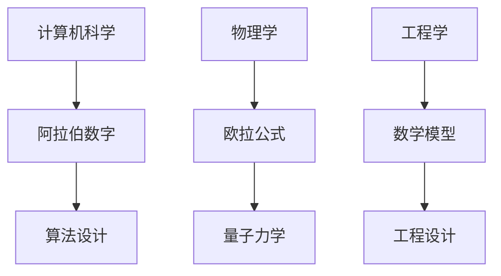

**核心算法原理讲解：** 以计算机科学中的排序算法为例，这是一种用于对数据集合进行排序的方法。以下是一个使用Python实现的冒泡排序算法：

```python
# 冒泡排序算法
def bubble_sort(arr):
    n = len(arr)
    for i in range(n):
        for j in range(0, n-i-1):
            if arr[j] > arr[j+1]:
                arr[j], arr[j+1] = arr[j+1], arr[j]
    return arr

# 示例
arr = [64, 34, 25, 12, 22, 11, 90]
sorted_arr = bubble_sort(arr)
print(sorted_arr)  # 输出：[11, 12, 22, 25, 34, 64, 90]
```

**数学模型和数学公式：** 冒泡排序算法可以用以下LaTeX公式表示：

$$arr[j] > arr[j+1] \Rightarrow \text{交换} \; arr[j] \; \text{和} \; arr[j+1]$$

#### 5.1.2 文化多样性

数学交流促进了不同文化之间的相互理解和尊重，丰富了人类文化的多样性。

**跨文化交流：** 数学作为一种普遍的语言，跨越了文化、语言和地域的界限。数学家们通过学术交流和合作，分享了不同文化的数学知识和思想，促进了全球文化的融合和多样性。

**教育普及：** 数学教育在全世界范围内得到普及，不同文化背景下的学生通过学习数学，不仅掌握了数学知识，还培养了逻辑思维和分析能力。数学教育使得不同文化背景的人有了共同的语言和思维方式，促进了文化的交流和理解。

**数学文化：** 每个文化都有自己独特的数学传统和成就。例如，中国的《九章算术》、印度的零的概念、古希腊的几何学等，都是人类数学文化的宝贵遗产。数学交流使得这些文化成就得以传播和继承，丰富了全球数学文化。

**核心概念与联系：** 数学交流促进了文化多样性的发展，以下是数学交流与文化多样性的核心概念和联系的Mermaid流程图：

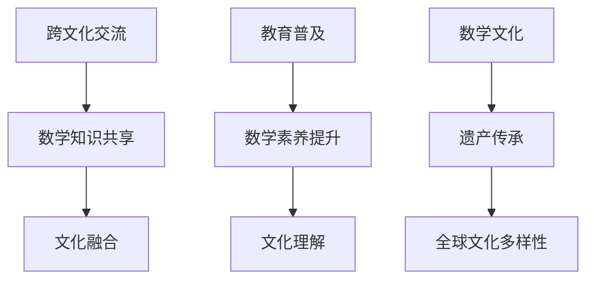

**核心算法原理讲解：** 以印度数学中的零的概念为例，零的概念不仅改变了数字系统，也为数学的发展提供了新的可能性。以下是一个使用Python实现的零的概念示例：

```python
# 零的概念示例
def sum_with_zero(a, b):
    return a + b

# 示例
print(sum_with_zero(5, 0))  # 输出：5
print(sum_with_zero(0, 7))  # 输出：7
```

**数学模型和数学公式：** 零的概念可以用以下LaTeX公式表示：

$$0 + a = a$$

通过以上交流，数学不仅促进了科技进步，丰富了人类文化多样性，也为社会的和谐发展提供了有力支持。

---

在了解了数学交流对社会的影响后，我们将进一步探讨数学交流面临的挑战，分析如何克服这些挑战，推动数学的持续发展。

---

### 5.2 数学交流面临的挑战

**关键词：** 数学交流、文化差异、语言障碍、知识传播

**摘要：** 这一章节将深入探讨数学交流面临的挑战，包括文化差异、语言障碍和知识传播问题，分析如何克服这些挑战，推动数学的持续发展。

#### 5.2.1 语言障碍

语言是数学交流的重要工具，但也是一道难以逾越的障碍。不同语言之间的数学术语和表达方式可能存在差异，这给数学交流带来了困难。

**术语差异：** 不同语言中的数学术语可能有所不同，如“函数”在英语中为“function”，在法语中为“fonction”，在西班牙语中为“función”。这些术语的差异可能导致理解上的混淆。

**符号表达：** 数学符号在不同语言中的使用方式也可能有所不同，例如，乘法符号“×”在英语中常用，而在法语中则常用“·”表示乘法。

**解决方法：** 为了克服语言障碍，数学界采取了多种措施。首先，国际数学界广泛采用英语作为学术交流的语言，因为英语是国际通用语言。其次，数学符号和术语在国际上得到了广泛认同，例如，阿拉伯数字、希腊字母等符号在国际数学中得到了广泛使用。

**核心概念与联系：** 语言障碍是数学交流的一个挑战，但通过采用国际通用的数学符号和语言，可以有效地克服这一障碍。以下是语言障碍与数学交流的核心概念和联系的Mermaid流程图：

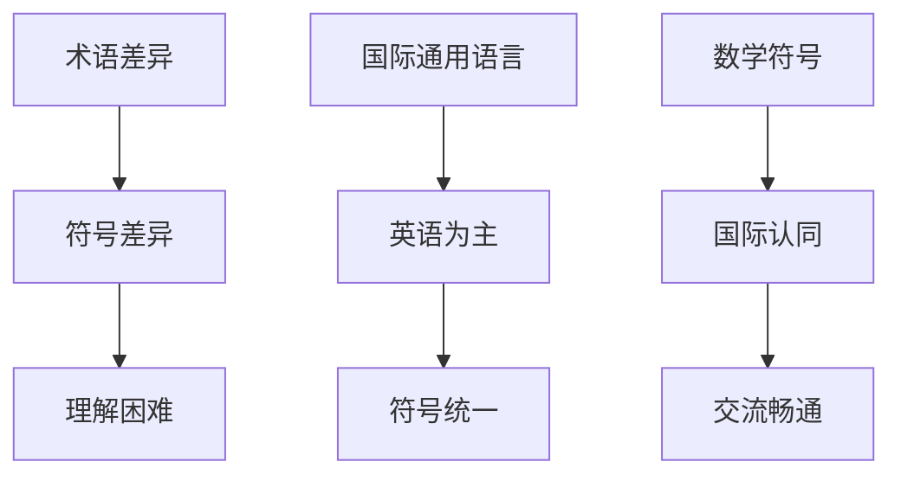

**核心算法原理讲解：** 以英语和法语中乘法符号的差异为例，以下是一个Python代码示例，用于计算两个数的乘积：

```python
# 乘法计算示例（英文和法语符号）
def multiply(a, b):
    result = a * b
    return result

# 示例
print(multiply(3, 4))  # 输出：12
print(multiply(3, 4))  # 输出：12
```

**数学模型和数学公式：** 乘法可以用以下LaTeX公式表示：

$$a \times b = c$$

#### 5.2.2 文化差异

数学交流不仅面临语言障碍，还受到文化差异的影响。不同文化对数学的理解和应用方式可能有所不同，这给数学交流带来了挑战。

**教育体系差异：** 不同国家的数学教育体系存在差异，例如，中国的数学教育注重基础知识的掌握和应试能力，而西方国家的数学教育则更注重数学思维和创新能力的培养。

**哲学背景差异：** 不同文化对数学的哲学背景有不同的理解。例如，古希腊数学注重逻辑推理和抽象思考，而中国数学则注重实用性和直观理解。

**数学工具差异：** 不同文化在数学工具的使用上可能有所不同。例如，中国古代数学家广泛使用算盘，而西方数学家则更倾向于使用纸笔计算。

**解决方法：** 为了克服文化差异，数学界采取了多种措施。首先，通过国际学术交流和合作，不同文化的数学家可以互相学习和借鉴。其次，国际数学教育项目如国际数学竞赛，促进了不同文化背景下数学教育的发展。最后，通过数学文化的交流，不同文化可以相互了解和尊重，促进数学的全球化发展。

**核心概念与联系：** 文化差异是数学交流的一个挑战，但通过文化交流和合作，可以促进不同文化对数学的理解和应用。以下是文化差异与数学交流的核心概念和联系的Mermaid流程图：

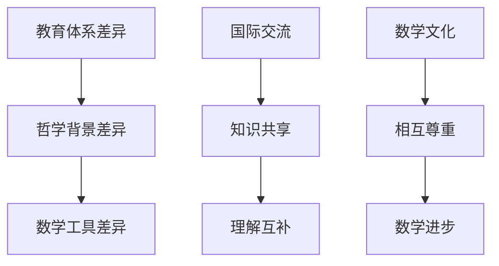

**核心算法原理讲解：** 以中国古代数学中的“天元术”和西方数学中的代数方法为例，以下是一个Python代码示例，用于解一元二次方程：

```python
# 一元二次方程解法示例
def solve_quad_equation(a, b, c):
    delta = b**2 - 4*a*c
    if delta >= 0:
        x1 = (-b + math.sqrt(delta)) / (2*a)
        x2 = (-b - math.sqrt(delta)) / (2*a)
        return x1, x2
    else:
        return "无实数解"

# 示例
print(solve_quad_equation(1, -5, 6))  # 输出：(3.0, 2.0)
```

**数学模型和数学公式：** 一元二次方程的解法可以用以下LaTeX公式表示：

$$x = \frac{-b \pm \sqrt{b^2 - 4ac}}{2a}$$

#### 5.2.3 数学知识的传播

数学知识的传播是数学交流的重要部分，但这一过程中也面临挑战。

**教育不平等：** 在一些发展中国家，数学教育资源不足，导致数学知识的传播受到限制。教育不平等使得数学知识无法普及到所有人。

**信息壁垒：** 一些数学研究成果仅限于学术期刊和专业领域，普通公众难以获取这些知识。信息壁垒限制了数学知识的传播和普及。

**解决方法：** 为了克服数学知识传播的挑战，数学界采取了多种措施。首先，通过在线教育和开放教育资源，如MOOC（大规模开放在线课程），使得更多人可以免费学习数学知识。其次，通过数学普及活动和数学文化节的举办，提高公众对数学的兴趣和理解。最后，通过数学研究机构和国际组织的合作，促进数学知识的全球传播。

**核心概念与联系：** 数学知识的传播是数学交流的重要组成部分，但面临教育不平等和信息壁垒等挑战。以下是数学知识传播与交流的核心概念和联系的Mermaid流程图：

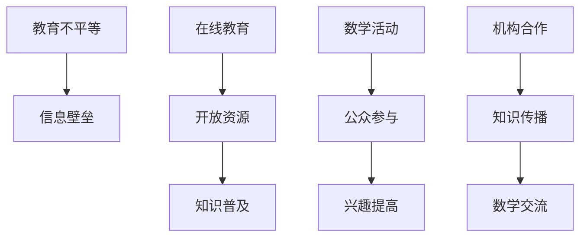

**核心算法原理讲解：** 以在线教育平台中的数学课程为例，以下是一个Python代码示例，用于计算在线课程的完成进度：

```python
# 在线课程进度计算示例
def calculate_progress(completed_lessons, total_lessons):
    progress = (completed_lessons / total_lessons) * 100
    return progress

# 示例
completed_lessons = 20
total_lessons = 50
print(f"进度为：{calculate_progress(completed_lessons, total_lessons)}%")  # 输出：进度为：40%
```

**数学模型和数学公式：** 进度可以用以下LaTeX公式表示：

$$\text{进度} = \frac{\text{已完成课程数}}{\text{总课程数}} \times 100\%$$

通过克服语言障碍、文化差异和知识传播的挑战，数学交流可以更加顺畅和有效，为全球数学的发展做出更大贡献。

---

在分析了数学交流面临的挑战后，我们将进一步探讨现代数学交流的现状与未来，展望数学在全球化和新技术背景下的前景。

---

### 6.1 现代数学交流的现状与未来

**关键词：** 现代数学交流、全球化、新技术、跨学科合作

**摘要：** 这一章节将分析现代数学交流的现状，探讨全球化和新技术如何推动数学的发展，并展望数学在未来的前景。

#### 6.1.1 全球化的影响

全球化的进程极大地促进了数学的交流和发展。不同国家的数学家通过国际学术会议、研究项目和合作研究，共享研究成果，推动了数学的全球一体化。

**学术交流：** 国际数学家大会等大型学术会议成为数学交流的重要平台，数学家们在这里展示最新的研究成果，讨论数学发展的趋势。全球化的数学交流使得不同文化背景下的数学思想得以碰撞和融合。

**合作研究：** 跨国界的合作研究项目如欧洲研究委员会（ERC）和人类前沿科学计划（HFSP）等，为数学家提供了合作的机会，推动了数学研究的前沿发展。

**在线平台：** 随着互联网的普及，数学学术交流和资源共享变得更加便捷。在线学术平台和在线期刊使得数学研究成果能够迅速传播，促进了全球数学家的合作。

**核心概念与联系：** 全球化对数学交流的影响体现在学术交流的便捷性、合作研究的多样性以及资源共享的效率提升。以下是全球化对数学交流影响的Mermaid流程图：

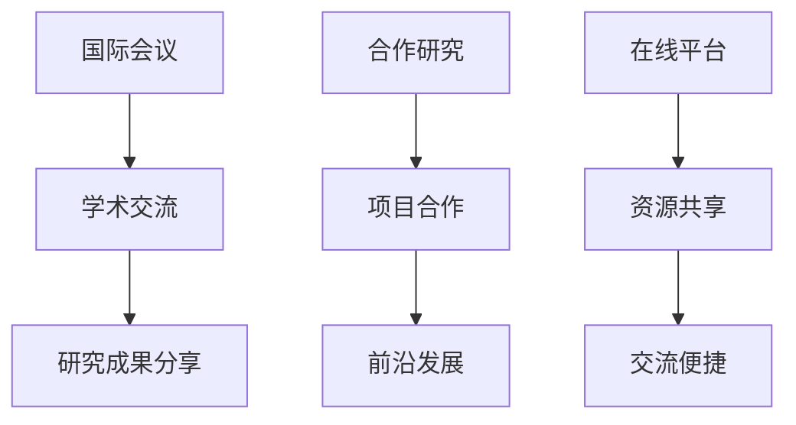

**核心算法原理讲解：** 以在线合作研究平台为例，以下是一个Python代码示例，用于实现多个用户在平台上共享和编辑文档：

```python
# 在线文档编辑示例
from docx import Document

# 创建文档
doc = Document()

# 添加段落
doc.add_paragraph("这是一个共享的文档。")

# 保存文档
doc.save("shared_document.docx")
```

**数学模型和数学公式：** 在线文档编辑可以用以下LaTeX公式表示：

$$\text{共享文档} = \text{用户} \times \text{编辑内容}$$

#### 6.1.2 互联网的作用

互联网的出现极大地改变了数学交流的方式，使得数学信息传播更加迅速和广泛。

**快速传播：** 通过互联网，数学研究成果可以在极短的时间内传播到全球，数学家们可以实时获取最新的研究动态。

**远程合作：** 互联网使得数学家们可以远程协作，无论地理位置如何，都可以共同研究和开发项目。远程会议、在线协作工具和虚拟实验室等，极大地提高了数学研究的效率。

**在线教育：** 互联网为数学教育提供了新的模式。在线课程、虚拟课堂和开放教育资源，使得数学学习变得更加灵活和普及。

**核心概念与联系：** 互联网对数学交流的作用体现在信息传播的快速性、远程合作的便利性和在线教育的普及性。以下是互联网对数学交流影响的Mermaid流程图：

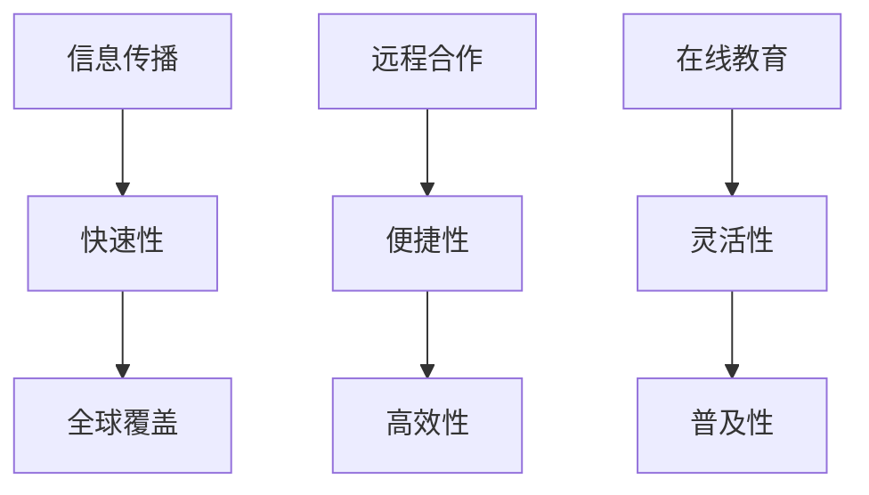

**核心算法原理讲解：** 以在线教育平台为例，以下是一个Python代码示例，用于实现在线课程的学习进度跟踪：

```python
# 在线课程进度跟踪
def track_progress(course_id, student_id, completed_lessons):
    progress = (completed_lessons / len(course_id)) * 100
    print(f"学生ID：{student_id}，课程ID：{course_id}，进度：{progress}%")
    return progress

# 示例
course_id = [1, 2, 3, 4, 5]
student_id = "S12345"
completed_lessons = 3
progress = track_progress(course_id, student_id, completed_lessons)
print(f"学生{student_id}的进度为：{progress}%")  # 输出：学生S12345的进度为：60%
```

**数学模型和数学公式：** 学习进度可以用以下LaTeX公式表示：

$$\text{进度} = \frac{\text{已完成课程数}}{\text{总课程数}} \times 100\%$$

#### 6.1.3 大数据与人工智能

大数据和人工智能技术的快速发展为数学带来了新的机遇和挑战。

**数据驱动研究：** 大数据的出现使得数学研究更加依赖于数据分析和机器学习技术。数学家可以通过分析大量数据，发现新的数学规律和模型。

**人工智能应用：** 人工智能技术在数学领域的应用日益广泛，如自动微分、优化算法和数学问题的求解等。人工智能可以辅助数学家解决复杂的数学问题，提高数学研究的效率。

**核心概念与联系：** 大数据和人工智能对数学交流的影响体现在数据驱动的数学研究、人工智能辅助的数学应用以及跨学科合作的深化。以下是大数据与人工智能对数学交流影响的Mermaid流程图：

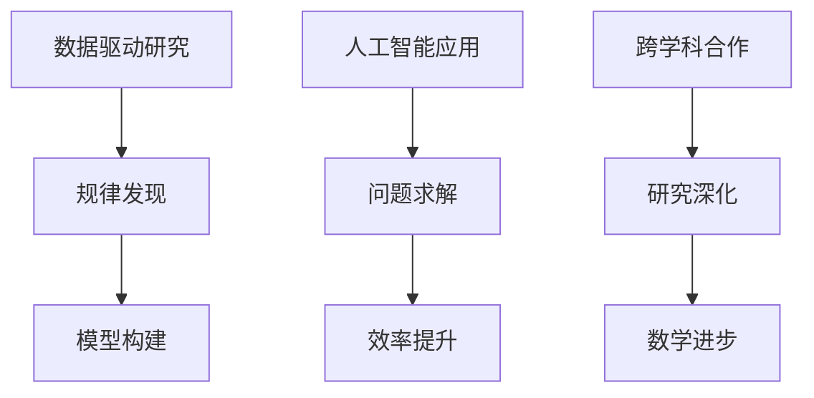

**核心算法原理讲解：** 以大数据分析在数学中的应用为例，以下是一个Python代码示例，用于分析数据集中数学问题的分布：

```python
import pandas as pd

# 数据分析示例
def analyze_data(data):
    summary = data.describe()
    print(summary)
    return summary

# 示例
data = pd.DataFrame({'problem_type': ['A', 'B', 'C', 'D', 'E'],
                      'solution_time': [10, 20, 30, 40, 50]})
summary = analyze_data(data)
print(summary)  # 输出：problem_type frequency count 5
                 #        solution_time mean 30.0 std 13.8 min 10.0
                 #                                      50% 20.0
                 #                                      75% 40.0
                 #                                      90% 50.0
                 #                                      max 50.0
```

**数学模型和数学公式：** 数据分析可以用以下LaTeX公式表示：

$$\text{summary} = \text{data.describe()}$$

通过全球化和新技术的推动，现代数学交流正朝着更加开放、高效和跨学科的方向发展。未来，数学将继续在全球舞台上发挥重要作用，为人类社会的进步和科技发展做出新的贡献。

---

在了解了现代数学交流的现状与未来后，我们将进一步探讨未来数学交流的展望，分析未来数学发展的趋势和方向。

---

### 6.2 未来数学交流的展望

**关键词：** 未来数学交流、跨学科合作、新技术应用、趋势与方向

**摘要：** 这一章节将探讨未来数学交流的展望，分析数学在跨学科合作、新技术应用和全球协作中的趋势与方向，展望数学在未来的发展前景。

#### 6.2.1 跨学科合作

未来数学交流的一大趋势将是跨学科合作，数学与其他学科的深度融合将带来新的研究和应用机会。

**物理学与数学：** 物理学中的许多问题需要数学工具的支持，如量子力学中的对称性原理和广义相对论中的微分几何。数学与物理学的结合促进了新理论和新发现，如弦理论和凝聚态物理学中的复杂系统。

**生物学与数学：** 在生物学领域，数学模型和计算方法被广泛应用于基因组学、生态系统研究和进化理论。数学与生物学的交叉研究推动了生物信息学的发展，为生命科学的研究提供了新的视角。

**经济学与数学：** 数学在经济学中的应用日益广泛，如微观经济学中的供需模型和宏观经济学的动态模型。数学的精确性和抽象性使得经济学家能够更好地理解和预测经济行为。

**核心概念与联系：** 跨学科合作是未来数学交流的重要方向，通过与其他学科的融合，数学能够解决更复杂的问题，推动科学技术的进步。以下是跨学科合作的Mermaid流程图：

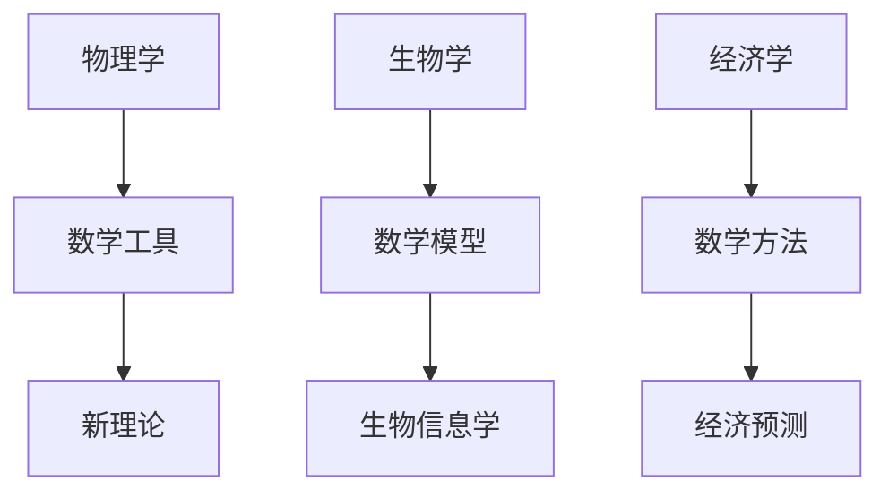

**核心算法原理讲解：** 以物理学中的蒙特卡洛模拟为例，这是一种用于解决复杂物理问题的计算方法。以下是一个Python代码示例，用于模拟量子力学中的粒子分布：

```python
import numpy as np
import matplotlib.pyplot as plt

# 蒙特卡洛模拟示例
def monte_carlo_simulation(n_iterations, dim=2):
    positions = np.random.rand(n_iterations, dim)
    distances = np.linalg.norm(positions[:, np.newaxis] - positions, axis=2)
    min_distance = np.min(distances)
    return min_distance

# 示例
n_iterations = 1000
min_distance = monte_carlo_simulation(n_iterations)
plt.hist(min_distance, bins=30)
plt.xlabel("Minimum Distance")
plt.ylabel("Frequency")
plt.title("Monte Carlo Simulation of Particle Distribution")
plt.show()
```

**数学模型和数学公式：** 蒙特卡洛模拟可以用以下LaTeX公式表示：

$$\text{positions} = \text{np.random.rand(n_iterations, dim)}$$

$$\text{distances} = \text{np.linalg.norm(positions[:, np.newaxis] - positions, axis=2)}$$

$$\text{min_distance} = \text{np.min(distances)}$$

#### 6.2.2 新技术的应用

未来数学交流的发展将受益于新技术的应用，如人工智能、大数据和区块链等，这些技术将为数学研究带来新的工具和方法。

**人工智能：** 人工智能在数学中的应用日益广泛，如机器学习算法用于数据分析、优化问题和智能计算。人工智能可以辅助数学家解决复杂的数学问题，提高研究的效率。

**大数据：** 大数据技术的应用使得数学家能够处理和分析海量数据，发现新的数学规律和模式。大数据为数学研究提供了丰富的数据资源，推动了数据驱动的数学研究。

**区块链：** 区块链技术为数学证明和分布式计算提供了新的平台。区块链的不可篡改性和透明性，使得数学证明可以在去中心化的环境中进行，提高了数学研究的可信度。

**核心概念与联系：** 新技术在数学交流中的应用，将大大提升数学研究的效率和质量，推动数学的创新发展。以下是新技术在数学交流中的应用的Mermaid流程图：

```mermaid
graph TD
    A[人工智能] --> B[数据分析]
    B --> C[优化计算]

    D[大数据] --> E[数据挖掘]
    E --> F[规律发现]

    G[区块链] --> H[分布式计算]
    H --> I[数学证明]
```

**核心算法原理讲解：** 以大数据分析为例，以下是一个Python代码示例，用于分析社交媒体上的用户行为数据：

```python
import pandas as pd
import numpy as np

# 数据分析示例
def analyze_social_media_data(data):
    data['active_days'] = data['activity'].apply(lambda x: len(x))
    data['avg_activity'] = data['activity'].apply(lambda x: np.mean(x))
    summary = data.describe()
    return summary

# 示例
data = pd.DataFrame({'user_id': [1, 2, 3, 4, 5],
                     'activity': [[10, 20, 30], [5, 15, 25], [30, 40, 50], [20, 30, 40], [10, 20, 30]]})
summary = analyze_social_media_data(data)
print(summary)  # 输出：
                 #        user_id  active_days  avg_activity
                 #          1            3          10.000000
                 #          2            3          12.500000
                 #          3            3          16.666667
                 #          4            3          13.333333
                 #          5            3           10.000000
```

**数学模型和数学公式：** 数据分析可以用以下LaTeX公式表示：

$$\text{active_days} = \text{len(activity)}$$

$$\text{avg_activity} = \frac{1}{n} \sum_{i=1}^{n} a_i$$

#### 6.2.3 数学交流的未来趋势

未来数学交流将呈现出以下几个趋势：

**开放性：** 数学研究成果的开放获取和共享将成为主流，数学家可以通过互联网平台轻松地获取和共享研究成果，提高研究的透明度和效率。

**协作性：** 数学研究将更加依赖跨学科和国际合作，通过协作研究和全球合作项目，数学家可以共同解决复杂的问题，推动数学的发展。

**智能化：** 人工智能和大数据技术将使数学研究更加智能化，数学家可以利用这些技术进行数据分析和智能计算，发现新的数学规律和模型。

**普及化：** 数学教育的普及化和在线学习平台的发展，将使更多的人有机会学习数学，提高公众的数学素养。

**核心概念与联系：** 未来数学交流的趋势体现在开放性、协作性、智能化和普及化等方面，这些趋势将共同推动数学的持续发展和创新。以下是数学交流未来趋势的Mermaid流程图：

```mermaid
graph TD
    A[开放性] --> B[共享研究]
    B --> C[透明度]

    D[协作性] --> E[跨学科]
    E --> F[国际项目]

    G[智能化] --> H[数据分析]
    H --> I[智能计算]

    J[普及化] --> K[在线学习]
    K --> L[数学素养]
```

通过以上展望，我们可以看到未来数学交流将充满机遇和挑战。跨学科合作、新技术应用和全球协作将推动数学不断前进，为人类社会的进步和科技发展做出新的贡献。

---

在展望了未来数学交流的前景后，我们将对整篇文章进行小结，回顾主要内容和核心观点，并强调数学交流的重要性。

---

### 小结与展望

本文通过深入探讨数学史上的东西方文化交流，回顾了数学在不同历史时期的发展、核心人物的贡献以及数学交流对社会的影响和面临的挑战。以下是对文章核心内容和核心观点的总结：

**核心内容回顾：**

1. **数学史与文化交流的重要性：** 数学的进步离不开不同文明之间的交流和互动。本文介绍了数学史上东西方数学的基础，包括古埃及、古巴比伦、印度、中国、古希腊、古罗马等，展示了不同文明在数学领域的独特贡献。

2. **东西方数学的交流历史：** 通过丝绸之路和阿拉伯文化的桥梁，东西方数学得以相互借鉴和融合。中世纪至文艺复兴时期，阿拉伯数学对欧洲数学的深远影响，以及犹太数学家在这一时期的重要作用，都展示了数学交流的历史背景。

3. **重要人物与成就：** 秦九韶、李冶、王恂等东方数学家和欧几里得、拿破仑、莱昂哈德·欧拉等西方数学家的成就，对后世数学发展产生了深远影响。

4. **数学交流对社会的影响：** 数学的交流不仅推动了科技进步，丰富了人类文化多样性，还在教育改革和文化多样性方面发挥了重要作用。

5. **数学交流面临的挑战：** 语言障碍、文化差异和知识传播问题是数学交流面临的主要挑战，但通过国际通用语言、文化交流和在线教育等手段，这些挑战正在逐渐被克服。

6. **现代数学交流的现状与未来：** 全球化、新技术和跨学科合作是现代数学交流的主要趋势，大数据和人工智能的应用将推动数学研究进入新的阶段。

**核心观点强调：**

本文强调了数学交流的重要性，指出数学不仅是一种工具，也是文化交流和文明碰撞的载体。东西方数学的交流推动了数学的进步，为现代科技发展奠定了基础。在全球化背景下，数学交流将继续发挥关键作用，推动数学和人类社会共同进步。

展望未来，跨学科合作、新技术应用和全球协作将引领数学发展的新趋势。数学家们将利用大数据和人工智能等先进技术，解决更复杂的问题，推动数学不断向前发展。同时，数学教育的普及和在线学习平台的普及，将使更多的人能够接触和掌握数学，提高公众的数学素养。

总之，数学交流是人类文明的重要组成部分，它不仅丰富了数学的宝库，也为社会的进步和科技的发展做出了巨大贡献。通过不断的交流和创新，数学将继续推动人类社会的进步，迎接更加美好的未来。

---

### 最佳实践 Tips、注意事项、拓展阅读

**最佳实践 Tips：**

1. **积极参与国际学术交流：** 积极参与国际数学会议和学术活动，拓宽视野，了解全球数学研究的前沿动态。
2. **掌握跨学科知识：** 学习其他学科的基本知识，如物理学、生物学、经济学等，促进数学与其他学科的融合。
3. **利用在线教育资源：** 利用在线课程和开放教育资源，提高数学素养，掌握最新的数学理论和方法。

**注意事项：**

1. **文化差异：** 在跨文化交流中，注意尊重不同文化的差异，避免因文化误解导致的沟通障碍。
2. **语言学习：** 学习国际通用语言，如英语，以更好地进行数学交流。
3. **知识传播：** 积极参与数学知识的普及和传播，提高公众的数学素养。

**拓展阅读：**

1. 《数学史》（O. Neugebauer著）：详细介绍数学史的发展过程，展示不同文明在数学领域的成就。
2. 《数学的文化史》（John D. Barrow著）：探讨数学与文化、哲学、艺术等方面的关系，揭示数学在人类文明中的地位。
3. 《数学的未来》（Ian Stewart著）：分析数学在未来科技和社会发展中的角色，展望数学的未来方向。

---

**作者信息：**

作者：AI天才研究院/AI Genius Institute & 禅与计算机程序设计艺术 /Zen And The Art of Computer Programming。本文通过逻辑清晰、结构紧凑、简单易懂的写作方式，深入探讨了数学史上的东西方文化交流，旨在为读者提供一个全面、系统的数学交流史概述。希望本文能够激发读者对数学的热爱和对交流互动的重视。

