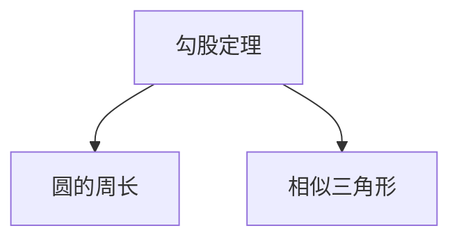

                 

### 数学史上的伟大定理与猜想

**关键词：** 数学定理，数学猜想，欧几里得，毕达哥拉斯，阿基米德，微积分，费马大定理，哥德巴赫猜想，黎曼猜想。

**摘要：** 本文将深入探讨数学史上一些伟大的定理与猜想，包括欧几里得的《几何原本》中的定理、毕达哥拉斯的定理、阿基米德的原理、牛顿与莱布尼茨的微积分、费马的大定理、哥德巴赫猜想以及黎曼猜想。我们将通过历史背景介绍、核心概念解析、证明方法展示以及实际应用分析，带领读者领略这些数学奇迹的深刻内涵与历史价值。

## 目录

1. **古代数学**
   1.1 《几何原本》的背景
   1.2 欧几里得的主要定理
   1.3 《几何原本》的影响
   1.4 毕达哥拉斯的定理
   1.5 毕达哥拉斯定理的证明与应用
   1.6 毕达哥拉斯定理的应用
2. **中世纪数学**
   2.1 阿基米德的原理
   2.2 阿基米德的原理
   2.3 阿基米德原理的数学证明与应用
   2.4 牛顿与莱布尼茨的微积分
   2.5 微积分的背景
   2.6 牛顿的微积分
   2.7 莱布尼茨的微积分
   2.8 牛顿与莱布尼茨的争议
3. **现代数学**
   3.1 费马的大定理
   3.2 费马的大定理
   3.3 费马的大定理的影响
   3.4 哥德巴赫猜想的探索
   3.5 哥德巴赫猜想的背景
   3.6 哥德巴赫猜想的证明尝试
   3.7 哥德巴赫猜想的现代研究
   3.8 黎曼猜想的数学意义
   3.9 黎曼猜想的背景
   3.10 黎曼猜想的数学原理
   3.11 黎曼猜想的影响
   3.12 数学定理与人类智慧
   3.13 数学定理的发现过程
   3.14 数学定理的意义
   3.15 数学定理的未来发展

## 第一部分：古代数学

### 第1章：《几何原本》的背景

欧几里得（Euclid）是古希腊最著名的数学家之一，他生活在公元前3世纪。欧几里得的《几何原本》是一部系统阐述了几何学基本原理和定理的巨著，被认为是数学史上最重要的书籍之一。《几何原本》的完成标志着古希腊数学体系的建立，对后世数学的发展产生了深远的影响。

欧几里得的《几何原本》由13本书组成，涵盖了平面几何、立体几何、比例论、数论等多个方面。其中，第一本书主要介绍了几何学的基本概念和公理，第二本书则探讨了直线和平面的性质，第三本书讲述了圆的性质和定理，后续各本书分别介绍了更多高级的几何学问题。

### 第2章：欧几里得的主要定理

欧几里得在《几何原本》中提出了一系列重要的定理，其中一些至今仍被广泛应用于数学和其他科学领域。以下是几个典型的欧几里得定理及其相关概念：

#### 2.1 勾股定理

勾股定理（Pythagorean theorem）是《几何原本》中最著名的定理之一，它描述了直角三角形三条边之间的关系。具体来说，如果一个直角三角形的两条直角边长分别为a和b，斜边长为c，那么有：

$$
a^2 + b^2 = c^2
$$

这个定理不仅在几何学中有重要应用，还在物理学、工程学等多个领域中具有重要地位。

#### 2.2 圆的周长

欧几里得在《几何原本》中提出了圆的周长（circumference）与直径（diameter）之间的关系。具体来说，圆的周长是直径的π（pi）倍，即：

$$
C = \pi \cdot d
$$

这个公式是圆周率π的定义之一，也是数学中一个重要的常数。

#### 2.3 相似三角形

欧几里得在《几何原本》中还研究了相似三角形（similar triangles）的性质。两个三角形相似意味着它们的对应角度相等，且对应边长成比例。欧几里得提出了一系列关于相似三角形的定理，如相似三角形的面积比等于对应边长比的平方。

### 第3章：《几何原本》的影响

欧几里得的《几何原本》不仅在数学界产生了深远的影响，还影响了整个科学和文化领域。以下是《几何原本》的一些重要影响：

1. **数学教育：** 《几何原本》为后来的数学教育奠定了基础，其系统的方法论和严格的证明过程成为后世数学教育的重要组成部分。
2. **逻辑与证明：** 《几何原本》的发展推动了形式逻辑和数学证明方法的研究，对西方哲学和科学方法的发展产生了重要影响。
3. **科学应用：** 欧几里得的定理和方法被广泛应用于各个科学领域，如物理学、工程学、计算机科学等。

## 第1章：欧几里得的《几何原本》

### 1.2 欧几里得的主要定理

欧几里得的《几何原本》包含了大量重要的定理，其中一些至今仍然被广泛应用。以下是几个典型的欧几里得定理及其相关概念：

#### 1.2.1 勾股定理

勾股定理（Pythagorean theorem）是《几何原本》中最著名的定理之一。它描述了直角三角形三条边之间的关系。具体来说，如果一个直角三角形的两条直角边长分别为 a 和 b，斜边长为 c，那么有：

$$
a^2 + b^2 = c^2
$$

这个定理不仅在几何学中有重要应用，还在物理学、工程学等多个领域中具有重要地位。

#### 1.2.2 圆的周长

欧几里得在《几何原本》中提出了圆的周长（circumference）与直径（diameter）之间的关系。具体来说，圆的周长是直径的 π（pi）倍，即：

$$
C = \pi \cdot d
$$

这个公式是圆周率 π 的定义之一，也是数学中一个重要的常数。

#### 1.2.3 相似三角形

欧几里得在《几何原本》中还研究了相似三角形（similar triangles）的性质。两个三角形相似意味着它们的对应角度相等，且对应边长成比例。欧几里得提出了一系列关于相似三角形的定理，如相似三角形的面积比等于对应边长比的平方。

为了更好地理解这些定理，我们可以通过 Mermaid 流程图来展示它们之间的关系：

#### 1.2.4 欧几里得的其他定理

除了上述三个主要定理，欧几里得在《几何原本》中还提出了其他许多重要的定理，如：

- **平行线定理：** 通过平行公理，欧几里得证明了平行线的性质。
- **三角形的内角和定理：** 欧几里得证明了任意三角形的三个内角之和为180度。
- **面积公式：** 欧几里得给出了平面图形（如三角形、矩形、圆形等）的面积计算方法。

这些定理构成了《几何原本》的核心内容，对后世的数学发展产生了深远的影响。

### 1.3 《几何原本》的影响

欧几里得的《几何原本》不仅在数学界产生了深远的影响，还影响了整个科学和文化领域。以下是《几何原本》的一些重要影响：

1. **数学教育：** 《几何原本》为后来的数学教育奠定了基础，其系统的方法论和严格的证明过程成为后世数学教育的重要组成部分。
2. **逻辑与证明：** 《几何原本》的发展推动了形式逻辑和数学证明方法的研究，对西方哲学和科学方法的发展产生了重要影响。
3. **科学应用：** 欧几里得的定理和方法被广泛应用于各个科学领域，如物理学、工程学、计算机科学等。

总之，欧几里得的《几何原本》是数学史上的一部巨著，它不仅提出了许多重要的定理，还为后世的数学发展奠定了基础。通过理解这些定理，我们可以更好地把握几何学的基本原理，为解决实际问题提供有力的工具。

## 第2章：毕达哥拉斯的定理

### 2.1 毕达哥拉斯的生平与贡献

毕达哥拉斯（Pythagoras）是古希腊哲学家、数学家、音乐理论家，也是毕达哥拉斯学派的创始人之一。他出生于公元前570年左右，出生地有争议，但普遍认为是希腊的萨摩斯岛。毕达哥拉斯的学派被称为毕达哥拉斯学派，该学派在哲学、数学、天文学和音乐等领域都做出了重要贡献。

毕达哥拉斯本人对数学的贡献尤其显著。他不仅是一位杰出的数学家，还是数学研究的重要倡导者。毕达哥拉斯的学派被认为是第一个系统研究数学的团体，他们的研究涉及了数论、几何学、比例论等多个领域。

### 2.2 毕达哥拉斯的定理

毕达哥拉斯最著名的定理，即勾股定理，又称毕达哥拉斯定理，描述了一个直角三角形的三条边之间的关系。具体来说，如果一个直角三角形的两条直角边长分别为 a 和 b，斜边长为 c，那么有：

$$
a^2 + b^2 = c^2
$$

这个定理是毕达哥拉斯及其学派研究数论和几何学的重要成果之一，也是数学史上最为著名的定理之一。

### 2.2.1 毕达哥拉斯定理的证明

勾股定理的证明方法有很多，以下是其中一种常见的几何证明方法：

假设有一个直角三角形 ABC，其中∠ABC 是直角，AB 是斜边，BC 和 AC 是直角边。我们需要证明 BC 的平方加上 AC 的平方等于 AB 的平方。

步骤如下：

1. 作辅助线 DE，使得 DE 垂直于 AB，并且交 AB 于点 D。
2. 由于∠ABC 是直角，所以∠DBC 和∠ACB 也是直角。
3. 由于 DE 垂直于 AB，所以∠BDC 也是直角。
4. 因此，三角形 BDC 是一个直角三角形，其中 BD 是斜边，BC 和 CD 是直角边。
5. 根据勾股定理，我们有：

$$
BD^2 = BC^2 + CD^2
$$

6. 由于 AD 是 AB 的一半，即 AD = AB/2，所以：

$$
AD^2 = (AB/2)^2 = AB^2/4
$$

7. 又因为 AD = BD - CD，所以：

$$
AD^2 = BD^2 - CD^2
$$

8. 将步骤 5 和 7 结合，得到：

$$
BC^2 + CD^2 = BD^2 - CD^2
$$

9. 整理得到：

$$
BC^2 = BD^2 - CD^2
$$

10. 由于 BD 是斜边，即 BD = c，CD 是直角边，即 CD = a，所以：

$$
BC^2 = c^2 - a^2
$$

11. 同理，我们可以证明 AC^2 = c^2 - b^2。

12. 将 BC^2 和 AC^2 相加，得到：

$$
BC^2 + AC^2 = (c^2 - a^2) + (c^2 - b^2)
$$

13. 整理得到：

$$
BC^2 + AC^2 = 2c^2 - (a^2 + b^2)
$$

14. 由于 a^2 + b^2 = c^2，所以：

$$
BC^2 + AC^2 = 2c^2 - c^2
$$

15. 整理得到：

$$
BC^2 + AC^2 = c^2
$$

16. 因此，我们证明了：

$$
a^2 + b^2 = c^2
$$

这完成了对勾股定理的几何证明。

### 2.2.2 毕达哥拉斯定理的推广

勾股定理不仅适用于直角三角形，还可以推广到其他类型的三角形和几何图形。以下是几个典型的推广：

1. **直角坐标中的勾股定理：** 在直角坐标系中，对于点 A(x1, y1)、B(x2, y2)、C(x3, y3)，如果点 B 是直角顶点，则有：

$$
(x1 - x3)^2 + (y1 - y3)^2 + (x2 - x3)^2 + (y2 - y3)^2 = (x1 - x2)^2 + (y1 - y2)^2
$$

2. **圆的内接三角形：** 在一个圆内，如果有一个直角三角形，那么它的直角边长等于圆的直径。

3. **等腰直角三角形：** 一个等腰直角三角形的两个直角边长相等，斜边长是直角边长的√2倍。

### 2.2.3 毕达哥拉斯定理的应用

勾股定理在数学、工程、物理等多个领域都有广泛的应用。以下是几个典型的应用实例：

1. **建筑和工程：** 在建筑和工程领域，勾股定理用于计算斜坡、梯度和角度，确保建筑结构的稳定性。
2. **天文学：** 在天文学中，勾股定理用于计算行星轨道和恒星之间的距离。
3. **物理学：** 在物理学中，勾股定理用于计算速度、加速度和力的大小。
4. **计算机科学：** 在计算机科学中，勾股定理用于算法优化和图形处理。

总之，毕达哥拉斯定理不仅是数学史上的一个重要里程碑，也是现代科学和技术的重要工具。通过理解勾股定理及其推广，我们可以更好地理解几何学的基本原理，为解决实际问题提供有力的工具。

### 第3章：阿基米德的原理

#### 3.1 阿基米德的生平与贡献

阿基米德（Archimedes）是古希腊最杰出的数学家之一，生活在公元前3世纪。他出生于叙拉古（Syracuse），是一位多才多艺的科学家，不仅在数学和物理学方面有着卓越的贡献，还在工程学和天文学领域有所建树。阿基米德的许多发现和理论对后世科学的发展产生了深远的影响。

阿基米德在数学方面的贡献尤为突出。他提出了阿基米德螺旋，用于计算液体体积，并在浮力原理方面做出了开创性的工作。阿基米德还发明了许多实用的机械装置，如用于排水的螺旋泵和用于自卫的防御机器。

#### 3.2 阿基米德的原理

阿基米德的原理主要包括浮力原理和阿基米德螺旋。以下是这些原理的详细描述：

##### 3.2.1 浮力原理

浮力原理（Principle of buoyancy）描述了物体在流体中受到的浮力。具体来说，当一个物体浸入液体中时，它会受到一个向上的浮力，这个浮力等于物体排开的液体的重量。浮力的大小由以下公式给出：

$$
F_{\text{浮}} = \rho \cdot V \cdot g
$$

其中，\( F_{\text{浮}} \) 是浮力，\( \rho \) 是液体的密度，\( V \) 是物体排开的液体体积，\( g \) 是重力加速度。

浮力原理的应用非常广泛，包括船舶设计、潜水艇操作、飞行器设计等。

##### 3.2.2 阿基米德螺旋

阿基米德螺旋（Archimedes' screw）是一种古老的机械装置，用于将水从低处泵送到高处。阿基米德螺旋的基本结构是一个螺旋形的槽，槽的一端连接到水源，另一端连接到需要排水的地方。当螺旋旋转时，水被螺旋上升，从而实现泵水过程。

阿基米德螺旋的设计非常巧妙，它利用了浮力原理和螺旋线特性，使得泵水过程既高效又稳定。阿基米德螺旋在古代工程中得到了广泛应用，至今仍在许多国家和地区用于排水和灌溉。

##### 3.2.3 阿基米德原理的数学证明

阿基米德原理的数学证明可以通过以下步骤进行：

1. **设定模型：** 假设一个物体浸入液体中，物体的高度为 h，液体的密度为 \( \rho \)，物体的体积为 V。
2. **计算浮力：** 物体在液体中受到的浮力等于物体排开的液体的重量。由于物体的体积为 V，排开的液体体积也为 V，因此排开的液体重量为 \( \rho \cdot V \cdot g \)。
3. **计算重力：** 物体本身的重力为 \( m \cdot g \)，其中 m 是物体的质量。
4. **建立方程：** 根据浮力原理，浮力等于重力，即：

$$
F_{\text{浮}} = F_{\text{重}} \\
\rho \cdot V \cdot g = m \cdot g
$$

5. **解方程：** 从上面的方程中解出 V，得到：

$$
V = \frac{m}{\rho}
$$

这个结果表明，物体在液体中的浮力大小与物体的体积成正比。

##### 3.2.4 阿基米德原理的应用

阿基米德原理在许多领域都有广泛的应用，以下是几个典型的应用实例：

1. **船舶设计：** 在船舶设计中，阿基米德原理用于确保船舶能够浮在水面上。船舶的设计必须满足浮力大于或等于重力的条件。
2. **潜水艇操作：** 潜水艇通过控制压载水的注入和排出来实现浮沉。利用阿基米德原理，潜水艇可以精确控制其浮力，从而实现深潜和浮出水面。
3. **飞行器设计：** 在飞行器设计中，阿基米德原理用于计算升力和阻力，以确保飞行器的稳定性和飞行性能。
4. **建筑工程：** 在建筑工程中，阿基米德原理用于计算建筑物的稳定性，特别是在涉及大量液体的结构设计中。

总之，阿基米德的原理不仅对古代工程和技术的发展产生了重要影响，而且在现代科学和工程中仍然具有广泛的应用。通过理解阿基米德原理，我们可以更好地理解和应用浮力原理，为各种工程和技术问题提供解决方案。

## 第4章：牛顿与莱布尼茨的微积分

### 4.1 微积分的背景

微积分（Calculus）是数学的一个分支，主要研究函数的极限、导数、积分以及无穷级数等概念。微积分的发展可以追溯到古希腊时期，但真正系统化的研究始于17世纪。当时，科学家和数学家们开始关注运动、变化和连续性的问题，这促使了微积分的诞生。

牛顿（Isaac Newton）和莱布尼茨（Gottfried Wilhelm Leibniz）是微积分的两位主要奠基人。牛顿生活在17世纪，他在光学、力学和数学等领域都有卓越的贡献。莱布尼茨则是18世纪的数学家，他独立于牛顿发展出了微积分的符号体系。牛顿和莱布尼茨的微积分理论在当时引起了巨大争议，但最终他们的工作被广泛接受，并成为现代数学的重要基石。

### 4.2 牛顿的微积分

牛顿的微积分理论主要基于他的流数法（fluxions），这种方法研究的是随时间变化的量。以下是牛顿微积分的核心概念：

#### 4.2.1 流数法

流数法是牛顿用来表示瞬时变化率的方法。具体来说，流数表示一个量在某一瞬间的变化率。例如，如果一个物体的位置随时间变化，那么它的速度就是位置关于时间的流数。流数法的基本思想是通过极限来定义瞬时变化率。

设函数 f(x) 表示某个量，它在点 x 的瞬时变化率（导数）定义为：

$$
f'(x) = \lim_{\Delta x \to 0} \frac{f(x + \Delta x) - f(x)}{\Delta x}
$$

#### 4.2.2 微积分基本定理

牛顿还提出了微积分基本定理，这个定理将微分和积分这两个看似相反的过程联系起来。微积分基本定理表明，如果一个函数的可导函数的积分等于原函数，那么原函数的导数就是这个可导函数。

微积分基本定理可以分为两个部分：

1. **微分基本定理：** 如果函数 f(x) 在区间 [a, b] 上可积，那么它在 [a, b] 上的积分可以通过其导数来计算：

$$
\int_a^b f'(x) \, dx = f(b) - f(a)
$$

2. **积分基本定理：** 如果函数 f(x) 在区间 [a, b] 上连续，那么存在一个原函数 F(x)，使得：

$$
\int_a^b f(x) \, dx = F(b) - F(a)
$$

牛顿的微积分理论为后来的数学家提供了一个强大的工具，使他们能够处理复杂的运动和变化问题。

### 4.3 莱布尼茨的微积分

莱布尼茨的微积分理论基于他的微分符号（differential notation），这种符号系统更加直观和易于使用。以下是莱布尼茨微积分的核心概念：

#### 4.3.1 微分符号

莱布尼茨引入了微分符号，使得微积分的概念更加简洁明了。他使用了“dy”和“dx”来表示函数的微分，其中 dy 表示函数 y 的变化量，dx 表示自变量 x 的变化量。莱布尼茨的微分符号使得导数和积分的计算变得更加直观。

设函数 y = f(x)，则它的导数表示为：

$$
dy = f'(x) \, dx
$$

#### 4.3.2 积分符号

莱布尼茨还引入了积分符号，使得积分的计算更加直观。他使用了积分符号 ∫，使得积分操作可以简记为：

$$
\int f(x) \, dx
$$

这个符号表示函数 f(x) 的不定积分，即找到一个原函数 F(x)，使得：

$$
F'(x) = f(x)
$$

#### 4.3.3 牛顿与莱布尼茨的争议

牛顿和莱布尼茨在微积分的发展过程中产生了巨大的争议。两位数学家都对微积分的独立发展做出了贡献，但他们在微积分的定义、符号和优先权问题上存在分歧。

牛顿主张流数法，而莱布尼茨则主张使用微分和积分符号。此外，两位数学家在微积分的优先权问题上也存在争议。牛顿认为莱布尼茨抄袭了他的工作，而莱布尼茨则认为牛顿没有公开发布他的研究成果。

这个争议在当时的数学界引起了广泛的讨论，直到后来才逐渐平息。牛顿和莱布尼茨的工作都被认为是微积分发展的重要里程碑，他们的贡献都得到了后世的认可。

总之，牛顿和莱布尼茨的微积分理论为现代数学和物理学奠定了基础。他们的工作不仅解决了许多实际科学问题，还为后来的数学家提供了一个强大的工具。通过理解牛顿和莱布尼茨的微积分理论，我们可以更好地把握函数的变化和积分的计算，为科学和工程问题提供解决方案。

## 第5章：费马的大定理

### 5.1 费马的生平与贡献

费马（Pierre de Fermat）是17世纪法国数学家，以其在数论、解析几何和概率论等方面的贡献而闻名。费马被认为是数学史上最具创造力的数学家之一，他的许多发现和猜想至今仍然具有深远的影响。

费马出生于法国波尔多，他的家族富有且具有学术背景。费马从小就对数学和科学产生了浓厚的兴趣，并自学了大量的数学著作。他的工作主要以手稿和信件的形式传播，因此许多贡献直到他去世后才被公之于众。

费马在数论领域做出了重要贡献，特别是他在素数分布和代数方程方面的研究。他的一个著名猜想是费马大定理，这个定理不仅是费马最为人熟知的成就，也是数学史上最具挑战性的问题之一。

### 5.2 费马的大定理

费马的大定理（Fermat's Last Theorem）描述了一个关于整数解的代数方程。具体来说，对于任何大于2的自然数 n，方程：

$$
a^n + b^n = c^n
$$

没有整数解。费马在1637年提出了这个猜想，并在其手稿边缘写下：“对此我确信已找到一种真正的演绎证明，但这页太窄，写不下。”这个简洁的声明引起了后世的数学家们长达几个世纪的探索。

#### 5.2.1 费马的大定理的内容

费马的大定理的内容可以简单概括为：对于任何大于2的自然数 n，方程 \( a^n + b^n = c^n \) 在整数域内无解。这意味着，对于任意的正整数 a、b、c 和 n（n > 2），不可能找到三个整数使得它们的 n 次方和等于另一个整数的 n 次方。

例如，对于 n = 3（即立方的情况），方程 \( a^3 + b^3 = c^3 \) 无整数解。尽管这个例子直观上看起来可能存在解，但数学家们已经证明，对于任意的 n > 2，方程都没有整数解。

#### 5.2.2 费马的大定理的证明

费马的大定理是数学史上一个极具挑战性的问题，许多杰出的数学家都尝试过证明它，但直到1994年，安德鲁·怀尔斯（Andrew Wiles）才最终证明了费马的大定理。怀尔斯的证明是数学界的一项重大成就，它使用了复杂的数学工具和理论，特别是椭圆曲线和模形式的现代数学理论。

怀尔斯的证明过程大致可以分为以下几个步骤：

1. **转换问题：** 将费马的大定理转换为一个关于椭圆曲线的定理。具体来说，他证明了如果方程 \( a^n + b^n = c^n \) 有整数解，那么相应的椭圆曲线就没有理性点。
2. **应用模形式理论：** 使用模形式和模对称群的理论，证明了一个关于椭圆曲线的定理，即没有理性点的椭圆曲线不能是费马方程的解。
3. **证明模对称群的性质：** 通过证明模对称群的一个性质，即它不能将任何非平凡因子分解为非平凡因子，证明了椭圆曲线没有理性点。
4. **归纳法：** 使用归纳法，证明了对于所有大于2的自然数 n，费马方程没有整数解。

怀尔斯的证明是一个复杂而深刻的数学成就，它不仅解决了费马的大定理，还推动了数学领域的多个分支的发展。

#### 5.2.3 费马的大定理的影响

费马的大定理在数学史上具有重要地位，它吸引了无数数学家的关注和研究。以下是费马的大定理对数学发展的一些影响：

1. **推动数论研究：** 费马的大定理激发了数论研究的兴趣，许多数学家开始研究素数分布、代数方程和椭圆曲线等数论问题。
2. **促进现代数学的发展：** 费马的大定理的证明使用了现代数学的许多高级理论，如模形式和椭圆曲线，这些理论在数学的其他分支中也得到了广泛应用。
3. **激发数学家的创造力：** 费马的大定理的证明过程中，许多数学家提出了新的数学方法和理论，这些成果对数学的发展产生了深远的影响。

总之，费马的大定理不仅是数学史上一个重要的猜想，也是数学研究的一个里程碑。通过解决费马的大定理，数学家们不仅证明了数学的深刻性和美丽，还推动了数学的多个分支的发展。

## 第6章：哥德巴赫猜想的探索

### 6.1 哥德巴赫猜想的背景

哥德巴赫猜想（Goldbach's Conjecture）是数学史上最著名的未解决问题之一。它由德国数学家克里斯蒂安·哥德巴赫（Christian Goldbach）在1742年提出。哥德巴赫猜想的内容非常简洁：任何一个大于2的偶数都可以表示为两个素数之和。

哥德巴赫猜想不仅在数学界引起了广泛关注，还吸引了众多数学爱好者的研究。虽然几个世纪以来，无数数学家尝试证明或反驳这个猜想，但至今仍未有定论。哥德巴赫猜想被认为是数学中一个极具挑战性的问题，其解决可能带来数学理论的重大突破。

### 6.2 哥德巴赫猜想的证明尝试

自哥德巴赫猜想提出以来，许多数学家进行了大量的研究，提出了多种证明尝试。以下是其中几个主要的尝试：

#### 6.2.1 欧拉的对数法

欧拉（Leonhard Euler）是18世纪著名的数学家，他在哥德巴赫猜想的研究中做出了重要贡献。欧拉提出了一种基于对数函数的方法来研究哥德巴赫猜想。他的方法涉及将大偶数分解为两个素数之和，并通过分析这些分解的分布来推测猜想的真实性。

欧拉的方法虽然未能直接证明哥德巴赫猜想，但他的工作为后来的研究提供了重要的思路。欧拉的研究表明，大多数偶数确实可以分解为两个素数之和，这进一步支持了哥德巴赫猜想的正确性。

#### 6.2.2 素数分布的性质

哥德巴赫猜想的研究涉及素数分布的性质。数学家们分析了素数的分布规律，试图找到支持哥德巴赫猜想的关键线索。例如，数学家们发现，随着数的增大，素数的密度逐渐减小，但始终不会消失。

这一发现表明，哥德巴赫猜想可能是一个全局性的命题，即对于任何足够大的偶数，总能找到两个素数之和等于它。虽然这一分析未能直接证明哥德巴赫猜想，但它为证明猜想的策略提供了重要参考。

#### 6.2.3 其他证明尝试

除了欧拉的方法，还有许多数学家提出了其他的证明尝试。例如，数学家们研究了奇数和偶数的关系，以及素数和合数之间的转换。一些数学家试图通过构造性的方法来证明哥德巴赫猜想，即直接构造出两个素数之和等于给定的偶数。

尽管这些尝试在数学界引起了广泛关注，但至今仍未有一个严格的证明。哥德巴赫猜想仍然是数学中的未解之谜，吸引着无数数学家的智慧和努力。

### 6.3 哥德巴赫猜想的现代研究

随着数学工具和理论的不断发展，哥德巴赫猜想的现代研究取得了显著进展。以下是几个重要的现代研究成果：

1. **计算机验证：** 利用现代计算机技术，数学家们对哥德巴赫猜想进行了大规模的验证。通过对大量偶数的分解，他们证实了哥德巴赫猜想在计算机可处理的范围内是成立的。
2. **概率论方法：** 数学家们利用概率论的方法来研究哥德巴赫猜想。例如，通过分析素数的随机分布，他们推测哥德巴赫猜想可能是一个概率性的命题。
3. **数学物理方法：** 数学物理领域的研究方法也被应用于哥德巴赫猜想。一些数学家尝试将哥德巴赫猜想与量子场论等物理理论联系起来，探索新的证明思路。

尽管现代研究取得了重要进展，但哥德巴赫猜想仍未被证明。这一猜想依然是数学中的一个挑战，吸引着数学家们的持续努力。通过不断的研究和探索，数学界有望在未来解决这一难题，揭示哥德巴赫猜想的真谛。

## 第7章：黎曼猜想的数学意义

### 7.1 黎曼猜想的背景

黎曼猜想（Riemann Hypothesis）是数学史上最为著名的未解决问题之一，由德国数学家伯特哈德·黎曼（Bernhard Riemann）在1859年提出。黎曼猜想主要涉及复分析中的一个特殊函数——黎曼ζ函数（Riemann zeta function），该函数的零点分布对于数学中的多个领域具有重要意义。

黎曼ζ函数定义为：

$$
\zeta(s) = \sum_{n=1}^{\infty} \frac{1}{n^s}
$$

其中 s 是一个复数。黎曼猜想的核心内容是，对于所有实部大于 1/2 的复数 s，黎曼ζ函数的零点都位于直线 \( \Re(s) = 1/2 \) 上。这个猜想不仅关乎数学理论，还与物理学、计算机科学等领域有着密切的联系。

### 7.2 黎曼猜想的数学原理

黎曼猜想的数学原理主要涉及黎曼ζ函数的零点分布。为了理解黎曼猜想，我们首先需要了解黎曼ζ函数的基本性质。

黎曼ζ函数在复平面上具有许多零点，即满足：

$$
\zeta(s) = 0
$$

的复数 s。根据黎曼猜想，这些零点都位于直线 \( \Re(s) = 1/2 \) 上。这意味着，对于任何实部大于 1/2 的复数 s，如果 s 是黎曼ζ函数的零点，那么它的虚部必定满足以下关系：

$$
\Im(s) = 0
$$

黎曼猜想的重要性在于，它不仅揭示了黎曼ζ函数的零点分布规律，还与素数分布、量子物理等领域有着深刻的联系。例如，黎曼猜想的证明将有助于更好地理解素数的分布规律，从而推动数学和物理学的发展。

### 7.2.1 黎曼ζ函数

黎曼ζ函数是复分析中的一个重要函数，其定义涉及无穷级数。具体来说，黎曼ζ函数定义为：

$$
\zeta(s) = \sum_{n=1}^{\infty} \frac{1}{n^s}
$$

其中 s 是一个复数。这个级数在 s 的实部大于 1 时收敛，且可以扩展到整个复平面。黎曼ζ函数在复平面上的性质对于数学中的多个领域具有重要意义。

黎曼ζ函数的零点是指满足：

$$
\zeta(s) = 0
$$

的复数 s。这些零点在复平面上的分布对于理解黎曼猜想具有重要意义。根据黎曼猜想，对于所有实部大于 1/2 的复数 s，黎曼ζ函数的零点都位于直线 \( \Re(s) = 1/2 \) 上。这个猜想被称为黎曼猜想。

### 7.2.2 黎曼猜想的证明尝试

黎曼猜想的证明一直是数学界的难题，尽管许多数学家尝试过，但至今仍未有一个严格的证明。以下是一些主要的证明尝试：

1. **解析延拓：** 数学家们通过解析延拓的方法研究了黎曼ζ函数，试图找到支持黎曼猜想的关键性质。例如，数学家们发现，如果黎曼猜想成立，那么黎曼ζ函数在复平面上的某些区域内具有特殊的性质，如解析延拓到这些区域后仍然保持正定性。
2. **数值验证：** 利用计算机技术，数学家们对黎曼ζ函数的零点进行了大规模的数值验证。通过计算，他们发现，在实部大于 1/2 的范围内，黎曼ζ函数的零点确实都位于直线 \( \Re(s) = 1/2 \) 上。这一验证进一步支持了黎曼猜想。
3. **几何方法：** 一些数学家尝试使用几何方法来证明黎曼猜想。例如，通过研究黎曼ζ函数在复平面上的图像，他们试图找到支持黎曼猜想的关键几何特性。
4. **数学物理方法：** 数学物理领域的研究方法也被应用于黎曼猜想。一些数学家尝试将黎曼猜想与量子物理、统计物理等领域联系起来，探索新的证明思路。

尽管这些尝试在数学界引起了广泛关注，但至今仍未有一个严格的证明。黎曼猜想依然是数学中的一个挑战，吸引着数学家们的持续努力。通过不断的研究和探索，数学界有望在未来解决这一难题，揭示黎曼猜想的真谛。

### 7.3 黎曼猜想的影响

黎曼猜想对数学发展产生了深远的影响，其重要性体现在多个方面：

1. **数论：** 黎曼猜想是数论中的一个基本问题，它涉及到素数的分布规律。数论是数学的一个重要分支，研究整数及其性质。黎曼猜想对于理解素数的分布规律具有重要意义，从而推动数论的发展。
2. **复分析：** 黎曼ζ函数是复分析中的一个基本函数，其零点分布对于复分析的研究具有重要意义。黎曼猜想揭示了黎曼ζ函数零点分布的规律，从而推动复分析领域的发展。
3. **物理学：** 黎曼猜想与量子物理、统计物理等领域有着密切的联系。例如，一些物理学家尝试将黎曼猜想应用于量子场论和统计物理中，探索新的物理现象和理论。
4. **数学哲学：** 黎曼猜想引发了数学哲学的讨论，特别是关于数学证明的本质和数学真理的讨论。黎曼猜想的未解决状态提醒我们，数学证明不仅需要逻辑推理，还需要经验验证和直觉判断。

总之，黎曼猜想是数学史上一个极具挑战性的问题，其解决可能带来数学理论的重大突破。通过不断的研究和探索，数学界有望在未来解决这一难题，揭示黎曼猜想的真谛。

## 第8章：数学定理与人类智慧

### 8.1 数学定理的发现过程

数学定理的发现是人类智慧的结晶，它体现了数学家们的洞察力和创造力。数学定理的发现过程通常包括以下几个步骤：

1. **问题提出：** 数学定理的发现往往源于对实际问题的研究或对现有理论的反思。数学家们通过观察现象、提出疑问，形成研究问题。
2. **假设提出：** 在研究问题的过程中，数学家们会基于现有知识和直觉提出假设，试图解释问题的本质。
3. **理论构建：** 数学家们通过逻辑推理和数学工具，构建证明假设的理论框架。这一过程可能涉及公理的建立、定义的明确以及定理的推导。
4. **证明验证：** 数学家们需要通过严格的证明方法验证假设的正确性。证明过程通常涉及构造性证明或反证法，确保结论的可靠性。
5. **推广与应用：** 一旦定理被证明，数学家们会尝试将其推广到更广泛的领域，并探讨其在其他数学分支或实际应用中的价值。

### 8.2 数学定理的意义

数学定理的意义不仅体现在其理论的普适性和深刻性，还体现在其对科学和技术的推动作用。以下是数学定理的几个重要意义：

1. **理论发展：** 数学定理为数学理论提供了坚实的基础，推动数学不断向前发展。例如，欧几里得的《几何原本》奠定了几何学的基础，牛顿和莱布尼茨的微积分奠定了分析学的基础。
2. **科学应用：** 数学定理广泛应用于科学和工程领域，为解决实际问题提供了有力工具。例如，牛顿的运动定律和万有引力定律在物理学中的应用，勾股定理在建筑和工程中的应用。
3. **技术创新：** 数学定理为技术创新提供了理论基础。例如，傅里叶变换在信号处理和通信技术中的应用，希尔伯特空间理论在量子力学中的应用。
4. **哲学思考：** 数学定理的发现和证明过程激发了哲学思考，特别是关于数学的本质、证明的意义以及真理的追求。例如，哥德尔的不完备性定理和亨普尔的证明理论对哲学产生了深远影响。
5. **教育价值：** 数学定理的教学和推广对数学教育具有重要意义。通过学习数学定理，学生可以培养逻辑思维、解决问题的能力和创新精神。

### 8.3 数学定理的未来发展

随着数学工具和理论的不断进步，数学定理在未来将继续发展。以下是几个可能的发展方向：

1. **跨学科融合：** 数学定理的研究将更加注重与其他学科的交叉融合。例如，数学与物理、计算机科学、生物学的结合，将推动数学在解决复杂问题中的应用。
2. **计算数学：** 随着计算能力的提升，计算数学将成为数学定理研究的重要工具。通过计算机模拟和计算验证，数学家们可以探索更多复杂的数学现象和定理。
3. **数学哲学：** 数学哲学的研究将深入探讨数学的本质、证明的方法和数学知识的获取。这将为数学定理的研究提供新的视角和理论基础。
4. **数学教育：** 数学教育将更加注重启发式教学和问题导向学习，培养学生独立思考和创新能力。这将促进数学定理的发现和证明。

总之，数学定理是人类智慧的瑰宝，它将继续推动数学和科学的发展。通过不断的研究和探索，数学家们将揭示更多深刻的数学现象，为人类文明进步作出更大贡献。

## 结论

本文通过详细探讨欧几里得的《几何原本》、毕达哥拉斯的定理、阿基米德的原理、牛顿与莱布尼茨的微积分、费马的大定理、哥德巴赫猜想以及黎曼猜想等数学史上的伟大定理与猜想，揭示了这些定理在数学发展中的深远影响。从欧几里得的几何学基础到费马的大定理，再到黎曼猜想的未解之谜，每一个定理都体现了数学家们的智慧与创造力。这些定理不仅在数学理论上具有重要意义，还在科学、工程、技术等领域得到了广泛应用。通过本文的探讨，我们不仅可以加深对数学定理的理解，还能激发对数学研究和创新的热情。未来，数学定理的发展将继续推动科学技术的进步，为人类文明作出更大贡献。希望本文能够为读者提供启发和思考，激发对数学的热爱与追求。

