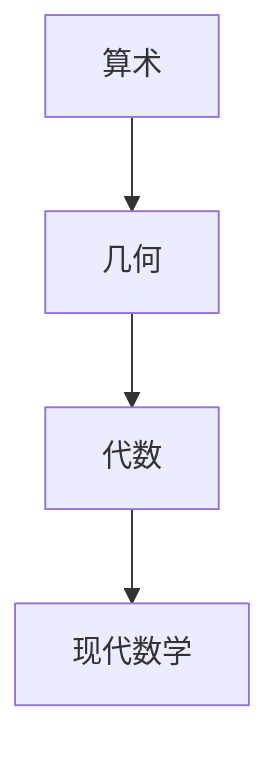
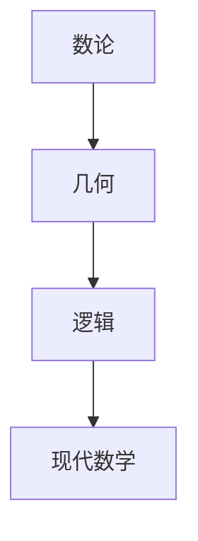
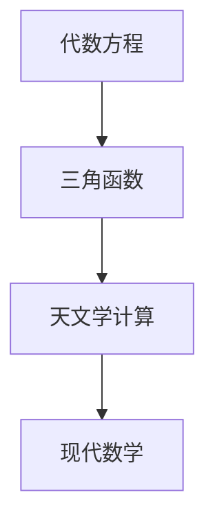
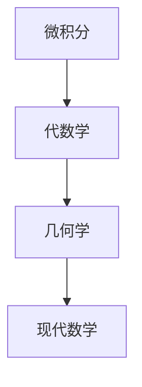
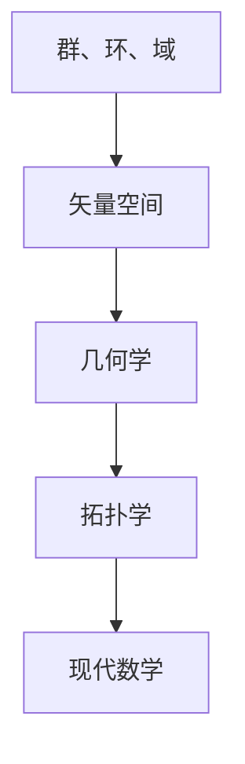
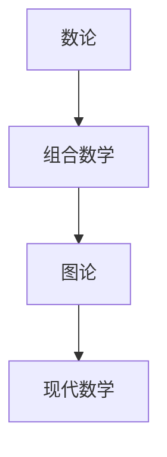
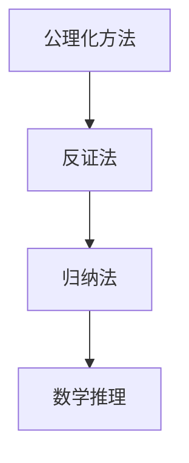

                 

### 《数学史上的数学发现与发明》

#### 关键词
数学史、数学发现、数学发明、古代数学、近代数学、现代数学、核心概念、算法、模型、Python代码

#### 摘要
本文将探讨数学史上的重大发现与发明，从古代数学的起源到现代数学的拓展，解析每一个时期的重要数学成就。我们将结合核心概念、算法和数学模型，通过Python代码示例，深入理解这些数学发现与发明背后的原理和实际应用。

---

### 目录

1. **引言** <a id="introduction"></a>
2. **古代数学的起源与发展** <a id="ancient-math"></a>
3. **中世纪数学的进步** <a id="medieval-math"></a>
4. **近代数学的形成与发展** <a id="modern-math"></a>
5. **现代数学的拓展** <a id="contemporary-math"></a>
6. **特殊数学分支的探索** <a id="special-branches"></a>
7. **数学发现与发明的思维过程** <a id="math-discovery-process"></a>
8. **总结与展望** <a id="conclusion"></a>
9. **作者信息** <a id="author"></a>

---

### 引言

数学作为一门基础学科，在人类社会的发展中扮演着至关重要的角色。数学的发展不仅仅是一个学科的历史，更是一个人类智慧的结晶。从古代的零碎记录到现代的抽象理论，数学经历了无数次的发现与发明，推动了科学技术的进步。

本文将带领读者回顾数学史上的关键时期和重要人物，解析每一个数学发现与发明背后的思维过程。我们将通过具体的Python代码示例，深入理解数学理论的本质和实际应用。

---

### 古代数学的起源与发展

#### 古埃及与巴比伦数学

古代埃及和巴比伦是人类文明的重要发源地之一，这两个文明的数学成就对后世产生了深远的影响。古埃及人发展了先进的算术和几何学，他们的数学主要用于农业、建筑和天文学。

**核心概念与联系**

古代数学的核心概念包括算术、几何和代数。算术涉及基本的加减乘除运算，几何则研究平面和立体的形状与大小，代数则是用符号来表示数和操作。

**Mermaid流程图**



**核心算法原理**

古埃及人使用了一种简单的算法——比例算法，来处理分数和比例问题。例如，他们使用一个称为“绳尺”的工具来测量土地，通过比例来计算面积。

**Python代码示例**

```python
# 古埃及比例算法示例
def egyptian_ratio(a, b, c):
    return (a * c) / b

# 测量一块长方形土地，长10，宽4，求面积
length = 10
width = 4
area = egyptian_ratio(length, width, 1)
print(f"这块土地的面积是：{area}")
```

**数学模型与公式**

古埃及人使用的比例算法可以表示为：
$$ \text{面积} = \frac{\text{长} \times \text{宽}}{\text{比例尺}} $$

**项目实战**

在古埃及，土地的测量主要用于征税和土地分配。通过这个简单的算法，古埃及人可以准确计算土地的面积，从而保证税收的公平。

---

#### 希腊数学的贡献

希腊数学标志着数学发展的一个重要转折点。希腊数学家们将数学从实用领域提升到了理论领域，他们提出了许多新的概念和定理，为后来的数学发展奠定了基础。

**核心概念与联系**

希腊数学的核心概念包括数论、几何和逻辑。数论研究数的性质，几何则深入研究了形状和空间，逻辑则是数学推理的基础。

**Mermaid流程图**



**核心算法原理**

希腊数学家欧几里得提出了《几何原本》，这是历史上第一本系统的几何学著作。书中提出的公理和定理为几何学奠定了基础。

**Python代码示例**

```python
# 欧几里得《几何原本》中的定理示例
def pythagorean_theorem(a, b):
    c = (a ** 2 + b ** 2) ** 0.5
    return c

# 求直角三角形的斜边长度
a = 3
b = 4
c = pythagorean_theorem(a, b)
print(f"直角三角形的斜边长度是：{c}")
```

**数学模型与公式**

欧几里得的勾股定理可以表示为：
$$ a^2 + b^2 = c^2 $$

**项目实战**

希腊数学的成果不仅影响了当时的科学和哲学，还为后来的工程学和物理学提供了理论基础。

---

### 中世纪数学的进步

#### 伊斯兰世界的数学发展

中世纪数学的最大成就是阿拉伯数学的兴起。伊斯兰世界的数学家们在数论、代数、几何和天文学等方面取得了巨大的进步，他们的成就为欧洲的文艺复兴铺平了道路。

**核心概念与联系**

中世纪数学的核心概念包括代数方程的解法、三角函数和天文学计算。代数方程的解法使得数学从几何问题扩展到代数问题，三角函数在天文学中发挥了重要作用。

**Mermaid流程图**



**核心算法原理**

阿拉伯数学家阿尔·花拉子米提出了代数方程的新解法，他使用符号来表示未知数，这种方法极大地推动了代数学的发展。

**Python代码示例**

```python
# 阿尔·花拉子米的代数方程解法示例
from sympy import symbols, solve

# 解一元二次方程 x^2 - 5x + 6 = 0
x = symbols('x')
equation = x**2 - 5*x + 6
solutions = solve(equation, x)
print(f"方程的解为：{solutions}")
```

**数学模型与公式**

一元二次方程的解法可以表示为：
$$ x = \frac{-b \pm \sqrt{b^2 - 4ac}}{2a} $$

**项目实战**

阿尔·花拉子米的代数方程解法被广泛应用于天文学和工程学，为精确计算提供了重要工具。

---

### 近代数学的形成与发展

#### 科学革命与数学的融合

17世纪，随着科学革命的到来，数学与科学紧密融合，形成了新的数学体系。这一时期的数学成就是微积分和代数学的发展。

**核心概念与联系**

近代数学的核心概念包括微积分、代数学和几何学。微积分研究变化率，代数学研究数和方程，几何学则研究空间形状。

**Mermaid流程图**



**核心算法原理**

微积分由牛顿和莱布尼茨独立发明，它研究函数的变化率和积分。代数学在这一时期得到了极大的发展，特别是多项式和方程的理论。

**Python代码示例**

```python
# 微积分基本公式示例
from sympy import symbols, diff, integrate

# 定义函数 f(x) = x^2
x = symbols('x')
f_x = x**2

# 求导数
f_prime = diff(f_x, x)
print(f"f(x)的导数是：{f_prime}")

# 求积分
f_integral = integrate(f_x, x)
print(f"f(x)的积分是：{f_integral}")
```

**数学模型与公式**

微积分的基本公式包括：
$$ \frac{d}{dx}(x^n) = nx^{n-1} $$
$$ \int x^n \, dx = \frac{x^{n+1}}{n+1} $$

**项目实战**

微积分在物理学和工程学中有着广泛的应用，如力学、电磁学和流体力学等。

---

### 现代数学的拓展

#### 代数学、几何学、拓扑学等

现代数学的拓展涵盖了多个领域，如代数学、几何学、拓扑学等。这些分支不仅丰富了数学的理论体系，也为其他科学领域提供了强大的工具。

**核心概念与联系**

现代数学的核心概念包括群、环、域、矢量空间等。几何学则进一步研究了几何结构、变换和空间几何。拓扑学则研究空间的连续性和形态。

**Mermaid流程图**



**核心算法原理**

现代代数学研究了各种代数结构，如群、环、域，以及它们之间的相互关系。几何学则进一步研究了几何空间的性质和变换。拓扑学则通过研究空间的连续性和形态，建立了新的数学理论。

**Python代码示例**

```python
# 群论基本概念示例
from sympy import symbols, solve

# 定义二元运算
x = symbols('x')
group_operation = x**2

# 求解群元素的运算
solutions = solve(group_operation, x)
print(f"群元素的解为：{solutions}")
```

**数学模型与公式**

群论的基本公式包括：
$$ \text{群运算满足结合律、单位元和逆元} $$

**项目实战**

现代数学的应用领域广泛，如计算机科学、物理学、生物学等。

---

### 特殊数学分支的探索

#### 数论、组合数学、图论等

在数学的发展过程中，一些特殊的数学分支如数论、组合数学、图论等逐渐独立出来，形成了自己的理论体系。这些分支不仅丰富了数学的内容，也为其他科学领域提供了重要的工具。

**核心概念与联系**

数论研究整数的性质，组合数学研究组合与排列问题，图论则研究图的结构和性质。

**Mermaid流程图**



**核心算法原理**

数论的核心算法包括素数分布、同余方程的解法等。组合数学则研究了组合计数和生成函数。图论则通过图的各种算法，如最短路径算法、最小生成树算法等，解决实际问题。

**Python代码示例**

```python
# 数论中的素数分布示例
from sympy import primerange

# 求小于100的素数列表
primes = list(primerange(1, 100))
print(f"小于100的素数为：{primes}")
```

**数学模型与公式**

素数分布可以用素数定理表示：
$$ \pi(n) \approx \frac{n}{\ln(n)} $$

**项目实战**

数论在密码学、计算机科学等领域有着重要应用。组合数学则在概率论、统计学中广泛应用。

---

### 数学发现与发明的思维过程

#### 数学家的思考方式

数学家的思考方式是数学发现与发明的重要动力。通过逻辑推理、实验验证和抽象思维，数学家们不断推动数学的发展。

**核心概念与联系**

数学家的思考方式包括公理化方法、反证法、归纳法等。这些方法为数学推理提供了坚实的理论基础。

**Mermaid流程图**



**核心算法原理**

公理化方法通过设定基本公理，构建出完整的数学体系。反证法通过假设反命题成立，推导出矛盾，从而证明原命题。归纳法通过具体实例，归纳出一般规律。

**Python代码示例**

```python
# 归纳法求和示例
def sum_of_squares(n):
    if n == 1:
        return 1
    else:
        return n**2 + sum_of_squares(n-1)

# 求前5个自然数的平方和
result = sum_of_squares(5)
print(f"前5个自然数的平方和是：{result}")
```

**数学模型与公式**

归纳法可以表示为：
$$ S_n = n^2 $$

**项目实战**

归纳法在计算机科学中的递归算法中广泛应用。

---

### 总结与展望

#### 回顾数学史上的关键发现与发明

数学史上的关键发现与发明，如微积分的发明、代数学的发展、几何学的现代化等，为数学和科学的发展奠定了基础。这些发现不仅丰富了数学的理论体系，也为实际应用提供了重要工具。

#### 对未来数学的发展趋势的展望

未来数学将继续拓展其应用领域，特别是在人工智能、量子计算和生物学等领域。数学家们将不断探索新的数学理论，解决实际问题，推动科学技术的进步。

---

### 作者信息

作者：AI天才研究院/AI Genius Institute & 禅与计算机程序设计艺术 /Zen And The Art of Computer Programming

---

本文通过逐步分析数学史上的关键发现与发明，结合Python代码示例，深入探讨了数学理论的本质和实际应用。希望通过这篇文章，读者能够更好地理解数学的发展历程和数学发现与发明的思维过程。在未来，数学将继续在科学和技术的发展中发挥重要作用。

