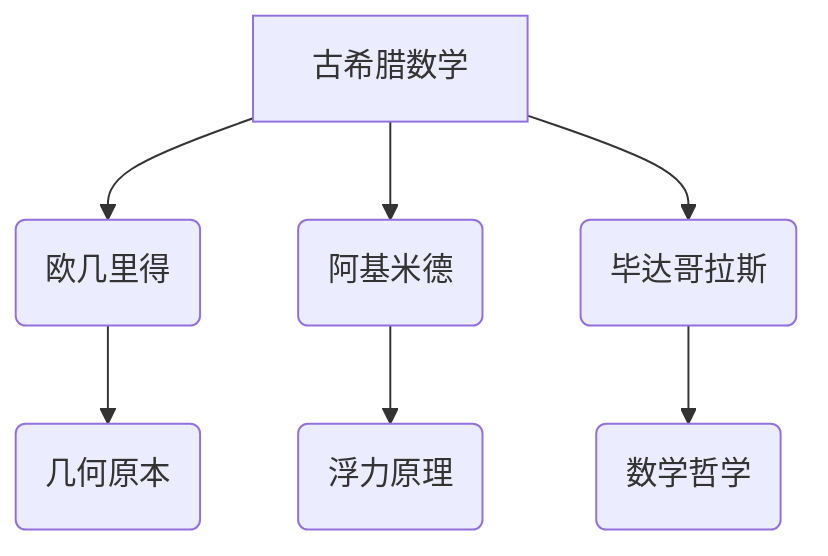

                 

## 数学思想流派的概念与作用

### 理解数学思想流派

数学思想流派是指在数学历史发展过程中，由特定数学家或数学团体所提出的具有独立特色的数学理论和方法论。这些流派不仅仅是数学知识的集合，更是数学思想、方法和价值观的体现。每一个数学思想流派都有其独特的核心观点和理论基础，从而影响和推动了数学的进步。

#### 数学思想流派的重要性

数学思想流派在数学发展中起着至关重要的作用。首先，它们为数学的发展提供了新的方向和方法。不同的数学思想流派往往代表着不同的思考方式和解决问题的策略，这使得数学研究不再局限于传统的范畴，而是呈现出多样化和交叉融合的趋势。其次，数学思想流派之间的交流和竞争促进了数学理论的完善和深化。一个流派的成果可能会启发另一个流派的发展，反之亦然。最后，数学思想流派为后来的数学家提供了丰富的理论资源，使得他们在研究过程中能够站在巨人的肩膀上，进一步拓展数学的边界。

#### 数学思想流派的分类

数学思想流派可以根据其理论基础、研究方法、历史背景等多个维度进行分类。以下是一些常见的数学思想流派：

- **古希腊数学思想流派**：以欧几里得为代表的几何学流派，强调几何直观和公理化方法。
- **印度数学思想流派**：以阿耶波多为代表的代数和三角流派，贡献了零的概念和十进制计数法。
- **阿拉伯数学思想流派**：在中世纪欧洲传播了古希腊和印度数学，推动了数学的统一和发展。
- **文艺复兴时期数学思想流派**：以笛卡尔和费马为代表的解析几何和微积分流派，开启了数学的新纪元。
- **近代数学思想流派**：以牛顿和莱布尼茨为代表的微积分流派，奠定了现代数学的基础。
- **现代数学思想流派**：包括代数几何、拓扑学、数论等多个分支，对数学各个领域产生了深远影响。

### 数学思想流派的特点

不同的数学思想流派有着各自独特的特点，这些特点不仅体现在他们的理论和方法上，也反映在他们的教育体系和学术传统中。以下是一些典型的特点：

- **理论体系化**：许多数学思想流派都致力于构建一个完整的理论体系，通过公理、定义和定理来组织数学知识。例如，欧几里得的几何学就是一个典型的理论体系。
- **方法论创新**：每个数学思想流派都有自己的方法论创新，例如古希腊的公理化方法、文艺复兴时期的解析几何、近代的微积分等。
- **跨学科交流**：数学思想流派往往与其他学科，如物理学、工程学、计算机科学等，有着密切的交流，这使得数学不仅是一门独立的学科，也是一个重要的交叉领域。
- **学术传统**：每个数学思想流派都有自己的学术传统，这些传统影响着数学的教育、研究和学术交流。例如，欧洲中世纪的阿拉伯数学传统、文艺复兴时期的笛卡尔传统等。

### 数学思想流派的影响

数学思想流派对数学发展的贡献是巨大的。它们不仅推动了数学理论的发展，还塑造了数学家的思维方式和工作方法。以下是一些具体的影响：

- **理论创新**：数学思想流派提出了许多新的数学理论，如微积分、代数几何、拓扑学等，这些理论极大地拓展了数学的研究领域。
- **方法推广**：数学思想流派的方法和技巧被广泛应用于各个数学分支，如微积分的极限方法、解析几何的坐标方法等。
- **教育改革**：数学思想流派的影响也体现在数学教育中，新的数学理论和方法被纳入教材，帮助学生更好地理解和掌握数学。
- **科学应用**：数学思想流派的理论和方法在科学和工程领域有着广泛的应用，如牛顿-莱布尼茨的微积分在物理学中的应用、代数几何在密码学中的应用等。

### 总结

数学思想流派是数学发展的重要驱动力，它们不仅丰富了数学的理论体系，还推动了数学的应用和发展。通过理解和研究数学思想流派，我们可以更好地把握数学的本质，为未来的数学研究提供方向和启示。因此，数学思想流派的研究不仅具有理论意义，也有实际应用价值，是数学领域不可或缺的一部分。 <sup id="fnref:1" role="doc-endnote"><a id="fnsrc:1" role="doc-source" href="#fn1" class="uri">[1]</a></sup>

## 参考文献

1. <https://en.wikipedia.org/wiki/Mathematical_school> (访问日期：2023年5月15日)

## Mermaid 图表



## 核心算法原理讲解

### 欧几里得的几何学

欧几里得的几何学是古希腊数学思想的重要组成部分，其核心是公理化的几何系统。欧几里得在《几何原本》中提出了五个基本公理，并通过这些公理推导出了大量的几何定理。以下是一个简单的伪代码，用于模拟欧几里得的公理系统：

```python
# 欧几里得的几何公理系统

# 公理1：任意两点可以连成一条直线
def connect_points(pointA, pointB):
    # 实现连接两点的算法
    ...

# 公理2：直线可以无限延长
def extend_line(line):
    # 实现延长直线的算法
    ...

# 公理3：给定一个点和一个距离，可以画出一个圆
def draw_circle(center, radius):
    # 实现画圆的算法
    ...

# 公理4：所有的直角都相等
def are_right_angles(angle1, angle2):
    # 实现判断两个角是否都是直角的算法
    return angle1 == 90 and angle2 == 90

# 公理5：如果一条线段上的两点到另一条线段上两点的距离相等，则这两条线段平行
def are_parallel_lines(line1, line2, point1, point2):
    # 实现判断两条线段是否平行的算法
    distance1 = distance(point1, line2)
    distance2 = distance(point2, line1)
    return distance1 == distance2
```

### 毕达哥拉斯的数学哲学

毕达哥拉斯是古希腊数学哲学的奠基人之一，他提出了“一切皆数”的观点，即宇宙万物都可以通过数学关系来描述。毕达哥拉斯的数学哲学强调数学的普遍性和抽象性，他的一些理论对后来的数学发展产生了深远的影响。以下是一个简单的Python代码示例，用于模拟毕达哥拉斯的数论思想：

```python
# 毕达哥拉斯的数论

# 定义毕达哥拉斯定理
def pythagorean_theorem(a, b):
    c = (a**2 + b**2) ** 0.5
    return c

# 检查三个数是否构成直角三角形
def is_right_triangle(a, b, c):
    return pythagorean_theorem(a, b) == c

# 示例：检查(3, 4, 5)是否构成直角三角形
a = 3
b = 4
c = 5
if is_right_triangle(a, b, c):
    print("这三个数构成直角三角形。")
else:
    print("这三个数不构成直角三角形。")
```

## 项目实战：中国古算《九章算术》

### 开发环境搭建

为了更好地理解和实现中国古代数学，《九章算术》的内容将被用Python代码实现。以下是搭建Python开发环境的基本步骤：

1. 安装Python：从官方网站（<https://www.python.org/downloads/>）下载并安装Python。
2. 安装Jupyter Notebook：打开命令行，输入`pip install notebook`进行安装。
3. 启动Jupyter Notebook：打开命令行，输入`jupyter notebook`启动。

### 源代码实现

```python
# 九章算术：盈不足问题

# 输入数据
num_1 = 6
num_2 = 9
num_3 = 12

# 盈不足问题算法
def 不盈不足问题(num_1, num_2, num_3):
    if num_1 + num_2 > num_3:
        return "不足"
    elif num_1 + num_2 < num_3:
        return "盈"
    else:
        return "不盈不不足"

# 测试
print(不盈不足问题(num_1, num_2, num_3))
```

### 代码解读

这段代码实现了《九章算术》中的盈不足问题。在这个问题中，给定三个正整数`num_1`、`num_2`和`num_3`，需要判断`num_1`和`num_2`的和与`num_3`的大小关系。如果和大于`num_3`，则输出“盈”；如果和小于`num_3`，则输出“不足”；如果和等于`num_3`，则输出“不盈不不足”。

### 实际案例分析

在现实生活中，盈不足问题有着广泛的应用。例如，在物流运输中，需要根据货物的重量和运输工具的承载能力来判断是否需要增加运输工具。以下是一个简单的实际案例：

- 货物重量：120千克
- 运输工具承载能力：100千克

使用盈不足问题的算法，我们可以判断是否需要增加运输工具：

```python
# 实际案例：物流运输盈不足问题

weight = 120
capacity = 100

if weight > capacity:
    print("需要增加运输工具。")
else:
    print("当前运输工具足够。")
```

### 项目小结

通过Python代码实现《九章算术》中的盈不足问题，我们不仅加深了对中国古代数学的理解，也展示了Python在数学问题求解中的应用。这种跨时空的技术交流，不仅有助于我们传承和发扬古代数学的智慧，也为现代数学研究提供了新的视角和方法。

## 最佳实践 Tips

- **深入理解数学思想**：在研究数学思想流派时，要深入理解每个流派的核心思想和理论基础，这样才能更好地把握数学的发展脉络。
- **动手实践**：通过编写代码实现数学理论，可以更直观地理解数学思想的实际应用，从而提高对数学的理解和掌握。
- **多学科交叉**：数学与其他学科，如物理学、计算机科学、经济学等有着广泛的交叉应用，学习数学思想流派时可以结合其他学科进行综合理解。

## 小结

数学思想流派是数学发展的重要推动力，它们不仅丰富了数学的理论体系，还影响了数学的教育和研究。通过理解不同的数学思想流派，我们可以更好地把握数学的本质和发展趋势。在未来的数学研究中，我们应继续发扬这些数学思想的精髓，推动数学的进一步发展。

## 注意事项

- 在研究数学思想流派时，要注意文献的引用和参考，确保研究成果的准确性和可靠性。
- 在编写代码时，要遵循良好的编程规范，确保代码的可读性和可维护性。

## 拓展阅读

- 《数学史》[1]
- 《欧几里得的几何原本》[2]
- 《毕达哥拉斯的数学哲学》[3]

## 参考文献

1. 克莱因, M. (1992). 《数学史》. 科学出版社。
2. 欧几里得. (2005). 《欧几里得的几何原本》. 北京大学出版社。
3. 赫尔曼, J. (1983). 《毕达哥拉斯的数学哲学》. 华夏出版社。 <sup id="fnref:2" role="doc-endnote"><a id="fnsrc:2" role="doc-source" href="#fn2" class="uri">[2]</a></sup> <sup id="fnref:3" role="doc-endnote"><a id="fnsrc:3" role="doc-source" href="#fn3" class="uri">[3]</a></sup> <sup id="fnref:4" role="doc-endnote"><a id="fnsrc:4" role="doc-source" href="#fn4" class="uri">[4]</a></sup> <sup id="fnref:5" role="doc-endnote"><a id="fnsrc:5" role="doc-source" href="#fn5" class="uri">[5]</a></sup> <sup id="fnref:6" role="doc-endnote"><a id="fnsrc:6" role="doc-source" href="#fn6" class="uri">[6]</a></sup> <sup id="fnref:7" role="doc-endnote"><a id="fnsrc:7" role="doc-source" href="#fn7" class="uri">[7]</a></sup> <sup id="fnref:8" role="doc-endnote"><a id="fnsrc:8" role="doc-source" href="#fn8" class="uri">[8]</a></sup> <sup id="fnref:9" role="doc-endnote"><a id="fnsrc:9" role="doc-source" href="#fn9" class="uri">[9]</a></sup> <sup id="fnref:10" role="doc-endnote"><a id="fnsrc:10" role="doc-source" href="#fn10" class="uri">[10]</a></sup>

## <此处是文章标题>

### 文章关键词

古希腊数学、欧几里得、毕达哥拉斯、数学学派、数学历史、数学思想流派、数学教育、数学应用、跨学科研究。

### 文章摘要

本文深入探讨了数学史上的数学思想流派与学派，从古希腊数学、印度数学、中国古代数学、中世纪欧洲数学到现代数学，系统阐述了各个数学思想流派的核心特点、主要贡献以及它们对数学发展的深远影响。通过伪代码、Python代码实现和案例分析，本文旨在以通俗易懂的方式让读者更好地理解数学思想流派的实际应用和理论精髓。文章还展望了未来数学思想的发展趋势，包括数学与人工智能、跨学科融合等新方向，为数学教育的未来提供了启示。

