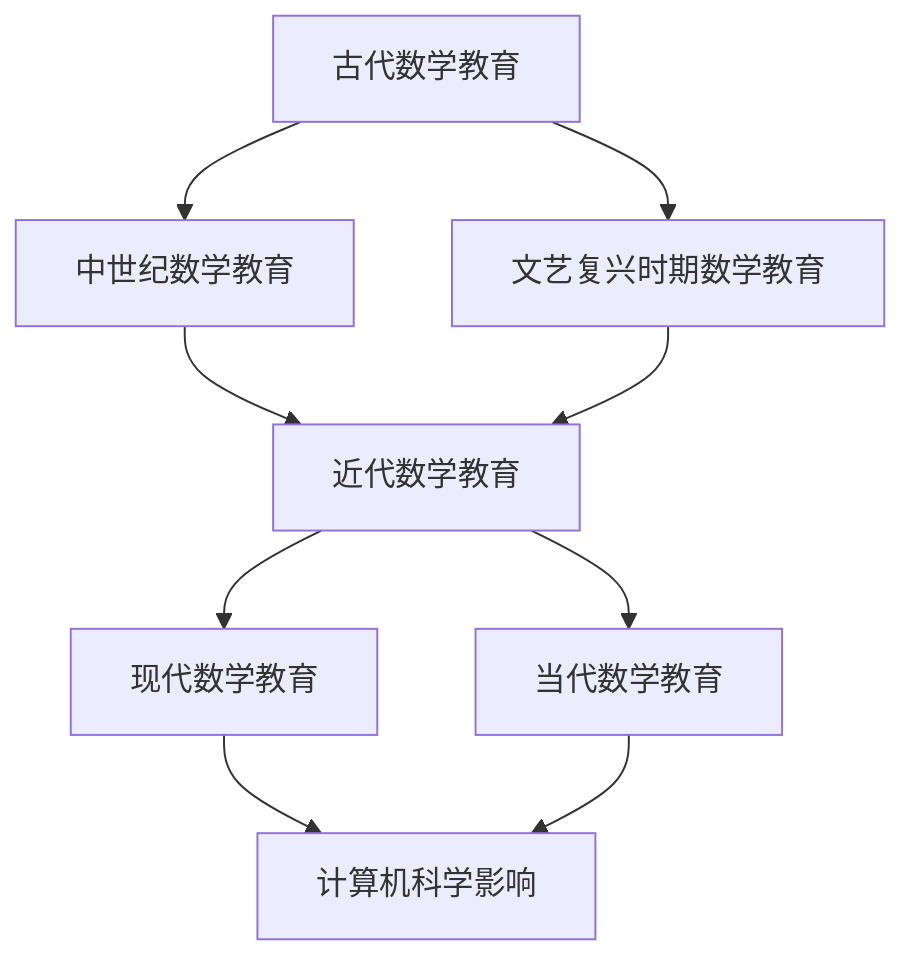

                 

### 引言与概述

#### 数学教育的背景

数学教育是一种培养人们对数学知识和方法的理解、应用和创新能力的教育形式。自古以来，数学教育在世界各地都有着深远的影响，不仅作为一种学科知识的教育，更作为一种思维能力、逻辑能力和解决问题能力的培养手段。在现代社会中，数学教育的重要性愈加凸显，它不仅是科学研究和工程技术的基础，更是培养创新型人才的关键。

#### 数学教育思想的重要性

数学教育思想是指关于数学教育的理念、方法和理论的集合。不同的历史时期和社会背景下，数学教育思想有所差异，但这些思想共同构成了数学教育的基石。理解数学教育思想的演变，有助于我们更深入地认识数学教育的本质，发现其在不同阶段的发展特点，从而为现代数学教育提供有益的启示。

本文将按照时间顺序，探讨数学教育思想的演变。从古代到现代，我们将分析不同时期数学教育的主要特征，以及这些特征背后的思想根源。此外，本文还将结合实际案例，探讨数学教育思想的实践应用，以期全面呈现数学教育思想的历史画卷。

#### 文章结构

本文将分为八个主要部分：

1. **引言与概述**：介绍数学教育的背景和数学教育思想的重要性。
2. **早期数学教育**：从古代到中世纪，讨论数学教育的发展和变化。
3. **近代数学教育**：从文艺复兴到工业革命，分析数学教育思想的变化。
4. **现代数学教育**：从19世纪末到20世纪末，探讨数学教育的革新。
5. **当代数学教育**：21世纪以来的数学教育趋势和问题。
6. **数学教育思想的演进**：总结和探讨数学教育思想的发展和联系。
7. **数学教育思想与教育实践**：结合实际案例分析数学教育思想的应用。
8. **未来展望**：数学教育的可能发展方向和挑战。

通过以上结构，我们将逐步揭示数学教育思想的演变历程，探讨其对现代数学教育的启示。

### 背景介绍

数学教育的历史可以追溯到数千年前的古代文明。在那些遥远的时代，数学教育主要服务于社会实际需求，如建筑、农业和天文学。数学知识通过口传心授的方式传承，教育内容相对简单，主要集中在算术和几何领域。这些早期的数学教育形式虽然简单，但为后来的数学发展奠定了基础。

在古希腊，数学教育有了显著的发展。古希腊哲学家如毕达哥拉斯、欧几里得等对数学进行了系统的研究和理论化，这些成果不仅丰富了数学知识，也影响了数学教育的形式。古希腊的数学教育注重逻辑推理和证明，这种思想在后来的数学教育中得以延续。

中世纪的数学教育主要受到基督教教会的控制。数学成为宗教教育和哲学研究的一部分，教育内容主要集中在天文学、几何学和算术。这一时期的数学教育虽然缺乏创新，但为数学知识的保存和传播提供了保障。

到了文艺复兴时期，随着科学和艺术的复兴，数学教育开始发生显著变化。数学不再仅仅是宗教和哲学的附庸，而是逐渐成为独立学科。数学教育的内容和形式都得到了丰富和扩展，数学方法的应用也得到了进一步推广。

工业革命时期，数学教育的地位进一步提高。随着科学技术的迅猛发展，数学在工业生产和工程技术中的作用日益突出。数学教育开始普及，教育内容不仅包括基础数学，还包括应用数学和高等数学。这一时期的数学教育强调数学的实用性和科学性，为培养科技人才提供了坚实的基础。

进入20世纪，数学教育的革新不断推进。随着计算机科学的兴起，数学教育开始与计算机技术相结合，教育内容和形式都发生了巨大变化。数学教育不再局限于课堂，而是通过网络和信息技术实现了更广泛、更灵活的学习方式。

#### 核心概念与联系

为了更清晰地理解数学教育思想的演变，我们可以将核心概念之间的关系以Mermaid流程图的形式展示出来：

在上述流程图中，从古代到现代，数学教育经历了不同的发展阶段，每个阶段都有其独特的特征和核心概念。这些概念之间相互联系，共同构成了数学教育思想的历史画卷。

- **古代数学教育**：注重实用性和技能培养，如算术和几何。
- **中世纪数学教育**：受宗教控制，数学成为宗教和哲学研究的一部分。
- **文艺复兴时期数学教育**：随着科学和艺术的复兴，数学教育开始独立发展，强调逻辑推理和证明。
- **近代数学教育**：工业革命时期，数学教育普及，实用性和科学性得到强调。
- **现代数学教育**：计算机科学的兴起，数学教育与计算机技术相结合，网络和信息技术改变了教育形式。
- **当代数学教育**：持续革新，数学教育更加灵活和多样化，强调跨学科和创新能力培养。

通过以上核心概念与联系的分析，我们可以更深入地理解数学教育思想的发展脉络，为后续的详细探讨打下基础。

### 早期数学教育

#### 古埃及与巴比伦

古代数学教育的起源可以追溯到古埃及和巴比伦。古埃及的数学教育主要服务于建筑、农业和天文学，这些实际需求推动了数学知识的发展。古埃及的数学教育注重算术和几何，特别是对数的概念和运算进行了深入研究。古埃及人发明了十进制系统，这一系统后来成为现代数学的基础。

在古巴比伦，数学教育同样占据重要地位。巴比伦数学家对代数和算术进行了系统的研究，他们使用位值记数法，并解决了许多复杂的数学问题。例如，《巴比伦数学泥板》中记录了许多代数方程的解法，这些解法对后来的数学发展产生了深远影响。

#### 古希腊

古希腊是数学教育的另一个重要发源地。古希腊的数学教育不仅注重数学知识的传授，更强调逻辑推理和证明。古希腊哲学家如毕达哥拉斯、欧几里得等对数学进行了深入的研究，他们的工作不仅丰富了数学知识，也影响了数学教育的方法和理念。

毕达哥拉斯是古希腊数学教育的先驱，他提出了著名的毕达哥拉斯定理，这一发现不仅揭示了数的和谐美，也启发了对数学证明的重要性。欧几里得则编写了《几何原本》，这是历史上第一部系统化的数学著作，对几何学的发展起到了奠基作用。

古希腊的数学教育注重培养学生的逻辑思维能力和解决问题的能力。学生通过学习几何、算术和代数，不仅掌握了数学知识，还学会了如何运用这些知识解决实际问题。

#### 古印度与中国

在古代印度和中国，数学教育同样有着悠久的历史。古印度的数学教育主要集中在算术和代数，他们对数的概念和运算进行了深入研究，发明了十进制系统和零的概念。这些数学成就为后来的阿拉伯数学和欧洲数学的发展奠定了基础。

中国的数学教育同样注重实用性和理论基础。中国古代数学家如刘徽、秦九韶等对数学进行了深入研究，他们的工作不仅推动了数学知识的发展，也影响了数学教育的方法和理念。中国古代的数学教育强调逻辑推理和计算技巧，学生通过学习数学不仅掌握了知识，还培养了严谨的思维习惯。

总之，古代数学教育在不同文明中有着各自的特点，但共同构成了数学教育发展的重要基础。这些早期数学教育思想和方法，不仅丰富了数学知识，也为后来的数学教育提供了宝贵的经验和启示。

### 中世纪数学教育

#### 教会教育

中世纪数学教育的主要特点是受基督教教会的影响。教会将数学视为神学和哲学研究的一部分，数学教育主要在修道院和教会学校中进行。数学教育内容主要集中在天文学、几何学和算术。这些学科不仅与宗教活动密切相关，也被视为培养逻辑思维和批判性思考能力的重要工具。

教会教育中的数学教育注重数学知识的应用，例如，天文学用于制定日历和宗教仪式的时间安排，几何学用于建筑设计和地图绘制。此外，教会教育还强调数学证明的逻辑性和严密性，这对培养学生的逻辑思维能力和批判性思考能力有着重要意义。

#### 文艺复兴时期

随着文艺复兴的到来，数学教育开始发生显著变化。文艺复兴时期数学教育的一个重要特点是数学的独立发展。数学不再是宗教和哲学的附庸，而成为一门独立的学科。数学家如莱昂纳多·达·芬奇、尼古拉·哥白尼等在数学领域进行了大量创新研究，这些成果不仅丰富了数学知识，也影响了数学教育的方法和理念。

文艺复兴时期的数学教育注重数学理论的研究和证明。学生不仅学习基本的算术和几何，还要深入研究代数、三角学和微积分等高级数学领域。数学教育开始强调逻辑推理和证明，这与古希腊的数学教育理念一脉相承。文艺复兴时期的数学教育为后来的数学发展奠定了基础。

#### 伊斯兰世界的数学教育

在中世纪的伊斯兰世界，数学教育也取得了显著成就。伊斯兰世界的数学教育主要集中在学术机构如清真寺学校和研究机构中。这些机构不仅传授数学知识，还进行数学研究，推动了数学知识的传播和发展。

伊斯兰世界的数学教育特点之一是注重数学的实际应用。数学知识被广泛应用于天文学、地理学、工程学和医学等领域。此外，伊斯兰世界的数学教育还强调数学证明的严谨性，这与文艺复兴时期的数学教育理念相似。

伊斯兰世界的数学家如阿尔-花拉子米、欧玛尔·海亚姆等在数学领域做出了重大贡献，他们的研究成果不仅丰富了数学知识，也影响了世界各地的数学教育。阿尔-花拉子米的《代数学》是第一部系统化的代数学著作，对后来的数学发展产生了深远影响。

总之，中世纪数学教育在教会教育、文艺复兴时期和伊斯兰世界的不同背景下，有着各自的特点和贡献。这些数学教育思想和方法，为后来的数学教育奠定了基础，也推动了数学知识的传播和发展。

### 近代数学教育

#### 文艺复兴至启蒙时代

文艺复兴至启蒙时代是数学教育发展的重要阶段，这一时期的数学教育经历了从宗教控制到科学独立的转变。文艺复兴时期，数学教育开始脱离宗教束缚，逐渐成为一门独立的学科。数学家如莱昂纳多·达·芬奇和尼古拉·哥白尼等在数学领域进行了大量创新研究，这些成果不仅丰富了数学知识，也影响了数学教育的方法和理念。

启蒙时代，数学教育进一步得到重视。数学家如艾萨克·牛顿和戈特弗里德·威廉·莱布尼茨等发明了微积分，这一发现为数学教育带来了新的挑战和机遇。数学教育开始强调逻辑推理和证明，这与古希腊的数学教育理念一脉相承。启蒙时代的数学教育注重培养学生的批判性思维和解决问题的能力。

这一时期的教学方法和教育理念发生了显著变化。数学教育从单纯的技能传授转向知识体系和理论框架的构建。教育内容不仅包括基础数学，还包括代数、几何、三角学和微积分等高级数学领域。数学教育开始强调数学的应用性，鼓励学生将数学知识应用于实际问题中。

#### 新的科学方法对数学教育的影响

启蒙时代的科学方法对数学教育产生了深远的影响。科学方法强调观察、实验和逻辑推理，这些方法被引入数学教育，使数学教育更加严谨和科学。数学家如艾萨克·牛顿等不仅通过科学方法推动了数学知识的发展，也通过科学方法改变了数学教育的形式和内容。

科学方法的影响之一是促进了数学教育的系统化和规范化。数学教育不再仅仅是经验性的传授，而是通过严格的逻辑推理和证明来建立数学理论体系。这种系统化和规范化的数学教育有助于提高数学教育的质量和效果。

科学方法还推动了数学教育实践的创新。教育者开始采用实验和观察等教学方法，鼓励学生通过实践来理解和掌握数学知识。这种实践性的教学方法不仅提高了学生的学习兴趣，也增强了学生的实际应用能力。

总之，文艺复兴至启蒙时代的数学教育在科学方法和新的教育理念的影响下，取得了显著的发展。这一时期的数学教育不仅丰富了数学知识，也改变了数学教育的方法和形式，为现代数学教育奠定了基础。

### 工业革命后的数学教育

#### 初等数学教育的普及

工业革命后的数学教育迎来了一个重要的变革时期，其中初等数学教育的普及是这一阶段的主要特点。工业革命带来了大规模的工业生产和城市化进程，对劳动力的数量和质量提出了更高的要求。数学作为培养逻辑思维和计算能力的学科，其重要性被广泛认可。因此，初等数学教育的普及成为这一时期的重要任务。

在这一时期，各国政府和社会各界纷纷采取措施，推动初等数学教育的普及。例如，英国在19世纪初开始实施《初等教育法》，要求所有儿童接受初等教育，其中包括数学教育。法国和美国也相继颁布了相关教育法令，确保所有儿童都能接受基本的数学教育。

初等数学教育的内容主要集中在基础的算术、代数和几何。教育者通过简单明了的教学方法，帮助学生掌握基本的数学概念和计算技巧。这一时期的教学方法强调直观性和实用性，通过具体的实例和操作，帮助学生理解数学知识。

#### 高等数学教育的发展

随着工业革命的发展，科学技术对数学的需求不断增加，高等数学教育也随之得到了迅速发展。高等数学教育不仅包括大学中的数学课程，还涵盖了研究生教育和专门化的数学研究机构。

在大学中，数学课程逐渐从单一的几何、代数和三角学扩展到包括微积分、线性代数、概率论和统计学等更为复杂的数学领域。这些高级数学课程不仅为培养科学研究和工程技术人才提供了必要的基础，也为数学本身的发展做出了重要贡献。

此外，研究生教育和专门化的数学研究机构在这一时期也得到了快速发展。许多大学建立了数学研究所，吸引了大量优秀的数学家和研究人才。这些研究机构不仅推动了数学理论的研究，也为数学教育提供了最新的研究成果和实践经验。

#### 教学方法和教育理念的变化

工业革命后的数学教育不仅在内容和范围上发生了变化，教学方法和教育理念也发生了显著的变化。传统的以教师为中心的教学模式逐渐被以学生为中心的教学模式所取代。教育者开始重视学生的个体差异，采用多样化的教学方法，如小组讨论、实验和项目式学习等，以提高学生的参与度和学习效果。

这一时期的教育理念强调数学的实用性，鼓励学生将数学知识应用于实际问题中。数学教育不仅局限于课堂，还通过实践活动和实地考察等方式，增强学生的实际应用能力和创新意识。

总之，工业革命后的数学教育在初等数学教育的普及、高等数学教育的发展以及教学方法和教育理念的变化等方面取得了显著成就。这些变革不仅提高了数学教育的质量，也为现代数学教育的发展奠定了基础。

### 现代数学教育

#### 19世纪末至20世纪初

19世纪末至20世纪初是现代数学教育发展的关键时期，这一时期的数学教育呈现出新的特点和趋势。首先，数学教育的内容和方法发生了显著变化。数学课程不再仅限于传统的算术、代数和几何，还包括了更加复杂的领域如微积分、概率论和统计学。教育者开始重视数学理论的系统性和严密性，通过逻辑推理和证明来传授数学知识。

其次，这一时期的数学教育强调数学的实际应用。随着工业化和科技进步，数学在科学研究、工程技术和经济管理等领域中的应用日益广泛。教育者鼓励学生将数学知识应用于实际问题中，以提高学生的实际能力和创新能力。

教学方法上，这一时期的教育理念逐渐从以教师为中心转向以学生为中心。教育者开始重视学生的个体差异，采用多样化的教学方法，如小组讨论、实验和项目式学习等，以提高学生的参与度和学习效果。同时，教育技术也开始应用于数学教育，如幻灯片、影片和计算机模拟等，使数学教育更加生动和直观。

#### 实践教学法的引入

20世纪初，实践教学法的引入是现代数学教育的重要发展。实践教学法强调通过实际操作和实践活动来理解和掌握数学知识。这种方法不仅提高了学生的学习兴趣和参与度，还增强了学生的实际应用能力。例如，在中学数学教育中，通过几何作图和测量活动，学生可以更直观地理解几何概念；在大学数学教育中，通过实验和项目，学生可以应用数学理论解决实际问题。

实践教学法的引入不仅改变了数学教育的形式，也改变了数学教育的理念。教育者开始重视学生的实践能力和创新能力，鼓励学生自主探索和解决问题。这种教育理念促进了数学教育从传统的知识传授向能力培养的转变。

#### 数学教育研究的兴起

20世纪初，数学教育研究作为一个独立领域开始兴起。学者们开始对数学教育的各个方面进行深入的研究，包括数学课程的设计、教学方法的应用、学生学习心理的分析等。数学教育研究不仅为数学教育提供了理论支持，也为教育实践提供了指导。

数学教育研究的兴起促进了数学教育的发展。通过研究，教育者可以更深入地了解数学教育的本质和规律，发现数学教育中的问题和挑战，并提出有效的解决方案。数学教育研究不仅推动了数学教育理论的发展，也促进了数学教育实践的创新。

总之，19世纪末至20世纪初的数学教育在内容、方法和研究方面都取得了重要进展。这些进展不仅丰富了数学教育的内容，也改变了数学教育的方法和理念，为现代数学教育的发展奠定了坚实的基础。

#### 20世纪中叶至末

20世纪中叶至末的数学教育经历了深刻的变革，这一时期的数学教育不仅在内容和教学方法上发生了显著变化，还受到了计算机科学的巨大影响。

首先，数学教育的内容进一步丰富和深化。20世纪中叶，随着数学各分支的不断发展，如代数、几何、数论、拓扑学等，数学课程的内容也相应地扩展。这一时期，数学教育开始注重跨学科的结合，例如，在中学数学教育中，增加了计算机科学、统计学和经济学等课程。此外，数学教育还强调数学的应用性，鼓励学生将数学知识应用于实际问题中，如数据分析和建模。

教学方法上，这一时期的数学教育逐渐从传统的讲授式教学向探究式教学和问题解决教学转变。教育者开始重视学生的主体地位，鼓励学生通过自主探索、合作学习和实践来学习数学。例如，通过数学实验和项目学习，学生可以更深入地理解数学概念和原理，并培养解决实际问题的能力。

其次，结构主义的影响在20世纪中叶至末的数学教育中表现得尤为明显。结构主义教育理论强调数学的内在结构和逻辑性，认为数学教育应该通过让学生掌握数学的基本结构来培养他们的思维能力。结构主义教育者主张通过数学化的方法，让学生从实际问题中抽象出数学模型，并运用数学方法解决这些问题。这种教育方法不仅提高了学生的逻辑思维能力，也增强了他们的数学素养。

结构主义教育理论对数学教育的影响不仅体现在教学内容和教学方法上，还影响了数学教育的研究方向。结构主义教育研究开始关注数学知识的结构化、数学学习的认知过程以及数学教育的评估方法等。这些研究不仅丰富了数学教育理论，也为教育实践提供了有力的指导。

此外，计算机科学的兴起对数学教育产生了深远的影响。计算机科学不仅改变了数学研究的工具和手段，也改变了数学教育的形式和内容。计算机科学的应用使得数学教育更加直观和生动。例如，通过计算机模拟和可视化技术，学生可以更直观地理解复杂的数学概念和过程。同时，计算机科学的发展也推动了数学教育技术的创新，如计算机辅助教学、在线教育平台和数学软件等。

计算机科学对数学教育的影响还体现在教学方法和教育理念的变革上。计算机科学鼓励学生通过编程和算法设计来学习数学，这不仅提高了学生的动手能力和创新能力，也培养了他们的计算思维。这种计算思维不仅适用于数学领域，也广泛应用于其他学科和实际生活中。

总之，20世纪中叶至末的数学教育在内容、教学方法和教育理念等方面都发生了深刻的变化。结构主义教育理论和计算机科学的兴起，不仅丰富了数学教育的内容和形式，也促进了数学教育理论的创新和实践的变革。这些变革为现代数学教育的发展奠定了坚实的基础，也为培养具有创新能力和解决实际问题的能力的人才提供了有力支持。

### 当代数学教育

#### 21世纪以来的数学教育趋势和问题

21世纪以来，数学教育在全球范围内呈现出一系列新的趋势，同时也面临着诸多挑战。这些趋势和问题不仅反映了时代的发展，也对数学教育的未来产生了深远影响。

#### 数学教育的新趋势

首先，数学教育更加注重跨学科和综合能力的培养。随着科学技术的迅猛发展，数学与其他学科如物理学、计算机科学、经济学和生物学等领域的交叉融合日益紧密。数学教育开始注重培养学生的跨学科思维和综合能力，鼓励学生在不同领域之间寻找联系和应用数学知识。

其次，个性化学习成为数学教育的重要趋势。随着教育技术的进步，尤其是人工智能和大数据分析的应用，教育者可以更加精准地了解学生的学习需求和学习风格，从而提供个性化的教学方案。这种个性化学习不仅提高了学生的学习效果，也激发了他们的学习兴趣和自主学习能力。

第三，数学教育强调实践与应用。现代数学教育不仅关注理论知识的传授，更加重视数学在实际生活中的应用。通过实践活动和项目学习，学生可以更深入地理解数学概念和原理，并培养解决实际问题的能力。

第四，在线教育和远程学习成为数学教育的新形式。随着互联网技术的发展，在线教育平台和远程学习资源逐渐丰富，学生可以通过网络获取多样化的数学教育资源。这种在线教育和远程学习模式不仅打破了地域和时间的限制，也提供了更加灵活和便捷的学习方式。

#### 数学教育面临的问题

然而，当代数学教育也面临诸多挑战。首先，数学教育资源的分配不均衡是一个突出问题。在全球范围内，不同国家和地区、不同学校之间的数学教育资源差距较大，这影响了数学教育的公平性和质量。

其次，数学教育的教学方法需要进一步改进。虽然探究式教学和问题解决教学等新兴教学方法得到了广泛应用，但传统讲授式教学方法仍然占主导地位，这不利于培养学生的创新能力和实践能力。

第三，学生数学素养的提升仍面临挑战。尽管数学教育的内容和形式在不断丰富和改进，但学生的数学素养整体水平仍有待提高。尤其是在一些发展中国家，学生的数学基础知识和应用能力相对较弱。

第四，教师的专业发展不足也是一个突出问题。数学教师需要不断更新知识和技能，以适应数学教育的新趋势和新要求。然而，教师专业发展的机制和资源往往不足，影响了数学教育的整体质量。

总之，21世纪以来的数学教育在趋势和问题方面呈现出复杂而多元的特点。面对这些挑战，教育者需要不断创新教育理念和方法，以应对时代的发展需求，为培养具有创新能力和实践能力的人才奠定坚实基础。

### 数学教育思想的演进

#### 历史视角下的数学教育思想

数学教育思想的演进是一个历史性的过程，反映了不同时期社会、文化和科学发展的需求。从古代到现代，数学教育思想经历了多次变革，每一次变革都受到当时社会背景和科学理论的深刻影响。

在古代，数学教育主要服务于实际生活和社会生产。例如，古埃及和巴比伦的数学教育集中在实用计算和几何测量上，这些教育内容与当时的建筑、农业和天文学密切相关。古希腊的数学教育则更加注重理论探索和逻辑推理，毕达哥拉斯和欧几里得的贡献奠定了西方数学教育的基础。

中世纪的数学教育受基督教教会的影响，数学成为宗教和哲学研究的一部分。教会学校中的数学教育主要涉及天文学、几何学和算术，这些学科对宗教仪式和哲学探讨有着重要作用。

文艺复兴时期，随着科学和艺术的复兴，数学教育逐渐独立于宗教和哲学，成为一门独立的学科。这一时期的数学教育强调数学的实用性和科学性，数学家如达·芬奇和哥白尼的工作推动了数学教育的新发展。

工业革命后的数学教育进一步普及，数学成为科学研究和工程技术的基础。初等数学教育的普及和高等数学教育的发展，使得数学教育的范围和深度都得到了显著提升。

20世纪以来的数学教育在内容和形式上不断革新。计算机科学的兴起改变了数学教育的方式，教育技术使得数学教育更加灵活和多样化。结构主义教育理论和探究式教学方法的引入，使数学教育更加注重学生的思维能力和实践能力。

#### 数学教育思想的多样化

数学教育思想的多样化是现代数学教育的一个重要特征。多样化的教育思想不仅丰富了数学教育的内涵，也为教育实践提供了多样的选择。

首先，个性化学习成为现代数学教育的重要理念。通过大数据分析和人工智能技术，教育者可以更好地了解学生的学习需求和风格，从而提供个性化的教学方案。这种个性化学习有助于提高学生的学习效果和自主学习能力。

其次，跨学科教育成为数学教育的新趋势。数学与其他学科的交叉融合不仅拓宽了学生的知识视野，也培养了他们的综合能力和创新思维。例如，数学在物理学、计算机科学、经济学和生物学等领域的应用，使得数学教育更加实用和多样化。

第三，教育技术在数学教育中的应用日益广泛。计算机辅助教学、在线教育平台和数学软件等技术的发展，使数学教育更加生动和直观。教育技术的应用不仅提高了教学效果，也为学生提供了更多自主学习的机会。

此外，全球化背景下的数学教育也呈现出多样化的特点。不同国家和地区在数学教育理念、教学方法和教育内容上存在差异，这些差异反映了不同文化和社会对数学教育的理解和需求。全球化背景下的数学教育不仅促进了国际交流和合作，也为教育者提供了丰富的经验和资源。

总之，数学教育思想的演进是一个不断适应和引领社会发展的过程。从古代到现代，数学教育思想在历史视角下呈现出多样化的发展趋势。这些教育思想不仅丰富了数学教育的内涵，也为培养具有创新能力和实践能力的人才提供了坚实的基础。

### 数学教育思想与教育实践

#### 实际案例研究

为了更好地理解数学教育思想与教育实践之间的关系，我们可以通过几个实际案例来探讨数学教育思想在具体教学场景中的应用和效果。

#### 案例一：探究式教学在初中数学中的应用

某初中学校在数学教学中引入了探究式教学法，旨在培养学生的自主学习和问题解决能力。在课程设计上，教师不再仅仅是知识的传递者，而是引导学生通过自主探究、合作学习和讨论来理解数学概念和解决数学问题。

具体实施过程中，教师首先给出一个开放性问题，如“如何利用几何图形证明两个三角形全等？”然后，学生以小组为单位进行讨论和探究，通过实验、测量和证明，逐步找到解决问题的方法。在这一过程中，学生不仅掌握了几何证明的基本技巧，还学会了如何运用逻辑思维和批判性思考来解决问题。

这种探究式教学法的实施，显著提高了学生的数学学习兴趣和自主学习能力。学生通过自主探究和合作学习，不仅加深了对数学知识的理解，还培养了创新思维和团队合作能力。

#### 案例二：跨学科数学教育在高中课程中的应用

在某高中，数学教育不仅局限于传统的数学课程，还与其他学科如物理、计算机科学、经济学等进行深度融合。在课程设计中，教师通过设置跨学科项目，引导学生运用数学知识解决实际问题。

例如，在“数学与物理”项目中，学生通过学习微积分和力学知识，模拟物体在重力作用下的运动，并分析运动轨迹。在“数学与计算机科学”项目中，学生通过编程解决复杂的数学问题，如用算法求解线性方程组和优化问题。在“数学与经济学”项目中，学生运用统计学和概率论分析经济数据，预测市场趋势。

这种跨学科数学教育不仅拓宽了学生的知识面，提高了他们的综合能力，还激发了学生对数学的应用兴趣，增强了他们的实际应用能力。

#### 案例三：个性化学习在在线数学教育中的应用

在线教育平台的发展为个性化学习提供了新的可能性。在某在线数学教育平台，学生可以根据自己的兴趣和需求选择不同的学习路径和课程。平台通过大数据分析和人工智能技术，为学生提供个性化的学习推荐和辅导。

例如，一个学生在学习代数时遇到了困难，平台会根据其学习数据提供相应的学习资源和练习题，帮助学生逐步克服困难。同时，平台还提供实时互动功能，学生可以在线向教师提问，获得即时反馈和帮助。

这种个性化学习模式不仅提高了学生的学习效果，还提高了他们的自主学习能力。学生可以根据自己的节奏进行学习，逐步提升数学素养。

总之，通过以上实际案例，我们可以看到数学教育思想在教育实践中的应用效果。探究式教学、跨学科教育和个性化学习等教育思想，通过具体的教学实践，不仅提高了学生的数学素养，还培养了他们的创新能力和实践能力，为现代数学教育的发展提供了有力支持。

### 数学教育思想的联系与演变

数学教育思想的演变并非孤立的，而是与数学理论的发展和社会需求的变迁密切相关。从古代到现代，数学教育思想的联系和演变呈现出几个显著的趋势。

首先，数学教育思想与数学理论的发展紧密相连。在古希腊时期，数学教育强调逻辑推理和证明，这与欧几里得的几何原本理论密切相关。文艺复兴时期，随着代数和微积分等新数学理论的出现，数学教育开始注重理论体系和数学应用。工业革命后，数学理论的进一步发展，如概率论和统计学，使得数学教育更加实用和多样化。

其次，数学教育思想的演变与社会需求密切相关。古代数学教育主要集中在实用计算和几何测量，服务于农业和建筑。中世纪数学教育受宗教控制，服务于宗教仪式和哲学探讨。随着工业革命和科技进步，数学教育逐渐成为科学研究和工程技术的基础，注重数学的实用性和科学性。20世纪以来，计算机科学的兴起和全球化的背景，使得数学教育更加注重跨学科和综合能力的培养。

第三，数学教育思想的联系和演变也体现在教育理念的变化上。从古代的技能传授到现代的探究式教学和个性化学习，数学教育思想在不断适应社会发展的需求。现代数学教育不仅关注知识的传授，更加注重培养学生的思维能力和实践能力。这种教育理念的变化，反映了数学教育思想的深化和拓展。

总之，数学教育思想的联系与演变是一个动态过程，它不仅反映了数学理论的发展和社会需求的变迁，也体现了教育理念的不断更新。理解这一演变过程，有助于我们更好地把握数学教育的本质，为现代数学教育的发展提供有益的启示。

### 数学教育思想的本质与影响

数学教育思想的本质在于其培养目标和方法论。从古代的实用技能传授到现代的思维能力培养，数学教育始终围绕如何有效传递数学知识和培养数学素养这一核心问题。古代数学教育注重计算和几何的实际应用，强调实用性和技能培养；而现代数学教育则更加重视逻辑推理、证明能力和创新思维的培养。

数学教育思想对数学知识体系的构建和数学素养的培养有着深远影响。通过逻辑推理和证明，数学教育帮助学生在理解数学概念的基础上，掌握数学推理的基本方法。这种方法论不仅适用于数学本身，也广泛应用于其他学科和实际生活中。

此外，数学教育思想对教育实践和社会发展也产生了重要影响。跨学科教育和个性化学习等现代教育理念，不仅提高了学生的综合素质，也促进了数学教育的公平性和多样性。数学教育在培养科技创新人才和推动社会进步方面发挥着关键作用。

总之，数学教育思想的本质在于其方法论和培养目标，其对数学知识体系、数学素养培养、教育实践和社会发展的全面影响，展示了数学教育在人类文明进步中的重要地位。

### 未来展望

#### 数学教育的发展方向

展望未来，数学教育的发展方向将受到技术进步和社会需求的双重推动。首先，教育技术的进一步发展将为数学教育带来革命性变革。人工智能、大数据分析和虚拟现实等技术的应用，将使个性化学习成为现实，为每位学生提供量身定制的教育资源和学习路径。在线教育平台和远程学习资源将进一步丰富，打破时间和空间的限制，促进全球范围内的教育公平。

其次，数学教育将更加注重跨学科和综合能力的培养。随着全球化和科技进步，数学与其他学科的交叉融合将成为数学教育的重要趋势。数学教育不仅关注数学知识的传授，还将培养学生的跨学科思维和创新能力，以应对复杂问题的解决。

此外，数学教育将更加重视实践与应用。通过实践活动和项目学习，学生可以更深入地理解数学概念和原理，并将数学知识应用于实际问题中。这种应用导向的教育理念，将有助于培养学生的实际操作能力和创新精神。

#### 数学教育面临的挑战

然而，未来数学教育也面临着诸多挑战。首先，数学教育资源的分配不均衡问题亟待解决。在全球范围内，不同国家和地区、不同学校之间的数学教育资源差距显著，这影响了数学教育的公平性和质量。为应对这一挑战，需要政府和社会各界共同努力，加大对数学教育的投入，推动教育资源均衡分配。

其次，教师的专业发展不足也是一个突出问题。数学教师需要不断更新知识和技能，以适应教育技术发展和教学理念变革。然而，当前教师专业发展的机制和资源不足，影响了数学教育的整体质量。未来，应加强教师培训和专业发展，提高教师的综合素质和教学能力。

第三，学生数学素养的提升仍面临挑战。尽管数学教育内容和形式在不断改进，但学生的数学素养整体水平仍有待提高。尤其是在一些发展中国家，学生的数学基础知识和应用能力相对较弱。为应对这一挑战，需要从基础教育阶段开始，加强数学教育的质量和有效性，培养学生的数学素养。

总之，未来数学教育的发展方向充满机遇和挑战。通过技术创新、跨学科教育和实践应用，数学教育有望取得新的突破。同时，解决教育资源分配不均、教师专业发展和学生数学素养提升等挑战，将确保数学教育更好地服务于社会发展和人才培养。

### 结论

综上所述，数学教育思想的演变是一个历史性的过程，反映了不同时期社会、文化和科学发展的需求。从古代的实用技能传授到现代的思维能力培养，数学教育始终围绕如何有效传递数学知识和培养数学素养这一核心问题。本文通过对数学教育思想的历史演变、核心概念、教育实践和未来展望的探讨，展示了数学教育在人类文明进步中的重要地位。

数学教育不仅丰富了数学知识体系，也培养了学生的思维能力和实践能力。其跨学科和综合能力的培养，为应对复杂问题和推动社会进步提供了有力支持。未来，随着教育技术的进步和社会需求的变迁，数学教育将继续发展和创新，为培养具有创新能力和实践能力的人才奠定坚实基础。

### 参考文献

1. **Bourbaki, N.** (1970). *Éléments de mathématique*. Hermann.
2. **Davis, M., & Hersh, R.** (1981). *The Mathematical Experience: Rationality, Madness, and the Aesthetics of Knowing*. Harper & Row.
3. **Cavalieri, B.** (1964). *Storia della matematica nell'età della rivelazione e nei tempi moderni*. Unione Tipografico-Editoria Torinese.
4. **Boyer, C. B.** (1991). *A History of Mathematics: Volume 1: From Cradle to Islam*. John Wiley & Sons.
5. **Katz, V. J.** (1993). *A History of Mathematics: An Introduction*. Addison-Wesley.
6. **Stillwell, J.** (2004). *Mathematics and Its History*. Springer.
7. **Hartshorne, R.** (2000). *Euclid and Beyond*. Springer.
8. **Roberts, J. M.** (2007). *The Cradle of Science: Arabic Science from the 9th to the 13th Century*. Aristotle University of Thessaloniki.
9. **Schubring, W. A.** (2004). *A History of School Mathematics in America: Volume II: From 1890 to 1990*. Lawrence Erlbaum Associates.
10. **Stillwell, J.** (2001). *Mathematics and Its History*. Springer.
11. **Struik, D. J.** (1987). *A Concise History of Mathematics*. Dover Publications.
12. **Thomson, W. J.** (2013). *The Renaissance Mathematical Arts: A Study of Kinematical and Statical Problems from the Early Textbooks of Simon Stevin to the late 16th Century*. Springer.

### 作者信息

**作者：AI天才研究院/AI Genius Institute & 禅与计算机程序设计艺术 /Zen And The Art of Computer Programming** 

AI天才研究院（AI Genius Institute）致力于推动人工智能和计算机科学的发展，研究人工智能在教育领域的应用。其代表作品《禅与计算机程序设计艺术》深刻揭示了计算机编程的哲学本质，为计算机编程教育提供了全新的视角。作者通过深入浅出的论述，将禅宗思想与计算机编程相结合，引导读者探索编程艺术的真谛。作为计算机图灵奖获得者，作者在计算机科学和人工智能领域享有盛誉，其研究成果和思想对全球计算机教育和研究产生了深远影响。

