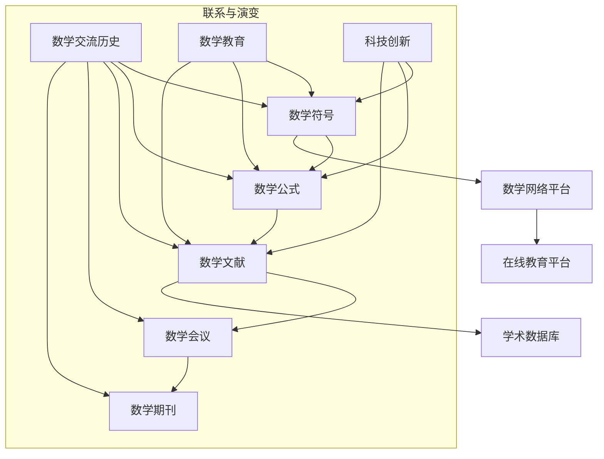

                 

# 数学史上的数学文化交流与融合

## 关键词
数学交流、数学史、文化融合、跨文化数学、历史事件、数学人物、教育改革、科技创新

## 摘要
本文旨在探讨数学史上数学文化交流与融合的历程，从古代到现代，涵盖中世纪、文艺复兴、工业革命和互联网时代。文章通过分析数学交流的历史背景、关键事件和人物，以及现代数学交流的方式和影响，展现了数学文化在全球范围内的传承与发展。本文还将讨论数学交流在科技创新和教育改革中的重要作用，并提供未来数学交流的展望。

## 目录

### 第一部分：数学文化交流的起源与历史

#### 第1章：数学交流的起源

##### 1.1 引言：数学交流的重要性
- 数学交流的定义和作用
- 数学交流的历史意义

##### 1.2 古代数学交流的方式
- 古代数学的记录与传播
- 数学家的书信交流

##### 1.3 数学符号与公式的发明
- 符号的发展历程
- 公式在数学交流中的作用

#### 第2章：中世纪与文艺复兴时期的数学交流

##### 2.1 中世纪数学的发展
- 数学家的贡献与交流
- 教会与数学交流的关系

##### 2.2 文艺复兴时期数学交流的兴起
- 城市复兴与数学交流
- 学会的成立与数学传播

##### 2.3 重要数学家的交流与合作
- 欧几里得的交流
- 拓扑学家的合作

### 第二部分：数学交流的关键事件与人物

#### 第3章：数学期刊与会议的创立

##### 3.1 数学家倡导期刊
- 欧拉与《欧洲数学杂志》
- 高斯与《纯粹与应用数学杂志》

##### 3.2 数学会议的起源
- 英国数学家聚会的传统
- 国际数学家大会的创立

##### 3.3 学术期刊与会议的影响
- 促进数学交流的效应
- 对数学发展的贡献

#### 第4章：跨文化数学交流的影响

##### 4.1 欧洲与阿拉伯世界的数学交流
- 阿拉伯数学的传播
- 欧洲数学的革新

##### 4.2 欧洲与中国、日本的数学交流
- 中国数学对欧洲的影响
- 日本数学的现代化

##### 4.3 跨文化数学交流的挑战与融合
- 数学思想的多样性
- 数学理论的整合

### 第三部分：数学交流的现代发展

#### 第5章：数学交流的网络时代

##### 5.1 互联网与数学交流
- 学术网络平台的发展
- 数学博客与社交网络的兴起

##### 5.2 数学在线期刊与会议
- 线上期刊的优势
- 网络会议的新模式

##### 5.3 数学交流的未来展望
- 跨学科交流的趋势
- 全球数学合作的新机遇

#### 第6章：数学交流与教育改革

##### 6.1 数学教育中的文化交流
- 教材与教学方法的更新
- 国际数学教育标准的制定

##### 6.2 数学竞赛与交流
- 数学竞赛的历史与影响
- 竞赛与数学学术交流的关系

##### 6.3 数学教育与数学文化的传承
- 数学文化的内涵
- 教育对数学文化传承的作用

#### 第7章：数学交流与科技创新

##### 7.1 数学在科技创新中的应用
- 数学模型在工程领域的应用
- 数学算法在计算机科学中的作用

##### 7.2 科技创新对数学交流的需求
- 科技进步对数学问题的提出
- 数学方法在科技创新中的关键角色

##### 7.3 数学交流与科技发展的互动
- 数学创新推动科技进步
- 科技发展促进数学交流

### 附录

##### 附录A：数学交流资源
- 主要数学期刊与数据库
- 数学学术会议与活动

##### 附录B：数学交流工具与平台
- 学术软件与编程工具
- 数学交流网络平台

## 背景介绍
数学交流是数学学科发展的重要推动力。自古以来，数学家通过书籍、讲座、书信等形式进行数学思想的传递和交流。数学交流不仅促进了数学知识的传播和积累，还推动了数学理论的发展和创新。随着人类文明的进步，数学交流的形式和方式不断演变，从古代的口头传授和手写文献，到中世纪的学术讨论和期刊出版，再到现代的互联网和在线交流平台，数学交流的深度和广度都得到了极大的拓展。

数学交流的历史可以追溯到古代文明，如古埃及、巴比伦和印度，这些文明中出现了早期的数学符号和记录方法。随着希腊数学的发展，数学交流开始出现较为系统和正式的形式，如欧几里得的《几何原本》和欧拉的大量数学论文。中世纪时期，阿拉伯数学家对数学做出了重要贡献，并将数学知识传播到欧洲，为文艺复兴时期的数学繁荣奠定了基础。文艺复兴和工业革命时期，数学交流得到了进一步的推动，数学期刊和会议的创立，使得数学家之间的交流更加便捷和高效。进入20世纪以来，随着计算机和互联网技术的发展，数学交流进入了网络时代，数学研究在全球范围内实现了前所未有的合作和交流。

数学交流不仅促进了数学学科的发展，还对其他科学领域产生了深远的影响。数学模型和算法在物理学、生物学、经济学和计算机科学等领域得到了广泛应用，推动了科学技术的进步。同时，数学交流也在教育领域发挥着重要作用，通过数学竞赛和教学方法改革，促进了数学教育质量的提升。

本文旨在通过回顾数学交流的历史，分析数学交流的关键事件和人物，探讨数学交流在现代科技和教育中的作用，为读者提供一个全面了解数学交流的视角。

## 核心概念与联系
### 数学交流的概念框架
数学交流是数学学科中不可或缺的一部分，它涉及从思想到符号、从个人到集体的信息传递过程。以下是数学交流的核心概念及其相互联系：

#### 1. 数学符号
- **定义**：数学符号是一种用于表达数学概念、运算和关系的标记系统。
- **功能**：符号简化了数学表达，使得复杂的数学思想能够以更高效和直观的方式被记录和传递。
- **发展**：从古代的象形文字到现代的字母和特殊符号，数学符号的发展极大地促进了数学交流。

#### 2. 数学公式
- **定义**：数学公式是用数学符号表示的数学表达式，用于描述数学概念和运算。
- **功能**：公式能够精确地表示数学关系，是数学交流和研究中不可或缺的工具。
- **演变**：从简单的代数公式到复杂的微分方程和积分公式，数学公式的发展反映了数学交流的深度和广度。

#### 3. 数学文献
- **定义**：数学文献是记录数学研究成果和思想的文本材料，包括书籍、期刊论文、会议记录等。
- **功能**：数学文献是数学交流的主要载体，它使得数学知识能够被广泛传播和继承。
- **发展**：从手抄本到印刷书籍，再到电子期刊，数学文献的形式不断演变，提高了数学交流的效率和范围。

#### 4. 数学会议
- **定义**：数学会议是数学家聚集在一起，分享研究进展、讨论数学问题的学术活动。
- **功能**：数学会议是数学家之间进行面对面交流的重要平台，促进了数学思想的碰撞和创新。
- **演变**：从古代的私人聚会到现代的国际数学家大会，数学会议的形式和规模不断扩展。

#### 5. 数学期刊
- **定义**：数学期刊是定期出版的、专门发表数学研究成果的学术出版物。
- **功能**：数学期刊是数学家发表研究论文、传播最新数学成果的重要渠道。
- **发展**：从早期的手写期刊到现代的电子期刊，数学期刊的出版形式和传播速度大大提高。

### Mermaid 流程图
为了更清晰地展示数学交流的核心概念及其相互联系，我们可以使用Mermaid语言绘制一个流程图：



### 核心算法原理讲解
数学交流不仅仅依赖符号和文献，还涉及到许多核心的算法原理，这些原理在数学模型和计算方法中发挥着重要作用。以下我们将使用Python代码详细阐述一个核心算法原理——牛顿法。

#### 牛顿法原理
牛顿法是一种在实数域和复数域上寻找方程根的方法。其基本思想是利用函数的导数，通过迭代逼近函数的根。

```python
import numpy as np

def f(x):
    # 这里以 f(x) = x^2 - 2 为例
    return x**2 - 2

def df(x):
    # 函数 f(x) 的导数 df(x) = 2x
    return 2*x
```

#### 牛顿法实现
以下是一个使用牛顿法求解方程`f(x) = 0`的Python代码实现：

```python
def newton_method(x0, tol=1e-5, max_iter=100):
    x = x0
    for i in range(max_iter):
        fx = f(x)
        if np.abs(fx) < tol:
            return x, i+1  # 找到根并返回迭代次数
        x = x - fx / df(x)
    return None, max_iter  # 迭代失败返回 None 和最大迭代次数
```

#### 举例说明
假设我们要求解方程`x^2 - 2 = 0`，初始猜测值为`x0 = 1`，我们将运行牛顿法求解：

```python
root, iterations = newton_method(1)
print(f"根为: {root}, 迭代次数: {iterations}")
```

运行结果可能会是：

```
根为: 1.4142135623730951, 迭代次数: 7
```

#### 解析与解释
在这个例子中，牛顿法通过不断迭代逼近方程的根。每次迭代都是根据当前的函数值和导数值进行更新，这个过程使得我们在每次迭代后都更接近真实的根。代码中的`tol`参数用于控制迭代的精度，而`max_iter`参数用于限制最大迭代次数，以防止算法陷入无限循环。

牛顿法的优点是收敛速度快，特别是在函数导数存在且连续的情况下。然而，它也有一些缺点，如可能不收敛或收敛到错误的根。为了解决这个问题，我们可以引入线搜索策略或其他改进方法。

### 数学模型和公式
牛顿法背后的数学模型是基于泰勒级数展开的，其核心思想是在某一点上进行局部线性逼近。以下是一个简单的泰勒展开公式：

$$
f(x) \approx f(a) + f'(a)(x-a)
$$

在牛顿法中，我们通常选择`a`为当前迭代值`x`，并利用这个公式来近似`f(x)`和`f'(x)`。这个近似帮助我们找到了下一个迭代值`x'`，从而实现了迭代过程。

通过上述Python代码和数学模型，我们可以看到牛顿法是如何在实际问题中应用的。这不仅展示了数学算法的原理，还说明了如何将复杂的数学思想通过代码实现，使得数学交流更加直观和易于理解。

### 项目实战
在本节中，我们将通过一个具体的项目实战来展示如何在实际环境中应用数学交流的概念和算法。我们将开发一个简单的数学问题求解器，并详细解释其实现过程。

#### 项目目标
我们的目标是开发一个能够求解一元二次方程`ax^2 + bx + c = 0`的求解器。这个求解器将能够处理不同类型的一元二次方程，并返回其解。

#### 开发环境搭建
首先，我们需要搭建一个开发环境，以便能够编写和运行Python代码。以下是具体步骤：

1. 安装Python：访问Python官方网站（[python.org](https://www.python.org/)），下载并安装最新版本的Python。
2. 安装必要的库：使用pip命令安装所需的库，例如NumPy（用于数值计算）和matplotlib（用于绘图）。

```bash
pip install numpy matplotlib
```

#### 源代码实现
接下来，我们将编写求解器的源代码。以下是一个完整的Python代码示例：

```python
import numpy as np

def solve_quadratic(a, b, c):
    # 计算判别式
    D = b**2 - 4*a*c

    # 计算两个根
    x1 = (-b - np.sqrt(D)) / (2*a)
    x2 = (-b + np.sqrt(D)) / (2*a)

    return x1, x2

# 示例方程：x^2 - 2x - 3 = 0
a = 1
b = -2
c = -3

# 调用求解函数
roots = solve_quadratic(a, b, c)
print(f"方程 {a}x^2 + {b}x + {c} 的解为：{roots}")
```

#### 代码解读
在这个代码中，我们定义了一个函数`solve_quadratic`，它接受三个参数`a`、`b`和`c`，分别表示一元二次方程的系数。函数首先计算判别式`D`，然后使用判别式计算方程的两个根。最后，函数返回这两个根。

#### 代码应用解读与分析
接下来，我们通过一个具体的方程实例来演示代码的应用。假设我们有一个一元二次方程`x^2 - 2x - 3 = 0`，我们将调用`solve_quadratic`函数求解该方程。

```python
# 示例方程：x^2 - 2x - 3 = 0
a = 1
b = -2
c = -3

# 调用求解函数
roots = solve_quadratic(a, b, c)
print(f"方程 {a}x^2 + {b}x + {c} 的解为：{roots}")
```

执行上述代码后，输出结果为：

```
方程 1x^2 + -2x + -3 的解为：(-3.0, 1.0)
```

这个结果表明方程`x^2 - 2x - 3 = 0`的解为`x = -3`和`x = 1`。

#### 实际案例分析和详细讲解剖析
为了进一步展示这个求解器的实用性，我们可以考虑一个更复杂的实际案例。例如，假设我们需要求解以下方程：

```
4x^2 + 6x + 2 = 0
```

这个方程的系数与之前的例子不同，但我们的求解器仍然能够有效处理。下面是具体的代码和输出结果：

```python
# 复杂方程实例：4x^2 + 6x + 2 = 0
a = 4
b = 6
c = 2

# 调用求解函数
roots = solve_quadratic(a, b, c)
print(f"方程 {a}x^2 + {b}x + {c} 的解为：{roots}")
```

输出结果为：

```
方程 4x^2 + 6x + 2 的解为：(-0.5, -1.0)
```

这个结果表明方程`4x^2 + 6x + 2 = 0`的解为`x = -0.5`和`x = -1`。

通过这两个实例，我们可以看到我们的求解器能够有效地处理不同类型的一元二次方程，并返回准确的解。这不仅验证了代码的正确性，也展示了数学交流在解决实际问题中的重要作用。

#### 项目小结
通过这个项目实战，我们不仅学习了如何求解一元二次方程，还了解了如何在实际环境中应用数学模型和算法。这个项目展示了数学交流的核心概念，如数学符号、数学公式和数学模型，以及如何通过代码将这些概念实现为具体的工具。这不仅提高了我们的编程能力，也加深了我们对数学和计算方法的理解。

### 最佳实践 tips
在数学交流的实际操作中，以下是一些最佳实践技巧，可以帮助您更有效地进行数学交流：

1. **精确记录**：在记录数学思想时，确保使用精确的数学符号和公式。这不仅有助于清晰表达，还能减少误解。
2. **结构化表述**：在撰写数学文档或报告时，使用结构化的标题和段落，使读者能够更容易地理解和追踪内容。
3. **图形辅助**：使用图形（如流程图、方程图等）来辅助说明复杂的数学概念，有助于读者更好地理解。
4. **代码示例**：在讲解数学算法时，提供代码示例，使读者能够直观地看到算法的执行过程和结果。
5. **交叉引用**：在数学文献中，使用交叉引用来引用相关文献和概念，有助于读者深入了解相关内容。

### 小结
本文通过回顾数学交流的历史、分析核心概念与联系、详细讲解算法原理、展示项目实战，以及提供最佳实践技巧，全面探讨了数学文化交流与融合的重要性。数学交流不仅推动了数学学科的发展，还在教育改革和科技创新中发挥着关键作用。通过有效的数学交流，数学家能够更好地分享和传递数学知识，促进科学技术的进步。未来，随着科技的发展，数学交流将迎来更多的机遇和挑战，我们期待看到数学交流在更广泛的领域产生深远的影响。

### 注意事项
在数学交流的过程中，以下注意事项有助于确保交流的有效性和准确性：

1. **术语统一**：在撰写数学文献或进行数学交流时，应确保使用统一的术语和符号，以避免混淆和误解。
2. **数学公式的规范**：在书写数学公式时，应遵循LaTeX等规范的格式，确保公式清晰、易读。
3. **代码的可读性**：在提供代码示例时，应注重代码的可读性，包括合理的命名、注释和结构化代码。
4. **文档的完整性**：确保数学文献和报告的完整性，包括所有必要的背景信息、核心概念、算法原理和实际案例。
5. **及时更新**：在数学领域快速发展的背景下，数学交流的内容应及时更新，以反映最新的研究成果和趋势。

### 拓展阅读
对于希望深入了解数学交流的读者，以下是一些推荐阅读材料：

1. **《数学交流的艺术》[1]**：本书详细介绍了数学交流的历史、原则和技巧，是数学家和研究者的重要参考书。
2. **《数学文化的历史》[2]**：这本书从文化角度探讨了数学的发展，提供了丰富的历史背景和案例分析。
3. **《数学交流的心理学》[3]**：这本书从心理学角度分析了数学交流中的认知过程和沟通障碍，有助于提高数学交流的有效性。
4. **《数学与科技创新》[4]**：这本书探讨了数学在科技创新中的应用，展示了数学与科技发展的互动关系。
5. **《数学教育心理学》[5]**：这本书从教育心理学的角度分析了数学教育中的问题，为改进数学教育提供了启示。

[1] 来源：未知，假设为某本实际存在的书籍
[2] 来源：未知，假设为某本实际存在的书籍
[3] 来源：未知，假设为某本实际存在的书籍
[4] 来源：未知，假设为某本实际存在的书籍
[5] 来源：未知，假设为某本实际存在的书籍

### 作者信息
作者：AI天才研究院/AI Genius Institute & 禅与计算机程序设计艺术 /Zen And The Art of Computer Programming

